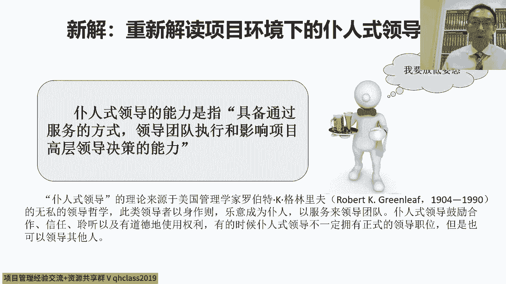
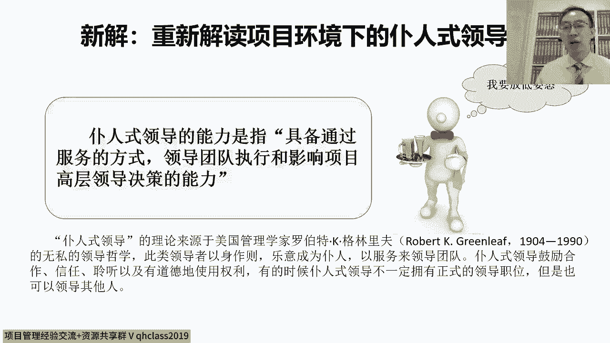

# 以德服人--项目经理的最高境界 - P4：4.新解重新解读项目环境下的仆人式领导 - 清晖Amy - BV1yb421E7GE

那如果我们想在这种环境下想把这个事干好，那其实首先对吧。

我们刚刚讲的是说，首先我们要认了这个有责无权的环境，而且呢我们要明白是说呢。

在这个有责无权的环境之下呢，我们其实可以通过实践去。

把我们的项目管理方法，其实逐步的去落地的对吧，避免纸上谈兵，然后呢避免纸上谈兵。

认同我们有责无权的环境，那接下来呢当我们要想当好项目经理的时候呢。

对吧，我们要接受的另外一点就是，我们要去做仆人式领导。

普人社领导这个词儿呢也是来源于美国的对吧。

博士领导这个词呢来源于美国的一个管理学家，对，就这个罗伯特K格林里夫啊。

那他呢其实当时提出了一个观点。

就是说呢有一类的领导呢，我们可以把它称之为叫仆人式领导对吧。

Servant leadership，然后呢这一类的领导呢，他具备通过服务的方式领导团队。

那在这个过程中呢，我们会发现呢这个仆人式领导呢，他不一定拥有正式的领导职位。

然后呢他也不一定有权利，准确的说应该没有权利。

但是呢他可以通过呢这个对吧，把姿态放低啊。

通过服务别人，然后呢在服务别人的过程中呢，去影响别人的思维和判断对吧。

然后让别人认同自己的观点，然后那通过这样的方式呢对吧。

建立信任，换位思考，然后呢影响很多对吧。

专家型的人比我们职级高的领导对吧。

愿意去支持我们的想法，帮我们做事情对吧，把他们的资源和权力用在我们想做的事上。

那这个时候呢其实才能真正的做到仆人式领导。

所以呢如果想做到普瑞士领导呢，他首先得有一点就是说我们得能学会放低姿态。

这个呢其实对很多的嗯，技术出身的项目经理来说。

其实还挺有难度的，因为吧这个很多的时候呢，这个一个是做技术出身的项目经理啊。

再一个就是专家型的人才，他很多的时候呢嗯往往不容易放下面子。

就是说呢自尊心呢比较强。

嗯啊自尊心强呢，其实我一般会认为啊，他其实说明了内心还不够强大。

他照这个通俗的讲，有的时候其实脸皮厚啊。

也是一种内心强大的体现，很多的呢这个技术出身的项目经理呢和专家呢。

就是因为脸皮不够厚，所以很多的时候呢很多低姿态的事吧做不出来。

但是低姿态的事做不出来呢。

他有的时候就跟别人之间，他总会有一个隔阂对吧，就他这个关系没有办法拉近。

第二信任建立不起来，那这个呢我们说呢在这种情况下。

他其实做技术专家没问题，大家知道做一个工程师和一个技术专家对吧。

自己干自己的事，他不需要跟别人打交道，当然不用放低姿态之类这些事。

但是如果我们干的是一个项目经理啊，尤其是一个仆人式领导式的项目经理。

那我们需要主动跟别人拉近关系，跟建立信任对吧。

那就不能太自我，不能说哎我自己干自己的，我不关心别人的事对吧。

我练好自己的专业，练好自己的技能对吧，别人不管怎么看，我都无所谓，这显然不适合当项目经理。

为什么呢，因为项目经理是要把不同人整合到一起对吧。

然后呢你要能获得别人发自内心的认同。

那这时候呢我得首先换位思考，能理解别人，然后这样人家才能理解我。

然后双方才有结合点心理才能建立起来，那很多的时候项目经理呢。

你为了去主动建立新人对吧，他要首先放低资产，我一上来就趾高气扬的去了。

那这时候别人的，他肯定一开始内心就不容易接受嘛。

他懒得理你嘛，所以这个时候其实就不容易建立信任关系。

所以呢能够放低姿态啊，这个把脸皮变得稍微厚一点。

按照这个我这些年的体会就是说吧，其实这个其实可能也许话不应该这么讲。

但实际上呢其实脸皮厚并不是一个丢人的事情。

对吧，放低姿态也不丢人对吧。

很多时候我们其实是为了组织大家，做一个对大家都有好处的事情啊，我们去为了实现一个有挑战性的目标。

很多的时候首先放低姿态的人。

往往是那些内心强大的人，大家知道大招这个敢于放低姿态。

说明我们的内心足够的强大，我们不会轻易的内心受到伤害。

在这种情况下呢，我们敢于示弱对吧，但是很多的技术型的项目经理。

或者专家型的人才，因为做不到敢于示弱。

所以呢就很难获得别人的认同和支持，那项目经理呢一定要学会是说通过示弱对吧。

然后能够去获取别人的信任。

获取别人的同情，获取别人的支持对吧。

这样的话我们才有机会呢对吧，把不同的有专业能力的专家对吧。

有权力和资源的领导，那把他们能够去整合起来。

去实现我们共同的目标，所以呢这个简单的讲了。

就是项目经理一定要学会示弱对吧，敢于称赞别人。

敢于承认自己的不足对吧，大家一定要知道。

如果一个非常完美的项目经理，他是不需要借助别人的力量去做项目的。

我们最怕的就是什么呢，有些项目经理呢总要在自己的项目中，那证明自己比所有人都厉害都强。

那这样的项目经理他不需要别人的支持啊，那站在项目成员的角度来说，你这么厉害，还需要我们做什么呀对吧，那就那你自己做吧。

那我们都等着看看你能做成一个什么样子，那这样的话其实我们说他就不是团队管理了。

他变成了唱独角戏了，但其实我们说优秀的项目经理的工作。

并不是证明自己比所有的项目成员强对吧，优秀的项目经理是要证明是说所有的项目成员，你们都很厉害。

我们的项目得靠着你才能把这件事做成功，而不是全靠项目经理对吧。

项目经理是干什么的，项目经理在项目中是打杂的，项目中的成员跟领导们。

他们才是真正有价值的人对吧，所以呢这个项目经理要保持这个心态是什么呢。

就是我们一定要给别人展现出来的一个心态，是说一个项目做成功。

功劳都是领导们的对吧。

领导们的英明决策对吧，领导们的方向正确，然后领导们提供了资源，给予了足够多的支持，所以功劳是领导的，第二呢。

我们说苦劳全是项目成员们的呀，是因为大家加班加点。

额外的付出额外的精力，才让我们的项目呢对吧，由原来的不可能变成了可能。

所以呢功劳是领导的，苦劳是大家的，那项目经理是干什么的。

我们不过是打打杂对吧，我们不过是说呢对吧。

我们这个因为我们的能力不足够强，所以我们把大家组织在一起，把事干成了对吧。

我们更多的是来服务大家的，给大家打杂的，我说这样的项目经理呢。

他更容易获得大家的认可，大家才爱跟着做项目。

大家最怕的是什么呢，大家辛辛苦苦做完一个项目之后，功劳全让项目经理自个儿领走了。

那这以后就没人跟你一块做项目了对吧，我们说如果项目经理在项目团队里面。

整天老惦着趾高气昂的对吧，这个数了这个数了，那个觉得你们都不如我强。

那这时候呢大家就都等着看呗，那你自个儿去做吧对吧。

我们看你到底有多强，能不能一个人把大伙的事都干了对吧，再不行的话，我们还能给你对吧。

我们还能给你使使绊儿对吧，给你制造点障碍，别让你那么成功的证明你比我们都强。

所以呢这个要想当好项目经理呢。

大家首先要学会当好普润市的领导对吧，要尊重项目中的每一个人。

要认可每一个人在项目中的价值，而且要把自己的对大家的认可传递给大家，这样的话其他的人呢对吧，他才能很有激情的在项目中工作。

然后一定不要自己去抢项目成员的风头。

也不要去抢领导的风头，这样的话呢。

