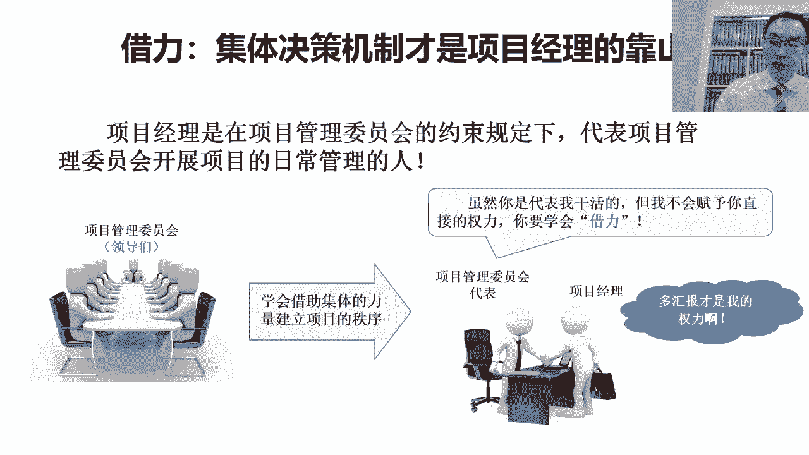
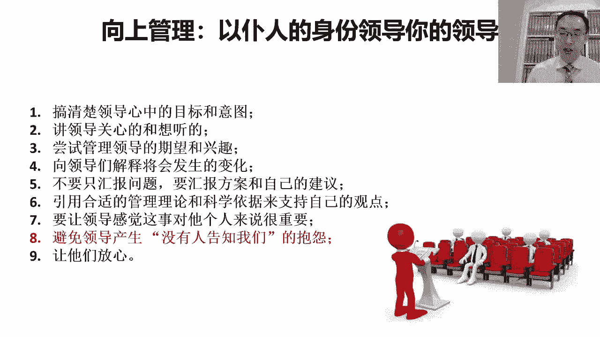

# 以德服人--项目经理的最高境界 - P5：5.借力集体决策机制才是项目经的靠山 - 清晖Amy - BV1yb421E7GE

除了这个项目经理的这个心态之外呢，我们说普润市领导的姿态呢，还有一点呢，其实我们在项目过程中，项目经理也是必须要去锻炼的，就是关于呢这个如何在项目中啊，借助集体的力量来建立项目秩序的这件事。

大家知道这个项目管理呢来源于西方对吧，来源于美国，那项目管理的这种工作方式呢，它跟职能管理是用来互补的，他俩最大的区别就是在于呢，其实这个职能管理科层制啊，他是领导负责制。

团队领导负责制就是团队成员的错都算领导的，所以呢领导有权利，他有责任，他责权是对等的，但是项目管理呢它其实跟职能管理的方式吧，他不一样，所以他俩才能互补，项目管理的方式是什么呢，项目管理的方式。

真正的决策不是在项目经理身上，项目经理不负责决策，项目中的决策，他其实是集体的，为什么呢，他跟这个事有关系，项目管理呢跟传统的工作，运营类的工作最大的区别，就是说传统的运营类的工作。

干的是大家熟悉的工作，那熟悉的工作呢他一定就有有经验的人，那通常呢企业会把最有经验的人呢变成领导，然后让他看着大家，然后去带着大家，然后这时候呢大家不容易犯错，因为最有经验的那个人。

他负责看着大家谁如果犯错，他会制止，而且他会教大家如何不犯错，所以呢往往就是有经验的，但没有经验的，所以在这种情况下，有经验的对没有经验的负责，这样他才能够让有经验的人去不断的培养，没有经验的人。

但这是传统的常规性的管理，项目管理呢刚好是反着的，项目呢是创新的载体，变革的载体，项目上所承载的工作呢，其实往往都是大家不熟悉和不擅长的，就是我们说的创新类的工作，当我们呢其实组织一群人呢。

去干一个创新类的工作的时候，坦诚的讲，没有任何一个人有绝对的把握对吧，可以去决策项目中的每一个点都是对的，但是而且还有一点呢，这个带队的人吧，如果自己做了一个决策，一旦犯错了，大伙就不信你了。

因为本来这件事可能将来到底怎么干，是对的，都不知道对吧，大家开始首先将信将疑的跟着你去做事情，结果后来发现你带头做了几次决策都错了，那这时候就没有人信你了，那这时候这个团队就会散的。

但是很多的时候创新型的工作他不可能补错呀，对吧，我们有一句古话叫失败是成功之母，对没有失败过怎么能成功呢对吧，就算是说第一次做可能就成功了，但是因为并不止没有对比，我们就不知道什么叫成功。

可能还得再失败两次再想哎呦，发现哦，原来第一次是成功的，所以呢这也意味着是什么呢，做一个创新型的工作，他一定会经历失败，然后取得成功，那如果是说前几次失败，责任都算在带队的人身上。

那这时候那很有可能还没有等到成功的时候，大家就不跟这个带队的人一块干了，所以大家觉得你这净给我往沟里带，没有人信了，所以呢为了避免这种问题的出现呢，在这个开展创新型的这种工作。

进行这种团队这个组建的时候呢，那往往呢我们把犯错误的机会留给谁呢，留给了集体，换句话说呢，这种创新型的组织啊，承载这种创新工作的这种组织，就是我们说的项目，真正的决策来源于集体决策，什么叫集体决策呢。

就是项目中所有的相关方共同的决策，再换句话说呢，要错大家一块错，算大伙的对吧，大家的错就不叫错，大家的错叫在那个状态下能做出来的，最好的一种选择，但是如果是个人做决策，个人做的决策往往有可能是错的。

可能即使是对的，也有可能会被大家认为是错的，所以干创新型的工作的时候呢，这么这里面会有一个会有一个经验对吧，集体的错不叫错，叫对，个人的对不一定叫对，可能也叫错，为什么呢，大家知道。

因为管理没有绝对的对和错，即使是在当前的时间上，我们看起来可能是一个非常正确的事，很有可能再过一段时间，我们再返回来去看，可能我们能想出一个更好的方式，那这时候当初的对可能就变成了错误。

所以呢这个为了避免对吧，个人领导啊因为犯错而失去大家的信任，所以我们会把这个决策这件事呢给到了集体，集体是代表大家对吧，就像我们国家一样，国家的级最高决策是什么，它其实都是代表我们全体人民的。

他是全体人民的这种决策，那这时候呢算大家共同决策的，大家共同决策的，大家都要认嘛对吧，即使错了也是大家一块错了，项目也是一样，在项目在这个项目的这种建组织建设过程中，那在我们的项目中。

我们叫项目管理委员会，看项目管理委员会呢，是代表项目中所有相关方的集体决策机制，他呢是拥有权唯一拥有权力的一个角色，所以项目管理委员会呢在这个项目组织中，他是一个角色对吧，像项目经理是个角色。

项目成员是个角色对吧，项目总监是个角色，项目管理委员会也是一个角色，而且项目管理委员会这个角色他负责做决策，那项目经理是干什么的呢，项目经理呢，他其实首先第一他得组建项目管理委员会。

因为并不是所有的项目，一上来都有项目管理委员会的，很多的公司他可能没有专门的项目管理委员会，他可能都没有空去老管你这个项目的事，他是对整个公司经营负责，他不能只对你这个项目的结果负责。

那这时候如果只有项目经理，而没有项目管理委员会的时候，那这时候这个项目成败，责任自然就落项目经理脑袋上了，那这时候项目经理就会被巨大的压力对吧，可能还要自己拍板，或者自己不拍板呢，那就要经过层层审批。

既负责拍板，但同时又不用对这个项目的最后的成败，负责的时候，那这时候他这个拍板就不一定会，非常符合项目的现状，所以为了避免这种问题呢对吧，避免这种项目经理对吧，既有责任对吧，又没有权利。

可能还老被项目背锅，那为了避免这种现象呢，其实项目经理应该按照一个正确的开展，项目管理的工作方式来做，那正确的方式是什么呢，一定要去组建项目管理委员会，所以呢，项目经理一定要学会张罗项目管理委员会对吧。

我们要去张罗项目中所有相关方的领导对吧，那因为有可能是甲乙方的，可能还得张罗客户方的领导，可能还得张罗供应商的领导，对我们把不同相关方的领导张罗在一块，形成一个集体决策机制。

然后呢我们把项目中所有需要决策的事对吧，都和这帮领导们共同决策，这帮领导们一旦达成共识对吧，项目经理要锻炼的是，如何推动这些领导们达成共识的能力，如果这些不同相关方的领导都达成了共识。

那意味着这就是集体的意志，集体的意志就是大伙的意志，那集体的意志一旦形成，那项目经理代表集体啊去给其他的人，传达集体的角色和要求的时候，这时候没有人会去违背这个的，因为他如果违背这个要求。

证明他违背了整个集体的秩序，他会被集体所抛弃的，一般没有人敢干这种事，但是如果没有项目管理委员会，项目管理推行的任何的要求，可能别人都会认为这是项目经理自己想出来的，这时候大家可能就会逆反，你对吧。

跟项目经理关系好的，我就帮你做了，是因为这个对吧，因为大家关系好，那对项目经理本身不信任的，那就想想你凭什么命令我要求我做事情，所以呢项目经理呢在真正的项目管理中，很多的时候不是代表自己。

他必须要代表项目管理委员会对吧，然后项目经理对别人提的要求，不是项目经理提的，而是传达了委员会的要求，那如果项目经理想让项目中的某一个人做事情，他理论上的方式应该是。

先给项目管理委员会递交一个方案或一个建议，那如果说服了项目管理委员会，认同了自己的方案和建议，那这个时候这个方案和建议，就不再是项目经理的方案和建议，而是项目管理委员会的一个决议或一个决策。

那项目经理就可以理直气壮地，代表项目管理委员会，把项目管理委员会的决议，去传达给那个负责落实的人对吧，然后这时候，那个人其实不是执行项目经理的要求，而是执行了代表集体的项目管理委员会的要求，对吧。

那这个时候其实那个人负责执行的人，多半不会去拒绝，因为他不能拒绝所有的领导以及集体的要求，所以呢项目经理呢再返回来啊，项目经理呢要学会的是说，学会借助集体的力量对吧，帮助我们去建立让项目受控的秩序。

可以去约束项目中不同人的行为，去推动不同的人，去向着我们所需要的方向和目标而努力，但这个的前提是，项目经理要能，首先呐能够去张罗项目管理委员会，当我们在张罗项目管理委员会的时候呢，我们要举着谁的大旗呢。

我们要举着项目发起人的大旗对吧，他一定是有一些高层的领导，他发起了一个项目，赋予了项目经理责任，去张罗其他的这些领导相关方的领导，形成一个给项目做决策的集体决策机制，就是我们说的项目管理委员会。

然后项目经理呢，通过给这个项目管理委员会做汇报对吧，做建议，提供各种方案，去影响项目管理委员会，对项目它本身的认知和决策对吧，然后如果项目管理委员会做出的是项目经理，就认同了项目管理。

项目经理递交的方案，而把它变成了项目管理委员会的一个决议的话，那这时候项目经理就可以顺理成章的，借着项目管理委员会的这个决议，去推动项目中所有的相关方对吧，然后呢按照项目管理委员会的要求去做事情。

通过这样的方式呢，项目经理才有可能真正的为这个项目去，建立起来一个秩序，这个秩序是所有的项目成员，服从项目管理委员会要求的秩序对吧，这个秩序是项目经理，可以通过影响项目管理委员会的决议。

来去组织大家对吧，遵循项目中的秩序，以及朝项目的目标努力的这样的一个状态，所以呢项目经理呢一定要擅长，组建项目管理委员会，给项目管理委会做汇报，通过汇报的方式对吧，然后来去名正言顺的去影响项目中。

不同的相关方的行为，所以呢就像我们这上写的这样，多汇报，这是项目经理最大的权利对吧，项目经理最大的权利，不是替项目管理委员会去拍板，项目经理这个角色往往是不拍板儿的，我们要把拍板的这个重任留给集体。

因为集体错不叫错，个人做个人做错了一定是错，有时候个人做对了可能还都是错对吧，所以项目经理呢多通过汇报的方式，影响项目管理委会的决策啊，然后用借助委员会的力量推动项目的进度，同时确保项目过程受控。

所以呢项目集体决策机制很重要。

然后呢，当我们再去想办法影响这个项目中的项目，管理委员会跟各种领导的时候啊，我们要去学会向上管理的方式对吧，这种向上管理的方式呢，这时候就是说向上管理沟通，那就是说用仆人式领导的方式做沟通。

那沟通的时候呢，我们可能要去做到几点，那首先呢我们首先要做到几点之前，我们要首先讲一定要避免的误区是什么呢。

