# 以德服人--项目经理的最高境界 - P8：8.成为太极高手，不要把矛盾都集中在自己身上 - 清晖Amy - BV1yb421E7GE

再有一点呢就是我们之前其实有提到过，这个项目经理。

他其实挺锻炼这种平衡的能力，因为呢在我们的项目中呢会爆发出各种矛盾。

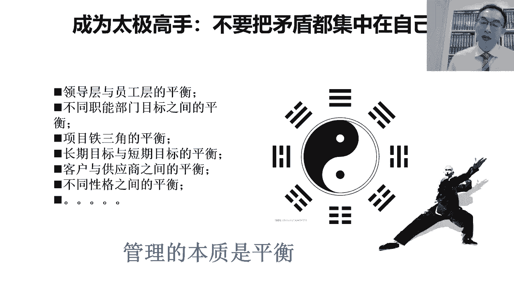

其实我一直认为呢，嗯其实项目它本身就是一个冲突的载体。

项目呢因为有冲突啊。

因为有相关方的矛盾，所以呢才有了创造出令人瞩目的价值的机会。

大家知道这一片平和呀，他是出不来创新。

出不来有创新的这种价值的结果的，那很多的时候正是因为项目中有跨界的矛盾啊。

不同的相关方对吧，比如说这个领导。

领导的期望是来源于对未来的这种战略期望。

跟员工的实际能力之间的差距，或者跟员工现在正干的活儿之间的差距对吧。

不同的部门对吧，我说研发的部门，市场的部门对吧。

供应链的部门，服务的部门，it的部门，不同部门的人。

他关心的目标不一样，导致他们其实在一起协同的时候，关注点不同。

项目中呢有铁三角对吧，时间范围成本中间老是有矛盾的对吧。

那我们说在项目中呢，我们一直要找的是一个时间范围，成本的最佳结合点。

那它也需要平衡，项目中呢有的收益是长期的，有的收益是短期的对吧。

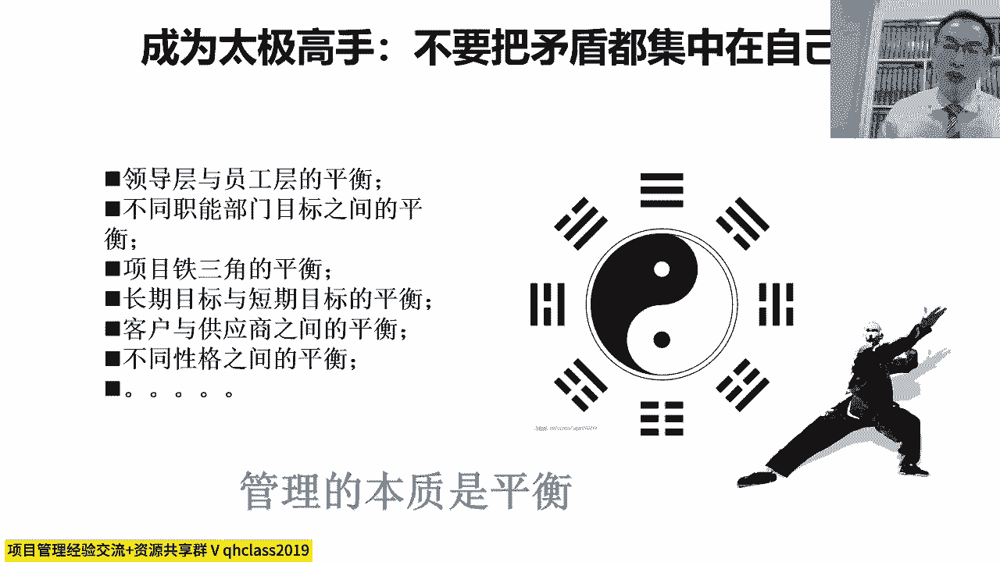

比如说像技术研发类的项目，往往产生一个未来的新的技术的对吧。

一一种先打造一种先进的技术，那这个技术到底能不能给公司带来收益。

它是好多年之后的事了，因为一个新的技术出来，它还要变成一个产品对吧。

一个产品还得能够去工业化或者商业化，或者规模化。

规模化了之后，还得通过很多年的时间去卖给客户再回款，这中间需要一个非常漫长的过程。

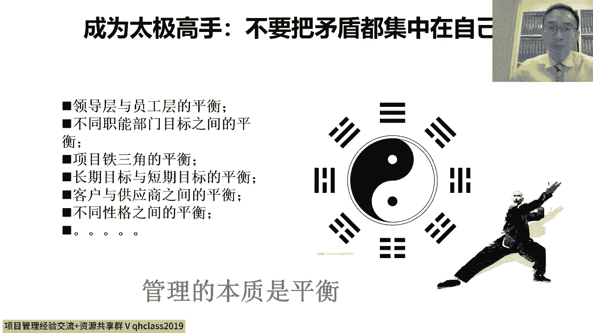

这属于长期目标，很多时候呢这个项目中要做长期的目标。

也就因为我们得打造企业的未来，同时呢又要去做短期目标对吧。

现在经济形势这么差，眼前的钱如果不赚，可能企业活不到明年都死掉了。

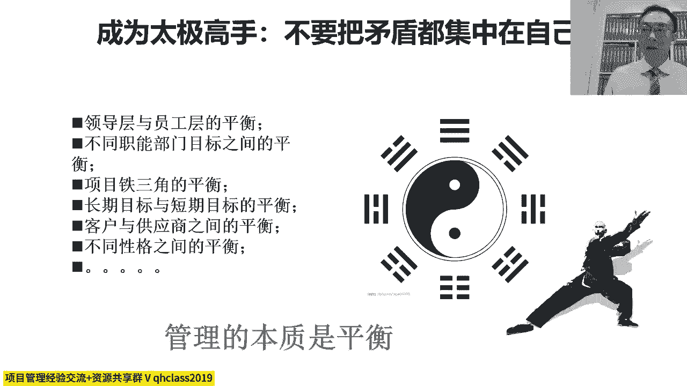

所以这时候呢对吧，要兼顾长期和短期目标。

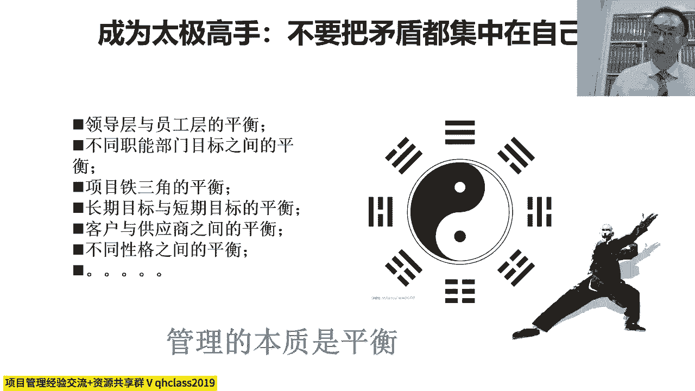

短期的目标往往都是客户当前的诉求对吧。

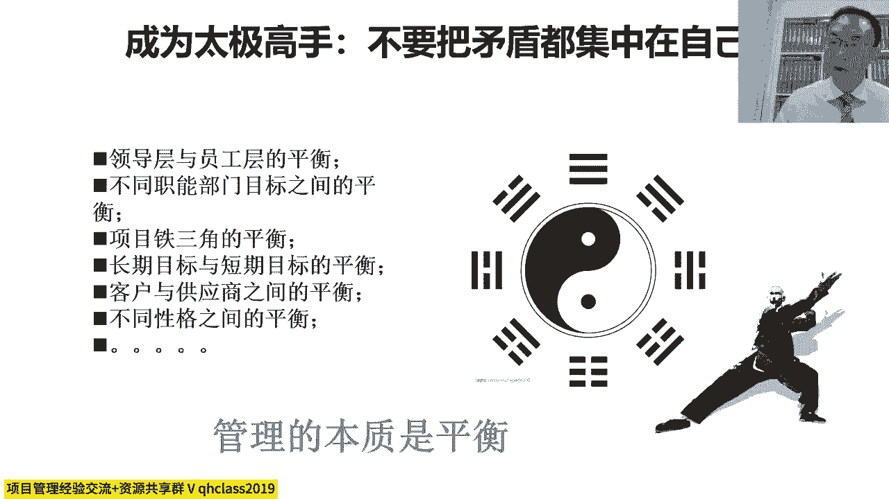

市场的急需能马上回款和赚钱的，长期的目标是企业内在的需求对吧。

是长期在我们的生态体系中建立，我们核心竞争力的需求。

是短期做投入，那可能多少年之后才带来回报的需求都重要。

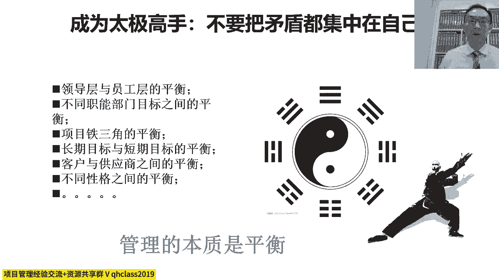

但是要做好平衡，看企业当时的状态。

看项目当时的状态对吧，我们项目的目标是为了长期的目标，还是为了短期的目标对吧。

当前的形势允许不允许我们只做长期的事，不做短期的事。

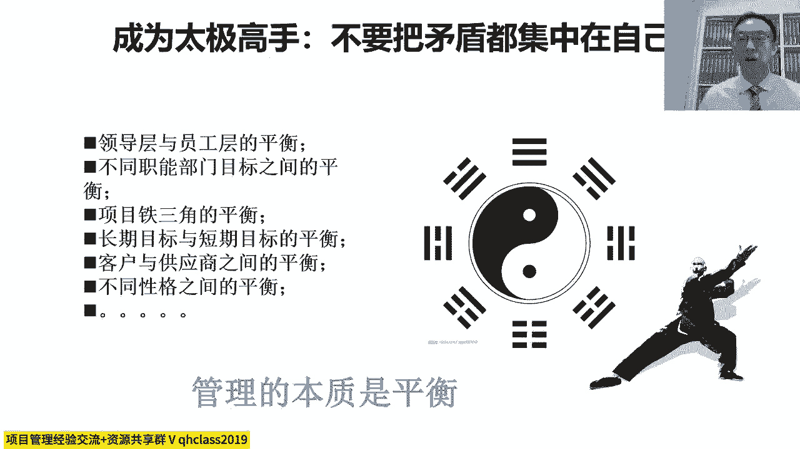

或者如果我们只做短期事，不做长期的事，未来怎么办，这个过程中需要项目经理对吧。

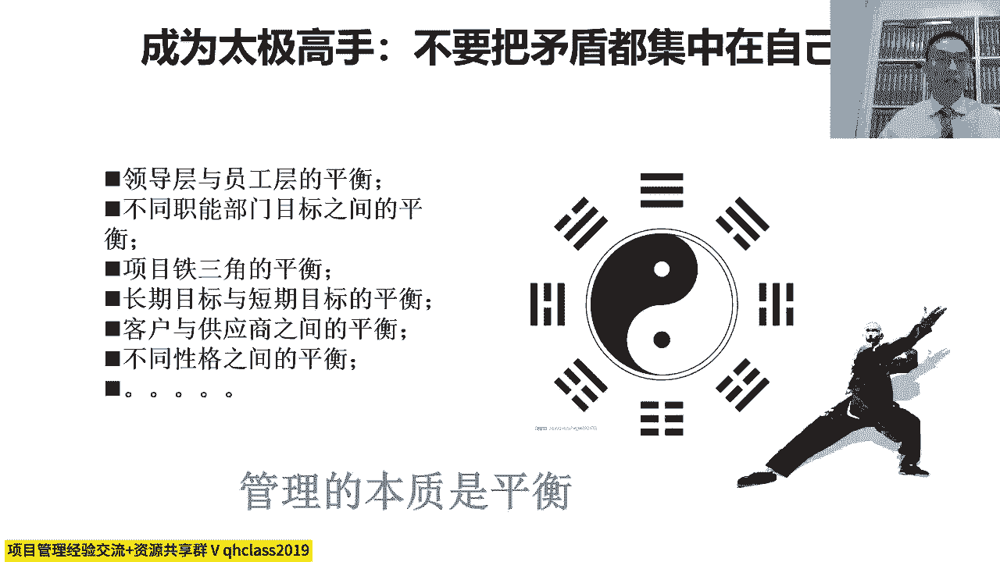

基于项目管理委员会的要求去做平衡，对我们说客户和供应商之间一定是有矛盾的。

客户当然希望是说对吧，所有的项目团队多干活。

少给钱对吧，时间越短越好，那么说站在供应商。

外包商或者承包商承建商的角度来说，那最好就是你给多少钱。

我干多少钱的活对吧，或者呢你多给钱，我少干活，这个东西之间它一定是有矛盾的。

这个过程中需要项目经理去做平衡，我说不同的人。

不同的性格的人凑在一块互相看着不顺眼对吧，他其实并不是因为人有问题。

而是因为大家的背景阅历不同，大家的这个认知不同，追求不同。

这些人凑在一起之后，我们也得让他去合作呀对吧。

因为项目中很多的时候，项目的成功就是来源于不同性格，不同文化，不同背景的人凑在一块去讨论一个相同的事。

当大家终于能达成共识的时候，往往一个非常有价值的创新的产品出现了。

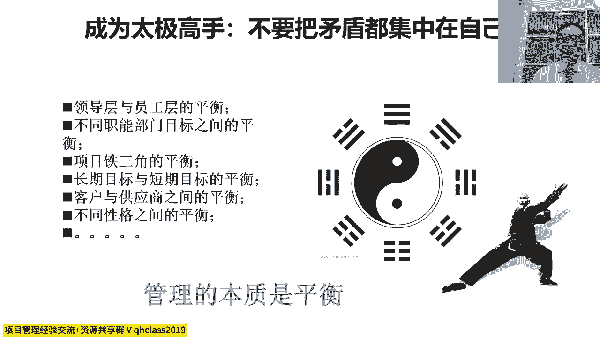

所以呢其实项目管理呢。

它其实就是要去搭建一个跨界冲突的舞台。

然后在这个跨界冲突的舞台上，我们把各种原来大家认为有冲突的事，在这个过程中进行碰撞和磨合对吧。

然后呢希望能够去建立平衡。

那一旦这种平衡建立起来，我们就会出现一个非常优秀和卓越的产品对吧。

所以在这个过程中呢，嗯项目经理呢他逐渐的要学会要圆滑一点。

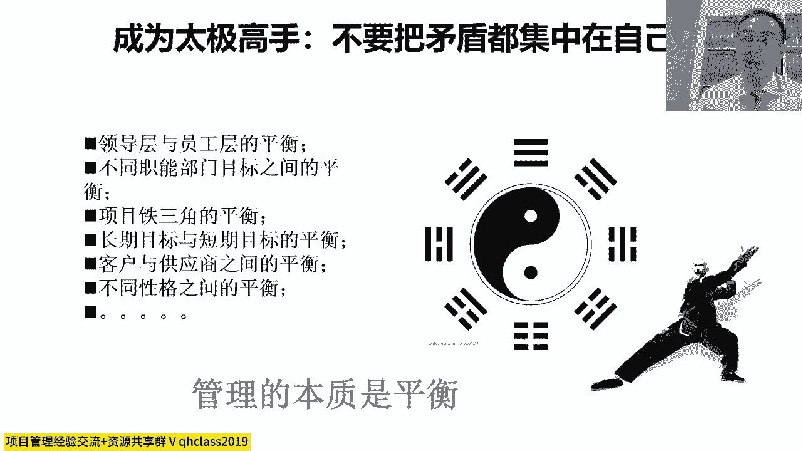

我们说一个优秀的项目经理，一定是一个外圆内方的项目经理对吧。

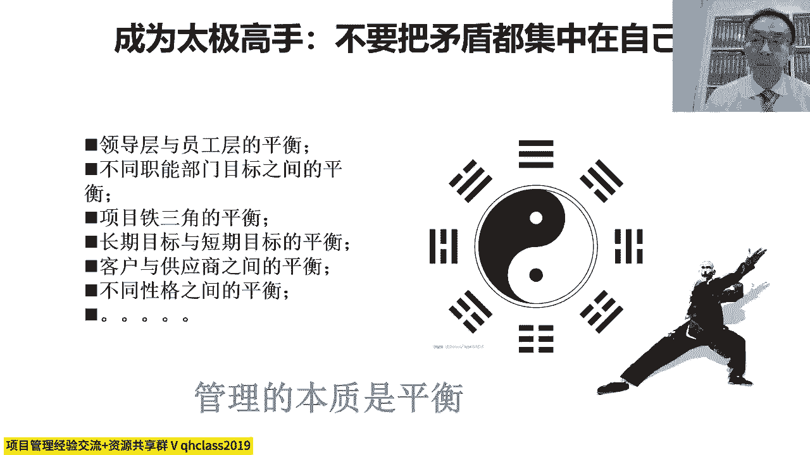

处理问题的方式要灵活，要圆滑。

不要把矛盾都集中在自己身上，因为一旦自己成了矛盾的焦点。

他就很难去帮助别人去平衡对吧，因为大家知道很多的时候。

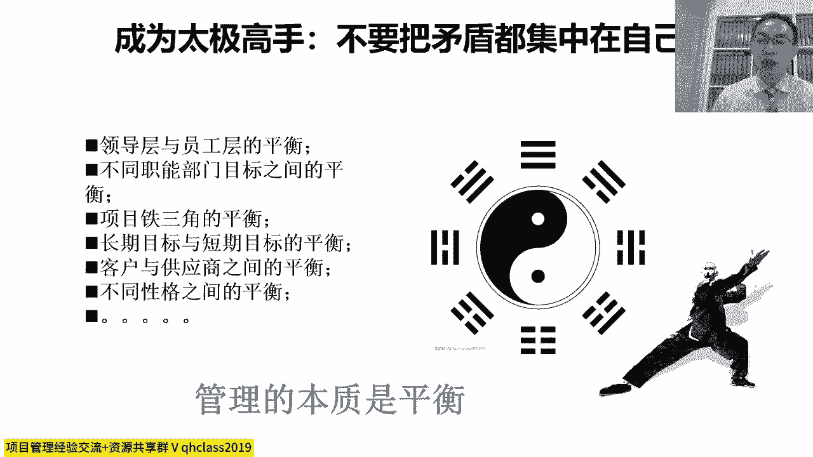

建立平衡是一个劝架的。

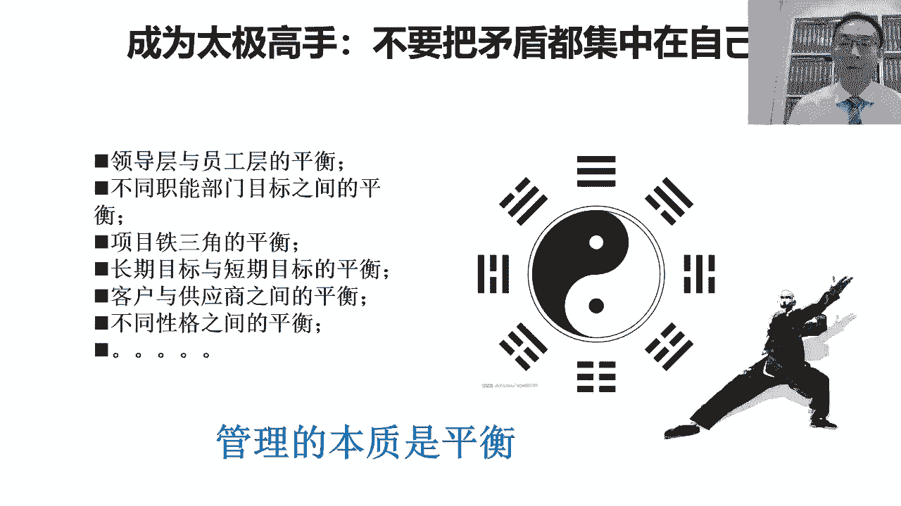

我们不能直接变成了，跟里面所有的方去打架去了，他首先得把自己从这个矛盾中拉出来。

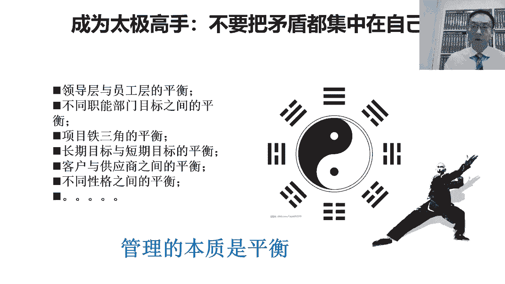

一种旁观者的角度再参与进去，这时候才能更好的帮助大家去建立平衡。

所以呢首先呢大家要能够尝试着。

不要把矛盾集中在自己身上，外援要灵活的去处理，不要轻易的跟别人发生冲突。

内方我们的目标对吧。

我们是坚定的，我们的原则，包括我们自己的一些内心中坚定的东西。

要坚持下去，这个叫内方对吧，我们要坚持我们认为对的。

对的东西和对的目标和对的行为，然后呢。

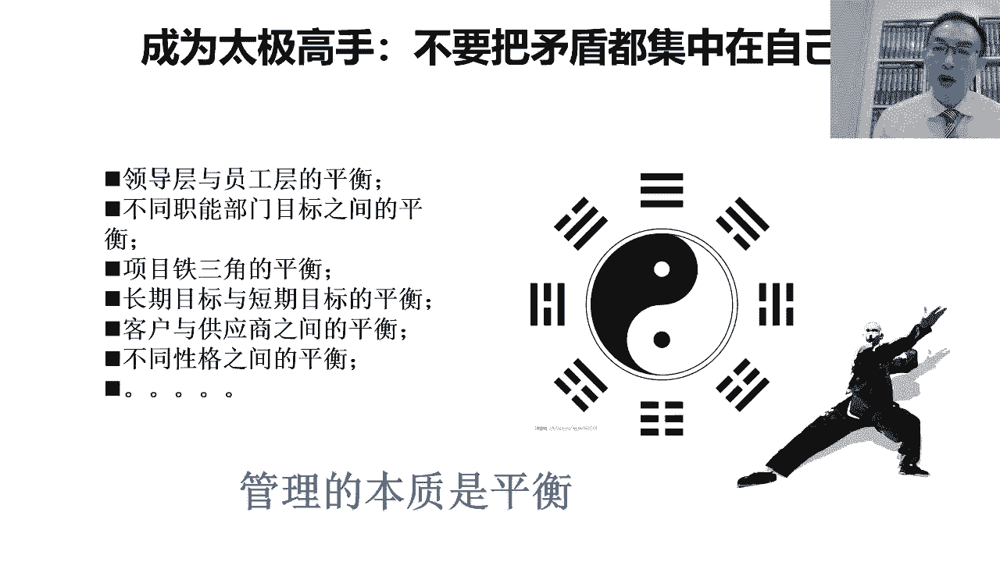

我们所采用的处理问题的方式是圆滑和灵活的，这样的话呢我们才能够去解决各种问题。

我们最怕的是什么呢，有些项目经理的特质是外方内圆。

表面显得很强势对吧，然后甚至有些不近人情对吧。

然后非很要面子，不敢放低姿态。

但实际内心又很脆弱，很容易受到别人的影响对吧。

容易内心摇摆对吧，虽然表面显得很坚强，但是别人说着说着跟着别人跑。

所以这就不符合当项目经理的要求，真正的项目经理是外圆内方对吧。

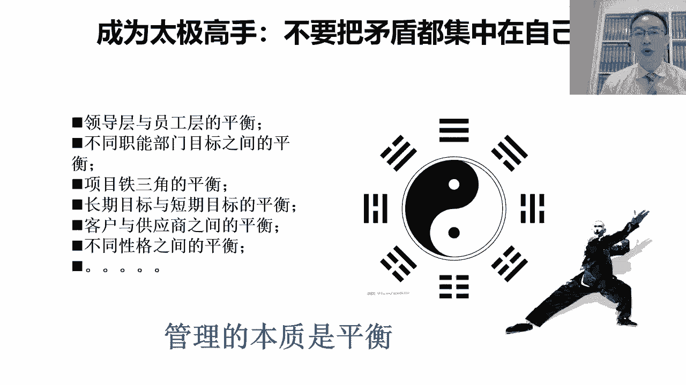

灵活的处理。

在不同的相关方之间，用最短的时间之内找到共同的利益诉求点，建立平衡。

帮助大家建立合力对吧，通过帮助项目管理委员会，提供各种有效的数据跟方案。

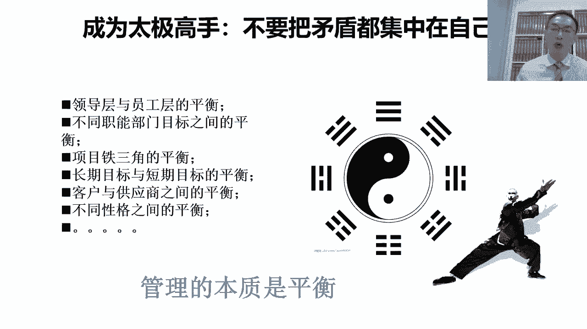

帮助他们在长期目标，短期目标之间做出决策对吧。

帮助他们在时间范围，成本中找到一个合适的结合点。

帮助不同的客户供应商，不同的人对吧，找到他们的共同之处。

帮助他们建立统一战线，然后呢帮助他们变成组织。

形成一个团队，这个才是项目经理真正的价值，这也是项目管理作为一种对吧创新的载体。

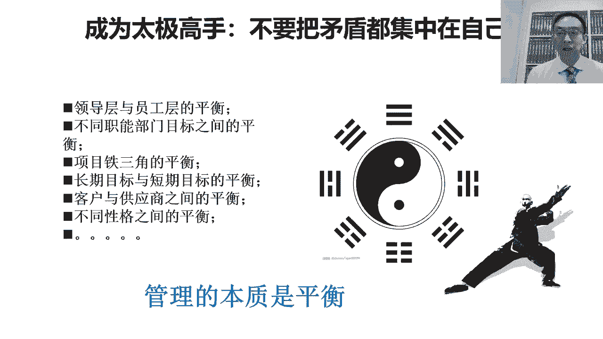

作为一种实现创新型产品或业务。

的组织保障形式，这才是它真正的核心价值所在。

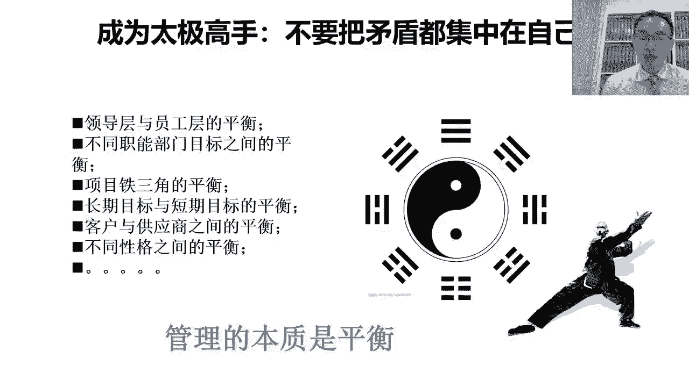

所以呢项目经理一定要善于搭台子。

让不同的相关方在我们的台子上对吧，进行良性的碰撞和冲突，以实现创新对吧。

然后过程中呢帮助他们尽快的统一目标对吧。

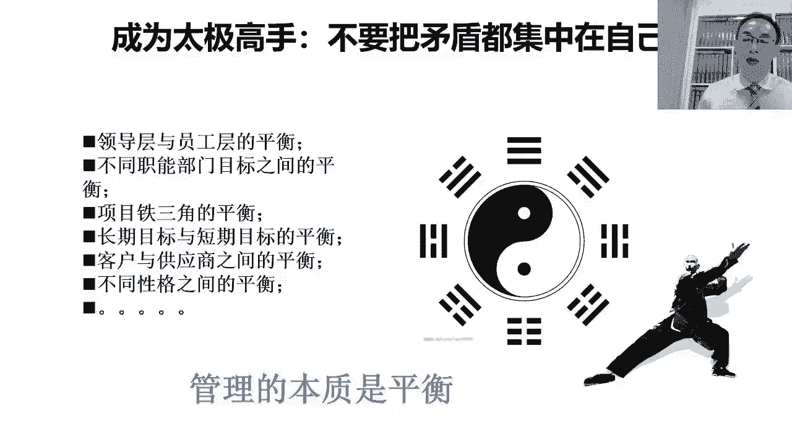

我们可以有不同的观点对，但是我们也一定要目标是一致的，这种做法呢被我们称为叫和谐。

项目经理，要在项目中创造一个大家和谐开展项目的气氛。

但往往呢其实项目是从冲突开始的。

项目经理要帮助项目由冲突迅速的变和谐对吧，什么叫和谐呢。

和而不同对吧，他才能做到协对吧。

邪其实就是行为大家一致和其实我们的背后是。

虽然大家的工作背景方式方法不同对吧，但是我们大家努力的目标是一样的。

我们有共同的志向，项目经理要帮助大家去建立共同的志向。

然后才有可能形成协作，所以项目经理要帮助项目打造和谐的气氛。

但是这种和谐对吧。

是基于大家仍然为了目标而努力的和谐，而不是大家谁都不关心项目目标的事儿对吧。

