# 优秀管理者布置工作的步骤！ - P1：1.优秀管理者布置工作的步骤 - 清晖Amy - BV15t421K7dX

我们其实还要跟人家说清楚。

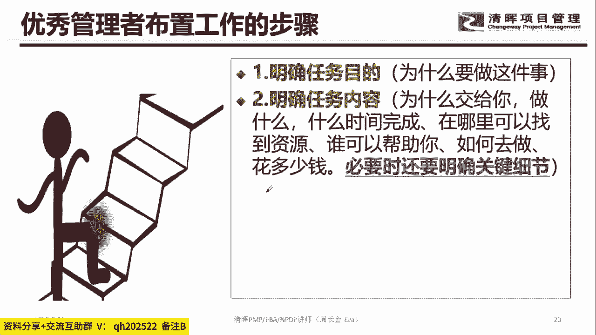

我们把它说清楚是啥呢，看到这个黑板哦，就是第一个我的明确任务目标是啥，因为有些时候我们的人经常喜欢why，为什么要做这个，对不对，做了这玩意跟我们公司的什么东西它是有用的。

为什么很多下属在乎任务的目的是啥，因为任务的目的决定了整个这个事，跟你的公司的经营指标对吧，跟你们部门的KPI或者KI的匹配程度，匹配程度越高，其实将来这个事儿你拿到的绩效，拿到成果其实就会越好。

所以任务的目的就why为什么要做这个，我要了解背景，知道吧，要了解背景，那第二个话题是啥，就是你在做这个事的时候，我要是跟你说一下，我为什么把这个事交给你，知道吧，就谁来做，有些时候经常会说。

为什么是我做，不是他做对吧，我教给你，我的理由是啥，我要说清楚为什么会选择你对吧，为什么，比如说我为什么选择南阳对吧，我不我不选择刘晓林对吧，我为什么会选择你，那我期望你在这里面做什么，什么时候。

这就对接到我们六项制约。

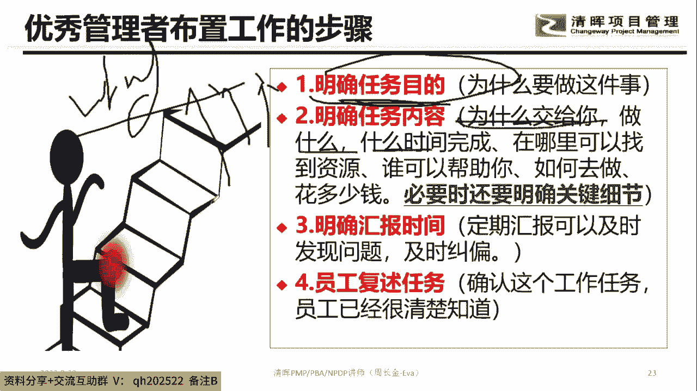

六项之约是啥范围，进度时间成本质量资源，对不对，然后等等这个维度好，那还有一个话题是我们在实际工作中，很多人就是让您下属听懂你的话，其中有一句话，很多领导都不会说那句话，必要的时候明确关键的细节。

也就是有些时候你不把这个关键的节点搞清楚，其实风控就来了，就有了这个话题，这个是我们很多老板，有些时候这个字他是不会传递出去的，那下面都不知道这个事儿，那你在做的时候肯定会有偏差，对不对。

好第三句话就是啥，就是我们要监督，也就是说我把这个事告诉你，但是我也提醒你，我不是说从此撤场的，我在整个过程中，我还是希望你主动跟我反馈，对不对，让我及时的帮纠偏解决问题，那最后一个维度的话就是干嘛。

我们要了解员工是不是真的听懂了，我们布置的任务，所以要让员工干嘛做一次重复，所以在整个开会的时候，大家注意到一件事情哦，大家开会注意到一个事情，就有些时候我们会说哎呀小张啊。

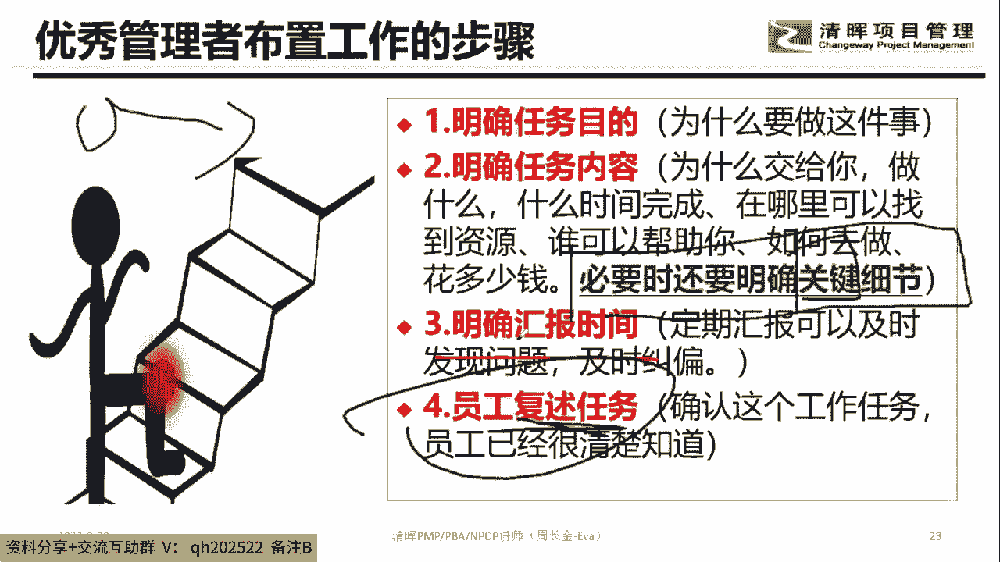

刚刚布置给你的任务啊，你听懂了没，然后然后我们家那个谁啊，你们家那个下属就说听懂了，请问算不算一次有效沟通，觉得算的，打一不算的，打二，就比如说我们刚刚跟小张布置任务，对不对，我说小张。

你那个去上海对不对，跟我跟那个上海，跟那个上海的那个国资委那边对接一下，我们在上海那边，然后开一个什么什么公司的可行性的一个情况，那我刚就问小张这个事情搞明白没，然后这个小张就说老大，我听听。

我听清楚了，然后这算是一次有效对话吗，觉得算的，打一不算的，打二，算还是不算，肯定不算嘛，这样出来的任务肯定完犊子了，所以要让小张干嘛，自己去理解，理解完之后，把他理解转化为转化为说出来的东西。

然后他说出来的东西，再跟我刚刚对他的期望是不是匹配的，知道吧，这玩意才叫负数嘛，对不对，所以呢答案一定要记住这件事情。

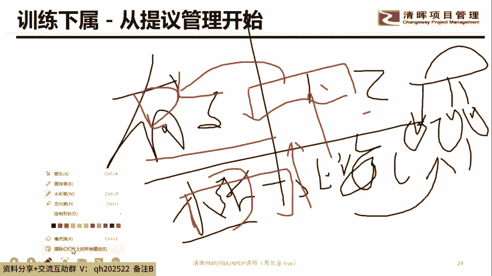

训练下属从哪里开始，从提议管理开始，看清楚好，先八卦一个话题，你们公司，你们公司给员工会不会经常参加培训会的，打一不会的，打零就是你们公司哈，你们公司会还是不会，会还是不会，那说明你们公司不错啊。

那才有同学说领导不学偏僻怎么办，领导不学偏僻，让他来学啊，对不对，我跟你讲，大家都学偏僻，看清楚啊，大家都学偏僻，然后就领导不学，各位对工作有没有影响，绝对有的打一不会没有的打二哼，就你的队伍。

你的一线团队学了PNP，你学了PMP，然后你家领导没有写PMP对工作有没有影响，有还是没有，会有影响会有影响。

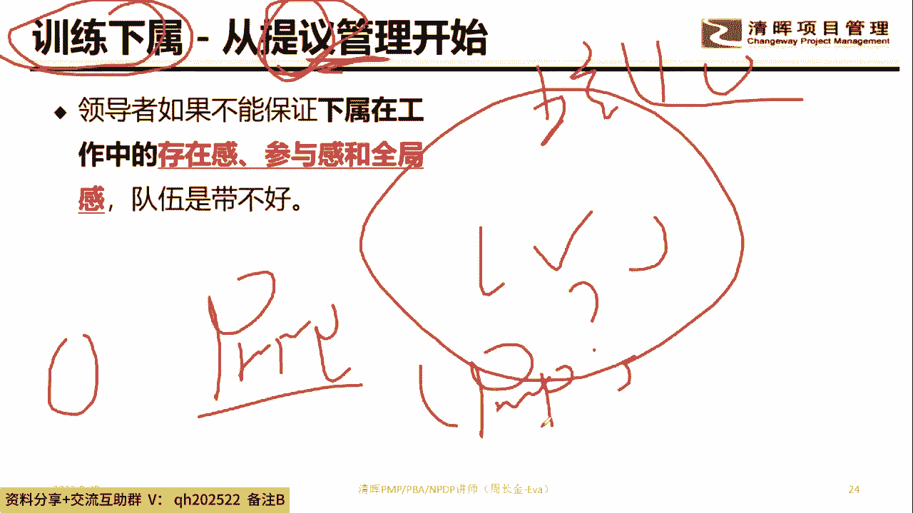

真的会有影响，真的会有影响好，那么接下来这时候大家注意的一件事情啊，听清楚就信任下属的时候是从提议开始的，听清楚这个是重中之重，重中之重，啥意思呢，就是我们不要老想着让下属直接听你的，怎么干。

刚刚不是有个叫指令型吗，大家还记得吗，指令型的，还有个叫啥支持型的，还有个叫啥教练式的，还有个叫啥授权式的，那各位同学告诉我一件事情，训练下属从提议开始翻译过来，是哪个是指令型呢。

领导风格呢还是支持性的领导风格嘞，还是教练式嘞，还是授权式嘞，所以哪个所以哪个啊边学要边跟前面对接哈，边学跟边前前后知识点相对接的，所以哪个就我们刚刚前面，不是说领导风格有四种吗。

三国演义的故事大家还记得吧，三国演还到那去了，你认真听课哈，看清楚就是下属嘞，他是要有存在感，要有参与感，要有全局感，知道吗，否则这个下属在你们公司无论工资加到多少，其实他都留不住的，因为工资的话。

只能解决马斯洛的底层的这个群体，但凡到了第三层，第四层，第五层，这个群体工资是没有意义的，对不对，对他来讲的话，什么生理需求，安全需求对他已经没有了，知道吧，我都财务自由了，所以呢对有些事。

那还有一个话题从提议管理开始的话，其实就是一开始你来我的队伍，我就是培养你的，我就是打算培养你的，知道吧，我打算让你在实践中成长，而不是利用你原有的能力去吃老本，各位原有的能力去吃老本的话。

还有一个话题就是我给你安排的任务，各位同学是十分的，你安排的能力是十分。

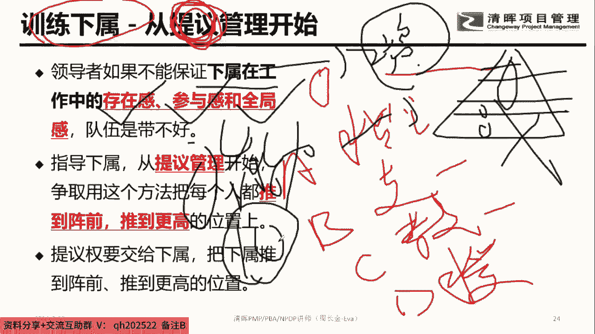

然后你的能力能够完全做到，各位同学，我给你判断一下啊，好的老板是啥，好的老板是这个员工有三分的能力，我要给他七分的任务，然后很low的老板是啥，这个有七分的能力，给他干嘛，给他四分的任务。

这这个是能力哈，这个是能力，这个是啥任务，很很好的，老板是三分的能力，七分的任务很很low的，老板是七分的能力，给他四分的任务，一般的老板是七分的能力，给他七分的任务，各位同学，你们属于哪个数字。

你们如果属于第一种叫三七，第二种叫七四，第三种叫七七，你们告诉我你们家老板，或者你对你的下属属于哪一种，属于哪种，就是他就像你们家周老师哈，你们家周老师的时候，现在用的就是这种哈。

用的就是这个三分的能力，让他挑战七分的工作任务，然后还有一种就是他有七分的能力，但做四分的事，另外一种就是能力跟工作刚刚好，所以一个好的老板的话，其实应该是做这个维度，三期知道吧，三期如果你做七四的话。

你在这个公司就完犊子了，我跟你讲就完犊子了，知道吧，就完犊子了就完犊子了，那也就是说你在职场里面是只做减法，没有做加法的，各位同学，职场是要做加法的，那从提议管理开始，其实训练里的下属在职场是做加法的。

知道吧，在做加法的这个话题好，周老师是谁哇，你们这么生气吗，周老师就是我呀，我现在跟你讲了，讲了90分，讲了90分钟的课啊，在这掰扯了半天，你问我周老师是谁啊，这个死鬼，我们班的同学送他个锤子。

我们班的同学先停十秒送，送这位同学个锤子，太气我了，问周老师是谁，我跟你讲了90分钟的课，掰扯了半天，你问我周老师是谁哇，气我气我太气我了，这个这个我我我受我受了，我受了打击了，我受了打击了。

安慰我都没用，我跟你讲。

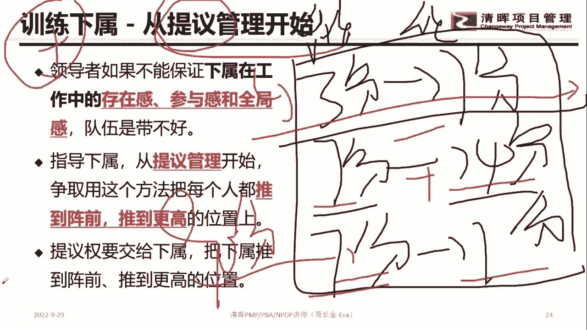

哈哈哈啊，下属躺平怎么办，看清楚啊，一个部门的任务一定会有一些不需要挑战的，就是七分的能力，只需要啊，只需要四分，就是你有七分的能力，但他只需要消耗四分，如果你的下属是躺平的话。

就把这个区域给到他那一个部门，还有这种就是三分的能力，需要做七分的事，有挑战性的工作，还有一个是有七分的能力做七分的事，那也就是说如果你的像素是躺平的话，你就给他这个任务，知道吗。

就是他的能力做他的事绰绰有余的，你对他就不要有期待了，知道吧，不要有期待，就是做这部门一样最不重要的，打杂的，辅助的支持性的工作，就这种就可以了，知道吧，好，那等你要判断下属是真的躺平了，我跟你说一下。

你要判断下属是真的躺平哈，有些下属他是唯躺平，知道啥意思吧，各位同学，什么叫维糖片，什么叫维糖片，维躺平，其实就是他对你失望透顶了，你知道吧，他对老板失望透顶了，所以他才会做样故作躺平的这个动作。

那如果是这种的话，那一定是你出问题了，所以你要判断他是真的躺平还是假的躺平。

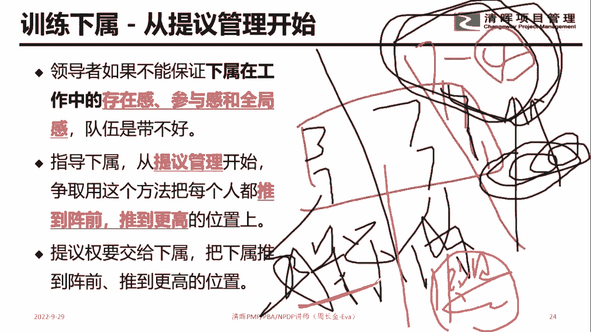

知道吧，是假的，躺平好，在整个这个地方的时候，大家注意这个话题，就是说领导在工作中要存，要下属是要存在感满足感的，对不对，所以从提议管理开始的话，把每个人看清楚，每个人推到正前，推到更高的位置。

各位更高的位置是三七嘞，七七嘞还是七四嘞，属于哪个，每个人都会告诉我，然后当空降还没展出业绩和能力的时候，下属一直挑战自己，想要体现比上次牛，这个时候嘞，这位同学就做服务式领导，知道吗，做服务式领导。

你就让他牛呗，听清楚这句话，听这句话就是就这位什么李田同学对吧，你就让他牛呗，反正这个下属在做的怎么样，这个成果都属于这个部门的，这个部门的，就是你的，知道吧，这个时候你要做的事情就是做服务式的。

在服务式的过程中，然后你要干嘛，了解整个部门的整体的一个业务布局的情况，然后你要判断一下整个这个部门的任务的情况，跟部门员工的一个情况，他们之间的一个关系的契合度是什么样子的。

你先要有1~3个月的观察期，观察了之后，你再对整个工作做一些适度的调整，适度的调整就是把原来的关系给我给我打破了，知道吧，给我打破了，就把原来的稳定关系打破了，然后重塑一个新的职能关系，各位同学。

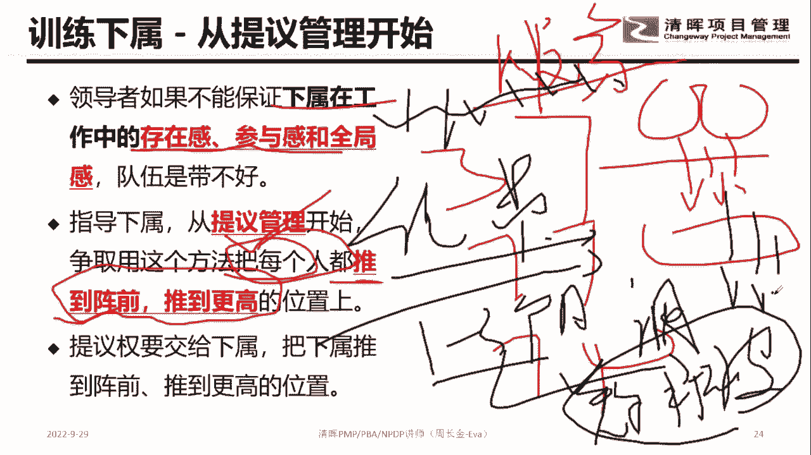

Yes or no，能理解吗，就是一个新的领导进场，不要一天到晚就想着干掉人家哈。

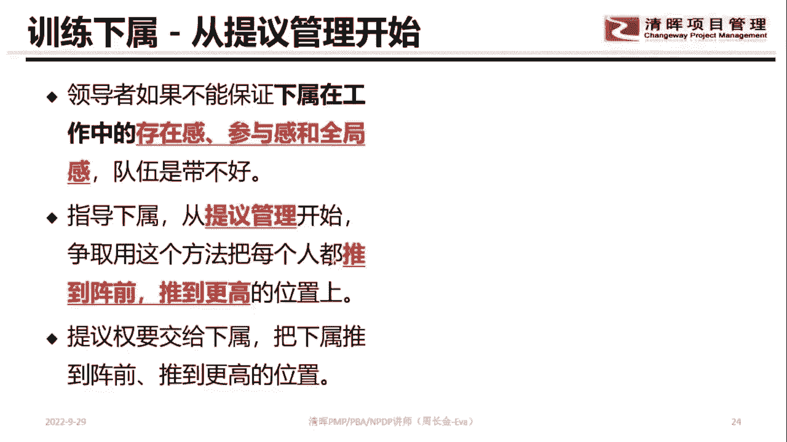

先先了解情，先了解形势，然后再出手，不要直接给我出手手哈，所以看清楚作为体育管理的时候，大家注意到这要干嘛，看清楚，把每个人推到正前，推到更高的位置，这句话就是啥，当我们在布置一个任务的时候。

比如我们做什么对吧，然后他的场景，他的时间谁来做，做到什么程度，我们在整个这个地方的时候，要让下属思考他的解决方案，所以这个叫啥，这叫教练式，知道吧，管理风格里面叫教练，是我们要触发员工主动思考。

主动给解决方案，主动去参与，就这个话题，所以呢那当然员工出的很多的解决方案，我们能不能别人一说解决方案，我们就跟下属说，你不要说这个啦，对不对，你这个方案你这个思路是不对的。

我们能不能一开始就否定人家嘞，各位同学能还是不能，人还是不能觉得，人还是不能就一开始就否定人家，人能这么搞吗，肯定不能这么搞，对不对，所以从这个地方的时候注意到现任下属的话，要让他看没看清楚。

没要让他去思考，要让他自己去思考这个部分，也就是说把这个事真的让员工自驱动，主要这个话题啊，自驱动，我们要给他足够的空间，让他有自信，给自己的想法。

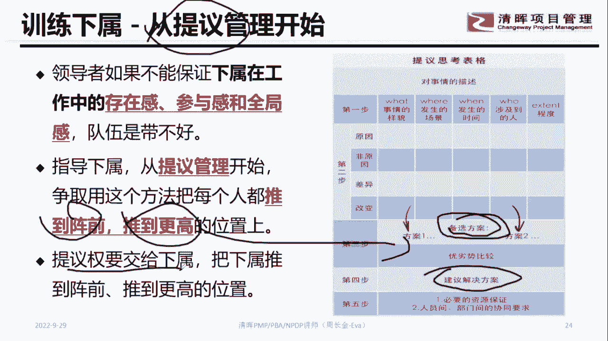

所以我们要把它推上去，就这个话题好。