# 优秀管理者布置工作的步骤！ - P2：2.什么样的员工容易被提拔为管理者 - 清晖Amy - BV15t421K7dX

停好，那么整整个这个地方注意到有人说，所以说你你你在接触一个任务的时候，比如说我让你去跟供应商谈一下这个设备，这个这个设备或者这个系统对吧，然后提前三个月给我干嘛，给我上线，或者给我送到位。

或者免费给我使用他们造类的，那我们给他布置任务的时候呢，我们应该问一下他对这个任务有没有什么想法，不要一开始不要一开始就直接告诉他怎么干啊，不要一开始就告诉他怎么干，所以不要一开始就问教练，是知道吧。

一开始就问他自己有什么想法，然后呢如果他没有想法的话，我们用教练式的方式告诉他大概什么想法，然后这种想法的时候大概可以干嘛，可以起到一个什么样的作用，对不对好，然后在整个这个地方的时候。

所以呢我们要把它拆分开来，知道吧，就号如何开展，我们应该通过哪几个维度，对不对，我们才能锁定这事，比如说供应商不愿意帮我免费，那我要做到什么样的情况下，供应商会帮我免费，那这个地方就是啥叫交换的思维。

记住一件事情，你们自己在课件做笔记哈，那整个管理的话，其实要解决问题的话，其实非常重要一个维度就是干嘛，就是交换思维哈，交换思维好，那么在整个这个地地方的时候，大家注意的一件事情就是就是这个话题啊。

唉这个这个课程除了教你怎么当领导，还会教你怎么当下属哈，慢慢来慢慢听课好，接下来关注这个话题啊。

就是我们如果不行，我们要怎么办，知道吧，这个地方我们要把它对接过来，对接过来好，那么接下来的时候大家注意的一件事情，就是我们作为管理者的话，那我们怎么来关注这个下属，对不对好，那么大家注意到一件事情啊。

在整个团队管理的时候，不要有关系文化，而是要夜久文化，各位同学八卦一下，为什么叫业界文化，而不是关系文化，为什么说我们是业绩文化。

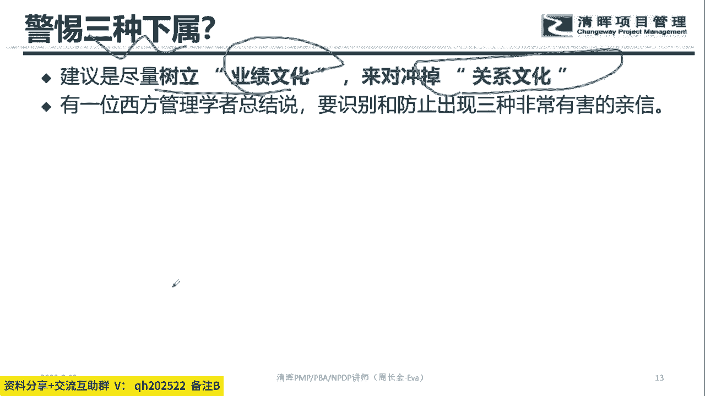

而不是关系文化，八卦一个话题，哎你知道为什么不能是关系文化吗。

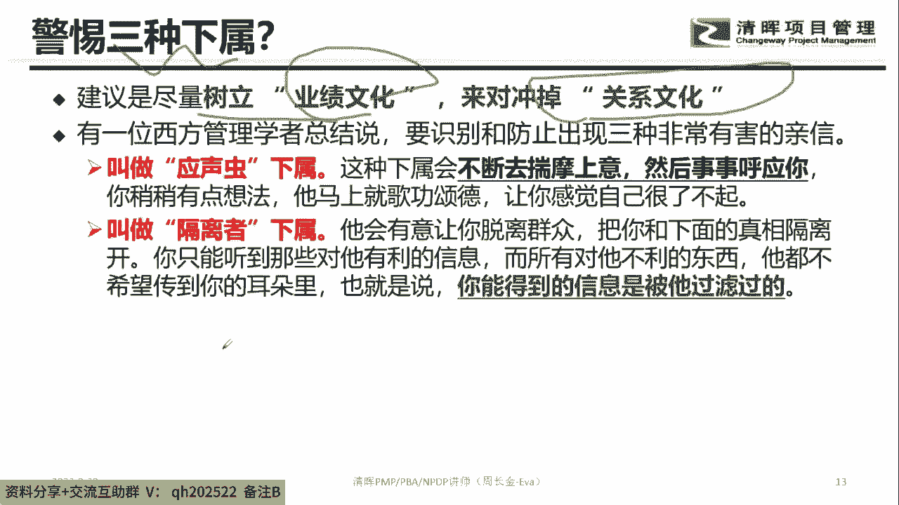

每个人思考一下，为什么不能是关系文化，就是职场里面有三种，还有一种叫应声虫的下属，啥意思呢，就这种下属的话，其实就是一天到晚就是揣摩你，啪啦啪啦给你拍马屁，啥也不干，你知道还有一种下属叫啥。

就是他会把对他有利的信息给到你，然后其他的信息他给你过滤了，其实还有一种叫啥夺权的，他会自己干嘛，自己会组建一个团队，暗中培养自己的人，然后干嘛等待机会把你给干掉，所以在整个职场的时候。

有些职场不代表一定是相爱的，还有一些职场有可能是相杀的，知道吧，那么相杀的可能就是这个下属就是隔离者，或者干嘛夺前者，所以在整个职场的话，你要注意到，那让下属听得懂你的话，前提条件是你首先解下属。

知道吧，你要了解下属，要了解下属，然后第二个维度就是干嘛，我们刚刚说过，职场的话，我们其实要交换，对不对，交换业绩文化就是人家的付出能够有回报，知道吧，不要凭关系嗯，我不知道你们有没有这种情况。

各位同学，就是你们职场里面有没有那些人，拍马屁超厉害的，一年到头啥也没干，但他的业绩很好，有没有这种下属，有没有这种员工，你身边有没有这种同事或这种员工，觉得有的打一没有的打二有吗，有没有这种员工。

就是怎么讲，一年啥也不干，哼哼哼呵，所以关系这个维度的话，关系这个维度的话，其实关系文化会导致你部门的效能，会急速变差的，为啥，因为大家都觉得靠关系拍马屁，就可以得到好的绩效。

那每个人的时间精力都拍马屁去了，那最终谁来产生绩效嘞，没有人没有人的话，这个部门基本上就完犊子了，所以我们尽可能有业界文化或是干嘛，关系文化好，那大家注意的一件事情哦，其实接下来说刚刚说了半天。

说的是老板那个角度，对不对，接下来说作为员工的角度，各位同学，我们现在的同学有没有这种情境，就作为一个作为一个员工，然后你感受到的一个事情是啥，自从来公司天天加班，这是一个这是一个学员发给我的哈。

这是一个学员发给我的啊，天天加班，然后呢连周末都随时待命对吧，领导还是不满意，升职加薪遥遥无期，哎呀跳槽也不好跳，现在呆着又不舒服，你说我咋办呢，烦死了，有没有这种我们班上同学有没有这种情况。

有还是没有有还是没有有没有这种员工，我跟你讲，如果下属到了这种状态，其实其实真的很心酸啊，我跟你讲，那这个地方的话，就说明我们作为员工的话，要解决一个事情，啥事情呢，听清楚哈。

听清楚就是我们在整个对接的时候。

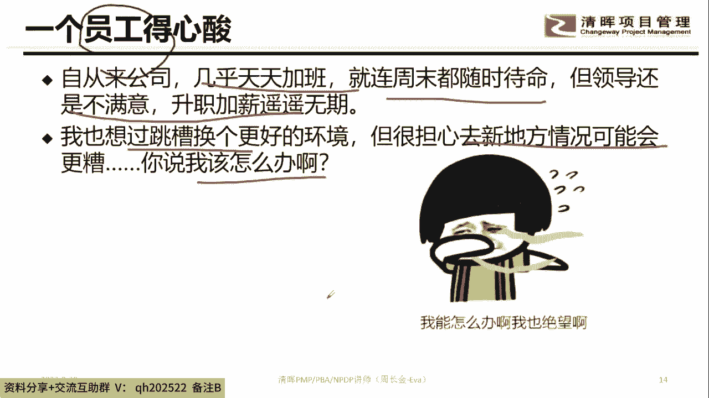

我们在整个对接的时候，我们大家做到这个话题啊，看着黑板，就我们在整个对接的时候，不要老想着干嘛加班，对不对，然后什么周末待命，各位同学，为什么老板有可能不满意嘞，认真听课哈。

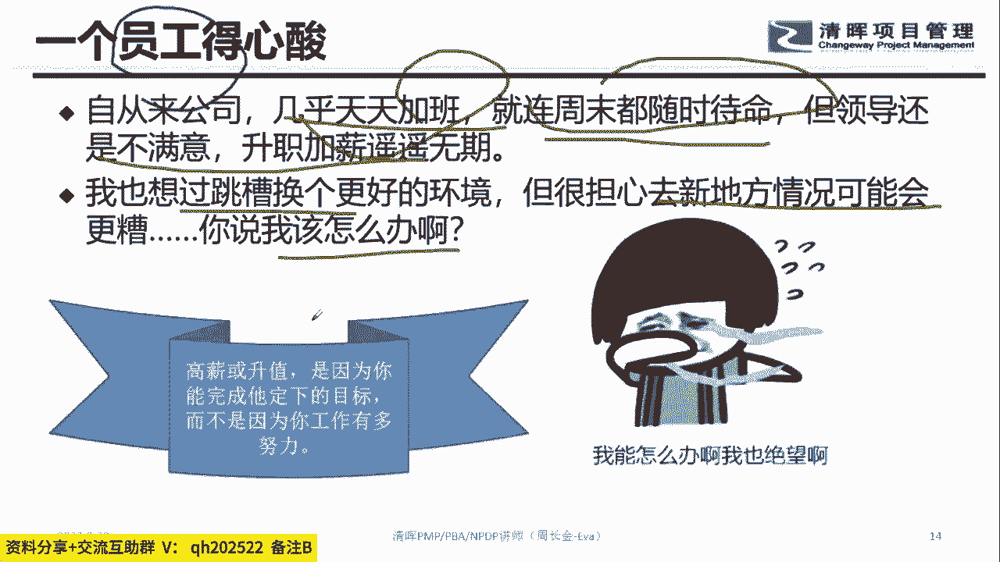

关注这个话题，在职场的话，老板是在乎你的努力，还是在乎你的结果，各位同学在乎努力的打A在乎结果的，打B在乎又努力又有结果的打ab选哪个，八卦一个话题就职场哈，老板在乎你的努力还是在混呢。

结果还是在乎你又努力又有结果，让我们大家做的一件事情啊，其实比较在乎的是啥，比较在乎的是哈，是这个，当然这种又努力又有结果的人哈，其实很少就是100个里面还剩不到三个到五个，就是很少很少。

其实在现在来讲的话，老板特别在乎你能够干嘛，有好的结果，知道吧，就就不是说你加班啊，或者你待命啊，如果你加班，你待命，但是没有交付成果，其实你也得不到一个好的结果。

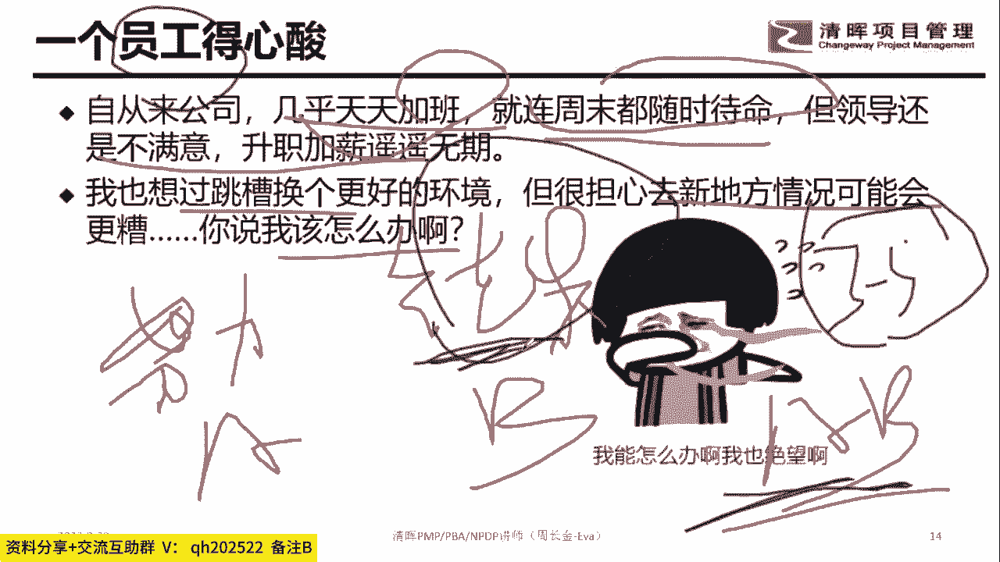

知道吧，所以为什么说员工你们将来记住一件事情，听清我说的话，如果你要得到高薪或者升职的话，你要干嘛，你要能完成他定下的目标，而不是因为工作努力，这句话非常重要，这句话的意思就是高薪或者升职。

在于你对目标成果的交付情况，知道吧，不是说我加班就OK，不是说我周末听话就OK，所以这个部分是你要去关注的，所以这句话得提醒大家，就是你的能力是要跟得上，你的能力是要跟得上公司的业务发展的。

如果你的能力不足以，解决你在职场的工作的诉求，那其实你就会很累，你知道吧很累，所以我希望大家记住件事情，员工就是各位同学记住一件事情啊，就为什么我们老是提倡你们去做培训。

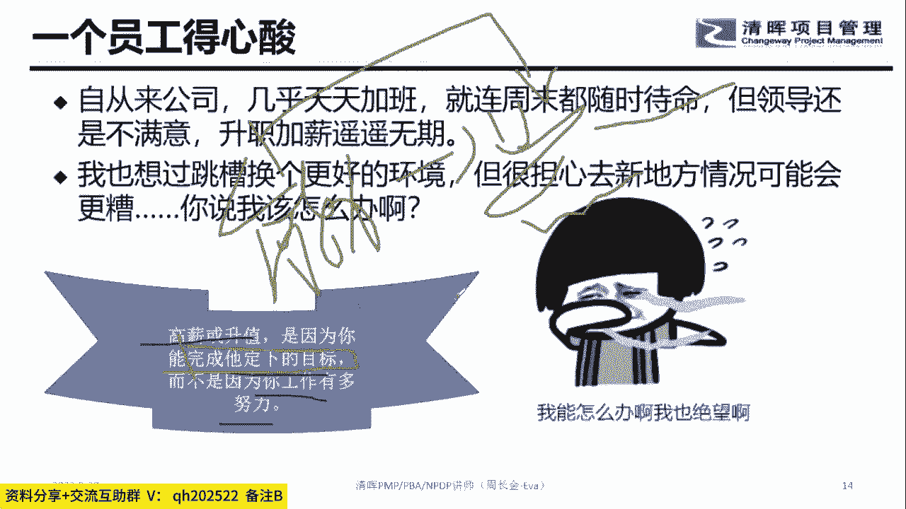

要提升自己，其实大家都做这个话题啊，我们刚刚虽然说老板要培养下属，对不对，但其实很多的时候，老板他其实说白了就职场二八原则吧，百分可能有80%的老板都没有注意到，要培要培养下属，他只在乎到下属的结果。

各位同学有没有这种情况，然后呢，那你会发现一件事情，下属他不断在干活的过程中，他如果他没有时间去学习，没有时间去成长，没有时间去交流，那他其实他的执行效率是不会得到改变的。

但是公司给你的任务难度是越来越大的，那这个的结果交付就会越来越差，所以大家一定要记住一件事情，就是要把时间一部分留给自己，知道吧，就是不定期的来去通过一些事情，把自己的能力给我上去。

当你的能力上去的时候，其实你供你交付同样的结果，以前可能需要16个小时，现在可能只需要六个小时，那中间的十个小时可能就是你自由支配的时间。

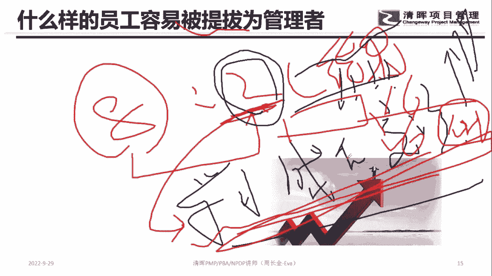

所以希望大家记住，就是要不断的干嘛提升自己，做这个话题好，那么接下来的时候，注意到什么样的员工容易被提拔嘞，看清楚啊，什么样的员工，那我们刚刚说过，让下属听着，让让下属听得懂懂你的话。

其中有一个点就是啥，就是要做什么，第二个点就是我能得到什么，对不对，好那么在整个这个地方的时候，第一个维度，各位同学现在开始来自我判断你属于哪种员工，如果你对标到了，那你在职场即将会被提拔提拔为管理层。

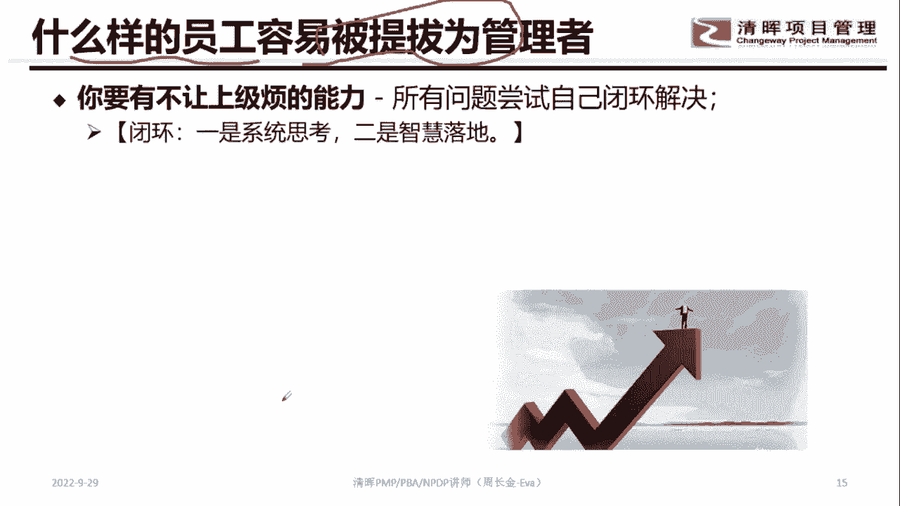

第一个话题是啥，你有不让上级烦恼的能力，这句话是啥，就所有的能力尝试自己具备闭环解决的能力，这句话啥意思，就你遇到事的时候，不再是说老大怎么办，对不对，你遇到事的时候，你自己具备干嘛。

直面各个职能部门各个情景，然后去破局而出的一个智慧，也就是说当遇到这个事儿，你是带着解决方案，甚至带着解决方案已经落地了，成果跟老板汇报的，那这个部分是我们通常遇到的，就是你不再是动不动就跟老板说。

老大还怎么办，那这个啥意思呢，那起码是二八研制，80%的事在你手上要完全搞定，然后20%的事情要求助老板对吧，那第二个话题是啥，看清楚这句话就是你要有啥，你要有创造团队的空间的能力，这句话啥意思呢。

就是我如果把这个队伍交给你，那整个队伍能不能干嘛，能不能往上走，对不对，就是把一件事情做大的能力，这句话啥意思，比如说我们公司以前有一个人，就是搞基大师系统，对不对，搞这样一个系统的时候。

那本身是为了解决公司的档案管理的一个事情，档案管理这样一个事情的时候，这是一个很小的事情，然后这家伙干嘛把这个事情第一个维度，他把它推广到前集团这一块，然后第二个维度的时候。

他把这个东西向他的供应商去推荐，那供应商觉得不错，然后他供应商也买了，对不对，也就是说，把这个东西本身，最初是作为解决公司档案的问题，然后后面把它当成一个产品，在市场化驱动这个事情。

就是把一个事情把它干嘛做大，这个是商业价值最大化，那如果你达到第二种的话，我跟你讲，你在公司啊，那是被当宝贝的，我跟你讲好，第三种能力是啥，就是你遇到一个事情的话，你能够具备干嘛沉淀，然后自我成长。

你就把你这个遇到这个事，然后比如说呃供应商对吧，在跟你谈判的第二天即将签合同的时候，被对手给撬掉了，那遇到这么大的一个事，那你让人家要反思一下，对不对，在反思的过程中，你自己能够判断在不同的环境下。

下次再遇到这种事怎么办，你不仅要提有提示自己，还要有把这个事共享给其他人的能力，也就是说这种这这几种情况我们会不要干嘛，被提拔，所以各位同学，你现在看清楚ABC，如果觉得自己三种都有的，打ABC。

如果觉得自己只有哪种的，就打哪个，来各位同学告诉一下我，我来判断一下你们的情况啊，属于哪种，如果你觉得你自己ABC都有打ABC，只只有A的打A只有B的打B只有C的打C，看下你们自己有哪个。

你们自我对标一下，就是看看你在公司能不能被提拔，所以哪个随A谁B谁C，那我我必须跟你说一下啊，我必须跟你说一下，我必须跟你说一下，你非常重要的，这个是重中之重，你知道吧，这个是重中之重。

老板为什么让你当老板，当老大，其实就是把他的时间和精力释放出来，对不对，所以一定要有的是A知道吧，然后B这个对人是一种期望，你要能做大玩意，这这更好的，你知道吧，所以在这个地方的时候。

大家注意到就什么样的员工容易被提拔，你要判断你老人家在公司的状态到底是哪一种，知道这个话题哈，然后除以A怎么干嘛，除以A怎么来提高，那除以A的话，你接下来就做B啊，想办法把事玩大。

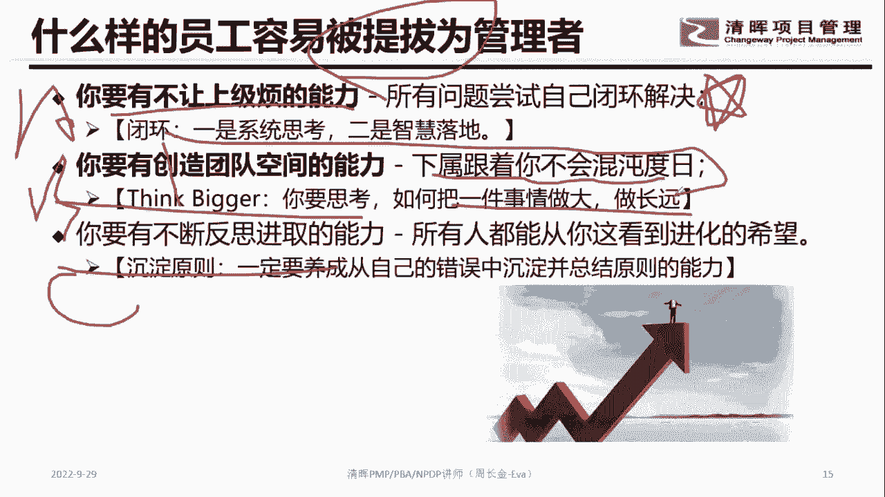

知道吧，想办法把事情玩大，玩大到一定规模的时候，你就是这个规模中的牵头的人，你是这个牵头的人，然后你就成为老大，理解这个话题吗，就是韦佳俊同学，Yes or no，其他同学理解吗，就如果你有了A。

那你就有了做B尝试的一个能力，对不对，然后你有了B的话，其实就是在公司怎么样就把自己变成老大，就能把事情完蛋完，得到一定规模，然后这个事情你出了业绩，那到了一定规模，然后出了一定业绩。

老板自动让你作为牵头人，那你自动就成为老大了，知道吧，自动成为老大了好，那么在整个这个地方的时候，我们刚刚说有没有准备好。

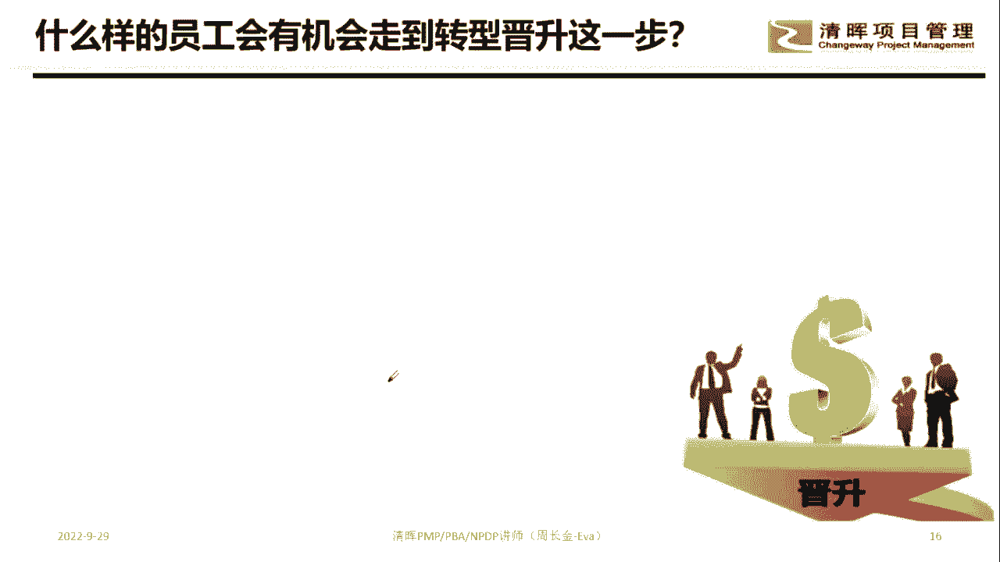

那真的让你去走到这个寄生层的时候，那接下来这个维度是说自己有没有准备好。

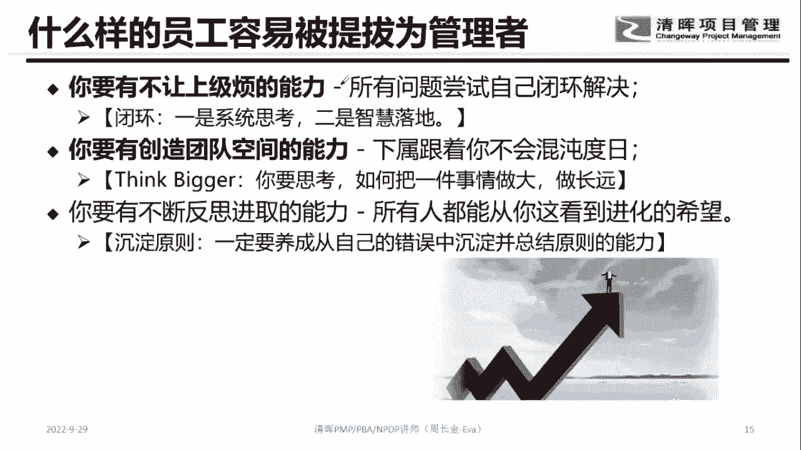

这个层面是在公司，你有没有被认可，你准备好，看见你这句话哈，看见这句话就是说在整个这个地方的时候，注意到如果被提拔了，那他有几个条件，第一个条件是啥，你在公司证明你有干嘛管理自我的能力。

然后呢你的业绩是被广泛的认可，啥也是，就是说不是说你的同事，你的朋友认可你，你的领导，你的领导的领导，你隔壁的领导都认可你，这句话就说为什么在公司做出点成绩，得瑟啊，特别得瑟，为什么要得瑟。

你有得瑟的时候，别人才知道有这么一个人哦，很厉害，对不对，第二个维度就是你证明有管他人的潜质，然后你有转行的想法，对不对，就是我想要从技术走向管理，或者我想由搞投资的变成干嘛搞市场。

我想我想搞市场的搞成干嘛搞，搞那个搞搞供应商管控的，对不对，那在整个这个地方的时候，大家注意的还有个话题是啥，有管理的岗位出现诶，这个就是天时地利人和，知道吧，且有人支持你，所以各位同学。

你们觉得自己在公司的人品要怎么样好还是差，在公司要不要维护人品，看清楚啊，第一句话就是说你在公司做事要学会得瑟，知道吧，就是你产生的业绩要得瑟到，大家都知道有这么一个东西，然后第二个维度的话。

你要尝试着由管由自己一个人做事，变成慢慢的无形中的带一个队伍去做事情，然后慢慢的锻炼自己的管理的能力对吧，第三个维度就是但凡我们的行业的组织结构，市场布局等等，再做一个调整的时候。

我们自己要去提前了解这样一个岗位的存在，然后去主动申请这么一个事情，这才能完成职业转型，知道吧，所以在整个职业转型的时候，各位同学，目前大家觉得123你们准备好了几条，123，你觉得自己准备了几条。

123觉得自己准备了几条，第一证明了管理自我的能力，就一天到晚上个班都迟到的，还管个锤子自我，123你觉得自己有几条啊，一个都没有，一个都没有呐，喊，转什么，就是你自己记住哈。

就是就是你在转转转的过程中，那个就是这位同学123都有了，那你就跳呗，对吧，你就跳呗，那其实你不用跳，你这机会就干嘛就存在了吗，存在了一个都没有，你还跳啥，一个都没有必要跳，知道吧，有可能找不到工作。

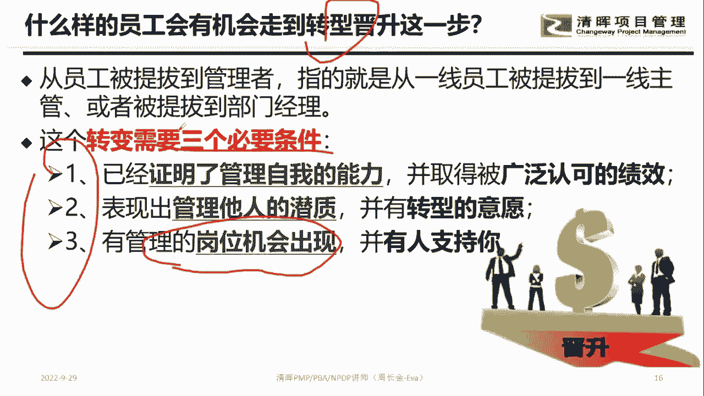