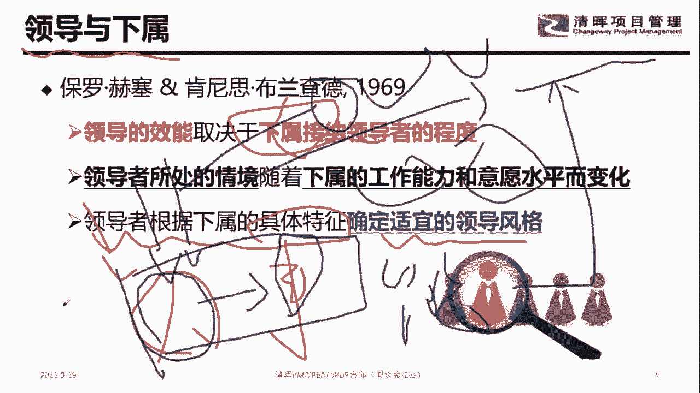

# 优秀管理者布置工作的步骤！ - P4：4.测试题领导与下属 - 清晖Amy - BV15t421K7dX

来的时候大家开始上课了啊，首先呢老师的简历就不再给你介绍了哈，那么先下来一个话题，各位同学测试题啊，各位同学认真开课，认真听课。

就领导跟下属，你觉得应该是什么样的关系，看清楚啊，两张图是应该是A相爱还是B相杀，各位同学做选择题，现在开始啊，在整个这个地方的整个这个地方的时候，大家注意到，你觉得领导跟下属之间应该是什么关系。

谁A相爱，相B相杀，应该是什么关系，相爱相杀，领导跟下属之间应该是什么样的关系，啊啊啊啊，哎呦妈呀，这这这第一道题，就决定你今天的课程一定是要上的，就通过这个选择题，就会知道你今天的课程。

为什么要来上个这个课程，领导跟下属之间一定要是什么关系，各位同学，我先把下面一张PPT讲完。

然后我们再来说上面这张PPT，认真听课哈，我们接下来关注，看清楚领导跟下属是什么样的关系，看清楚哈，曾经有位老爷子这么说过一句话啊，领导跟下属是这样，市场领导的效能取决于下属，接纳领导者的程度。

知道这句话啥意思吧，这句话用我们非常官方的话来讲，就是啥，就是你作为领导，你想要往高位去走，你想要有好的业绩，好的绩效，那一定是要干嘛，下属为你做支撑，这句话翻译过来是啥呢，如果下属不愿意接纳你。

下属就不会产生业绩，下属没有业绩，没有成果，领导也没有成果，领导没有成果，领导就没有绩效，领导没有成果，领导就没有岗位升迁的可能性，所以整个这句话其实告诉大家一件事情，就是说老板要混得好。

跟下属对应的接纳程度是有直接的关系的，翻译过来就是如果下属对你不支持，如果下属不赞同你对吧，如果下属不喜欢你，你这个老板的路也就差不多了，基本上就干嘛平铺直叙了，对不对，没有再往上走的空间。

那么领导他怎么搞定这件事情呢，看清楚哈，就是老板的处境跟下属的工作能力，跟下属的工作意愿水平是有直接的关系的，那这句话其实翻译过来是啥意思嘞，就是说你看啊，就是说老板如果有好的效能。

好的效能证明他有好的处境，对不对，那好的效能来自哪里，来自下属的接纳程度，下属因为会愿意忠诚于这个领导，所以他会愿意干嘛，贡献业绩，贡献成果，那下属想要贡献业绩，想要贡献成果，那他怎么贡献啊。

有些时候我们有一句话叫啥叫有心无力，知道吧，有心无力，有心无力，这句话啥意思，就是我特别特别愿意为老大您做贡献，可是我呀根本就干嘛，不知道怎么整，对不对，所以那这句话的一个前提条件说，作为老板。

如果你要让自己活得很滋润，对不对，如何让自己要有上升的一个空间，那作为老板，你对下属要干嘛，你对下属是要干嘛，提拔他的，是要培养他的，如果不提拔他，如果不培养他，你老人家的校人完犊子了，笑人完犊子了。

你这个领导估计也就完犊子了，那还有一个话题，说夏书有些时候他的能力是很强的，对不对，可是因为我不欣赏你这个人，我就觉得你这个人吧不靠谱，因为我不欣赏你，所以我没有想法为你贡献。

我没有想法为你做贡献的时候，其实整个部门的效能也是很差的，所以这句话其实告诉大家一件事情，就是说老板要活得很滋润，跟下属的干嘛，支持程度，跟下属的能力和下属的意愿是有关系的。

所以对于我们管理层来讲的时候。

各位同学在完上面这句话，那在听过这句话的时候，大家注意到，领导跟下属应该是一个什么样的关系，各位同学告诉我A还是B，就是不管不管下属对你怎么样，你们觉得领导跟下属应该是什么样的关系，一定是干嘛，A是吧。

相互助力的一个关系，相杀相杀，那就是啥，相杀到极致，你们猜是什么情况，相杀到极致，这个部门就会干嘛，这个部门因为在公司没有它相应的干嘛，业绩和贡献，这个部门这个板块这个业务有可能会裁掉，也就相差到极致。

也就整个这个所在的部门都取消了，知道吧，所以这个地方大家注意到友好的相处，是领导跟下属之间应该是干嘛相爱的关系，什么叫相爱，就你成就我，我成就你，咱俩携手共同往前走，这叫啥相爱的关系，相杀这玩意儿。

哎呀妈呀，相杀相杀到极致，其实就是双双输的关系，知道吧，就是你输了我也输了，咱俩干嘛都PDU了，都觉得人生无望了，所以各位同学记住哈，领导跟下属这人关系一定是要干嘛相爱的关系。

那有位同学必然是上级下下级啊，你这位同学说的这句话就不对嘞，这位同学说上级要瞎，就是说一定是上级要杀下级，这位同学说的，你们觉得同意吗，就这位叫啥，这位叫智云同学说的就是鄙人是上级下煞极。

那肯定不是这样，我跟你讲啊，现在下级端老板的锅也是很容易的，同意吗，同意的打一不同意的啊，就是下集哦，觉得这个老板不靠谱，然后我想把你干掉，然后取代你的位置，或者说我干脆把你干掉，我再去干嘛，换个老板。

我也不愿意让你当我的老板，各位同学，现在的职场这种情况是很多的哦，就不是说一定是上级，下一定是上级干嘛干掉下级，其实更多的时候下级也是可以干嘛干掉上级的，而且下级干掉上级的最直接的办法就是干嘛。

下级他不出业绩不出成果，当他不出业绩不出成果的时候，这个上级其实无形中也干嘛，完蛋了，所以提醒各位同学记住一件事情，我们在整个职场的时候，一定要记住，老板跟下属之间的关系是是一个协作的关系。

是一个合作的关系，是一个相互成对方的一个关系，一定要把这个思维给我掰过来哈，那这位同学说上下级都有，上下级都有，那就是这样啊，比如说你是忠臣，对不对，上级下级对不对，那那你的做法就是这样子啊。

看清楚黑板啊，就是你这个部分是要相互成就的，你这个部分是要相互成就的，能理解吗，就假设你是忠诚的话，那你你向上的时候，你是他的下属，向下的时候你看他领导，那你就要做两个层次的相互成就。

向上你要成就你的老板，向下你要成就你的干嘛下属，然后你才得到了成就，所以在整个这个地方的时候，大家一定要记住一件事情，一定要记住一件事情，就是要干嘛，相爱相杀的一个话题，相爱相杀的一个话题。

所以各位同学来八卦一下，你们家的老板现在跟你是什么关系啊，你们家老板现在跟你是什么关系啊，然后老师说的是一个部门，那公司的领导有没有可能是小团队的领导嘞，哎但凡看清楚啊，这个地方没有说一定是一个部门。

一定是一个呃，一定是一个板块什么之类的，就是一个团队，知道吧，就是一个团队，一个团队有这么一个人来完成这个事，然后呢一定有这么一个人是这个他的老大，对不对，所以他没有直接收，一定是啥。

一定是一个部门的一个关系，他一定是一个团队共同男的那个事，然后有这么一个牵头的人，牵头的这个人就是你的老大，知道吧，牵头人这个就是老大，然后有位同学说，怎么做到向上向下都成就嘞，认真听课啊。

后面就会有好那么相杀，这个维度在常态化是不会做的，在什么时候会遇到这个维度，就是这个维度就是我们在交换的时候，我们在互相成就的时候，我为你做贡献了，但是你没有满足我，对不对，那当产生这样一个冲突的时候。

你们就会干嘛，相杀相杀的话，其实就是把团队变成啥变成团伙，所以在整个作为带团队的时候，大家一定要记住，职场非常重要的一件事情是交换。

是相互成就对方，相互成就对方，这个是你们人作为一个老大的一个基础，在这个话题哈做到一个基础好，那么在整个这个地方的时候，大家注意的一件事情啊，这过做到这个话题啊。

做到这个话题看清楚，就是说领导听清楚这句话啊，这个领导是相对的，当你是一个部门经理的时候，你就是一个部门员工的领导，当老人家是一个事业部板块的老大的时候，那各个职能部门就是你的下属，知道吧。

你就是各个职能部门的领导，或者你是这个，所以这个领导的概念是相对的，是相对的，在这个话题哈好，那么在整个这个地方的时候，就要到领导的效能起见，一下下属的接纳领导者的程度，这句话其实告诉大家一件事情。

我们在职场作为管理者是管事还是管人，各位同学，管事的打A管人的打B看清楚啊，就是我们在整个这个地方的时候，要搞清楚领导者的效能起见，下属接纳领导者程度，那这句话的潜台词就是说作为管理者。

你的时间和精力应该放在A管事还是B管人，各位同学应该放在哪里，应该放在宾管人这块，知道吧，人搞定了人智能把他承接的工作搞定了，知道吧，所以先搞定啥，看清楚，先搞定这个人，然后这个人去做他该做的事。

然后产生效能，知道这个话题，所以我们在职场的时候先搞定人，知道吧，然后通过这个人再搞定这个事好，那么接下来的时候大家注意到，实际上来讲，我们没有那么容易搞定这个人的，你知道吧。

我们没有这么容易搞定下属的好，那么在整个这个地方，领导者根据下属的情况去确定合适的管理风格，这句话翻译过来是啥意思嘞，不同的人你对他的管理风格是不一样的，知道吧，不同的人对他的管理风格是不一样的。

就这个话题啊，脱离了社，那真不好搞，人人呢，哎我问你一件事情啊，你这句话的一个前提条件是啥，我们说先搞定人再去搞定这个事，那你这个地方有个前提条件是啥，你要知道什么人适合做什么事，能理解这个话题吗。

先搞定人再搞定是前提，条件是你要知道什么人适合做什么事，也就是说你先找这个人，不是直接给他命令小张，你去给我做什么什么事，而是先根据小张的意愿，根据他的能力来判断，让合适的人放在合适的位置上去。

看到这个话题没，所以在整个对接的时候就要这个话题哈，主要这个话题好，所以在整个这个地方的时候呢，我们注意到哈。

人人人人人人能哼好，在整个这个地方的时候，大家八卦一下领导的风格哈，领导的风格在很多的时候我们有很多种场景，我们直接给你掰扯一个你们最熟悉的场景啊，大家都应该看过电视剧吧，就叫三国演义，对不对。

那电视剧这个地方有个话题是啥呢，就说我们要入川，对不对，然后呢，他们在给到任务的时候，就是那个诸葛亮在给任务的时候，他会做一些事情，我们听完这个请进，然后各位同学来对标一下。

你们的老板给你布置的任务属于哪一种，听清楚哈，认真听课，首先说A，然后再说B，然后再说C，然后再说D这位同学说没有钱怎么搞定了，好在整个这个地方的时候，大家关注一件事情啊，看清楚这句话。

