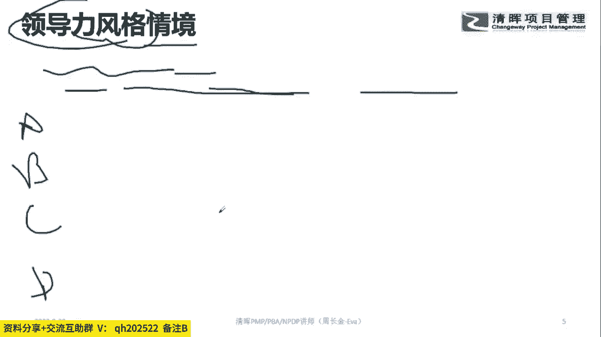
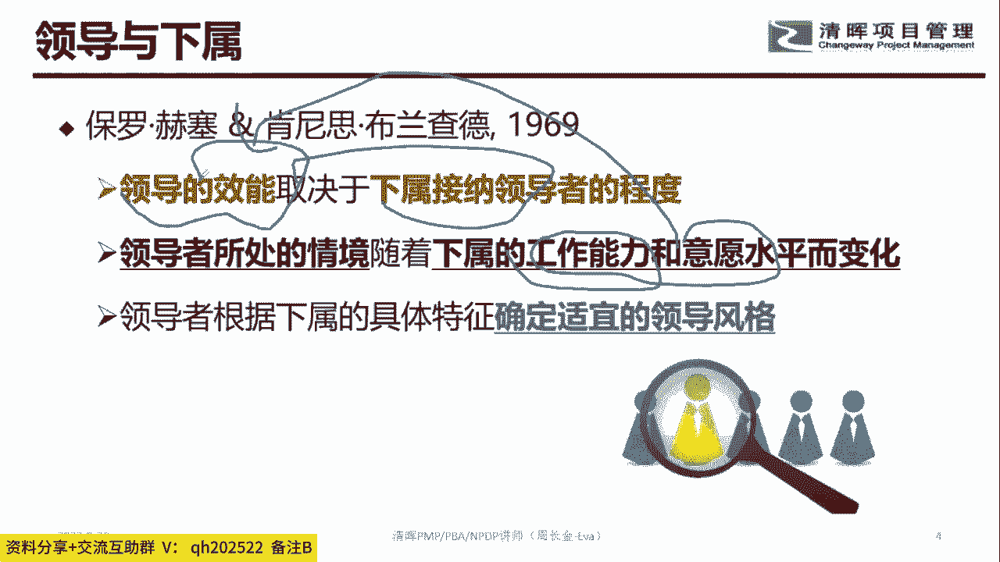
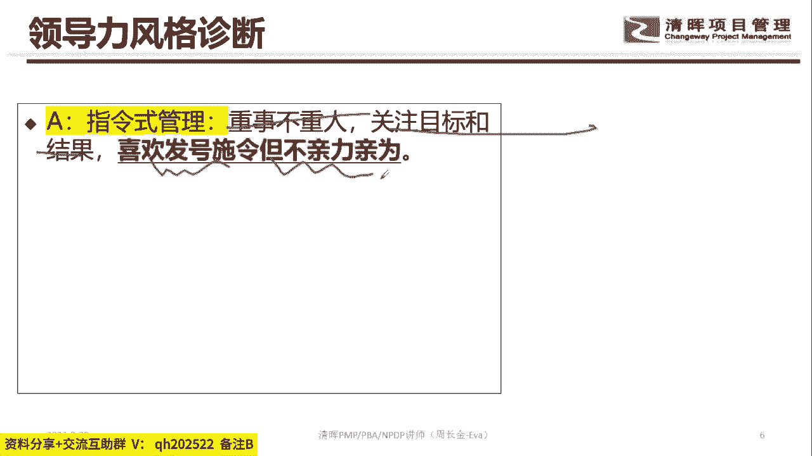
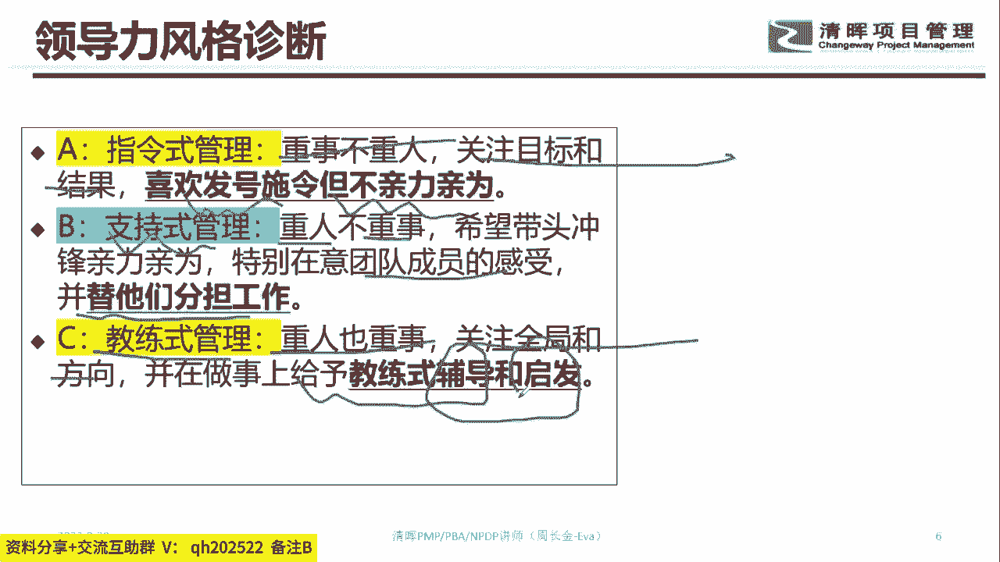
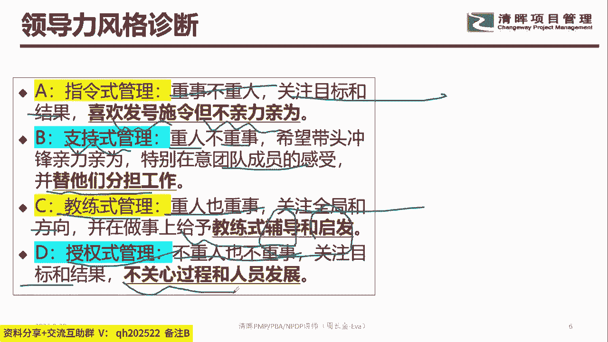

# 优秀管理者布置工作的步骤！ - P5：5.领导力风格诊断 - 清晖Amy - BV15t421K7dX

啊就是首先呢我们在整个对接的时候看清楚。

如果是指令只认识的领导风格是啥呢，就是我把这个事托付给你对吧，然后呢你呢要对他采取抵抗的，对不对，采取联合的，一定要按照我的说法去做，否则这个事就办不成，那子类型的领导风格是啥呢，是整个这个眼光。

他是没有什么思想的，他没有思想，没有解决方案的能力，但是他的执行力还是可以的，你让他做什么事，他就具备做什么事的能力，那这种类型的员工的话，我们用指令式的，其实就不用你想知道吧。

你都不用想这玩意是怎么干的，你就直接按照我们说的1234，567开干就可以了，这个叫啥，这个叫指令型，对不对好，那么接下来的时候大家说这个话题啊，就知识型对不对，支持型的领导，这个话题是啥呢。

就是说你去做这个事对吧，我没有办法去跟你做，我希望你干嘛，有什么事，你可以告诉我，我会支持你，知识式的这个场景，就是说我把这个事情给到你，但是我不知道这个事情能不能办成，我希望你努力的去办。

可是我向你承诺，如果你遇到什么事，当在我的能力范畴内，我一定会干嘛，尽全力的去帮助你，也就是说你遇到这个事的时候，如果我有条件，我有能力，我是会帮助你的，这叫啥支持式的，就是大哥，你去开干吧，对不对。

我不能跟你一块去干了，但是你遇到事，只要老兄弟我对吧，能做得到的，我随时可以帮助你，这叫支持式的领导风格，那么教练式的领导风格是啥呢，就是说我把这个事情给到你，但是我想问一下你有什么想法。

你对做这件事情你有什么想法，对不对，那这个人会说我也不知道怎么办呢，可是这个教练是他会干嘛，他会给自己的建议，对不对，他会告诉你大概怎么做，也就是说教练式的领导风格的时候，他会把一个任务给到你。

然后会试探的去了解你，对这个任务有没有自己的思考，对不对，如果你发现没有自己的思考的时候，那么教练式的这个风格他会告诉你，我的想法大概是什么样子，你看一下我的这个想法，你能不能接受。

或者基于我的这样一个想法，你能不能触发自己新的一个思考，这就叫啥，这叫教练式，对不对，那授权是啥，授权式，就哥们这个事情交给你了对吧，我相信能做得到的，就什么事都交给他了啊，不管了是吧，就是你往前坐吧。

我在那喝茶，对不对，就是我坐在这喝茶，然后你干你的，你也不用跟我汇报，也不用跟我沟通，反正我相信你能搞定这个事，各位同学，你们家的老板对你用的是哪种风格，你们家的老板对你是哪种风格，ABCD用的是哪种。

你们家老板对你是哪种啊，俺们领导是不清不楚，行哈哈哈，哎哎哎你们家老板用的是哪种风格，你们家老板用的是哪种风格，你们家老板用的是哪种风格，我跟你讲哦，就是成长速度比较快的是哪种风格。

成长速度比较快的是那种风格，成长速度比较快的是那种风格，成长速度就这个员工他能够有成长的话，是那种就是由菜鸟，由菜鸟变成一个干嘛变成一个有执行力的人，是C这种员工，所以这种员工的话，他就在干活的过程中。

老板会给他一定的思考空间，但是呢当我的能力达到一定程度的时候，我不能再用教练式，为啥，因为当我能力达到一定程度的时候，你这个时候再给我教，手把手的教我1234怎么干，怎么思考的时候。

其实对我来讲是一种障碍，知道吧，所以初能力在初级阶段的时候，我们用C的教练式的风格，但是当我能力达到一定咖位的时候，其实这个时候老板就要放手，知道吧，因为有很多员工是有足够的能力。

他能自主的控制好这件事情，他能够交付你想要交付的成果，那这种员工的话有足够能力，足够意愿，足够想法的时候，我们用啥用授权式，那还有一个维度是啥呢，支持式的知识式的这种风格是啥意思呢，这种情况下撒。

就是我对做一件事情，其实这个结果到底怎么样，咱确实是没有把握的，对不对，那这个时候大家共同来去往前面去做，但是做的过程中是一个不断试探的一个过程，其实我也不知道这个事情最终能不能真的搞定，对不对。

但是呢我在做的过程中，我们愿意干嘛，相互来支持这个事情，这叫啥支持式的，那另外一个我就叫指令式的指令是啥，只认识就是只认识这个员工，是没有任何思考空间的，对于那种能力超强的人来讲的话。

如果你用指令是这个员工，他会很心累的，他会觉得好无语啊，这种事情还用你教吗，我都会对不对，我我会的办法比你好多了，所以指令是适合啥，适合那种员工能力不咋地的，你知道吧，就是做任何事情一片蒙差。

就蒙圈圈的，啥也不会，那这个地方告诉大家一件事情，就是说你作为管理层，你需要干嘛，看清楚黑板啊，你需要啥，你需要啥，你需要下属接纳你，对不对，你需要下属用他的能力，用他的意愿来帮助你达成你的效能。

所以这个时候呢注意到不同的员工，不同的能力，不同的意愿，你用对他用的领导风格是要不一样的，就这个话题哈，那对我来讲的话，就你们家周老师用的比较多的，目前来讲是这种，因为我发现我的团队他们能力还是蛮强的。

对不对，好，那么接下来的时候大家注意到，大家注意到一件事情啊，所以在整个这个地方的时候，我们大概有四种类型，对不对，指令式是啥，就是重视工作对吧，不重视人，他关注目标和结果，喜欢干嘛，发号施令。

但是不会亲力亲为，这种叫指令式的。

那我们B属于啥，B属于啥支持式的，他呢重视人，不重视事，因为他也不知道这个事最终会怎么样，但他在乎的是你全力以赴的往前冲，对不对，所以他特别在乎团队前的感受，愿意帮忙帮他分担工作，也就是说你遇到事。

你找他，他是愿意干嘛帮你出一把力的，那么C教练是啥，他重视人也重视，是他关注全局跟方向，他在这个地方愿意辅导你，愿意给你启发的方向，对不对，愿意给你思考的空间那么低。

这类风格是啥授权式，看到没，那啥也不管了，反正我就觉得小张，你这人靠谱，对不对，所以呢他关注目标跟结果，但是他不关注过程，他也不关注，他认为你有足够的空间自我成长。

这叫D授权式，所以各位同学，你觉得你觉得你适合哪种风格，各位同学八卦一下，你觉得你适合哪种风格，每个同学说一下哈，你觉得你自个适合哪种风格，说一下ABCD你适合哪种风格，啊啊啊，你适合D是不是哈哈。

第一这种风格要自控力超强的人，自我自我职业规划超强的人，然后自我学习能力也很强的人，就这个话题，如果你们如果你们家是A这种风格的话，悠着点，我跟你讲A这种风格的话，会把你家下属给教的很笨的那种。

就是笨得要死的那种笨笨的，你让他做一，他就做一，让他做二，他就要做二，你让他做三，他就说做事就做四，这种适合啥，适合那种那种交付的成果，对你们部门的整体业绩影响不大的那种工作，知道吧。

所以你要选择你到底适合哪种风格，这位手机这位这位用户说，他说说啥ABCD我嘞个娘嘞，你老人家哈哈哈，然后B支持式的这个在整个职场最容易扯皮，就是你B这类风格的话，对业绩的评价。

对成果的分享其实是很难搞定的，为啥因为B这个事情的话，他其实最开始就不知道他的结果到底会怎么样，对不对，只是希望往前冲一把，但会冲到什么程度，我也不知道，你们家老板一天到晚坑，你说你放心的往前冲吧。

我在背后支持你，鬼知道他会不会支持，对不对，鬼知道他会不会支持，所以呢我们在职场的话，对小白对吧，初入职场的人士，对初进入一个新的业务领域的员工，我们用教练式，当我们把他的能力慢慢训练出来之后。

我们用啥用授权式，这两种是比较容易干嘛，跟员工和谐共处的，就这个话题哈好。