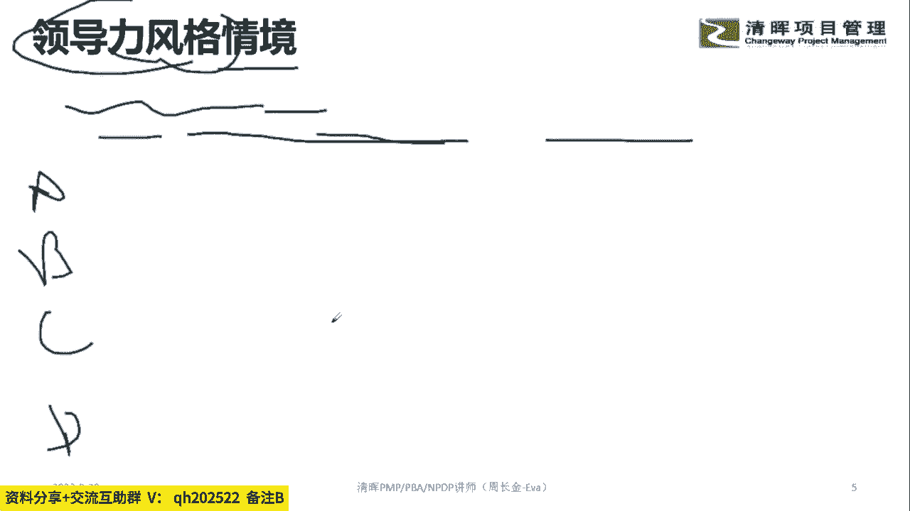
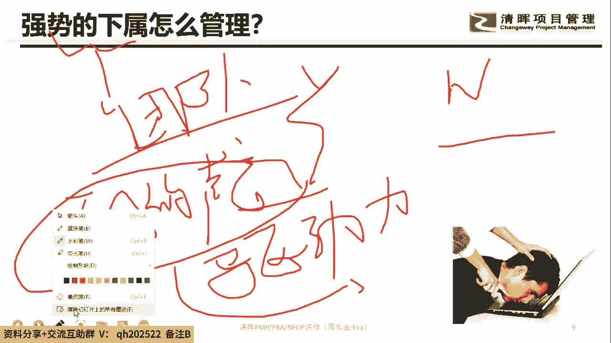
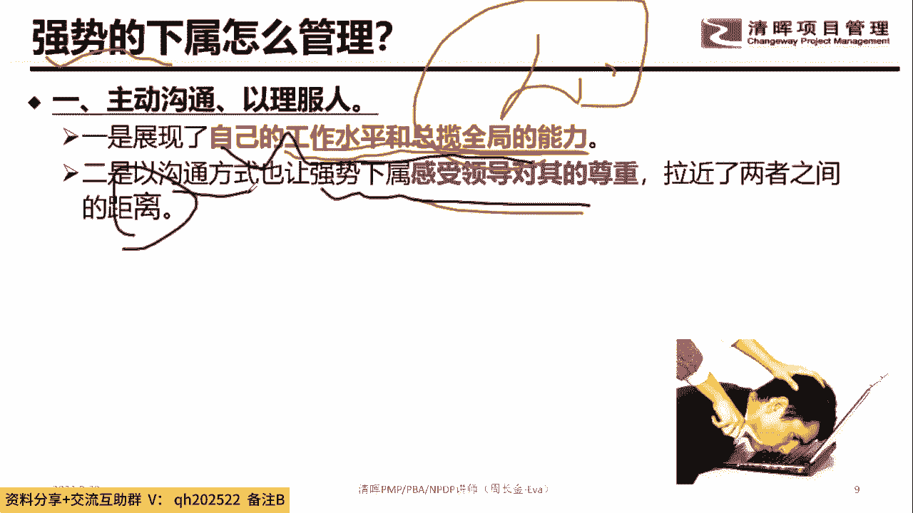
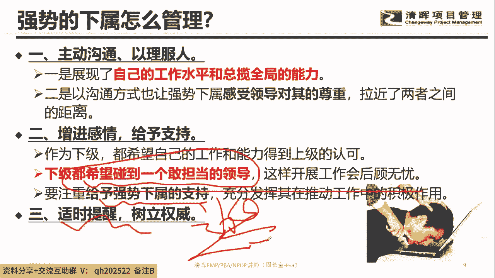
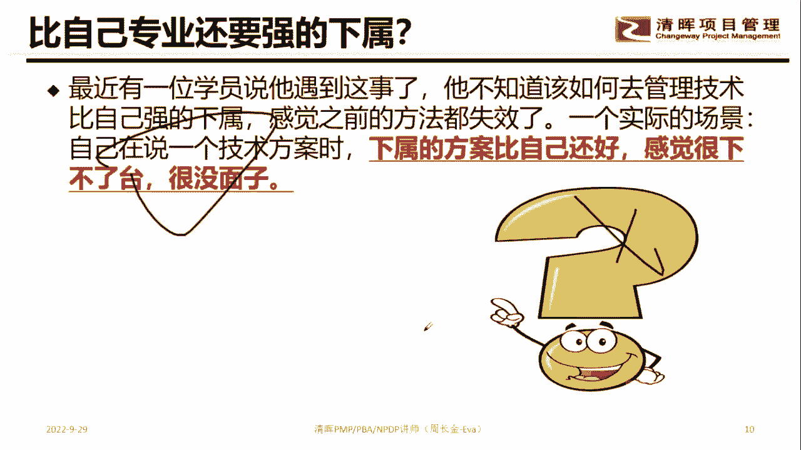
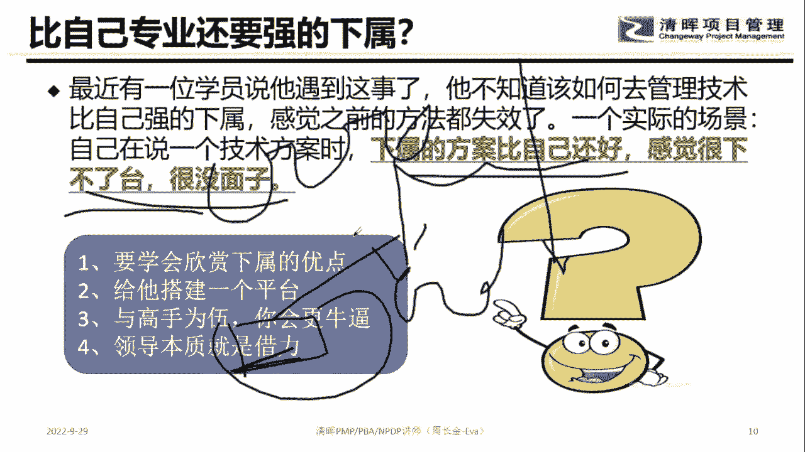
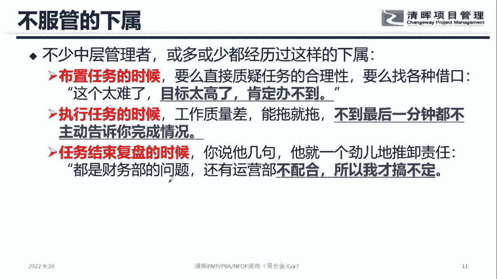
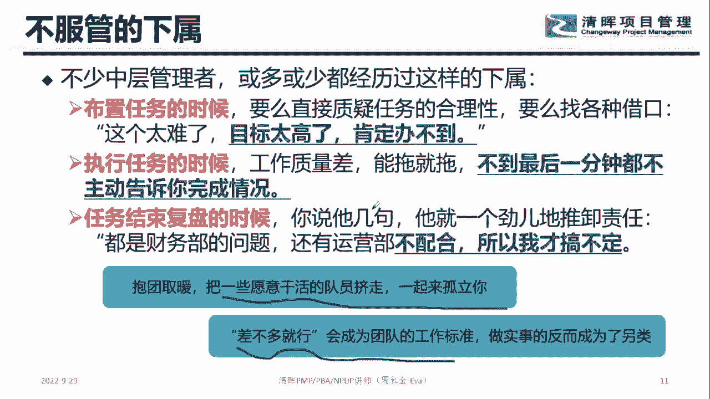
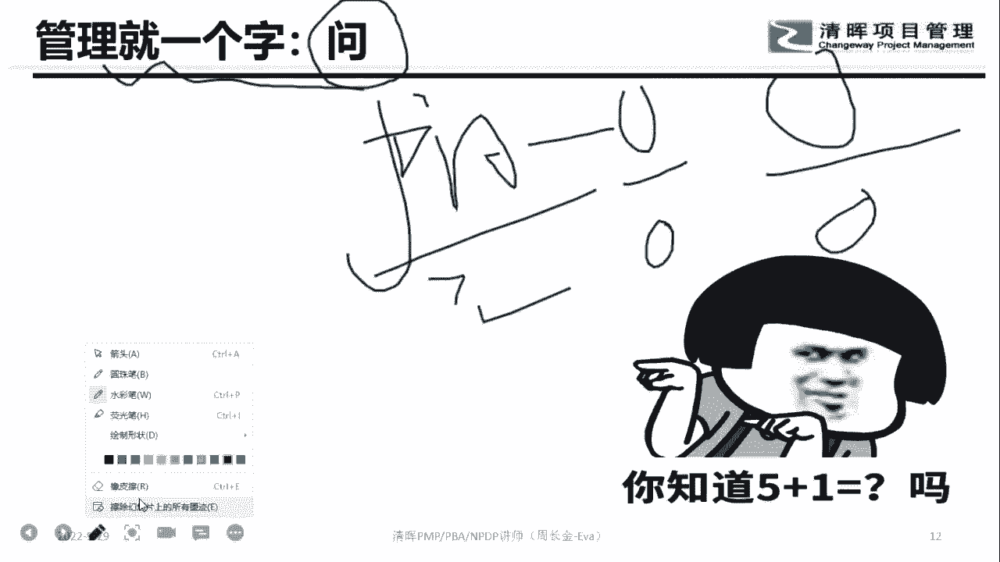

# 优秀管理者布置工作的步骤！ - P6：6.强势的下属怎么管理 - 清晖Amy - BV15t421K7dX

啊就是首先在整个这个地方怎么来关注下属嘞。

各位同学，你们有没有遇到比较强势的下属，先八卦一个话题啊，你们觉得自己是不是一个强势的项目，你觉得是的，打A不是的，打B8卦一下你们自己属于哪种，这个属不属于强势的下属，觉得是的，打A不是的。

打B自己属于哪种，你们四个属于哪种，呃我我我得跟你们说个事啊，反正我们家周老师就是一个强势的下属，就就是就是就是你们家周老师，很长一段时间都是一个强势的下场哈呵，那那也有一个弱势的下属，对不对。

那在整但强势的下属就是老板要进ICU，大家同意吗，强势的下属如果老板跟契合度不高的话，老板要进ICU，所以我不知道你们属于哪种啊，反正我们家老周，很长一段时间都属于A强势的下属哈哈。

那么在这个地方的时候，先八卦一个话题啊，就是如果你在职场真的遇到这种强势的下属，怎么办呢，强势的下属这个东西，你们觉得团队你首先八卦一个话题，团队要不要强势的下属，觉得要的yes，不要的NO。

就是团队里面要不要有强势的下属，觉得要的yes，不要的NO，要不要要还是不要，要还是不要，哈哈哈唉我觉得要因为有一句话叫啥，叫老板要听到不同的声音，OK吗，听过这句话吗，就是老板要听到不同的声音。

其实这句话就告诉大家就是要知道吧，因为要老板还是要听到一些不同的声音，而且强势的下属的他妈的驱动力很强，同意不强势的下属，他的驱动力是很强的，这里有两个维度，第一个维度就是声音是不同的对吧。

然后第二个我的就是，整个团队的驱动力是蛮强的，所以他也是有好处的哈，也是有好处的，但是强势的下属真的会让你进ICU的。

我跟你讲好那么一呃，那虾强势，那我们就不整，我们就不，我们就不理说那个虾强势的瞎强势，那叫狐假虎威，知道吧好，那么在这个地方的时候，我们大家做到一个话题啊，一般来讲所谓的强势的下属。

他要么就是在工作水平这一块对吧，解决问题的能力是比较强的，那这样一个下属的话，他一般来讲对领导的，对领导的一个干嘛服从，接纳程度是跟领导产生了一个干嘛，能力是有直接的关系的。

也就是说如果我是一个强比较强势的下属的话，那我其实更多的要看到老板，他在实际工作中展现出来的他的专业水平，或者他在遇到不同情境的时候，他解决问题的能力，那通过这个让我看到这个老板还是干嘛，还是靠谱的。

不是那种干嘛，不是那种草包型的，对不对，所以在整个这个地方的时候，大家注意到一件事情啊，就是我如果是强势的下属的话，你要干嘛，你要首先你要相信他，你要认同他的这个强势，对你的团队是有助力的。

然后第二个话题就是你要想办法干嘛，把你的这个下属把他的心给我干嘛收回来，那先收回来有两种，第一种方式就是通过你的专业能力，对不对，第二种方式可以通过精神层面，对不对，让他跟你记忆力干嘛拉近，对不对。

就经常沟通，然后软化它，对不对，用软技巧软化它。

这是种方式，那还有一种方式就是啥呢，就是我们在整个这个地方的时候变成一个干嘛，他的党靠风靠雨的这么一个人，记住一件事情，任何人都希望得到认可，同意这句话的yes，不同意的NO，就任何人都希望得到认可。

为什么职场很多的员工都会被PUA嘞，为什么职场很多员工都会被那个PV，为什么会被PUA，其实他就是因为在乎老板的意见，在乎同事的意见，在乎周边的这个关系，对他的看法和认知，对不对，因为在乎。

所以我我但我在乎的跟我没有得到的有差距，所以我们就会被PUAPA的话，其实就会得到抑郁症，对不对，所以在整个对接的时候，大家记住，但凡有人，但凡任何人都想要得到认可，那我们怎么让你的下属来认可你。

其中非常重要的一件事情就是干嘛，当遇到事的时候，你是一个能抗风抗雨的这么一个人，那这个地方就是我们通常说的啥，你是一个能够帮助抗风抗雨的这么一个人，当遇到事我能担当当干嘛，你需要支持的时候。

我全力以赴的给你提供资源，给你提供人脉，对不对，帮你牵牵线搭桥，那这么一个人的话，也是比较容易把下属给他联系到一块的，这是我们第二种方式，但无论是哪种方式，大家注意那件事情，我们都要保持你的边界感。

各位同学，领导跟下属必要的时候要不要一点边界。

感，觉得要的打A不要的打B就是我们再怎么样，对不对，我们是希望在职场的关系是一个合作的关系，但是合作的时候，我们还是有专业化分工的，在分工的过程中，我们要强调，有些事我就是你的领导，当产生歧义的时候。

你以我的意见为主，那当然这就事情捅娄子了，最终承担责任的也是我知道吧，我们要给他一个边界感，我们永远不要通过专业来说服他，因为如果他在这方面很牛掰的时候，你是说服不了他的，知道吧。

所以有些时候我们还要干嘛，还要适时的让自己有一定的边界感，说到这个话题哈，好，那么接下来第二种，比自己专业强的下属要怎么办，各位同学，你们觉得自己的专业比老大强的，打一没有的，打二听清楚。

就你觉得自己比老大的专业强的，打一没有的，打二听清楚，看一下你们自我诊断一下你们的情况，就自己感觉自己的人专业程度比老大强，就是哦我们家那个老大就草包一样的，对不对，每个解决方案都是我提的。

她啥也不懂对吧，把方案给他一看，这就看错别字，啥也不懂，有没有这种感觉，你们有没有这种感觉，但是各位同学看清楚情境哈，你们觉得情境中的这个管理层，是一个好的一个管理层吗，这个情景是啥。

这个情景是我前段时间在上课的时候，一个学员跟我说到的话题，他说啥，他说他要去读研究生，他为什么要去读研究生，他觉得他的专业没有办法覆盖他的下属，所以他打算读研究生，他认为如果不读研究生的时候。

如果不读研究生啊，那就这位同学说连错别字都看不好，他说如果不读研究生的话，我怎么在专业上碾压他，各位觉得下属的方案比自己还要好，感觉自己没面子，各位同学，站你的角度来讲。

你觉得这个老板的思路是对的还是错的，觉得是对的，说一下理由，觉得是错的，也说一下理由，觉得是对的，打yes，然后说一下理由，觉得是错的，打NO说一下理由，就如果你认为他是对的，说一下理由，多敲几个字哈。

如果你认为他是错的，No，然后也说一下理由，又是下属的班比自己好，自己没面子，你觉得这老板的这个作为管理层，这个思路是对的吗，这思路是对的吗，这思路是对的吗，这思路是对的吗，肯定不是对的嘛，我跟你讲哦。

我跟你讲哦，如果你们家周老师要是是这种情况，就没面子的话，你们家周老师的面子已经到了，干嘛就到那个海底，就想到海底下的300米都不够，叫-300米都包容不了，所以记住一件事情啊，记住一件事情。

我们作为管理者做的事情是100减X，三十一百减X，其中X是谁可以做的，下属可以做的，知道吧，然后我们的能力其实做的就是100减X啥意思，这个100减XX是下属可以做的嘛，对不对，也就是下属做不了的。

是我们这个层次要去推动来开干的，所以呢下属能力比你强，你要烧高香，知道吧，下属的能力比你强，你要烧高香，知道吧，你你还你还不开心，你还觉得没面子，我跟你讲，但凡你下属的这些能力都比你强。

然后你能够通过管理的方式把他们融入到这个，你知道你这个管理层得多悠闲自在不，你这个管理层就一天到晚，就早上8。9点钟去喝咖啡，喝到下午五点还在喝咖啡，那这是多么的悠闲的一个管理层啊，这得多自在啊。

对不对，所以遇到这么好的领导，你要这这么这么好的下属，你要烧高香，你知道吧，一天到晚还跟下属来比，哎呀死不要脸，我跟你讲，所以遇到这种下属的话，不要觉得自己没面子，你要超有面子，知道吧，有本事。

别的部门老大给我拿几个能力比你强的呀，对不对，这些都能力强的话，那你的时间精力就释放出来了，你的时间和精力释放出来了，你就可以更多地承接公司战略，业务板块相关的更重要的事情，锁定方向，做计划的布局。

对不对，然后做到专业化分工，各司曲折对吧，这个多优秀啊，这玩意你还你还觉得没面子，说明这个人不适合当领导。

知道吧，好那么在整个对接的时候，大家注意到，如果遇到专业比自己强的，那怎么办，第一个维度要欣赏，他，知道吧，本来人家就很牛掰，是不是，而且人家填补了你的空白，这多优秀啊。

那第二个问题就是你要给他搭建一个平台，各位为什么要搭建一个平台，各位同学记住一件事情，很牛掰的零，如果他没有一定的发展空间，是留不住的，同意的yes，不同意的弄，就我为什么有一个下属被恒大给挖走了。

对不对，就我还没来得及搭建平台的时候，然后那恒大那个神经病公司直接就给年薪翻倍，对不对，比如说40万直接变80万，那完犊子对不对，所以针对这种很牛掰的人的话，你要给他成就感，在成就感产生的时候。

顺带给他干嘛，物质的满足，对不对，所以这样一个员工的话，他在乎的是成就感，就他的存在感和成就感，那如果没有这个平台，你是留不住的，你总不能一个队伍里面全是二百五吧，对不对，那肯定不能这样好。

还有一个话题是啥，就是人家专业比你强啊，大哥你跟着他是不是可以学到东西哦，同意吗，同意的打一，不同意的答案就是人家专业比你强诶，人家专业比你强诶，那你是不是可以学到东西嘞，就是跟高高手站在一块，对不对。

你每个人都是高手，十个人都是高手，我跟你讲，那我跟这帮人接触，我学的东西那可多了，对不对，我都不用去读EMBA，我就学到东西了，这多好啊对吧，所以不要老是觉得什么什么之类的好，最后一个维度记住这句话。

这句话就价值值5000块钱了哈，领导者的本质就是干嘛借力，各位同学借谁的力，领导者的终极本质就是借力，借谁的力，大家还记得吧，借力还记得领导者管几个人，管五个人，知道吧。

这五个人身边所有人贡献的钱都是你借的力，这个叫啥，借力打力，知道吧，所以作为管理层不要了，借力是啥意思，各位同学告诉我，借力是自己干还是别人干，戒律是啥，用江湖的话来讲，戒律就是用别人的资源干我的事。

还让对方感谢我，这叫借力，听清楚这句话哈，借力就是让别人用别人的资源做我的事儿，还让对方感谢我，这叫借力，你知道吧，所以一天到晚就嫉妒下属能力比你强，觉得自己没有安全感，觉得自己下属会取代自己。

我嘞个娘，你老人家连这这点格局和视野都没有，那下属跟你还能是个什么关系。

对不对，所以悠着点哈好，那么接下来关注这个话题，不服管的下属，有没有各位觉得自己算不算不服管的下属，觉得算的，打A不算的，打B你们属于哪种哎，就就你老人家属不属于不服管的下属，我先跟你说一下。

你们家周老师很长一段时间属于这个不服管的，为啥，知道吗，对不对呵，其实其实你发现一件事情，领导之所以当领导，人家还是有点水平的，对不对，人家还是有点水平的对吧，不服管的下属肯定是存在的。

那这个时候怎么办，各位同学看清楚啊，那有些时候你就会发现一件事情，你给他，你给他布置点任务，你知道他会说什么吗，就这个任务还没有到他手上，他直接给你来一句啊，这个事情太难了，我做不到，这比如说你跟你。

你跟他去说，你去跟那个你去跟供应商谈一下对吧，谈一下，把那个什么设备，把那个设备对不对，把那个设备啊，然后借用我们三个月，什么什么之类的，然后他这个这个任务还没领过去，他直接说哦。

这个事情我怎么做得到啊，人家凭什么免费给我们用啊，对不对，还用三个月，太过分了，你怎么能这么过分，把我们笑死了，你知道吗，所以在整个这个地方住到，就就有这么一个下属，知道吧，就有这么一个下属。

然后还有一种情况是啥呢，还有一种情况就是在干活的时候，在干活的时候，你知道就是那种帕金森，你知道拖延症拖死你知道你给他五天，你给他五天，然后让他做三天的活，他通常在礼拜五的时候才开干。

然后干到礼拜五的凌晨两点干完了，他还发个朋友圈，哎呀又是加班的一个晚上，哼所以我跟你讲，这种员工能把你气死，就是这种拖延症的员工，就是干活的时候老是啪啦啪啦啪啦的，你知道好，那还有种什么员工呢。

各位同学就是干活吧，干到结果啥也不是，知结果都没产生，然后他会说呃，又不是我不想干的，那帮财务部不支持我，市场部也不支持我，研发部也支持我，销售部也不哪哪哪个部门都不支持我，而我肯定搞不定啊。

所以你会发现一件啥事，就是当结果产生偏差的时候，他会把这个责任推卸出去，当然这玩意不是我的对吧，那我肯定是想干的，那不是不是我那个就能怎着，那还有一个我就就拖延症，对不对。

那拖延症这玩意最好的解决方案就是啥，盯死他就盯死他，盯死他，你知道我有一个下属曾经就有这种拖延症，拖延症的这样一个下属，最好的解决办法就是干嘛盯死他，盯死他怎么定嘞，我不是问他每周三跟我汇报。

不是这样的，就是拖延症的这种下属的话，我曾经就治过一个人，我大概治过，治过他两个礼拜，他这个就改了，我大概治了他两个礼拜就改了，啥意思，我面向这个员工的时候，他在电梯里面，他在上厕所，他在茶水间。

他的餐厅，他在路上散步，但凡我遇到这个人，我就要问他工作怎么样啊，工作怎么样啊，工作怎么样啊，工作怎么样啊，然后让他汇报10分钟，我每次在任何一个场合，只要我遇到他，我就让他汇报10分钟，只要没有。

只要这个事情发现他没有进展的时候，我就会让他来我的办公室说一下，下一步你打算怎么干，下一步你打算怎么干，下一步怎么干，我盯了他两个礼拜，你知道这个员工到后来怎么着吗，就他遇到我的时候。

你们家老周都不用说话的，他只是说老大我跟你汇报进展，老大我给你汇报进展对吧，那这种员工的时候，你盯死他，当他捕捉到不断的规律的时候，他就会干嘛，他就会干嘛，他觉得这种事情脱不了对吧。

所以有一个办法是这样，然后这位员工是说，那他两个礼拜辞职了怎么办，走不就走了呗，走了就走了呗，走了就走了，你看他又是拖延症，然后因为这个盯着他走了，那说明这个员工就干嘛配不上你部门的工作呗。

你记住一件事情啊，员工是静态的还是动态的，八卦一个话题，员工是动还是静，你觉得动的打动字觉得近的打静止，员工是哪种状态，动态的还是动静还是静好，那第二种情况是啥呢，这种情况啊，看清楚。

如果是这种员工的话，我们待会再来说，先说这种员工复盘的时候，老师给我找借口，那这种员工的话，我们就要给他锁定责任制，RACI啥也是就这个事吧，最终无论这个结果怎么样，无论是因为什么问题，这个事搞不定。

最终的责任都是你，我们要给他锁定责任，就是让他在初期给他定计划的时候，让他连推卸责任的借口都没有，那这种员工我们要锁死他，知道吧，是钱就锁死他，是钱就锁死他好，那么接下来说的第一种员工。

如果这个人给他布置任务，他就拖拖拉拉，那怎么办，那这个时候有个维度哈，就是有一种员工是what让你做什么事的时候，然后他会说干嘛，他会说why我为什么做不到，对不对，那对这种员工的话。

最好就把what改成啥嘎嘎Y改成how，对不对，就是我让你做什么事，你跟我说为什么做不到的理由，我不要听，为什么做不到的理由，我要听我应该怎么办，可以做到能理解这句话吗，Yes or no。

就你要把这个思路给我调整过来哈，就当你员工的时候，他跟你说，我为为什么做不到理由的时候，你要把他思维给调回来，调成啥，调成你告诉我需要做什么这个事才能办成，就是how把它拆分开来，知道吧。

就是你不要跟我说做不到，你要告诉我通过1234567怎么干，怎么配合这个事能办成，然后1234567哪些是你可以做的，哪些事，作为老大的，我需要辅助你的，也就是说我一开始就不给他干嘛。

号不为什么做不到的理由，我要告他，我们拆分开来是怎么来拆，然后各方怎么配合这个事可以做到能理解吗，所以这三种方式我们给大思路哈，记住不同的思路好，然后呢这啥玩意。

所以呢大家一定要记住一件事情啊，你知道如果遇到这种这种零下属的话，完犊子我跟你讲，就真的是把那种愿意干活的给你挤走了，对不对，虔诚的那种，差不多，先生太恐怖了，跟你讲太恐怖了哈，太恐怖了。

所以大家悠着点哈，悠着点啥玩意，领导的指导啥意思啊。

就你你这句话是基于什么情境，所以各位同学记住啊，管理最终的时候就是体现出来的就是一个字，问知道吧，多问事前去问，事中去问，事后去问事，前期问叫前馈管理对吧，事中去问叫监控，事后去问叫啥复盘。

所以整个管理这块的时候，我们最终体现的就是哪个字，就是要问知道吧，要问好，那么在整个这个地方的时候，大家注意到一件事情啊。

