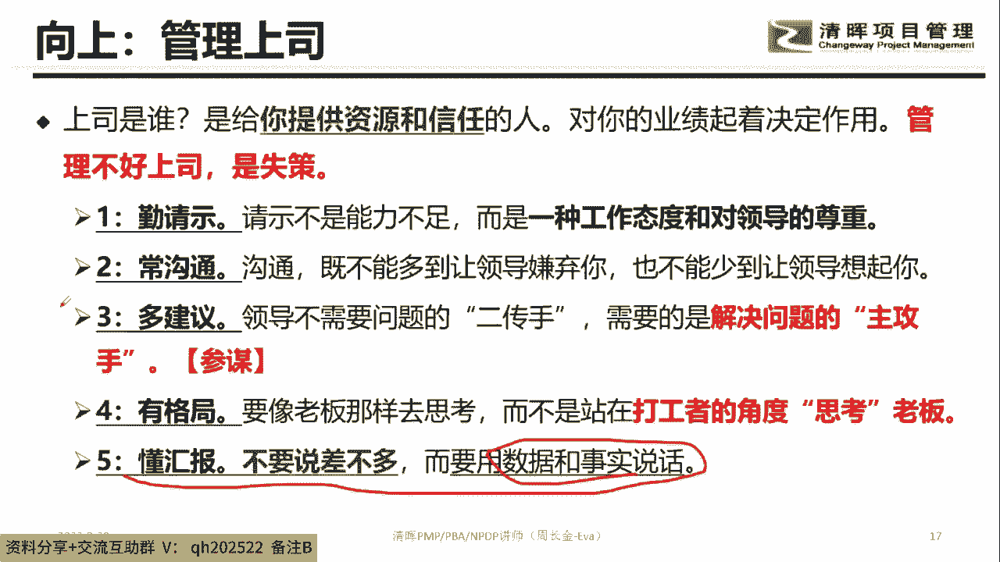
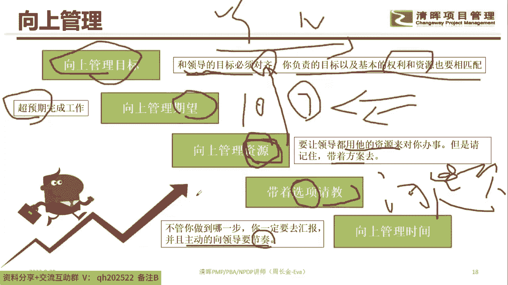
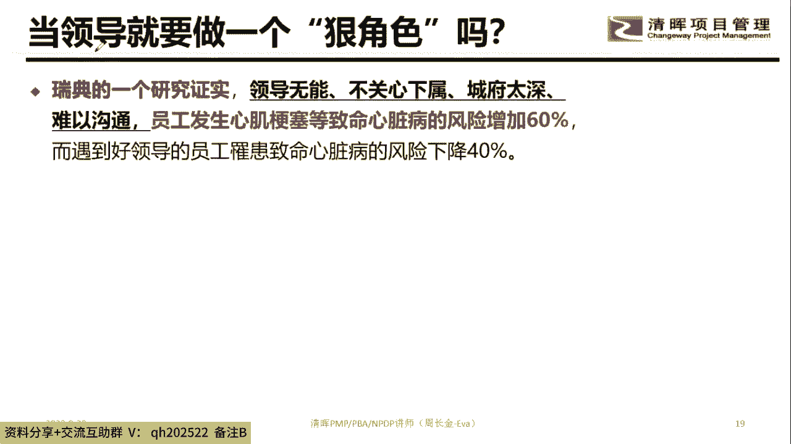
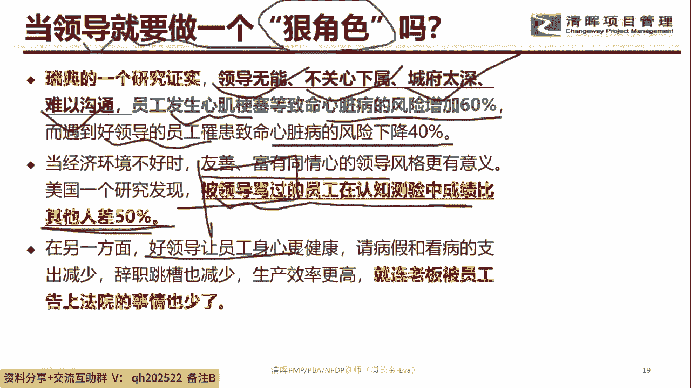
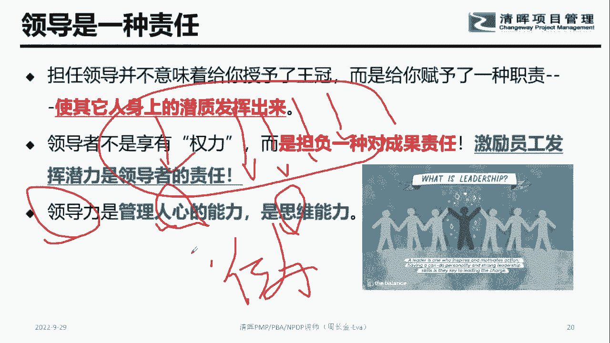
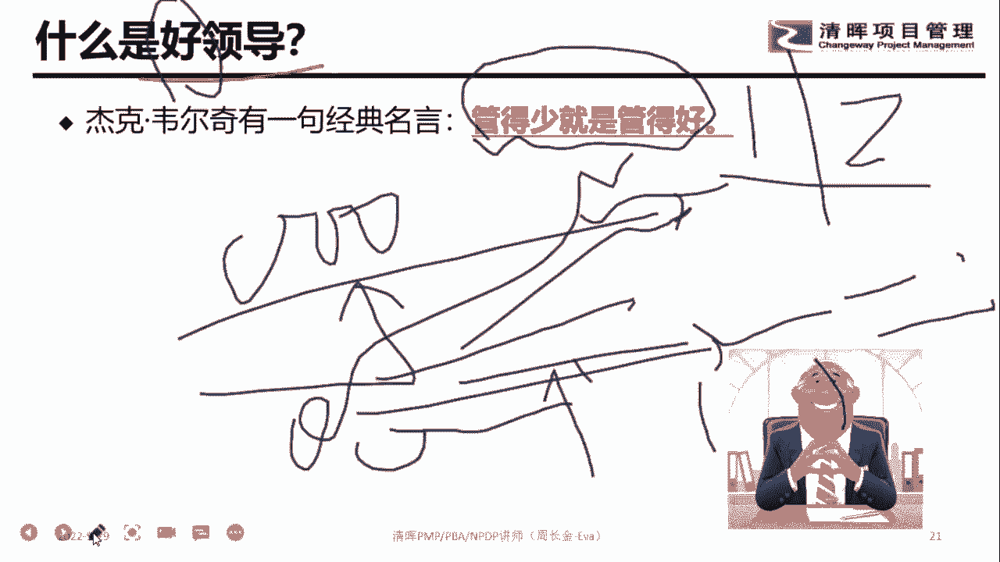
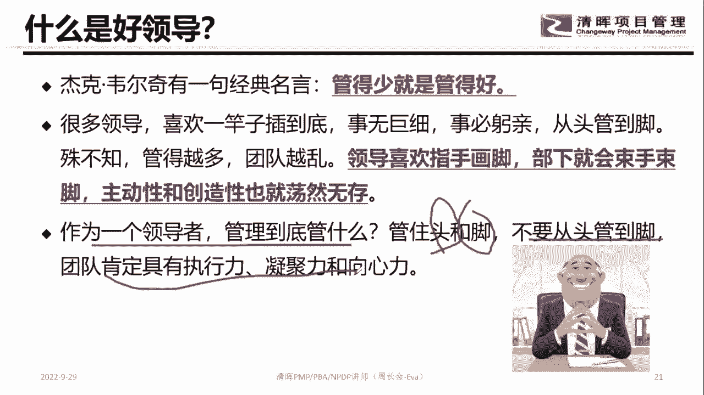
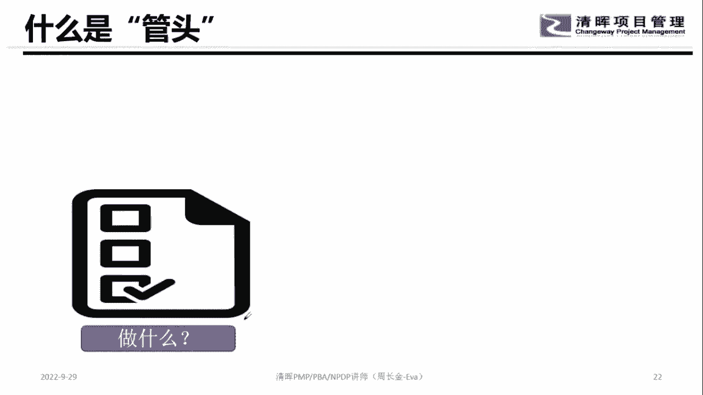
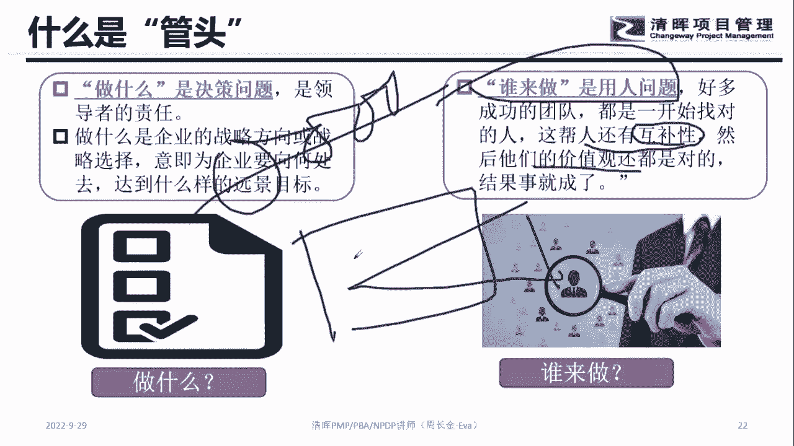
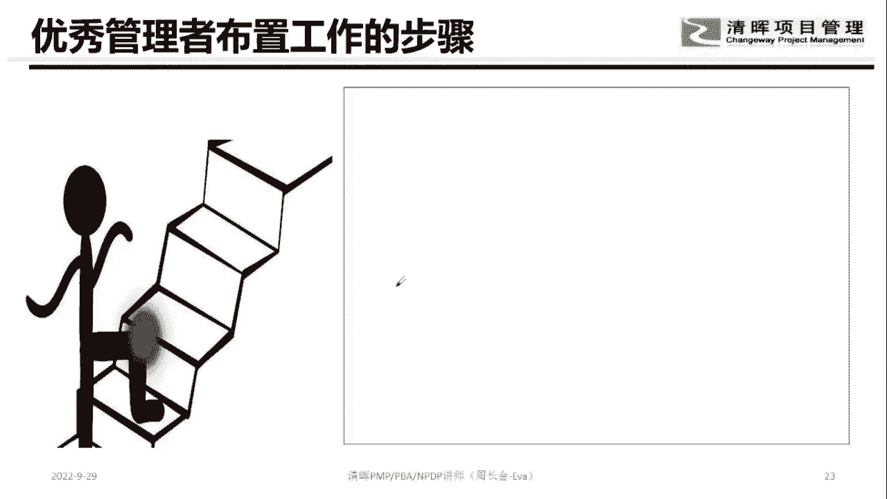

# 优秀管理者布置工作的步骤！ - P7：7.向上管理上司 - 清晖Amy - BV15t421K7dX

唉一个都没有，不要跳，知道吧，否则有可能找不到工作好那我刚刚说了半天，就说作为领导跟下属真是怎么对接的，那接下来说作为下属，因为要要让下属听得懂你的话，那你老人家听懂了之后要怎么办，听懂了之后要怎么办。

那肯定要向上管理，首先问一下大家，老板也是要安全感的，同意的，打一不同意的，打二老板也是要安全感的同意吗，呵呵老板也是有安全感的，同意吗，同意打一不同意打二好，那么在整个对接的时候，大家注意到啊。

就老板是谁，老板是给你资源和信任的人，你知道吗，就是如果管不好老板的话，其实很多事搞不定，为啥记住老板手上有资源，老板手上有人脉，老板手上有人脉，老板手上有影响力，也就是说一个事情要不要搞成的话。

老板对你的支持非常重要，所以悠着点哈悠着点悠着点，你听懂了，笑说的话，那接下来就得开干嘛，对不对，开干你不能把老板丢一边呐，你啪啦啪啦的往前干，老板自己还在这个角落里面，你跑到这么远了。

那老板会觉得你给我回了，这是由黄老，我跟你讲，对不对，所以在向上管理的话，要注意到第一个维度，多跟老板沟通知道吧，所以让老板知道你这个事是在干的，那多请示这个维度，就是不是说一定要说老大啊。

我们要沟通个15分钟，不是这样，多寝室的话其实就是干嘛，就是你在做这个事的过程中，你要让老板知道这个事是他做主的，是他给你授权的，知道吧，是他同意这么干的，知道吧，不要老自己蒙叉叉，自己去干。

然后第二个话题就多跟老板干嘛聊一下，让老板知道对不对诶，我们家小张是在做这个事的，做的还不错，然后再咔啦咔啦在努力的对吧，所以勾记住一件事情，哪怕是老板喜，哪怕是老板讨厌你，也要让他想起你同意这句话吗。

你说这这话啥意思，就是常沟通的目的就是找存在感，知道吧，就是哪怕老板不喜欢我，我也让他知道有我这么一个人在，这个就非常重要哈，非常重要好，那接下来的话就是不要经常问老板怎么办，对不对，我们要给老板建议。

对不对，我们要当参谋，知道吧，不要当二传手，二传手，你要当二传手，当久了，你就基本上就完犊子了，对基本上就完犊子了，基本上就完犊子了哈，好然后第二个话题就是干嘛，就是我们在老板的过程中。

你要去干嘛呃第四条是很难做得到的，各位同学，你们觉得自己做到了吗，觉得自己做到了吗，第四条就像老板那样去思考，大家觉得做到了吗，举个最简例子来讲，举个最简单例子哈，就是劳务们不给你加薪。

他是站在你自个的角度，还是站在公司的角度八卦一个话题，就是老板不给你加薪对吧，然后站在公司的角度，他不给你加薪是因为啥，是因为第一个维度，公司可能业绩不咋地，对不对，然后第二个维度是干嘛。

是给你一个人加薪，可能会产生一效应，对不对，导致整个团队的不稳定，因为他整个公司全员加薪，他是做不到的，但站在你自个的角度嘞，你可能会觉得干嘛特别不开心，所以所谓的这个这个格局的话。

其实就是网上考虑两个维度，对不对，网上考虑哪个维度了哈，在这个话题好，最后一个话题就是我们要多去用什么说话，用事实跟数据说话，所以在整个这个地方的时候，非常重要的是哪个。

第三条，第四条，这是重中之重哈，重中之重好，那么在管理上市的时候其实非常重要的，最终的话我们都是要满足谁的目标，老大了，知道吧，八卦一个话题，你们有没有不了解老板目标是啥的。

就是你老板的年度KPI或者KI不熟悉的，有没有不熟悉的，有的yes，没有的NO，就有没有对老板2022年他的KPI，他的OKI到底是啥不了解的，有的yes，没有的弄有吗，好梁也就说你向上管理的话。

就是你的任务要跟整个部门的，或者领导的要对齐，知道吧，这样的话你你你的权利跟资源才能匹配，你要第二句话就是干嘛，你要去向上管理，什么叫向上管理，期望啥H超预期的完成，那才能开心嘛，对不对。

你老人家完整个事你要求你做十分，你老人家让我做七分，那不把老板给气死，什么叫超意气，意料之外呀，你还能做成这个样子，对不对，超开心的那种，第三条就是要主动跟老板要资源，知道吧。

就是因为你本来如果你的任务，跟老板的目标对齐，你本来就是为他完成效能的，你为他完成效能，用他的资源理所当然知道吧，然后老是觉得哎呀，不好意思呀，我怎么能用他的嘞，对不对等等之类的。

不要那第四个维度要干嘛，要带第四个我就要干嘛，要去请教，带着什么请教，带着选项，带着方案，带着思路去，你不要直接跟他说，老大怎么办，老大给你凉拌，我跟你讲，所以呢你要让老板做选择题，知道吧。

让老板做选择题题，不要让老板做问答题，因为有些时候老板蒙叉叉啊，所以在整个这个地方的时候注意到好，那么还有一个话题，就是你要经常跟老板汇报一下，对不对，因为有些时候你跟他汇报多了。

其实老板有些时候他能判断你工作中的偏差，他其实跟你去纠偏，所以向上管理汇报，不代表是说一定要让老板干嘛，一定是老板怎么能折腾你的，其实你在汇报的过程中，老板他能够判断你整个执行的工作有没有偏差。

所以作为下属的话，你听懂了老板的话之后，你要学会向上管理，知道吧，把你的事跟他做一个对接。

做这个话题哈，好那那样的领导哎，注意到有没有不合格的领导，觉得有的打一，没有的打二，今天周老师所有的课程，都假设这个领导是合格的哈，听清楚我说的话啊，现实中有没有不合格的领导，觉得有的打一，没有的打二。

现实中有没有不合格的领导，肯定有嘛，对不对，我们今天的课程是假设你们家领导是合格的，知道吧，假设你们家领导是合格的，我也不知道是不是合格的，我必须更提醒一件事情哦。

作为老板不要成为一个这样一个角色，我不知道你们有没有关注过，其实在职场这个官方的一个行业调查数据的，就是，当你的老板不靠谱，不关心下属，城府很深或者难以沟通的时候，员工的心肌梗塞率会达到60%。

然后遇到好领导的员工，这个心脏病的风险会下降40%，那还有一个话题是啥呢，如果一个富有同情心的老板的话，那他被看清楚，就是美国有个研究发现，被骂过的员工在认知测验中，成绩比其他人差50%。

这句话翻译过来是啥意思，就员工越骂他的效能越差，所以提醒在座的各位同学，不要动不动骂下属，知道吧，这样很缺德，我跟你讲，对不对，这样很缺德，就是这就是不合格的领导啊，就是遇到事儿对不对，待会会讲到哈。

待会讲到什么叫不合格的领导，就是被骂过的员工，他的效能会很差，所以不要动不就骂，你知道吧，骂这玩意，你就把他给骂笨了，对不对，这是不靠谱好，还有个话题就是干嘛，就是如果一个领导特别好。

那你这个公司跟员工打官司的机会也比较少，在我这个地方其实属于题外话的，题外话，就希望大家干嘛，希望大家成为一个好的领导，没有声音了吗，哼等一下各位同学有没有声音啊，有声音的打一，没有声音的打二有声音吗。

没有声音了吗，有没有，就没有声音的说一下啊，你们跟后端的工作人员对接一下或者退出，然后再进来，好不好好，那么接下来大家注意到领导是一种责任，什么责任呢，看清楚，最终的责任是让他人身上的潜质给我发挥出来。

所以作为领导不是那么容易的，知道吧，这句话翻译过来就是四个人都是有能力的，只是这个能力你老人家没有找出来而已，这句话的潜台词就是职场没有笨的员工，对不对，只有没有找出来干嘛，有潜力的领导。

也就是说你没有把人家的潜力给挖掘出来，每个人都有合适的事，你知道吧，所以作为一个领导的话，非常重要的一件事情呢，对成果负责，他的非常重要的是干嘛把员工给我激活，也就是说小张同学跟了你3年。

那老人他的能力好歹要上升吧，好歹要上升吧，比如他以前是4000块钱的工资，跟了你3年，好歹要变成1万8吧，如果变不到，那就说明你不是一个好的领导，因为最能体现员工能力的进步的就是收入，同意吗。

同意的打一不同意的啊，最容易体现员工的能力有没有进步的，就是他的收益就是在职场，在公司的收益，同意吗，Yes or no，同意的yes，不同意的，No，当然你不要说特殊环境哈。

特殊环境就是有些领导就是一天到晚给你副处，副处，但不给你加薪，这种领导很少的哈，这种领导很少的好，所以在整个这个地方的话，大家注意到作为一个老板，他非常重要的时间和精力是干嘛，是管员工的心，你知道吧。

管人心的能力，管思维的能力，知道吧，不是管行为，你知道吧，所以呢他是干嘛，他是把员工的思维能力，系统思考整合思考，谈判力对吧，问题解决能力，假设情境能力等等，把他培养上去了，那么他的执行力。

那么他的交付成果就上来了，那最终的话你整个部门的效能也就上去了，知道这个话题哈，嗯那画饼的不够好。

哎你们现在的老板还在画饼吗，你们家就我跟你讲，你们家老周也是个老大，对不对，我都好多年没有画饼了，我都好多年没画饼，我觉得画饼这个东西太虚了哈，好那是什么叫好的领导嘞，各位同学八卦一件事情，听清楚。

管的少的就是好的领导，同意的打一，不同意的打二呵呵，管的好，管的少的就是好的领导，翻译过来是啥，翻译的过来就是如果出现问题，老板不是直接就去解决问题，而是让下属自己搞，然后老板喝杯咖啡。

让子弹飞火飞火飞火，也就是有些时候该说的事儿让他去做，然后你在这个喝咖啡的过程中，观察员工的执行力怎么样，然后给他搭把手，让这个事搞定，这个就叫啥，好的领导，知道吧，好的领导好。

所以在整个这个地方的时候，老老板啥都干怎么办，老板啥都干，烦死他，哈哈好认真听课啊，教一下你老板啥都干，应该怎么办，就是有些领导他喜欢干嘛，指手画脚的，知道吧，然后你的下属就束手束脚，对不对。

然后主动性创造性就没有了，记住一件事情，老板管的越多，下属的智商IQ就越低，然后呢EQ也会越低，然后呢抗压力就会干嘛就会越高，因为受不了了，知道吧，所以在整个实操的过程中，记住两个字，授权，你知道吧。

授权是啥意思呢，该谁做的，封给谁，自己不要瞎折腾，你知道吧，术业有专攻，做到这个话题，那如果我们家的老板是那种特别喜欢管的嘞，我建议你就花一个月到两个月的时间，每天都汇报，天天都汇报，天天都求助。

烦死他，烦到最后他会说不用给我整了，我相信你自己开干吧，以后不要天天烦我，哼，有些时候做到这个话题哈，做到极致的时候，他其实就会放手，同意吗，Yes or no，做到极致的时候他就会放手。

他不是喜欢管吗，我一天汇报八次，对不对，我烦死他，我烦到他，最后说你为什么什么事都要找我好嘞，这句话的潜台词就是别找我了，你自己看着办吧，你就解脱了，知道吧，你就解脱了，所以不要遇到这种跟你不匹配的。

然后就很无助对吧，我们是有很多解决办法的，对不对，我用了很多解决办法的，到时候你不会可以找周老师对吧，职场这种小技巧，分分钟帮你搞定好，接下来的时候大家注意到，作为一个老板呢，要吗几点结束啊。

如果你们有事可以提前离开哈，我们正常是09：30结束，我们班的同学如果有事可以提前离开哈，他是他是可以，那个他是可以回看的哈，有事可以提前离开好，那么接下来这个话题大家注意到。

做不到极致说明你的心不够狠，做不到极致说明你心不够狠，职场的话其实就是这个字，谁狠谁就有话语权，谁狠谁就有话语权好，接下来说的这个话题啊，因为作为一个老板，对不对，那你我们刚刚说过，要让下属听得懂啊。

那那怎么管，管到什么程度，OK嘞，记住管头跟管脚，看到没管头跟管脚中间就别管了。

知道吧，那中间别管了，那咋搞嘞，各位看到黑板啊，什么叫是头嘞，投就是第一个维度做什么。

第二个维度干嘛，谁来做，这叫管投，知道吧，那么在整个做事这个话题的时候，大家注意到一件事情，就是说做什么是啥决策问题，是决策的话题哈，是我们在整个这个地方，在企业层面来讲，作为你来讲。

你承接的这个事儿对不对，跟公司的战略跟部门的KPIOK啊，他的匹配程度是啥，对不对，然后你确定做什么事，能够满足这样一个业绩的指标对吧，那这个维度你是要判断下来，也就是说如果你这个判断的方向都错了。

那你整个团队努力的方向也错了，这个部分肯定要搞定，那么第二句话是啥呢，第二句话就是你锁定好的这个事儿，比如说我们说业务拓展对吧，我们要进入新的市场去业务拓展，那业务拓展这个事情。

是不是真的跟集团的经营目标能够匹配呢，那你这又拓展在哪里去拓展，它是能够干嘛，为国为集团的经营目标去做贡献呢对吧，这个部分你是要去判断的好，你判断好了，接下来你就要翻译过事情上谁适合做这个事。

谁适合对吧，谁适合做这个事情，记住一件事情，团队是干嘛互补的，不要老想着干嘛，不要老想着把一群一样的能力的人放在一块，一定是一个互补的一个作用，互补的，觉得这个话题，所以谁来做，这个是我们要决定的。

作为老板，我们要关注第一个维度做什么对吧，就是以哪个方向去开展什么工作，第二个话题是啥，谁来做这这个话题啊，谁来做好，那么管脚这个维度，那接下来的时候，那确定做什么，谁来做。

接下来就是你的队伍接手这个任务。

在开干知道吧，那么在开干的过程中。

