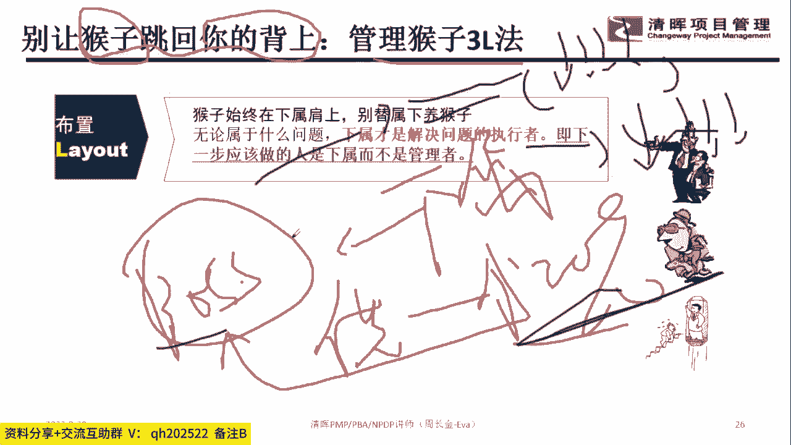
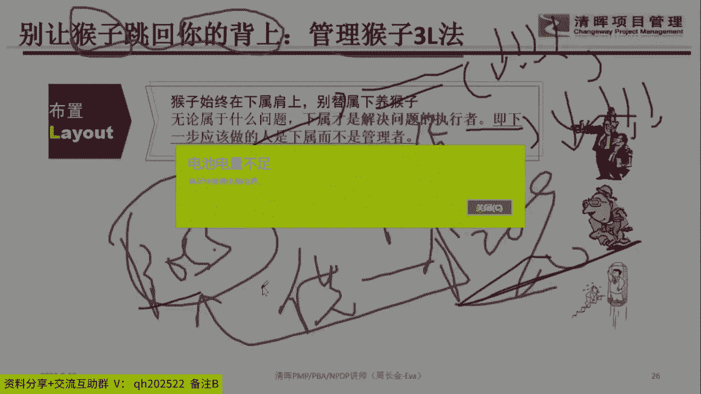
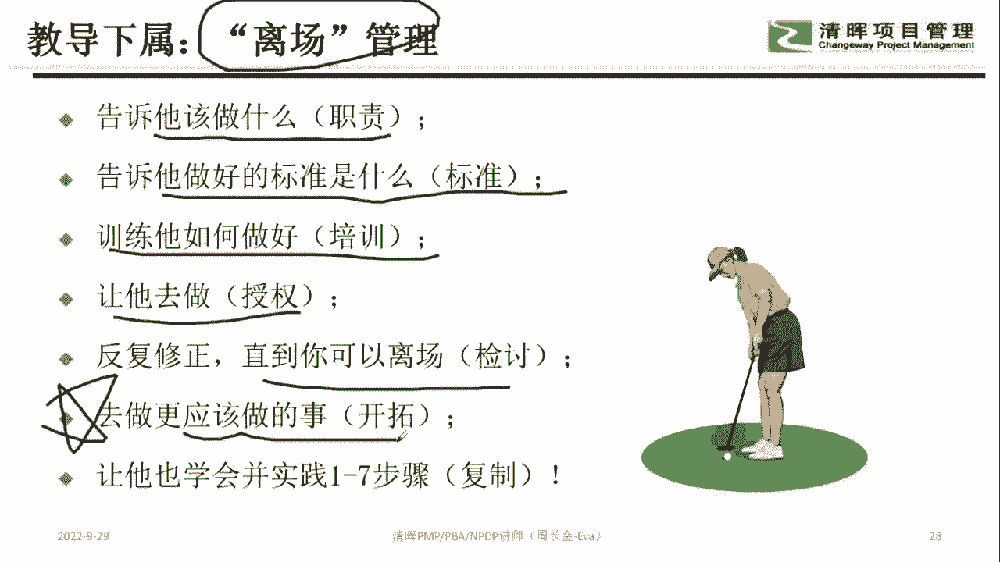
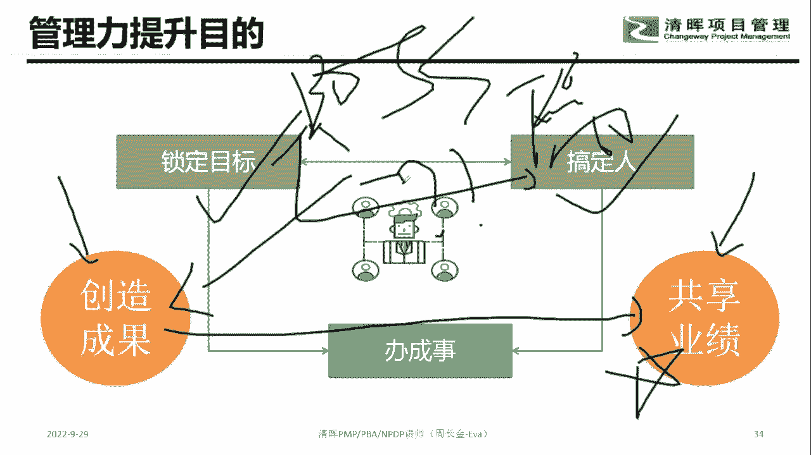
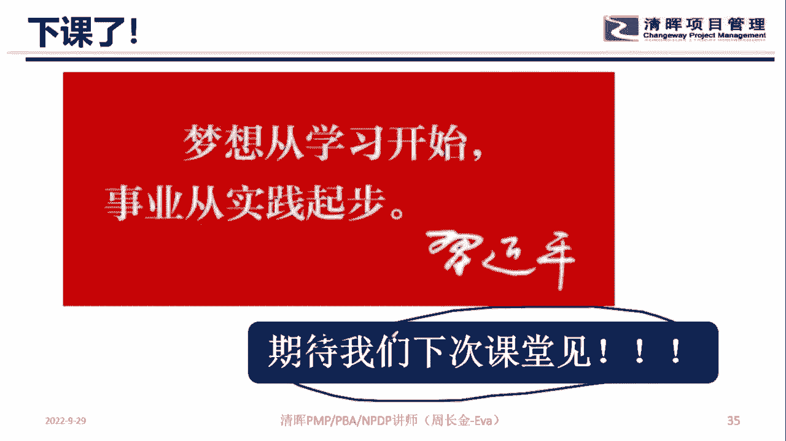

# 优秀管理者布置工作的步骤！ - P8：8.什么是“管脚” - 清晖Amy - BV15t421K7dX

整个这个地方的时候，我们刚刚说过管完头对吧，管头就是要做什么，谁来做这个很重要哈，那第二个话题是啥，管脚管脚是啥意思呢，就员工的时候，在头跟脚中间肯定是要干活的对吧，那在干活的过程中。

我们不能让他直接就去开干，我们还需要做一个辅助性的工作，辅助性的工作，第一个话题就干嘛，我们要给他提供资源，知道吧，我们不能让员工之间，我们我们不是09：30下课吗，等一下周老师记错了吗，我们不是09：

30下课吗，哪位同学，我们班主任告诉一下我是几点钟下课啊，我印象中好像是09：30下课吧，那个8671同学，哪怕时间到了，你也不能这么提醒我啊，哎呦你个死人，你老人家是不是打算泡脚啊，不是现在不是9。

07吗，现在不是9。07吗，我看错时间了，我看错时间了，哎呦这种提醒我下课的学员太气我了哈，那个PDU就不要给他了，我看看是哪位同学提的，刚是哪位同学提的，就那个手机用户8617的那个同学。

不要给他PDU了，太烦人了，好接下来在这个地方的时候，注意到就管脚告诉人家做什么对吧，然后谁来做，那接下来的时候你要给人家干嘛，就是从头到尾在中间的过程中，你要配合人家对吧。

所以在这个地方就像我们说提供资源，提供资源，就是你要给人家资金，要给人家，人，要给人家设备对吧，要给人家环境，要给人家搭配人脉，也就是说人家不会的，你得手把手的教人家知道吧，人家不会。

人家手手把手的教人家知道吧，手把手教人家好，那第二个话题，哎我又不是娘娘，还赐一丈红，然后第二个话题是你你你你除了提供资源，你还能干嘛，当好教练，你知道吧，你要教人家教人家，不要说我像你知道职场职场。

职场的下属最恐怖的一句话，听最恐怖，听到一句话就是我相信你，我们家以前老板就跟我说过这句话，我真的想杀了他，就我们家老板，当年你那所有的人的能力都是慢慢的进步，知道吧。

就我们家以前那个老板就来一句小周啊，我相信你，我相信个锤子嘛，我相信我本来就不会，你还相信对不对，所以在整个这个地方，你相信我大哥，你就是不能相信我啊，因为我不会，你知道吗，所以这种老板是最可怕的是吧。

所以我们在整个整个对接的时候，你不能说我相信你要干嘛给人家思考，给人家思路，给人家方向，知道不好，第三个维度的话，我们还要干嘛，就是关注节中间人家怎么带队伍，对不对，人家怎么带团队，人家是去搓麻辣烫嘞。

还是喝着啤酒小龙虾嘞，对不对，人家是怎么管的，你不要猜，你知道吧，就中间人家怎么干的，你不要去插手插脚的，你把所有的过成交给人家，知道吧，这是一种授权，也是一种干嘛信任，你就看结果，不要老是我。

我总感觉你这样是不对的，我总感觉你这样是不对的，那哪里有这种感觉嘛，对不对，所以呢过程交给人家，你就看结果，对不对，好最后一个维度的干嘛要共享经验，是不是人家不会对吧，你要教人方法论，还要教咦。

我们公司我们行业，我们产业哪里以前做过这种事情啊，来来来，可以参考一下，你去看什么什么资料啊，可以去抄一下别人的，这叫啥经验，共享经验共享的话，可以帮准你的团队在执行工作效率产出的时候。

你们的周期是可以缩短的，对不对，最后一个维度记住一件事情，就当真的捅娄子的时候啊，你老人家要扛风扛雨，知道吧，不要说小张，你怎么回事啊，这点事情做不好，你老人家能够抗风抗雨，知道吧，要承担责任。

所以作为一个管理层的话，他是管投管脚的吧，你各位同学，你们自己做到了没觉得做到了，打一没做到的啊，周老师是江西的，江西的，江西的，怎么就变成广东的了，来我上个课，我还改了籍贯呢。

啊我上个课我还改个籍贯呢，啊我上个课我还我还改个籍贯呢，呵呵好，知道这个话题啊，江西的江西的不是让我们去旅游吗，好接下来的时候大家注意到，就你在给你在给他们安排任务的时候，要记住一个规则啊。

这个规则特别重要，就别让猴子跳回到你的背上，这句话啥意思，扒过一个话题，就你们在工作中啊，就比如说你是boss对吧，然后呢你他是下属，那boss跟下属之间，下属跟你说一件事情，就说老大真棒。

这里有个供应商对吧，他那个材料涨价要涨20%，那个人说涨20%，那这个时候怎么办呢，这个时候作为领导应该怎么办，来怎么回答，各位同学八卦一下，作为领导应该怎么回答，作为领导应该怎么回答。

就这个这个时候作为领导怎么回答，作为领导应该怎么回答，就是看清楚哈，你老人家是个boss的，那下属跟你说，老大哥怎么办，那个供应商涨价涨20%，烦死了哈哈，那也就是说供应商涨价。

导致你这个预算要超支的吧，预算要超支的话，后面的工作就受影响对吧，然后你老人家又得去财务部走什么变更申请啊，什么什么之类的，那这个时候你就会领导怎么办，你作为领导绝对不能说你看着办，我跟你讲，这个时候。

这个时候老板，如果说我相信你的这个老板就很缺德，我跟你讲，你知道吧，所以这个时候这个时候老板应该怎么办呢。

你这这个这个这个这个时候老板应该怎么办。

这个时候老板应该老板绝对不能说小张啊，你回去吧，我自己去跟供应商谈一下，如果你这么说的话，最后的结果是啥，你知道吗，如果你说小张啊，你回去啊，我去跟供应商谈一下，你知道这个最后的结果就是啥。

最后的结果是啥，最后的结果是啥，最后的结果是啥，呵这最后的结果如果每个下属都这样，然后你就最后老板会累死，知道吧，所以呢记住一件事情，记住这个潜规则，谁的任务一直都会在谁的身上，责任是不能转移的。

任务也不能转移的，知道吧，责任跟任务都不能转移，所以这个时候怎么办呢，这个时候作为老板应该跟下属说一下，知道吧，就是说预算这个事情的话，供应商涨30%对吧，你要去了解它为什么会涨30%，对不对。

它为什么涨30%呢，是大环境都在涨，然后导致人家供应商没有利润，而且供应商对你老人家，我们这边谁得罪他了，他要为难你去涨的，还是因为供应商里面有更好的合作伙伴，然后导致他想要放弃跟我们合作，涨价的。

也就是你先要了解原因，对不对，那如果是不可抗力的，那它的涨价，那我们肯定要跟财务部申请干嘛，申请去做变更流程，那如果是因我们得罪他了，或者他有更好的利润，那我们就要从别的地方干嘛破局。

或者是说再判断一下，咱是不是非得跟这家供应商合作对吧，如果不跟这个供应商合作，有没有替代的，那咱是不是非得要用这个原材料，如果不用这个原材料，咱也没有会的，有没有替代的，所以这个时候的话你要干嘛。

你要把这个路子给我铺开的，铺开之后让他去思考，那这样一铺开的话，然后让他去给解决方案，知道吧，所以记住这个话题，谁的事看清楚谁的事，下属的事永远是下属做，不是管理者，牢牢记住这件事情好。

那么第二件事情呢要干嘛，就锁定的时候呢，就是一个人有且只有唯一的责任人，这句话啥如果是小张跟小李同时负责市场调研，各位觉得会有什么结果，小张跟小李同时负责市场调研，各位觉得会有什么结果。

告诉我会有什么结果就对，就是你要让他做知道吧，但是你要手把手教他思路，教他思考，如果小张跟小李同时来去做市场调研，那最最后的结果就是啥都不做，所以我们不是叫什么三个和尚，什么水。

什么时什么什么三个和尚没水喝，是不是这玩意，所以呢锁定啥也是一个任务，有且只有唯一的责任人，这叫RACI，就是你给他布置任务的时候，不要跟我说，哎小张你和小赵一块去做，呵呵就完犊子了，我跟你讲好。

最后一个话题是啥，最后一个话题就是不要直接告诉这个人怎么做，看清楚没，要让他干嘛触发思考，不要直接告诉下属养猴子的方法，要引导他，各位同学八卦一个话题，如果直接告诉他方法论。

其实他下次还有可能不会知道吧，所以在整个引导的过程中，要触发它干嘛，自己思考，也就这个方案是我告诉他的，还是他自己思考出来的，我告诉他的，打A自己思考出来的，打B所以各位同学，我们在管理层的时候。

我们要引导他思考的过程，不是一个干嘛告诉他方案的结果，所以这个地方大家悠着点，来八卦一下，你们家老板这三条，你自个儿这三条做到几条了，三条1233条都做到了，叫一二，三只做了二，叫二只做了三角。

三只做了一角一，你们做了几条了，这三条都做到的，那你老人家这个管理层还不错，知道吧，让领导听，让下属听懂你的话啥意思，第一件事情你要跟项目说清楚，这事儿就是你负责，没有别人对不对。

然后第二件事情告诉你是啥，这个事情对吧，我们可以求助谁去，但是这个事最终的方案，最终的决策还是要靠你自己，所以对对这个江浩非常正确哈，所以在整个这个地方的时候，我们要放权，知道吧啊不要老是干嘛。

哎呀怎么能让他干呢，让他干那不完犊子了，所以在整个干的过程中，大家记住一件事情，就是要让你的下属一直把他猴子是啥任务，一直把他的事放在他的肩膀上，你知道吧，所以你知道以前的老板是啥。

以前的老板就是下属遇到事，然后我帮你干，现在的老板，现在的老板就是干嘛，下属遇到事，我引导你去干，所以我们应该做的是引导他去干，而不是我帮你干，第二句话的话就是谁的事，谁要一直去做，知道吧。

就下属要自己照顾好自己，你你不能是说你老人家这个事情啊，不是我干不了啊，是市场部不配哦，研发部不配哦，不带这么整的，那第三个话题是啥，第三个话题就是时刻提醒自己对吧，这个事到底是谁的，从哪里来到哪里去。

就是授权的时候，不要老想自己去干预这个事情，知道吧，还有一个话题你得告诉你得告诉整个团队对吧，他做到什么程度，他是可以撤离的对吧，所以让下属把自己当成养猴人，就是这个事吧，就是归他，他要做的不好吧。

他是要抗风抗雨的，对不对，所以还得提醒大家怎么做时间安排，然后先做重要的什么紧急的之类的，所以在整个干活的过程中，在授权的过程中，你要确定什么东西是下属可以干的，什么东西是你可以干的。

什么东西是你要求助上面的，你要把它分分段式推下来，分段式好，那么在整个这个地方的时候，最后一句话，各位同学记住，我觉得老老板也是要快乐的，下属也是要快乐的，老板也是快乐的，就是我们大家要快乐工作。

快乐生活，对不对，主要这个话题好，最后一个话题的时候，大家注意到放权要不要检查，觉得要的打一不要的打二，就是如果把这个事情释释放给小张小赵，那我中间能不能彻底相信他，中间要不要检查，觉得要的打一不要的。

打二要还是不要，所以呢我们在整个这个地方，还是那句话，我要求下属做什么，我会告诉你干嘛，我会给你回报什么，在交换的过程中，这个细节是我们今天的课程要上的内容，就在我要告诉下次要做什么，我会给他什么。

在交换的过程中，我们双方要承接工作的细节，是我们今天这个课程给大家传递的东西好，那么接下来的时候，大家注意到我们要给他离场管理，啥意思，就做到什么程度，那玩家可以释放了，知道吧，告诉他他的职责是啥。

然后他做好这个事，他的要求是啥，对不对，然后怎么来培养你的能力和他团队的能力，对不对，然后你自己可以做主的边界，哪些东西你自己做主，哪些东西你可以授权给下属，哪些东西，你要到我这来干嘛申请。

然后还有一个话题，就是大家在整个做的过程中要学会纠偏，对不对，好最后一个话题是啥，让自己的时间管理释放出来，把在整个工作安排的时候，不要老是去纠结细节。

知道吗，哪有那么多细节，所以悠着点哈，U的点好，那么最后一个话题的时候，大家注意到好，各位同学八卦一个话题，我们准我们准点09：30下课哈，最后一个话题各位同学告诉我。

下属犯错或者目标没有达成谁买单理由，每个人用一分钟思考，就下属犯错了或者目标没有达成，谁买单，理由是啥，理由是啥，唉那个要PDU的同学不要那么着急，待会课程结束，我们那个班主任就会给你。

那个PDU的链接地址啊，听清楚啊，下属犯错或者目标没有达成，谁买单理由，我上课上到现在，我上课上到现在，你老家还答案错了，那就说明你前面前面这个一两个，快两个小时都在干嘛嘞，大哥记得我上课上到现在。

你还说下属犯错，下属买单买你个锤子单买，周老师买单哈，现在上课上到现在你还跟我说，下属买单买你个鬼嘞，Boss boss，那也就是我前面的，我前面我前面的110分钟是白讲了吗，呵呵去州市是老板买单。

为啥，因为因为下属的业绩是为老板服务的，对不对，那下属在创造业绩的过程中产生偏差，那肯定是老板干嘛没有及时纠偏嘛，对不对，唉哟你要把我累死，上这个课。

把我这个气都给掉了一半就好，八卦一下，就是为什么要去培养下属，知道为什么要培养下属吧，为什么要去培养下属，你知道，你知道你们家周老师为什么老是喜欢培养下属，我跟你我跟你说个事啊。

就你们家周老师特别特别懒，我是一个特别懒的领导是啥，就是但凡下属能做的，我就给下属做，但凡培养一下他，他会做的，我又给他做，也就是说其实我作为一个老大，我做的事真的很少，就是真的很少。

就是但凡下属能做的释放给他做，但凡我培养一下他，我扶一下他，他会做的，我又释放给他做，所以我自己的唯一的事情就是不断的干嘛，找到合适的人，然后让他来承接我部门合适的工作，就是我就是做这个。

当他不合适的时候，怎么培养他，怎么扶持他，怎么让他练手，我就做这个事，所以我超级懒，我跟你讲，我作为一个管理层，是那种懒到极致的人，所以那种什么那种什么管理层，什么晚上九点钟才离开公司的。

我都不知道为什么，就我从来也不会说晚上九点离开公司，我05：30下班，对不对，我05：30准点离开公司啊，我也离开，我们下属都走了，对不对，这多开心的事情一天到晚就看，所以不同的人他有不同的管理风格。

反正我是一个超级懒惰的一个领导，所以我特别喜欢培养下属，为啥，因为他们起来了，我就省事了嘛，我就省事了好，那主管的职责是干嘛，不是钓鱼，知道吗，是让他成为钓鱼的高手，这句话其实就是你不要老想着帮他做。

知道吧，你老人家就要让他知道他的方法论是怎么样的，所以呢为什么要培养，因为如果你把这个人培养出来了，你不就省事了嘛，对不对，你培养的人越多，辅导下属成长，它产生的业绩，他产生效能，他产生的东西越多。

那对我来讲，那还不就是送我们职能部门上路嘛，对不对，所以呢有些时候的时候不要老想着，哎我自己做对吧，那下属要做，那那那他万一抢我饭碗怎么办，各位同学啊，你你一个老大被下属抢饭碗，你还担心个锤子啊，被你。

如果你一个老大能被下属抢饭碗，也能被别人抢饭碗，那还不如被下属抢饭碗，同意吗，同意的打一不同意打二，就你一个老大一天到晚担心被下属抢饭碗，然后把下属的成长给我扼杀住了，其实这个老大迟早都会被取代。

那下属不取代你，那别人也会取代你啊，对不对，那最终你啥也不是，还不如让你的下属取代你，你下属取代你，曾经还会说哎呀，这是我过去的领导，然后握个手照顾一下，对不对，你老那一天担心夏属期待你。

你得你得多没上进心呐，哈哈哈哎八卦一个话题，你老人家一天担心下属期待你，那说明你是个超级没有上进心的人啊，搞笑死了，我跟你讲，下属能骑在你那说明他干嘛，他人类很牛掰，那你还你还按得住下属啊。

你还能按得住啊，你这太缺德了，我跟你讲，每个人都有能力的边界，同意吗，每个人都有自己的能力的边界，对不对，这肯定会有的嘛，对不对，一天到晚就担心抢人，那什么抢下属，接下来八卦一个话题啊。

就是所以我希望你们培养别人知道吧，我希望你们像我一样做一个比较懒的领导，我我我用这10年的经历告诉你，一个懒的领导还是蛮舒服的，还是蛮舒服的，不要一天到晚担心能力比你强，说实话。

我们下面很多人能力都比人家老周强，对不对，都比人家周老师强，真的超强，对不对，他分分钟要干掉分分都有能力对吧，为什么要为，为什么他还在呢，肯定这里面有一点比较有意思的东西，对不对。

好那么接下来大家注意到哈，所以为什么要搞前馈管理，知道吧，前馈管理在哪个字，钱是钱，知道吧，馈在哪里沟通对话，事前做好这个事，其实我们很多，将来的交付就能够达到预期的效果，知道吧好然后呢在整个整啥。

但整个这个地方的时候，大家注意到哈，就是你老人家什么叫前馈管理，认真听课哈，前馈管理就是啥呢，在下属做事情之前，你要了解他们的情绪，了解他们的能力，了解他们的工作能力，了解他们的意愿，了解他们的想法。

知道吧，所以利用当能力不行，所以完成这个任务的时候，利用自己的经验影响下属的行动，这就是他这叫教练式，叫教练式的管理风格，这句话啥意思呢，就你不能等到下属在开干过程中，然后他实施的方法论。

实施的解决方案，实施的干嘛东西，然后产生偏差，然后这个时候再骂他，你为什么不早点告诉我，这我跟你讲这个骂下水也没用，你知道吗，他为什么不告诉你，他害怕你呀，对不对，他为什么不告诉你，你也没告诉他呀。

对不对，你都没告诉他，他肯定他肯定不会找你，你没告诉他，他可能认为你就不会，对不对，你没告诉他，他认为干嘛，他认为你是一个不想跟他分享的人，对不对，所以不要到事后再发脾气，知道吧。

这事前你在人家干活之前，要了解人家工作的意愿啊，工作的想法，专业对不对口啊，能力是不是合适啊，他在做这个事的时候，他有没有想法，有没有思路啊，没有的话，我们得教他大哥。

不要一天到晚就在后面骂骂人家有什么用，对不对，所以对我来讲的话，我花比较多的时间是在事前做指导的吧，好啥玩意，周老师很凶，你们家周老师是一个超级温和的人，好不好，那个那个你们你们那个谁不要冤枉我哈。

你们家周老师是个超级温和的人，不要冤枉我哈，好那第二句话就是啥，还有一个话题是啥，在工作开展之前，还有个话题是啥，在捅娄子之前知道吧，在事情出现问题之前，我们要通过他的反馈，通过我们的沟通。

及时的察觉我们发现的问题，能够给出一定的应对策略，把这个事儿扼杀在摇篮里面，你知道吧，把这个事扼杀在摇篮里面，也就让这个事不要再同，不要再出现嘛，那这个部分考验的就是你管理层，对情性判断的能力。

也就是说人家下属给你反馈的时候，你有没有能力捕捉这个信息的变化，这是我们要做的哈，好那么接下来的时候大家最后的一件事情，所谓的前馈管理是啥呢，做到三点来八卦一下，你们自己没有做到，第一个维度。

关注下属的情绪，就是让下属在非常愉悦的状态下去开干，叫快乐生活，快乐工作，就你老人家要关注你下属的状态，知道吧，要让他开心一点，开心一点，开心一点，知道吧，然后第二句话是啥。

就是你在跟下属沟通的时候要干嘛看清楚啊，第一件事情关注情绪，第二件事情干嘛，你要感受到，你让销售感受到你讲的话在传达一个什么东西，知道不翻译过来就是啥，你要让下属听得懂你到底在跟他聊啥。

有些时候聊聊到最后你会发现啥意思，老大你在说啥哈哈，然后老大特别搞笑，这点事情都听不懂吗，你的悟性呢，职场我最讨厌两句话，就是我相信你的，这是我讨厌的第一句话，第二句话就是你一点悟性都没有。

所以我现在就不怎么喜欢跟，不怎么不不怎么喜欢这么跟人家对话啊，就你那悟性呢，聊聊锤子啊，聊悟性的吧，好第三句话是啥，第三句话就是你在给别人一定空间，你知道吧，就不要老是让下属12345知道吧。

要让你就说个一二就好啦，然后让人家自己去想，34567，知道吧，要下属有空间，他才有成就感和满足感啊，大哥知道，不然后知道吧啊所以这个维度哈转这个话题好，所以大家记住一件事情。

就是下属他为什么要去提升下属力嘞，好最后两张PPT我们就讲完了哈，好接下来的时候大家注意，大家让每个下属都知道听清楚哈，他的工作成果不能达到标准，不能让你满意，会影响到谁知道吧，所以下属要跟谁合作。

能够帮助把这个事搞定，你知道这句话啥意思吗，这句话啥意思，这句话啥意思，这句话翻译过来啥意思，就是你在整个干活的过程中，你要让他知道做啥，还要知道他要交付什么成果，更需要让他知道你在做的这个事儿。

遇到什么问题呀，你可以去找哪个祖宗知道吧，比如说没钱找财务部，不懂技术，找研发部，法律这玩意不懂，找法务部流程，这玩意不懂不找偏颇，知道吧，然后呢，客户那块需求不满意，找供应商合同签不签下来。

将采购部这句话翻译过来是啥意思呢，翻译过来就是说你在给员工布置任务的时候，你得提醒他，你在这个设计过程中遇到啥事，你可以找谁知道吧，不要老是想着一楼说了，找我哼哼，把你累死，我跟你讲，把你累死。

不带这么整的哈，不带这么整的，哎呀妈呀，等一下我要耽误你2分钟哈，那个9。32下课啊，各位同学，我把这张PPT讲细一点，9。32下课哈，所以注意到一件事情啊，这个特别重要，所以呢在整个培养的过程中。

大家注意到要培养下属的什么思维，求助思维，知道吧，求助思维就是说在关键时刻的时候，自己遇到什么事，他能找谁，然后啪就把这个事搞定了，然后呢直接向视频相关的人员去求助，知道吧，所以在整个对接的时候。

和大家注意到在谁去洗脚啦，下课了，马上就下课，还有一分钟，好在整个对接的时候，大家注意到我们什么叫求职设备，第一要自己想办法独立解决问题，第二要与同伴想办法合作解决问题，第三要向高手向熟人对吧。

解决问题，第四要向领导求助再解决问题，那在整个这个地方，前面三个部分一定是要下属自力更生的，第四个部分才向领导求助，知道吧，所以领老家悠着点知道吧，优着点悠着点优点点哈，所以最后一个话题就是这个度好。

那为什么要去搞定领导力嘞，其实最终的结果就这个嗯，带领团队创造成果，共享业绩对吧，所以呢锁定目标搞定事儿对吧，最终的就是分享成果，所以整个今天的课程大家记住一件事情，您老人家作为boss对吧。

跟下属之间怎么来去做一个合作共赢，在合作共赢，创造成果的过程中怎么分享，那怎么合作，各自做什么事才能搞定这么一个事儿。

是我们今天的课程要给你们传递的好，所以我们整个阶段课程就结束喽，各位同学记住啊，你老人家要保持学习的节奏，知道吧，然后下次我们课堂再见，课程结束啦，下次课堂再见，作为一个下属需要什么条件啊。

我也不知道啊，这个这个要细聊，你们可以加我微信哈，好今天课程就到这里结束了。

不耽误大家时间。