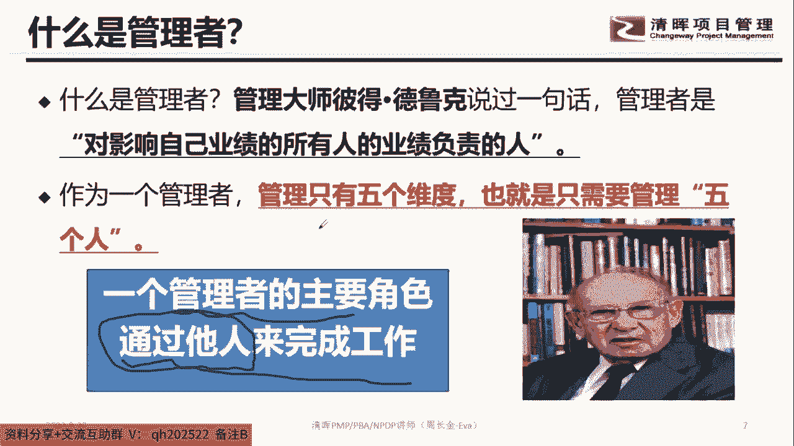

# 优秀管理者布置工作的步骤！ - P3：3.什么是管理者 - 清晖Amy - BV15t421K7dX

啊就是首先接下来的时候大家注意到。

那我们在整个了解自己管理风格的时候，首先你要了解你老人家到底是什么样的身份，对不对，首先了解什么是管理者，听清楚这句话，管理者是干嘛，管理者是对自己，这句话非常重要哈，管理层是干嘛，是对自己影响业绩的。

看清楚啊，影响自己业绩，比如说我我部门哈，我部门今年的一个业绩，就是干嘛要达成3000万的业绩，对不对，3000万的业绩，然后还要进入三个新的市场领域，类似这个话题好，对影响自己业绩的所有人的业绩负责。

这句话翻译过来是啥意思呢，就是你的团队能够把你部门的业绩搞定，但是你也要让员工自身的业绩，能够享受到他的成果，翻译过来就是你不能让员工只为你付出，然后员工就干嘛，自己只有付出没有回报，那就完犊子了。

这句话的一个潜台词，就是如果你想要搞定自己业绩，那你要干嘛，对所有每个单个人的业绩要负责，也就是说单个利润业绩，所有的业绩汇合到你自己的，你部门的业绩，那这个地方其实翻译过来。

就是让你的员工在干活的过程中也要干嘛，也要有收获，知道吧，叫付出有啥回报，各位同学，你们家老大做的咋样，你们家老大做的咋样，唉你们家老大做的咋样，唉付出不讲回报，哪有这种员工嘞，不可能的。

所以这句话的潜台词就作为管理者的话，为什么说要让要让干嘛，钱柜管理，要让下属听得懂，你说的话，让下属听得懂，你说的话的一个前提条件就是两个事，第一个维度，第一个维度下属我要做什么，就是你要付出什么。

第二个维度，我干嘛，我能得到什么，也就是说我付出的过程中，我能得到什么，让下属听得懂，让下属听得懂你的话的一个前提条件，绝大多数的老板只说半句，我要你做什么，但很少会说你做完了之后，你将会得到什么。

你为什么很少有老板会这么说，因为老板不敢承诺，知道吧，不敢承诺，他不敢承诺，因为他自己不愿意，为了你的这个得到去向管理层，向公司层面去层层申请，他不愿意付出这个人脉，付出这个干嘛付出这个人群。

所以这种老板其实就有一丢丢自私哈，有一丢丢自私，所以让下属听得懂你的一句话的一个前提条件，就是说第一个话题你要让下属知道他要做什么。

第二句话就是让他知道他做了之后，他会得到什么，这叫啥，这叫换，知道吧，交换你不能直接就跟下属说，哎呀你好好干呐，你相信我啊，当你付出的时候，迟早有一天我会让你得到你该得到的，这就是虚的，知道吧。

鬼知道这玩意是啥，知道吧，鬼照这玩意是啥，这玩意啥也看不见，所以呢你让我做什么的时候，要看我能得到什么，这是啥交换的一个概念，这个叫什么思维，叫商业思维，听清楚哈，这叫商业思维的啊，你好好干呐，对不对。

不要一天到晚谈工资啊，对不对，工资这个事情是需要谈的吗，当你做到就会给哎呀妈呀。

不带这么整的哈，不带这么整好，那么接下来的时候大家注意到，所以作为一个管理者非常重要的一件事情是啥，管理者是干嘛，是管理者只有五个维度看清楚哈，也就是说要管五个人，各位同学来，现在认真听课啊。

管理者要管五个人，你告诉我是哪五个，因为管理者是干嘛，是对自己业绩的，所有人的业绩负责的人，但是管理者要管五个人，知道吧，哪五个每个人说一下，哎哎拿五个拿五个哪五个，你们不要在这里面骂老板。

万一人家老板也在直播间，可不要怪我哈，各位同学听到没，你们不要，你们不要在这直播间骂老板，万一你家老板也在直播间就死定了，我跟你讲，你自己悠着点，你自己悠着点，要是人家老板在直播间，你自己悠着点哈。

所以你要隐藏自己的名字，知道好，接下来看清楚我们要管五个人，五个人其实就是哪个人，第一个维度向上，知道吧，第二个维度干嘛向下，第三个维度是啥，第三个维度是干嘛向上，对不对，第三个是同级的，知道吧。

就职能部门的对不对，第四个就是外部的人对吧，外部的外部的，然后还有一个是啥，自己的，知道吧，就是我们要管五个人，你们觉得哪个人最难，第一个维度向上，第二个维度向下，第三个维度是同职级的什么职能经理啊。

什么之类的，第四个维度就是外部的客户啊，供应商啊，合作伙伴，第五个就是干嘛管资格，你们觉得哪个最难，各位管理者管管哪个最难啊，管哪个最难，哎呀最难的就是管自己，大哥最难的就是管自个。

因为我们管管老板有什么好难的，管老板不难，搞定老板呢，其实就是你确定你能够有业绩说话，然后这个业绩呢对老板来讲可以直上营销，他会全力以赴的支持你，所以搞定老板的时候，就是你这件事情付出的成果。

能够在他的KPI里面是有贡献的，所以管人的时候最难管的是谁。

管自个知道吧，因为管自己的话，很多时候我们对自己要求都比较怎么讲，我不知道你们有没那感觉哈，有些时候我们对别人要求还挺高的，但对自己会原谅自己，对自己会原谅自己，因为很多的时候。

我们当自己在做某一件事情遇到困难，遇到难题的时候，其实你会发现，本来其实都是你自己的知识面不够，就是你的知识面不够，你的知识面不够的时候，导致你做这件事情是很迷茫的，但因为你自己的知识面不够的时候。

但但是可是你会怪别人，他有能力，他为什么不帮我，他有能力，他为什么不帮我，他为什么不帮我，他为什么不帮我，所以管自己的一个前提条件是在管人的时候，你自己的自驱动力是要很强的哈。

自己的自驱动力是要很强的哈，在这个话题好，那么接下来的时候大家注意到，所以一个管理者的角色是干嘛，通过他人来完成工作，看到这句话，通过他人，通过他人来完成工作，所以这个部分是我们比较重要的一个话题哈。

也就是说作为管理者非常重要的是管人知道吧，搞定人，然后那个人他所承接的那个事，他就能够干嘛，完成这样一个话题好，接下来的时候大家就这个话题啊。

不要一天到晚自信，这位同学说天天自习把自己都折磨得不行哈，注意到一件事情啊，如果一个事情做的不好，是不是一定是自己的错，各位同学告诉我，你们要相信我，我今天的课程提醒在座的各位哈。

对自己不要要求100分，要求75分就可以了，我们每个人肯定都有不足的地方，谁都不是神仙，我跟你讲，一天到晚要求自己100分的人，那不得抑郁症才怪，就你就要了解自己本身就是有不足的地方，对不对。

你本来就要了解自己不足的地方，干嘛一天到晚干嘛，一天到晚把自己当成啥，当成一个神仙，完美主义者，你就要相信自己只有75分，知道吧，不要老想着说我再怎么努力，我跟你讲，绝死了。

别人你其实也就是七八十分的样子，不要老是把自己要求太高，知道吧，所以为什么说我们要团队，各位同学为什么要团队，不是团伙，告诉我为什么要团队，不是团伙哎，为什么要团队，不是团伙，就在于团队他是干嘛的。

在于团队是干嘛的，团队是互补的啊，大哥，所以不要一天到晚让自己要追求100分，怎么可能嘛，我们要有75分，互补就可以了，知道吧，互补互补互补是啥意思，互补就是我不会的，你会你不会的，我会知道吧。

这个叫互补，这一天到晚老想着自己百分你，所以这句话有有以前有个概念叫木桶原理，把你们给害死了，有以前有个有个木桶原理把你们都害惨了，木桶原理是啥意思，是照顾长板还是短板，各位同学告诉我是长还是短。

就以前的时候，你们在中学的时候或者大学学，不是一天到晚学那个木桶管木桶原理吗，某种原理的时候，其实一直都让你们干嘛，叫什么取长补短，是不是这句话怎么取长补短，一天到啊，取长这个字我是认同的。

你的长跟你的长，跟你的长跟你的长，大家所有的长处合成起来互补，就变成一个高效的一个快速响应的成果对吧，那短这玩意的时候，这个补短补短，这个短不是说要自己补哈，在现在这个社会上补短不是自不是自己来去补。

各位同学告诉我补短是谁去补，各位同学告诉我补短是谁去补，补短是谁去补，对不对，补短这个补啊，很长一段时间内都刘文是自己去补，知道吧，但在现在这个年代，补短是啥，找别人知道吧，你的短处可能是别人的长处。

这样可以帮助你快速的交付，快速的合作，快速地产生效果，所以这个思维一定要把我掰回来，你不能说我哪个方面哪个方面能力差，我就补哪方面，你要干嘛，非得跟自己纠嘞，对不对，不带这么整的哈。

所以团队的目的它在干嘛，它是互补的一个作用，知道吧，对这位这位小卢同学非常正确，知道吧，不要老是揪自己，所以要接受75分的自己，知道吧，不要一天到晚什么内卷卷，我都我都被你们给卷怕了好。

那么接下来的时候大家注意到，但是在团队的过程中，我们怎么让团队产生效能，这是管理者要做的事，所以管理者的价值不在你的专业能力，对吧，你的专业，你的能力的素质有多强，他最终看到的是啥，团队的绩效。

那团队的绩效来自哪里，来自下属的表现，所以作为我们管理者，非常重要的一件事情是干嘛，我们要关注下属在整个整个工作推进的过程中，他的季度的情况，他的业度情况，它的年度情况。

它有没有比去年哪方面得到一些改善对吧，然后他的改善跟他的职场这个部分，是不是在有一个契合度，这个是我们要去关注的，所以大家记住一件事情，管理者存在的价值在哪里嘞，牢牢记住这句话，就是绩效。

没有绩效的管理者是干嘛不存在的，这个部门有可能会被裁掉，最最初级的就是管理者会被裁掉，最终级的就是这个部门都会被裁掉，所以大家记住管理者非常重要的一个事情，是干嘛，关注下属的表现。

因为下属的表现会实现部门的。

或者你们的团队的效能，对不对，好。