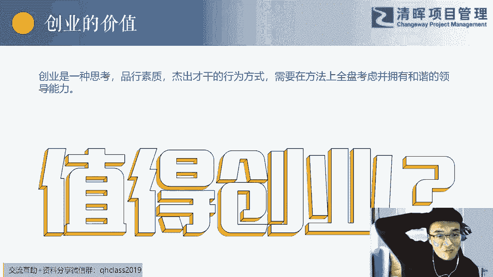

# 低成本创业指导课 - P1：1.创业的4个阶段 - 清晖Amy - BV1WM4m1k7AC

OK嗯今天2月15号啊，昨天是情人节，我问大家一个问题，给你们的爱人送给你们的情人送东西了吗，送礼物了吗，送没有送啊，唉这句话太扎心了，我记得我以前在PMP的课堂上问过。

给大家做过一个谈判的一个案例的一个介绍呃，咱们再去回忆一下，我我再给大家把这个案例说一下啊，就是一个也也不能算是案例啊，就是一个哎小活动，假如你要给你的另外一半送一个礼物，嗯有两个条件，有两个条件。

第一个是你的这个钱是有限的，能听懂吗，第一个就是你的钱是有限的钱，钱包里面那那个是有限的，第二个是嗯你不知道他他确定会喜欢什么，你不知道他确定会什么喜欢什么，可能你每年都送那几样东西对吧。

每年都送那几样东西，但是你不知道他是不是会比如你每年送包，每年送耳环，每年送这个口红，每年送这些香水呃，你不知道他今天是不是会会会会有新的想法，更喜欢的东西，这两个场景听懂了吗。

那么我的问题是你怎么结合你这两个场景嗯，这两个条件，然后把这件事情解决的比较完美，有什么好的办法没有，有没有人互动一下，有没有人互动一下，听听清楚，就结合我们昨天的这个节日，咱们做一个这个案例。

然后因为这个跟我们今天要讲的这个主题，是特别有关系的，谁听懂我的这个这个问题了，然后能不能说一下，就是送情感属性的礼物嗯，但是你这个可能嗯可能能解决，就是你可能觉得情感属性的东西他可能会喜欢。

他可能会喜欢对吧，但是情感属性的一定会便宜吗，就是他的性价比一定会高吗，对对那个，转角说到这个点子上了，因为她本身是女女女性，你看她说到点子上试探性的问问哎，你比如说这样啊。

你说你猜你你你你在2月13号的时候，或者2月12号，2月10号，你在前几天你尝试性的，你问他哎，你猜我给你买了个什么礼物，但这个时候其实你还是没买是吧，你还是没买，然后他就会猜哎，你给我买个这个。

买个那个他他他他他拆了两三个的时候，其实你你你你微微一笑，你说你到时候就知道了，其实他可能会说了三个，但人就往往是会是这样啊，就大部分人都会这样，他一开始说的那几个是他心目中想要的，或者说他喜欢的东西。

对啊，你有两三个选项了，然后你在这里面再根据你的钱包的实际情况，然后然后选一个性价比更高的，然后这样就是发现了客户真实的价值，然后呢用最小的成本去解决了这个问题，听懂了吗，听懂我这个案例的扣个一。

我突然间想起这个节日，然后用这个案例开场，我们今天的一个话题听懂了吗，你们觉得这个案例棒不棒，发现客户的真实的价值，真实的需求，然后用最小的成本，然后去解决这个问题，这个就是我们今天的一个精益。

创业和经营思想的一个话题，OK呃先做一个前言的一个导入啊，就是为什么要讲这门课，或者为什么要跟大家嗯嗯我但预判也会被预判，我我可能没懂您的意思啊，到到时候咱们下来再交流一下吧。

就是可能案例嘛有它不完美的地方，嗯基于两个点啊，就是嗯经济创业这本书，包括经济创业时代这些书，其实对每年的产品经理的嗯，嗯每年的产品经理的一些课程上面，或者是推荐书单里面我是必推荐的啊。

尤其前面第一本书，然后第二个就是我今年也去，再一次的去学习了一下精益创意啊，然后呃和几个朋友在一起讨论，实战性的一些东西，包括一些项目上的一些运作，嗯感触还是比较大的，所以我是我是想我说找个机会。

然后跟大家再去沟通和分享一下，这个经济创业这里面的一些东西，其实你别看他的书很厚，或者说它的内容很多，提炼出来的话，也就那一点东西，也就是两个小时，我们可能会把这个东西吸收差不多，当然所有理论性的东西。

学术性的东西，到最后到最后他还是要去去实战的，去实践的，去实战的，你如果不去实践的话，这个东西你咋学都是在书本上的，能听明白吗，所以经营创业这本书里面，其实就交代了两件事呃，三件事情。

第一个他告诉我们什么是创业啊，什么是创业，第二个他告诉我们经济创业是什么，怎么玩儿，第三个就是他把整个经济创业的一个体系，然后搭建出来，就这三个事情，然后我推荐大家去看，就买买这本蓝皮的时候。

他有好几个皮呃，我我今天把这本书应该是拿出来了吧。

你你们就去买这个这个蓝皮的这个书啊，就这个，呃李开复给作序的啊，这个书还是还是值得跟大家推荐的，而你看完这本书之后呃，你们去再再去网上找找一些相关人，对于这一块的读后读后感啊等等。

然后你再去看经济创业实战，精益创业实战，其实它里面的内容基本上进行创业时，就是学术上的力，嗯这个内容是差不多的，它只不过加了一些实操性的东西啊，所以我为什么要给大家介绍这本书。

其实今天里面的大部分内容嗯，都是和这本书里面的知识点有关系的啊，嗯不可能，对于这样已经嗯非常非常成熟的这些体系，或者方法，然后我们再去创创新，然后呃去去去去再去在上面做大的修改。

所以说基本的内容还是这些，当然这里面有我有些我自己的感受，所以我们今天要做的几个事情。

第一个就是我给大家讲讲创业的定义，以及在创业的过程当中，我们怎么去验证我们的假设，第二个就是我们精益创业的三个工具，第三个精益精益实战的三个步骤，第四个就是在这三个步骤里面，有个特别特别重要的一个点。

就是精益创业化步啊，经济创业画布，第五个就是经营经营思想，也就是今天的那个你们在海报上看到的那个啊，他的底层思维是什么，最后就是我们可能要做一些互动啊，QA环节第一个内容我们看一下创业及假设啊。

呃创业的定义啊，就你们知道这呃这个创业的定义，你们在网上是找不着的啊，这个这个这个创业的定义，你们猜我是从哪个地方弄拿到的，就你们现在看到的创业是一种创造性的行为。

但这一句话你们猜一下我是在哪个上面拿到的，有没有人能猜到最近很火的一个东西，你想想这个定义我是从哪个地方拿到的，对对对对啊，插在GPT里面啊，嗯大家去看一下这个地方，我就不读了啊，不但是我是想告诉大家。

创业其实有一个好的一个目的，就是他要创造更大的价值，所谓的价值，其实有些时候我们可以理解成，你对社会的价值呃，那个那个还有一些价值是指社会，或者说客户给你反馈的价值。

而这些价值当然包包括包括那个财富对吧名誉，所以就说我们基本上大部分人创业，其实是为了一种价值，这种价值可能有些人是成就感，或大部分人就为了所谓的财富自由啊，时间自由这些事情去去去做创业啊，去做创业。

那今天这个话题先留着，我一会在下面两个片子，我要要给大家提个醒啊，这是一个点，那第二个就是创业，它本身是一个一直在考验人的这种综合能力。

的一个事情，你们不要觉得创业是个非常简单的，我一会给大家会看到创业经常失败的几个原因，他是对于一个人的领导力，而且这种领导力是综合性的领导力，你的统筹能力，你的整合能力，你的沟通能力，你的预判能力啊。

包括你对于财务，这对于数字啊，对于政治等等等一系列的东西，你可能都要有一定的敏感度对吧，呃所以说大了讲，这个是一个哎，这这是一个这这是不是一般人干的事情，当然我们也有小的创意，但是我要告诉大家。

创业有很多种类型的，我要问你们一个问题，结合你现在看到的一些情况，你如实的回答，你告诉我你心里面的答案，你觉得现在是创业的好的时候，或者值得去创业吗，告诉我这个答案，这个答案很重要哦。

告诉我你心底的答案，你觉得现在值得去创业吗，或者说现在可不可以去创业，应不应该去创业，从你的内心讲，LISA说直的，值得现在风险很大，嗯还有没有人答案，现在的风险还是很大。

鸡批六枝梅还说GPT是什么拆的GPT，你你你你下去查一下最近很火的一个机器人啊，非常有高智商高情商的一个机器人，值得啊啊，大家要知道我们的这个2015年的时候，就是2015年。

国家主要的领导人提出的大众创业万众创新，大众创业还是大众创业万众创新，反正就是你的双创，2015年提出来的时候，然后在短短的这666678年吧，然后所有的人正基本上或者说在职场当中。

所有人都被洗脑了一遍，在高峰的时候，在2019年我去研究这个市场的时候，就是我们整个看数据啊，就是尤其是互联网的尾巴，互联网的后半场，刚开始那个时候大量的创业公司，这个新公司倒闭。

然后我们那个时候把以前的一个公司的生命，生命周期，就是以前我们可能一个生命，一个公司可能5年平均寿命是5年，我们会发现在那个点上，它变成3年，就很多公司扛不过3年就倒闭了。

然后人们就开始反思说创业值不值得，很多人刚毕业家里就就就可能会把买房的钱，甚至把房子卖掉去创业，后来在2020年的时候，就是从疫情出现之后，我在我朋友圈也好，我我和这个同行去交流的时候。

我给大家呼吁一个事情，我说没有一定的能力，没有一定的这个这个这个资源的情况下，我不建议大家去创业的，我不建议大家去创业，你不要有个idea，然后你就去创业，但这边后来我们在整个往这个细分里面去。

再去走的时候，我们会发现创业它其实有很多种的，我今天给大家给大家要讲一个叫内部创业，大家把这四个字敲在公屏上给我走一遍，我给你解释一下什么叫内部创业，来把这四个字在这个这个留言区走一遍，内部创业。

我不建议大家去把自己的呃，这个这个所有的这个财力物力，然后精力，然后全部投入到一个事情上去，然后把给自己整那么大的压力啊，嗯哪哪怕你觉得这是个特别特别好的时机，特别但是你要搭上了，你的全部的生。

这个这个这个这个全部的这个价值，或者全部的家，当然后去做这个事情，我还是那个想法，我此时此刻我只是个人的想法，我不建议，尤其是大家没有一定的那个那个资源，没有一定的靠山，没有一定的背景的情况下。

就靠我们从学校毕业之后，靠自己的一点点的见识，然后去做一件事情，然后又搭上自己全部的家当，我不建议我不推荐，但是我今天要给大家在这个课堂上，推荐一个内部创业，内部创业说白了就是你要在公司里面。

比如说他让你成立一个新的部门，他让你去开拓一个新的业务线，但是你又有一部分的机会去跟他，跟公司也好，跟某些人去谈判，最终的结果是你是一个合伙人的身份，去加入或去做这件事情。

但是你投入的只是你的时间和精力，你的经验，你的知识，你的储备，你没有投资钱，听懂了吗，听懂这句话了吗，你可能是找到了一一个大集团里面的，某一个一个部门的呃，这个去去去去做这个事情，也有可能你投你。

那有些合伙人，一些投投资人来，他们出钱，他们有idea，但是他们没有技术储备，他们没有经验，他们没有落地能力，他没有吃苦的精神，他们不知道细节，所以这些事情呢是你的特长，然后你不要去投钱，你投时间精力。

你投你自己的爱好，你赌一把，哪怕3年五年，你赌一把，你获取经验，哪怕哪怕输了，你可以获取经验，你的家还在那，你的老婆孩子还在那哼，我说话比较直，我讲课比较直，听懂了吗，听懂扣个一，这叫内部创业啊。

我把他所有这些定义成内部创业，因为因为什么，其实内部创业，他其实就是在企业内部去做自己想做的事情，企业给你提供一个平台，这就是狭隘的对内部创业的定义，我们扩大一点，内部创业的定义就是你只要不投钱。

不要投你，或者说你轻资产的投资，不要投资你的全部家当去做一件事情，都可以说成内部创业，你冲着去获取经验，获取教训啊，然后去成长这样的一个思路去做，这叫内部创业，听懂扣个一，各位，所以其实机会很多哦。

比如说你们现在在做线下的业务。

某一个事情做线下的业务，然后呢你可以去签证，怎么去看多线上的资源，怎么去做线上的呃，业务这一种转变方式是很多时候，如果你老板没有这个词，我只是举个例子，可能可可能大部分时候老板是知道的信息。

他的知识储备是远远高于我们的，高于我们普通的员工的，但是我的意思，只要你能发现一个可以说服老板的方式，或者老说服说服呃，投资人的一个老板，也是投资人嘛的一个方法，要做一件事情，而且是你喜欢去做的事情。

哎你可以去跟他谈，你可以去跟他谈，所以这个就是这种创意，我觉得是值得的值得的，而且这种创业的成功率比较高，各位为什么平台早都成平台，还是在的资源什么的都是在的，你需要去整合一下信息。

你你你只是需要思考去整合，然后就很他其他其实是在落地和工具层面，更多的时候在落地和工具层面，你的压力不会那么大，你不会那么焦虑，但是你说你把这所有的家到头了，要去做一件事情，我我觉得你会睡不着觉的啊。

所以这个事情，我们今天也可能是一个小的收获哦，我看我们看一下，从理论上讲，创业的基本阶段，第一个就是初创阶段，那我我们可能见到的，80%的创业都是初创业的。

就是我有一个好的产品或者技术，我自己研发出了一个好的产品和技术，我就拿它去去做创业，而且我很多呃，这个这个就是，我认识的一些私企的老板，大部分吧就有一大半的都是以这样的方式，甚至他们都是从技术转过来。

有自己的，比如说他们有一个什么样的框架，有个什么样的平台啊，包括现在数字化呃，数字化转型很火，很多人就做了什么低代码的平台对吧，他们有这样的一个一个一个一个产品，然后他们拿着这个产品就开始去创业。

他们拿到这个产品之后，这个技术之后他会做一件事情，它会发展到第二阶段，就是公司化，你注意哦，有些时候有些人和有些团队永远没有公司化的，他只是说以这种哎你需要一个东西，我就给你去做。

然后我就是以这种团队的身份或者私人的身份，然后去去做创业，他连公司都没有，但是有些人就会发展到第二个阶段，就要公司化阶段，我想说的是，我们认识的大部分的人到第二阶段就可以了，就是大部分的创业到第二阶段。

如果能持续运营经营下去，一个公司能到5年过，经过5年啊，那么能活下去，一步步的从一开始稍微亏钱，然后到慢慢的不亏钱，然后开始盈利，就是到正常阶段已经非常非常成功了，后面的两个一个是集团化的一个阶段。

就大集团的公司到最后的跨国公司，这两个嗯嗯这个这个是呃凤毛麟角对吧，凤毛麟角的就是很少很少，或者至少咱们认识的这个层面还没有说年龄，就是年轻轻的，能到集团化的一个创业的一个老总。

OK所以我想告诉大家一个idea，一个产品，一个技术把它弄出来，然后得想想办法能把它成个公司，这个可能是创业的时候的一个一个，一个最常见的一个方法和路径，但是记住轻轻资产投资，轻资产投资。

如果说你一开始做一个产品技术，我你看我我我我有我有学员，今天不是来美他自己所有的他的那个架构，他的那个产品都是他自己的兼职团队，他自己招的一帮兼职团队，就这帮人在白天有公司在上班。

晚晚上他们一起去做那个东西，他的投资真的非常非常的少，和小，他本身还在一个公司去上班，然后他自己做出这样的产品，而且他现在拿这个产品去打市场，而且很多他他接触过的客户，好多人都对他的这个产品非常感兴趣。

我觉得他迟早会成功，我们上次聊，我们聊了很长时间，我觉得他迟早会成功对，所以这是一个初创阶段，就是轻轻资产投资啊，然后到公司的话，到将来你确实有一定的客户积累客户资源，然后有一定的信息渠得到。

然后你可以去成立公司的，OK这是创业基本阶段，我希望大家能做到第二阶段就可以了啊，我们大部分人能做到第二阶段，就非常非常好了啊，非常棒，那么我先想想你对我们走走看看，总结一下。

有些时候看看总是要给大家看点教训的。

