# 低成本创业指导课 - P4：4.精益创业实战的4个步骤 - 清晖Amy - BV1WM4m1k7AC

啊这这这个我我其实又跟跟一些，这个这个我们不知道直直男还是什么的，就是我我有很多学员不是搞技术的嗯，小小朋友小孩子99899的，现在2000年的都有了对吧，哎我跟女生说个话。

脸红我都不知道怎么追个女朋友，我喜欢什么都不知道跟她怎么沟通，其实有些时候人家女孩子也其实对她有好感的，她就是都互相在等捅破那张窗户纸是吧，但是这个男孩子太腼腆了，也其实是个不太好的事情。

所以其实我有些时候我就讲，你想跟他发展成什么样的一种关系，你试探性的用某一个语言去尝试一下，你不要说的那么low，但你尝试一下，如果他给你一个反馈，他哪怕给你一个表情，你就知道他心里的想法是什么。

但是你连尝试都不去尝试，或者说你人家给你反馈了，你没有去修改修正它，那你这就这这个也就不会持续的，更好的往下发展，对不对，啧所以说如果你腼腆，然后你稍微大胆了一一点点，人家给你反馈。

对你这大胆的这一点点还是比较感兴趣的，那说明你要赶紧改。

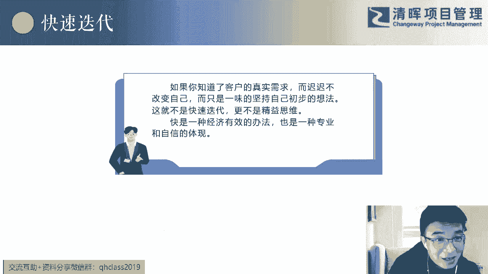

改成稍微胆子大一点对吧，OK然后我们看一下创业时代的三个步骤啊，三个步骤，第一个就是写出我们的精益创业画布啊，第二个就是给出我们具体的方案，列出我们的一些关键风险点。

第三个就是要去用MVP验证我们的解决方案，那这里面最好最最最就在这个点，我要讲的就是我们的精益创业化部叫精益画布，可能前面我跟大家讲过，BMC就是在上一个月我跟大家讲过，BMC就是商业模式画布。

然后呢这一块叫精益创业化布，精益创业化部长成这样见过吗。

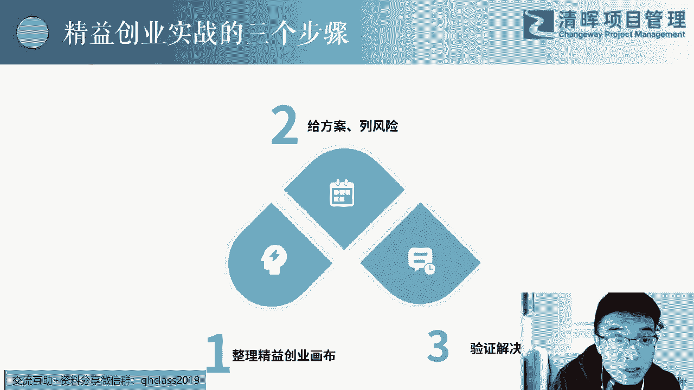

有没有人写过这个东西啊，写过的扣个一见过吗，叫经济创业化部，他他的样子长得和那个商业模式画布，其实大同小异的，也是九个维度，举个维度就长这样，但是它相对来说是商业模式画布的升级，有经济创业化部。

它是商业模式画布的升级，它比那个会好懂一点，你看那九个维度，你有什么样的问题啊，具体是哪一部分的客户细分，就是客户，你看左边一个问题，第二个就是客户细分。

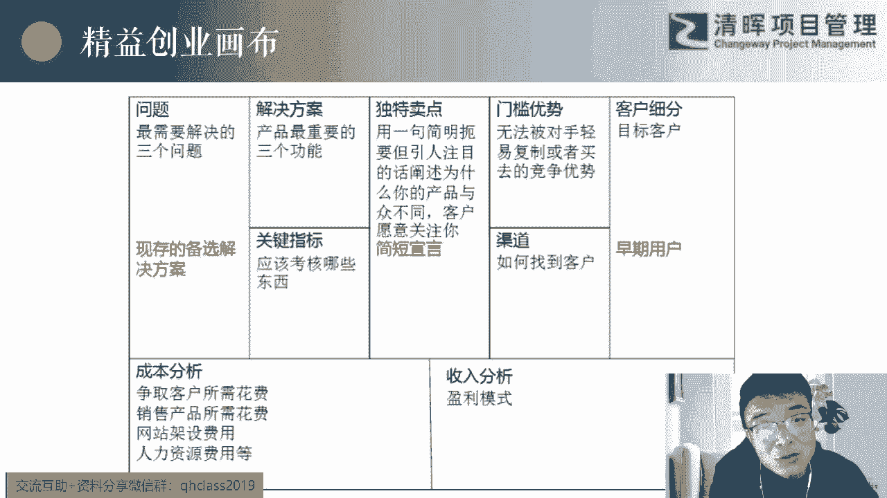

然后我我我我给大家给一个头脑风暴的一个图，就拿着这个图跟那个团队去沟通的话，就没有问题啊，呃第一部分我们首先要去找问题啊，这个问题也好，这是个需求也好，你先要把某一个点上你看到，比如说我要去学校。

学校门口看某一部分，有一些哪些学生，可能需要一个什么样的一个产品，或者需要一个什么样的小吃，或者需要什么诶，你把他这个问题抓住了，然后呢你要把你的客户一定要细分一下，就是我写的这个二客户群体的分类。

就客户一定要细分一下，为什么要细分一下，因为我们没有一个产品是面向于大众，都能够成功的，其实现在我们要讲在细分市场上要生根的啊，就你做这个产品，最好是有一个直接面对的一个一部分人啊。

然后呢其他的人也可以买，但是他不是我们的，直接或者是我们的目标客户对吧，他不是我们的目标客户，所以你看很多产品在实实实施的时候，或者说在做市场调研的时候，已经把那个东西定下之后，他将来的包括上市啊。

对销售的点呀都是围绕这个来的啊，我我之前跟大家讲过那个元气森林的，元气森林一开始就是那个那个气泡水啊，他一开始面向着他的目标客户，是不是男生啊，是女生，而且是职场精英，女生就是喜欢喝一点，对泡泡的。

还是无糖的那种，所以他他把这个目标客户定好之后，他做了两件事情，第一个呃他他用了一个日系的那个风格，包括那些字呀，就写的那个气呀什么的那些字，那些字都是日日日日日本的那个字体对吧。

第二个就是他要在嗯连锁店里面去上，就是他在写字楼里面的下面711啊，什么什么什么这些罗森啊，像类似于这个全家这种便利店里面，就是只要在写字楼的，这这这个这个连锁店里面有，他要要去在这些里面上市。

所以他的目标客户很很具象的，就是那些职场精英女性的，然后他就把这个价格定的比较高一点，所以我想告诉大家，你有什么样的需求，所以我想喝个甜甜的气泡水，但是我怕胖，这就是个需求，所以我可以做无糖的嘛。

然后呢你把目标客户找到了，第三个就是你一定要把你独特的卖点，把你独特的卖点写的清清楚楚，明明白白，而且用一句话非常简单，哪怕这是个slogan，然后我可以做广告对吧，那么你第三部分。

你一定把你这个产品的卖点做写出来，第四个就是详细的解决方案，详细的解决方案，甚至可以写到就是具体的几个重要的功能，这个产品重要的重要的功能，第五个就是我要去跟客户。

我要找我的用户或客户的过程或者渠道是什么，我是通过中间中间商还是直接还是线上，还是线下，我会通过是什是什么样的方式，线下的话是在大型的超市里面，还是是小型的连锁超市，快快捷的这种超市啊。

所以说你怎么去找到你的客户啊，这是第五个，第六个就是你的收入模式，你要通过你的广告费用啊，还是直接销售，你的收入模式是什么，第六个就是呃就sorry，第六个是你的收入模式，第七个就是你的成本。

你要投哪些钱，哪哪几类的钱最大的那个成本，最最有风险那个成本，这这这个支出是什么啊，啊他叫我们有个成本分类成本科目的嘛对吧，第八个就是我们考核的指标，第九个当我们做到一定的程度的时候。

我怎么让我们的竞争对手不要进呢，因为一旦你去创业创新一个地方先进了，你赚钱了，别人看的脸红，他会杀进来，所以那个时候你要去造自己的门槛，所以这个是我们的头脑风暴，我们可以带着团队做。

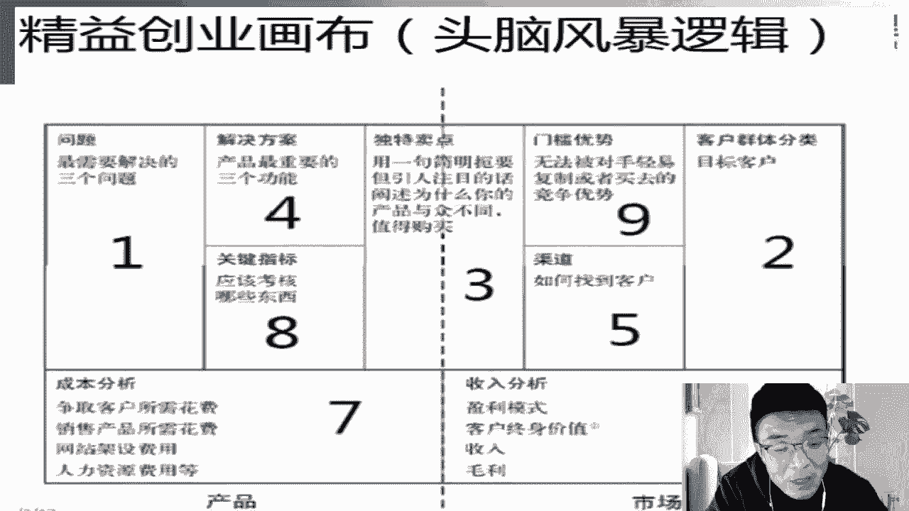

其实大家去上网搜一下这种经营模，精益创业化吗，这两个图都不是我的原创，这是网上都有的，大家可以去看一下，这就九个维度，你们把这个维度跟团队一起填了之后，或者你自己跟你要创业。

你比如你夫妻店要开一个夫妻店，然后你找一找，找两个亲戚朋友啊，或者是稍微懂一点的，把这个东西能填清楚，说明你这个思路是有的，然后你自己再去解决列列方案，然后做MVP去尝试验证一下。

如果这个这个故事你讲不出来，说明你这个东西你是不成逻辑的，就这九个东西它是整体的，为什么他要放在一页纸上，就是他要给人一个视觉，这个东西是互相关联的，它给人一个视觉，说明你对这个东西是了解对。

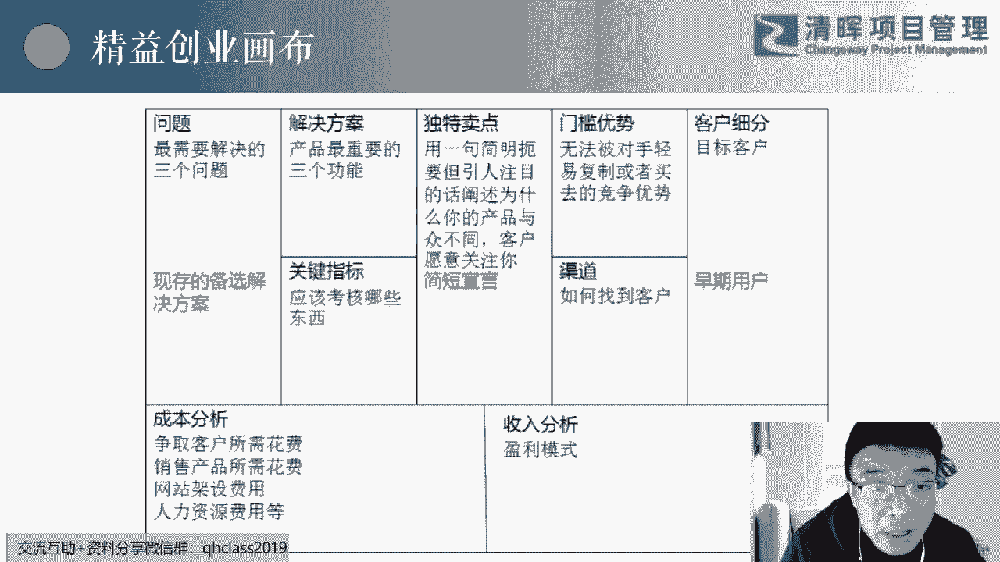

所以这是一个我比较重要的，那么我我们讲完前面的这九个点，其实是非常非常学术和理论的点，就很多人都是这么要求。

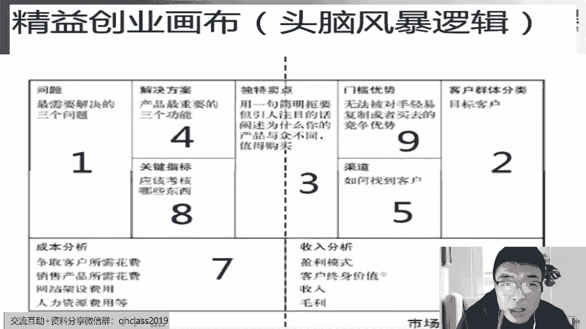

而书上也是这么写的，为什么我要跟大家讲创业模式画布的实战，我想告诉大家，你看一下这两个，一个就这么多框框，第二个就是我们的那个。

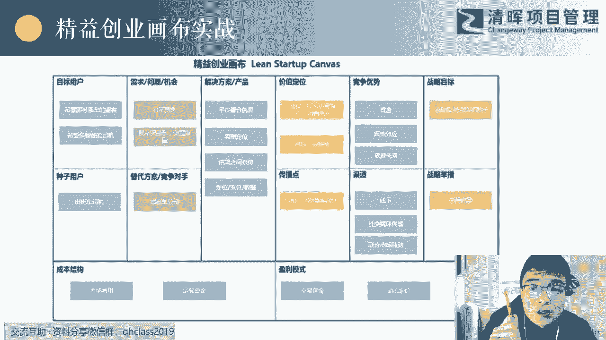

现在很多人在喝的一个等一个咖啡，叫瑞星咖啡是吧，它的商业模式发布是这样的，然后我们会看到在很多我见到的实战当中的他，你不是说讲了九个分支吗，他有可能十个十一十二个事实，他的完全长相都不一样。

但是他遵守了一个规则，第一个他是在一页纸上，一张纸上，然后第二个它是可视化的，能看见的，所以说我后来就就跟大家商量，然后我就做了一点实战的心得，所谓的花布一定是满足实战的，而满足可视化的画布的模式。

可视化要在一页纸上，所以说这是一个非常非常重要的，只要你保证了，你的画布是在一页纸上可视化的出现，那么其他的没有固定的东西了，包括九条规则，你可以把它拓展成十个，然后上次我听了一个清华大学的一个朱教授。

然后他分享了一个他自己他们几个，他和那个中科大哪个教授，然后自己研发的那个自自自己，其实理论上的创新吧，理论创新吧，他们自己结合这个商业模式化部和经营化部，然后自己去做出的那一套东西呃。

其实也是一页纸可视化，然后个数不一样，名称不一样，然后他有自己的逻辑，他从左到右，我们为什么还要讲这个点，因为你去看一下一，这上面的1234567是没有规律的。

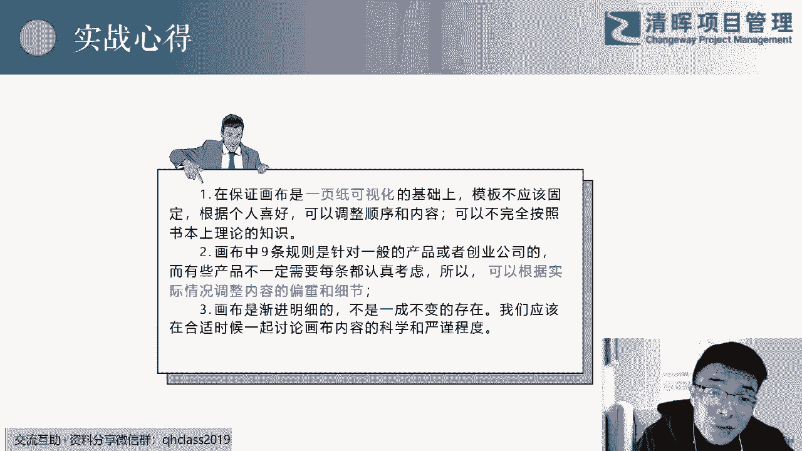

一在最左边，二在最右边，为什么他要这么排，我要告诉大家，这一个图的左边是与产品与与与产品相关的，这个图的右边是和市场相关的，所以他的这个逻辑顺序，如果我要填这个表格的话，他应该怎么去填，这个图是乱的。

所以有些人就给他整理了，整理的比较适合我们中国人的一些思维去做。

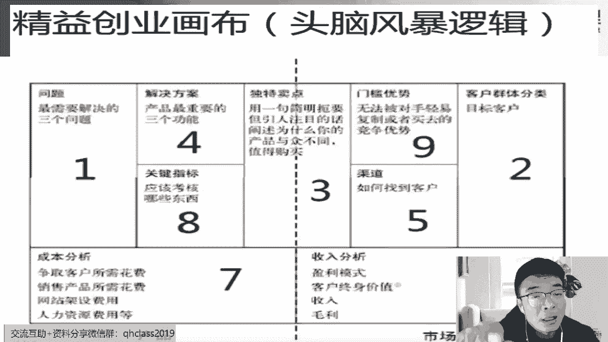

所以我要告诉大家，一页纸上可视化，剩下的东西你可以去调，而且这个画布要去做创业画布的时候，在最初的1。0版到后面的2。03。0版，它是个迭代的过程，它不可能是一次性就成功的，后面不变的，这不对的。

它里面的内容也是迭代，而且有些时候你可能重视的是我的slogan，我的客户的需求，那你弱化了你的收支和你的成本，那到一定时候你还要重视你的收支和成本，有可能有可能有可能。

你一开始的那个收支的成本是个大账，没有算小账，细账，到后面你还要算小账细的，那就那就是迭代版本，所以说这个是渐进明细的，不是一成不变的啊，所以只要你满足了这些点，你可以随便列，随便画。

你都把它都叫做创业模式画布，或者说精印画布，金额精益画布都可以啊，都可以，而且你可以加上自己的名字听懂吗，所以我一直在讲学一个东西要活学，你要学的，你不要学的死板诶，人家画了九个格。

我们一定要用九个格要活学啊，那么最后一个就是经济思维啊。

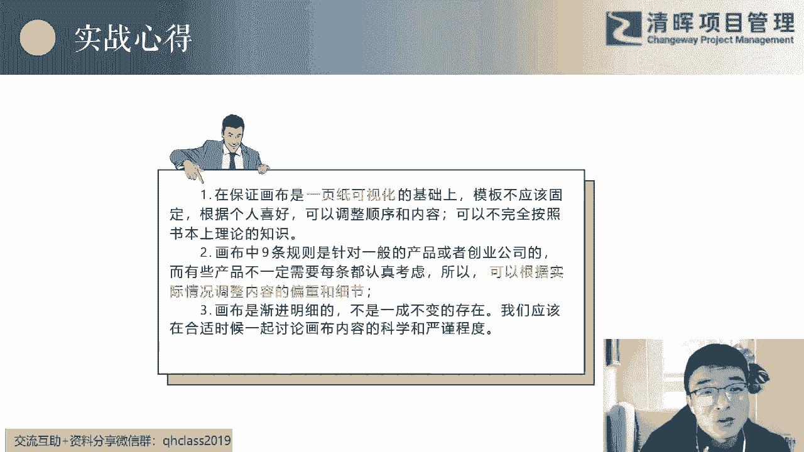

你们可能可能理解的经济就是这样的，经营要消除浪费对吧，它来自于丰田系统对吧，要要要消除浪费哎，经济有可能有这样的一个五个原则对吧，第一个确定价值识别价值流嗯。

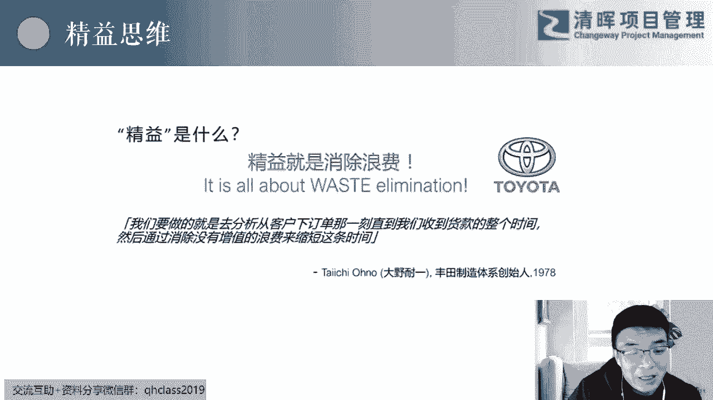

然后流动增值活动真实需求拉动而尽善尽美，这是书上的东西，这是书上的东西，唉唉这个这个图你们能看懂吗，这是这是这不是我的原创，这个图你们需不需要我给大家讲讲一遍，讲一下吧，这个来了吗，来了。

这个这个这个可能有些人听尽，听这个近义的时候没有听没听懂，第一个就是我要做一个产品，我确定我这个东西是不是有价值的，是不是有价值，这是他的第一位，就是我刚才跟大家讲的，有没有市场，有没有人用。

有没有人想吃，有没有人想买，对吧，你不要想说你造一个什么，就需要这个市场已经跟以前不一样了，就是我们要从以前想的话，就是以前我们可能先把东西造出来，然后拿市场去卖，那总归是有人买的。

但是现在所有的物质资源非常非常丰富，同质化的东西特别特别的多，如果你想造出一个东西，你不先调研客户需求，不去研究市场，经做出来之后说卖不出去就卖不出去，说卖不出去就卖不出去，人家大众的车。

为啥那大众的车，你别看那个那个那个可能有些地方不就在上海，尤其是上海，你看小区里面十个十个车里面六个大众，大众的车几乎是卖的都都不错，但是他也出了几款卖不出去的，没有市场，所以说我要告诉第一位。

就是确认确定我们是不是有价值的，你只有你确定你是有价值，你才能往下走，第二个就是识别价值流，我要把这个东西做出来，造出来，或者研发出来，或者把它做做做成了啊，你可以理解我有哪些过程。

比如说我我现在对于某一个人是有价值的，所以我他也对我也是有价值的，我确定好了，所以我一定要追她，但这是我一生的伴侣，我认定她就是我的伴侣，那我把他追到手，这个过程当中是有个流程的，这叫价值流，听懂没。

他不是一下子就能追到手的，他有一个步骤的，那这些过程当中，这些步骤，每一个步骤，每个过程都是要花掉我的时间精力，金钱，能理解吧，但是你会发现有些东西嗯，但是你会发现有些东西是什么，不是那么那么的重要的。

有些过程可以省略的，有些过程可以少投一点时间和精力和金钱，啊非常非常的重要的一个话题啊，所以说这叫识别价值，就是你把这个流程给画出来，所以以前我们其实做学学创业课的时候。

我们那个老师就让我们哎你去一个饭店吃饭，你比如说我要吃一个重庆小面，我要去一个重庆小面店里面去吃重庆小面，你从你一从一个顾顾客进到这个，咱们的这个门店，我是一个这个重庆小面店的一个店长。

我是一个一个一个创业者对吧，从一个顾客进来到他吃饭完了之后，离开我们的店面，整个这个过程经经历过几个阶段，然后你想哪些点上可以去弱化的，哪个点上那个那个那个一定要去加强，不能弱化，就你要投人的话。

应该投时间，精力的话要投在那什么什么上，最后他跟我们说了一个道理，进店到离店的过程当中，在这个结账这个环节上，你可以完全用微信支付宝，你可以把人工在那个地方，那那那个那个那个省出来，然后你的后厨。

你的服务，你的这个这个味道这一块的这个不能省，他想说明这个道理，所以我给大家告诉大家的是，很多时候我们做的事情有一大部分是非增值的，这就是精益给我们告诉的道理，你一定不要浪费很多东西，是非增值的活动。

你把那个价值，你把那个价值都研究出来了，然后这个价值流上面牵扯到的环节，都连研究出来了，你会发现有些活动是可以省的，有些活动是可以并行的，有些活动是可以不做的，但核心的东西他要在的，所以那些可以省去的。

那就非增值活动能理解吧，然后第四个就是不是我们强推给用户一个产品，而是用户需要这个产品的时候，我再去生产这个产品，这叫真实需求，拉动用户需要什么的时候，我给她做什么，所以你去听到会会看到有很多女孩子啊。

就有很多男孩子在追一个女孩子的时候，她会其实那个会会会会有一个哎，他给的东西是人家不喜欢的，而且她心里也很委屈，哎呀我对你这么好，那就比不上别人的一句话等等，像类似于这样的电视剧场景，你都看过是吧。

你也可能经历过啊对啊，为什么你做了那么多东西，你为别人做，那么多东西为什么比不上另外一个人的一句话，一个微笑，一点小小的一个一个一个恩赐都大，远远大于你付出那么多年，因为你是强给别人推给你的。

你的付出的，你给的东西不是人家需要的，所以我们讲这个产品经理也好，项目经理也好，我们经常讲一句话，给客户需要的，给客户需要的东西，不要给他自你自认为他需要的东西，你们把这句话下去好好理解一下。

所以你看他是真实的，为什么叫不叫浪费啊，就是说客户需要这个东西，所以我把它做出来，这就不是浪费，你做出来的东西不是客户需要，就是浪费对吧，人家本来是想喝咖啡，人家就想喝星巴克，你有本事出去跑跑跑跑跑。

出去买个瑞星，嘿嘿瑞星咖啡好喝吗，我不知道，反正我举个例子啊，或者人家想吃西餐，你哪拿出买俩包子，你人家不需要呀，最后一个就是你不管做任何一件事情，客户会给我们反馈的呃，市场会给我们反馈的。

你要迭代的去修改的尽善尽美，什么叫尽善尽美，尽善尽美的意思就是我们要持续的改善，让他做的完美一点，尽量的完美啊，就这个这就是经济思维的五个原则，但是我我跟你讲这些东西，你从书本上就能看到的。

我的核心是这几句话，也可能今天晚上。

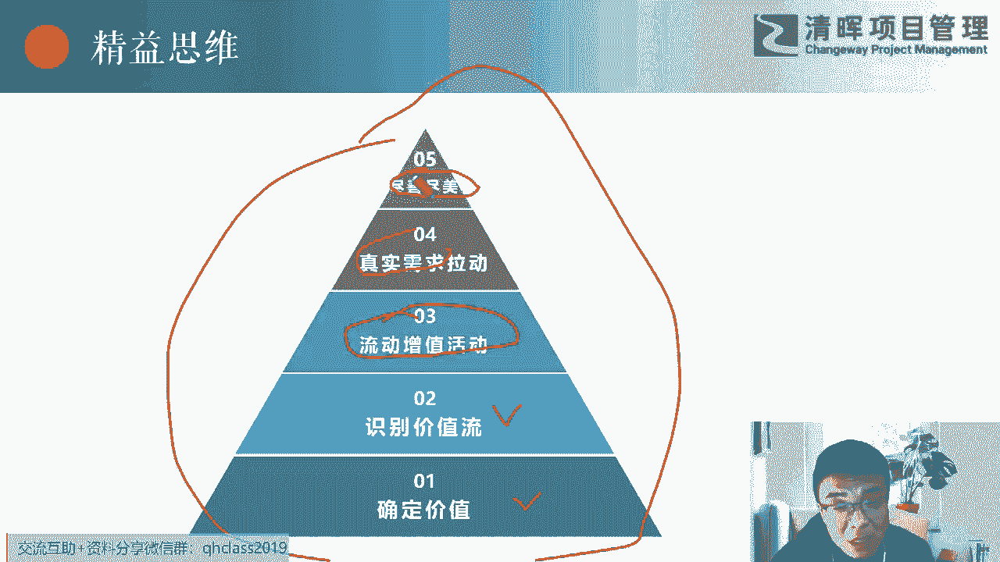

也就是我要用这几句话跟他们结束，咱们这个分享，第一个美好的东西都是一点点长出来的，大家要品一下这句话，你要做的产品也好，你去创业，开一个公司也好，你要做一件事情，你要经营一段婚姻感情。

你要去培养一个孩子，所有这些东西，但凡是美好的东西，不是一下子蹦出来的，而是一点一点的长出来的，我不知道多少人能理解我这句话，它不是一次性出现的，要一点一点的去感受，去接近，听懂了吗，这就是需求和价值。

你要去发现它，你要去发现这种美好的东西，你要一点点持续改进去接近它，用你合适的方法，你一开始可能没发现，第二个你发现了它了之后，你找不到合适的办法去办法去接近他，你要去一点一点的去试错。

所以我们再去发现，挖掘接近这种美好的东西的时候，一定会走弯路的，一定一定会走弯路的，除非你是个天才，你一下子上来之后就会知道，大家看一下我下面这个图，这是我盗的一张图，我盗别人的一张图。

哼你看这是我的目我，我我在此岸，我要去彼岸，那我的目的地是在对对岸是吧，那我从这出发，我一下子能到这吗，我一下子能到这这个这个地方吗，南所以我要去一点一点的去接近，去靠近，然后我试试一下，方向变了。

我试一下近，一直在试试试试，在每一个点上在试，唉最后我就到了，你看这个这这这个这个这个东西，美好的东西是长出来的，哎大家把这句话在在公屏上帮我走一步，你们有几个人能有几个人算几个人啊。

美好的东西都是长出来的，写下这句话，一个产品也好，一个一个公司也好，一个一段感情也好，反正等等都是一点一点的长出来的，不是一下子得到的，尤其是感情，尤其是你喜欢的那个你那个人。

然后用你用了自己的一些真诚呀，一些方式，然后然后那那这个方式，你们不要想的乱七八糟的啊，就是然后把它一点一点的挖掘到，你就会感受哎呦生活好美好呀，所以我们在发现挖掘它的时候一定会走弯路。

那么但是这个里面有一个bug，就是我们的时间也好，精力也好，财力也好，都是有限的，对不对，我们要走弯路，我们还要花钱，花时间，那么你想一下，如果我我走一次弯路，我我我就会多花十块钱，但是我的钱呢。

我我有钱，我只有100块钱，我只有100块钱，然后你要走一次弯路，你你就要花十块钱，那就说明他会给你十次失败的机会，听懂了没有，他会给你十次失败的东西，如果你把这走一次弯路，只能花五块钱。

你能省到五块钱，我就可以去试探一把，就试错一把，去去去尝试一把，那他就给你20次试错的机会，那我们用我们自己的话讲，我多一次试错的机会，我是不是就会多一次生存的机会，成功的机会啊。

那我如果我你只有100块钱，你倍儿上来之后全投进去，你只有一次机会，你只有一次机会，各位那成了就成了，死死了就死了，那大概率就死了，听懂了没有，所以说为什么精益创业告诉我们，你要去低成本试错，就在这。

这就是所谓的底层思维，好我最后一句话我给你总结一下，就是我们不见兔子不撒大鹰，不是不见不见兔子不撒鹰啊，不撒大鹰，啥叫大鹰，我可以撒点小银，然后去去捐，因为小银成本不高，不见兔子不撒大鹰，我要试错哎。

我要找到，我只要找到我那个正确的那个目标之后，我才我哎我的好钢就得用在刀刃上，我就等what我才能要一一击即中是吧，OK美好的东西都是长出来的，太棒了，各位今天晚上，如果让我一定要跟你分享一句话嗯。

一句感触最深的话就是，美好的东西都是长出来的，你要一点一点的去靠近它，用科学的方法去靠近它，嗯OK今天的分享就结束了，然后看看大家有没有什么问题。

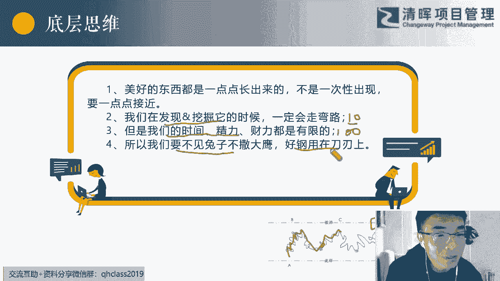

我们可以互动一下，有没有问题，chi啊china也来啦，嗯一直在创，大家记住啊，今天我们给你讲了一个实实际的，大家听这个我我讲这门课，那就这个这个这个点那个额，不是说鼓励大家去创业。

你们把内部创业今天要一定记住啊，你们把内部创业一定要一定要一定要去记住，内部创业，今天那个概念是我自己独创的，一个内部创业的一个概念，你们一定要记住那个概念，就是你不去大面积的投资钱。

为什么我一直在强强强调钱的问题啊，各位你们不知道，我不是说是诶，诶你这个人怎么有点什么样的眼光，为什么老看钱什么，你知道吗，我的学员凡是跟着我在一起学习的学员，我每一个分享会都来的。

或者课去去学习考证的这些学员，他有个特点，他其实我我能看到的也能想到的，他的资金这一块，或者说财力这一块，他不是丰厚的，他要靠自己的努力，你想他不努力，不是不是不努力的，让生活变得更美好。

他为什么来考证来学习来上进呢，你们听听是不是这个道理，谁有钱跑来考个证，谁有钱要看两本书，然后来学习，你说这是有钱人干的事情吗，是有钱人干的事情吗，我们说大大概率事件，小概率的咱不说，但有些人有钱人。

人家也要学习，这当当然小概率就是我们为什么要上进，一直在追求上进就是钱嘛，所以我是真怕你们傻乎乎的，把房子卖掉，完了被别人一忽悠，然后大家投资在里面，呃PPT哪一页啊，我我可以给你翻一下，呃翻一下。

然后你们可以那个嗯，嗯你们可以跟我互动一下，咱们互动个几分钟吧，程鹏你可以随时打断我啊，程鹏你随时打断乃一。

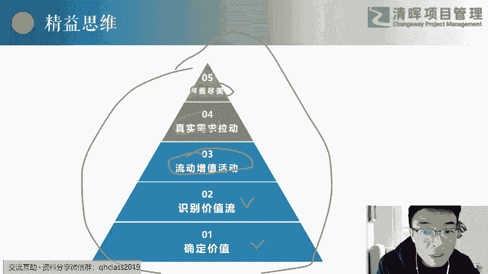

我就从从后面往前翻哪一页。

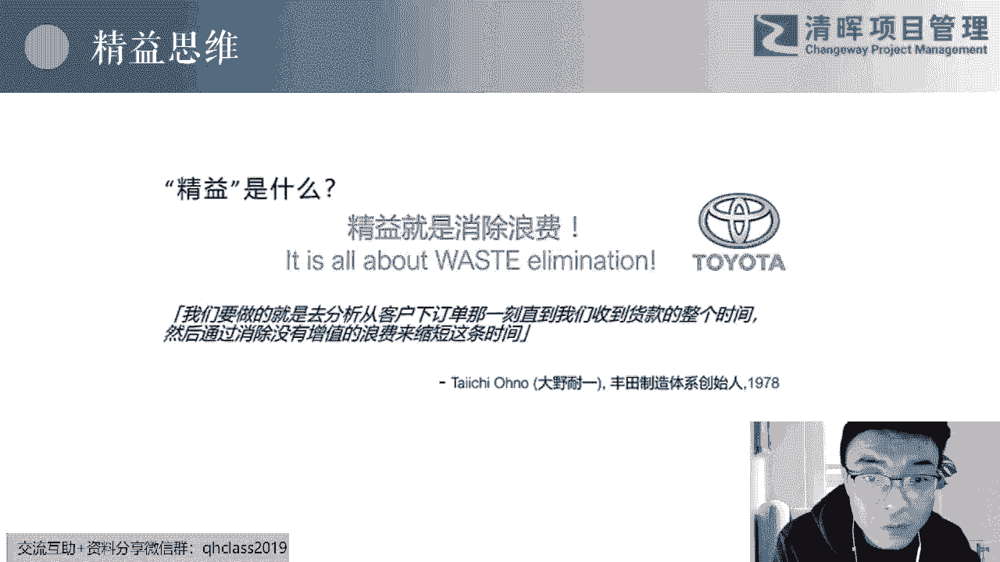

你告诉我，哎是不是我可以连你语音，连你我又不会操作，前面是吧，到了吗对呀。

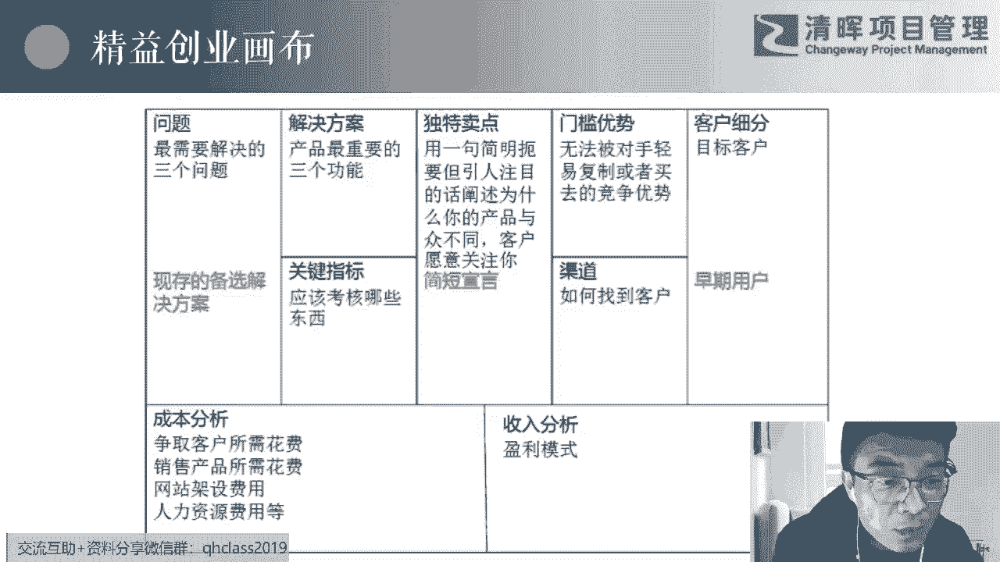

还在前面吗。

没了吗。

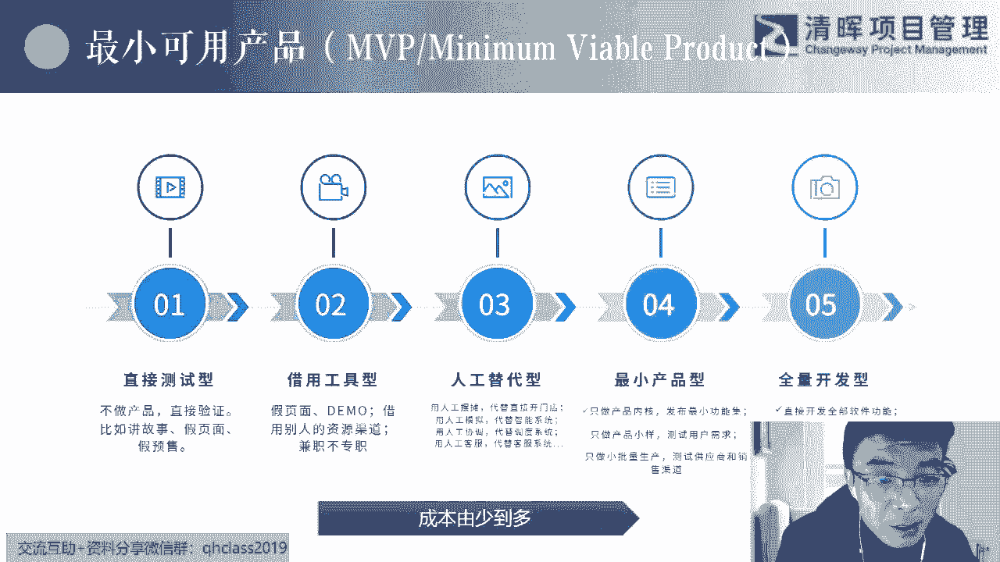

OK你们今天听完之后好了，你们不问我问题啊，我问你们啊，你们听完之后，你最感触深的一个词或者或者一个点是什么嘞，每个人分享一下，咱们就结束吧，你们听完之后，你最感受到的一个词或者一个点自己。

你可以说我里面的我自己讲过的某个词，或你自己感受到的一个感觉，心里面的一个感觉，用个词用1111句话表达一下MVPOK是个点嗯，感受到的你自己的真实啊，低成低成本试错，Mvp，还有吗。

最小成本迭代okay。

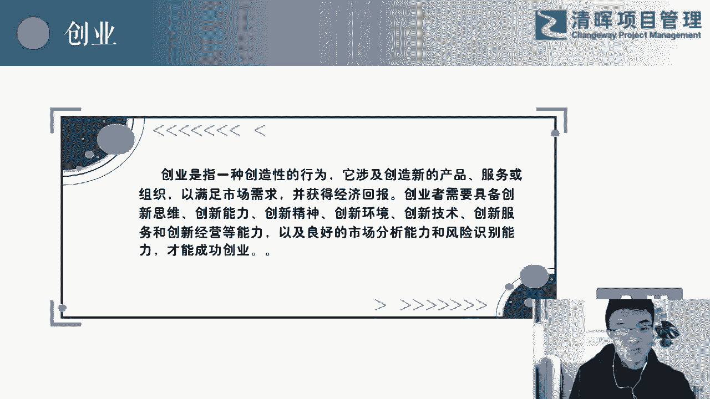

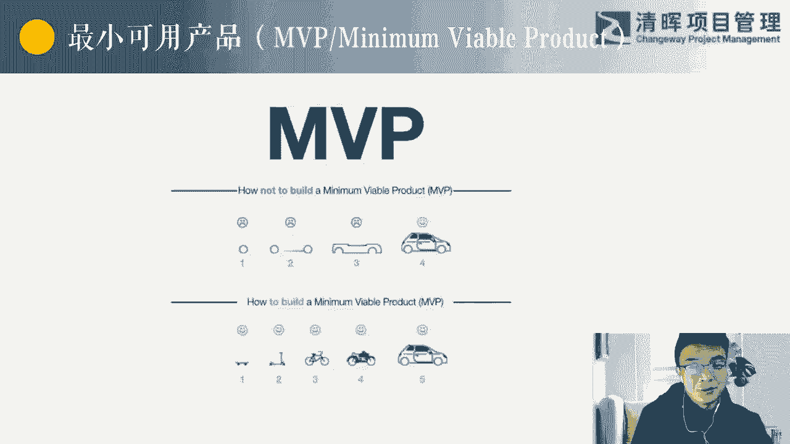

有吗，增加试错次数，降低试错成本，对，增加成功机会，对客户反馈，建议在创业里面的使用，对我能懂你意思，道理其实都很简单啊，就是不管多难的课，如果说讲起来学很悬，很难那种，就说明没讲好。

其实所有的东西讲起来应该都不难，难的在于操作和实操，各位男的都在操作，很实操，对不对，所以大家下去不要动不动就创业了，内部创业啊，记住内部创业啊，你说这个这个是让人难受的一个点。

你说我不鼓励鼓励你创业吧，我要给你用奖金益创业，你说我给你鼓鼓励你创业吧，我还说你不要创业对吧，唉内部创业对吧，而且社恐啧咋说呢，如果你的社恐是真的发自内心的，你觉得是呃需要专业的大夫干预的那种。

可能我没有办法，如果你是缺少方法，其实你是怕表现不好，只是缺少一个方法，这个倒是还可以去尝试改变一下，但是你已经严重到了那种，一说话，就已经整个人血压都180那种那种程度。

我可能那个需要专业的大夫心理心理医生，然后去干预一下，渠道是当然很难了，有些时候渠道很难很很，现在现在所有的东西MVP的渠道，你们知道怎么玩吗，哎我上次去那个和那个那个那个呃，因为我从这学来重庆的嘛。

我给讲重庆有个江小白，你们听到过对吧，江小白打成都的市场的时候，他们合并了一个渠道，他们合并用了一个渠道，他用的是雪花的啤酒，雪花啤酒的渠道，雪花啤酒的渠道，然后他俩为什么互补啊。

他们这个渠道为什么能共用啊，正好互补，喝白酒一般是冬天，喝啤酒是夏天，所以说他们也做的是渠道MVP，就是我上一周不用投钱，然后去创建立自己的销售团队，就铺一些什么店呃。

然后他就把这个渠道去花点钱就用起来了，他找找别人的这个这个这个团队或渠道，然后给你点好处，然后你帮我去带去，所以其实每一个点上你想省钱，你想达到那个目的，想省钱都是可以省对。

不要刷的时候找高大上的一些渠道，其实越困难的时候要逼着你，越逼着你去想这个东西是不是你怎么做得更好，不一定说嗯资源非常非常好呃，什么什么都都非常有的情况下才能创业成功嘛，对吧，所以大家想想。

在你公司里面有没有可以创业的项目，可以让你从一手去操作的东西，然后锻炼一下自己，借着公司这个平台，然后呢去尝试做一些创业的事情啊，那是最好的，好吗好，谢谢你们，那我们今天就到这，下次见。

对我刚看到小助手给大家广告，下周五还有一个还有还有还有一个分享，到时候再聊好。

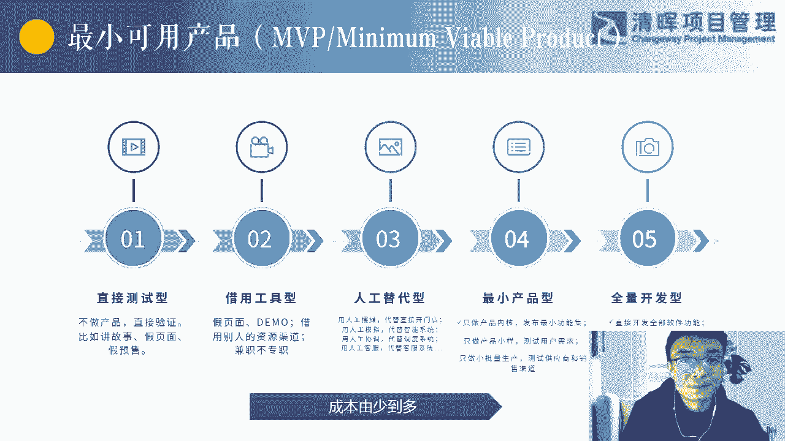