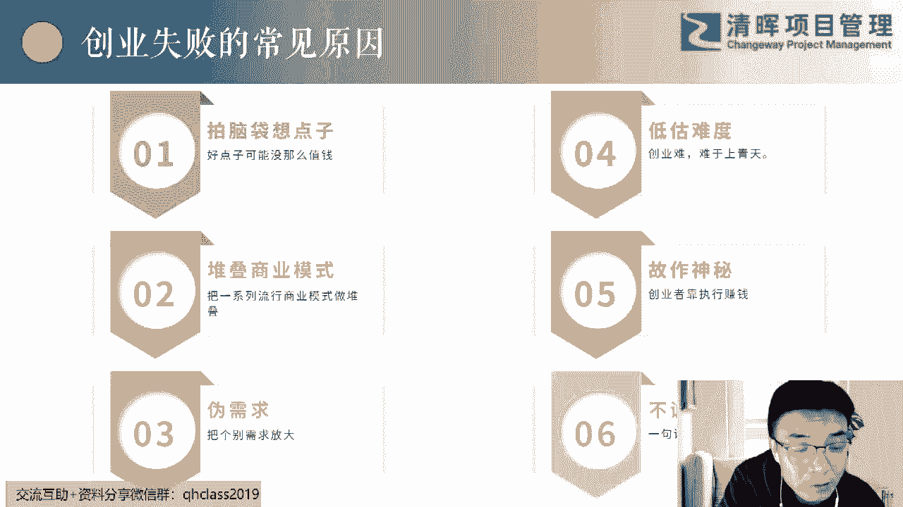
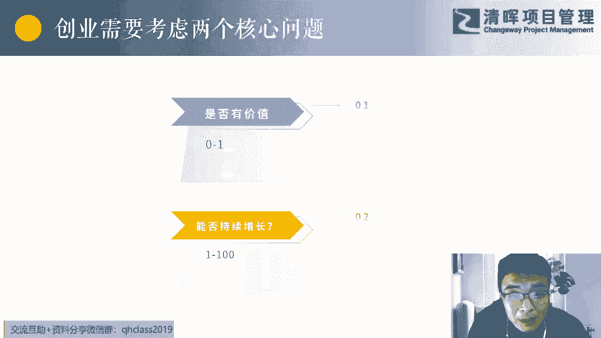
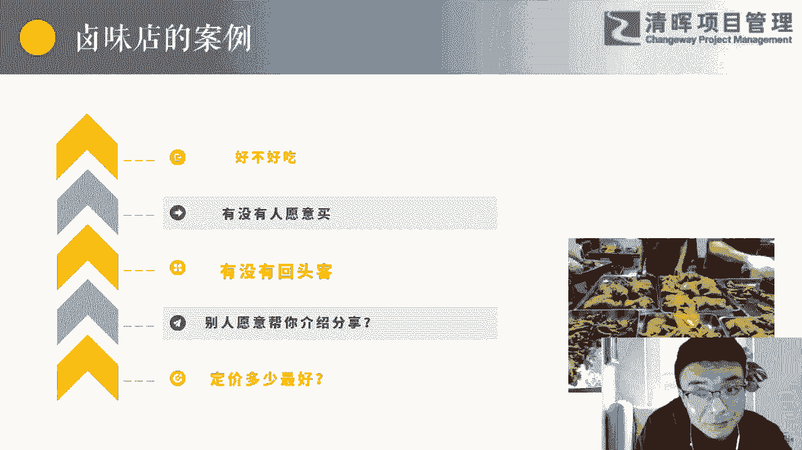

# 低成本创业指导课 - P2：2.创业失败的6个主要原因 - 清晖Amy - BV1WM4m1k7AC

那么我先想想你对我们走走看看，总结一下，有些时候看看总是要给大家看点教训的，所以我去整理了一下创业失败的常见的原因，包括我自己啊，拍脑袋一拍脑袋就想到一个点子，说这个点子就是个好点子，然后去创业。

尤其在互联网时候，尤其在互联网的时候，嗯我上一次跟大家分享的那种嗯，你们你们也听过很多这种这种这种，以前的互联网上门服务的，对上门服务的嗯，嗯你看有在互联网呃这个高峰的阶段，或者说顶峰的巅峰时期。

很多上门服务的上门保洁，上门的做饭对吧，还上门的美甲对吧啊，包括后来把美发也上门，然后最后做做到我们最最一直都不敢想的，也不不敢做的东西，大家都永远觉得这是个点子，只要出现就有很多人就有。

就就想这我有这个需求，大家就可能有这个需求了，他总拿自己的少部分人的一些需求，然后去衡量整个市场，听懂了吗，一拍脑袋就是说哎有这个需求，一拍脑袋就有这个需求，也不去做市场调研。

也不去做一些这个这个迭代的一些试错啊，不不做一些MVP，完了一拍脑袋就钱投进去，团队组建起来，然后就开始做了，OK嗯十有八九吧，成功不了对吧，第二个就是一堆商业模式，它不是单一的商业模式。

其实我们会看到一些好的一些想法，或者好的商业模式，它不可能就叠叠叠加在一起的，所以说你要去跑通一个商业模式，它就是一个可以简单的为你赚钱的一个点，你要把好多个你个人感觉是很成功的，商业模式叠在一起。

风险系数变大，难度变大，复杂度变高，所以很多有些不可控的东西，第三个就是伪需求，就你自己认为的那个需求，你自己认为的那个需求，你觉得会有市场，大家能不能举一个例子，就是你见过的，你听过的。

或者说你经历过的什么样的一个产品，然后失败，最后是发现是这个这个需求是不存在的，有没有人能举个这样的例子，什么样的产品最终产品做出来了，然后市场不是没有的，有没有人，你们想没想过，有些见没见过。

就是有有些时候这个产品经理也好，项目经理也好，其实你要有些职业习惯，走到哪，你看到一些点，你要去思考一下，哎你们前几年听过一个胶囊公寓吗，你们听没听过这个东西啊，有没有人听过，就是他有个想法。

就是在写写字楼里面，然后呢有一些跟胶囊，就是中午可以休息，有部分人睡睡睡眠不好，然后呃可以可以可以休息的一个一个一个地方，就是我在写字楼里面，反正租一个什么样的地方，然后就空间不大。

然后最初其实在呃在在在往里贴钱的时候，还是有一点的，还是大家还还会觉得还好的，你说这个东西你们现在可能很听不到了，或者你见到的能成功的，有可能就那几个地方，这几家呃回头客比较多的。

你知道这个东西有一个什么端吗，就是这个东西，我看过一个111个一个调查报告，你觉得他最后死在什么调告大部分失败，失败在一个什么什么事件上了吗，谁能想到我跟你讲特别搞笑，就是我们在想那个需求是存在的。

比如说我昨晚上熬夜了，我今天上班时候我迷迷糊糊的对吧，我迷迷糊糊的，我如果中午睡觉呃，那么办公室如果比较吵，我如果有一个地方很可以很安静的，它里面还有些比较隔音比较好一点，或什么什么这这些东西。

那个呃我是不是可以睡觉，他他这个这这是自己的想法，他也调研过一些，有些有这样的需求，安全男女这是一个点啊，就大家都比较担心安全和男女，他最后失失误在一个点上，就是你知道需要中午休息一下。

然后呢你的价格还不不贵的这一部分人嗯，可能是纯技术的，我就该告诉你答案答案吧，他最后在一个城市，他失误在臭脚丫子上的，臭脚丫子就是熏得人受不了，总会有各种异味存在，听懂了吗，大家好，很多诶干净的女性。

她不去了，那不去了啊，不去了，所以说有些需求是伪需求啊，有很多需求是伪需求，一开始你没有去做市场调研，没有跑通你的商业模式，你自己只是想只是想想而已，第四个就是低估了创业的难度啊，就是嗯你们不要不要。

大家不要，任何觉得一件事情的成功是非常非常简单的，一会我们会给大家讲一下成功，它不是那么偶然的，第五个就是嗯有些人去拉投投资人，或者说要去跟别人谈合伙的时候，都特别神秘，就是自己好像掌握了什么天机一样。

不不想说，说不清，你让他说，他也说不清楚，就是特别特别神秘，第六个就是对于创业者而言，对于职场当中而言，我一直强调一个人的本性，就是你不诚信的话，很多东西你是找不到真实的合作伙伴。

找不到是真实的好的搭档，你成功不了，不诚信的话，你成功不了，除非除非就靠爹妈，爹妈能把你撑出来啊，这所以我反正每个人也，每个人对对这个点上想法不一样，所以这一页仅供大家参考。

那么我们其实讲刚才讲了，创业以及创业为什么失败了，其实创业有两个非常核心的东西，就是有两个核心问题，我们把这两个核心问题想到了，做到了之后呢，就好像创业很简单了，那么我们理想化抽象一下。

理论化的去看一下两个核心问题，第一个就是你要去做一个有需求，真实市场存在的有价值的东西，我们要考虑一个问题，你这个东西是不是有价值，能理解吗，就是我们要达到0~1的这样的一个过程，从没有到有啊。

这是否有价值，第二个他这是不是不是可以持续增长，虽然有价值，但是没有回头客了，或者没有人帮你去介绍了，没有走着走着就路窄了，没有从没法从1~100的这种情况，他没有持续的增长。

可能一次性消费也就就就够一年了，那没法持续增长，那你这个也不会长久，虽然说有市场，你也不会长久，所有所有经营公司的人去做创业的人，他永远要思考这两个问题，第一个我做这个东西有没有价值。

对什么样的人有用的，第二个就是他能否持续增长，如果把这两个打通了，到后面你到集团了，或者说到大的公司，你还去想我怎么去垄断，怎么怎么怎么去去去加深我的竞争的壁垒，不要让不要让别人进来啊，有这样的。

但是前任的这两个问题是非常非常非常重要的，是否有价值，是否持续增增长K所以大家对自结合自己啊，说人是一个产品啊，就我们自永远在思考，我们自身本身是产品啊，你是不是有价值，在公司里面你是不是有价值。

而且你的这种价值，对于给你能够带来持续性的增长吗，比或者说你随着你的学习努力，你的这个价值是不是也在增长啊，如果是这样一个问题，你一直在解决的话，OK说明你过得还是比较幸福的，你不会有焦虑。

你不会被别人嗯，嗯被被被被被老板或者被被被被别人DISS对吧，你可能也过得比较开心，OK然后我们举一个案例，就是结合我们刚才讲过的。

我们举一个案例，这个案例不是我做过的，但是是我听过的，而且是我前前一段时间，在学习一门创业课的时候，他们讲的一个真实的案例，这个案例来自于重庆啊，来自于重庆，那么一个人呢想去做个卤味的店啊。

大家也知道在重庆和成都那边，像这种卤味的东西特别特别多的，尤其麻辣的，我喝口水吧，馋了，反正大家看到什么周黑鸭，绝味鸭脖那边其实也可能没那么火，他们有自己当地的一些产品嗯，对对对对，这个品牌对吧。

麻辣的麻辣口味的对，所以说他其实有一个自己的一个嗯，不算成熟的配方，但是他个人觉得还是可以，还是比较好吃的一个东西，他把想想用这样的一个配方去赚钱，去成立一个卤味店，而且他异想天开。

他会觉得我将来哪怕我开开个十来家，在整个重庆市我开十家加盟嗯，这个这个连锁店我也是赚钱的，你以一个门店给我一年纯收入，给我给他20万，我十家是不是200万，对于他来说，他觉得也是非常好的一件事情。

但是这个人呢非常非常聪明，他不是上来之后就租一个门店，就租一个门店，然后呢就去做，做完去卖，如果你真要去做创业的话，对不起，你肯定会或者大概率会失败的，所以这个人一直他就把他的所有的这些。

在创业过程当中可能会遇到的一些问题，我们把它叫假设条件，他就整理了出来，就几个点，他必须必须把这几个点给他攻克了，第一个到底好不好吃，怎么验证好吃，他他觉得好吃，但是别人会觉得好吃吗。

不同的人会读都会都会会会觉得它的好吃吗，第二个就算有好吃，有没有人愿意买，注意哦，这是两个问题哦，很多人觉得哎好车我就愿意买了吗，不一定，好吃你送我可以吃好吃我吃一次可以，但是我愿意买嗯。

可能你的食品安全等等，第三个有没有回头客呢，第四个别人愿意帮你去转介绍，帮你做广告吗，哪怕哪怕你不去做这种市场，有有偿的这种市场推广，那别人吃完之后，他会把他的朋友那给你介绍过来吗。

好的产品是不需要有长的市场推广，别人会自己推荐的，比如说我们看个好像对我来说，比如看个电影啊，别人说哎那个电影好看，我看朋友圈说这个电影非常非常好看，我不去看别的评价，我就我永远相信我的朋友圈里面。

这帮人看完之后，他的评价哎好看好看好看，又有五六个人说好看，我我就是想想那就好看对吧，那么定价多少最最好嘞，你们知道这一系列的问题，他如果不攻克的话，他都他都不会下手，去租一个店门门面。

然后去租这个东西，所以他做了一件事情，这是真实的案例啊，然后他做了一件事情，他做了什么事情，他首先去做试吃，然后呢，他就把美团上面的所有这个这个附近的，所有排在前几名的那个呃，那个那个这个这个卤味店。

然后他炒他找到了之后，他们把他把他们的产品整个买了一遍，然后上尝了之后，然后他就觉得哎哪些料可能他没有，那他还会去跑那个这个调料市场，然后他把这些料也做做了一番研究，然后他自己就再把他的这个配方。

稍微完善了一下，然后他做出来给家人吃，给家人吃完之后呢，他就去在这个这个小区里面，社区里面地铁站，然后就是给给别人试吃，一开始是免费的，后面是一点点钱，然后试吃，然后试吃的这个过程当中呢。

他就会留下他的手，微信啊等等，在这个过程当中，他做了他投资了一个手，是一个一个手推车，注意他只是投资一个手推车，他没有大面积的去开一家门店，然后呢他会把他的二维码留下来。

然后呢他就定了一个比同行的就是比较排名，比较评价比较好的那个那些店里面的价位，少一点点的一个价格，然后尝试卖，当然他更更多的时候可能会做一些促销，比如说买二赠一啊，像类似于这种促销。

然后他就看这些人愿不愿意买来，买完了之后愿不愿意跟他介绍嘞，他我我问他好吃的时候是否好吃，他会告诉我真实的答案吗，所以他把这些问题从一个手推车开始，解决了一个问题，再解决另外一个问题。

然后他就找了一个便宜的那种，叫嗯联合联合门店，门店就有个专业名词，我一下子想不起来了，他是什么意思呢，就这个店这个门面呢，早上你买早餐，中午就给让给我，就他们这这这种你你们知道叫什么吗。

就是他可能一个店面，甚至说我在这边外面做什么，你在里面做什么，他这种联合起来的，这样又比较便宜嘛，不是然后他又花了非常少的成本，好像一个月就800块钱还是多少钱，他就租了一个这样的一个在菜市场旁边。

租了这样的一个门店，然后他就做了一段时间，可以他一个月能赚3000块钱，然后呢他就去了一个大坪坝大评论，谁谁谁谁谁在重庆那个地铁站，我现在想不起来了，在这一个地铁站出站口到一个小区这一段路。

而且那个小区非常大呃，然后呢这个路的中间有一排门店，他在那个地方租了一个，就正好人下地铁之后往家走，大平地铁站，对对对，大坪地铁站，然后他租了一个店，然后呢他就把第一家店成立了嗯。

然后这个时候他的产品他已经非常成熟了，他他他有他非常有自信，因为在前期推手推车的时候，他已经把这个东西试错过了对吧，他对定价他非常有自信，他之前他调整过好多次价格，他调整了他一天算一下他的营业额。

他调整完了他他算一下他营业额，看哪一个哪一个价格，这个营业额是更高的，有些时候价格高了，他卖的虽然说少，但是他还唉利润还虽然高嗯，你看啊他是在疫情前啊，疫情前一年完了之后，等他把这个店面租下来的时候。

疫情发发爆发了，然后呢，他还有一个成都的一个人给他投了100万，然后疫情来了，所以说他可能就把这个项目呃，项项目给停了，前期的卫生许可，这些可能这个这个我我可能就不知道了，可能是不需要的。

但是你要租门店的话，肯定是要的前期的那个卫生许可证，这些可能也不要，但是你要租门店，要开店的话，应该是应该是适用的对吧，那你是城管吗，跑城管吗，那我爱吃的那几个手推车，那在地铁站那个我下地铁。

我就再尝一下那个叫什么来着，路就是小猪，就跟那个串串一样，那个东西叫什么来着，关东煮是吧，那也没有什么卫生许可证啊，所以我想跟大家讲一个故事，讲这个道理是你们看到没有，其实我们很多人创业的时候。

就一下子上来之后，我有一个什么样的东西，我就租一个什么样的店，我要成立一个什么样的团队，然后去把这个东西做出来，对不对，大部分的思路都是这样的，但是这种情况下，你会感觉你一旦错了，你就来不及回头了。

你就连一点点回头的余地，可能你把所有的这些东西都搭进去了，然后嘞你错了，你错了之后呢，你就彻底失败了，你翻不起来，你可能要这个这个这口气，你得很长时间才能缓过来，对不对。

所以大家要从这个案例上面稍微吸取一点，这一个感觉啊，我们一点往下走，所以经济创业嗯。

它的本质。