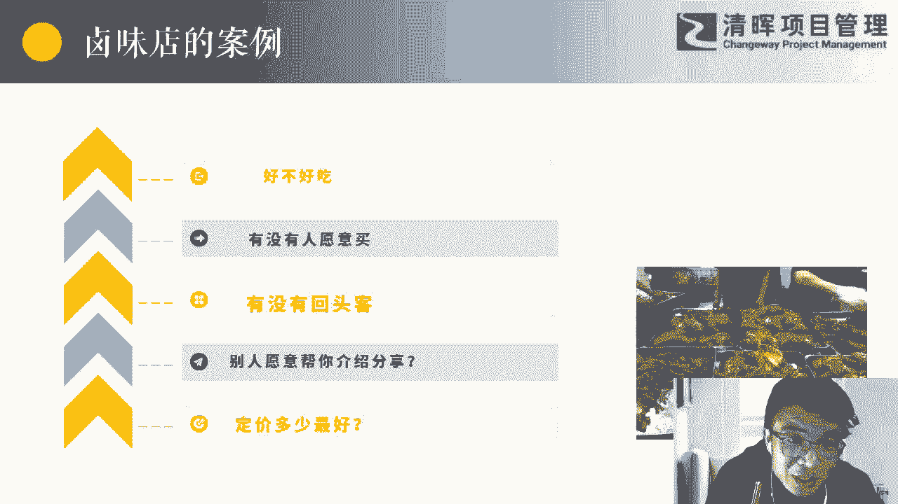
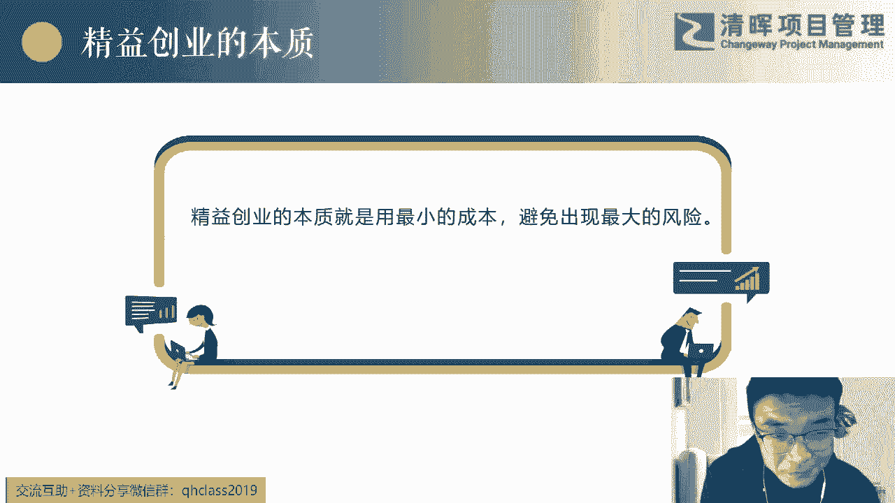
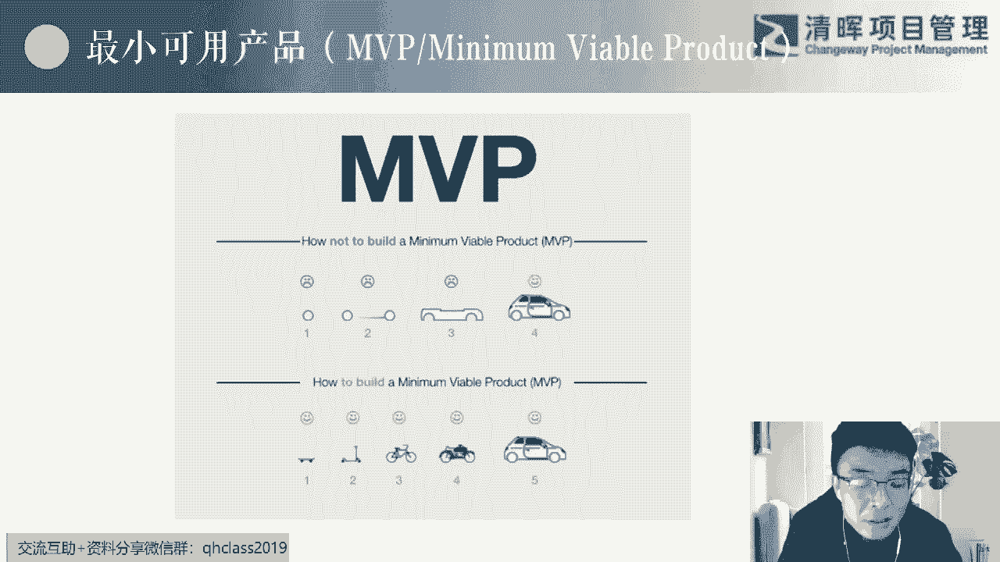
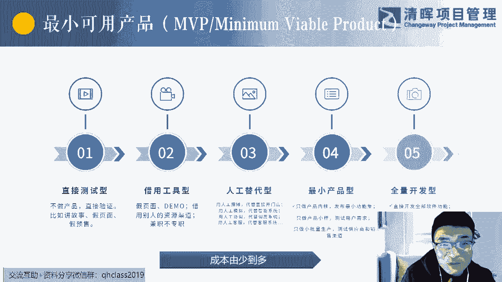
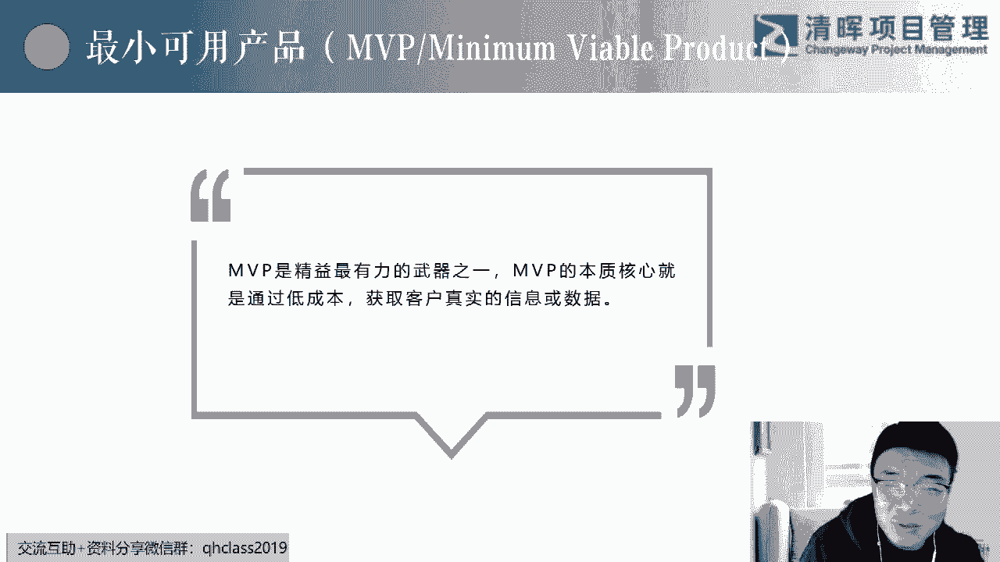
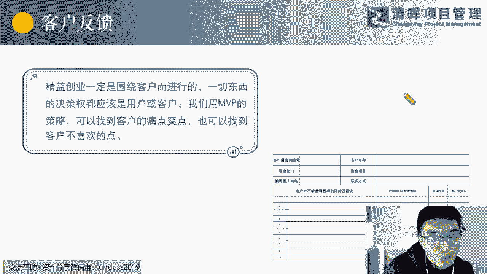
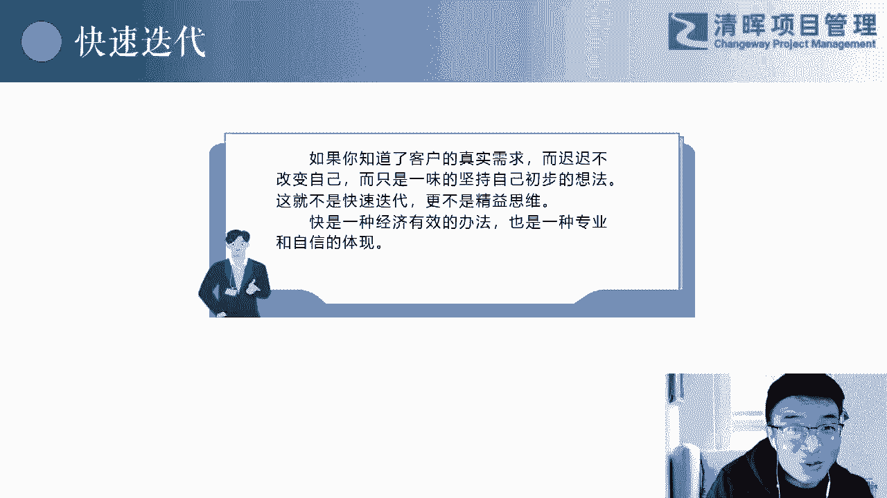

# 低成本创业指导课 - P3：3.精益创业的本质 - 清晖Amy - BV1WM4m1k7AC

感觉啊我们一点往下走。

所以经济创业嗯，它的本质，这句话大家可以去尝试的记个小笔记啊，用最小的成本避免出现最大的很大的风险，而且这种风险是我们接受不了的，我们承接不了的，所以这就是经营创业的本质。

用最小的成本避免出现最大的风险，OK那再举个例子吧，你们所有人都做过，包括我我也做过，你们吃过自助吧，吃过没啊，你们你们别告诉我，你没吃过自助啊，假如啊咱们就先说一个这个这家自助店，是我没有人给我推荐。

也我第一次去啊，这是因为跟创业的性质一样的，我第一次去做这个事情，我也不知道什么东西好吃，我也不知道吃什么这个东西，什么这个店里面什么东西好吃，我吃哪个东西能吃回本，因为我们吃自助。

其实内心都大家都以为，是不是有一个很多人都有这样的一个感觉，就是我看能不能吃回本这样的一个感觉是吧，那么你想想你吃自助的一个套路是什么，上来之后先给你煮点饮料，然后吃点水果，然后还有大肘子什么的。

先造一点，比如说我们吃个海鲜自助，一个一个一个八百八十八一位，你进去之后，你先做的第一件事情是什么，告诉我，你觉得你想吃回本，我们要创业嘛，我想吃回本，我吃这个自助的第一件事情是什么。

进这家店结账哦对对，第一件事情结账，结完账，你在干什么，找贵的吧，找贵的吧，哎这个是一个思路就出来找贵的，这是第一位，但是假如好几样东西，那个那个那个帝王蟹，还有什么什么什么什么鱼，什么这些东西都还得。

这都挺贵的，然后你要做什么，是不是在柜子里面找个我爱吃的，好消化的，是不是这样的，那这里面会有一个问题，你是不是会牺牲一部分你的胃啊，你闻一下丢掉，你就你这个你这不嘿嘿，你这是抬杠了。

我告诉你对我人家说避免浪费嘛，人家不浪费可耻吗，光盘行动嘛，所以这里面有个过程是你是不是要牺牲你的胃，一部分的胃，然后去尝一遍哪一个东西是贵的，而且是你爱吃的对吧，我们要做一件事情，第一个吃回本。

第二个要吃得舒服，吃得开心嘛，但是你要牺牲一部分，你你一小部分，比如说我牺牲了1/3的胃去尝一下，然后当你把这个攻攻击的一个重点的一个方向，找到了之后，哎我们就重重点要吃那个了，是不是这个道理。

所以这个是不是也是一个思维，我我们一我一点一点的在给你们引导，我最后一页PPT就是我其实是今天所有的重点，前面的东西都是非常简单的，我的是想把最后一个非常非常简单的一个道理，跟大家讲清楚，你们能理解吗。

我们我见过吃自助餐的人，上来之后造了十个鸡蛋，十个煮鸡蛋上来之后做了十个煮鸡蛋啊，那个时候的自助餐嘛也不贵是吧，可能20块钱一位上来之后造十个煮鸡蛋，我天哪啥也吃不下去去了，所以这也是一个一个一个点啊。

一个，那我们看下经济创业的三个工具啊，第一个MVP听过吗，minimum v viable product啊，MVP最小可行性产品或者最小可用产品啊，这个你们学过敏捷也好，学过精英也好。

大家都听过这个概念吧，我就不细讲了啊，我就不细讲这个MVP的概念，但是我要给大家讲的是，MVP是我们整个经济创业里面最有利的一个武器，你不要你不懂MVP的话，你根本就不知道什么叫经济创业。

我给你举两个我自己我自己经历过的，我我一一个是我自己经这这个这个见过的，一个是我自己参与过的一个点一个产品好，我们要在一个政府的一个一个一个办事窗口上，要去做一个呃，做一个那个那个同步翻译。

同步翻译机器，然后呢，这个机器在外面常规的一些标准化的东西，是不不好实现的，因为这个里面会牵扯到一个，非常典难的一个技术，就是他要把某一个地方的方言，翻译成某一个地方不标准的英语，听懂了吗。

他不是把标准的普通话翻译成标准的英语，这个这种这种翻译机器，比如说我这边说，不是那边已经显示的一些汉字就出来，我这边说汉语，那边你的英语就跟它显示屏上给他挑出来，这种已经是非常成熟的产品了。

你不要不要害怕，随便成市场上都有买的，但是我想说的是，把一个某一个地方的方言，翻译成某一个地方不标准的方言英语，所以这个这个事情呢，其实我们纠结了我们很长时间，而且我们这个产品其实是在呃。

局部来说还是比较重要的，而且我们那个项目必须要有的，然后我们就去找了一个某某龙头公司啊，我就不点名了啊，某龙头公司，然后我跟他说，我说我们需要一个这样说，这个没问题，但是价格贵一点。

我说价格真的不是现在不是问题了，我们的一个整个总包里面这一个光这一个产品，我们当时报的就很贵的，我说价格现在已经是非常嗯不重要的一个点了，我们现在想要把这个东西做出来，然后我说我们的这边呢。

这个甲方客户领导也比较看重这个东西，你们什么时候能给我们看一下你们的技术，就给我一个礼拜时间，还有一个礼拜你就能看到样品，哎我在我在想，因为我在前期也做过很多市场调研，这块一个礼拜好像好像没有哎。

一个礼拜就能做出来，后来就一个礼拜真有一个不太精致的盒子，大家能想到一个不太精致的盒子，然后上面有一个能显示出来的东西，但是他就说这是个样品，反正不太精致，你知道吗，有人说那个不标准的英语的时候。

他真的能把它翻译成那个方言，有人说这个方言地方方言的时候，尤其那几个工作人员说他地方方言的时候，他就能给他翻译成阿三的英语，你你你你你没没我，我感觉这个东西是成熟的，我说哎这个东西还真能实现。

但是后面我才知道哦，我什么叫MVP的概念，所有这些东西的操作，所有这些东西的操作都是在，只是只是界面上有个WIFI，这个这个机器里面连了个WIFI模块而已，它有一个不是WIFI模块。

就是那个网络有线模块，就是它能通信的，所有东西都是人为在后台做的，但是它让人的感觉特别特别好，所以这种东西就是我要让客户觉得这种场景，你们是适用的，然后你觉得这个产品是好的，然后我再去攻克这个技术。

听懂了吗，这就是一个我我接触过的MVP，那个时候我是不懂什么叫MVP，后来我才明白哦，这个东西是MVP，其实作为产品经理而言，这个是特别好的一个思路，你说你需要个东西，我巴拉巴拉我做出来。

你说你不喜欢了，那不就完了吗，你说你需要个东西，我先给你做一个样品来说，你试试简单一点，你试试，你觉得这个东西好，然后剩下的我你要我再去做，然后我发现你的真实价值，然后我再去攻克难度的东西。

听懂了这个点了吗，你比如说他们做做做自动售货机的，做我做那种那种那种，或其实以前做过很多产品，都是上来之后，现在人人去尝试着去做一下，用人工代替的，所以我给大家总结一下。

这页这页PPT其实是比较比比较有价值的呃。

我在吸收了一些一些别人的一些知识之后改造，然后做总结出来，你们看到的MVP，一般的话都是第四个叫最小产品，就是只做特别小的一个产品的内核，产品的小样就是第四个，我现在最写的最小产品型。

然后我其实想给大家推荐有很多种MVP，然后从成本就是花的钱从少到多，我列了五个，第五个就是全量开发型，就是我刚才给大家讲的超业嘛，上来之前就干完了，我我全部开发，我全部去门店，全部给他做起来。

团队全部给他组建起来，这种全量开发型的和其实他不叫MVP，他他就是和我MVP终极了终极MVP了，那就相当于对吧，其实我想说的是123额甚至到四，我们应该先能想到一的话就选一，先能想到二就选二。

就是我们越往左成本越小，而应该是最好的MVP，那么对于一个MVP而言，你什么时候感觉到这个东西拿出去能够感，能够得到别人的反馈，但是我有点难为情，拿出去我有点难为情，大家记住，来把这三个字给我扣一下。

我看你们现在多少人在听我这个课，难为情呢，把这三个字给我扣公屏上走一下，我看看有些有有人在听吗，OK谢谢你看PPT造车也好，概念车也好，完了什么什什么这这些东西，你现在我们都往死骂。

但人家为什么能拿出来把他东东西做了呢，你比如说我今天要去做一个产品，我我就做个互联网的产品，或者我要做一个什么什么什么，网页端的一个东西，我就给你设置一个假页面或者个假按钮，那我不就是一和二吗。

就是直接测试或者借用工具的，我直接测试，我就弄一个假按钮，我看看这个东西到底有没有人用，如果这个上来之后，一天有人点击，点击这个按钮的次数超过了多少次，我就觉得这个东西有市场的那好了。

那就说明我已经把市场调研做完了，各位，我没有里面没有实质性的东西，我就设置了个按钮，你点一下能怎么着，他把他把那众筹我也写了，即众筹预售对吧，那那有些人说诶，那你做了个假的广告，然后呢。

我们有些人甚至连钱都交了，你没有你没有，将来你你发现你这个东西没市场了，你怎么办，你不做了，那那这已经交钱了，怎么办，退呀退钱呀，这个很正常的咯，我们都见过很多，就这样的退钱，对不起，不好意思。

这个东西这个项目黄了，现在我原那个时候，大众大部分的这个这个这个人的认知是，你把钱能退给我就不错了，我们能做到退啊，全款能退给你，不好意思等等，所以说你先别上来之后要做创业，要做创新，要做研发。

你上来之后别给我告诉我，你这个东西应该怎么做，做一个完美的产品，没有完美的东西不是这么做出来的，你先要把市场找到，有没有人需有这个需求，所以你看我们直接测试情，不做产品直接验证的啊，讲故事。

假的页面对吧，假的页面，然后我我给你开发几门课，然后我给你，我请个人，然后写一个一做，做一个宣传海报，我说我就发出去，看你们有没有人想听这个课，诶，有有有几十个人想听，我再去开发这个课，可以吗。

可不可以，你回答我可不可以，你们回答我可不可以，有人说，那你这个太太奸了，你这个人你你太不地道了，怎么所以难为情啊，我甚至还说你们可以预定啊，你又可以预定啊，你交99块钱顶1000块钱啊，你定完之后。

假如我不不讲这个课了，怎么办，我退钱啊，说个不好意思，退钱啊，众筹做产品是哪个平台先发起来，你还问住我了，所以大家大家要想到这个，那这个这个我刚才给你们举的那个例子，我没有买这个东西。

我我上次我说就这个情人节，你跟你的另一半买什么东西了，我没买呀，我问他呀，他喜欢什么呀，我的钱包是有限的，我不知道他喜欢什么，现在我没做呀，我直接测试，我就问你喜欢什么，你猜我给你买了个什么，听懂了吗。

各位你们觉得那所有的那些套路，那些东西都是说都都都是在书上在那写的，那么清楚没有啊，这个是大那什么咳啊，苏宁吧，应该是，然后下面几个你看第二个就是借用工具啊，我们demo我们做demo对吧。

我们做demo，然后还有一些就是团队，你这个时候不要成立能兼职的，找兼职的，第三个就是人工替代型，哎我我我我我，我们之前有个老师给我们讲那个课，我记印象最深刻，我要做个打地鼠的一个游戏。

那我就要非要做出来，我用人当老鼠往出来窜，我看小孩子是在是在在商场愿不愿意打呀，是不是啊，我用人工去做呀，我用人工模拟啊，你要做一个客服，客服客服的系统，你先上别上来做系统啊。

你先要把客服弄用人去代替代啊，然后呢你发现这个东西是有需求的，然后呢你用机器用用用用用用用技术用系统，然后把人工替代了呀，所有的路面上的你能看到的自动售货机，所有的这东西都是人工这样测出来的，听懂了吗。

各位所有路面上有的那个自动售货机，最初出市场的时候都是人工测出来的，就是他看在这个地方有没有人买，有没有人去做榨汁机，有没有人买盒饭，有没有人买矿泉水，有没有人买饮料，如果有人买，他就在这样就卖。

有人买，然后呢他就做了个自动售货机，放在这儿替代它了，这就是人工替代啊，然后我们再去做，一定让我做，我做一个产品，最小产品拿出一个东西，就有一些核心的功能，其他的没有，每次我制作的都是核心的功能。

然后让客户给我反馈，当然当然第五个就是全量开发，所以这一页告诉你们，其实产品经理的思维或者为啥要讲创新，为什么现在是产品经理要有创新思维，你没有这样，你们看似是套路吧，你们我跟你讲。

做我要给做技术的人去讲这些东西，很多人觉得我在玩套路，你有你有这个感觉吗，有没有，你是不是觉得我们在玩套路，但是我在回过头问你，你我们都见过呀，这些东西别人都是这么玩的呀，都是这么玩的。

它是有一定的市场，有一定的道理的，对不对，听懂了，扣个一，我要翻页了，觉得有没有收获，MVP啊，记住MVP一定要记住啊，记住这个就是最小，根据产品记，记住我今天跟大家说的那个，跟你的另外一半去去去呃。

去去谈判，去沟通，他喜欢什么东西，所以MVP是经营最有力的武器啊，MVP的本质核心就是，通过低成本获得客户真实的信息和数据啊。

获得他真实的想法，他的信息，他的数据对吧，所以你要难为情，你要你要去尝试去做一些事情，第二个就是呃客户反馈，你做了一个小的东西。

你一定要去得到客户的反馈，为什么我们要做MVP，就是想得到他的反馈，能理解我这句话吗，你一定要去得到他的呃，他的反馈，如果说我们不讲经济创业的时候，离开客户，什么创业都是不成立的。

我们其实经济创业我最后有一张PPT，我要告诉大家，第一个就是找到有价值的东西，第二个不要浪费的把它研发出来，那你什么叫有价值的东西，就是你要去找到客户真实的想法，真实的需求，这才叫价值。

如果你不知道他客户不给你反馈，没有得到客户的反馈，对不起对不起，你这个东西是没法成功的，所以我们要尽可能的去得到客户的反馈，OK那刚才有人说我们举的那个例子，我要问我的另外一半。

然后你猜我给你买了个什么东西，人家说你想买啥没啥无所谓，那你玩啥你玩啥你都没价值，你知道人家都无所谓，人家对这个礼物都没有任何期盼，没有任何的想法了，那说明对你也没什么想法，那你还死皮赖脸的要买一个嗯。

那就这叫什么，反正你没价值，反正也没价值，所以说我们做MVP的点，就是一定要得到客户的反馈，哪怕就是这是客户的痛点呀，这是客户的爽点呀，这是客户的痒点呀，或者就是客户的那个那个那个不爽的点啊。

一定要嗯避免那些点不想要的东西，这也是反馈，哪怕他骂我一句，诶也是反馈对吧，所以获取客户的反馈，低成本啊，获取客户的反馈，第三个就是我们讲三个武器，第一个MVP，第二获得客户反馈。

第三个你要赶紧赶紧的给咱们去改变迭代迭代。

因为如果客户给你反馈了，你没有去改变自己，你就很快失去了这个市场，而且这种客户前面做的MVP也好，客户反馈也好，基本上都无效了，就是没有任何作用了，我们目的就是赶紧迭代，把它做出来，听懂了吗。

就是MVP，然后客户反馈，然后快速的把它去迭代，对你比如说啊，这这这个我我其实又跟跟一些，这个这个我们不知道直直男还是什么样的，就是我我有很多学员不是搞技术的嗯，小小朋友小孩子99899的。

现在2000年的都有了对吧，哎我跟女生说个话，脸红我都不知道怎么追个女朋友，我喜欢什么都不知道跟她怎么沟通，其实有些时候人家女孩子也其实对她有好感的，她就是都互相在等捅破那张窗户纸是吧。

但是这个男孩子太腼腆了，也其实是个不太好的事情，所以其实我有些时候我就讲，你想跟他发展成什么样的一种关系，你试探性的用某一个语言去尝试一下，你不要说的那么low，但你尝试一下，如果他给你一个反馈。

他哪怕给你一个表情，你就知道他心里的想法是什么，但是你连尝试都不去尝试，或者说你人家给你反馈了，你没有去修改修正它，那你这就这这个也就不会持续的，更好的往下发展，对不对，啧，所以说如果你腼腆。

然后你稍微大胆了一一点点，人家给你反馈，对你这大胆的这一点点还是比较感兴趣的，那说明你要赶紧改，改成稍微胆子大一点对吧，OK然后我们看一下创业时代的三个步骤啊，三个步骤。

第一个就是写出我们的精益创业画布啊。

