# 全新录制PMP项目管理零基础一次顺利拿到PMP证书 - P14：PMP精讲开发方法 - 北京东方瑞通 - BV1qN4y1h7Ja

好同学们，接下来我们来看关于下一部分，开发方法和生命周期绩效率好，第一个首先要开展过程，开展我们的项目工作，但是先把开发方法确定下来，我们用什么样的生命周期来开展工作，这个生命周期如何去划分成多个阶段。

那生命周期的各个阶段怎么来划分，我们的交互频率是什么，以此来决定当前我们的开发方法，还有我们整个生命周期，生命周期里面，我们的需求变更的频率又是什么样的，来通过这些综合因素的考虑来选择一个最好的。

最贴切的，最适合于当前这个项目环境的开发方法，以此才能够按照后续的流程来开展工作，所以第一步先确定我们的开发方法。

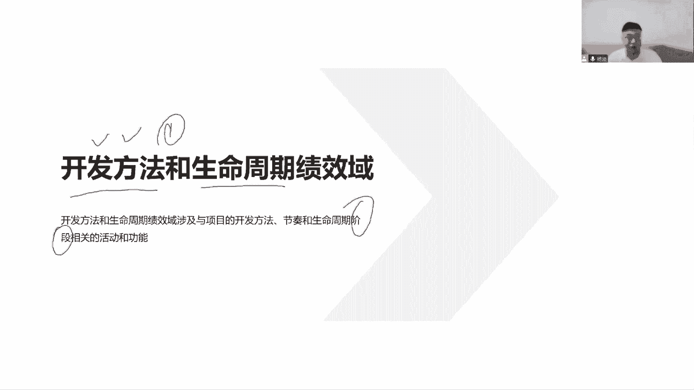

开发方法分为这么几个，第一个预测型，第二迭代型，第三增量型，第四适应性，还有这几个可不可以混合，完全可以把混合型的开发方法，也就是迭代预测适应，这样都可以结合着一起来开展工作。

那么选择这个开发付款之后呢，接下来就要对这些工作做一个细化了，从项目开始到项目的结束，各个阶段，我们把它叫做生命周期，由这些各个阶段组成的，在这个项目生命周期里面。

我们要将这些阶段和业务交付的该系人价值，联系到一起，每个阶段咱要去做检查，检查我们当前所产生的价值，所产生的价值是否是合理的，是否是合适的，那这个价值就意味着当前要既要看我们的绩效，要看我们的目标。

还要看我们的预期收益，目标价值有没有实现，当前有没有达到阶段性的一个目标，或者说我们这个目标偏离比较远，那这个时候有可能会调整调整工作，甚至有可能会直接取消项目，那是不是要把我们的价值结合起来。

项目生命周期，由促进我们生成项目可交互所需的交互节奏，和我们开发方法各个阶段所组织项目生命周期，在这个项目周期里面，我们要去划分我们各个阶段，每个阶段去看当前阶段，收益阶段的价值是否有实现啊。

这是我们当前开发方法和生命周期，所关注的一个绩效，看价值有没有实现啊，第二要考虑我们这个开发方法怎么去选择，选择的是否合理，那这里说了，既要考虑我们当前的各种一些节奏，把我们交付的节奏，需求变更的节奏。

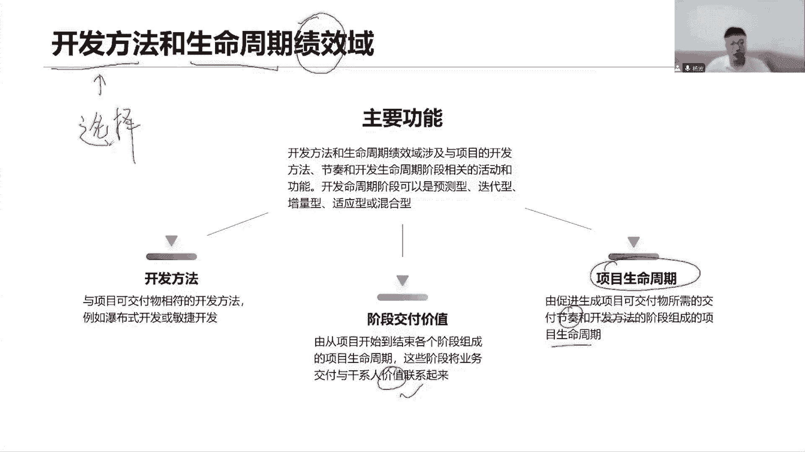

还要考虑当前各种相关环境，那这就几个概念，第一项目生命周期从开始到结束，从今年一系列的阶段，这是不是在体现出我们项目的临时性啊，由开始时间有结束时间所经历的一系列的阶段。

这个阶段是按照当前和项目环境一起来划分的，下面的各个阶段是具有一些逻辑性的，一些啊活动所组成的一个集合，通常一个或多个可交互物完成未接触，也就是在每个项目阶段，都有一个可交互物与之与之产生。

那么这个物当前是否符合要求，我们要在每个阶段关口进行检查，那这是一个完整的口腔问问，那当我们现在完成了某一个阶段，或者某一个啊项目结束的时候，我们会产出我们的口腔互，这个可交互就是独特项目的独特性。

我们的产品也同样，它也是个独特的独特的，可核实的，可验证的，可检查的，可验收的这么一个产品服务或结果开发方法，我们的四种，我们五种预测的迭代的，增量的敏捷以及混合一起来。

用节奏新的概念在项目生命周期里面，我们所开展活动的一些节律，其实就是指当前怎么交互，那就是交互的节奏，它可以是一次性的交互，也可以这么快速的频繁的交付，定期的交互都可以。

或者说我们叫做需求变更的一个节奏，需求变更的频率也可以啊。

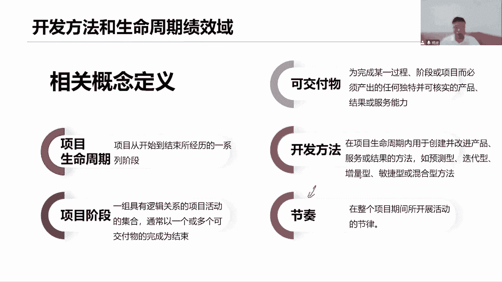

你看这里说了交互节奏，交互一次性的交互，我们的预测性的方法，或者说我们多次交付频繁的去交付，或者我们在预定的时间节点定期的去交通，都是一种。

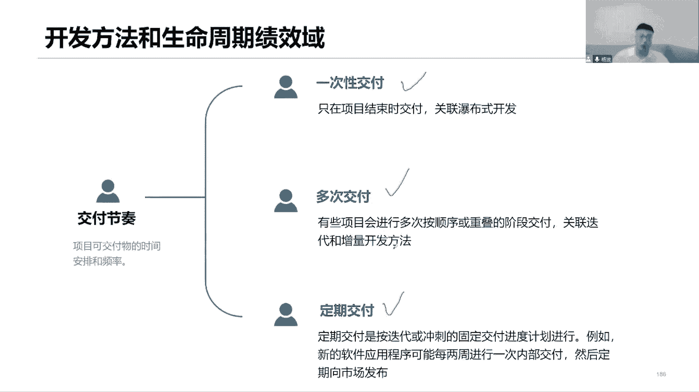

接下来看关于这个开发方法和生命周期，它的绩效，对于开发方法和生命周期的话，我们着重讲两个，一个是我们的瀑布，一个是我们的敏捷，这是两个非常极端的一种开发方法，最好是能够做出一些混合。

对于传统的预测性的方式来说，首先我们是不是先要确定一下，当前这个产品的需求有哪些，基于这个需求啊，我们来开展后续的一些设计工作，然后呢继续设计来完成我们的行研发，研发完成之后再开始做测试。

以及后面去实施和部署，在这些各个阶段里面，是上一个阶段完成之后，才可以进入到下一个阶段，而这是我们步步行的方式，没有说他向我们说既在某一个阶段既有需求，又有设计，又有开发，它和敏捷是完全不一样的。

上一个阶段的工作全部完成，所有的工作都完成，我才可以进入到下一个阶段，开始下一个阶段性工作，那每一个阶段之后，我们说一定会产出一个可交互，这个可交互物呢当天并不能产生价值，这是一个中间产物。

客户拿着这些文档，拿着这些文档有意义吗，不行，他要的是什么，我们要把这个追踪的可工作软件，可运行软件，能够产生业务的这些软件，哪怕他们才能够产生价值，所以我们在这个过程中啊，中间过程它不能够产生价值。

那这个时候客户拿它也没有意义啊，而且中间过程能不能够有利于帮助发现问题啊，因为客户在中间他不会参与进来的，更多的时候是在什么时候，在项目早期的时候，他参与进来帮助我们去梳理需求。

以及到了项目后期做产品验收的时候，我们拿出这个可控的软件诶，来看是否符合要求对吧，从早期以及到最后结束的时候来看，是否符合要求，中间大多数情况下客户他们没有一个参与感，那就不能够帮助我们尽早的发现问题。

如果到了后期才发现问题，有可能会回到测试，有可能会回到开发，回到设计，甚至回到早期的需求阶段，那就比较麻烦了，所以说瀑布型的方法它用在什么场景呢，首先需求的非常明确，而且在整个项目视频周期里面。

咱限制变更，中间不会有太多的变更，我们就是按照这个需求，一定有那些后续去计划，按照计划来驱动我们的工作，以满足我们的需求，那这是非常重要的，满足了需求，那前期需求得确定下来。

通过这个需求我们才能够预测啊，预测一下当前我们最后的结果是什么，所以把它叫做预测性的生命周期在这里面，但是对于迭代来说，它就不一样了，迭代就是循环的反复的去开展，往前面后面一些工作。

那你看我们拿敏捷开发，也就是适应性，拿我们的敏捷适应性的开发者来说，敏捷一个一点一轮一轮的迭代，迭的周期会比较短，通常来说，两周一迭代，或者四周或者三周都可以追加时间嘛，两到四周，那么每一个迭代里面。

我们都会去开展这里所说的需求设计，开发测试实施，都会去做这个事情，在一个迭代之内完成所有工作，已交付一个最小的注意，这个可工作软件一定是最小，因为当前只有两周，我不可能把所有的需求全部拿过来做分析。

我们要的是什么，取决于当前最优的价值，最大的最重要的最核心的一些需求拿过来先做，以产生我们最小的工作软件，然后接下来第二天才开始啊，因为需求还没做完，第二个迭代是不是基于上一个迭代的增量产品。

我们去增加工作优化，增加功能优化性能，又是一轮需求设计开发测试，发布产出第二个工作软件，以此类推，我们每一个迭代都在上一个迭代了增量产品，基础之上去增加功能优化性能，最后产出我们的可工作软件。

就最终的结果其实表现都是一样，只不过你是一次性能交付完，而我们是分多次交付，那么这个分多次交付有什么好处呢，是不是可以在每次交付出来之后，我们找客户来给我们做一个什么事情。

评审验收就基于当前这个工作软件，你去体验去看，我们给你演示，你来看，看完之后也要给我一个反馈啊，基于这个反馈，你要告诉我们当前哪些需求符合要求，哪些需求不对，我们尽早去改，所以说这些最小的可工作软件。

小批量的软件，小规模的交付是能够帮助我们尽早发现问题，尽早试错，尽早找到正确的解决方案，尽早识别风险，是这样了吧，以及有可能会尽早交付价值，你看这些可工作人员，当我们形成一个连贯的功能的时候。

这个时候其实我们可以先早期做一个分发布了，可以先早期做管理发布，没问题，因为他们已经形成了一个连贯的功能了，可以交付市场去使用了，可以在业务层面上去开展工作了，所以就可以尽早交付价值，尽早交付价值。

在这个时候就发布，甚至到后面一个阶段又可以发布，以及最后还可以再发布任务，就是尽早交通吗，哎说这种敏捷的方式，而且我们说评审的过程当中，如果发现了问题，我们可以及时改，同时在这个过程里面。

如果你想到了什么新的需求给我提，有可能我们会在下一个替代，把你的这些新的优先级比较高的需求，先纳入进来，优先的完成和工作软件，这也是一种尽早交付价值，说不定这些就可以让你开展业务了。

而不是等到最后拿到这个软件才可以开展业务，中间这一大堆的文档，你根本就不需要，那这是联系方式，快速的应对变更，快速的适应市场变化，以及针对前期各种需求不明确的时候，那你知道当前期需求不明确。

我肯定不可能互补性的好吧，因为我们前期必须要求明确，但是现在不明确，我们就用小规模的方式，短迭代的方式，先确定一下有哪些优先级比较高的，首先能够明确下来的，现在拿出来做交付。

至于后面还有很多一大堆的需求不明确，那就放在后面再说，我们一步一步的去梳理它，一个一个的去处理它，慢慢的去处理，甚至包括对于这些可工作人员的输出，它还可以进行体验，体验之后才能够帮助到更好的。

就树立这些还没有去做细化的需求都可以，而这就是敏捷方式，快速的交付，尽早交付价值，尽早试错，尽早发现问题，尽早梳理需求啊，这些都是我们学得比较好的一些方式。

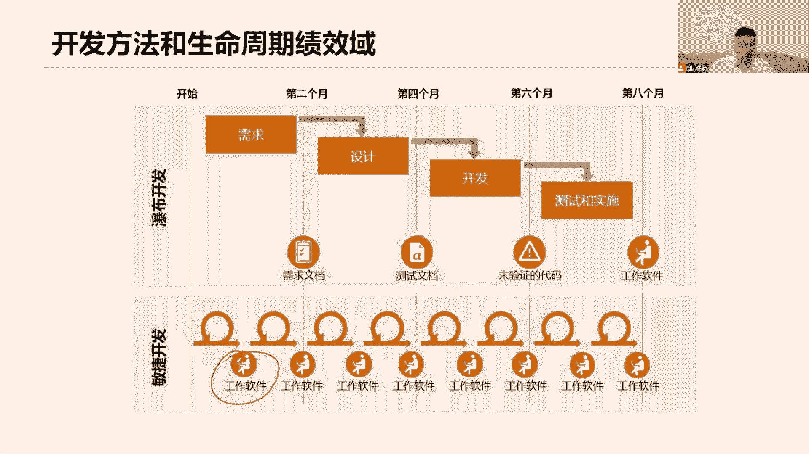

降低风险，所以我说持续交付它的优势，敏捷适应性就是一个持续交付的版本，持续的增量交付给我们，也就是我们说小批量交付，小规模的交付，把当前一些优先级比较高的需求拿过来，经过一轮迭代之后产生一个基金的价值。

但不管你是敏捷还是传统项目，你只要是一个项目，你始终遵循的是12项原则啊，管人的，管事的以及我们的八大绩效域，一个项目里面从八个维度来考核我们的绩效，考核的结果都是一样的，遵循的效果遵循的原则是一样的。

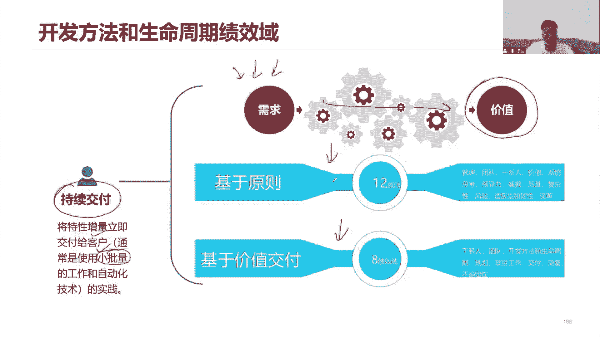

你看我的预测型和我们适应型当然是两个极端，那可不可以混合在一起啊，当然可以啊，那这种混合大家注意啊，对于预测题来说，我们说预测型和这个适应性敏捷，他们可以混，怎么混合呢，那就比如说在一个项目里面。

我们大多数情况下都是以这种阶段性的划分，一步一步的往下走来开展工作了，前期需求也非常明确，但是在项目开展的过程当中呢，我们发现了一些新的工具，新的技术，新的方法需要引入进来，这个引入进来，但是大家不会。

我们想去学习，怎么学呢，我们希望能够快速的了解当前这些市场的变化，这些新的工具，新的技术，新的法规对我们的影响是什么，我们想去快速的去适应这些变化，那这个时候我们就可以用敏捷的方式来处理。

我们以一种小规模的方式，小规模的输出，而小批量的输出来验证当前这些工具，技术方法是不是适用于我们这个环境，适用于当前这个项目，我们要做一些学习尝试和研究以及改进，那就可以在整个项目生命周期里面。

以我们的预测为主，以敏捷为辅的方式来做一个混合，也可以反过来啊，在整个项目生命周期，我们都在开展一敏捷，只不过到了后期我们要做集成，要做发布，要做部署的时候，我们就用传统的方式。

按照标准的流程一步一步的集成到一起，然后最终一次性发布，这就是以敏捷为主，以预测为主的方式在做混合，或者说两个直接五五开，从成整个项目生命周期开始到结束，始终都是混合。

而又预测又是用敏捷的时间一起来开展，所以这个混合的方式就显得多种多样了，哎也可能是一半的一半，也有可能是百分之，比如说二八原则或者多少多少原则等等，所以混合混合，它的它的这种混合的比例它是不一样的大。

取决于我们当前这样的环境。

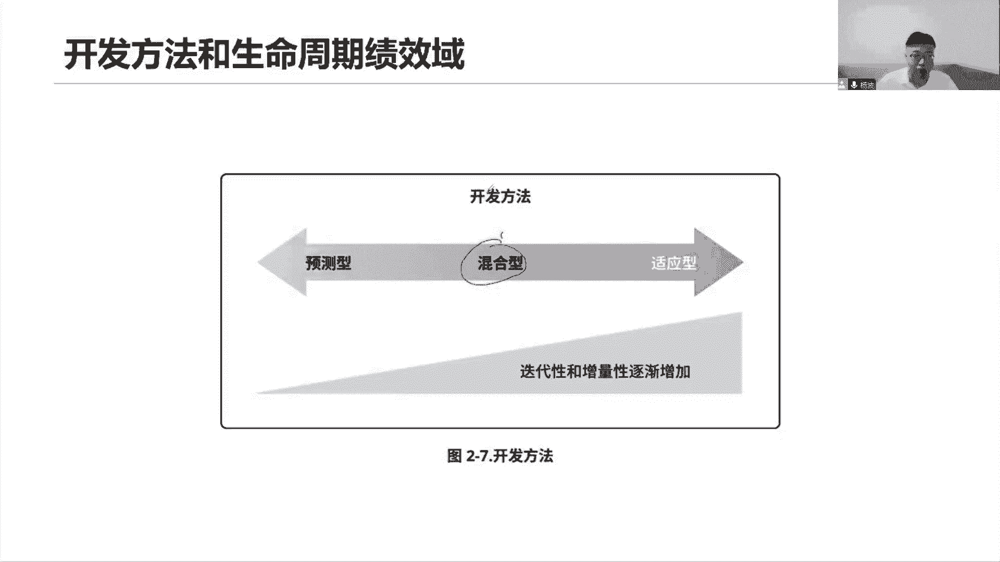

这就是一种传统的预测性的方式啊，从类似于瀑布，像瀑布水平台湾一样，当前前一个阶段完成，进入到下一个阶段，一步一步的走，而当前这个男人看它讨论增量型迭代和增量，就是还是一轮一轮循环去看下工作。

把循环开始工作，那前期我们首先先把这些需求，先把这些概念梳理清楚，然后呢按照一个阶段一个阶段去持续的去增量，交通，在商业电台构建出来的产品基础之上，继续构建。

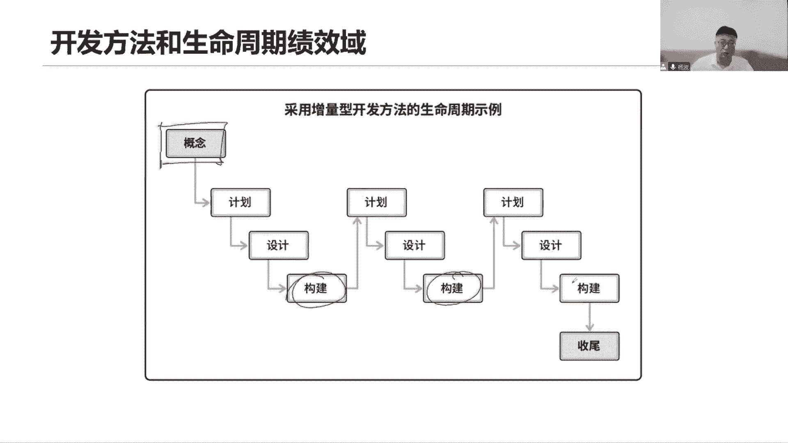

继续增量构建，最后呢我们做一个项目进行收尾完成，最终交付，试运行，那就自己迭代的方式来开展，在每个迭代都会重复的开展当前的各项工作，在这里面，然后产出一个可工作软件。

这个可工作软件我们需要交给我们的客户，交给我们及业务人员做反馈的，以便于我们重新对这些需求做一个梳理和调整，一到下一个阶段又再次开展，我们通过工作，以此类推，每个迭代我们都是这样开的，迭代时间比较短。

通常两到四个。

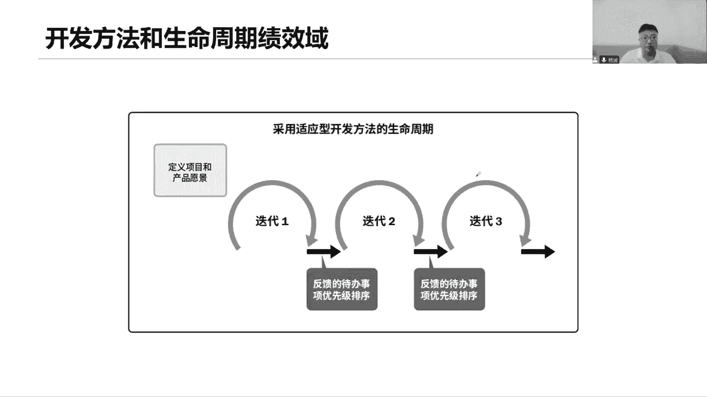

那对于这个适应性的敏捷来说，它有一些特殊的方法在这里面啊，我看它的流程对于敏捷来说，它怎么开展呢，首先前期啊会有一样的，做一些需求层面的一些评估啊，基于这个需求的评估，当我们说一大堆的需求来了之后。

首先我们会先交给我们的，比如说这个产品负责人会有这么一个人，由他来负责对接我们的需求，把这些需求他得先记录下来，那记录在哪里呢，他会把这些需求啊记录在我们的产品代办列表，那个产品待办列表。

把产品的BACKROCK代办列表记录下来，那么这个列表里面可能就会记录很多，很多的需求，就像个需求池一样的啊，那这个需求池里面就有好多一些，比较庞大的需求，也有比较细小的需求，就是各种需求都在这里面。

那这么多区域都记录在这里面好，接下来我就要去分析了他，并负责哪些需求的优先级比较高，但你肯定是基于他的什么商业价值啊，基于当前这些每一个需求，它背后的商业价值，你要去对他做一个排序。

那就意味着你首先得懂业务，你得懂当前这些需求，它背后的业务价值是什么，什么价值什么基于业务来对他做排序，所以作为产品负责人来说，其实你对接的就是方便客户的，你对接就是客户诶，你为客户而交付。

对你要了解业务，了解当前客户的一些需求，基于价值来排序，排完序之后，那接下来是不是把这些优先级比较高的需求，你可以放在最上面啊，放在最上面表示出优先级特别高，具有重大价值了，希望我们能够尽快的落地。

那你想要让我们这个项目团队，去帮你完成这些需求，我们就应该先开一个会，这个会叫什么呢，有一个会啊，它叫做迭代计划会，也叫做迭代规划会，一迭代规划，迭代计划，我们作为产品负责人，首先我们做第一个事情。

来在会上，给各位团队成员们介绍介绍当前这个需求，我经过我排序之后，我认为优先级比较高的需求，我先给各位澄清需求，把需求先拿过来做澄清，也就是同学们工作当中做了需求平整，那当我们解读完了之后。

对这些需求描述完了之后啊，团队成员团队开发团队，他们是不是要去做一个事情，你们听完了好，来大家一起来认领工作，认领当前我们所提出的这些需求比较高的需求，认领之后呢，接下来你要去做分解了。

对这些需求要把它分解成一个一个小的任务，把它分解成一系列小的任务，这样才便于你们更好的去开展工作，分解得更小，分解完了任务之后呢，我们去估算一下，当前就这些任务，他的时间会有多少。

因为我们确保在两周之内完成这些工作是吧，如果你估算出来，发现这个任务估计得五周六周，那不行，说明这个这个需求太大了，这个功能太庞大了，我们两周完不成，所以有可能我们会进一步的把它分解，分解成更小的需求。

基于这个更小的需求，我们来一个一个去做一个迭代，一个迭代去完成，才能够确保当前这个比较大的需求，最终能够交付，所以我们要去分解，把它分解得更小，几率更小的工作我们才能去估算时间，如果这个工作他把大啊。

这个功能太复杂了，我没办法去估算，我得把它分解成更小一些组件模块，什么按钮，什么零件，还记得这些小的组件，小的零件，我来估算我的信息才能更准确啊，一步一步的去估算，然后再汇总到一起。

我就能知道当前这个需求，它需要多少时间完成好了，那么估算完了时间之后，最后我们就能知道基于我们自己认领的工作，我们能不能够完成这些需求，比如说哎PO他说了，我们现在这个会上。

我PO拿出了五个需求来给你们做澄清，希望大家能够完成这五个需求，但是经过团队的认领和分解估算之后，发现我们只能完成三个，那到底听谁的，就是产品负责人说我们要做五个团队。

说我们基于当前人所开展的工作只能做三个，那就是请相信团队啊，尊重你的团队啊，前面说了，尊重尊重是我们的企业文化，是我们团队文化，尊重他们的决定，三个就三个啊，那就是我们这个迭代的目标就定下来了。

我们迭代的目标，当前两周就完成三项需求就可以了，那基于大家所发分解出来的这些任务，就这三个需求分解出来的任务，我们要把它记录下来，记录在我们的冲刺代码列表好了，这个时候就不是产品代码列表了。

我们把它叫做冲刺，但有bug列表好，sprint apple重复代码里面，这里面写的全都是我们团队自己，分解出来的任务，那也就是说我们那些承诺要完成这些任务，我们的目标就是完成这一系列任务，开始冲刺。

两周开始冲，每天我们会有一个仪式感会，说昨天我完成了哪些任务，今天我要完成哪些任务，我计划完成什么任务，我承诺完成什么任务，当前我是否遇到的问题，是否有阻碍提出来，这次会议上大家发言轮流着。

发挥在领导力的作用，我们轮流的组织会议，轮流的来发言，再会，其实说这些干嘛，是不是就是为了对齐我们的工作，保持步调的什么一致，要保持步调一致啊，对外人说有人在重复，我们有几个人在重复做同样的事情。

或者说有人在做我们根本上没有规划的工作，或者有些工作根本就没人去做，那么对其工作保持步调一致，保持当前所承诺的工作都是有人去开展，都是按照计划来推进的，好最后两周之后。

是不是我们应该产出一个最小的产品质量，这个产品质量为什么是最小，因为我们只融合了三个需求，我们只把这三个需求纳入到B站里面来，后面还有一大堆呢，我们这个产品代码列表好多好多需求，没关系啊。

下一个迭代我们继续来啊，这就是我们当前适应性的开发方法，它的一个最基本的流程，你看适应适应每一个迭代，我们就只做这么一小部分的一些任务，这一小部分的任务是经过我们团队，我们自己决定的。

当然同时也是符合你产品负责人对这个需求做，经过排序之后的一个方向，我们按照你的这个方向来选择任务，把它当做是我们的目标去承诺，然后呢每一个迭代去做，每天我们都会做工作，对其最后我们产出我们的承诺好。

这就是我们的产品增量了，这是一个迭代，那接下来是不是就要从下一个电源规划开始了，我们又要开始计划下一步的阶段，下一轮我们做什么来，大家又开始认真工作，又开始去估算和分解，已确定下一个地点。

任务又开始冲刺，冲刺之后又产出增量是不断的，在我们上一个迭代的基础之上增加增加增加，直到我们产出一个比较连贯的功能，我们就可以去发布了。

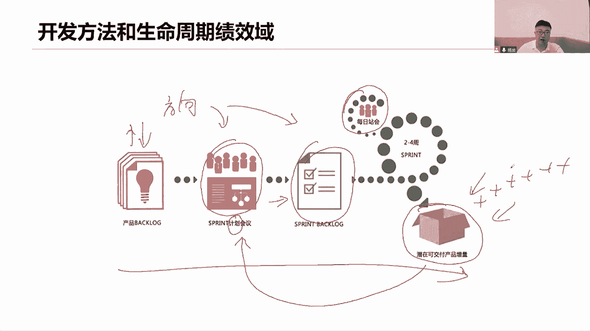

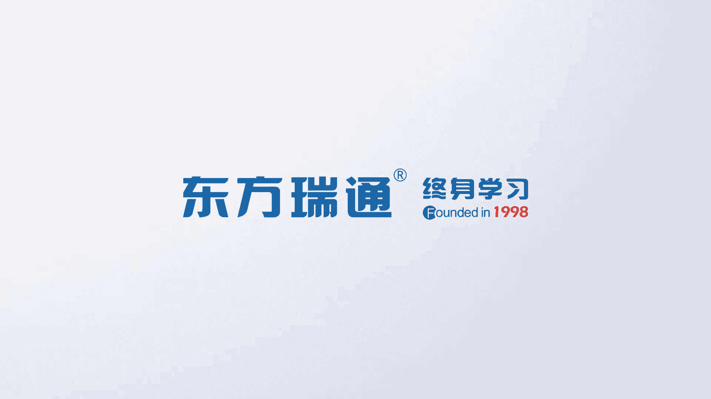