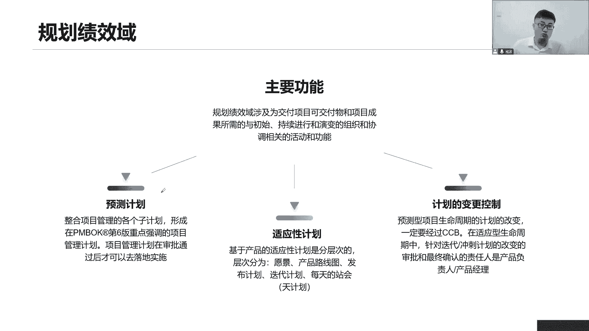
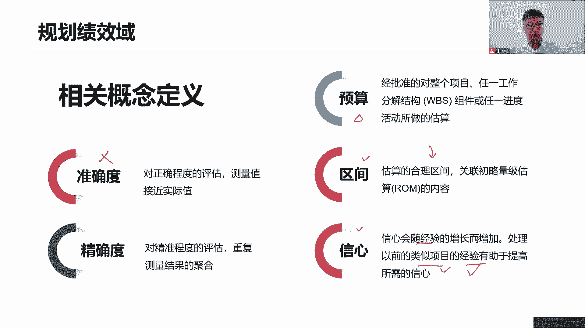
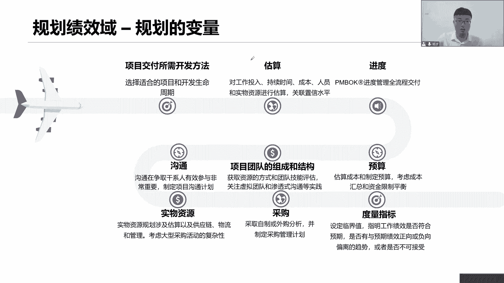
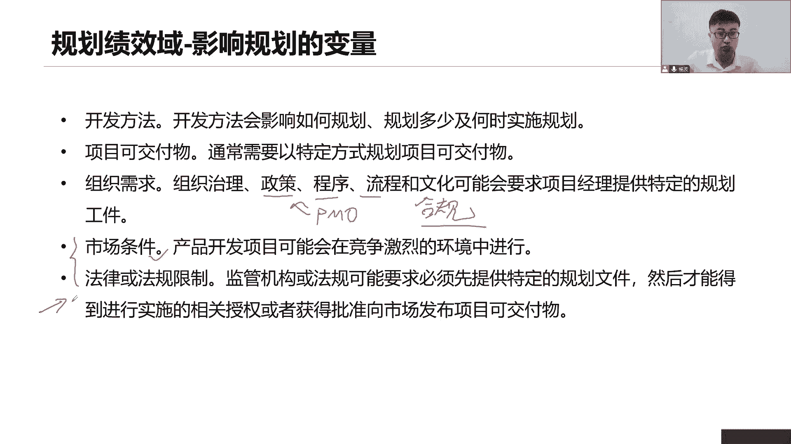
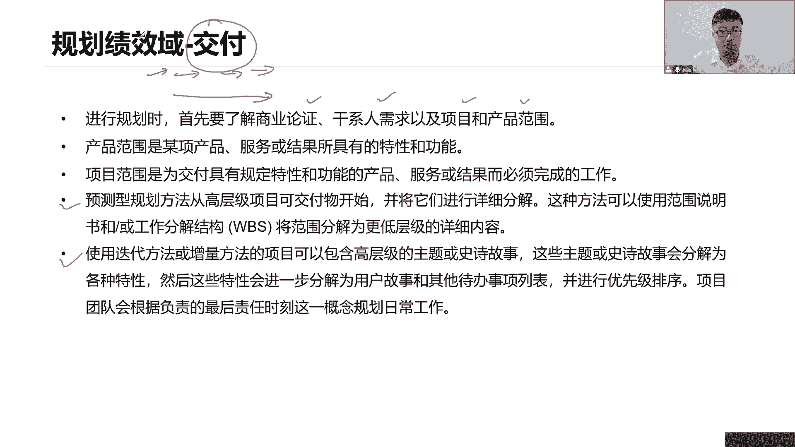
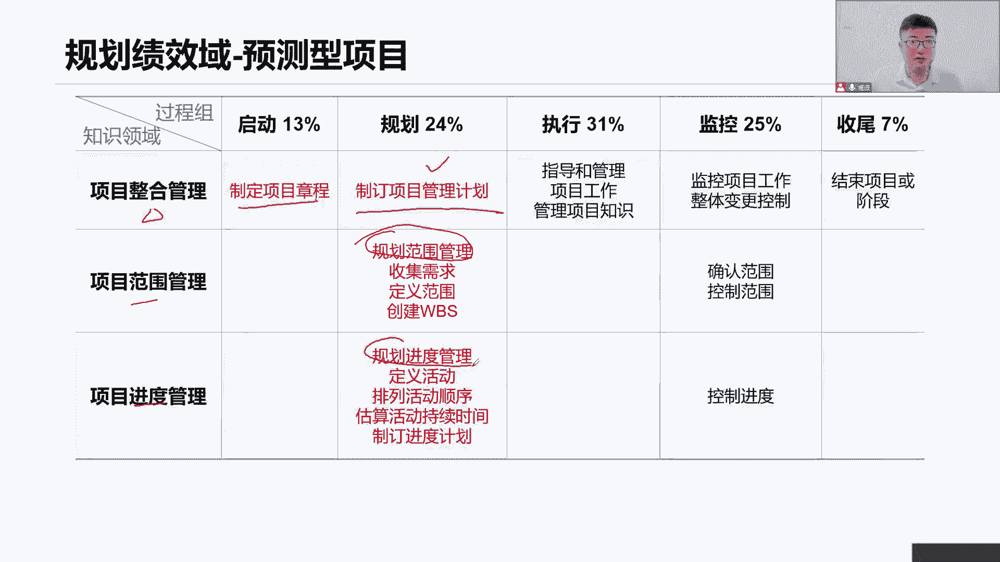
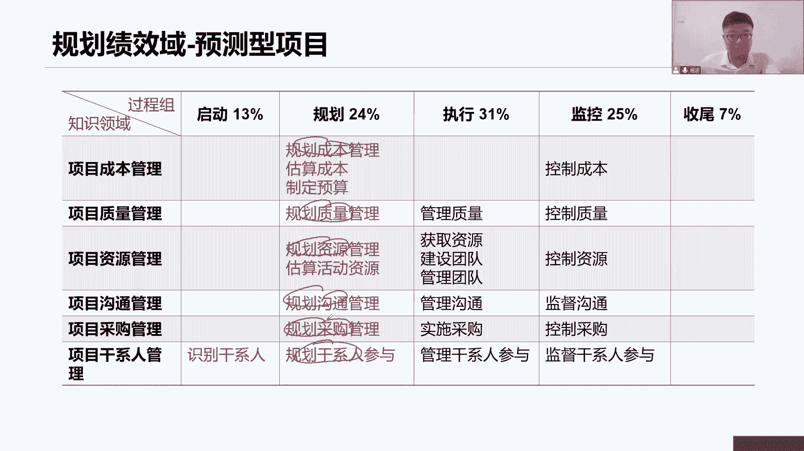
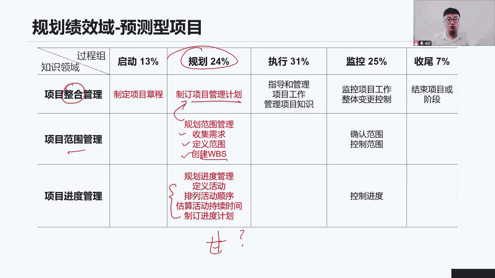
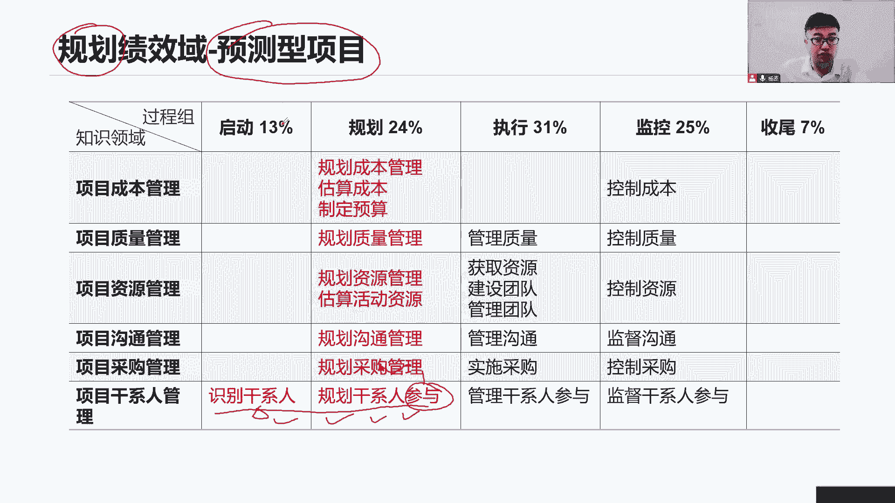
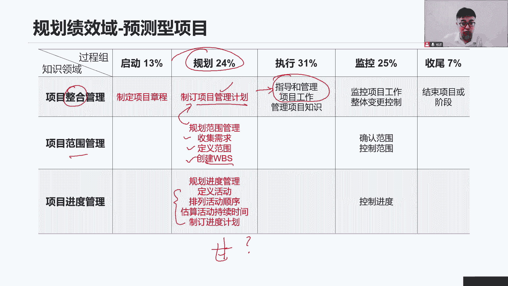

# 全新录制PMP项目管理零基础一次顺利拿到PMP证书 - P16：PMP精讲规划绩效域-规划的变量 - 北京东方瑞通 - BV1qN4y1h7Ja

好同学们，接下来我们来看看关于下一个绩效与规划，绩效与那在学习规划绩效与之前，我们先来回顾一下我们前面的开发方法，它包括了我们第一个预测型，第二个呢我们的迭代和增量型，第三个我们的适应型。

因为开发方法的不同，我们后续的工作方式是不一样的，那么工作方式不一样，是不是就意味着接下来我们定了一系列的计划，也完全不一样了，那至少在我们说如果用预测型，传统的瀑布型的方法来开展工作。

那我们的计划就要想想当前有哪些领域，我们要规划，通常来说我们有九个子计划，九个子领域它会制定出一个详细的直接化，然后呢，我们再把它汇总到一个整体的综合的，正式的项目管理计划，来指导我们如何去开展工作。

这是我们采用预测性的方法，在规划计划的时候，我们要按照这个方式来做，那如果说我们采用比较迭代速度比较快，用了适应性的方法，也就是敏捷，那这个时候我们就没有时间去做这么详细的，仔细化了，我们怎么做呢。

首先我们会确定一下，当前我们这个项目的愿景是什么，接下来会说明我们整个产品的发展路线哎，产品路线图，那基于这个产品路线图啊，我们会有进一步的规划出什么时候发布啊，基于我们的发布计划。

我们才会制定出当下我们一个，相对来说比较具体的一个迭代计划，因为我们是按照迭代的方式来做，我们通常两到四周是最佳实践，那么这两到四周之内我们怎么去做工作呢，会有一个迭代计划。

那你看是不是我们选择了不同的开发方法，对应着我们当前如何去规划，我们这个项目怎么开展，它所形成的一系列的计划是完全不一样的，包括它的详细程度，它的适应程度都是不一样的，所以我们在制定规划计划的时候。

在规划工作，要想想，前面我们所选选项的开发方法到底有哪些，那如果说是混合型的，那都可以用啊，这些计划都可以把它做出来好，那么接下来我们看进一步的关于这个规划，绩效预览，其实规划绩效预啊。

它是在于我们当前要产出这些可交付成果，我们前期所需的一些持续的一些工作啊，这些工作有哪些活动，以及这些活动之间是相互关联的。

你看这里，我们说规划绩效率是不是包括了预测性的计划，也包括了适应性的计划，预测评的计划，他说我们应该有很多个子计划，这个子计划是需要经过裁剪的，当前我们这个项目里面涉及到哪些领域，要开展哪些工作。

我们把这些直接划定出来，比如说我们的范围，进度成本质量资源沟通，采购风险干系人，那这些指的应该是把它罗列出来，具体哪些领域，我们具体用形成一个自己划子计划，让我们来告诉我们。

增当前这个领域我们如何去开展，然后再把这些子句话，我们要汇总成一个项目管理计划，这个项目管理计划是一个综合的计划，你看这些汇总成强调的是我们项目管理计划，项目管理计划通过审批之后。

我们才可以按照计划去实施去落地，那就是一个经过正式批准之后的，正式受控文件了，好那这个计划相当于要花很多的心思，至少你在前面，你得把这些详细的子细化拿出来，那每一个子细化是不是都对应着。

我要规划每一个领域啊，那所以待会在学习规划的时候，会先看一看，在预测型的计划里面，我们有哪些领域，他们是怎么规划，在规划过程要看看哪些工作，最后才可以形成我们的职业化，那第二个呢适应性的计划。

在适应性的计划也是敏捷了，那敏捷敏捷相当是要快，所以我们早期我们会先形成一个产品的愿景，项目的愿景，基于这个愿景，我们会驱动出来当前我们做这个产品，它的意义和价值，那么怎么去做。

随着时间我们的产品是如何演进出来的，基于这个演技的路线图啊，我们就知道当前要做这些功能，我们需要经过几个版本，需要经过几个版本来完成这个工作，每一个版本我需要经过几轮迭代，那这就是我的发布计划。

那这么多个阶段，每一个阶段要怎么去做呢，那么优先完成哪些工作呢，但是在迭代计划的时候，我们在迭代规划开始的时候，定我们的迭代计划，那么在每天其实我们都还可以做，每天我们的计划是什么。

我们今天计划要做什么工作，我承诺要完成什么工作，也是一种规划，在这里，那有了计划之后，这些计划既然已经形成了一个正式的文件啊，那好我们就应该按照计划去做事情，但是在做事的过程当中，可不可以对计划做调整。

当前发现了我们的计划可能有些偏离，或者说当前用户加了一些需求，任何的计划随之而发生变化，顺便呢对于一个预测性的项目来说，通常我们不需要经过一个变更控制委员会，他们的审批，而对于我们适应性的项目来说呢。

我们通常是需要找到我们产品的负责人，产品的负责人或者说产品经理，由他们和我们团队，我们一起来确认当前自由变更什么时候做，大家来确认一下计划的变更如何开展，遵循什么样的流程，按照什么过程来做好。

这是我们当前学习规划计，效率，主要要掌握一些计划。

以及计划相对应的一些变更好，我们先看看游戏基本概念，准确度和精确度，那对于这个来说好理解，准确就是当前我们在估算我们的时间，估算我们的成本的时候，估算够不够转，是不是更贴近我们真实值，精确呢。

精确到小数点后几位，我们精确到什么样的结果，什么是预算，什么是工期，预算就是只基于当前我们要开展的工作，我们所需要花这个钱，我们要做一个汇总，那么什么是工期呢，工期就是指当前基于我们要完成工作。

一共需要花多少时间，区间是当前我们在估算的时候，有一个合理的区间，可接受的区间不能偏离这个区间太大了，如果偏离区间太大，那你的准确度就不可靠了啊，信心我们在估算的时候把它联系信息啊，是在估算的时候。

我们应该是随着经验，随着经验增长，我们的信息会逐渐增加是吧，在处理之前，类似项目经验有很多，那么我们就更有信心，对当前这个估算是比较准确的啊，那前提是什么，我们之前做过类似的项目。

我们可以结合着类似的项目来进行比较，那你确定当前我们这个估算相对比较准确的。

那么看这个规划技巧与里面，那么乍一看有这么多工作要做，那我们先一个来看看关于规划里面，首先我们要想想哎，我们这个交互方法怎么去交付，我们要选择我们合理的生命周期，以及生命周期的一个划分。

接下来估算我要对我的工作啊做一系列的估算，包括什么，包括当前的工作投入，或者是这个开展这个工作，持续时间，开展这个工作需要花多少钱，以及需要投入多少资源来开展，哎这就是一些估算，那估算估算也仅仅是估算。

不是准确的去算，它会有一些什么自己的水平去执行那个区间，在这里面，京东呢当前我们说要想开展这个工作，首先我们得拿出一些进度相关的一些计划，在这里面可衡量我们这个项目它的一些工期。

以及我们每天计划要做什么视频，拿出我们进度相关性计划，还有那预算整个项目的预算啊，我说进度和预算都是来自于前面，我们在一步一步的估算我们的活动，他所做出的一些工作，估算活动资源，估算活动时间。

估算活动成本，再进一步的汇总，才能得到我们项目整体的工期，以及项目整体的预算，那有了钱，有了时间，接下来我要看看我的团队了，我需要哪些人员，我们的团队怎么去管理，我得也是先做一个前期的规划。

也就是指当前我们整个团队的组成部分，组织结构，团队的组成，他们的角色和职责，以便于确定未来我们怎么去开展沟通，那所有的沟通马上就开始做这个事情，我们要想想怎么和我们该系统进行有效的沟通。

我们应该在什么时间用什么方法传递，什么内容传递给谁，能不能够让他正确的理解，那这些我们要先形成一个计划，好，在既定的时间按正确的方式来开展正确的沟通，以确定它能够了解我们的信息，那么为什么要开展不同。

其实目的还是在于管理好这些干系的，让他们及时了解我们项目的信息，积极的参与进来，这样他们支持我们项目，还有我看除了人力资源之外，我们还要管好我们食物资源，当前食物资源要多少，食物资源我们要做一个估算。

以及这些食物资源需要什么，确定一下，如果要买好，如果说涉及到采购，那么马上去看我们的采购，采购这些设备，采购这些成果我们怎么去采购啊，采购的计划是什么啊，我们的招投标流程是什么，我们的采购过程怎么开展。

如果要采购，我们前期要准备哪些采购文档，要不要用招标文件，要不要写我们的工作说明书啊，这些都是在规划采购时要输出了，并且形成我们的采购管理计划，那么这些各项工作，我们是不是应该去做一个什么指标。

来验证我们工作绩效，那这些指标到底会用到什么呢，我们前提也得建筑，你看比如说这里说跟风险相关的临界值，在什么区间之内，我们能接受什么区间，我不能接受，那这意思就是跟风险相关的，如果当前我们来测量一下。

怎么去验证我们绩效，如果绩效利用我们这个指标偏离比较大，我们又应该如何去开展，如何去挽救，去纠正，所以我们得先把当前我们测量项目的，一些绩效指标拿出来啊，可能是一些基准啊，可能一些指标标准等等。

确定下来，未来我们会按照这个指标来验证我们的工作了，这是我们当前国际化这边要做的一系列的工作，在这里面，他们会逐步逐步的对这些工作做一个细化。

那么你想规划一些变量，哪些确定开发方法，我们都知道你这个选择的不同，直接影响我后面怎么去定义我的计划，是按照直接划汇总成总计划，还是说我们做一些发布计划和迭代计划，那取决于开发方法。

还有呢我们的可加服务是吧，当前我们以什么样的特定的方式来规划，我们的可交互物，它也会决定的影响着大家，我们怎么去规划组织的需求，组织需求，它包括我们大家组织的自定义政策，程序，流程文化等等。

他都会要求我们项目经理，会提供一些特殊的一些组件在这里面，那就是我们的计划要按照我们当前的组织，政策流程，程序方这个词来来开展工作，不能够按照自己的方式来回忆一下，大家想一想我们的政策程序流程谁来定案。

是谁来给我们定这些政策流程和程序的，是不是我们前面讲的PO，由他们来制定啊，所以我们应该按照PO他们给我们的，一些各种政策程序来制定我们对应的一些计划，至少我们的计划得符合公司的要求，对合规是吧。

还有呢这是我们内部的企业内部的，还有呢可能是来自于企业外部的，各种外部市场环境，竞争环境，是不是要求我们能够快，要求我们快速的推出版本，还是说当前我们的市场那比较平稳的，比较饱和了。

我们用更多的时间来推进我们这些功能，或者是优化一些性能，那它也会直接影响我们的工作的规划，还有市场的法律法规，同样也是会限制我们一系列工作，该怎么去做，我们的规划，我们定的计划要合规，同样也是合规。

那这个合规就是指符合我们的法律法规的要求，符合行业的标准，那这些都是我们要在规划的时候，特别注意和考虑的点交付。

那么当前我们说要怎么去交付，也得先先做一个规划，你看这就说我们得首先了解了解，了解当前我们的商业文件，也就是说我们在交付的时候，我们的目标效益是什么，我们干性能，对我们项目提出了哪些需求和期望啊。

以及当前我们这个项目，它的产品范围和项目范围是什么，所以产品范围就是指当前我要做哪些功能对吧，咱们在交付的时候，你得先考虑考虑啊，你前提是你先完成哪些功能，这些功能是不是客户的干性的一些需求。

在这里面哎，还有呢相反相关是什么，要完成这些产品的功能，我们需要必须完成的工作工作，支撑我们的这些产品的功能，完成这些工作，我们才能够完成这些功能，这是什么，这就结果，一个是过程。

意味着现在为了开展这一系列工作，包括我们的需求分析设计，来研发我们的这个测试，那这些都是文学工作，这些工作完成之后，我们才能够产出一个，具备这些特定功能和性能的可加工，所以我们在交换的前提是。

先得规划好我们要做什么工作，我们要完成什么样的一些功能，在这里面产品范围和项目范围啊，那对于我们预测性的项目来说，预测性的规划方法，我们应该从高层级的可加工开始，因为早期信息不足。

我们只能得到一些高层级的信息，基于这些高层汽车经验啊，我们在渐进明细想想，我们项目的特性是不是这么说的，项目的三大特性，独特性，临时性和渐进明细性，因为早期信息不足，我们只能够用滚动式的规划。

一步一步的去做，然后呢，在当前我们工作比较离我们工作比较近的时候，就说我们近期的工作我们详细规划，我们详细的分解，那远期的工作呢我们就一定会再说，慢慢来，一步一步走，这就是滚动式规划。

所以你看我们详细分解它分解成什么，这种方法可以使用我们的范围说明书，或者说是工作分解结构，把我们的范围，把我们的工作，把我们的成果分解成更底层的一些详细的内容，这样才便于我们去开展，才便于我们入手。

如果太大了，太高层级的，我们并不知道该怎么去开展，只能够把它们分解成更小，更易于管理的各种组件模块，单元子系统零件，这样才便于我们去入手，进一步的开展工作，那么分解的更细，是不是我们的工作也就越详细了。

那如果它采用了迭代性的方法啊，或者是适应性的方法，那这个时候呢，我们会首先依然是从高层次的一，些大的模块开始，那是不是依然是分解，没错啊，作为项目管理来说，你不管是传统项目还是敏捷的项目。

这个分解它本身就是我们的工作方式，这是一种结构化的思维，就是要把这些大的需求分解成，相对来说比较小的，更易于管理的，更易于估算的，更便于我们去梳理逻辑的一些小的需求，那么在敏捷里面我们把它叫做用户公司。

然后在这些用户公司啊，我们要去做一个优先级排序越敏捷啊，要知道两到四周之内完成一个可交付成果，这个两周之内，我们不可能把这些所有的需求全部做完，我们只会做当前优先级比较高的一些。

先放到这两周或者四周之内的一个阶段里面，去提前完成，然后呢下一个迭代又是两到四周左右，我们又把一些优先级比较高了，再拿过来进一步去做落地和实施啊，然后呢我们每一个迭代都会产出一个可交互物，在这里面。

那就说团队会根据负责最后的一个责任时间，这一概念来规划我们的日常工作，也就是当年我们延迟，我们往后延迟，怎么往后延迟呢，当前有些工作啊，我们先得确定一下优先级，搞清楚，大家因为需求的变化。

如果我们提前规划好了，那你这个需求变了怎么办，他就是为了应对我们当前需求多变的场景，所以我们要延迟规划，延迟规划意味着当前等到最后的时候，我们当前这个迭代差不多规划快截止了，我们就确定下来好。

我们当前就做这些需求，而且这些都是优先级比较高的需求，拿出来先做落地，在一个电站里面完成产出，我们的可加服务，第二阶段继续在上一个电站基础上开展工作，好注意看我们在想我们要去如何交付的时候。

首先得考虑清楚当前商业需求，干性的需求，以及当前我们项目范围和产品范围，基于不同的范围方式，基于不同的开发方法，我们会选择不同的一些分解的模式，把工作分解的更低，这样才便于我们去交付啊。

要么是小批量的交付，持续的交付进展的交付，要么就是一次性的交付，然后把工作全部给他梳理完整，再按照别的，按照阶段的方式，一个阶段一个循环往下做，最后最后一次性的加速完成就可以了，所以我们在做规划的时候。

也得提前想到未来我们怎么去交付工作，以及我们的产品结果。

那么我们看预测性的一些项目里面，首先要回答我们以前第六版的知识，说，我们当前要做这个预测性的，瀑布型的传统项目啊，前期要做一系列的规划，哪些规划呢，你看首先会有一些项目整合，但在项目整体的角度。

我们先得有制定和立项文件，然后呢还要制定一个项目总体的计划，那你需要得到这个总体计划，是不是你每一个领域都要形成一个子计划呀，你看这个子计划怎么做呢，他说每个领域都有一个规划，规划范围。

规划进度还有呢哎成本质量，资源沟通够干系人等等，是不是我们各个领域都得先做好规划。

这些规划才能够形成我们的直接化，把这些子细化做出来之后，再交给我们的项目经理整合整合整合，这是项目经理的关键技能，要站在项目整体的角度，把这些计划综合成整理成同一层，协调成一个完整的项目管理计划诶。

他正在项目整体的角度来进行整合，这些都是我们在规划时要做一系列的工作，那除了形成子计划，我们各个领域它还会开展其他的工作，包括你看范围是你写的，我们要去收集需求，我们要圈定范围边界，我们要分解工作。

工作分解结构，把工作分解好，创建好我们WBS工作分解结构，以便于接下来我们按照这个工作去开展工作啊，去开展执行工作进度呢也是一样，我们现在要去形成一个甘特图，是不是，那么这个甘特图怎么做出来呢。

要通过这一系列过程协助。

让我们把这些工作完成，成本要想形成一个项目的预算，又需要开展哪些工作，我们的质量要形成直接化，除此之外呢，是不是应该形成一些测量指标啊，以便于未来我们去控制质量，做测试，做检查到底有哪些指标。

还有呢现在我们要用到人力资源和物质资源，那么你先说怎么去用哪些资源，可以识别到如何去管理这些资源，先形成一个计划，同时还要估算出来当前我到底要多少资源，要什么类型的资源，你先说清楚，沟通一样的。

形成一个计划，在什么时间和谁来开展什么样的沟通，采购先形成采购文件，采购文档，以便我们知道如何按照我们的采购管理计划，去实施采购干性的管理，它又是一套干性能，它本身是我们干性能机效率的工作。

但是呢在这里我们既然说他的规划，我们同样要把它拉入进来，其实同学们会发现我们后面学习了好多内容，其实都是前面相对来说比较重复的，因为我们说干性能，干性能它本身是一个极效，那我就问干系人也要管理。

是不是应该先规划好怎么管理啊，你有哪些人要管理啊，那这不就是在规划过程中要去做的事情吗，所以干性机箱运面，我们还会看到我们之前学过的一些内容，他这部分内容很重要，所以我们在后面各个领域里面都会去见到。

他怎么去做干性的管理，先形成一个管理的计划，参与计划，那就行，又为中二，所以这些工作都是我们当前在讲这个辉煌，吉祥玉，尤其是预测性的项目的时候，都要全部再过一遍，这也是以前我们说49个管理过程里面。

非常重要的一些核心的管理工作。

先形成我们详细的计划，才能够汇总成一个总体的计划，按照计划去指导与管理我们的项目工作。

然后呢产出成果是吧，好我们先一个人看当前我们每一个管理过程。

