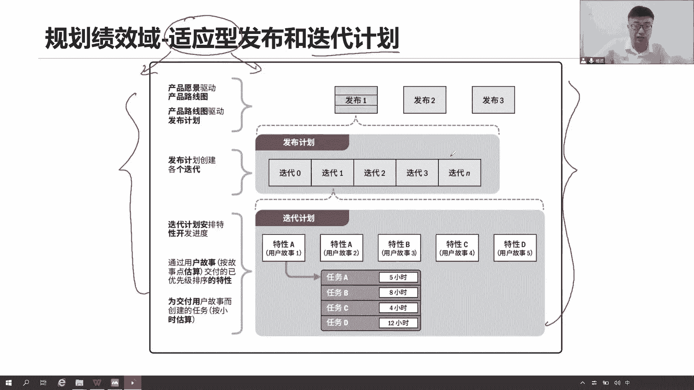

# 全新录制PMP项目管理零基础一次顺利拿到PMP证书 - P19：PMP精讲规划绩效域-进度-1 - 北京东方瑞通 - BV1qN4y1h7Ja

好接下来我们来看关于规划绩效率的估算，估算对于一个项目来说是非常核心且重要的，它能够帮我们估算当前一些工作持续时间，成本以及投入的资源有哪些，我们要做一个近似的估算，那么看这个估算怎么区分呢。

首先前两个是一对，一个是确定性的估算，一个是概率的估算，确定意味着当前我们会给一个数字或者经验，比如三十六三十六个月，或者说是1万块钱，这就是一个确定的数字啊，确定，那么概率部分呢在一定区间之内啊。

我们说它会给出一个概率值，那比如说我们当前完成这个工作，在一天之内完成这个工作的概率，10%，三天之内完成的概率能达到5%，十，七天之内完成的概率可以达到80%，这个百分之几十几十是不是就是概率啊。

做一个概率的估算，绝对和相对又是一对绝对，那就是给定的数字，绝对的数字120个小时，36个月，这都是一种绝对估算，那他肯定也是一种确定性的估算，那如果是相对呢，我需要和其他估算相对比，而形成一个结果。

你看他就说计划扑克牌，这是用在敏捷，我们对需求做估算，对当前的各种需算来估算它的规模的时候，他需要和一个B相比，那比如说当前我们找一个基准点，这个基准点它是一个什么，规模为一的这么一个需求。

那么我们和其他需求和它相比，到底我们当前和这个一相比，我们值多少，我们这个规模比这个一大多少，那这就是个相对的估算，比如说我这个需求值30个点，值50个点，而你只是一个点，那是我和你相比。

我得出了当前我自己我的规模有多大啊，这是相对的估算，还有呢是基于流程的估算，那么基于工作流的估算呢，是当年我们要确定一个，完成这一系列的工作流程，我们一共花了多少时间，那这个工作流程怎么去理解。

那就这么说，当前我们说有一系列的工作队列，等着我们去完成，在这些工作队列里面，首先有些工作它是放在等待队列里面的，等着我们去完成这些活动，这些任务既然我们会把这些任务拉取过来，放到我们的开发队列里面来。

因为现在有资源可用了，我们就把它拉过来，开发完了，把它放在开发完成队列里面区域，接下来测试测试，把这些开发完成的工作又拉过来拉过来，最后完成之后又放在他们测试的完成队列里面。

我们就可以做后续的一个什么发布了，可不可以啊，当然可以啊，把这些工作全部拉过来拉过来发布这些好了，那么从当前我们做一个需求放在等待队列，一直到最后完成发布总共的时间，哎。

我们是不是可以用一个具体的一个参数，来代表啊，你可以用周期时间是可以用交付时间，可以用响应时间都可以，它代表的是当前我们所开展完一系列的工作，可以是前面这一系列动作，也可以是从开发到结束整个的工作。

也可以是从等待到最后发布，所完成的所有工作都可以，我们可以找到各种参数来衡量当前的工作效率，这是基于我们工作队列，工作流程这么一种估算啊，它不是针对具体某一个某一个完成的工作点。

而是整个这一系列工作全部完成调整，对不确定性的估算，说到不确定性我们能想到什么东西，那么我们可以针对风险来进行一个估算，后面会讲三点估算，那么这个估算完了之后，因为考虑到风险，风险。

就意味着有些风险我们可能会已经识别到了，那么一建已经识别到，是不是我们就应该多准备点时间，多准备点钱以应对这些风险，因为应对风险需要花时间，需要花钱，所以那么我们就要增加一些储备，增加这个储备。

那就是对我们当前所基于风险的估算，我们做一些调整，让我们实现能够更充裕一些，让我们的这个进度，让我们成本预算能够更加灵活，能够适合于，适用于我们多变的一些风险场景之下啊，那么拉风让我们进度计划更可食用。

更可用好看，当前既然说的估算，那就意味着我们要对我们进度和成本，做一个规划了，因为精度和成本他们都是可以估算，那么估算完了之后呢，我们就可以确定当前我们整个项目的工期，和整个项目的预算，那么现在看进度。

作为一个预测性项目来说，我们的进度怎么去规划呢，先看第一步说，将我们的范围继续分解为具体的活动范围，继续分解为具体的活动，我们范围现在已经分解到什么级别了，WBS的工作包已经分解到工作包了。

现在我们还要将这个分，将这个工作包分解为具体的活动了，你看要把这个工作包分解成活动，这个怎么理解呢，就当前这个工作包我要去实现它，要完成它，我需要经过几个活动，需要完成哪些工作才可以完成。

我们说炒的这个菜，炒一桌菜里面这里做菜，这是一个项目是吧，这个菜里面包括什么宫保鸡丁，包括什么回锅肉，还有呢西红柿炒蛋，那这个西红柿炒蛋这个菜怎么去完成呢，有哪些活动需要去做，先买菜，然后呢洗菜。

接下来切菜，然后呢炒菜，最后上菜，他说是完成了，就这一系列的活动全部做完了，我这个工作包才算是完成，所以要完成这道菜怎么做，分解成具体的活动，每个活动分别对应的人。

分别时间分配资金去完成这些活动就可以了，活动之间有没有先后顺序啊，必须有，你能不能一开始就炒菜，你的差异都没买回来，你怎么炒得先有先后顺序啊，然后呢，基于这个活动，我们要去估算需要投入多少人力。

需要花多少时间，需要用到哪些食物资源，人物资源估算一下，根据可能性为我们活动分配具体的人员和资源，那就要考虑资源的可能性了，这就说针对我们哪些资源能够用，我就把这些资源放到这个活动里面。

让他去在进行的时间开展自己的工作，接下来调整顺序，估算和资源，直到达成一致的进度计划，现在我们有了活动了，有了活动，已经把活动拿出来了，有了投入活动的资源，有了当前活动的持续时间。

有了当前活动相关的一些顺序，那我们可不可以去做一个事情，要去制定一个进度计划了，拿着前面的各种数据达成一致的数据，我们去制定一个达成一致的进度计划，这个进度计划就是我们的干特图，这个图找领导一批准好。

它就变成了我们的进度基准，我们的第二个基准也就出现了好进度基准有了，那么未来我们是不是可以按照我们的进度基准，来衡量当前我们进度上面的绩效啊，这个活动在进行的时间有没有开始，在进行的时间有没有结束。

当前这个工作包的进度，当前这个控制账户的进度绩效，以及当前整个项目的进度绩效，我都可以衡量的啊，这就是我的进度基准，那么当前我们是用文字的形式来。

12345把它描述出来，接下来我们用一种可视化的流程图来展示，要想制定出来一个预测性项目的进度计划，甘特图，首先我们首先得有个管理计划，子计划先拿出来，这个子计划告诉我们如何规划我们进度的计划，如何做。

这个钢铁组要做哪些工作，包括定义活动排列顺序，估算时间，制定计划，怎么去做这后续的一系列活动，给我一个行动指南，然后按照这个行动指南，一步一步的去完成这后续的活动，那那么接下来我们从定义活动先分解。

把WBS最底层的工作包再分解成更小的活动，基于活动一排列顺序，二估算时间，但是大家要注意一个点，这两个活动首先他们是不相互冲突的，我们可以并行开展，没问题吧，一个是排列顺序，一个是估算时间。

可以并行开展，但是有一点要注意哦，估算活动时间，你要想想是不是他前面应该还有一个活动，更重要一点，哪个活动估算活动的资源，一个人需要十天完成，如果给你十个人，你有没有可能两天或者甚至是一天就完成。

都有可能资源的数量不一样，我们的时间估算是完全不一样的哦，所以前提我们是应该先拿到，当前这个活动的资源投入情况，然后呢才能够去准确的估算当前活动持续时间，包括这个资源，如果说是一个高级工程师。

还是说是一个实习生，他对我的时间也有影响，所以我们既要考虑资源的数量，还要考虑资源的类型，以便于我们去更好的估算，或者活动持续时间是一天是两天还是一周，那现在有了资源，有了活动，有了顺序，有了持续时间。

我就可以做一个事情，制定进度计划，把这个甘特图片画出来，怎么画，你可以带入到我的软件里面去花，把这些数据带入进去就可以了，你也可以通过自己的方法，通过我们后面讲的关键路径，资源优化。

进度压缩这些各种方法去制定你的进度计划，然后找领导一批准了，他同意，标志着我们当前项目的第二大基准，进度基准也就有了好，接下来我们一个一个来看每一个活动，他们都应该在做什么事情，以及这些计划。

这些文件还有哪些，它的内容是什么。

好一个来看第一个进度管理计划，如何把这个词圈出来，告诉你如何去规划你们进度，只是说这个事情怎么去做，但具体这个计划，这个计划里面有没有说我们的工期是多少天，有没有说具体的活动需要花多少时间。

和我们前面讲的范围管理计划一个道理啊，那么看当前这个进度管理计划有哪些内容，准不准确，估算的准不准确啊，什么情况才叫做准确，它的偏离度有多大，你们可以再做个说明这个时间啊，估算的单位是以天为单位。

还是以小时为单位，还是以秒为单位，说清楚怎么去测量，怎么去评估，怎么去计算当前这个活动的时间，报告格式，进度要形成一个报告，形成进度报告向领导做汇报，那么这个进度报告有哪些内容呢。

这个进度报告汇报的频率是多少呢，可以写一写描述描述组织程序的链接，它链接在哪里呀，当前我们要去制定进度计划，是不是，首先我们得先把WBS这个范围基准找到，也就意味着我得先连接到我们的WBS。

最底层的工作包，基于工作包再做分解成活动，基于活动来估算时间，然后我们再用具体的方法，以形成我们当前整个项目的工期，所以你应该链接到的是我的范围基准里面的，WBS里面的工作包，以及它对应的WB是磁铁。

好八部迭代上，那说到迭代这个词，那就是敏捷了，是那如果这是个混合项目的话，我后来还要规划一下，如果哪些地方用到了敏捷，我们敏捷有敏捷的进度计划好，有敏捷的发布计划，迭代计划，这个后面我们待会讲。

控制临界值在什么样的一个范围区间之内，我们可以接受这个范围是当前我们进度的范围，比如说正七天意味着提前七天或者延后七天，我都可以接受，就我这个项目工期要么提前七天，要么是延后七天之内我都可以接受。

但是如果你超出了七天，我就接受不了了，这就是临界值，这个七天临界值可接受可不可接受的范围，最大的功能时间，那说到进度，我们可不可以联想到成本可不可以啊，超支1万块钱或者节约1万块钱，最大容忍程度可接受。

如果你差的太多，2万10万不可接受，那这个时候你不可接受意味着什么，你要想尽一切办法压缩你的工期，节约你的成本，尽可能不要去什么延期或者是超支，按照进度计划，按照我们的这个成本相关的一些项目。

成本来完成工作就可以了，那这才是我们当年要开展，进度和成本相关的工作前提。

我们先拿出我们这个管理计划，告诉我们如何去管理我们后续的进度工作，那么有的计划首先我们要定义活动，定义活动就是拿出活动，怎么拿出活动分解啊，那你看这个说WBS词典以及活动清单，可以依次同时的编制。

啥意思，就是我们在制定我们WBS最简的工作方，同时我们马上开始制定我们的活动，定义活动，把这些活动写在活动清单里面去，就一步到位，就大家一次性把它分解到最小的活动里面去，就可以了。

然后把活动记录在我的活动清单里面，那就可以了，那既然说是分解，分解意味着什么，它遵循的原则原则是一样的，只是上行下的分解有没有问题是吧，至上而下，针对工作包，我继续分解成一系列的活动，还有呢全员参与嘛。

我们的团队怎么大家一起来参与啊，这个我们的工作谁最熟悉，这个工作包谁来分解，这样的话我们可执行的准确性才会更高，我们可行性才会更高，还有呢既然说全额分解，那你分解的工作，你分解的活动我们可看不懂哦。

你把它写在活动清单可以，但这个清单你们看不懂怎么办，是不是又写了一个什么词典，而这个时候不叫词典了，我们这个时候另取一个名字叫做活动属性，对我的活动清单做一个解释和说明，说这个活动啥意思。

这个活动需要投入多少资源，需要花多少时间，它的质量要求什么，他的前一个活动是什么，后一个活动是什么，这个活动需要花多少成本来完成，它是不是还是一样滚动式规划的，现在我们在定义进度，我哪里有什么质量啊。

哪里有哪里有什么成本啊，没有啊，我就滚动式规划，等我们到了这个层面，我们再把它写进去，一样道理吧，滚动式规划全员分解，一样的百分之百的原则，从上往下分解，能够自下往上汇总到一起。

每一个活动要不要定义一个责任人，必须得定谁来负责这个活动啊，说清楚啊。

这是我们定义活动，你看这个例子，活动记录在活动清单里面去，记住这些输出啊，文件要记住活动清单，然后呢用活动属性对这个清单，我们要做一个描述，做描述，说这个活动是什么意思，需要花多少时间。

需要投入多少资源，需要花多少钱，他的前一个活动，他后一个活动是什么，各位也多多做些说明，让别人能够看得懂这个活动是啥意思，接下来里程碑，里程碑大家应该很熟悉吧，在工作当中我们经常会定一些里程碑。

这个里程碑是个状态而已，它并不是一个具体的活动，说当前我们完成这个启动这个状态，完成这个状态，这就是里程碑啊，它是一个持续时间为零的，这么一个什么关键事件，在这里面持续时间为零，它不是一个具体活动。

它就是一个节点，一个状态。

一个事件看这个例子能看懂吗，启动收集需求完成，开始详细设计，完成编码，开始验收，怎么开始什么完成什么，就是一个里程碑，在这里说好的时间节点，那他就是活动时间有顺序，那么有这么几种顺序，大家要看看。

第一个完成到开始，F finish s start，完成了，开始完成上一个活动，开始下一个活动，这个好理解吧，我们说这个完成打打地基，你才可以开始盖楼，就上一个活动，你必须得先完成。

我才可以开始后面这个活动，你要想在这个电脑上面装软件，你先把这个操作系统装好，先完成操作系统中安装，才可以在这个电脑上面去装其他的应用软件，没问题吧，这个好理解，开始开始呢。

start start开始开始说开始上一个活动，开始A活动，我的B活动就跟着开始了，老实说开始上课，同学们就开始听课了，那么同样的有完成啊，对是有完成完成了完成老师说下课了，今天同学们就结束听课了。

就这意思是不是可以看到你是一个创新的，而这两个呢并且开始工作同步开始，第四个开始到完成，开始上一个活动，下一个活动完成了，怎么理解，那这种活动啊，就是逻辑很难去理解的，所以很多时候我们不推荐用这种方式。

这种方式能够给我们项目带来很大的风险，我们尽可能用的是完成开始，或者说B型两个那都可以啊，这是我们常用的这几种排队或者顺序方法，那么再看下面这两个，一个呢是嗯提前开始，一个呢是之后开始。

就是提前量和这个之后量怎么理解啊，我们说当前完成上一个活动，完成上一个活动，我们要提前两天开始下一个活动，就这意思，但是这个图吧应该减二嘛，减二就是提前在前一个活动完成之前两天。

我这个活动后一个活动就开始了，我提前两天开哦，提前两周他就说是周，那就是提前两周开始完成上一个活动之，前两周我们就开始下一个活动提前开始，所以他们之间有一段时间的并行，并行来开展工作。

那么加号呢就往后延断网胃炎，我在开始上一个活动之后呢，我等一个四五天我才能开始下一个活动，那等时间吧，等了四五天，当我这个利息当当我这个地沥青铺好之后，我要等了七天，等路面干了，我才开始画路线。

换斑马线对吧，这是等15天减号，提前加号，等待，活动时间除了逻辑关系之外，还有依赖关系，那还有哪四个依赖关系，第一个强制性的依赖关系，我们必须是完成到开始这个状态，完成上一个活动才可以开始下降。

这是强制性的，这是法律法规要求的，这是行业要求，这是正常逻辑，你不能乱改，你改了就不符合逻辑了，就完不成这个工作，所以我们必须是什么完成了开始的状态，然后呢，那既然说有强制性的。

就意味着还有他对立的选择性的，我们可以各位啊串行可行，就这意思，我们根据最佳实践，根据我的经验，有些工作我们可以并行开始，没必要得到上一个结束，我们下一步才开始，不需要我们并行开始，同步开始，可以的。

甚至我们一开始之后，我等了几天再开始也行，至少我们在一定程度上是在并行好，这是一种选择性的依赖关系，外部依赖呢基于当前这个工作，我依赖于外部的人员来帮助完成，比如说我们和供应商之间的关系。

我们依赖于供应商给我们交付的成果，然后再集成到一起交付给我们客户，这是外部依赖供应商的工作，不是我的工作，但是我又依赖于你的成果，哎这个时候我们叫做外汇来，包括中午我们点外卖也是一样，中午点外卖。

你依赖于谁，外卖小哥他能给你送过来，那你就可以吃，他不给你送，那就吃不了，你依赖于他什么时候给你送过来，这就是外部依赖关系，那反过来内部依赖我们组织内部可控的，我们自己内部去协调，去控制，去开展工作。

内部依赖关系好，这一次我们说了四种活动的依赖关系，在这里面强制性必须是创新工作选择性，我们可以用并行外部依赖，依赖于外部的供应商，内部依赖我们自己可控，那么看这个图经过我们当前的前提前量之后。

量把我们的逻辑关系依赖关系，我们要把这个图画出来，说当前这个项目从开始到结束，要经历这么一系列的活动，活动和活动之间，A和B之间是不是完成了，开始完成A开始，我的B没问题吧，没问题，而B和C之间。

B和C你看开始B是不是C也就能开始S嘛，那么同学们注意哦，这个C他真的能开始吗，想一想B和C之间开始开始，那当B开始的时候，我C可以开始吗，是不是还要等一个活动完成了，H等这个H完成。

我这个C才可以开始啊，所以这个C是两个活动影响，一个是B开始，一个是H结束，那么这个时候还可以开始，那你H和I之间什么关系，你们也是开始的开始，但是呢你要注意哦，这里有加号啥意思，我开始A之后。

等十天我才可以开始我的I，这意思，我让你中途等了十天才可以开始你的活动，I包括这个F和G也是这样的，我这个F活动结束，那么我这个G等四五天才可以开始，那这就是五加加数，减号呢就提前开始加号呢。

之后开始往后延一延，但是大家只有往后延，有些工作往后延，你要思考的道理，他会不会是我们的一个什么重要的关键路径，在这上面，因为他们有可能会导致我们的工期，发生一些变化。

但是我们能看到好，接下来我们看看关于这个活动的，持续时间的估算，估算有这么四种方法，第一个我们先来确定一下类比估算，类比意味着两个项目来进行比较，那这两个项目如果要进行比较，所以它有一个前提。

这两个项目的本质上相似啊，才可以做到类比，我拿着历史项目的一些信息，和我当前这个项目来进行比较，可以由专家一起来做判断，比如说我们两个项目差不多，你以前用了三个月，我这个项目也差不多，刚好三个月。

你这个活动之前用了五天，我这个活动类似也是五天，就这么直接的整体的进行比较，我也没有做过充分的统计分析加工处理，不需要就直接比较就可以了，因为两个项目，两个活动，两个工作它本质上是类似的。

所以我们才用类比估算，那这种估算它的好处是什么，快，耗时少，成本低很快，但是这么快又有它的一个缺陷，准确性比较低啊，我们直接就比较要知道项目是具有独特性的，我们也不清楚当前这个活动是否具有些不确定。

在这里面直接拿来比较，他用三个月，我就用三个月，也有可能，但不一定，所以它的准确性比较低，所以它也叫做粗略量级估算，够粗略的啊，够粗略的，那既然说这么粗略的这么不准，那为什么还要用它呢，因为在项目早期。

我们没有这么多详细的信息，我们只能通过类比估算，和之前的项目来进行比较，注意啊，我们章项目章程里面会有一系列信息，项目章程里面会有一些高层级的信息，哎高层级的信息，那么这些高层级的信息怎么来的。

说这个项目大概三个月，这个项目预算差不多300万，这个差不多大概什么叫差不多呢，那就是高层啊，那个高层级的信息怎么来的呢，早期我们就类比直接比较，不然这个心怎么来，我们怎么去收集数据啊。

对他就是类比估算，用在项目早期阶段还是比较实用的，够宽够够快，然后呢能够帮助我们快速的梳理出来，当前这个项目它大概的工期是多少，甚至说这个项目大概的预算是多少，用类比，到了后面我们随着项目的渐进明细性。

我们会逐渐的做一些分解，那么基于这些WBS的分解，我们来做进一步的估算，那第二个参数估算参数还是用的历史数据，只不过咱这个历史数据不是整体比较，我有一个步骤，这个步骤叫什么计算，我要算一算怎么算。

把你的这些数据带入到某种表格模型公司等等，我要做一系列一些计算处理，加工统计，你得出我们当前的活动持续时间来，我们举个例子来说，我们这个从我家到我们公司路上，比如说40km好。

打开百度地图一查40km可以吧，没问题，因为我们是开车上班，打开我们看我们这个汽车的码表，里程表里面说我们的平均速度，平均速度差不多是每小时80km，开的比较快，走高速公路每小时80km好了。

那这个时候我们能不能算出，当前我们从我家到我公司的时间大概需要多久，能算出来吗，这是我们的总的路程，这是我们的速度，我们可不可以求出来我们的时间啊，是不是两个一除就可以了是吧，我们两个一除。

因为当前走的这个路程除以我们的速度，那就是时间来，我们可以算得出来，那这种算出来时间就是我们的参数库存，那这个准不准准不准，取决于当前你这个模型，你这个公式可不可靠，成不成熟。

你说这个速度乘以时间等于路程，这个公式是什么参数啊，大家都这么用是吧，记不住，只是小学还是中学学的，反正我们一直在这么用，那很可靠啊，没问题，你的这个数据可不可靠，你这个40km。

你这个八每小时80km可不可靠，你说百度地图还可以吧是吧，我这个汽车的里程码也还可以啊，相对比较准确，那我们算出来的值相对来说就比较准确啊，这是什么参数估算，接下来自下而上的估算，这个支架上的估算。

是当前我们在这个估算的时候缺乏一些可信度，就是这两天我们不管是类比的参数的，还是什么商店的，发现我们估算出来不太可信，这个数据不各种，那于是乎我们就会用自下而上的估算，那说这个自下而上的估算。

那么前提就一个自上而下的分解，那看到它我们能想到什么，前面专门讲这个东西叫做工作分解结构，工作分解结构是不是自上而下的分解原则是吧，把它分解成够细，进一步的分解分解分解，那么现在我要自下而上估算。

就意味着我要把下面所有的工作都估算完，再汇总到上面，再汇总到上面，而得到整个时间可以啊，活动也是一样的，下面的活动估算完了，然后汇总到这个工作包，工作包汇总到公司账户，控制账户，汇总到整个项目。

那你说这个准不准，这明显就很准很多了对吧，但是呢它有个缺点，这个耗时很长啊，这个成本很高啊，你要进一步的分解，尤其是有些活动你估算不准，你还得把它进一步的分解成更小更小的波动。

把这些下面的活动时间时间估算完了，你才能够自下往上的汇总，自上往下汇总汇总到一起啊，汇总当前这个活动活动汇总的工作不工作，报告账户账户到成本到整个项目，那就这样吧，它很慢，但是它有个好处，够准。

非常的准确，这是最准确的，在这四个估算方法里面已经是最准确的，好接着看我们三点估算，三点估算是由三个基础值，我们来做一个统计和分析的，哪三个基础值呢，第一个呢是最可能的时间，最可能多长时间。

第二个呢是我们的最乐观的时间，以及还有一个是最悲观的时间，这个最乐观最悲观，最可能我们举个例子来说还是一样的，从我家，从某家到公司过去七天，有一天特别堵车，非常的堵车啊，一路上都堵，用了两个小时。

到公司有一天特别的顺畅，非常的顺畅，一路红绿灯用了半个小时就到公司了，大多数情况下我们用了一个小时到达公司好了，这是不是就是三个基础值，就有了一个是最悲观的一个最乐观的一个呢，最可能的大多数情况下。

那么用这三个基础值，我们一样的带入到我们的三角公式，三角分布和我们变态分布里面，两个公式，哪两个公司呢，第一个三角分布，他是说把你这个最大的就是最悲观，加上最小的这个值。

最乐观的值加上最可能这个值除以三求平均，这是三角分布，那么贝塔分布呢，最悲观这个值加上四倍最可能的值，加上一个最乐观的值，我们除以六，对于我们这个最可能的只加了一个四倍的权重。

那很明显我们能看出来你这两个公式啊，贝塔分布它更贴近于我们的真实值，所以很多时候我们默认为我们beta分布，来做一个计算发统计，那既然是最可能最可能你算的是个可能值，也就是个概率值，既然是一个概率。

只是一个概率统计，是不是就在考虑到一个点风险，因为概率嘛就存在什么不确定，不确定性意味着是个风险，所以这四个估算方法里面只有你三点估算，唯一的考虑了我们的风险，在我们开展各项工作和活动当中。

你说这个工作在一天之内完成的概率10%，三天之内完成的概率30%，五天之内完成的概率70%，这是不是一个概率值，这就是个概率统计，这个概率意味着风险，那就是风险，因为它任何一个事情都符合正态分布。

这个正态分布意味着，当前有些工作他完成是具有一定概率性的，你的时间越长，你完成的概率就越高，对吧，又完成了，所以他考虑了我们的风险，基于这个风险的影响，我们来估算它当前的一个活动持续时间好。

这就是我说的四种估算方法在这里面，然后我们一总一总结就知道了，类比整体比较够粗略，早期我们使用它参数估算相对来说比较准，它的准源自于第一个我们的历史数据比较准，第二个是我们的一些工具模型方法，哎。

这些表格是比较可靠的，所以相对比较准，第三个自下而上，它是最准确的最准确的，因为我们要做汇总，我们是要把先分解自上而下的分解，然后呢在自向上的汇总了一些，基于我们W和BS这个框架来进行估算的。

避免我们工作有遗漏啊，他也可以避免工作有利，因为WB4里面是各项工作，但是考虑到避免有些活动出现了遗漏，而我们三点估算呢，考虑风险，基于我们的风险来考虑当前完成工作，完成工作的时间。

这个概率能达到多少，好我们来看接下来在估算活动持续时间的时候，我们还要考虑解除了这四种估算，我们还要做一个分析储备，那这个储备储备其实就是字面意思，我要多准备一点时间，多留一点缓冲时间。

因为我在整个估算的过程当中确实可能有风险，我们基于三点估算是在考虑风险，但是还要记住，有些风险我们是不是要应对这个风险，那叫应对风险，得需要花额外的时间啊，你三点估算只是把这个风险因素卡进去了。

但是你并没有说当前还要额外预留多少时间，你只算是个平均时间，所以我们马上就要用到储备分析，针对这些风险，我们要预留要储备一些更多的时间，以便于我们有一些缓冲，让我们的进度计划够灵活不灵活。

那么为了应对这些不确定性，首先我们看储备分两种储备，第一个应急储备，他怎么说呢，这个应急储备是说用来应对已经接受的，并且是已经识别到的风险，简称已知未知风险，第一个已知已识别，第二个位置呢。

我们没办法主动去管理，我们不知道它的影响是什么，但是反正我们能够接受他，接受这个风险发生，让你发生，我们能够接受你，但是提前是我们已经识别了这个风险，那既然说已经识别到这个风险，并且允许它发生好了。

我们就要硬，就要想想当它发生的时候，是不是要花一些更多时间去处理这个问题啊，那要处理这个问题就要花时间，我们要多准备点时间，那这个准多准备时间，就是应急储备一样的道理啊，从我家到我公司。

我们早上九点钟打考勤是吧，就那种考勤意味着我们路上，比如说我们路上平均算下来是一个小时，那就意味着我最晚最晚八点钟必须得出门，路程一个小时后到达，大多数情况都是几个小时嘛，通过三点估算算出来平均时间好。

但是我识别了一个风险什么呢，在路上这个高速公路的收费站，他经常会堵10分钟，这是个风险，经常性的会堵，它不仅一定会堵，他只是有可能，而且这个概率很高，经常会堵10分钟，那我是不是应该想想。

我就应该提前10分钟出门了，7。50必须出门，万一这个路上堵车了怎么办，你这个堵车堵车你只能接受啊，你那不接受堵车吗，那你怎么改变，你改变不了，你只能接受，而且这个堵车是已经识别到了，有这个风险。

所以我们要提前准备，多准备10分钟，我提前10分钟出门，7。50出门，这个10分钟就是我的应急，我的应急储备好，那第二种储备，管理储备，他怎么说呢，管理储备是用来应对范围当中不可预见的工作，不可预见。

这是一个未知的风险，我也不知道会有这样的风险发生，我根本就没有十个到会有这种情况，它是一个1万，它是一个突发，它是一个不可抗，它是一个不可预见的因素，在这里面我没办法控制，一样的。

只能等它发生发生就发生，我接受，但是这个事情我提前并没有识别到，我在想现在我7。50出门可以，那我在想，是不是有可能反而万一有一些什么突发情况，导致公路上又堵车了，于是乎我再提前10分钟出门。

这个10分钟我也不知道会有什么风险，但是我提前准备着，他就是我的管理储备，于是乎我7。40赶紧出门，这时就出门好，这是两个储备，那么对于应急储备来说，他说包括在我们的进度基准里面，先说这个基准。

它是在我们基准之内的一段时间，而我们管理出门呢，他说了不包括在我们的基准之中，属于我们基准之外的一个事件，这个怎么理解啊，我们要知道基准基准意味着什么，当我们的领导对我们当前的这个标准，做了审批之后。

它就变成一个基准了，也就意味着这是我们项目的一个考核标准，一个绩效衡量标准，在这里面一个最低的一个什么最低的标准好，那这样说它会形成一个基准，意味着未来会用来卡过我们进一步的一个绩效，我们举个例子啊。

再说让大家更深刻的理解一点，从我们家到我们公司，九点钟打考勤，路上一个小时，九点钟打考勤，第一天我上班迟到了09：10分才到公司，领导说我迟到了啊，他问我为什么知道，我说这个高速公路上堵了10分钟。

领导说你不知道要赌十赌10分钟吗，我说我知道我知道他经常会堵10分钟，你知道你还要知道，那这次肯定算就知道了，你应该什么，7。50就赶紧出门，而不是八点，既然你都已经识别了这个风险，你还不提前出门。

我肯定要算你的绩效，我肯定要算你的，迟到没问题吧，好第二天我09：30到达公司，领导就说你又迟到了，没吃的，什么原因呢，我说这个高速公路上突然发生那个警匪大战，不可预见，我怎么知道会有这种情况下。

高速公路突然来了个十连，换成追尾，高速公路突然有一个陨石砸下来了，砸了个大坑，这些全都是不可预料的事情，我不知道啊，所以我们花了更多的时间才能到达公司哦，领导说，那你放心，这种事情突发情况。

那就不算你是狼啊，跟人事部说一声就可以了，不算我知道，那就肯定不会纳入到基准里面考核我的绩效啊，就这意思，有些事情他不可预见，不可抗未知的风险，我们不能够用来考核绩效，这对我们不公平。

所以我们就不把它放在计算里面，但是如果你都已经明明知道有这个风险，你还不去多花点时间去应对它，你还不多准备点时间，多留点缓冲时间的话，如果出了问题，算你的绩效，就算你技巧就这意思好。

所以我们说在估算活动时间的时候，要考虑风险，多准备一点时间，这个时间分为当前已识别的风险，我们叫做应急储备，如果是针对未识别的风险，我们把它叫做管理储备，这些预测实验其实大家想一扩展。

你说我这个时间要做储备分析，要么系统，同学们，未来我们在讲估算活动成本的时候，你觉得要不要考虑储备分析，是不是同样的道理啊，多花点多准备点钱来应对我们当前的已知风险，多准备点钱来应对这些不可抗的因素。

管理储备应急储备，钱和时间都得去做估算，因为毕竟这两个东西是可以量化，可以量化，我们就可以做计算，做估算好。

接下来看关键路径法，当前我们要做什么事情呢，已经有了活动，定义了一系列的活动，我们把这些活动放在活动清单，然后呢用活动属性做一个解释和说明，活动已经有了，以及当时我们去排列了各种活动的顺序，哪些先开始。

哪些后开始我们的进度网络图也已经有了，这个图画出来了，而且呢每一个活动啊，它的持续时间我们也把它估算出来了，并且考虑了储备每一个活动的持续时间，把每一个活动我们都已经把时间都估算出来了。

那么接下来我们要做一个事情，就是要去做这个进度计划，要把当前所用的这个时间顺序与活动，我们要开始做一个事情，定我们的进度计划，这个进度计划意味着我们要做我们的干特图了，先要把这个甘特图给画出来。

那么要画这个甘特图，还是按部就班一步步做，怎么做呢，我们先在理想情况下，找我们这个项目的最短工期，最少需要多少时间，那么结合到前面，我们说画出这个图，以及我们把这个时间都给他标上去，活动的持续时间好。

以当前这个图为例，这个项目很简单，就这么四个活动，可以这四个活动的顺序也有了，活动的持续时间都有了，我们就要去算关键路径，找这个关键路径，那么首先得知道什么是关键路径，他说关键路径是项目当中时间最长的。

那条活动顺序，它代表着最可能的，它代表着什么，可能的项目最短工期一个最长一个最短，怎么去理解，先把活动整个工作了，工序找完，当前这个图表上面，我们说这个项目它有几条工序呀，两条是吧。

两个工序一个是我们的ABD啊，一个是我们的ACD，这两条工序，你得把这个ABD这上面的工作做完，以及ACD这上面工作做完，那你这个项目才算是完成好两条工序，他说关键路径是我们最长的那条工序。

ABD一共持续多久，5+5加15，多少25天，ACD呢510加十五三十天，那么最长就是你吧，30天，他说这个30天代表着什么项目最短的工期，这个最短啥意思啊，我就问大家，第25天末，这个项目有没有做完。

咋下，第25天末，这个项目有没有做完，是不是还没有，我这个地正常讲中文的，因为我这个D要等B和C全部做完，我才可以开始玩，D也就意味着我这个地从第15天才能够开始，然后我自己还要持续15天。

这不到30天吗，所以第25天末，我们这个项目还没有做完，只是说你上面这个工序完成了ABD，你这个工序可以完成，但是我下面这个工序还没做完呢，所以项目没完，那么也就意味着是不是到第30天。

我这个项目才算是正式完成，第30天好了，那么这个30天我们可以这么说，我这个项目至少，需要30天才可以完成的工作，这个至少就是最短，找这个工序最长的路径，30是最长。

他至少也需要30天才可以完成这个项目，这是一个最短工期，就这么去理解关键路径，所以找出来吗，关键路径是不是就是下面那个路径啊，ACD你就是我这个施工序最长，是代表了我们的最短工期。

所以我们工期算出来30天啊，这个30天大家注意一下，是在考这个理想情况下，因为他根本就没有考虑到任何资源的限制，我们估算活动时间考虑的资源，说当前投入多少资源，投入什么类型的资源来估算。

在当前这一个活动的时间，只是估算这一个活动时间，但是我们把它拉到一起，我们并没有考虑，是不是这个活动B和这个活动C是同一个资源，同一个时间，没有说法，没有考虑这个点啊，我们只是想理想情况下。

张三你投了个币需要五天，张三你投的这个C需要十天，什么时候投入，是不是同时投入，不知道啊，不确定啊，张三一有没有这么多精力来做这么多的事情，不确定啊，没有考虑到资源的竞争，资源的约束。

资源的过载都没有考虑，只是理想的情况下，我们工期30天，所以这是可能的，有可能不是上面，因为我们的制约会形成一些制约，万一这个张三他不可用怎么办，他被调走了怎么办，他请假了怎么办。

不知道资源没有考虑到那个资源的情况，有没有说相互冲突，相互影响，所以我只是考虑什么最可能的时间在这里面，最可在进度计划的优化，或者说是项目实施过程中，关键路径可能发生变化，关键路径会变吗。

下面是我们做30天，当前的关键路径，ACD工期最短30天，如果这个活动毕业的同学告诉你说领导，我这个五天搞不定啊，五天搞定，我需要十天搞定，那就意味着现在ABD是不是也是关键路径的。

因为它加起来刚好也是30天，你看我关键路径变成两条了，意味着当前所有的活动都是关键活动了，你们都不能够延期，你们任何一个延期，我这个工期就受到影响好了，到第十天，我这个币还没有做完。

他说领导我这个时间搞不定，我还需要额外的五天，我一共需要15天才能搞定，那就意味着这个工期，现在变成35天才能够完成对吧，ABD嘛，他一共加起来是35天了，那你说现在的关键路径是谁呀。

很明显你就是关键动作，你已经变成新的关键，中间我们之前这个就不是关键动作，因为项目最少最少至少至少需要35天，你是最长的，关键路径会发生变化，就是随着项目的实施过程当中啊，有些活动他不一定就是。

按照你当初所规划出来的五天完成，会有各种情况，突发意外的发生，或者做出其他一些情况，那这个时候我们就要多花些时间，多花时间，关键路径会受到影响，关键路径的总浮动时间通常为零，这个总浮动时间是啥意思呢。

先对它做一个概念性的解读，就是当前某些活动啊，它可以往后延，而不影响我整个项目的工期，可以往后延一延，不要着急这么快去做，你可以等一段时间再去做这个事情，而你等了这段时间，它并不影响我们整个项目工期。

这就是总浮动时间，每一个活动他都有总浮动时间，只不过看这个值到底是多少，首先我们来看这个关键路径，上面三个活动ACD，大家看他们的总浮动时间是多少，AC都是零，是不是零代表啥意思，你不能够浮动啊。

你怎么能浮动，你这一浮动你会影响工期啊，我们说了总浮动时间的定义是什么，这个活动它可以往后延，而不影响我怎么向我们的工期，那ACD你们能够淹吗，你这样不就影响我直接的工期了吗，不行那再来看这个活动B呢。

他说他的活动时间是五天，怎么算出来的，你总共加起来是25天，这个ABD这个活动工序，然后呢，我们的工期30天，那就意味着你这个活动币可以往后挪动，补贴而不影响我整个工期，你本身是五天完成，意味着什么。

当这个A1活动做完之后，你可以玩五天再开始做你的活动币，有没有问题啊，没问题啊，你具有灵活性，你可以往后挪一挪，不要着急，一开马上就和这个C同时开始，你可以等个五天在开始做。

你这个活动币也不影响我整个项目的工期，但前提是要保证你后面一定要按照五天完成，后面这个D也不能延期，哎我这个工期刚好30天完成，这就说明这个活动币它具有浮动时间，它具有灵活性，可以吧，没问题。

而你这个ACD呢，你没办法，你以为你是关键路径，关键路径啊，它的总时间，通常市民我不是说一定要是，通常假如说这个合同，我们说这个合同他告诉我们，要求我们35天完成，但是经过一估算。

其实我们30天就可以搞定这个事情好了，意味着，当前我这个ACD，是不是都有五天的活动时间啊，可以吧，都有五天，但这个都有不是意味着你可以玩五天之后，我再来玩五天，然后你弟又来玩五天错了。

这个五天是你们共用的，假如说这个活动A他本来持续时间是五天，结果他用了十天好了，请问C和D你们还有浮动时间吗，马上就变成了你们没有，你们都没有，因为这个把这个服装给用完了，工期要求就是35天是吧。

你用了十天，你用十天，你用15天，那不刚好35天，所以这个武田是你们共用的，这是总服装事件，通常是你，但不能说绝对，那如果说非关键路径呢，那肯定必然有浮动时间啊，因为你们是非关键路径上的活动。

ABDABD你是一个非关键路径，你只需要用25天，但是因为你这个A和这个D本身是关键路径，所以你只有B具有浮动时间，它可以玩补贴，关键路径可以多条关键路径越多，风险越大，越难管理，刚刚说了嘛。

这个活动B如果他也是十天的话，那好我们就两条关键路径，关键路径越多就意味着什么，这些各项活动我都要重点去管理，管理的活动会越来越多，因为他们不能延期，他们一旦延期，对我项目会产生影响。

延期的影响风险很大，让我很难以管理，以前就一条路径还好，现在路径越来越多，越来越多，那么管理这个各项工作就得严格把控了，所以管理难度会变得很大，好这是关键路径，大家可明白，在这个关键路径法里面。

我们就去找关键路径，找关键路径的目的是为了去找工期，而且也是为了确定当前我们这个路径，我们这个进度计划它是不是具有灵活性，有没有一些具有浮动时间的活动啊，来找这种灵活性的好，继续往下。

既然说这个关键路径，你没有考虑到资源相关的一些制约，竞争冲突，是不是有的人同时既要做B又要既要做C。

忙得过来，不，于是我们就要对这个资源做一个优化了，怎么优化呢，两个办法，一平衡，二平滑诶，一字之差，但是呢它的概念是完全不一样的，首先我们看这个资源的平衡怎么去优化它。

我们先看图说话，大家看这个图，在资源平衡之前啊，我们的活动是这样的，AB两个活动做完之后开始做C活动，A需要两个人，每个人工作八小时，活动B第一天修还要继续工作八个小时，做完之后。

第二天活动C汤姆你继续做了八个小时，那么这个活动我们说工期两天啊，而且那么这条工序上面时间是两天，但是你有没有发现个问题啊，就这两天下来，这个修这个，工作时间都下，大家思考一个问题。

就是如果是你呀一天工作量达到16个小时，你是什么感受，第一天我们的工作量就能够达到16个小时，这是什么样的体会呀，那如果说后面可能还会有呢，又是16个小时，又是16个小时，你又是什么感受，累不累。

是不是很累，那这就是资源的问题，我们要去平衡，我们要解决这个资源过载的问题，压力太大了，加班这是必然的，一般来说我们不推崇这个加班，大家知道在整个PMI项目管理协会里面。

我们在整本书里面一般不推崇这种加班，为什么，因为大家知道加班对于我的团队来说，怎么去管，我们前面所学习过团队的绩效是很重要的，整个团队的氛围是很重要的，如果你让你的团队天天这么去玩。

大家可以想象一下我们的团队氛围，士气还够好吗，大家有没有怨言，相关方的干性能的买度能够高吗，都不行，所以我们通常来说会杜绝做这个事情，杜绝理想的情况下，我是杜绝的，不推荐好了，那么既然不推荐。

意味着我们要想办法去改进啊，我们要去优化一下当前这个资源的一些工作，怎么优化呢，你看平衡之后我们怎么做，第一天A你们两个工作八小时，赶紧下班，别留下来，谁要是让我看到你们还留下来，我要抓你们谈话。

赶紧回去，第二天没做完呢，接着做吧，第二天做，反正保证每天八个小时工作时间就可以了，第三天继续做，那么意味着本来以前两天的工作，现在活生生的变成三天才完成，这就是我们资源平衡之后解决的问题。

我再去优化当前资源的一个什么工作，他的一个变化幅度变化程度，不希望你们过载，我希望你们是每天保持一个均衡的速度，来开展工作，不要去透支精力，不要去做这个事情，这个事情做不得。

影响了我们整个团队的士气和氛围不太好，所以我就做了一个平衡，有些工作你就往后挪嘛，没关系，那你这个一往后挪，如果说好这个活动，B活动C他们都在关键路径上面，你可以量下降，他们在关键路径上面有ABC。

那你的工期不就延长了吗，是不是啊，所以这种自然平衡它带来一个结果，你确实可以解决资源的竞争，资源的过程没问题。

但是你带来的影响是什么，有可能会改变关键路径，而且这个改变通常来说是，严查工期受到影响，这是频繁，那么平滑呢，他说资源在非固定的东西上面调整，防止忽高忽低，保持平衡，我们有些工作它是可以往后挪的。

如果这两项工作再举个简单例子，就这两项工作A和这个B同时开工，我这个资源同时要做A同时要做B，要么资源过载，要么我们这个资源协调不过来，我怎么可能同时做两个事情啊，一般是一个声音。

一个声音按部就班去做呀，你这样让我同时做的话，我可能效率就变低了，甚至我有可能忙不过来，我还要做其他项目工作，那你这个活动A如果你不在关键路径上，你可不可以往后挪一挪嘛，不要着急，马上就开始。

我们挪个几天，在你具有浮动时间之内，这个环境里面去有效的挪动，当然你不能一直往后挪，挪到你的总分的时间变成负数了，那肯定不行，当你的浮动时间变为零了，你也变成光线路径。

那就这个时候意味着你也要接着开始了，同步开始开始工作，所以是不是可以也可以在一定程度上优化，因为这个一定是保证我这浮动时间必须是零，就要开始工作，你不能再往后挪，你再往后挪的话就变成负数了，一负二。

那么工期就受影响了，所以我们这个资源平滑，它不改变关键路径，因为它只会在非关键路径上面进行调整，利用我们的总浮动时间，但是这个总服装时间一定要挪动到没有了，那就意味着可能我们还是得同步开始。

我们开始工作，甚至加班都有可能，所以它只会在一定程度上去优化资源，不可能完全的优化资源的使用情况，冲突竞争和扩展，这是什么资源拼划在这里面，就看你的浮动时间有多少，我们就能够优化多少。

所以这两个点啊从根本上的区别很好，区别平衡路径，关键路径，通常来说延长平滑我绝对不改变，我自始至终都不会改变你的关键路径，我只是在一定程度上优化我们资源，就这么简单。

就这么区别就可以了，那么如果说我们用了平衡关键路径延长行不行，不行啊，为什么我的结束时间和我的期望的时间，是不一样的，不符合，所以我们要把这个时间压回去压缩，怎么压来，又学习两个进度压缩的方法。

第一个快速跟进，第二个赶工，我们看这个图，看图来理解，按照原始的情况说，应该是三个人按部就班把这三个活动做完，做完之后呢，我们需要15天的时间，但是啊我们工期，我们的合同要求可能是十天之内完成。

11天之内完成，但是现在15天经过资源平滑平衡之后，我们用了15天不行，压回去怎么压，第一个快速跟进，大家看这个图有什么变化，是不是有些工作我们在部分并行呢，上一个工作还没有做完。

我下一个工作就提前了两天开始，是不是提前开始工作并行，把以前的串行改成并行的开展工作，那当然可以压缩进度，你提前开工嘛，但是你这个提前开展工作有没有想过有风险，你是还没有拿到上一个过程的结果。

输出你就开始下一个过程了，有风险，万一反攻了怎么办，你返工，那不仅影响你的风险，你的进度，你的成本都会受到影响，所以风险非常高，高风险它的直接影响风险上升了，第二种方式呢赶工。

那么大家看第二种方式又有什么区别，我们的工作顺序有没有发生变化，没有还是创新的，但是我们的人多了，我们加了资源进去，我们用我们的资源来换取时间，加人人多好办事情啊，那确实好办事情啊。

我们甚至比你的合同要求11天还早，我们十天就完成工作了多快，但是家人意味着什么，成本上去了，人力资源可是把成本的，你这个项目的独专有的成本就上去了是吧，所以说赶工他的直接影响是成本提高了。

然而我们快速跟进的创新改变行风险提高了，所以我总结赶工赶工加班加资源，这都是赶工，都是一种赶工的一种特例特例而已，我们不改变活动的逻辑关系，还是创新，我们改工改工还是创新开展工作，我们以资源来换取时间。

来压缩我们进度，加快我们的进度，用资源来换取时间加资源，就这意思，人力资源上去了，所以说我们的成本也就跟着上去了，而对于我们快速跟进来说呢，其实就是说要么是部分并行，要么是完全并行都可以。

它只不只不过是两种特例而已，这就是部分并行，我也可以什么完全并行啊，你在开始同时我也跟着开始都可以啊，我直接调整活动顺序，还有他的直接影响是风险增加了，因为我并不知道当前前一个活动结果是什么。

我们就同步开始另外一个活动，对风险会随之而增加，这是我们赶工和快速路径，那么大家思考一个问题啊，对于这个赶工和快速跟进，我们都可以去压缩进度没错，那么我们应该在什么样的地方去压缩进度啊。

你能不能够在非关键路径上面去使用的，感光和缓速冷静，你觉得有意义和有用吗，是不是一定要在关键路径上面去使用，我们的感官，好啊，什么你啊，你只有这样才能够真正意义上去压缩我的工期。

你没有必要在非关键东西这么来，大家一起来加班，任何事，我们说一个企业里面安排加班，不是说不可以，但是我们有的是怎么说呢，我们是一个部门，我们是一个团队，我们是一个整体，大家要有集体荣誉感。

所有人一起来加班，你觉得这是不是浪费资源，浪费成本，哪些人哪些工作在关键路径上面，我们才会安排下来，至于那些不在关键路径上的有浮动时间，你们认为加班有任何意义吗，有意义吗，在这里没有吧。

所以安排加班得根据情况来看，作为项目经理，我们要知道哪些工作，他需要哪些工作，这些这些岗位的人他不必要来就不用来，你这一来就有影响，这边忙得热火朝天的，另外一边正在干嘛，摸鱼的摸鱼，看视频的，看视频。

看报纸，看报纸，喝奶茶，喝奶茶，你让这些忙得要死的人看到是什么感觉，这种感觉太糟糕了是吧，影响整个团队的士气和氛围啊，所以赶工小心点用了，本来我们就不推荐这个事情啊，那对于快速跟进呢也是一个道理。

都得用在我们的关键东西上面。

你看这是个例子啊，这是个例子，当前有些工作我们提前一天开始，包括这些是不是并行，这些是不是在做并行，这里都是在做一个并行并行并行创新改变形，快速跟进。

好了，我们通过当前这个什么关键路径法，资源优化法，精度压缩法，我们终于把当前这个甘特图结合，考虑到我们的进度，考虑到资源，考虑到活动全部都考虑一下，然后得出了这个模型，这个模型就是一个肝探索。

这就是感叹，这就是马进度计划啊，那看这个甘蔗虫怎么去看它，首先把项目从什么时间开始，项目从什么时间结束，当然这个项目有哪些活动，这些嗯这些横条就是一些活动，那些工作在这里面，当前已经走到哪一步了。

我们用这个虚线来表示当前这个时间节点，截止目前哪些工作已经完成了，完成了多少，哪些完成全部完成了，哪些还剩一点，剩下的工作计划到什么时候结束，计划到什么时候结束，还有哪些工作没有开始。

他又计划什么时候开始，什么时候结束，是不是看得很清楚啊，我们整个项目的工作大体计划时间刻度都有，把这个甘特图当做是一个进度报告，往上面去汇报，跟你们说，领导我们当前的项目进展是如何，哪些工作做完了。

哪些工作还没有做，没做到什么时候开始，当前我们已经有些工作已经完成了，40%了，还剩60%没有完成，都可以汇报吗，当然可以了，而且你的肝脏植物你做完之后，不是马上就可以开始工作了。

你要知道这个甘特图是一个进度模型，这个进度模型是结合着你大量的数据，分析出来的，这个分析出来的数据要不要找领导去批准，看一看，审核审核如果没有问题好，那将会成为我们整个项目的一个，重要的考核指标。

进度的考核指标，我们把它叫做进度基准，所以说我们项目的第二个基准出来了，前面WBS上面有了范围基准，现在甘特图的基础之上有了进度基准，它包含了这个项目的开始时间，这个项目的结束时间。

以及每一个活动的开始时间和结束时间，开始时间，结束时间，未来我们就拿着这个基准来验证，你的这些工作是不是在既定的时间开始，既定的时间结束，我要考核你的进度，绩效用基准来考核好，进行计算好，第二个计算。

有了这个适应性的进度计划。

那么前面我们说了这个关键路径，这些都是预测性的方法，用预测性的方法，通过详细的一个分析得到我们的进度计划，那如果说是敏捷相关的一些工作呢，这个敏捷相关的工作，我们会在后面专门给大家讲。

当前呢我们先把它略过，先跳过，我们尽可能先按照我们预测性的方法，一步一步的把工作做完整啊，至于适应性的敏捷的，它的进度计划怎么去做这块内容，我们会在后面专门有一个章节加入，我们的敏捷项目管理。

