# 全新录制PMP项目管理零基础一次顺利拿到PMP证书 - P1：PMP精讲课创新思维 - 北京东方瑞通 - BV1qN4y1h7Ja

同学们好，欢迎同学们来到偏僻认证精讲课堂，我是本次课堂的主讲老师杨波老师，未来会由我带着大家一起来学习，我们项目管理知识体系指南第七版的核心内容，那么在讲课之前，先问问大家一个问题。

我们为什么要学习项目管理，为什么要来考取项目管理的PP认证，大家可以思考这个问题，因为我们的初心很重要，在学习一门认证，学习一门管理学科知识，我们的初心非常重要，它能够让我们持之以恒持续的学习下去。

在面对困难，在面对逆境的时候会持续的坚持下去，因为要知道学习项目管理啊，整本知识知识体系指南，它的内容非常的多，也很杂乱，还有我们在学习项目管理，为什么要开展这个工作，它到底能够给我们带来什么价值。

对于我学习这个认证又是什么原因，有的同学可能会认为说就是为了升职加薪，为了多赚钱，为了养家糊口，也有同学可能会认为我想学习一些比较先进的，与时俱进的项目管理的方法，在这里面，有的同学可能还想得更远。

我想了解未来我们这个项目经济时代，它的一个变化趋势是什么，我们未来应该掌握哪些核心的内容，来应对我们企业当下的一些市场多变的环境，以及为我们企业提高市场的竞争力，那有可能这样一些同学们。

他们是站在组织高层，站在组织战略的层面去思考的问题，那不管是什么样的目的，我们都是在进步，这一点没错吧，所以我们要思考了，当前我们当前学习项目管理的认证，他的一个初心目的是什么。

一定要保持这个初心显得很重要，那说到项目管理，在日常的工作当中，我们几乎天天都在用，他可大也可小，你说让我和一个领导开展沟通，算不算项目管理，为了思考怎么沟通，沟通的什么内容，什么时间沟通。

用什么方式沟通，最好会后沟通之后，要不要形成一个沟通纪要是吧，日常的工作开展，我们要制定就制定我们的进度计划，同学们有没有画这个图啊，它叫做我们的甘特图，可有用过，还有我们在开展工作的时候。

一直我们的部门经理们，主管们，领导们，企业高层们都希望我们开展一个工作，它叫做PDCA，可以同学们去用过，在管理我们的质量的时候，如果我们的产品出了问题，有没有用过鱼骨图，来帮助我们去分析问题的原因。

有用过吗，还有我们在开展工作，项目管理是不是得用到一些信息化的工具，数字化的工具，我们的GA有没有用过TAPD，可以用来帮助我们提高工作效率，这些项目管理的信息化的工具是否有接触，那你看是不是。

我们工作一直都在开展项目管理啊，也在用这些核心工具，那么除了这些核心工具以外，是否还有其他的内容需要我们去掌握，你说我们现在要开展这个团建，团建是这是我们做项目里面，在日常工作里面我们需要开展的事情。

这个团建能够帮助我们提高团队的绩效的，那如何提高团队绩效有什么方法吗，我们的团建难道只是出去吃喝玩乐吗，每一个人他们的期望和需求是什么，我们的企业里面有很多的一些主管领导啊，我们的经理客户。

我们的高层人员他们都会经常来找我项目经理，了解我们项目的情况，那么对于我项目经理来说，我是不是要去满足他们的需求和期望，在做项目的过程当中，要积极的调动我们这些各位主管经理，领导们以及客户们。

他的一个积极性，希望他们能够积极地参与到我的项目里面来，参与，目的是什么，要给我一个支持啊，当我缺人给我人，但我缺钱给我钱，就这么简单粗暴，希望你们支持我，鼓励我，帮助我，唯独遇到困难的时候。

能够给予我支持，帮我移除困难，那这是希望我们的各位跟项目相关的一些人员，他们能够做出一个支持的态度，那么如何让他们支持呢，我们在定计划的时候，要不要把他们纳入进来，考虑他们的需求和期望。

要知道这个项目里面，如果说把他的需求和期望，纳入到了我们的计划里面来，按照这个项目，按照这个计划来做，未来是可以符合他们的预期的，那自然他们就会大力的支持，我们，不会随便的把我的项目的资源给他调走。

很多时候我们做着做着资源被抽走了，有这种情况，那为什么被抽走，抽走之后，这个项目有没有风险，那说到这个风险，风险怎么管理，任何一个项目，不管说是我们的质量高，规格的严格的去管理，我的风险控制也得有啊。

我得优化我的风险的应对策略，这样才能够避免我们的项目过程当中，出现较大的问题，从而导致什么种子的项目，我作为项目经理，我是为企业创造价值的，我们做项目，为企业创造价值，那么谁来做，一定是我来做。

那我就显得很重要了，我是为企业创造价值了，怎么创造价值呢，我会学习一些手段，为企业创造价值的一些手段，那么这些手段怎么去创，怎么怎么去获得这个手段，通过学习认证来获得这些手段，那就显得重要了。

所以大家要注意哦，当前我们学习的PP项目管理的知识体系，这块内容做认证的讲解和学习，不仅仅是要获得这个证书，一张轻飘飘的证书，其实对我们任何人来说没有太大的意义，我们希望把这个轻飘飘的证书变得沉甸甸的。

什么叫沉甸甸呢，就是要去掌握在这个知识体系指南里面，一些核心的知识和内容，然后呢我们还要做到一个点咨询合一，把阳明心学的这些哲学思想用起来，我知道这个知识，但是如果你不在工作当中去实践。

那就等于你不知道你拿到这个认证，有什么意义呢，你说我去跳槽可以啊，那你跳槽之后，人力资源部，首先你过了这一关没问题，但是到了后面你开展工作的时候，如果你用不起来，那么你的价值看不到，也就意味着。

你有可能一直在做一个最底层的管理者，你无法竞争，我们要行动啊，把知识和实践结合到一起来，行动为我们的企业创造更大的价值，在这里面那才是最重要的，那么我们怎么去行动呢，按照我们的知识体系指南。

经过结合着我们企业的环境，企业的文化以及我项目的一些特性，我们来开展后续的工作，做一些裁剪诶，不是把所有的内容都拿过来用，要注意做一些裁剪诶，所以啊我们说学习项目管理，我们要在整个企业能去用。

那说到这个项目管理知识体系指南，大家有这个认识，我们日常工作当中已经学习了，已经储备了很多的管理的知识和经验，即便当前我没有获得这个认证，我没有学习这些指南，我依然可以把这个项目做好。

是不是同学们我们的项目依然可以进行啊，没有问题啊，那为何我们还要来到课堂上去学习这个认证呢，是因为当前我们的管理知识体系，自然能不能够适用于大多数行业，思考一下能不能够适用于大多数企业。

能不能够适用于大多数的项目，这个就有问题了，你说当前我这个项目，确实按照你的经验能够开展，那么如果说当前企业要发展，我们会拓展更多的领域，这些领域都得通过项目来做。

那么你当前这个领域的这个项目的一些经验，能够拓展到其他领域吗，能够去做一些更复杂更更庞大的项目吗，能够去跨行业去开展工作吗，那就很难了，而我们的知识体系指南它是一个通用的标准，在这里面一个通用的原则。

它能够适用于大多数的企业行业，甚至一些项目，那就意味着，我们当前学习的是一个通用的体系和框架，它能够帮助我们应对更多复杂的环境，在这里面那就很重要，适合于大多数的行业，适合于大多数的企业。

适合于大多数的项目，我们能够通过这个知识体系质量的学习，掌握一些最有最最具有实践性的，最与时俱进的一些优秀的流程方法模型，弓箭技术来管理我们更庞大的项目，来管理我们更多更复杂的项目群，项目集。

甚至说是我们做后续，我们还会开展项目组合，是为了帮助我们当前从一个底层的项目管理者，走向我们的未来的高层，那么我们企业里面有没有这样的一些高层部门，在这里面，如果有，那好他们就是我当前的目标。

如果你没有，是不是你可以提出一个意见，我们应该有，那有可能你问的就是我们企业的第一个PO，PO是什么，后面我会专门去讲啊，这是开头，我们在上课之前，首先给大家铺垫一下，当前我们学习PMP考取认证。

它的价值在哪里，把自己的眼光和格局放高一点，我们不仅仅只是一个小小的项目经理，我们要成为一个非常专业的人士，然后呢迈向更高层别，迈向更高级别，甚至到了我们的总监级别诶，甚至到我们的总经理都可以啊。

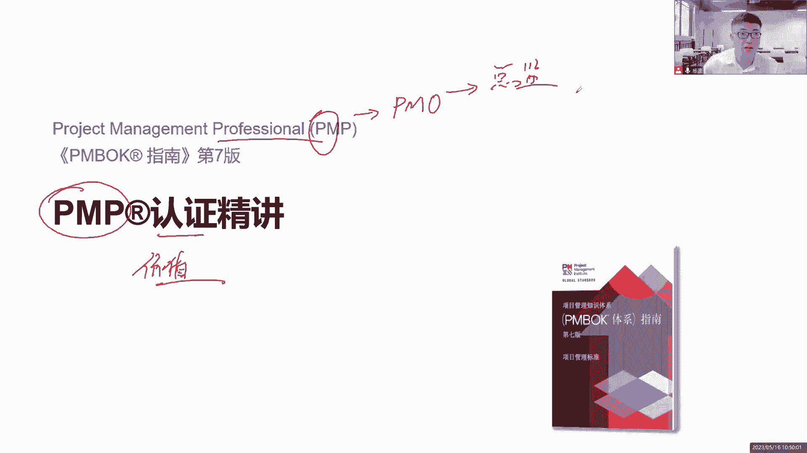

这是我们未来的发展方向，好了，这本教材里面我们怎么去学习呢，我们会按照这种方式来，首先了解，了解整个我们的一些知识体系的一个变化，这个知识体系它是如何在变化，有哪些新的内容，从以前的第六版转变到第七版。

它有哪些创新，我们要学习的这些创新思维，把这些思维，未来也会用到我们自己的工作当中去，第二想要学习这本教材，项目管理，咱是不是首先得打好基础啊，一盖一个楼也得把这个地基打牢固啊。

这就是一些地基一些基本概念术语常识内容，掌握它之后，有了基础，我们来开始团队，这些项目相关的一些人员如何去管理，要知道项目你既要管事情，也要管人，你说管事情还好说，按照流程，按照过程。

按照组织既定的一些政策开发怎么做，测试怎么做，我们的需求，我们的分析如何去开展，运维，怎么做，售前售后如何来开展，都有标准的流程，你按照这个流程去做，至少不会犯错，或者说你犯错了概率会很低。

那这是管事很好说，但是这个管人你怎么管，那就太难了，每个人的背后都有一个小心思，在这个团队里面，每个团队成员他们的需求又不一样，还有和我们项目相关的人员，我们可以把它叫做相关方或者干系人。

他们的需求和利益又不一样，甚至有冲突，我们还得去平衡，还得找到这个平衡点，让大家都满意，让大家都认可，所以每个人啊，他们的需求期望我们都得去满足，这些人特别不好管，管人如何管，管事如何管，按照什么流程。

按照什么过程来开展，除了管人管事管人，我们通常用软技能管事，我们用应急能，那软技能硬技能都搞上去了，好要不要懂我们的商业环境，组织战略，市场运营，那都得需要作为一个优秀的项目管理者。

你得考虑你这个项目的管理，最终的成果，是不是符合了我们最早定的一个商业目标，通过运营能不能够产生价值，来符合我们的商业业务的目标，好，这是我们商业环境的内容，第六部分，我们管人管事儿。

以及我们做的一些商业的一些工作开展，都可以做一系列的裁剪，结合着当前我们的组织环境，项目的特性，我们的一些优秀实践，我们对这个项目的工作做一系列的裁剪，所以裁剪就是指哪些工作我们可以合并。

哪些工作我们可以去多增加一些内容，多增加一些领域，这就是裁剪，这取决于当前我们这个项目的环境，因为毕竟啊我们学习的这一套理论，它都是一个体系，注意我们学习的是一个体系，或者我们可以把它认为它是一个框架。

项目管理的框架，项目管理的知识体系，在这个体系之上，在这个框架之内，我们可以做一系列裁剪，哪些做哪些不会做，那你说我这个项目不考虑成本，那我还跟做这个成本相关内容吗，我不关心啊，我们这个项目是自主研发。

没有采购，那我关心采购吗，不关心，这就是裁剪，那我觉得当前我这个项目，除了要考虑当前我们所说的一些人一些事，我还得考虑什么，大家都这么健康卫生这些领域我都得去考虑，他有可能不在我们的知识体系范围之内。

但是我也可以做裁剪，我可以加内容，我也可以减内容，找到一个符合我们企业发展的，一个最优的管理路线，那就是最有价值的管理方式，那么在管理的过程当中，不管你是做裁剪还是在管人管事，管商业。

我们都得用到很多那些模型工具方法在这里面，那这一系列的模型工具方法，是能够帮助我们提高我们做事效率的，或者说能够帮助我们，提高我们自己的影响力和领导力的，那这一系列文件工具技术方法模型。

我们都可以去学习和参考，以便于未来在我们的工作时间里面去用，所以按照这个方式，我们把整个知识体系指南里面的所有内容，就按照这么几个章节，把它全部都做了一个梳理。

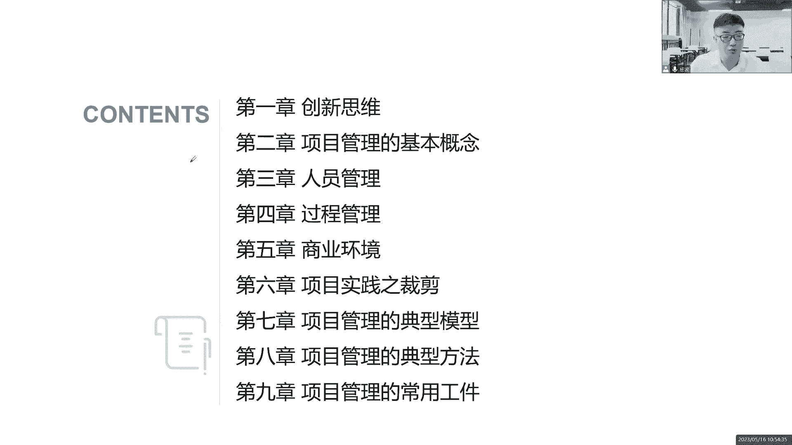

所以我们按照我们的顺序，从第一章后面开始学习好，我们先看第一章创新思维，先了解我们的整本教材，整本知识体系指南，它的一个创新变化在哪里，我们要学习什么样的一些创新思维，我们怎么样去转变我们的思维方式。

怎么样用我们的空杯心态，怎么样用我们从0~1的这么一个过程来学习，这本知识体系指南，先了解这本教材它的结构，它的内容，它的一些变化。

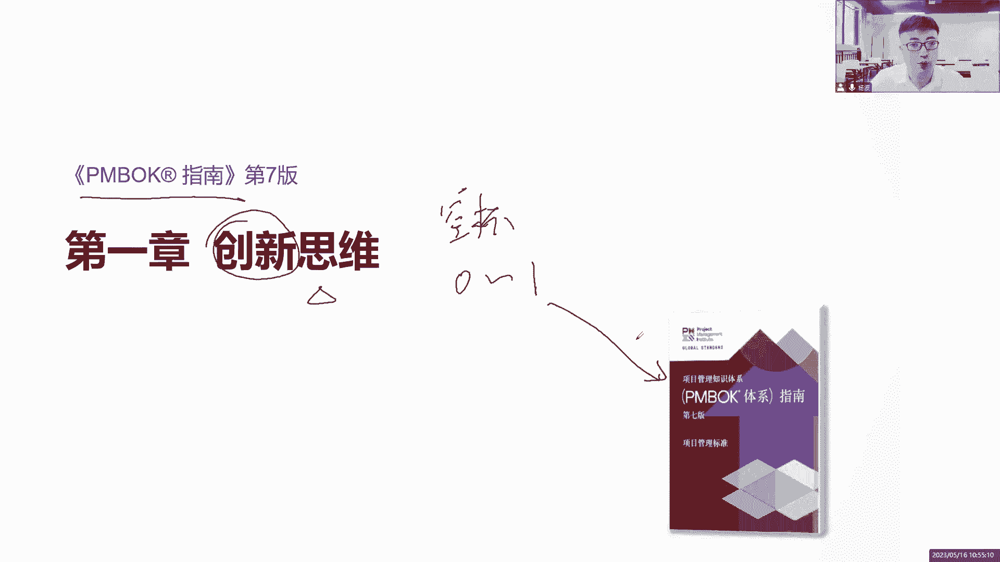

它的创新是什么，好要了解这本书，那首先从我们整个时代，从大的社会环境，从大的一个IT的发展，或者说我们整个行业的一些发展趋势来看看，接下来我们先看第一部分，什么是乌卡时代呢，乌卡乌卡。

其实啊它就是我们做四个词语所组成的，第一个是异变的，第二个呢是不确定性的，第三个是复杂模糊，那你说当前我们的行业，我们的变化，我们的市场是不是经常在发生变化，哪怕说我们这个项目的需求也是不断的在变化。

经常加需求，经常提紧急需求，市场不断的在发生变化，市场的竞争是非常的强的，我们的业务环境也是不断的在变化，要应对这个变化，因为这个变化它的背后是什么价值，你要响应这个价值，我们可以思考一个问题。

你说现在至于什么摩托罗拉，诺基亚，不知道大家有没有了解过，有同学用过它吗，柯达胶卷有的同学可以用过，那么为什么我们说当前这种诺基亚，摩托罗拉是吧，柯达胶卷离我们的生活这么远，几乎看不到。

我们只能说现在可以看到，但是离我们很远，那现在都是什么手机啊，啊苹果的是不是IPHONE的四二十三十四，未来的十五十六十七十八是我们的这些VIVO，OPPO华为的。

谁还用我们的诺基亚和摩托罗拉现在都是什么，现在我们用的相机是什么相机，是不是都是一些单反相机，谁还在用胶卷来拍相片很少了，现在为什么这些企业离我们越来越远，是因为耽误了新兴技术市场发生变化的时。

我们本来就在不断的变化，但是现在我们没有去应对这些变化，没有去响应这些变化，没有去把握住这些机会来创造价值，自然我们的企业就有可能会发生一些，断崖式的下降，甚至被整个市场，被整个行业给淘汰。

所以我们要响应这些变化，什么是不确定性，需求的不确定性，不知道这个需求到底该怎么去开展，太模糊了，不确定到底是要我们是要做个软件，还是做个硬件，这个市场怎么在变化的，不确定，未知未知意味着有风险。

那么就应对这个风险啊，应对这个风险，如何去调整我们的工作方式来应对这些风险，风险有可能是机会，有可能是威胁，怎么去把握住机会，怎么去消除这些威胁，我们的项目很复杂，非常的复杂，因为每个人要管理好。

每个人的心思不一样，需求期望不一样，还有在工作当中，我们除了只考虑当前的需求吗，你要不要考虑进度，成本质量资源风险都得考虑，我们得综合去评估啊，太复杂了，各个领域各个维度咱们都要去创造，去关注好人很多。

每个人的想法又不一样，每个人的期望需求又不一样，我要去整合，要去平衡，太复杂了，模糊不定，说不清楚倒不明白，很模糊，市场很模糊，需求很模糊，我们的整个前景很模糊，未来的发展很模糊。

那为了应对这些异变的不确定的，复杂的模糊的情况下，这就是个什么，我们当前说了无卡时代，怎么去应对这个时代去创造价值，那我得先了解。

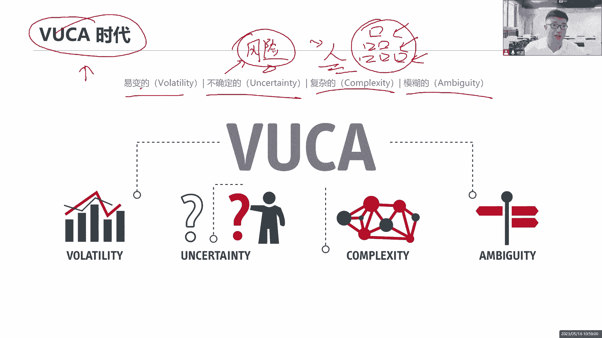

我们当前的环境是一个什么样子的好，这是乌卡时代，那么基于这个乌卡时代之下，我们现在要做企业的数字化转型，要做我们企业的IT变革，从传统的方式转到敏捷，转到迭代做孤独做转型怎么去应对呢。

那你说我们it技术要不要开展工作，要啊你做数字化的转型，首先it和业务是同步开展的，是不是谁来驱动啊，一定是业务来驱动，业务驱动我的IT的支持，IT来支撑我的业务做转型。

这是数字化转型的一个必备的一个思路，在这里面，我们要有很多很多的业务数据在这里面，那这些业务数据怎么去做整合，怎么去做挖掘，是不是得把我们的IT技术融合起来做改变。

然后呢数字化的转型我们要做什么企业的生态，我们企业里面的所有的部门，所有的行业，所有的教师和岗位都得参与了进来，从上下游一起来打通我们整个的转型，以及我们说的这些需求，不断地融入进来。

从企业的整个组织里面，从上到下一起来发现一些什么改变，做整个生态的一个改变，才能够驱动到未来的状态，全新的组织一定义我们的什么价值主张，这个价值，能够推动我们从当前状态转到未来状态。

从传统的方式过渡到我们未来的敏捷的方式，在这里面，这才是驱动我们组织的变革啊，所以在响应这个乌卡时代之上，我们做数字化转型驱动我们企业的变革，为我们企业创造价值来驱动这个变革，那么首先从业务层面。

从it层面，从整个企业层面，从上到下都得做一系列的驱动和改变，我们得了解对转变我们的思维方式，敏捷的思维，产品的思维，持续创新的思维，结构化的思维，那都得去做改变，以实现我们未来的这个价值主张。

在整个项目经济时代之下创造更大的价值。

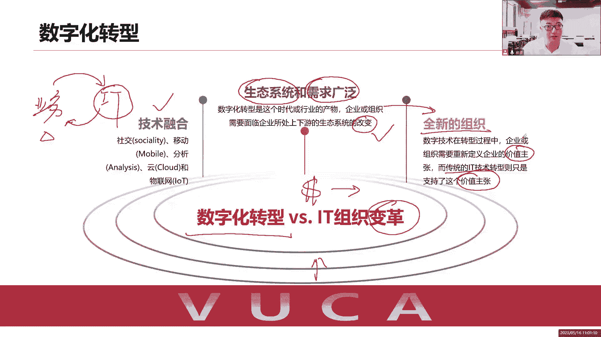

好我们说这个项目管理知识体系指南，为时代所需，为什么我刚才讲了，他是一个最佳实践，它适用于大多数项目，大多数行业，大多数企业，那这个追加实际上是啥意思呢，是因为我们按照这个知识体系指南的工作。

按照这个知识体系指南来开展工作，它能够帮助我们提高项目成功的概率，记住哦，只是概率不是说一定可以成功，那所以它就是一个最佳事件，因为在大多数行业它是通用的标准，我们的原则在这里面。

能够帮助我们提高项目成功的概率，所以它是一个非常有效的一个什么，知识体系指南，行之有效最佳事件，那么当然肯定是来自于我们美国项目管理协会，里面的很多一些专家学者，把顶级的世界级顶级的一些专家们啊。

行业协会们，大家在一起来讨论，怎么他们讨论啥呢，当下有哪些管理方式已经被淘汰了，我要把它剔除出去，当下有哪些比较优秀的最佳实践，我要引入进来，引入到我的知识体系了，所以我们的教材为什么在不断的改版。

因为这些专家在对我们的行业，对市场，对整个企业，对全球的项目管理做一些调查和分析，我们要学习的是最优秀的事件，过时的就被他淘汰了，就不用再看了，因为只有最新的最优秀的，最先进的世界。

才能够适合于当下的项目经济时代，才能够适合于我们的企业发展而创造价值，那这就是更是一次颠覆性的一个创新的飞跃。

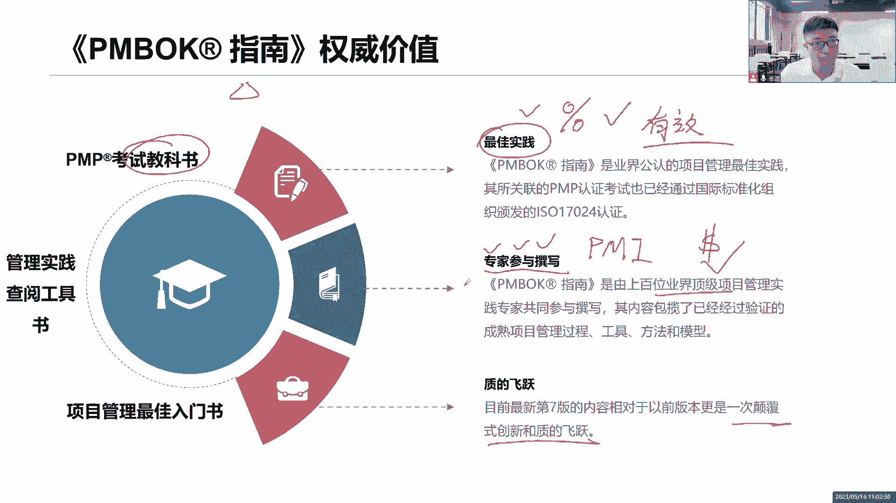

那么怎么说它是一个创新的飞跃呢，那我们就来看看吧，首先是不是从结构发生了变化，结构发生变化，你看当前我们说第七版的特点，它分为三个部分，第一个部分项目管理标准标准谁来定的，C美国国家标准啊。

也就是说这是美标，那为什么学习美国的国家标准呢，为什么要和美国的国家的标准化协会挂钩呢，那你要知道这个PP认证是谁给你颁发的，是不是我们PMI颁发的美国项目管理协会啊，那自然别人要把自己的标准拿进去啊。

不是说崇洋媚外，我们是学习的，是别人比较优秀的一些实践拿过来去用，这些标准是什么，就是一些原则性的东西，在这里面，那你为什么不会有国家标准呢，有没有国家标准，那必须得有啊，国家标准是一定有。

那你说我们国家标准和项目管理，怎么去结合和实践的，可有同学了解过他，有没有同学了解过我们的高校信息系统，项目管理师，信息系统项目管理师高翔，他是不是就是结合着我们国家的IT发展，软件行业的发展。

我们的项目管理的一些国家的标准在这里面，那就都有啊，虽然说我们高校也是引入了我们美国，项目管理协会的一些优秀事件，但同时我们国家的一些优秀的，我们是最佳的一些标准，也在高校里面。

它和我们他把我们的项目管理，和我们自身的行业IT行业密切地结合起来了，好了，这是我们第一部分标准，那么第二部分呢项目管理知识体系指南，指南指南是什么意思啊，指南就是一个指导性的文件。

知道行政文件就是来指导我们这个工作，怎么去落地的，你说你光有标准就可以帮助我们开展工作吗，怎么去做啊，怎么把你这个标准落地，我得有一套自然来指导我怎么落地，除此之外呢，还有第三部分，数字化的内容平台。

你看p mi他也在做数字化转型，我们的p m i standard plus，既然叫做plus，什么意思，加强版这个数字化内容平台，它有什么内容，它内容可可丰富，可精彩了，把我们当前前面说了。

做项目要用到一些工具方法，技术模型都给你整合起来了，那么以前第六版我们把它放在指南里面说，你应该用这些工具技术模型来开展工作，但是现在我们不把这些放在指南里面，这样的话这个书太厚了，你没发现吗。

第六版的书好厚好厚，就像砖头一样的，我们把它叫做砖头书，但第七版明显变薄了很多啊，为什么变白了，因为把这些内容都放在了数字化平台里面，你们需要自己去查，你们知道在哪里查就可以了，都不需要你去背啊。

以前我们还要专门去背，背这个工具模型技术在哪个过程出现，怎么输入输出ITTL工具技术什么场景用吧，这个用了之后的结果是什么，有什么价值，你还去备份，你现在你需要贝塔吗，不需要了。

你只需要知道在哪里去查有什么工具，它能够帮你解决什么问题，你去查就可以了，他能够指导你后面的开展工作，这是不是就是一个非常创新的变化，在这里面你的数字就没有。

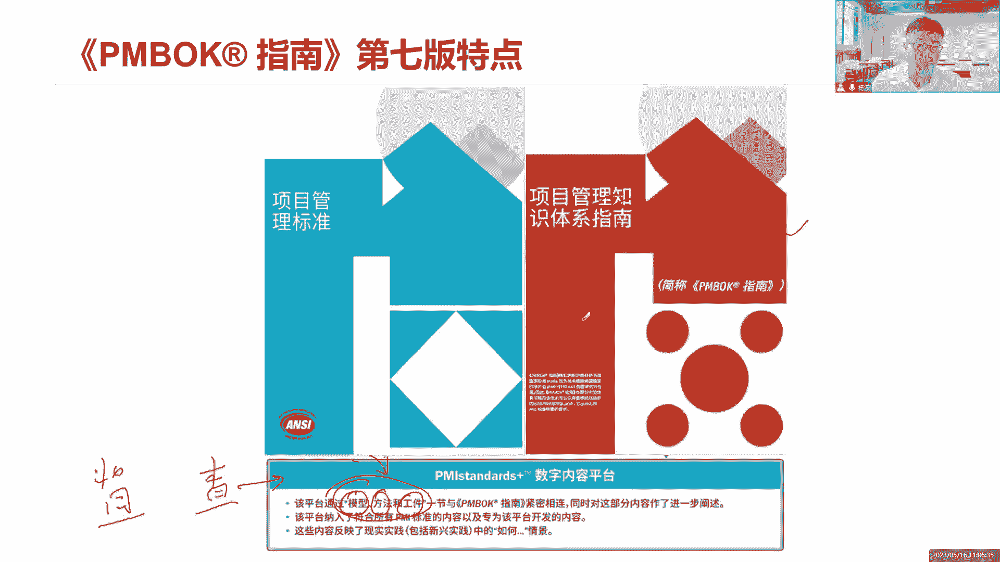

没有必要太大的篇幅去描述好，这是结构的变化，那么从内容来看看呢，第七版的内容它发生了很大的变化，第一个我们现在说这个标准，标准是以原则为导向的，基于原则来开展工作。

而以前呢我们是不是基于过程的方式来开展，我们说49个管理过程，十个知识领域，五个过程组，一共49个管理过程，按照这个过程来开展工作，这个过程过程就有点什么教条式了，就有点教条了。

你要知道我们当前做这个项目啊，在项目早期的时候，信息是不足的，很难乌卡时代吗，刚刚讲的模糊不清的，不确定的，异变的，我都不知道当前这个项目要怎么去开展，他的输出的成果是什么，你让我怎么去裁剪这个过程。

哪些领域要做，哪些领域他不做，怎么去做，如何去关注我，怎么知道我怎么去做裁剪，所以为什么以前的项目他很难做吗，在这个项目开展过程中，很难去落地去执行，因为这个过程太过于教条了，我们要做大量的裁剪。

才能够应对当前的项目环境，或者行业环境的变化，但是现在如果说是基于原则就不一样了，原则是什么，是理念，是价值观，它是不变的，你不管做什么事情，你的原则是永远不变的，它就适合于所有的项目了。

基于原则来指导工作，接下来再看后面的项目管理知识体系指南，指南指南也发生了变化，以前是十个领域，现在我们说看什么，看绩效八个G小于，那就是说以结果为导向了，我根本不关心啊，你这个过程怎么做。

你这49个过程在什么领域去开展，那是你的过程的事情，但是我现在关注的是结果，以结果为导向，你这个工作做得好与不好，这些人这些各个领域的工作是否做到位了，我都有一系列指标来衡量的，那怎么去做好这个工作呢。

原则啊，以原则来指导我们的绩效来开展工作，最后呢你看数字化的平台依然在这里，那这就是我们整个项目管理知识体系，它的一些内容的一些发生变化，所以我们有没有发现一个点，就是说项目管理知识体系的变化。

是不是从原来的过程转变为以原则为导向，然后呢注重结果，然后把工具和模型，放到我们的这个知识库里面去，pm standard plus数字化平台在这里面让大家去查，你不用背，你只需要知道在哪里查就可以了。

理解这个工具的内涵，然后呢根据原则灵活的去选择你的模型和方法，灵活的选择，你不断的根据我们的环境变化去迭代，去完善我们的可交付物，已解决当前项目管理遇到的各种问题，从而实现我们的成果。

从而实现我们的收益，最终实现我们的价值，这就是以结果为导向。

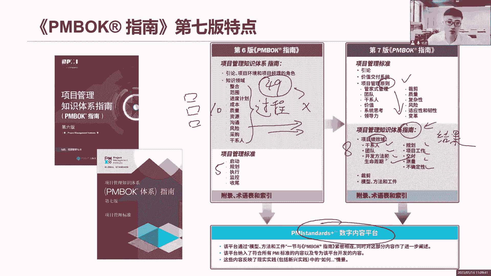

看的就是结果，这是它的变化诶，那你说这个原则还有这个什么绩效率，那么看他的个整体的变化，是把以前的过程知识，这个知识领域放到最下面了，基于这些过程，基于这些领域，我们衍生出来了，我们演进出来了。

以原则为导向来指导我们的工作，看我们最终的绩效已实现我们的价值，交付实现了价值，交付就实现了组织的战略目标，因为做项目为企业创造价值，这个价值就是为了实现组织的战略目标的，我们定计划，定目标。

定收益目标，效益目标得和组织战略目标保持一致啊，那你这样才能够为企业创造创造，最终的收益和价值，怎么创造，按照我们以前人们讲的这些知识领域，各种工具模型，各种的过程开展起来。

然后呢用原则灵活性的选择模型，选择工具，选择过程，选择领域来开展工作，进而以实现我们当前的考家务成果，用原则来指导工作落地，我们的成果落地，我们的需求看我们的结果做得好不好，以实现我们的价值交付。

价值交付就能够满足我们的组织，战略目标的实现诶，这是它的整体的一个特点。

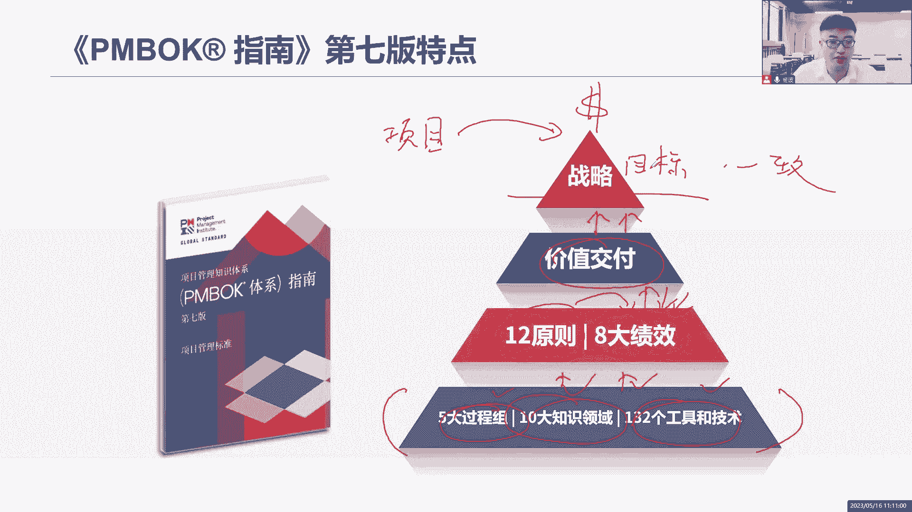

那你说这个原则和绩效率怎么去实现，这些都是我们未来要专门去讲详细的去说的，当前我们先有一个初步的认识，先有这么一个大概的理解，后面这些原则绩效率全部得细化来讲，首先我们作为一个项目领导者。

我们是不是要成为一个管家呀，什么叫做管家呢，既要管人，又要管事，主管大家的情绪，大家的健康发展，大家学习成就怎么样，大家有没有成长，你的事情做得好不好，绩效好不好，我们的氛围好不好。

大家相关方式认不认可，我们都得去管管很多事，他是不是管家，这个管家很勤勉，我们是非常勤勉，很勤奋的，很努力的，我们尊重别人，尊重他人，我们有利他之心，我们关心他人的成长，关心他人的发展。

关心我们整个部门，整个企业的一些高层领导，他们的收益情况，我们就是个管家，图人管家，这么理解，给大家提供服务知识和帮助的引导指导，辅导大家成长起来，那好你既然说辅导大家，这个大家是谁啊。

第一个是不是你的团队，你要让你的团队成长起来，首先你是不是应该给大家营造一个环境，积极的，开放的，自主的，信任的，公平的，安全的这么一个环境，积极阳光的环境，在这个环境之下，大家才可以高效地开展工作。

还要管一帮人干系人，这个干系人通常我们认为是一个利益干系人，比如说主管领导啊，我们的这个高管经理客户，这都是啊，我们的干系人，你得让他们积极地参与进来，有效地引导他们参与到你的项目里面。

来给你提供各种支持和反馈，让他们支持你，不要反对你，那你说这些都是人啊，团队也是人啊，干性人也是人啊，怎么管，展现出你的领导力呀，用你的领导力展示出来，让他们能够积极主动的团队认领工作。

该系人支持你的工作，团结在以你为中心的项目团队之下，这个项目环境之下来帮助你开展工作，支持你的工作，这就是你的领导力啊，那说这个领导力太虚幻了，领导力是个啥，后面再说。

因为专门会有去讲我们领导力的一些模型，工具和技术，后面这是管人，那你说管事也要管事，确实需要管事，怎么管事儿，首先我们说乌卡时代是不是项目环境很复杂，那我要应对这个复杂性啊，我要驾驭这个复杂。

不能因为复杂我就不管事了，那这个项目的复杂，所以啊我们在站在项目整体的角度去评，去识别，去评估，有哪些东西也会影响我项目的项目，整体的一个交互，在这里面，然范围进度成本质量资源沟通。

采购相关方这等等各个领域，我得综合评估，综合考虑啊，要响应这些变更，综合的评估，响应以及评估当前我们各个干系人，这些干系人他们的需求期望是什么，但你综合评估识别已找到平衡点，这是做整合，做协调做统一。

那你如何整合呢，你要考虑这个环境啊，考虑项目的变化，考虑项目的特性来对它做裁剪，根据环境做产检，不是所有的工作你都要去做完裁剪，结合着我们项目环境，企业环境做裁剪，哪些工作。

我们能够更有效的去推进裁剪工作，那不管你怎么裁剪，项目里面，你是不是得至少考虑一个质量，一个风险，这是你必须考虑啊，高质量完成工作，还有呢风险控制做到位，然后呢适应变化，拥抱变化。

并且让我们的项目具有韧性，这个韧性啥意思，项目出了问题，你能够快速恢复过来，绩效偏差了，快速恢复，产品有缺陷，有bug快速恢复，这就是任性，你得快速解决，拥抱适应性，拥抱变化市场无卡时代要去拥抱。

去适应，去调整，以此来创造我们的价值，聚焦价值，创造这个价值，才能够未来为我们的企业驱动变革而推动，把输入动力有价值，才能够驱动我们企业的发生变化，这就是一些原则，在这里面基于这个原则。

那好干系人要管结果怎么样，团队要管绩效怎么样，我们说这个项目要想开展，不是只有一种开发方式就可以了，我们也可以用混合的方式，那么有哪些开发方法，在整个项目生命周期或者产品生命周期里面，我们怎么去选择。

你的选择，有没有效，开发方式是不是真的行之有效的，能够为我们产生价值，做项目是不是得谋定而后动，你得先规划吧，怎么规划你的计划是什么，你要做哪些前期的一些工作准备，然后呢按照这个计划来开展你的项目工作。

怎么去执行工作，怎么监控工作，怎么收尾工作，你前期做了很多的启动和规划，现在你是不是就要去做执行监控和收尾，那你的设备就意味着你要交付你的产品，哪些东西影响你的交付范围，影不影响质量。

影不影响你如何去产能去交付，要想交付，你首先得测量你的工作是不是做到位了，从各个领域去验证你的绩效，验证你的指标啊，你的这个进度的成本的指标是不是符合要求，当前有哪些绩效，你有没有公示出来。

怎么展示出来，用各种方法来验证测量你的工作，然后呢在整个项目里面又要考虑一些不确定性，乌卡时代风险怎么去应对，因为一旦风险发生了，有可能会影响我们各个领域的一些绩效，那我得去验证优化我的风险应对吗。

不确定性就是你的风险好，这是我们的整个的原则和绩效，在这里面，未来我们会一个个的逐步的去讲解它。

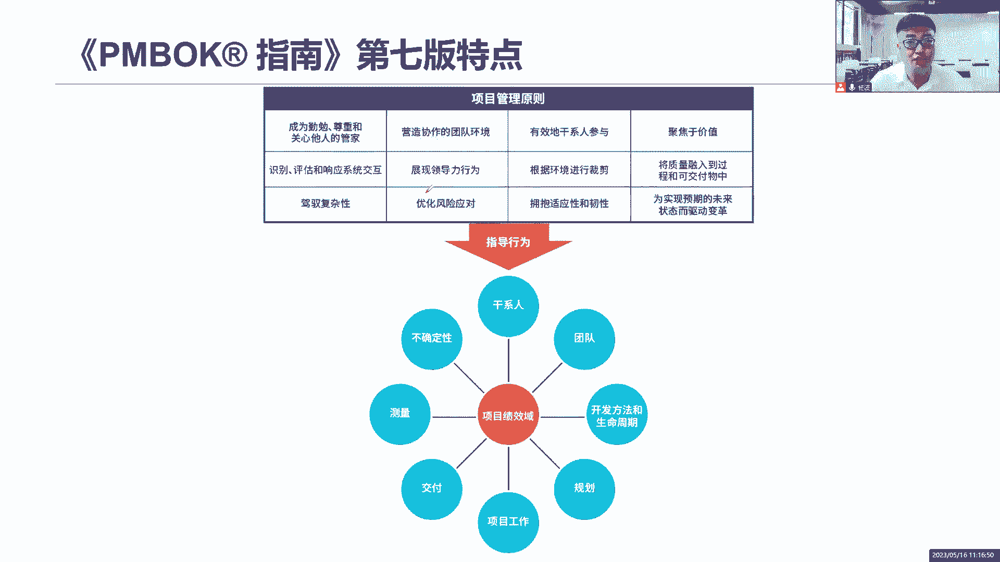

来看这个大兔子，就把我们前面所讲的我们做一个总结和梳理，你说现在我们是基于项目的原则，12项原则来指导我们去开展工作，怎么知道呢，按照我们的过程启动规划，执行监控和收尾。

来开展我们整个项目生命周期的一些过程，在整个项目生命周期里面，我们开展项目要关注八个绩效，我们的人怎么管喂，我们的开发方法怎么去选择做项目啊，你既然说了，你就启动有规划，是不是你得先规划好啊。

然后按照这个项目去执行开展你的工作，最后呢我们交付我们的产品，以测量的工作是否符合要求，最后呢在整个项目生命周期里面，我们要去考虑它的一些风险不确定性，最后我们收尾项目以交付我们的价值。

交付价值价值交付系统诶，它里面有各种组件来帮助我们去交付，我们当前最有利的把这个价值给它，最大化交付的价值，从而实现了组织的战略目标，为企业创造了整体的价值，在这里面。

所以这些工作都是我们当前什么是需要去开展，全部都需要我们项目经理，带领团队去开展这些工作。

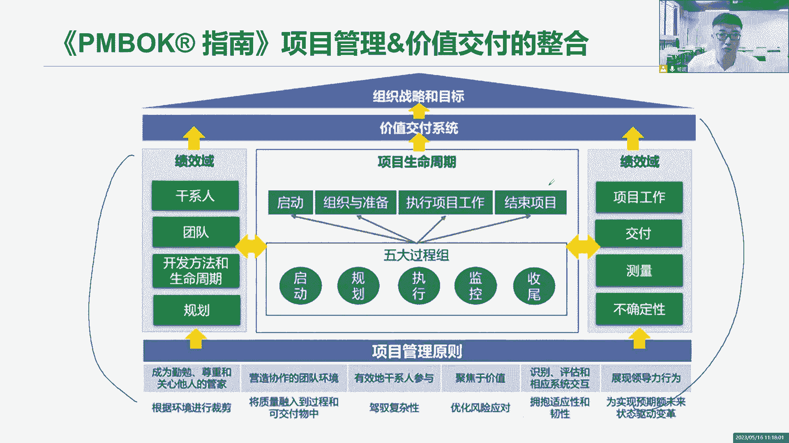

最终为企业创造价值，符合组织的战略目标。

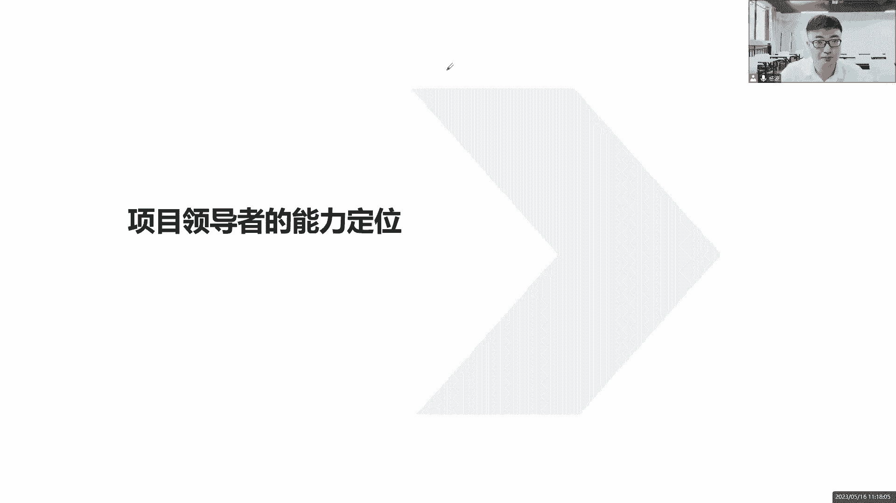

来看项目经理的一个定位，对于项目经理的定位来说，以前我们说你只要懂技术，懂业务就可以了，能这么做吗，显然不行啊，对于传统的方式来说，你懂管理，还有呢你的软件的领导力诶，专门有一个原则在讲领导力是吧。

有领导力，还有呢懂战略，懂商务，这是对于我们最早来说，以前PMI，美国项目管理协会对项目经理的一个什么能力，要求，一个能力期望在这里面你需要掌握这三项技能，但是现在呢我们还是三项技能。

只不过这三项技能发生了一些变化，什么变化呢，你看首先第一个工作方式，把以前的什么管理技能变成工作方式了，把以前的领导力变成了影响力了，把以前的战略商务变成了我们的商业敏锐度，来一起来分解分解工作方式。

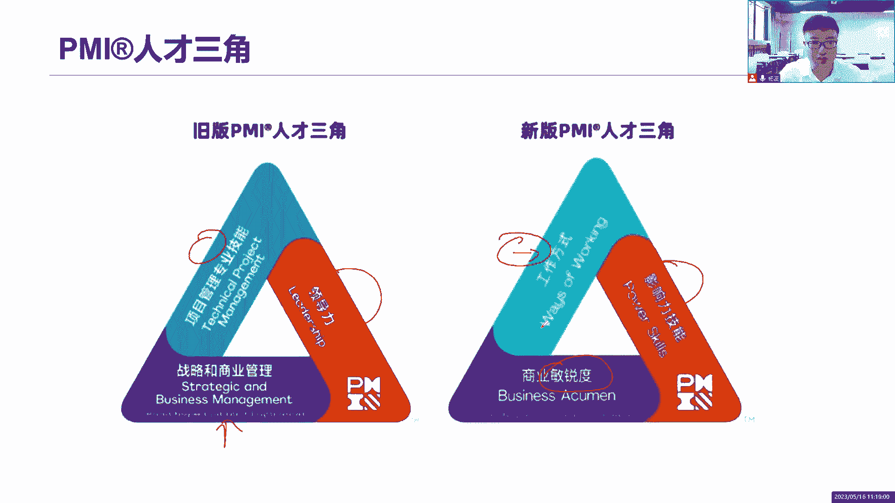

什么叫工作方式啊，对于工作方式来说，其实就是希望我们能够尽可能掌握更多的一些，解决方案来完成工作，因为这个时代的变化，市场的变化，你如果按照传统的方式，一步步按照阶段去做的话，响应速度会很慢。

所以我们要什么，用敏捷的思维方式，甚至超越敏捷，甚至把敏捷来做一个混合，它都是可以的，你用预测的方式来混合，用迭代的方式来混合都可以，我们要在新挑战出现的时候，市场环境发生变化的时候。

改变我们的工作方式，改变工作方式，不局限于自己的思维，不要去局限于自己的思维方式，在这里面在对的时间做对的决策就可以了，从而让我们快速的成长，让我们这个项目能够快速的取得成功，所以用你的思维方式来做。

我们后续后续一系列项目管理工作，最后驱动组织的发生变革，哎这就是我的工作方式，在强调你不仅是我们传统的什么范围，进度成本质量资源，十个领域的项目管理技能，我要的是你们在不同的时间。

用不同的方式来开展工作，不要局限于自己的十个思维，十个领域更多的领域我们都可以开展，甚至把有些方式我们混合起来一起来做，哎在我们整个项目层面，我们可以用预测性的方式啊，或者说在整个迭代层面啊。

我们用什么敏捷的框架，在开发层面又是用敏捷的什么框架混合，多方面的混合，以提供更多的解决方案来应对我们的无卡时代。

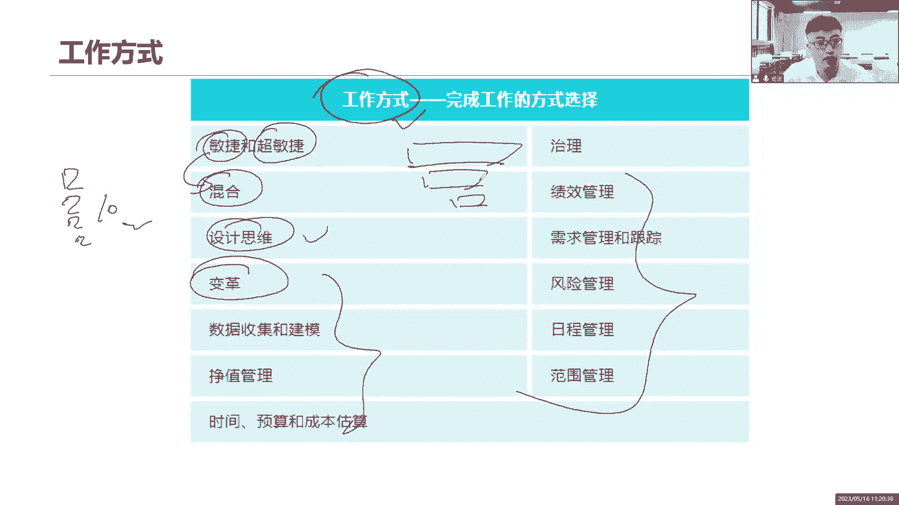

影响力，影响力啊，以前叫做领导力，现在把它变成影响力，那么影响你就这也包括了我们的领导力，在这里面，首先对于领导力来说，其实它更多的是在于什么，一个至上而下的一个领导技能。

但是对于我们的影响力就不一样了，它是在不同级别之间的一个人际交往能力，或者叫做不同领域，不同范围，不同层级之间去施加影响，去激发改变，去建立关系，这就是我们说的影响力，影响力，它包括了你看领导力是吧。

我们的什么积极倾听，这都是沟通，这都是我们的沟通能力，还有了目标的一些引导能力，移情能力，共情能力，那这些移情能力，共情能力，都是在这里属于我的影响力的一个范畴，通过掌握这些影响力的技能。

可以使我们在组织里面变得更加强大，有影响力的项目经理推动变革啊，让你的想法，让你的创新的想法，比如说你要做工作方式的转型，敏捷的转型，新技术的引用变成现实，可以推动起来，你就说你跟他去谈，去解决问题吧。

教大家怎么去做事情，你怎么推动工作，用你的影响力啊，领导大家积极主动开展工作，领导大家站在对方的角度去思考问题，这些工作能不能够创造价值，这就是影响力，那它其实体现了什么情商是吧。

你的第一个自己的一个情绪的管理，同时呢你要去控制别人的情绪管理，你要去站在对方的角度去影响别人，理解他人，然后告诉他，我们当前这些工作是能够产生价值的，给他施加影响，让他能够积极地主动地配合你的工作。

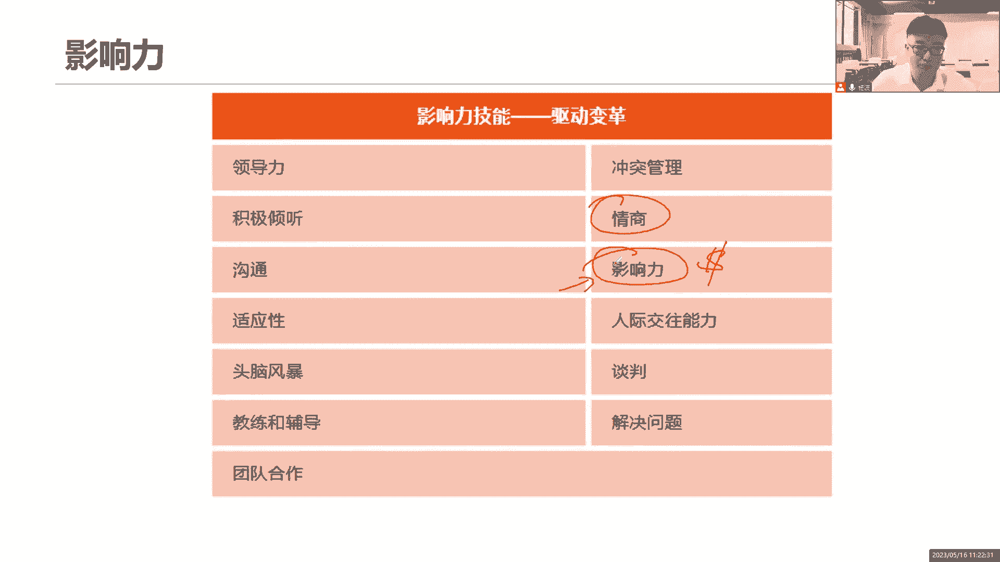

商业敏锐度敏锐度吧，它替代了我们以前的战略和商业管理，其实随着我们当前这个互联网时代的发展，数字化时代的到来啊，什么技术的创新，商业模式的创新都在发生变化，那么商业价值的交付方式也在发生了变化。

所以商业敏锐度它本身指的是什么，就是我们对这个对这个影响项目的工作的开展，各种商业的机会和威胁，我们来有一个什么敏锐的感知程度，项目经理我们在学习商业知识的时候，你要提高自己的洞察能力啊。

这个敏锐度不就是洞察能力吗，把我们学习了一些什么知识，在业务实践当中去用复盘总结提炼，才能够了解当前我们组织战略和行业之间，它是怎么相结合的，怎么发展的，怎么变化的，从而快速我们做出一些决策。

有效的决策，在这里面把握住我们市场的商机啊，对于项目经理来说，我们是有条件可以和公司高层开展对话的，那你怎么对话，如果你不了解商业的变化，不了解企业战略布局的话，如何开展对话。

所以我们要把自己的格局和眼光放在了嘛，放在组织战略层面，记住一定是放在我们组织战略层面去开展工作，和这些客户和这些高层的开展有效的对话，掌握这些商业的变化，掌握市场的法律的行业的各个领域的变化。

我们要成为一个复合型的人才，一个不可替代的人才，不光是掌握软技能，应急能，我们还得懂战略，懂商务等运营，有非常强的敏锐度，发现了市场发生变化，有新的技术引入进来了啊，有新的一些技术引入进来了。

这些技术引入进来，能不能帮助我们企业开展工作，我们的企业会不会因为这个技术而发生，断崖式的下降，我得赶紧去识别，让企业怎么能够快速的去发生战略的布局，占领市场，占领市场，那这就很重要，从而什么占领现金。

从而占领现金，及时掉头。

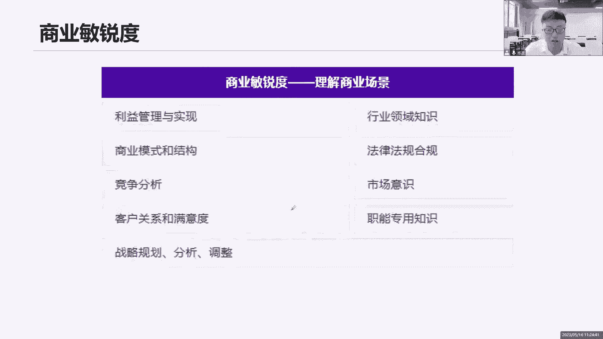

及时止损，就这意思好，我们来看这个认证考试的内容，对于认证考试内容来说，现在考试分为三个维度，人怎么管42%，事情怎么管过程50%，以及我们说的商业环境，你看这不就是我们前面说的人才。

三角对应的三个领域吗，好了这个认证考试啊，现在考试时间230分钟，230分钟，然后呢统考180道题，180道选择题，这个选择包括了单选题，多选题，那其中有五道不积分，可能认为是个争议题，测试题还不积分。

其实那么最终有效的得分，其实就是175分，那怎么叫做及格的，及不及格啥意思，我们待会来看啊，那么考试大约6~8周之后啊，出成绩，那这个考试大家注意哦，是笔试哦，是笔试。

也就是像我们以前高中的时候涂答题卡来图。

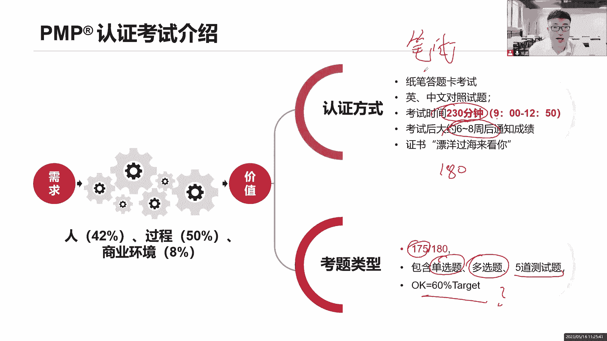

我们的答题卡来看看考试选择题，阿图答题卡，我们这个考试呢一般一年四次，可能是369 12，也可能是358 11都有可能，如果人多，他可能分上午场和下午场都有可能，时间230分钟搞定180道题。

180道选择题，有单选有多选，一共是六套试卷，你只需要拿一套试卷就可以了，就是试卷不同嘛，你的前后左的人不同，来避免大家抄袭是吧，这个试卷是中英文对照的，上面是中文，下面是英文，就是每道题都是这样的啊。

第一题英文，第一题中文，第二题英文，第二题中文，就这么一步步的来的，我们用笔试，用铅笔2B铅笔来涂我们的答题卡，一共有效题是175分啊，这是积分题，这个及格的标准说有35个任务。

60%达到target人，过程50%，商业环境8%诶，刚好百分之百对吧，刚好百分百人有11个任务，过场有14个任务，商业环境有四个任务，那一共有四个人在这边好了，哎不说了，四个17个人物，这里写错了。

人是14个人物，过程是17个人物，然后呢加上我们这四个刚好35个对吧，刚好35个好了，也就意味着什么呢，你这一共35个任务吗，这35个任务里面所有的任务加起来，如果有60%达到标准了，我们就通过考试了。

就通过考试啊，PDU我们后面会专门去讲啊，这什么班主任为大家讲，我们当年未来考完试之后，我们要有一个个人的发展单元，这个人发展单元是未来我们去虚证而用的。

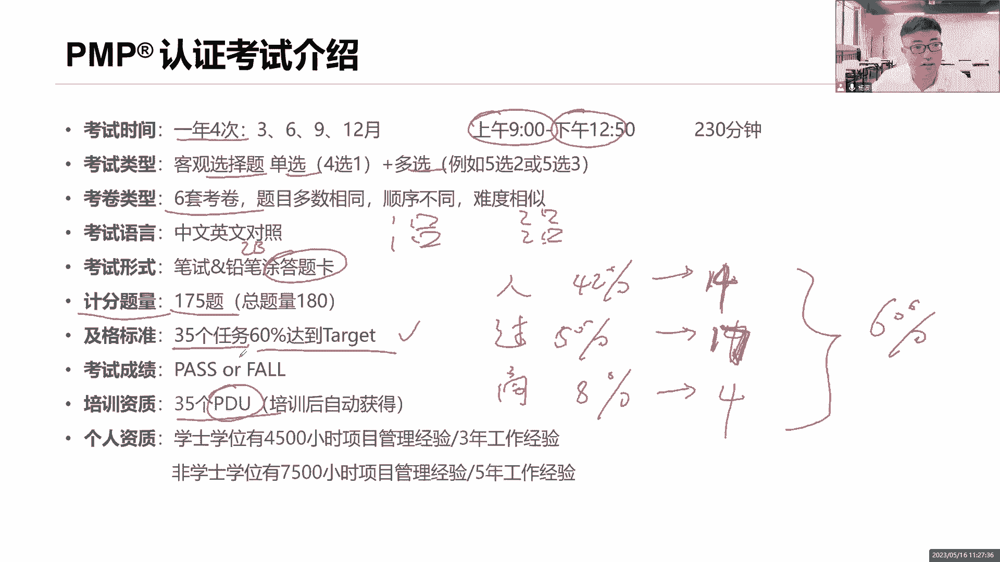

那你看这个target，什么叫target，说你这个35个任务都达到合格的标准，这是T什么是A呢，Above，他给的超越目标，也就是说这个任务啊，这个任务你有60%的正确率，那么符合标准。

如果你超越了60%，高于目标，低于60%呢，就低于目标，你严重低于呢就是需要提升，那就这意思，所以是不是我们说35个任务里面，你至少这30分钟的60%，你都得达到他给他才认为通过啊，那是不是就意味着。

你每一个领域都得有60%dt target才可以啊，那就这个意思啊，就这意思，所以我们不记分的，不是说去记分数，所以一定是要125分啊，135分或者118分，根本就不看你的分数，我们看的是你的领域。

各个领域里面的任务，它的合格率是多少，如果所有的领域加起来能够达到90%，就合格了，那有可能你的这个领域做的比较好，但你后面几个领域做的不够好，没有达到60%，即便你的分数上去了也不合格。

只不过是你当前这个领域占的比重比较多而已，所以要综合评估，不要偏科，不要偏科。

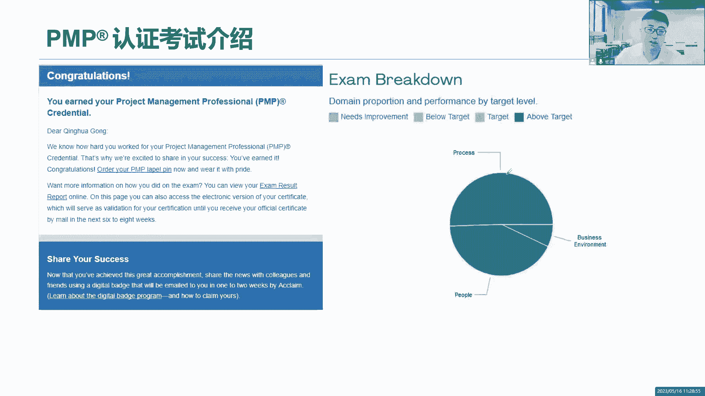

人过程商业领域咱都得去好好去学习，那么第七版内容，我们看看整个框架，整个这个教材首先它怎么去介入进来的，这个第七版指南说，先介绍介绍这个指南啊，它的内容，然后呢价值交付系统刚说了。

价值交付系统对接的是我们组织战略的，这个价值交付系统，它的组件有哪些呢，它的信息流是什么，怎么去啊，有机的结合起来，通过这个方式来运转，以实现我们组织战略价值交付系统12项原则。

八个绩效率怎么去裁剪这些内容，最后给你介绍介绍我们的工具模型方法，这就是整本教材的一个框架和体系，然后呢学完这些内容，我们来应对我们考试的人怎么管事情，怎么管商业环境，怎么去理解。

怎么去裁剪诶，来应对这些内容好了，人过程还有商业环境，我说三个领域重点考核，那么这些都是我们后续要去学习的各项任务，在这里面，而且有些任务他是做了一些细化的，不管你怎么细化。

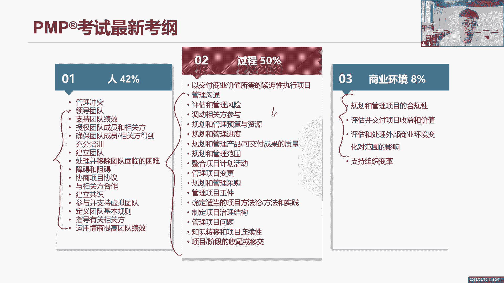

反正在后面的学习的过程当中啊，我们都会去一步一步的给大家做讲解，学习的过程大家小心一点，在课堂上面去听看书，边看边听啊，甚至什么你做个展示，你自我展示，这都是什么被动的学习，你掌握了知识面很窄。

或者说你可能记住的知识不够深刻，印象不深，我们要主动的去学习，怎么主动啊，来我们一起来讨论讨论，我们会划分学习小组的一起来讨论，甚至呢我们会做一个实战演练，在工作里面去实践运用，都可以。

做一个沙盘演练也可以，这个是很重要的点，来到就来到我们这个课堂上面，我们会有学习群，在这个学习群里面，大家一起来怎么沟通，讨论学习别人的问题，如果说你能教他把这个问题教会，那说明这个问题你长得非常成熟。

你能够教别人能够给别人答疑好了，这个知识你掌握得非常牢固，这才是真正的主动学习，能够掌握大多数人能够记忆大多数内容，能够梳理大多数内容的逻辑，这样才能够以完胜的姿态来应对最后的考试。

所以鼓励大家为了在学习的时候多多讨论，小组群，学习群英，你一个人走不远，整个学习的过程来说，他确实很痛苦，你一个人走不远，但是如果说是一群人，一群志同道合的人走在一起，你有什么不懂的。

别人教你别的有什么不懂的，你来辅导别人，大家一起来共同进步，一起来把这个知识点快速的吸收，掌握打通逻辑才能够共同进步啊，你们这个团队才是共同进步，你们也可以把当做这个项目来开展工作啊。

你们就是一个项目组，这个项目组的绩效好不好，不是看一个人，是看一群人，我们要带动大家所有人进步啊。

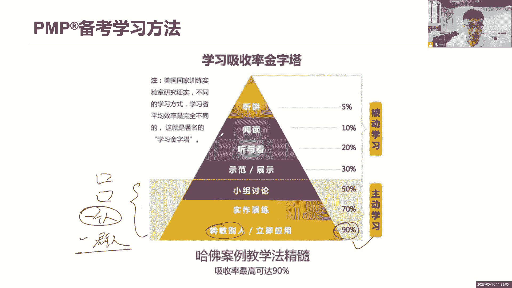

学习持之以恒，那这一点很重要，大家注意在整个学习的过程中，大家会觉得很痛苦，为什么会觉得很痛苦呢，你要知道一个点啊，你说我这个每天把上班大部分时间上班嘛，有的时候还要加班加点的干活，周末还得加班。

回头还得看视频学习，你说痛不痛苦，那你在家里面还有很多事情要照顾小孩，不照样这么做，家务要做什么事情，家里面的事情工作还要每天加班，留给你学习的时间真的很少很少，但是我们依然坚持要去学习啊。

你要知道你的我们一开始讲的什么东西啊，初心你为什么来到这个课堂上学习我们的批评，认定你的初心是什么，痛苦是很痛苦，但是这个痛苦大家知道是你当下最深刻的感受，是你当下最深刻的认知而已，它是一个阶段性的。

不是说一直痛苦下去啊，是一个阶段性的，在这个过程里面，如果说你不进不冷啊，放弃了，不想学习了，意志不坚定的不努力了，那就不是你自己了，你应该是不要犹豫，坚定自己，努力坚持，持之以恒地去学习，坚持下去。

你要知道，当下，是我们为自己的未来而踏踏实实努力的时候，坚持努力的时候，那些我们不曾见过的良人，不曾看过的美景，不曾获得的成就，都会在我们生命当中出现的，那有人说。

你看我看别人五一的时候是11的时候放假啊，什么晒朋友圈，晒美食，晒美景，出去玩看电影玩游戏，怎么和家人小孩去逛公园，好好舒服，好漂亮啊，而我在家里面学习，你会觉得很痛苦，那我们大家阿拉斯加的虎鲸虎鲸。

你们看到过没，南太平洋的海鸥，你看到过没，地球极圈的夜空，你看到没，很少有人看到吧，这才是美景，不是说你亲眼看，不是说我们轻易看到的就是美景，这些我们不曾看到过的美景，他们才是美景，未来我希望在同学们。

你们的朋友圈里面，我看到这些不曾见过的美景，这些都是通过我们学习之后，我们有了能力，有了资源，有了成就之后，我们可以去看这些类型，他们都将在我们的生命当中出现的，所以放心学习，持之以恒。

保持一个坚定的内心，看看你的初心，当你遇到困难，遇到痛苦的时候，回忆一下你的初心是什么，这样才能够持之以恒，好了，这是我们前面讲的第一章的内容啊，感谢各位同学们收听。

后面我们会从第二章项目管理的基本概念。

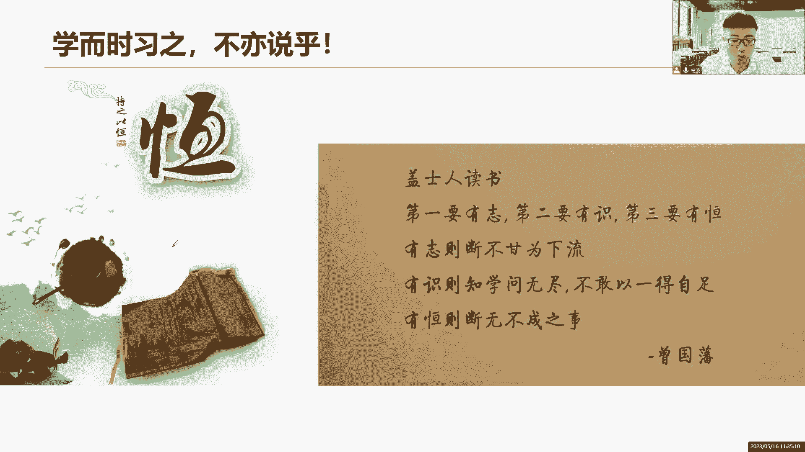

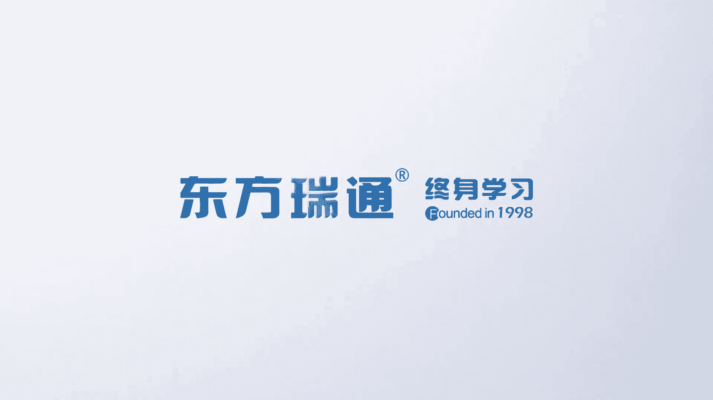