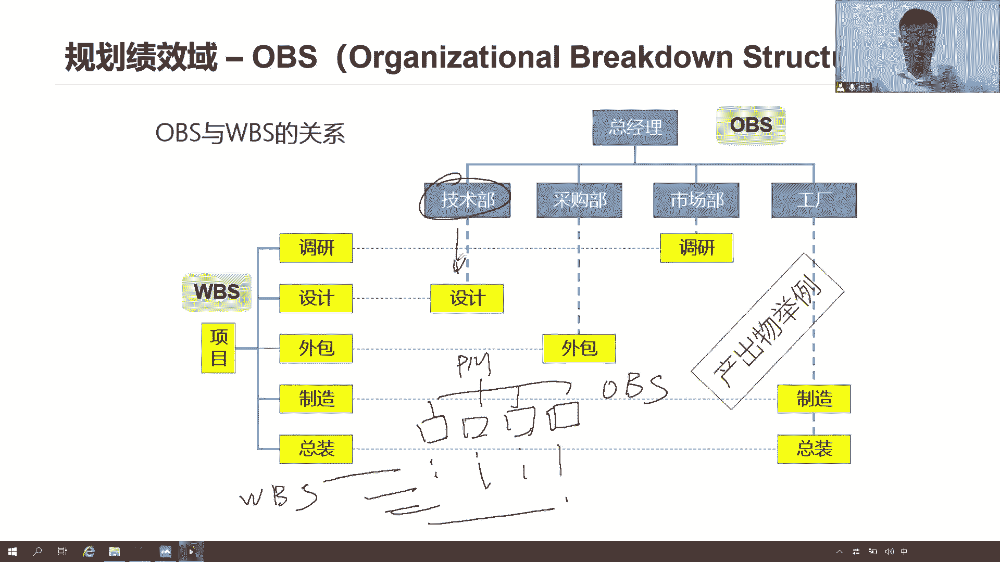
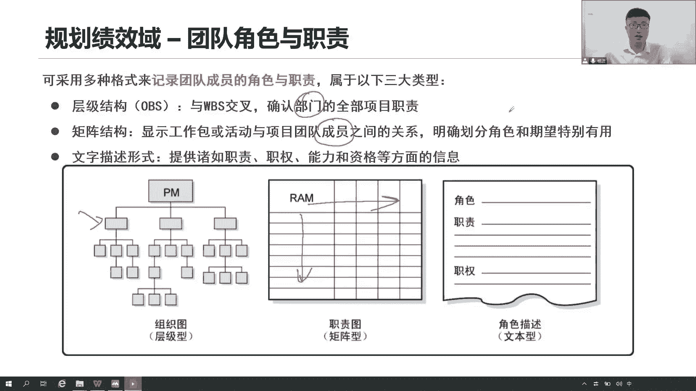

# 全新录制PMP项目管理零基础一次顺利拿到PMP证书 - P21：PMP精讲规划绩效域-资源1 - 北京东方瑞通 - BV1qN4y1h7Ja

那这个设计呢大家现在总结总结咯，你看我们现在讲了三个基准呢，是不是三个基准，一个是范围的基准，范围的基准是基于我们当前的范围说明书，把范围说明书里面的项目范围，产品范围啊。

以及什么可交付成果验收标准除外，责任加上我们的工作分解结构以及全面分解，我们会写一个词典，诶，这些是我们的范围基准，未来我们范围技能用来考核大价码范围绩效，是不是这些这里面写了写了各项内容。

分解出来的各项工作包，你都完成了，有没有完成啊，有没有漏，我靠你的绩效，然后呢我们根据我们的关键路径法，资源优化法，进度压缩法，把我们的进度计划拿出来，这个进度计划它本来是一个文件，项目文件。

我们把用通俗的语言，用工作上的话术来说，把它叫做干特殊，那这个甘特图是不是就是否了传进度的基础上，我们应该按照这个甘特图在第一天完成什么，第二天完成什么，这一周我们应该完成什么，什么时间开始。

什么时间结束，项目的开始，项目结束都有，我们按照这个基准来衡量，我们当前项目的进度绩效，第三个呢是我们成本，我们成本怎么说呢，我们成本就是指项目的成本逐层往上汇总啊，这个项目成本里面就包括了。

我当天我们应急储备，应急储对，包括文件储备，因为当前有些风险我已经识别到了，那这就是我的成本计算的哎，这些都是我的成本基准加在一起，经过临床水平，未来我们就要衡量已完成这些工作，包计划是多少钱。

基准嘛基本就是有计划多少钱，但实际你用了多少钱，我要考考你的成本绩效有没有超支，还是说你节约了预算是吧，在这个成本基准之上加上我的管理储备，就在我们的项目的预算，项目预算就这么算预算啊。

这我们三个基本就是接下来我们看关于团队，项目团队啊，我们怎么样去规划它呢，在项目早期，我们想想想我们这个团队如何去打造，怎么去组建，我们这个团队怎么去管理，有没有一些方法来指导我们如何去管理啊。

咱们这个团队啊需要多少人，需要多少资源，需要多少物质资源，人力资源，这是前期我们得去规划，你只要规划好了未来之后，你才能够去要资源，获取资源，你才能够按照计划去管理团队，建设团队是吧，打造高绩效团队。

所以你还是一样规划过程，先把这个子句话拿出来好，那么看在这个项目团队里面，我们怎么去规划，首先规划我们项目团队的组建的时候，组成的时候我得先确定一下我们当前需要哪些，记得就是完成这些工作。

你需要哪些技术人员，还发的技术人员，测试技术人员，那他的技能他的能力需要多少，他需要考什么认证吗，是吧，都得考虑啊，你组建一个团队啊，不容易啊，那这个团队你要考虑你要什么样的人。

他们具备什么样的能力和技术，你的延期也确认了，你记住你需要多少数量，它是高级工程师还是初级工程师，这都是前期我们要去规划的，我们说使用内部的成员和获取外部成员，很明显这个成本是可能不一样。

内部成员自己项目组协调协调就可以了，内部部门之间协调资源，内部人员嘛自己用就可以了，但是你如果要去招一个人进来的话，你想想这个成本高不高，很高的招人是吧，那肯定是这个成本一下就上去了。

对于外部层面的技能给项目带来收益，以及其将产生的成本，我要进行权衡，就是如果我要招人，是你需要有某些特定技能的人员，确实需要，那么它能够给你项目团队带来什么样的收益，以及你实际花出去的成本。

这个人是按天来计算，还是按月来计算，还是按什么方式来计算，他的钱是多少，你好，给你产生的收益又是多少，你要做一个全评估，到底是招这个人，还是说我们内部做一些培训就可以了，还是说大家一起来通力协作。

学习学习，促进合作，解决问题，咱得充分的衡量啊，尤其是在这个钱的角度要考虑清楚，在针对我们项目团队进行规划的时候，相信你会考虑我们大家是在一起办公，还是说我们不在一起，我们可能是一个虚拟团队。

我们只能用线上的方式来开展一些什么沟通，用线上的技术把大家连接起来，开展沟通，如果能够有条件，我们就在一栋楼里面，一个办公室里面，一个会议室里面高效的开展工作啊，及时的沟通，降低沟通成本，实在不行。

没办法，大家不在一起，不在一个城市，不在一个国家，虚拟团队用线上技术，腾讯会议，视频会议和语音会议，各种来建立联系，建立沟通，这都是规划，咱都在做规划吗，这个团队怎么打造，怎么分布，是虚拟的还是集中了。

我有没有条件可以让大家创造一个环境。

所有人到一个地方来，还是说分开考虑清楚，那么在规划时要考虑啊，他们当前这个项目团队啊，每一个团队，当然这个项目团队需要有哪些角色和岗位，角色岗位以及这些岗位啊，这些角色他们职责什么，要做什么事情。

我得提前先明确下来，否则未来我们怎么这个团队怎么开始沟通呢，这谁做什么事情，不知道，即便是我做完这个事情，我找谁来审批，我找谁来检查这个工作，我应该移交给谁，我都不知道，所以我们先给大家介绍介绍。

我们这个团队有哪些岗位和角色，以及大家的工作职责是什么，怎么去沟通，怎么去互动，怎么去交流，那得明确决策和指责，那这个角色和职责分为三种形式，来帮助我们去描述我们这个团队的角色和职责。

首先来看第一个层级结构OBS，这就是obs organization，组织分解结构，组织分解结构好了，组织分解结构啊，说当前我们这个组织以他为老大，这个老大下面有好几个部门，技术部，采购部，市场部。

工程部，那么每一个部门下面应该挂什么工作呢，我就要和你WBS结合起来，因为WBS是你对工作做分解，那么每一个部门应该完成什么工作，我要把它们一一对应起来，这就是obvious，他让我们了解到。

当前各个职能部门下面的工作有哪些，你大可以达到总经理这个级别，企业这个级别对呀，因为这个项目是一个跨部门的一个大项目，完全没问题，可以吧，总经理参与这个项目里面，他是牵头人，可以啊。

你想也可以想到这个项目小团队，所以我项目经理为中心，下面我分成几个小组，A开发小组，测试小组吧，我们的需求小组，那还有什么验收小组都可以啊，每一个小组下面应该挂什么工作，一样的，和WPS相结合起来啊。

这边左边是大哥BS，右边是我们的OBS画出来就可以了，都可以，这就是组织分解结构，科学是项目组织科学是公司级别的组织，那个超级大的项目组织都可以，我只是想了解每个部门，每个小组。

每个单元下面的他们的工作职责是什么，我不是想了解你们每个人还不到这个人，我只想了解你们每个部门下面，你们的工作是什么。

这就是组织分解结构，第二种情，他说什么呢，矩阵结构了哎，这是不是一个层级结构层级，一种结构化的思维啊，这是一种结构化的思维，从上往下画，那么矩阵横向的纵向的都有数据，那么我们就来看看。

他说这个矩阵型的结构用来展示好了，那就是成员了，之前展示的是我们的各个部门，现在我们展示的是每一个成员，你们的角色。

你们的职责是什么，来我们看举证怎么看。

那这就是个举证了，我们要确认一下当前这个每个人的责任，怎么去分配责任，分配矩阵RACI这个句子他怎么说呢，我们看图说话，左边是一堆的活动，一堆的工作，一堆的任务都可以。

右边就是我们这些人员参与了好多好多的人员，他们的角色，他的角色以及你们每个人的职责是什么，这个RACI就是职责，有的人负责做执行，有的人做主导，做负责人，有的人是负责被咨询的，有的人是负责被通知的。

被控制好，来看这里，像章程，安妮你要做主负责人，你是负责人，A就是负责人，R2呢把你去写这个事情，你去执行这个事情，把这个章程写下来，我们要去咨询下，我们要去通知人，通知卡洛斯，通知蒂娜。

通知艾德艾玛通知嘛，通知他们三个，我们这个章程现在正在做这个章程，写完了这集就有一个道理，通知谁啊，谁来负责，谁来执行，谁来执行，谁来执行，通知谁咨询谁啊，就这就是个RA3的矩阵。

确定我们每一个人他对应的职责是什么，一个职责是负责某项工作的某个内容，那么这个责任分配矩阵啊，我们要明确一点，你有没有发现每一项工作他都只有一个唯一的，唯一的唯一的哎呀。

这个就是个主负责责任的背锅的主导，任何一项任务工作都必须有一个唯一的责任，还记得吗，咱们WBS下面是不是讲过，WBS一个五项原则里面，最后一项原则，就是要确保每一个工作包都有一个责任人。

这个责任就是A呀，以及我们所定义活动，把它分解成更小的活动，同样道理，每一个活动也得有一个责任，谁来处理这个事情，谁来主导这个事情，我主导人不一定是执行的人，执行的人不一定是主导人。

都有可能就这个事情到底谁来负责，谁来主导，谁来牵头，谁来推动，谁来背锅，就这个意思，至于下面这么执行的人，你可以多个执行人，无所谓，我根本就不关心，你可以通知谁，可以咨询的，那更无所谓了。

我现在只关心的是这些工作我到底出了问题，应该找谁负责，你才是负责人，让他们团队很清楚的了解我自己的角色，和我的职责对应起来，就这些某些具体的工作，具体的活动我应该做哪些事情，你的职责是什么。

我很清楚的让大家了解，把我们的工作包或者活动，你这个左侧可以写工作包，也可以写的更细，活动都可以与我们的团队成员，团队成员全部都联系起来，并且说明这些活动，这些工作谁来主导，谁来执行，谁来咨询。

谁来通知，把你们每一个人的职责搞清楚，这就是RACI责任分配矩阵，我分配的是责任好。

这是第二种类型，第三种类型的文本型，乍一看这个东西谁愿意看啊，说真的没有人愿意看，你无非就是写的够详细一点，但是我们希望我们喜欢看这些文字吗，我特别不喜欢哪些角色，你们的职责是一大堆内容，比如说要写。

为什么要写，因为你项目要做审计呀，你不得不写，但是写了之后呢，谁会去看，一般都是看什么，前面的OBS一般都是看我们的RACI，这种更直接吧，以图形化的方式，以结构化的方式。

以矩阵的方式来展示我们的角色和职责更清晰，你够详细够准确，更清晰更明确，但是没人愿意去看，就这意思好了，你看谋定而后动资源怎么管，形成计划，要形成一个直接报资源管理计划。

这个资源管理计划首先依然是告诉我们如何，依然是告诉我们如何如何如何，如何去管理我的团队，如何去管理我的食物资源啊，如何去获取资源，如何去识别到这些资源，要估算好这些资源就怎么去做这些事情。

可以如何做事情，可以除此之外，大家记住资源管理计划的核心内容还很多，除了说如何去识别，如何去管理，去获取之外，请先把它记下来，就当前咱们这个项目团队，我需要有哪些岗位角色，这些人他们职责是什么啊。

职责以及权利，还有人能力要求诶，这个资源管理计划里面也在说角色和职责，我们这个RACI责任分配举证也在说责，角色和职责是不是有点重复啊，是有点重复，那就两者之间都在说明我们的角色和职责。

但是呢他们站的角度是不一样的，就在我们前面说这个RACI这个矩阵，他是不是把我们当前具体的活动，具体的工作与我们的人他们的责任对应起来，我得有具体的工作和任务啊，而我的资源管理计划他会说具体的责任。

他会说具体的这个任务吗，会说具体的工作吗，不会他只会说就咱们当前这个项目团队，我要一个开发岗位的人，开发决策人，他的职责是什么呢，写代码写程序就这么简单，我都不知道你们要做什么事情。

反正我先定义一个最宏观最大概的一个职责，敲代码写模块，编程检查，做单元测试，这就是你们开发的职责，然后呢权利是什么，你们可以修改代码提交到我的代码库，提交到我们这个配置库里面去更改配置库。

这是你的权利啊是吧，测试也是这样的嘛，我们需要有一个测试岗位，一个测试角色，这个测试的角色呢他的职责是什么，写测试用例，搭建测试环境，执行测试脚本，这是你的职责，权利呢你可以更新你们的测试库。

可以更新你们的那个什么测试脚本库，可以改你们的测试方案等等，可以的，没问题，能力有啥，就我这个开发岗怎么样，我们要求你至少是工作3年以上的经验，并且呢据有些什么专业的证，比如说我们华为的认证。

红帽的认证，数据库的认证，安全的认证，可不可以啊，可以吗，项目经理，你的岗位角色职责是什么，我也会携带我的资源管理计划，你的职责带领团队完成工作是吧，你的权利呢可以给大家去打考核，可以分配任务。

可以做什么事情都可以，你的能力要求什么，你最低最低你得把它拿到手，这是不是你的能力要求，你至少也得工作个3年以上的管理，因为这3年上的管理经验，这是我们当前团队所需要的项目经理来，可不可以可以啊。

这就是资源管理计划里面的角色和职责，他没有说具体的工作，每个人要做什么事情，我只是说就当前这个岗位这个角色，你们应该要做什么事情，你的权利是什么，你的能力要求是什么，我们这个团队怎么去管理啊。

如何去管理，如何管理团队，会形成一个质，告诉我们大家，当然团队出了问题应该怎么去处理，怎么去获取资源，找谁获取资源，你配备资源就是获取资源是吧，以及这个人他要走了，怎么走，是还送他走还是一脚踢出去。

对不对，怎么走，下面的组织图，组织什么汇报关系，就我这个项目啊，大家在工作当中如何层层汇报，如何开展沟通，哎哟培训这个太重要了，要不要培训啊，我们在一个项目团队里面，大家能力不行，技术不行是吧。

工作绩效低，没经验不成熟，啥都不懂，培训吗，所以培训的策略一般来说会写在我的资源，换的计划，就是我前期我得先规划一下，就基于我当前团队的能力啊，这都是一帮歪瓜裂枣，他们都需要培训啊，都是实习生。

这些实习生不懂啊，他们不懂什么叫做项目管理，培训来我给你们培训一下，我把当前我们学习的这些知识，拿在我们这个会上给你们做一个宣讲，或者我们请外面的老师来，请杨老师过来给大家讲讲什么叫做项目管理。

什么是资源管理，什么叫做打击学，什么是画大饼，给大家讲一讲，目的是干嘛，提高整个团队的士气，提高整个团队的能力，提高整个团队的绩效，应用法非常灵，那我等大家，我等着大家叫我，然后呢，团队建设是干嘛。

团建团建要干嘛，团建是为了干嘛，我们要去做一系列团结工作啊，出去吃喝玩乐啊，我们在外面去户外拉力赛，我们去海外面喝茶，去外面去看电影，逛街购物，也可以，技术分享会，吐槽大会，生日party可不可以。

这是不是我们的团建活动非常的丰富，哪怕是你开个5分钟的短会，我认为都是一种团建，团建的目的是干嘛，提高我们整个团队的士气，提高我们整个团队的氛围，营造氛围，提高士气，提高我们的凝聚力。

提高我们整个团队的绩效，要打造出一个具有战斗力的团队，你的凝聚力很重要，所团建团建不可或缺，团建团建的策略，团建的形式，团建的方法写在资源管理计划里面，想想我们可以开展哪些团建活动，实物资源怎么去管。

实物资源，怎么去控制，写一个新的要求，认可和计划，就当前我们这个项目团队成员，如果大家做得好，我们给予认可和奖励，那么什么时候给奖励呢，是项目做完才给，还是我及时的给奖励，我奖励啥，是有形的奖励。

还是无形的奖励，可以写一写，大家记住啊，这一点其实和我们前面讲的，这个团队绩效率是非常核心且重要的，因为他在激励我的团队，他的奖励，我的团队激励前面是不是学过很重要，这个激励我们要利用我们的领导力。

有效的激励我的团队，积极主动去认领工作，开展工作，所以我们后面会讲一些激励的模型啊。

这个是很重要的，好了，资源管理计划告诉我们怎么管人，怎么管食物资源人就是团队人员，然后呢，现在你看团队团队有一个章程，这个章程是干嘛的呢，他说是用来帮助我们去创建团队的价值观，团队的共识。

团队的工作指南，团队的日常的交互，怎么去开展，团队的行为是什么，哪些我们可以接受，哪些不可以接受，在工作时间之内只做和工作相关的任务，任务，不要去摸鱼，这意思是传递方式告诉我们的行为下限是什么。

我们要形成一个基本规则，这个开会怎么开，我们的会议流程是什么，我们要不要做会议纪要，日常沟通怎么沟通啊，上下级怎么沟通，平级之间怎么沟通，怎么传递信息，能不能越级沟通，减少误解，如果出现了冲突。

请问怎么处理来减少这个误解是吧，冲突的处理给大家打一架，还是说我们一起合作沟通，面对面的互动解决问题，我们站在一个双赢的角度，双赢思维，想想我们前面讲的双赢思维，团队氛围的营造很重要。

不要站在个人立场上，但在组织立场，项目的立场，客户的立场，我们合作达成一致冲突是吧，决策怎么做，决策是大家一起投票决策，还是项目经理一个人一言堂，你说了算，决策如何做决策，团队的价值观。

团队精神层面的价值观，团队的共识，团队的目标，要知道我们既然叫团队，因为我们有一个共同的目标，我们不是团伙对吧，团伙那是没有目标的，我们是团队，那就是有一个共同的方向，共同的一个价值观。

共同的一个什么愿景在这里面，这才是一个团队，以此来提高我们的什么凝聚力，提高我们的生产力，让大家彼此了解，所以这是个团队章程，要记住章整章章，咱们理解一下，其实就是定了一些基本的规则。

基本规范行为的约束，行为的要求，希望大家未来在我们这个团队里面，按照这些基本规章制度要求来开展我们的工作，有效地进行沟通，开会怎么开，积极的开会，但是开会不要迟到，不要请假，开会的时候遵守规矩。

不要你一嘴我一嘴的，大家互相争吵，最后呢会议还无果，没有结果，而且没有会议纪要，也没有人去跟踪这些遗留问题，你说多么糟糕的一个会员，其实有时候大家想一想，所有的时候我们早上开会吧，开个晨会，开个早会。

或者开个什么周会之日，我们定的时间，比如说半个小时或者一个小时，但是这一开起码两个小时，而且还没开完，还没结果，最后还没有结论，连会议记都不知道谁去写，就写个很简单的几个文档，你说这是不是有问题。

开会怎么开，不要去发散，没必要去发散，说了今天上网只是评审需求，不是在收集需求，你这一联想你这一扩展好了，你觉得这一个小时你够吗，我觉得一天都不够，你对吧，因为我每天还有很多工作呢。

光是用来开会就可以了吗，不行啊，所以大家为什么平时工作都很讨厌开会呢，因为我们从来就没有一个专门的绘制，但是我们后面学习了敏捷项目管理，大家知道敏捷项目管理的会议啊，他这个时间是非常严格要求的。

到了这个时间节点马上结束会议，不管你这个内容有没有讨论完，不管是大家什么情况，立即结束会议，没谈就没谈出来，那时候自己没有掌握好时间，下来总结反思改进，以便于下一次会议我们能够体现出更好的意义。

更有意义的价值，能够尽早的形成结论，并且跟踪到位，形成会议纪要，我们开会呀怎么开还是很有讲究的，如果这个会很低效，就是在浪费时间，所以工作做不完，工作做不完干嘛。

你说能干嘛对吧，来我们看估算活动的资源，好估算活动资源，在早期我要想想，就咱们这个团队啊，我要有哪些团队成员加入进来，我需要多少人，什么样的人，以及有哪些食物资源，我得提前做好规划，我想想估算一下吧。

结合前面你估算时间，估算成本一个道理，你这个活动需要投入哪些资源，你得先确定一下，如果你连资源都不确定，请问我后面怎么去估算我的成本，怎么去估算我的时间，你觉得人都不一样，你人的投入不一样。

我的成本是完全不一样的，我的时间也是完全不一样，所以你先把资源估算出来，就基于当前我们所看的这些活动，有哪些资源种类数量特性，我得去先了解，你看看这个图，下面那个表说当前我们这个活动就举个例子啊。

我们就这个什么系统开发这个活动，我需要软件工程师十个人，而且这个软件工程师不是一般的人，是高级，是不是它的种类就有了等级嘛类型嘛，然后呢我这个还需要数据库管理员，数据库管理员给我两个高级初级的。

我不来实习生，我不要，我要有证书的好吧，我要有数据库证书的人员，我要有这什么软件开发人员，这些高级人员学过学过各种什么速通的网络的，红包的，我啥都有吧，大家懂安全的，还要读安全了，我都要这些有认证的。

高级厉害的，虽然它很贵，但是呢工作效率很高啊，你要多久啊，说明说明你特性，把一些特性你了解了，你告诉我当年你需要多久，这个人你要用多久，这个项目你需要多久，如果这个人用完之后。

是不是我们项目其他项目组还可以用，合理利用资源啊，不是说我招这个人，只是给你一个项目，那可不可以，所以我说估算资源，是不是估算一下，就我当前这些活动需要多少人，什么样类型的人需要多长时间。

甚至还可以写更多，更多更多可以可以按照你的计算方式，你自己想写什么都可以，当然这个只是你想要的，但是你真的能要到吗，我们后面肯定还有后面执行的过程需要资源，但前提我们先估算吧，你既然是规划规划。

就是你先把这些人员估算出来，需要多少人，那你说这个高级初级啊是什么时候，这个什么工程师，数据库管理员写的太多了，我们希望也是有一种结构化的方式，来帮我们展示出来，就你这个项目当前你到底需要什么类型的。

什么样类别的人。

所以我们赶紧用一个另外一个分解机构，RB资源分解结构，resource资源分解结构，你看现在我们学习了WBS工作分解结构，OBS组织分解结构，哎我们现在又来一个自愿分解结构，我这个项目需要人废话。

我这个项目需要一些物资设备也行，那么这个人也分369等啊，纵向我们按照这个资源的类型来划分，说我需要开发岗位，设计岗位，角色测试角色，开发一份高级开发工程师，初级开发工程师可以吧。

你看现在这个boss招聘不也是这么分的吗，是不是boss照片上的，你也能收到，我们去搜这个高级开发工程师，我已经工作了5年了，7年了，我找工作肯定是找这个级别的呀，我就是一个刚刚毕业的大学生，啥都不懂。

只会玩游戏，来我来看看，找个工作，先找一个初级工程师，我先锻炼锻炼自己的能力，学习学习一些技术，可不可以啊，可以啊，所以你看我们这个人也分什么初级和高级，你比如说我们现在是个搞建筑的。

我们需要需要什么钢材，不锈钢需要不锈钢哈，不锈钢，那它也分啊，你们这个生活常识啊，什么314钢，316缸，306钢，这个钢材也是分等级的，也是分什么类型的，是不是还有呢已经买了些什么服务器。

各种服务器啊，你是刀片服务器，还是这个塔式服务器啊，还是磁盘阵列这种服务器，或者说你是什么高性能的，把内存有多大，你这个磁盘多大，空间多大，这些各种等级，各种类型的服务器都不一样了是吧，华为的服务器吧。

浪潮的服务器，IBM服务器，那也是不同类型啊，说清楚你到底要什么样的服务器啊，所以说我们这对个项目来说啊，咱提前规划好，就你想要什么样类型的一些类别的一些资源，以及这些资源它的类型是什么。

未来你才能够基于当前你的这个RBS，你要去估算啊，我要一个高级的开发工程师，几个十个这么有钱啊，那这样吧，我再要两个初级的开发工程师可以啊，节约点钱嘛，把这个改成八个高级的。

两个初级的这两个我带着一起学习也行是吧，所以说资源分解结构其实还是很有作用的，告诉我们当前我们这个项目团队里面，资源的类别和类型，需要哪些类型的人，需要哪些类型的操场设备，物料都可以说清楚。

你才会便于去估算你要的资源，好团队我们先规划到这儿就可以了啊，有了资源管理计划。

有了我们当前的一个资源分解结构，以及我们的资源的需求，这些资源的需求啊，注意啊，这个资源需求就是告诉你需要哪些资源，这都是你提前规划好的，以便未来你要去要这些资源，拿这个资源需求去要人啊。

好这是我们前面规划各种我们团队所需要的，要组建一个团队。

