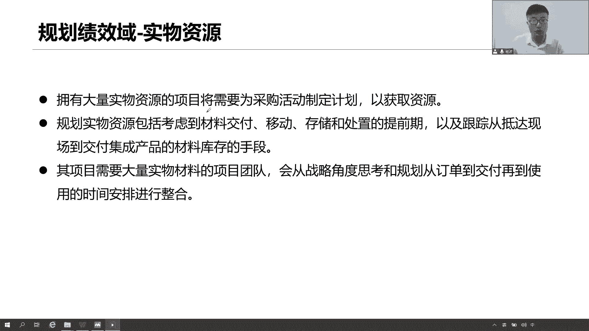
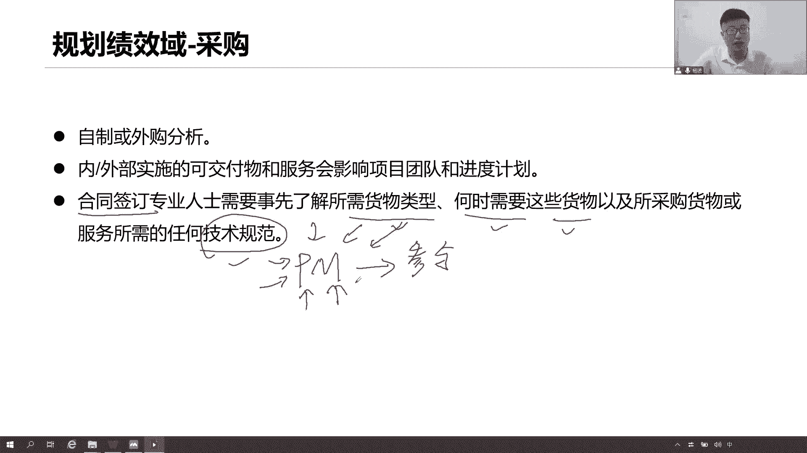
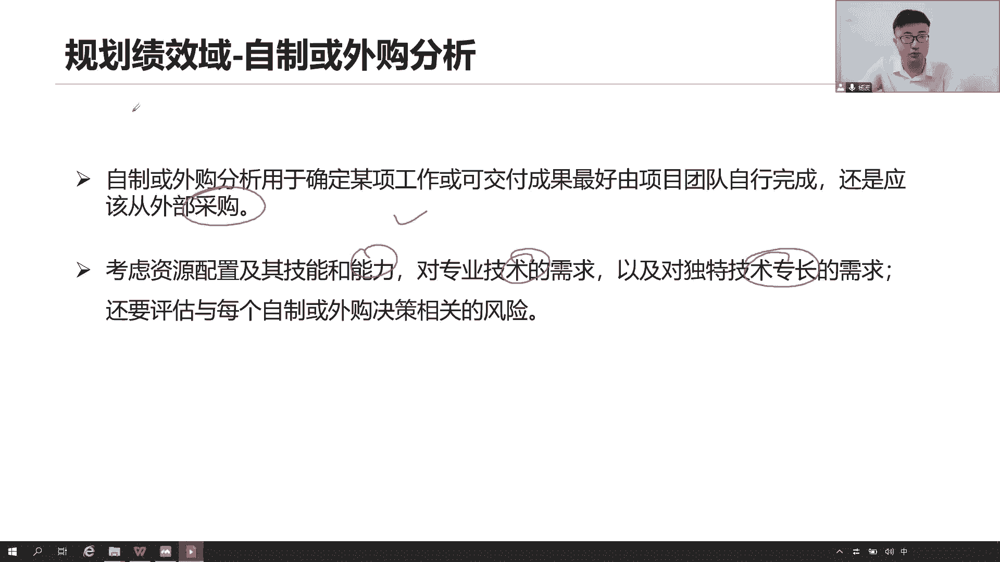
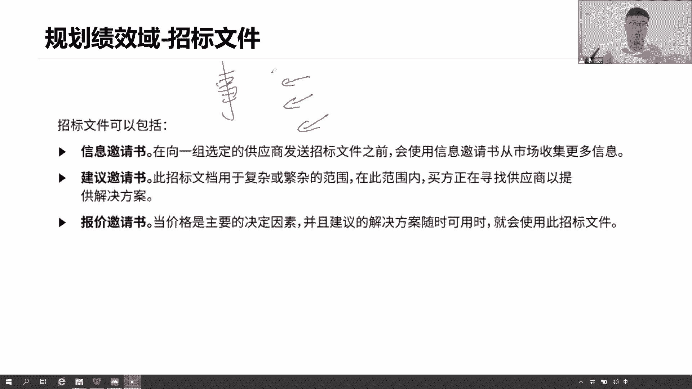
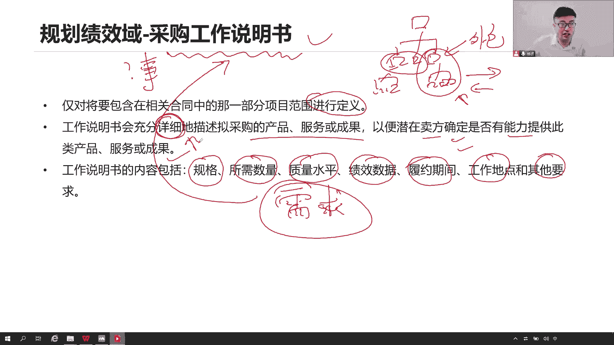
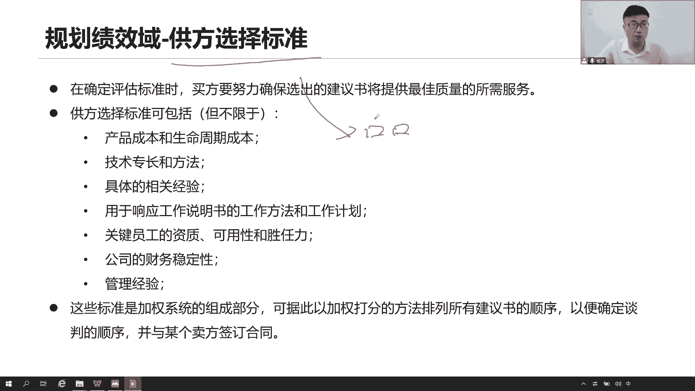
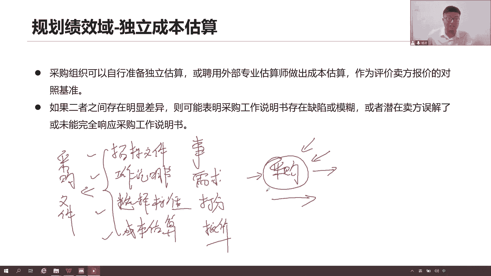
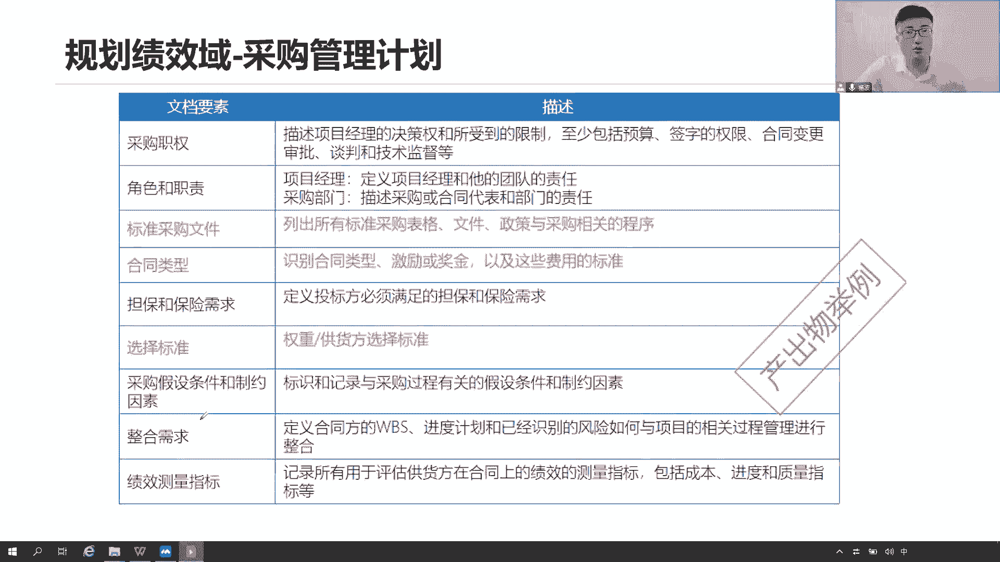

# 全新录制PMP项目管理零基础一次顺利拿到PMP证书 - P23：PMP精讲规划绩效域-采购1 - 北京东方瑞通 - BV1qN4y1h7Ja

好我们看实物资源，对于这些实物之源，其实我们要去做好管理，前期因为很多时候我们要去什么，为这个是要买大点的，大点的食物资源要去买，意味着我们要去为采购，后面还要去规划我们采购。

那马上就会讲到我们规划采购了，当然规划食物资源，包括什么各种材料交付的移动的存储的数字啊，那库存怎么处理啊，大量的什么食物材料，哪些项目团队要从战略角度去思考，从规划从什么订单到交付到使用的时间。

要做一个合理的安排和整合，其实他这句话是在说啊，有的时候咱们这个项目啊，他需要购买一些大的食物材料，一些设备，一些物料，而这些物料都是一些大件，很多时候都是大件，那么大家大家想想我们这个高架桥啊。

立交桥他下面这个墩子这个立柱大不大，好不大是吧，又大又粗又大又大，立柱在上面，这都是大件，完全搭建，大家想一想，我们去找供应商生产这个大件，购买那个大件是一个晚上全部给我拉过来吗。

可不可能哪一个供应商有这么牛，我们需要几百个搭建，需要几百个立柱，咱们这个立交桥这个高架桥这么远，这么长，他一夜之间全部给我送过来，不可能他们做都做不到这么多，一个大件，一个立柱好长好长的时间。

从生产到运输到部署很长的时间，这个时间你要不要考虑到你的进度里面去啊，要不要考虑咱们这个项目最终要交付是吧，那你这个高价小点做完啊，你这个地价小点搭建起来，你这个下面这个立柱这么大。

一个一个的从生产到运输到部署的，造成什么维护，你还要刷什么题之类的，早餐的时间，所以我们要充分的去做时间上的安排和整合，考虑清楚这些大件从哪些供应商，从什么地方呢。

交付过来怎么交付过程当中怎么去移动传输，是飞机运过来还是货车运过来，还是轮船运过来，运过来之后放在哪里存储，是不是我们当前怎么去把这个时间安排好，所以这是我们未来将这个采购规划的时候，还要去考虑的问题。

尤其是购买大量事故资源，好说采购采购就来了，采购呢有一个大前提，在规划采购的时候，首先要记要记住一个点，我们先做一个分析，什么分析呢，自制那是外购，注意这是一个分析方法啊，自制或外购分析这个事情。

我们自己来搞定它，还是说外包数据交平台说，那我们这个分析怎么去分析呢，说的通俗易懂一点啊，就是看起来我们自己做花了多少钱，如果外包要花多少钱，看成本吗，这是最简单的方式，但除此之外。

你可能还会看一些什么质量啊，风险啊等等，都会有考虑很多，以此来做出一个分析，说我们到底是自己玩，还是说我们自己去买买设备，买材料，那你最终得做做出一个决策，这个决策就是自制或外购决策怎么做。

另外部的实施的可交互和服务，可能会影响项目团队和进步的计划，如果我们自己做，那可控啊，但是如果说是你交给外部去实施，那就意味着有供应商这个供应商，你觉得我们作为甲方，能够有权利去控制乙方的工作吗。

你想想如果你是一个甲方，你有权利去要求乙方啊，怎么去管理团队，怎么去控制绩效，怎么去招招聘他们的资源，如何去管控他们整个团队，你没有这个权利，你无非就是通过合同来管理当前供应商是吧，那这个合同是合同。

它具有法律效力，那如果说供应商的绩效有问题，你怎么处理啊，就它会影响我们整个项目的进度，要充分的考虑当前我们的项目团队的规模，以及当前我们整个项目进度都会受到一些影响，充分的考虑合同签订。

专业人士就是签合同，这个人他需要事先了解，咱们这次需要买什么货物，什么类型，你什么时候想要啊，这些货物怎么去交付啊啊，以及任何相关的一些技术规范，所以作为项目经理啊，你不一定要去参与到什么啊。

不一定要去做什么合同的签署合同的谈判，只不过呢你需要参与到这些工作里面来，因为这些工作需要我们更多的了解，这些货物的类型，实践交付，各种技术规范，那这些是你得提供给我们的，你要什么资源。

什么时候要要什么规格的，什么属性的，什么类型的资源，你得告诉我们采购人员，让我们采购人员根据你的要求去做这个采购，去谈这个合同，去签这个合同，买买买设备，就这意思，就项目经理，你前期的工作还挺多的。

尤其是在规划采购里面，要写你的各种采购文档相关的一些内容，把你的技术规范质量要求。

各种需求写清楚好，你看那个自制或外部分析，他怎么做自制或外部分析啊，其实就是为了确定我们的某项工作或者成果，是交给团队来做，还是说交给外部去采购，这就是自制户外和分析自己玩还是外面去买。

考虑到资源的配置，技术的能力的，专业技术的要求以及独特技术的专长，我们还需要考虑到每一个字怪怪的一些风险，在这里面相关的风险如果是买的话，有什么风险，如果自己做有什么风险，我们的能力，我们的技术。

我们的专业程度能不能达到这个水平，如果达得到，当然我们自己搞定它是最好的，可控吗，如果不能达不到的话，找外面的人采购买，你们的服务买你们的成果就可以了啊。

好我们要开始做这个招标文件，那就是要去项目经理啊，你要去做一些事情的，要去写我们很多企招标，因为你前期要买嘛，你既然决定了要买，那你要告诉我们你要买什么东西，你要做什么事情，于是乎我们就要去写招标文件。

招标文件呢分为这三类信息，大家看啊，第一类信息信息邀请书说那行，我们向一组选定的供应商去发送招标文件之前，先发邀请书，收集更多的信息，这个消息就收集是什么，收集的是我们产品信息。

因为它的叫做信息邀请书啊，以及收集的是你们当前供应商的信息，你们公司的规模流水吧，大致的一些情况，以及你们这些产品的情况发给我，我先看一看，我想了解了解你们各个产品的信息，咱们举个例子来说吧。

比如说我们现在我们是一个政府机构，我们是甲方来，我们是政府机构，我们现在呢要搞一个事情，搞啥事情呢，你们要搭建一个安全的内网环境，内网内网啊，注意啊，政府机关的内网，那涉密安全程度一定非常高。

于是乎我们要买什么，买交换机路由器，防火墙，审计各种服务器啊，好多设备，我们目的是要去打造一个安全的内网环境，那么请问这些设备，请各位供应商，你给我们提供一下你们的公司的信息，和这个产品的信息。

比如说交换机路由器，你把这些信息产品发给我来看一看诶，你们的技术规格啊，你们的产品信息，你们的这个这个各种属性配置，我了解了解你们的产品吗，可不可以啊，把信息发给我，这就是我发给供应商。

让你们把这个信息发给我，甲方，我来看第一个要求书，信息要请出，我关注的是产品和你们公司的信息，第二个建议邀请书说那些用于复杂的范围，在这个范围之内呢，买方正在寻求供应商的，以提供给我解决方案。

请给我解决方案，什么意思，我们组建这个内容，我们跟你说，我们要这些各种设备，把交换机路由器防火墙，请问各位供应商，你我这些东西应该怎么去布局，怎么组网，我给你一个场景。

希望你们能够帮我搭配出一个最好的解决方案，交换机部署在哪里是吧，防火墙部署在哪里，这些各种审计系统在哪，在哪些主路上面说盘子上面你得给我说呀，怎么解决呀，给我一个解决方案，我要的是你们一个组网方案。

我要几台交换机，要几台路由器，要几个防火墙，说给我解决方案，我来看你们的这个方案如何，第三种招标文件说，当前请各位我也不要你的信息，也不要你的解决方案，我很直接说钱，各位你们给我报价就可以了。

价格是我这个主要考量因素，请给我这个价格，把你们的报价我说了，我要买这些一系列设备，买三个买两个，买一个买十个，买20个，请给我报价，就这意思，这是三类招标文件，所以招标文件一总结其实就是告诉我们。

以防你要做个什么事情，你要怎么做，什么事情就这么简单，给你信息，给你方案，给你报价就这么简单，很粗略是吧。

做什么事情，但是接下来还有一个内容吗，这些事情我们要做各种政府的主管，我们当前要一些详细的工作，怎么去做，有哪些需求，有哪些标准，什么时间交付，你的质量要求是什么，你得告诉我们。

我们才知道这个事情到底应该怎么去做，所以我们要对当前的工作做一个详细的描述，对我们大家采购的产品成果，也要做一个详细的描述，这个描述不会写在招标文件里面，他只会写在我们的采购工作说明书。

它是对我们当前外包出去的那一部分，做一个详细的定义范围，做个详细，有哪些工作要去做，就说我们WBS，其中前两个是我们自己做，我们可以自己做内部分解，你是外包出去的，那么外包数据我们可以进一步的分解。

完全可以啊，因为你对这个账户，当前外包出去的工作范围是很清楚的，你可以做个定义，可以做分解，然后把这些内容告诉我们工商，你们要做这些工作包，我们会对这些成果，对这些工作包做一个非常详细充分的描述。

让你们了解，让你们这些潜在的供应商能够确定，能够了解是否有能力完成这个成果，完成我们要求包括什么，当前我们产品的规格所需的数量，我们的质量要求以及对你们的工作绩效信息，质量信息及绩效。

还有呢什么时间交付，在哪里交付，怎么交付，好多好多详细的需求，我们统称为各种需求，各种需求，全部都会写在我们的工作说明书里面去，就是招标文件，我会告诉你我们想做什么事情，但这个事情怎么做，有哪些需求。

请参考我的工作说明书，我会非常详细的跟你们说有哪些要求啊。

这是第二个我们的招标文件，第三个招标文件，你说我们要选择供应商，请问怎么选，是不是拿出一个定义出来，得给我一个标准，我们选供应商，看这个供应商的规模吧，这个工厂的规模，人力的规模，财富的规模。

资金的流水，当前你们这些管理团队资资格公司的资质认证，有没有PNP证书吧，没有管理团队有没有高效的证书，有没有CISP的安全证书，你你跟我说，你没有什么ISO27001，你们没有CSP。

你觉得我会选你们吗，肯定不可能需要你们干嘛，你们连最基本的一些安全的设计资质都没有，不可能选择吧，这就是我们考核当前供应商的选择标准，来考虑过你的质量要求，你的成本要求吧，你这个是资金流水的。

公司规模是个工厂有100平米，然后你的公司你那个开发团队有80人，100人以上团队管理团队的资质什么，有没有什么认证，你们公司的资质有哪些，好多好多都得去考虑，这些都是我的选择供应商的一个标准。

所以前提啊我得把这些标准拿出来说清楚，当前我会从哪些维度来考核各位供应商，未来我会用这些标准来给你们做加权打分的，是来给你们做加权打分的，因为有这么多的供应商，他们你们肯定会来投标。

那我收到这些标书之后，我要去开标和评标，请问我怎么评标啊，我如何评标，我找专家一起来评标，那么专家如何评标，来项目经理，我把这些标准给你们专家，你们自己针对这些供应商一项一项的核对。

来进行加权打分与评标，最后我们选择出一个得分比较高的供应商，我们来和他们进行一个谈判，谈什么谈最后的什么合同啊，如果谈谈妥了，签订合同，你就是我的正式供应商，所以我说这个标准显得很重要。

那么供应商你们拿着这个标准的时候，你们自己可以衡量，衡量我们这个企业符不符合你的标准，我们可以自己做一个偏离，正向偏离还是负向偏离，我们可以自己给自己打分，以确定一下放心，我们有没有这个底气。

有没有这个能力，有没有这个技术来完成这个项目。

第四个独立成本估算，作为甲方来说，我们应该首先对我们的目标成本做一个估算，也是一样的，做一个估算，目标成本也叫独立成就，这么踩我们自己，甲方就先给自己给个预算出来是吧，首先自己先准备一个独立估算。

你可以是你们自己内部去估，也可以去找外国的专业，专业的团队去给你估算这个成本，大概这个项目需要多少钱，报价就是你自己先做一个预算，然后呢这个预算用来评价什么，未来供应商给你的这个报价是不是合理。

是不是当前它是能够符合你的预算要求之类的，你要做一个评评估，做个评估，就是说我们说摊成本，其实也是在当前能去选择供应商的标准，所以为什么会有这个报价邀请书呢，这个报价邀请书就是看报价。

各位国家和我们专业评估出来的成本，差距大不大，如果差距太大了，差距太大，什么情况，一我们自己的工作说明书写的有问题，让他们理解，让他们误解了，我们计划花10万块钱买笔记本，供应商说要不要这么多1万块钱。

我帮你搞定问题，问题在哪里，大家有没有发现问题在哪里，我说10万买笔记本，他说1万买笔记本，你可知道我这个10万是个啥笔记本电脑笔记本，你这个1万是个纸质的笔记本，那能是一回事吗。

是说明咱们在写这个笔记本是吧，但这是极端的一个例子，很极端，只是跟大家跟大家去描述这个例子而已，就是我们自己写这个工作说明书啊，一定要够清晰够准确，不要太模糊了，别人会看不懂的，然后呢，第二种情况呢。

就是完全没有响应这个工作说明书，意思就是说我们这个潜在的卖方没有完全响应，工作说明书，我们当前外包出去的这个工作包有三个工作包，第一个呢是画这个设计图，第二个呢是盖楼盖楼盖楼房盖楼。

第三个呢是因为我们这个楼房是一个精装房，所以你还得装修啊，这个精装房现在精装房也挺贵的，我们报价30个亿，来谁来搞这个事情，有一个供应商说我们一个亿搞定它，这个差距有点太大了吧，他说设计图我们不光盖楼。

我们不做，我们就是一家小小的装修公司，我们只负责装修，你看这是不是就是卖方，他们并没有完全的响应，我们的工作包没有完全响应，那你的报价肯定跟我差距就比较大了是吧，那后面我们做一个假话来说。

肯定会充分的衡量到底该怎么去选好，这就是我们当前我们说在项目早期，我们的规划采购的时候，要提前准备好这四个招标文件，第一个就是我们当前我们的招标文件，采购文件，四个采购文件，招标文件我们有四个采购文件。

这四个采购文件呢，第一个呢就是我们做招标文件，招标文件告诉我们当前我们要做一个什么事情，告诉供应商，你们要做什么事情，第二个呢就是我们的工作说明书，那这个工作说明书是在告诉我们，乙方这个事情怎么去做。

我们的需求是什么，第三个呢就是我们供方选择标准，我们怎么去选择我们的供应商，我们得拿出一个标准出来，为了这个标准是来给我们供应商做打分用的，第四个呢就是我们一个成本估算，我们的成本估算是告诉我们。

当前我们自己先得有个心理预期，然后呢根据你们的报价，我们来评估当前你们的报价是否合理，评估你们的报价，这四个文件打包到一起就是我的采购文件，对于早期来说，项目经理啊，你得告诉我们采购部门的同学们。

采购部门的同事们，我们应该怎么做，这次采购你的要求你的事情是你的标准，你的这个预算是多少，告诉我们未来这个事情也交给我们采购部，我们帮你搞定这个事情，你放心采购，它可以当做是一个专门独立的一个项目。

来开展一个独立的过程，一个独立的项目去做都可以，没问题，因为毕竟这个事情他比较专业吧，还涉及到什么法律的法务的项目经理，你可以参与到这个过程里面，但前提是你得先把这个事情告诉我们。

才能走招投标的流程啊，所以我们会形成一个采购管理计划，采购管理计划其实简单理解一下，咱们这是用什么合同啊，这个有哪些采购，有哪些采购文件，招标文件谁来负责这次采购啊，职责什么角色，什么职权是什么。

我们供方选择的标准有哪些，这就是我们前面的时候分析出来一系列内容吗，在这里面是吧，还有呢我们的测量标准怎么去测量，我们未来合同上的一些要求，我们可以提前拟定新合同啊，那为了再和我们合同。

再和我们的供应商一起来签订这个合同，都是可以的，那这些合同里面会涉及到哪些指标写一写，而这些采购跟采购相关的一系列流程方法，还有一些标准啊，都在这里面，以及我们前期写的一些招标文件。

这些采购文件都可以作为我们的一个附属文件，加到我们采购管理计划里面去，所以这个采购文件，它其实就是描述我们当前，我们整个这个采购的过程，采购的程序是什么样子，如何去做，咱们这次的采购有哪些流程要完成。

整个采购过程。

