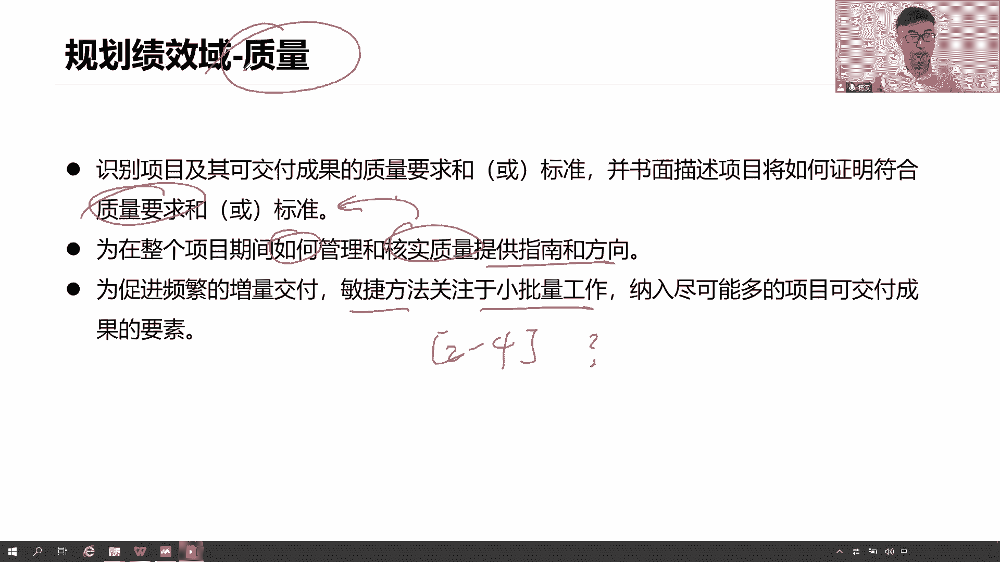
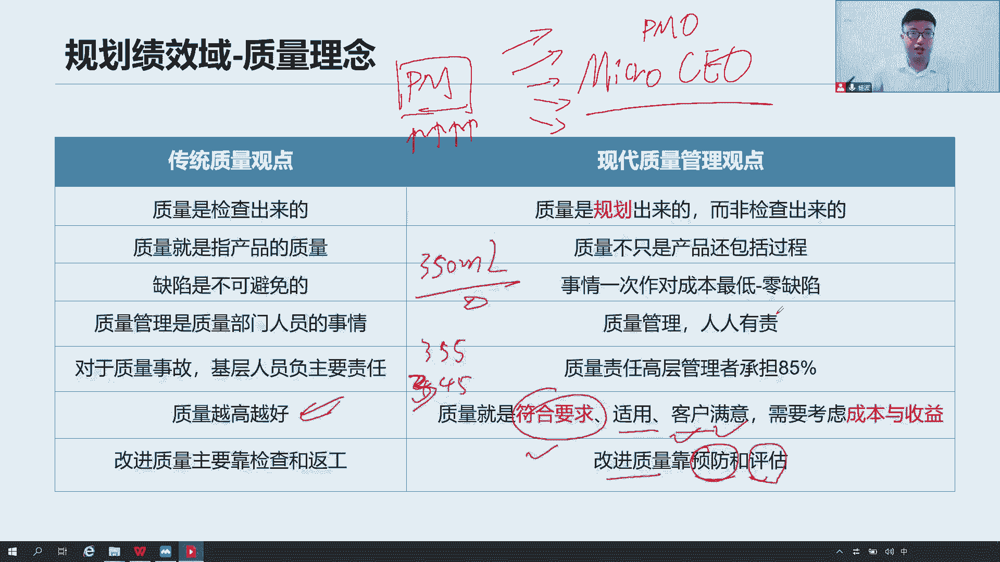
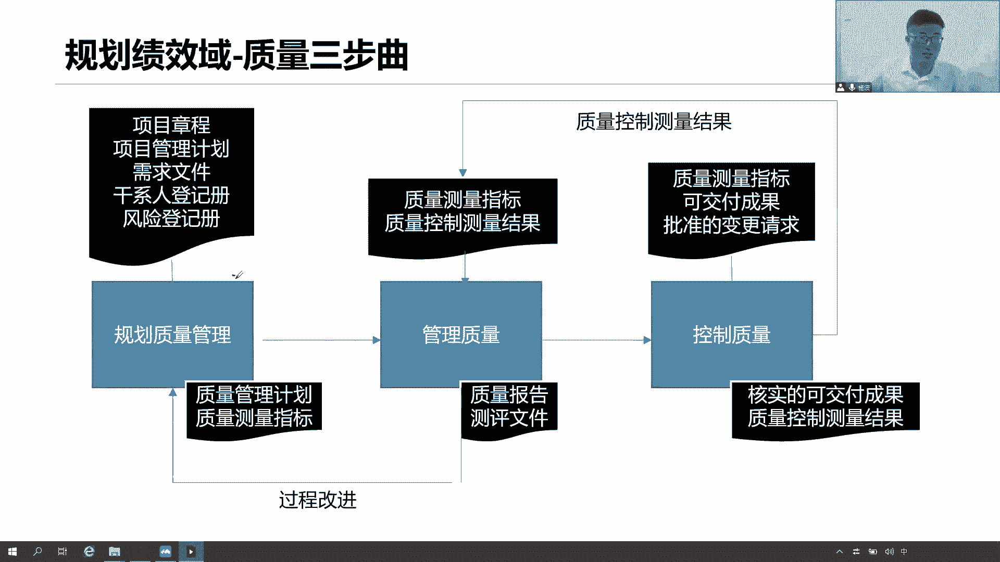
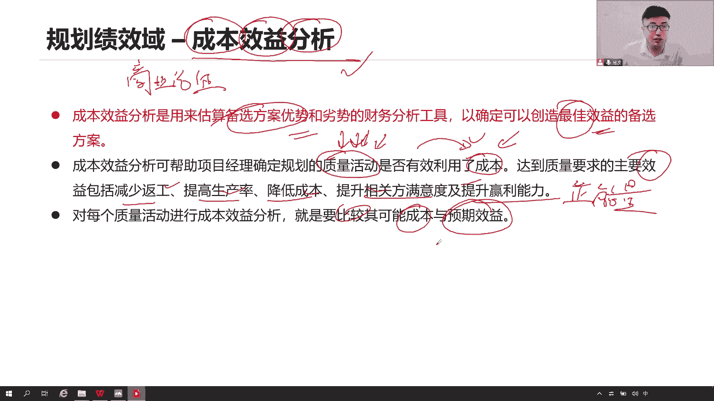
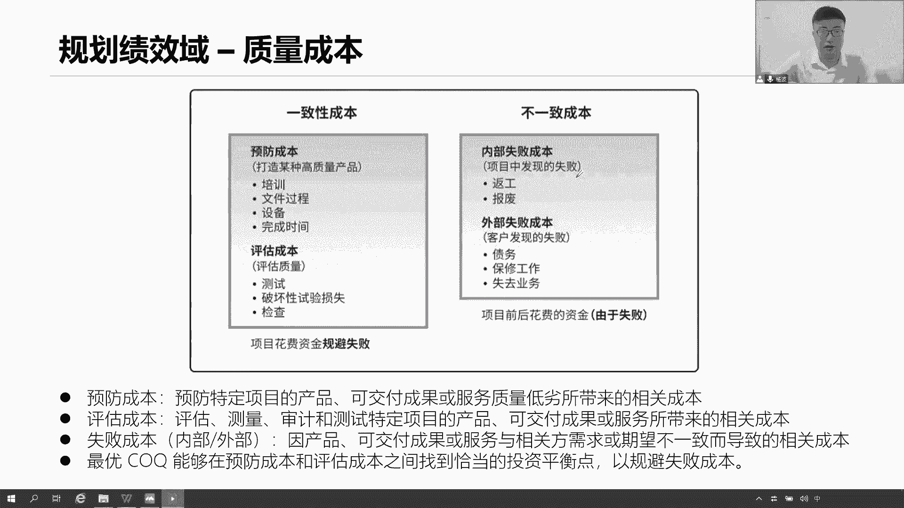
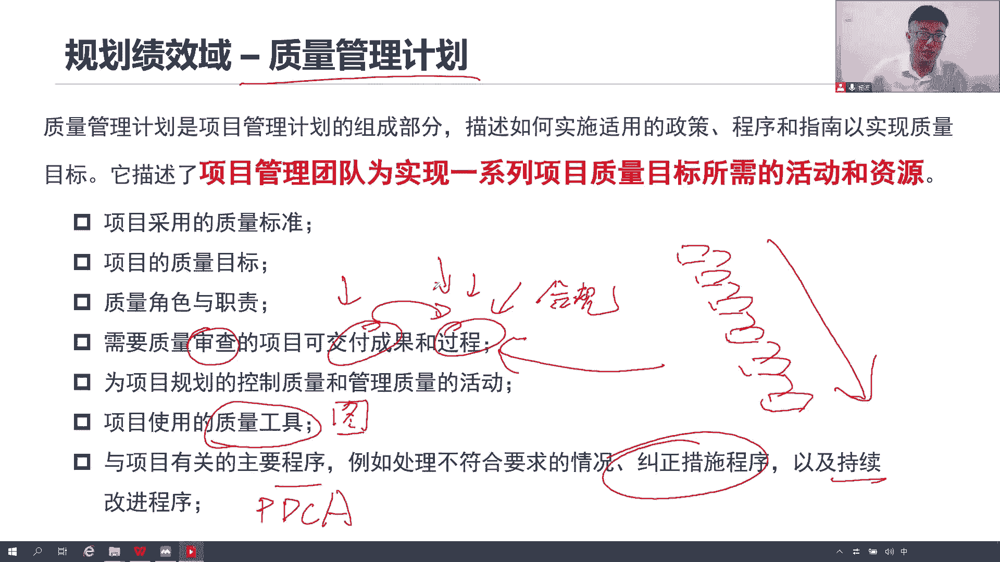
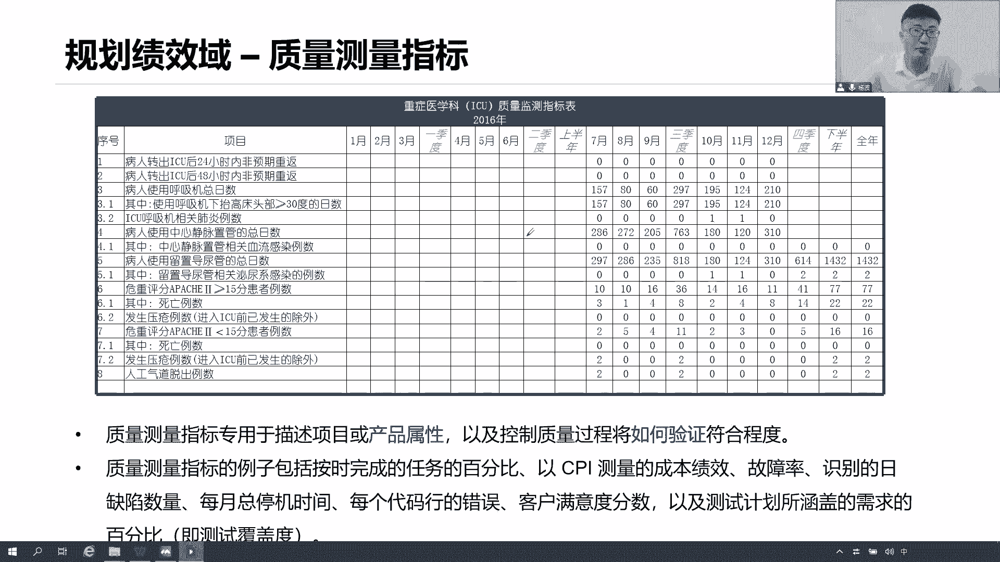

# 全新录制PMP项目管理零基础一次顺利拿到PMP证书 - P24：PMP精讲规划绩效域-质量 - 北京东方瑞通 - BV1qN4y1h7Ja

。好了，采购呢我们就先讲这。那么接下来我们来看关于这个质量的规划。质量的规划质量的规划重不重要？因为前期我们做的质量规划，首先就得告诉我们当前我们这个质量有哪些标准。质量标准，那是很重要的哦。

我们得提前识别出来我们的质量要满足什么样的标准。并且书面把它写下来我们的质量要求，我们的质量标准是什么？什么是标准啊？就刚刚举的这个例子，这是不是标准？这是不是标准？是吧。质量标准啊，国际质量标准啊。

对呀，我们当里什么信息安全，国际标准都有的这是国际标准。GB杠T是什么标准？大家可知道GB动T。啊，国家标准对国标是吧，国标也会有很多，现在国币大堆吧，学的高校数应该很清楚的，各种我们举个例子啊。

就这个这种啊，我也不知道什么，这是我们发布的年份啊，这是这个标准的一个编号啊，这这意思吧？国标。所以其实我们做任何的项目，不管你是搞这个呃建筑的啊，搞安全的，搞这个IT的，搞通信搞金融的。

包括食品的药品。你说我们这个国家的食品药品监督局，他们做什么事情？不就是拿着标准来检查我们的产品吗？是不是合规是吧？我们的食品和药品都会有它的一个生产标准和销售标准在这里面。

那么我们这个监督局就拿这些标准来检查，来审么计你哎，你合不合规合规，你继续做，不合规让你关门。啊，所以说我们做一个项目，做产品一定得符合当前一些行业的标准，国际的标准，国家的标准。已经我们前面跟他说了。

我们当前学习的是什么IC隐患，我们学的是美国的标准。然后呢再看为了在整个项目期间，我们如何去管理和核实质量而提供质南，如何去做如何做事，我们要形成一个行动指南。这个行动指南是什么？简称质量管理计划。

质量管理计划，告诉我们怎么去做好质量的管理，怎么去核实我们的质量是不是符合我们的标准，是不是符合我们的质量要求，是不是足以进行最终的验收。那么说到这些，肯定是我们内部要去做检查和测试的。

为了促进频繁的增量交付敏捷方法，强调小批量。因为2到4周，我们只能够做出一些小批量的工作，我们只能做一部分需求。来阐述我们当前的可运行产品。那这个可运行产品我们交出来之后呢。我们去吃也是为了提高质量。

为什么？因为每两周每四周加付出来一个可运行产品，最小的可运营产品目的是干嘛？我们要去评审，要去检查有没有问题。如果有问题干嘛，及时的什么改正，尽早试错，尽早发现问题，尽早找到解决方案。

尽早回复解决这个问题。这不就是在提升我们的质量吗？所以为什么要小批量交付？为了在就是为了进场。解决问题，找到解决方案，提高我们产品的质量。

那对于传统的质量理来说，我们知道说这个质量是检查出来是测试出来的，是我们这个什么测试部门的事情，不要着过开发啊，质量嘛？就是靠产品嘛，就是产品的问题有没有啊，这个质量是必不可少的，肯定会出问题。

你们直接测测试嘛啊，测试出了问题，看你们测试人员一定是你们测试人员自己不负责任，漏测。我们这个质量肯定是要越做越好啊，越高越好，越精越好。质量就是通过反复的检查，反复的反复，慢慢的发现问题。

这是以前传统的观念的做法。现在呢改变了改变，这些都不可取，这些都是以前过时的观念了。我们现代全球项目管理里面质量管理的观点是什么？质量是什么重要了，把这个规划圈出来，好好宣传。

未来我们做题一定要秉持这种观点。质量一定是规划组。也就是说，我们在制定质量管理计划的时候，充分的考虑当前我们这个产品未来如何去提高我的质量。在规划新成质量管理计划的时候，在做我们各种质量测量指标的时候。

充分的考虑我们如何去验证我们的质量。质量可不仅是产品的质量哦，我们还包括什么过程，也就是指我们的工作是否合规，是否符合要求，是否符合我们组织的政策程序和流程。

因为我们审计审计的就是我们的工作做的到不到位。不是不可避免，事情一次性的做对。其实现在很多企业他们强调什么。他们这个文化是强调。一次性把这个事情做对，不要返工，事情是可以一次性做对。

就是我们提交这个代码，希望各位同学们一次性的把这个产品的代码提交上去，不要反复提交。A，我发现这个提交说没对，我重新改改，我再提交再改再提交错了，说明当前没有检查好，请记住，一次性把这个事情做对。

写文档做审批也是一次性审批通过，不要反复的改来赶去了，浪费时间。返工是我们项目最大的成本浪费和时间浪费。我们要做到提交的产品是零缺陷的，没有任何问题，你找不到问题。那怎么做到灵确性呢？

所以我们才会说质量是规划出来的嘛？在早期你在做规划，在设计的时候，你要充分的考虑这个质量。你要知道你这个产品做出来的时候，不是就做完就可以了。你要知道这个产品要交给运营的，你要不要考虑他们的可维护性啊。

要交给客户去使用的，那你要不要考虑它的可易用性啊，可用性、易用性、可维护性、可操作性，这都得考虑啊，兼容性、安全性。所以你说这个产品在设计的时候，你要不要考虑这些各种特性啊，规划出来，规划出来。

质量管理人人有责，不是只是某一个部门的人员人，人人有责，全员担责。整个项目团队所有人员担，包括高层人员，他们承担更多的责任。怎么去理解？就问大家一个问题啊。我们这个测试团队发现了大量的问题。首先。

看看QA找QA呀，是不是过程出了问题，过程没有，如果过程有问题，那就找我们规划。因为质量本身是规划出来的，来，找你规划你这个计划怎么定的？我们是按照你的计划来开展我们的QA工作了，QA工作做的不到位。

你的QC工作肯定会出问题，对吧？那么这个质量管理计划我是怎么定的？我是按照我们公司的质量政策来定的。按照公司的这种政策，大家想想，我们前面讲的组织过程资产里面是包括了政策程序和流程，这些政策谁来定。

谁来定我们的政策，一定是我们公司高层，是不是肯定是我们公司高层啊，PMO战略型的PMO公司的高层CSO。你们来定的公司职任责是你给我们定的政策，按照政策我来定计划，按照计划去做工作。

按照工作去完成的成果。所以现在成果不好，最终的责任是谁？是不是我们的高层，而且你要负承担更多的责任。这个背锅到底谁来背啊？学完这是不是应该理解了？结果不好，产品不好，公司高层人员，你们没有适度的关注。

你们没有适度的清廉，没有去关注到我们当前我们的质量。公司产品质量。我们当前的政策是什么？是做一个高精建的工，是做一个高精建的一个项目，还是做一个豆腐渣工程。你们自己去衡量。但是真的就是高层去背锅吗？

其实还是谁。还是谁？各位做项目应该很清楚，应该深有体会，对吧？那为什么最终还是我们请思考一下PMI给我们定的职业道德责任放在第一。责任。尊重公正、诚实。为什么把责任放在第一啊？请不要甩锅。

请积极主动的站出来承担责任，尽快的解决问题，推动问题往前开展工作。体现出我们的责任感，用我们当前学习的项目观理的方式、方法、模型、工具流程。带领团队尽快的解决这些问题。结果不好。

是我项目经理领导方式有问题，领导力有问题，计划定的有问题，请领导放心，未来我会重新把这个计划做的更完善。这话说出来，领导听的好开心啊，小杨不错哦，来。未来这些项目都归你管。一次的失败，不代表永远的失败。

是不是虽然理论上来说对吧？公司高层有个问题，但是实际上呢请大家秉持一个积极主动的责任心做项目啊，记住把自己的眼光格局放高一点。我们说了吗？我们现在是一个项目经理，没错，未来我们就是一个。这样的经历。

这样的高层是不是啊？算是PMO啊，战略型的PMO也可以啊，这都是我们未来发展方向。所以当前我们。工作做的不到位，说明是我们当前能力还不行。当前正是锻炼我们管理能力的最佳时机，请大家珍惜，务必。有问题。

领导说出你的问题，那是在推动你。尽快的成长，推动你尽快的往前发展，尽快的找到你的职业发展的路线。不要去甩锅。那么看下面质量符合要求就可以了，符合我们当前客户的市场要求就可以了啊，不是说一定要做的非常好。

我们就说这个矿泉水吧，农夫山泉有点甜，这个矿泉水350毫升的矿泉水是不是一定要一滴不多，一滴不少的？这个按照这个标准生产出来才可以卖出去。请问我355毫升可不可以卖？我345毫升可不可以卖也可以呀。

你不影响用，只要符合用户要求，只要符合市场的要求，客户满意。就可以了，没必要做的这么精这么精准。然后呢，最后改进质量，我们靠预防，靠评估，靠我们靠我们评估啊，靠我们预防预防预防规划规划。打进工作质量。

这是工程质量理念。

那么通过这个质量的管理啊，我们说一共有三种方式，一个是我们QP做质量规划，一个是我们QA做过程的管理，一个是我们QC控制嘛conttrol做我们的质量结果的管理。都PQAQC3个管理过程要从实开展。

以保证我们质量工作。那现在我们既然是规划规划，意味着我们现在就在做这一。那么未来我们后面会专门去讲作业工作，做些工作怎么去做。那先讲这个QQP规划质量。规划质量怎么做的呢？

它其实啊就是把当前我们说高层级的质量要求拿过来看一看项目管理计划以及当前有哪些质量需求，谁给我提了一些质量需求，干系人啊这些干系人登记册，里面会写当前我们干系人每个人给我们提了哪些质量需求。

还有呢项目上面有没有哪些风险。啊这有些文件大家可能还没看到。没关系，我们后面会专门讲。那就这些文件他们都是要帮助说当前我们有哪些质量需求，高层级的需求，有哪些风险，谁给我提的这些质需求。

以此来形成我们的质量管理计划和我们质量测量指标。

那么只能管理计划。怎么去做出来呢？我们来一步步看。首先第一步，先啊我们说了这个质量并不是越高越好，我们得按要求来去做这个事情。只要符合市场要求，符合我们客户的满意就可以。所以呢我们会做一个成本效益分析。

就是我们到底投入多少的质量成本进去啊。我要看我的效益，看我的收益，我要选择一个最好的方案出来。我看我这个成本到底投入到多少合适。那么这个词用它这个成本效一分析想想我们前面在哪地方专门讲的过。

是不是商业论证啊？他想商业论证说，当前有很多个备选方案。来应对当前这个业务需求。那么到底我选择哪一个方案呢？用的就是成本效益分析。说我们既要看投入的成本，也要看产出的收益和效益。

最终选择一个性价比最高的一个方案出来。因为它能够花最少的时间，投入最少的资源，最快的产出我们的这个收益啊，我们投资回收期最短，我们投资回回报率最高。那这就是一个最好的方案。

所以成本效益分析就是帮助你去选择各种备选方案里面最好的那一个考虑成本，考虑收益。那么就现在这个成本就是我的质量成本。我们是不是真的有为了开展这些质量活动，我们肯定会花成本。

那么我们是不是有效的利用这些成本来规划我们的质量活动呢？那就要看最终我们所产出的收益的这个收益包括什么，包括什么减少返工，提高生产率降低成本，提高买度，提高产能。反正不管怎么说，都是满满的正能量。

对吧如果说能有这个正能量，好，我投入成本没问题，我去做。因为我能够看到效益啊，有效益，我为什么不做呢？做。但是如果说没有效益，通过分析，你发现没有产生这些各种的效益。

你觉得你还有必要去持续的投入到各种的质量成本进去吗？有没有必要有没有必要再去开更开展更多的质量活动，花更多的钱去买更高性能的服务器，买去招这什么高级的工质量工程师QA工程师有必要吗？

你要看预期的收益还有没有啊，你就是比较当前你投入的成本和预期的收益能不能够达到平衡。

有收益我投入没收益，我干嘛投入？那说这个质量成本有哪些质量成本，我们来写分析分析，它分为这么四类。第一类叫做预防成本，来看哪些。就是指当前为了预防我们产品和交务服务质量低线而带来一些相关的成本。

做哪些事情呢？培训算不算给大家做一些质量方面的培训，质量工具的培训，质量意识的培训，都是啊。我们的这个文件要怎么去精简啊，我们要归档啊。然后呢买一些高性能的服务器设备在具体的时间完成计体的工作，做授权。

这些各种把对把？我们定义一个什么各种软件工具，各种系统来帮助我们规划我们的质量工作，这全都得花钱，花这些钱都是来帮助我们预防我们的质量，避免出现问题。因为我们做质量是规划出来，这些钱你该用就用。

你该提升就提升。评估成本呢？做测试，做检查甚至破坏性的测试都可以。测试一轮测试两轮测试三轮测试四轮。你测试的越多，你花了钱也就越多。那你有必要测试这么多吗？你要考虑效益啊，是不知道？

所以说这些都是我们一致性的成本，一致性甚至当前预法和评估。什么是非一制呢？那就是失败成本。有内部失败测试发现的问题返工。有的产品你这个测试不通过就直接报废了，还返什么公网修都修不过来。

那么各种零件在这里面如果做的不到位，那你这个零件就报废了，用不了了，这是内部失败。因为这是我们测试发现的问题。我们QC内部发现的问题。但是如果一旦到了客户手上发现了问题，好，我不失败。

外部失败有可能什么要去修，你可能要去修没错，但是关键是在于他呀，最后一个特别重要，大家小心一点。我们要考虑这个业务的问题，考虑客户的买度的问题。我们举个例子来说，就剩产这个手机。

我们QC发现这个手机上面有划痕。花10块钱解决这个问题，搞定他返工了。如果说是客户，他收到这个手机了，发现哎呀你这个手机上面怎么有划痕呢？这个界面上面你也是花10块钱搞定这个事情。请问这2个10块钱。

他背后的意义是一样的吗？客户发现问题。不满意。满意度下降了，认为我们公司生产产品有问题，他为了就不和我们合作了，不和我们合作丢失业务。市场占有率丢失了，品牌知名度降低了，我们的声誉，我们的商誉都受损了。

多么严重。是不是啊？所以得考虑啊，即便说当前我们可能会花更多的钱去做这些事情，但是要思考一个道理，要思考点能不能够接受他。会不会有这样的一个成本在这里面？不是说你当前哎这个失败成本，我们返工啊。

花10块钱搞定的，而你这个时候做测试要花要花100块钱才搞定，划不来。那你有没有考虑这这个因素呢？对啊，大家不要着急，有的时候我们题目场景里面会说，领导有些关键领导说咱们这个测试不要做这么多。

因为时间很紧张，做一半就可以了，甚至不做。说是简单做一做就可以了。像这种牺牲质量来满足我们的进度，满足我们的成本，满足我们的资源，你觉得可取吗？先不说可不可取，我们先按照正常的管理思维来说。

先把前面的成本效益分析。和质量成本分析，我们都先做一做，看一看当前有哪些质量成本能不能够产生效应。如果我加强测试会不会产生效应。如果我增加我的预防成本，叫做培训，能不能够产生计定的收益。

先把这些竞争工作分析分析。我们也不是说越多越好啊，这个预防成本和评估成本。我们是希望在预预防成本和评估成本之间找到一个平衡点。避免失败成本。是那这个平衡点怎么找呢？你通过成本效益分析啊，刚刚讲了。

你找到这个收益点，如果这个收益点有，那就继续投入。如果没有，那就找到这个边际点，找到这个平衡点。就这意思。所以我们尽可能多的呢去投入这份这部分内容，然后来避免这部分内容。

其实跟我们现在学习PNP也是一个道理大思考下。实么是预防生的。看书算不算？看视频算不算算啊，这都是预防什么，帮我们打好基础，巩固知识点。什么是评估成本？刷题。你要验证一下你这个知识到底掌握没有掌握。

你测试一下，你验证一下你的这个题做的对不对，这评估成本。什么是失败成本？还有这个题这个评估成本我们市当降低降低，提高预防成本，降低评估成本。那找到平衡点啊。所以很多时候大我们大家说啊。

百练的刷题真的有用吗？思考一个问题。然后呢，避免内部失败，什么是内部失败？比如说哎我们后面可能会有一些模拟题，章节一个综合题。模拟真题。这一题你如果模拟题，比如说我们定的是125分通过。如果你没有及格。

没有通过，那就是内部失败。没关系嘛。我们总结经验，我们重新我们重新反工，我们重新学习，我们重新看书，我们重新重新刷题都可以。但是如果到了最后考试，PMI发现了你没有通过考试。那这个就指能。交钱。不考。

这就是你的外部失败成本。所以大家想想学习的道理也是一样的。你要想提高你的学习质量。这些重不重要，特别重要，这些其实也很重。但是我们说这个内部失败和外部失败要尽可的去避免，对吧？啊。

所以我们的质量管理计划有哪些？来一些总结了。基于当前面我们的分析，我们做了质量成本的分析，成本效益的分析，当前要做哪些提高哪些工作。接下来我们把我们质量管理计划定出来。首先。

质量管理计划肯定是项目管理计划的一个部分，它是一个子计划，也是如何？其实这个如何贯穿所有贯穿所有的计划都在这里面。然后他还描述了当前我们项目管理团队。为了实现项目目标而开展一系列活动和资源。

就是我要开展哪些质量活动，这些质量活动，我们肯定会写在我们的质量管理计划里面，这些一系列的质量活动，做测试，做自动化测试，做手工测试，做检查，是吧？这些都应该写进去，做审计做活动。

做过程的审计全是我的质量活动。那么开展这些质量活动，我们你肯定需要人力资源和物质资源啊，人力资源哪些角色，哪些职责？我需要一个测试经理，我需要1个QA工程师，我需要10个测试人员，每个人的角色。

每个人的职责说清楚。好，然后呢，大姐。这个工作质量工作，我们的整体的标准大的标准是什么？是遵循国际标准，还是遵循国家标准？按什么地方标准，按是行业标准写清楚。遵循smartt原则的质量目标衡量出来。

然后呢，需要检查的哪些成果写一写，哪些成果需要检查哪些过程需要检查开发过程检不检查，要不要做审查，测试过程要不要审查，它审查是过程哦，主要审查是过程啊，既对我的结果做审查，也要对我的过程做成。

因为我们知道质量，它既包括结果，也包括我们的过程工作做的到不到位，你的需求分析。把你的变更流程，你的这个设计流程，你的分析流程，你的开发流程，你的测试流程，你的归档流程如果全都要去做去做起来。

那么哪些过程要检查写进来，以便于未来我要去审查呀，对吧？有的时候你就发现某些过程做的不到位。大家觉得这个过程花了很多时间，因为这个过程并没有纳入到我们这个质量管理计划里来做审查。所以你应该把它加进来。

你为加进来就得改计划。为了以便我们去更好的去验证你这个过程做了是不是合规，是不是符合我们公司的政策流程和程序，我们看的就是你的合规性，你的过程是否合规，结果不好，一般来说是你的过程出了问题。

如果你是检查结果还是检查过程，你得用一些工具质量工具，把后你的预估图、流程图、直方图、丙图、闪点图控制图。好多图我们后面都会以看到啊，这些图都是我们的质量工具。以及当前还有哪些主要的程序。

比如说发现的问题，怎么解决这个问题。问题的处理的流程是什么？测试发现的问题先交给谁，跟开发确认一下，开发觉得有问题就自己改改完之后再重新提交这个问题，但交给测试，去重新回归测试，然后再关闭这个问题。

你把这个流程说清楚。PDCN怎么玩？我们要做持续改进，既要对结果持续改进，也要对过程持续改进。那么这个PDC的程序是什么呢？在我们公司里面，我们怎么做我们的改进，我们的改进流程是什么？写一写。

还有呢质量测量指标。这上测量指标是实当是一个考量化的衡量标准。测量标准一个指标，它肯定是个可量的。他描述这个产品的属性，怎么去理解？说这个矿泉水。我们有生产矿泉水。

它一定会有一些测量指标来验证它是否合格，符合质量要求，哪些标准。PH值要不要测，一般来说这我不知道，随便举个例子啊，我也没搞过。然后呢，这个什么透明度。啊，微生物的含量。矿物质的含量达到多少啊？

透明度90%是吧？微生物的含量5%，然后呢，矿物质的含量10%或者是10到10%几都可以。但正你可能是一个区间无所谓，那不管怎么说，这是一个指标，你得把它量化下来。

在什么范围之内可接受什么范围之内不可接受，这就是一个指标放在这儿，以及这个指标这个文件它还会说怎么去验证我们大家PH值怎么验证，想想我们以前中学学的，这肯定是中学才会学。是不是拿了一张试纸？然后呢。

用那个吸管吸一个液体出来，这个滴在上面看这个试纸的颜色变化和这个卡片把这个色彩那个卡片呢去对比，看他的P就知道了，这个叫叫低定法，我记得叫低定法是吧？我们以前化学学的。怎么去做怎么去验证这个PH值。

怎么验证透明度、微生物、矿物质，你得把方法告诉我。那么未来我们这个质量测量指标是不是应该会交给我们QC让他们按照这个指标去测试去验证啊。对吧是这个道理吧。

所以这就是我们当前在规划质量上形成了两个重要的文件。一、质量管理计划告诉我们如何做事以及哪些指标和标准，用了哪些工具，哪些流程，哪些活动。第二，质量测量指标。第二个重要的文件都是一个项目文件啊。

告诉我们当前这些产品，我们这个项目有哪些属性要进行检查和测试和验证，以及如何检查验证这些各项属性。你看比如说他这里举了个例子，什么完成了百分比是吧，各种绩效故障率、缺陷率、什么宕机时间、作物函数满意度。

什么什么测试覆盖率，哪一个不是可以量化指标是吧？响应时间嘛故障率、倒换率、缺陷时间。满意度覆盖率全都是。你说我这个页面响应时间太慢了，我们的我们的指标要求是一秒响应，结果这个网页半天打不开。

等了一分钟都还没有打开，你觉得有没有问题，它就不符合你的标准啊，你敢。你的页面响应直间说了嘛，不管你是几个人，100个人、1万个人去同时点进这个页面，你至少吧。你最多重的只能个一秒，我用等他时间。

快速响应这页面。展示你的信息。那这就是我们大家说为什么很多时候这个网页很慢慢慢慢慢，说明质量不符合要求。好，这是么质量规划已经形成出了。当前我们接下来要做一些工作，按照指标去测试。

看是否满足我们质量要求啊，这是么质量的这个规划在这里。

