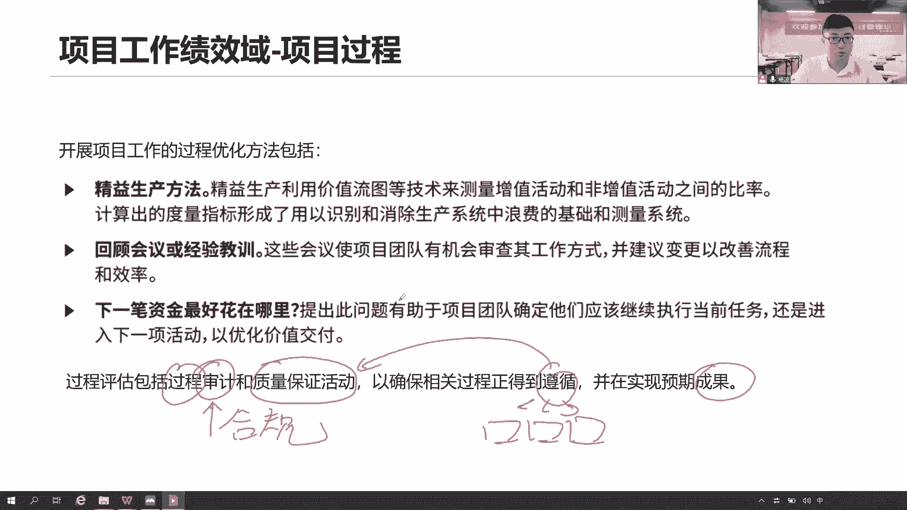
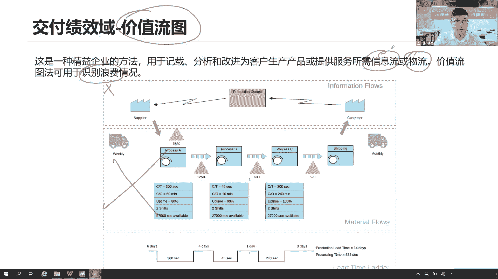
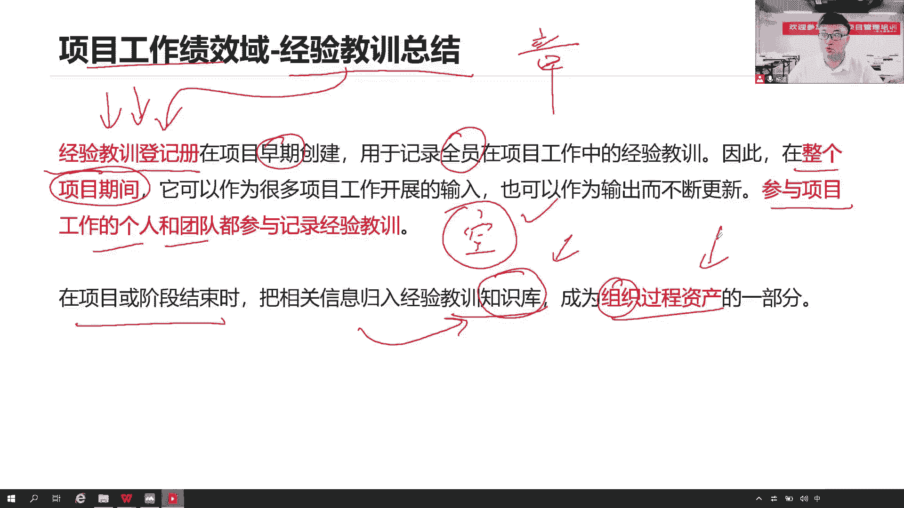
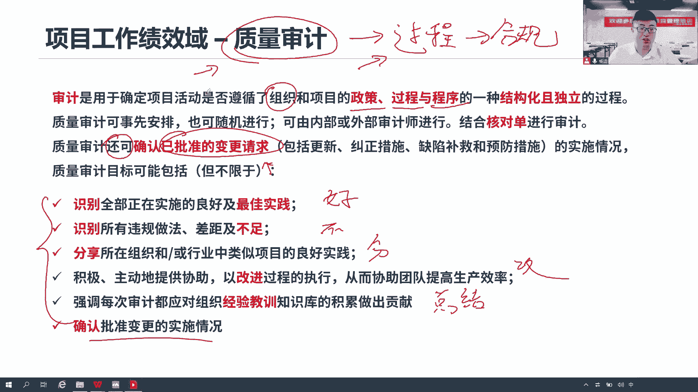
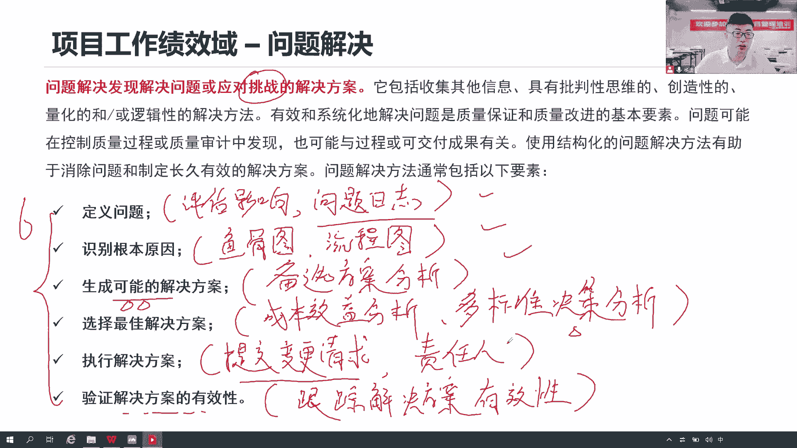
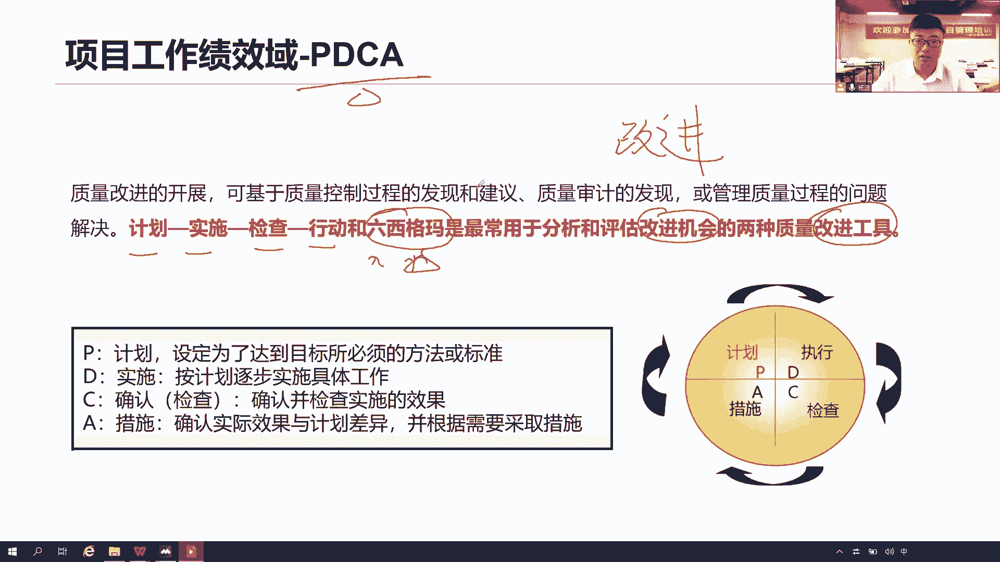
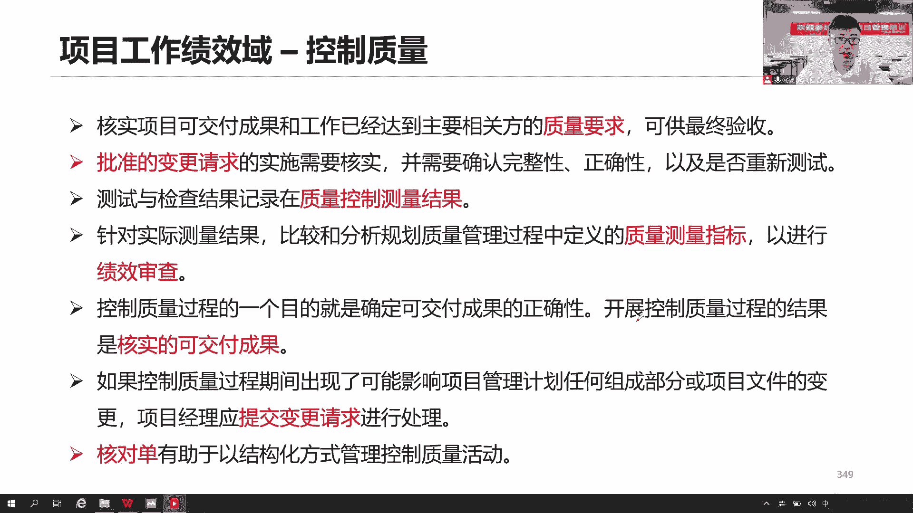
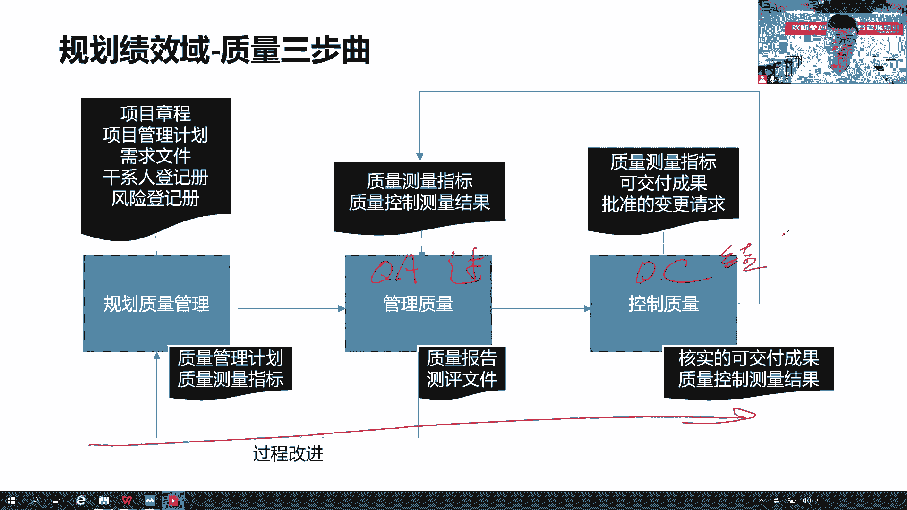

# 全新录制PMP项目管理零基础一次顺利拿到PMP证书 - P30：PMP精讲项目工作绩效域-质量管理2 - 北京东方瑞通 - BV1qN4y1h7Ja

那么说这个项目开展的过程当中，我们要去不断去优化优化，当前我们项目过程，尽可能的做到PDCA持续改进的工作，按照计划做事没问题，那这个计划可不可以改进呢，当前发现我们计划确实有些问题。

因为早期我们信息不足啊，我们很多时候我们定了这个计划，可能并没有考虑实际情况，或者当前一些环境是什么，但是在开展的过程当中啊，我们要对我们的过程做一系列优化，该怎么去画，就去发，用一些图表工具。

用工具去发现当前我们的活动有哪些是增值，哪些是非增值，什么叫增值，非增值就是指当前开展这个活动，它能够帮助我们产生一些效益，能够看到效益，比如说节约时间是吧，减少返工，节约成本，提高产能，提高满意度。

提高我们的生产效率，那这些是不是好事，正能量的事情，那就是有价值啊，增加价值，开展这些活动能够帮助我们增加价值，可能花一些时间，但是呢能够提高能够体现出更多有意义的价值，价值流程图嘛就是看价值。

那么什么是非政治活动啊，你做这个事情没有产生任何的一个效益作用，价值你只会浪费时间，只会让大家觉得看到这个工作很累很忙，会花太多的精力了，而且没有产生任何的意义和价值，这就是非增值的。

那就尽可能把这些活动给他们砍掉，不要做这个活动，就是有时候会发现这个审批流程太长了，很漫长，因为要经过情层层的审批，要等很久才能拿到结果，那你这个等是不是一种浪费时间的浪费。

那么这个等待是不是在不符合我们的经营思想，我们经营思想是要求消除浪费的，那么就需要基金节目流程，这个审批能不能快一点，一两个人审批就可以了，没必要一层一层一层一层的往上去捅，何必呢，领导们平时很忙的。

甚至有时候出差，他没有流量的，不一定能搜得到，那就是你等你怎么等，一直等吗，那你的时间不是成本吗，你的时间是不是不符合你的进度计划了，所以我们要经营生产，按需生产，减少浪费，提高价值。

提高我们赚钱的工作价值，用价值流程图大家可以看一看，然后呢在工作当中要不断去总结回顾反省，总结经验教训，就是我们要去改善我们的工作，反省检视，改善学习提炼，优化总结，这是不是要做的工作。

我们当前的工作方式是有些问题的，那么就意味着我们要去改善我们的工作方式，那么哪些问题呢，我要去找哪些改进点，哪些改进机会，把这些改进机会找了之后呢，以形成的改进计划PEDC就这么来的，先形成改进计划。

按照计划去做，做完之后去检查检查检查这个问题，要去执行，采取行动，如果这个行动采取之后还没有解决，再来一轮循环，就这样，所以一般来说会通过流程，会通过流程图，会看流程图，大家知道吗。

就是我们各项流程之间怎么去开展工作了，当前有哪些分支是吧，各项工项工作是怎么一步步去做完的，做IT做通讯做，至少还应该清楚画流程图来看一下工作，如果不了解了，我们这么去想，我们去这个政务大厅办事情。

我们经常会看到这个政务大厅前面有一个牌子，这个牌子干嘛呢，比如说你去办什么公积金，办什么房产证，先去哪个窗口领取资料，再去哪里填写资料，接下来去哪里去，怎么登记啊，去哪里去打印，打印之后呢。

把这个东西交到哪个窗口去等等，设之后，然后等到审批之后再交给谁去去处理，做盖章好了，你的工作就做完了，这是不是一个流程图，一步一步往下走，只要你把最后这个工作做完成就可以了，就是把一些复杂的流程。

不要用文字的方式来详细的描述，我们看不懂，不想看大堆文字，我们就以可视化的方式把它展示出来，先做什么后做什么，这就是流程图，把复杂的方式以图形化的方式展示出来啊，复杂的流程可视化流程图。

那这个流程图一看哎这个过程有点复杂诶，这个过程不产生任何价值，单调单调找原因吗，来这不就是改进机会吗，那么就开始说话，按照PDC的方式去做这个事情，如果发现某些过程确实他缺少一个步骤，他漏了一个步骤。

步骤不好，比如说我们从前就说按照计划去开展工作，开展这份工作，产出这个成果没问题，这个成果能不能直接交给客户去确认，去验收，能这么做吗，通常不行，客户直接拿这个成果去验收，他肯定会发现大量问题。

那么满意度下降了，我们发现这个流程少了一步干嘛，我们应该先做一个内部的控制检查，做测试，如果核实没有问题，我们再交给他做确认，这才是合理的，是不是也可以通过看我们的流程图，发现改进的机会。

以调整工作方式改进我们的流程，PDC持续改进，下一笔钱花在哪，其实就是做什么，我们到底是执行当前的任务，继续做，还是说我们进入下一个阶段去看看工作，以价值为交付，优化我们的价值导向。

当前道理夫继续做这个事情，重复做改进，做慢慢做，还是说我们尽快进入下一个阶段，持续快速的产生价值，在这个过程我们说过程的评估过程评估怎么，过程评估了，一般来说包括两个，第一个我们会做一些审计。

第二个呢我们会开展一些质量保证的一些活动，来促进当前我们过程是合规的，注意哈，这个审计质量保证其实都在说，当前我们各项工作，各项工作，各项过程是合规，合什么规啊，肯定是要遵循当前我们组织现在既有的一些。

政策程序和过程，是不是你得遵循我们组织已有的流程啊，你不能说按照我们自己的方式来开展工作，那这样的话肯定会被什么审计出来了，有问题，过程不到位，过程做了不合规，那可想而知，我们的结果肯定是不够好的。

我们的预期结果一定会出现问题，是不是，所以要遵循当前现有的什么一些过程，程序和流程政策，以保证我们项目是合规的，这样才能够反正保证我们预期的结果。

是没有问题的，你看这个价值流程图，这个图怎么去画，不需要大家去了解怎么去画这个图，我们只需要知道我们按照精英的思想，我们可以用价值流图，价值流程图也可以，这个价值就是帮助我们去分析。

哪些是具有增值的流程，哪些是具有非增值的过程，我们就是看当前去分析有没有价值，所以帮你去识别什么也没有浪费的点，如果有些非增值的活动，那就是个什么浪费，我们尽可能去找到一些增值的活动，改进增值的活动。

提炼增值的活动，放大增值活动，包括我们工作流甚至物流都可以，就是信息流啊，说白了就是一个信息流，以及我们产品的一个传递交付的一个流程，都可以以价值流程图来帮助我们。

分析当前是否有价值，是否存在着浪费，总结经验教训，我们不断的去总结经验教训，其实这个经验教训写在哪里呢，对于传统的项目来说，预测性的项目，我们通常会写在我们的经验教训登记册。

这个经验教育政策当然是越早越好，尽早的去总结经验教训，就比如说项目早期立项的时候，其实我们是不是就可以去总结经验教训了，没问题啊，他不一定非得是说在我们的工作技巧去开的，去在工作当中去执行，才会创建。

不一定早期你在开始立项的时候，哎我们这个章程做完了，我总结了很多知识，我学习了很多知识，我知道我们这个项目章程应该怎么去写了，那这些知识经验你应该写在哪里啊，赶紧写在我们的经验教训。

对于车里面总结知识嘛，好把它记录下来，而且这个总结知识是谁去记录啊，记住啊，全员大家一起来总结，也就是说在参与整个项目的个人团队，都应该怎么参与进来，而不是我一个人项目经理，或者说我项目经理。

我指派某一个人都不对，那一定是全员参与，因为每个人学习的知识是不一样的，我们应该在整个项目生命周期，不断的持续的全员参与，以总结经验教训，随时总结，不能等到项目结束的时候再总结。

也不能说等到大家有空的时候，闲鱼的时候再去总结，大家想想，在项目开展的过程中，你们真的有空过吗，真的有空吗，是每天忙得要死啊，对啊，你每天这么忙，哪有时间做经验教训总结，所以不能等大家有空的时候。

当项目经理，你认为大家确实当下工作有点问题，需要做总结改进的时候，赶紧组织这个会议，组织这个会议什么以总结经验教训，把它记录下来，垂直组织，因为我们说在整个项目期间都要去开展，如果你解决个什么问题。

可不可以，你应对的一个什么风险，可不可以呀，做呀经验教训总结，咱们做了一次审计，做了一次审查都可以总结经验教训，没问题啊，那么这个经验教训登记册，也只是说是我们项目的一个文件而已。

只是说我们当前我们项目总结的这些经验，总结的这些知识，那我们项目这个阶段结束或者项目结束的时候，是不是还应该把这个经验教育登记策略的信息，归档到我们的知识库里面去啊，知识库产生了什么，我们的组织过程。

资产经验教训登记册，只是一个项目文件以及本项目的文件而已，所以最后你要你做项目要为企业创造价值吗，这个企业的价值怎么去体现，可不可以体现出我们当前的一个知识库啊。

可不可以体现出我们当前人总结的经验教训啊，把它作为我们的组织过程资产去去了解。

当然是可以的吧，总结分享，让更多的人，更多的部门一起来学习，审计，审计质量审计审计就这么告诉了我们，在做质量保证活动了，这个质量保证活动，就是来看当前我们工作是不是和规则是否合规，看是否符合要求合规。

审计审计的是我们的过程是否合规，他怎么审计呢，说当前我们开展了各个项项目活动，这些过程哎什么分析活动，设计活动，开发活动，测试活动啊，这是什么部署的活动，各项活动是不是符合了组织现在的一些政策。

质量政策采购政策过程程序对变更程序，开发程序的这么一个过程，一个相对独立的过程，一个结构化的审计，一项一项的审计，你的各个项目活动，一项审计，那么审计呢我把这些各项政策，各项程序，各项流程全部拿出来。

我一个个针对你的活动来进行审计，看你的工作是否开展了合规，是否符合要求，那么我们怎么去做好全面的审计呢，我们会用一个非常重要的一个文件核对单，再次看到它了，你看前面我们说我们在规划风险，识别风险的时候。

我们是不是用了核对单，它是来自于组织过程，资产历史项目总结的一些核对单，来帮助我们去看当前要做哪些项目活动的审计，以及怎么去做这些审计，一步步的去做到位和路人检查清单，逐项检查当前第一个活动啊。

他有没有什么按照规矩之后，第二个活动，第三个活动逐项去检查，或者每一个活动当前有没有符合要求吧，有没有审批，有没有签字啊，有没有一些做一些什么重要的一些标记，逐项确认一打勾啊，这就是我们合作站。

以帮助我们更彻底更有效的去开展审计工作，做我们的管理治疗，那么审计的目标他会做什么事情呢，我们为什么开展审计，其实做审计的目标很简单，就是告诉我们，当前我们第一个识别好的最佳时间嘛，那就是好的。

哪些做的好诶，这个过程这个活动大家做得很不错，按照我们的这个流程去办事情了，而且做的非常到位，还有哪些不足不好的地方，有些我们并没有遵循我们组织的过程，那么就不合规了，不可考，违规了吗。

违规就不就是不合规不足，那么好的，我们是不是应该去分享，确实好的，我们应该跟更多的人，部门组织里面，甚至行业里面去做好这个分享，因为它毕竟是一个什么良好事件，那如果是不好的呢。

我们就要积极的主动的去什么去改进这个过程，不好不好就要改PDC去改进，那不管说好与不好，是不是这么多，你看总结经验教训，为我们的组织和经验教训知识库做出贡献，不断的去丰富积累我们的组织的知识库。

所以说这个总结经验教训刚刚说了，随时做，那么你这个审计是不是要去做，那这个审计谁来做呢，谁都可以来做，你可以是公司内部的审计，那咱们的这个QA工程师，也可以是找第三方审计机构来帮我们审计。

你也可以实现安排，你也可以随时开展，可以是内部的，可以是外部的审计都可以，所以你这句话说的没有说，谁都可以来，随时可以来审计，有必要的时候就开展神器，没错嘛，神器那就是看当前各项活动是否合规。

然后呢把它总结经验教训，所以咱们一总结，咱们这个审计其实一点都不难理解，审计审计审计是我的过程，看我的过程是不是合规的，这个合规怎么理解，就是看是否符合组织的，一定是组织的哦。

我们组织现有的政策程序流程是不是合规，那么审计它的作用是什么，帮助我们找哪些做得好，哪些做得不够，好好的，我们要分享不好的，我们要改进，不管好与不好，总之我们总结经验教训，以便于为我们的知识库做出贡献。

就这些内容就可以了，至于下面这个什么确认批准的变更，这个批准的变更请求有没有被执行，我们是还可以做，那就意味着也可以不做啊，那没关系，因为毕竟这个批准的变更请求它是个结果，我们说审计审计真的是过程。

那么一定会有专门的管理过程，专利过一个项目活动，会针对这个已批准的变更请求做验证，做测试的，那就是我们后面马上讲到了，QC控制质量由由他来做这个确认会更好，而我们当前的管理质量做质量的审计。

那么我们就做做过程的成绩就可以了啊。

问题怎么解决，发现的问题解决问题有挑战，一点都不难，没有什么挑战，其实就按照这个问题解决，这个步骤就解决就可以了，当前第一步，我们第一个问题搞清楚问题是什么，那么问题第一问题就是什么。

要先评估一下当前这个问题，对我项目的影响是什么，哎如果说大家这个问题发现跟我像没关系，不影响我项目，那还是我的问题吗，不是我的问题啊，先评估一下影响，而如果确实对我项目产生一些负面的影响，那不好啊。

这个时候我们就把它记录下来，我去解决它，记录在哪里，前面刚刚才讲完问题日志记录下来，更新问题日志，记录问题位置，接下来记录下来之后，我们这个问题，谁在什么时间发现了一个什么问题，先把它记录下来吧。

事实问题要解决，怎么解决，找根本原因啊，所以我们应该从根本原因上面去分析，当前它具体是从什么样的原因导致的，那么识别根本原因啊，怎么说，可不可以用一些图表工具和技术啊，当然可以啊。

鱼骨图大家在工作里面有没有用到，也就是鱼骨鱼骨图吧，还有呢我们可能会说的，比如说流程图，刚才的流程图可不可以帮助我们去分析，分析这些原因啊，哎都是可以的，看流程的原因都可以。

接下来找到这个根本原因之后呢，我们会去生产一些可能的方案，注意哦，可能的方案意味着什么，我们在做什么分析，大家想一想，可能可能我们有多种备选方案，于是乎我们就会用到备选方案分习。

以此来帮助我们找到可能的多种的解决方案，那么这些方案我不可能全部执行一遍，而且都对，这个问题我们肯定要选择一个最佳的方案，怎么选，首先看看成本效益，先做一下成本效益分析，选择一个性价比最好的看投入成本。

看产出效益，那既然说是选择，意味着要做决策，从多个维度来做出决策，不光是成本和效益，多标准决策分析，可不要忘记哦，这都是我们前面专门讲过的一些分析方法，以及决策方法。

从多个维度来分析当前我们哪些方案是可以的，我们最终做出一个决策好了，做出决定之后，是不是就可以按照这个方向去执行了，那真的就可以执行吗，就直接去改吗，这个改产品是不是一个缺陷补救，既然是缺陷补救。

意味着它是一个变更请求，所以我们要提交，变更请求，把当前我们这个变更请求提交出来，以正式的方式去改它，提交变更请求，那么提交变更情况意味着我们要走变更八步骤，所以说我们变更的八个步骤和问题。

这六个步骤中间是有交接，是有衔接的，因此我们现在开始走变更的流程，提交上去八个步骤走完，那么走完之后，如果这个解决方案被审批了好，我们是要去执行，没错就是要去执行，那执行执行是不是应该有一个责任人啊。

你要看当前这个RACI矩阵是吧，我们这个问题的责任人是谁，谁来谁来任命这个责任人是吧，他到底是谁，张三还是李四，确定一下，由他去开展这个工作，执行这个工作，那么执行完这个工作之后。

我们是不是要去验证验证，看看它的有效性，什么有效性不是问题的有效性，是这个问题解决方案的有效性，所以我们要去干嘛，去跟踪这个什么解决方案，跟踪我们的解决方案的有效性，跟踪解决方案的有小心。

也就意味着这个问题是不是真的被解决了，他的状态是不是已关闭，还是说这个问题当时解决了，但是之后呢又可能再次发生，专门去跟踪啊，看看是否能够彻底的解决好，笨重有效性好，这是没问题的，第一个步骤。

但如果没有问题，确实能够彻底解决，最后是不是要做个事情，大家想想这个问题，第六个步骤做完成之后，下一步应该做什么事情，刚刚才讲完的哟，不管是解决一个问题，做了一个审计，做了一个审查，应对的一个风险。

我们都应该做一个事情，它叫做总结经验教训完，你们可以自己写，写的是后面总结经验教训，问题解决完了嘛，当然可以总结经验教训啊，没问题，但不管怎么说，这个问题解决从这六个步骤里面去理解它。

这六个步骤大家一定要把它记住，铭记于心，以及包括我们后面写的这些这么多内容，你要了解他背后做了什么事情，前面这些描述只是说他真的他要做这个工作，那么这个工作到底怎么去做。

那就是我们后面写的括号里面内容都要去理解。

理解它背后的逻辑，那项目工作我们说工作工作要审计，工作要去什么解决问题，过程有问题要解决问题，还有呢过程要不要改进，这个PDC我们看质量改进，他就在做我们的质量改进意味着什么。

当前我们要去改进当前的过程，因为审计他确实会发现一些问题，那这个过程要去解决，去优化，去改进，我们就会用PDC这个pk c怎么去做呢，首先第一个P形成计划plan，先把改进计划拿出来。

你通过你的这个流程图分析有哪些问题，你找到这个改进点，可以找这个改进点，我们就定一个计划，怎么去改进，然后呢按照这个改进啊，我们去做个事情，do做事情的do按照计划实施，接下来做了这个事情之后。

我们要去check一下，检查一下是不是已经做到位了，后面预期的效果有没有达成，有没有提升，检查发现了问题怎么做，action啊是吧，action采取措施啊，有什么措施，如果与计划有差异有偏差。

那么根据这个情况，我们采取一些应对措施，心动去解决这个问题，如果说这个解决这个问题没有解决完，下一轮是不是又开始了下面平衡，所以说我们是PDC它是个什么循环，循环循环持续改进吗，不是一次改进。

我们把它叫做持续改进PDC好，PC计划实施检查和行动，这是PC以及我们的六西格玛，在PCC基础之上，我们多加一些维度啊，克斯玛绿带黑带的，把这六七个马经营思想最常用的是。

最常用的分析和评估改进机会的两种改进工具，改进关键词就把它提现出来了，一旦后面我们看到了改进，你应该首先想到我们要做PDC，我们要做六西格玛，这是不是两个最常用的改进工具，在这里面。

以便于我们持续去改进，我们工作找到问题。

要想办法如何去改进它，那么针对我们的过程，我们刚刚讲了，要做审计，要做改进，要做问题的检查，那么接下来看针对结果控制质量，那就是这个结果了，结果好不好，我们要去检查是吧，我们要去核实核实项目的结果。

工作是否达到了预期的要求，这个要求什么要求质量要求啊，我们的质量要求写在哪里呢，看这这个是不是我们的质量要求对吧，质量测量指标算是一个要求啊，当前我们在规划质量的时候就已经说了，我们要符合哪些指标。

这都是一些质量要求，质量的需求，在这里面我们得去符合相关方干性能，他们提的各种要求，把性能指标这就是我们的质量要求，一共我们最终验收，一共我们足以进行最终验收了好了，你看这个批准的变更请求。

是不是到我们的控制质量做检查，做落地和核实，这个批准的变更请求，首先呢会交给我们这个团队里面，按照这个新的计划去开展工作，但这个工作做了没做做的对不对，正不正确，完不完整，我们要进行检查和测试的。

那就交给我们的控制质量，CTRLQC去验证我们批准的变更请求，有没有被执行，以及对不对，如果不对，请你重新改，你改完之后我重新测都没有问题，那么这个测试的结果，这个企业所既包括我们可加不成功的结果。

也包括我们工作的结果，这个结果应该记录下来，记录在哪里呀，质量测量结果，质量控制测量结果，在这个过程里面，我们把就把它理解为什么这个测试报告，你们就这么理解，那可能就是一个测试报告，因为你测试嘛。

你去测试和检测都有结果，你就不要理解为我们工作当中的测试报告，说，当前我们的成果，是不是符合我们质量测量指标的，有哪些不符合哪些差距，有多远，为什么不符合，你可以写下来，这是对结果的记录吗。

以及你的工作，比如说你的测试覆盖度，你指标计划是99，但是实际上我们同步进去发现只有90，这是不是你的结果，所以你的工作的结果，这个产品的结果，各种属性指标也没达成记录下来。

记录在我的质量测量和质量控制，测量结果里面啊，然后他们说质量要看绩效，但是质量他又没有基准，为什么没有基准，大家想想这个但凡是能够提炼出基准的，一定是什么，各行各业，各个项目里面，他通用了。

我们才可以提现出基准呢，那就是这个质量来说，我们一个搞IT人，搞建筑了吧，搞制造的，搞医疗的，搞食品的，它们的质量标准是一样的吗，不一样，那我怎么提炼出这个基准不行，你说范围进度成本，你各行各业。

你各种项目都得考虑这三个庭啊，那这个我可以提炼出基准，但是质量你们不一样，我怎么提炼出标准啊，提炼不出来，所以这个时候我们就要从另外一个维度去看，我们绩效了，怎么看绩效，要做绩效审查，质量绩效审查。

那就看结果，你的测量结果，测量结果写到这儿的测量结果和谁比较，和他比较，我们规划质量会形成两个文件，一个是质量管理计划，一个是质量测量指标，根据结果和指标进行比较，看看偏差，这个偏差就是我的绩效。

就是我的质量绩效信息，那么QCQC控制着讲这个过程，他关注的就是结果，他光是结果，如果这个结果没问题，哎我们测试通过了好，把他这个结果变成核实的可交互通，就是经过已核实，以盖章，足以进行什么最终的验收。

这是已核实，如果说QC这个过程发现了问题，要不要改，测试发现问题肯定得改啊，怎么改，不要随便就改，一样的嘛，走个流程，这是你的缺陷补救啊，这不是看你的技巧了，这是看你的缺陷补救，质量有问题，改怎么改。

提交变更请求去改，走变更八步骤，交给项目经理实施整体变更控制去改啊，把这种解决方案拿出来，又是你这个测试工作做的到不到位，我们拿着核电站逐项去检查，当前这个测试要怎么去做，如何去做，要不要写测试用例呢。

要不要写测试计划，测试方案，谁去测试，怎么测试，是手工测还是结构化的测试，逐项确认打勾以验证我们这个工作是做到位了，后退代码以及这个工作这个结果怎么去检测，测试哪些内容啊。

他的这个测量指标以及呢各种属性，各种维度满意度，把它的使用情况都可以啊，甚至性能要求，非功能要求都可以把它写成一个清单，以逐项的结构化的方式去检查，去测试，看它是否符合我们的质量要求。

后退站，所以我们整个质量的三部曲，其实到这里就全部介绍完了，你看整个这个质量的管理，首先第一个，我们在规划绩效率的时候会形成什么，当前我们的质量计划，质量管理计划以及质量测量指标，然后呢。

按照这个质量管理计划，是不是要去开展我们后续两个过程，管理质量和控制质量，我们先这么看，先规划质量，已形成质量管理计划，接下来我们看第二个，看这我们这个按照项目管理计划去开展工作，会输出成果。

我们把这个成果拿过来，成果拿出来干嘛呢，以及达成我们的指标去做测试啊，看这个成果是不是符合当前的这个指标，里面的各项结果，我们对结果做检查是否符合要求，如果符合要求，请形成核实的可交付成果。

我们对可交付成果有个数据流，后面会看到的这个数据，就先一个原始的可交付成果，经过测试，并通过变成核实的可交付成果，那不管说是结果，这个产品的结果还是工作的结果，这个结果应该记录下来，记录在哪里。

质量控制测量结果就是我们测试报告以后，把这个报告交给我们第二个同学，你看是不是把质量控制测量结果交给我们，第二个同学管理质量，以及拿着我们前面第一个同学形成的质量，测量指标。

我们来进行什么分析和评估的偏差，为什么结果这么不好，是不是因为我的过程出了问题，你看他就是这个过程，你就是真正接过的结果好不好看，我们的QC过程好不好看，我们的QAQA这个过程。

那么既然说现在我们说结果不好，我们看过程怎么看呢，来我们拿着核对单做审计，可不可以审计的过程啊，当然没问题啊，就是看到底是哪些过程出了问题，我们要识别好的，识别不好的地方，肯定是有些地方不好把它找出来。

那么不好不好就要去改进啊，怎么改PDCA过程的改进，是不是都在这里面去做，那么现在我们既有了过程的结果，又有了产品的结果，又有了工作的结果，那这些都应该形成一个报告，一个概述，一个总结。

说当时我整个项目到目前为止，我们质量的绩效是什么，已形成质量报告，QA聊行程报告，这个报告会交给项目经理人，他后面会形成综合成一份综合的项目状态报告，先把你的资产报告收集起来，还有一个测评文件。

测试与评估文件，就是评估当前我们质量目标实现程度，你的目标写在计划里面，那么基于当前整体的概述，我知道我的目标差距还有多远，已形成一个评估文件，测评文件，如果说质量要改改的什么过程好，我们就改过程。

哪些过程要做质量检查，我们会写在我们的质量管理计划，所以我们会更新我们的质量管理计划，把这个过程纳入进来，以便于我们后面做审查，那么你要审查，你才能知道该怎么去检查这个过程，怎么去改进。

你的过程就要改用了质量管理计划，按照新的计划，按照新的流程，我们去看看我们的QA工作，那重新主导我们的QC怎么去做，才能够产生更好的结果，你看这就这么说，治疗三部曲它的来龙去脉在这里面啊。

你会发现它本身是一个很多很循环的工作，是质量本身是一个循环的工作，在开展我们后续工重点关注什么，一个QA一个人QCQA它关注的是过程，而QC呢你关注的是结果，看结果。

