# 全新录制PMP项目管理零基础一次顺利拿到PMP证书 - P32：PMP精讲项目工作绩效域-团队管理1 - 北京东方瑞通 - BV1qN4y1h7Ja

咱们看这团队了，在项目工程中，我们一直在说团队的管理是很重要的一点，前面我们说团队绩效率也说了，我们要打造一个高绩效的团队，我们的目标是有的，我们要说我们在中国工作当中，要不断的去认可激励是吧。

要去引导大家协作，富人授权，营造一个良好的相互信任的氛围，在这里面，然后呢不断的去关注大家一个满意度，那这是我们当前我们的一些过程当中，要开展的事情好了，那么具体怎么做呢。

我们来看第一个专注于我们的专注，考虑我们当前的专注点和注意力，就是你要去评估评估平衡，平衡当前团队的一个注意力和专注点，专注的是不是在自己的工作上，我们的注意力，我们的精力。

是不是都在我们当前自己的工作上面，团队领导力，团队项目团队啊，还包括什么，评估当前团队成员对我们工作是否满意，以确保他们被持续的激励，如果他们对当前的工作不满意，那就意味着你要调整你的管理方式了。

你这领导人的风格都得调整，那我怎么知道他满不满意呢，那你要沟通啊，要做问卷调查，做测试啊都可以啊，后面我们会讲关于这个满意度，它有哪些衡量指标。

那么在项目团队的管理的过程当中，当你发现缺资源的时候，你想去获取一些资源，增加性资源，那么获取资源有哪些方式呢，第一个预分盘，所以预分派是指当前在项目立项之前，我们就已经把这些人分配给你了。

当这个章程一旦签发，你就自动拥有这些人了，所以我们有可能会在合同里面说，承诺有哪些特定人员会交给你，或者我们在项目的章程里面去约定，有哪些人员会直拍给你，指定会发给你，当这个章程一签发。

意味着这些人都归你管了啊，或者说需要有一些特定的人员也是一样，写在我的合同里面，或者是提前写在我的章程里面，这是预分派，预先把这些人员分派给你，决策多变种决策，我们通过多个维度来衡量。

当前这个人他是不是适合于这个岗位，从多个维度去加权平衡，然后呢人际关系技能谈判，谈判这个词就是说的好听点，就是协商，还有谁，现在我们可以和职能经理，因为大多数情况下，我们的资源都是掌握在职能经理手上的。

找他们去获取资源，把开发部测试部嘛，我们这个法务部，行政部，人事部都可以，或者说找其他团队成员，找其他的项目团队去，他们需要资源协调资源，比如说诶我们这个项目B，他们这个项目组当前他们可能不用了。

某些资源，我们就拿过来协调协调，看看能不能交给我们来用，我们持续去开展工作，找其他项目的项目经理或者管理团队，由他们跟他们进行协商沟通谈判，再不行的话，就找外部组织啊，我们找外部的供应商，我们去招人。

我们去买设备都可以，但是内部确实没有这些资源，人力资源，物质资源没有，那这个时候我们只能找外部的供应商去买资源，去采购啊，去招人都可以，那么当前我们在组建团队的时候，可以考虑点什么呢。

当前没有办法在一起工作，我们只能够虚拟办公，我们组建一个虚拟团队，那么大家思考一个问题，虚拟团队最重要的是什么，什么东西尤为重要，是不是沟通，平时不在一起面都见不到，我怎么知道大家你的工作情况是什么。

我也不知道你完成哪些工作，我给你发了消息，你也没看有没有收到，有没有理解得不清楚，所以沟通显得尤为重要，怎么沟通啊，只要通过线上的技术啊，你远程的团队嘛，虚拟团队只能通过线上的方式来开展沟通。

那么一旦说了沟通，大家想想有一个点前面在讲了，我们在定沟通管理计划的时候，有个特别强的一个点是什么，是不是文化，虚拟团队来自于不同国家分布式团队，大家的文化背景不一样，你要确保对方理解。

所以要考虑什么文化差异在这里面诶，虚拟团队沟通很重要。

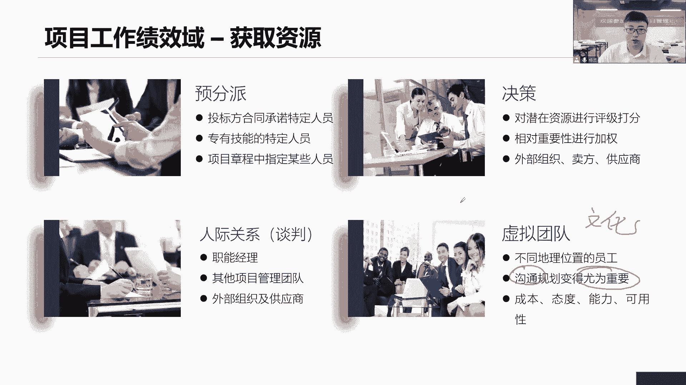

哪个是沟通的重点，文化是沟通的重点，在获取资源时，还要考虑一个问题，就是资源的日历，这是一个项目文件，这个项目文件干嘛的呢，他说在记录我们当前团队成员，每个成员的一些工作时间。

也就是说让我们很好地了解这些资源，它的可用性，把它圈出来就可以了，这个资源不可用，这个资源被占用了，我们现在用不了，这个资源，只能给你一段时间之后，他就会回到另外一个部门去，这都是什么，它的可用性。

这些可用性写在哪里呢，写在我的资源之地里面，我们做好维护就可以了，就像我们说，我们要获取当前组织上的一个资源啊，一个女生，但是这个女生她马上要休产假了，你怎么办，休婚假了你又怎么办。

你就不可能让他过来加班呢，这肯定不行啊，你要休假，所以说这就是资源可用性，它受到受到问题了吗，那你要去在这个在你这个日历里面去维护好，当前他有一段时间是请假了，不能来参加工作，你要在里面写清楚。

意味着这些工作可能需要由别人来处理，所以我们在获取资源要考虑这个点，想想这个人来到我们项目团队里面，他能不能够持续地开展工作，还是说只能在一定程度上开展工作，或者说完全没有时间来参加工作。

那么我们要看这个人他适不适合，如果不行，我就换一个人都可以，但是要维护好这个质地，所以但凡是涉及到资源的质地情况，我们都都看什么啊，但凡涉及到资源的可用性的时候，我们都看我们资源之地。

那么这个资源既有人物啊，这个会议室今天上午被别人占用了，我们开不了早会，这时候就是支持它的可能性，对食物资源，人力资源都是团队发展的五个阶段。

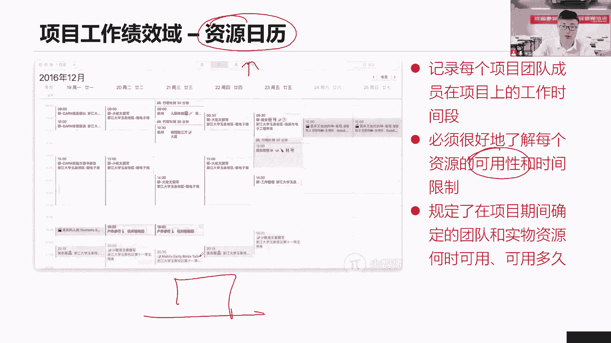

我们看团队啊，说在这个发展啊，我们会有五个阶段，首先第一个形成阶段，团队刚刚形成，大家相互认识，士气还比较好，团队的事情，但是随着工作的开展，我们会有什么，有很多矛盾出现争吵吵闹不一致，有冲突有分歧。

这个时候士气会怎么快速下降，因为它会影响我们整个团队的士气的快速下降，那就到了我们震荡阶段，争吵意见不一致，那么作为项目经理来说，我们是应该言传身教教他们怎么做事情，怎么解决冲突。

以教练的方式来教他们如何开展工作，来正常阶段，那就教他们怎么做事，教他们做事，意味着他们会慢慢的发生变化，开始相互协作，开始相互信任，开始相互配合，我们已经有了一个状态的转变了。

这个转变我们就已经到了我们的规范阶段，我们开始相互信任，配合协调沟通，促进交流，接下来我们说在这个规范阶段，项目经理你要参与进去啊，你要让他们有参与感，你同时也有参与进去，什么叫参与了，允许团队成员。

你们提出自己的想法和意见，那么我对你的意见做一个什么提炼优化诶，如果能够再加上123这三点就更好了，那就是参与式的方式，到了后面呢，我们的团队不断不断地成熟起来了，而我们学习的知识。

掌握了很多优秀的知识经验知识，当前我也认为这个人是我们这个团队的负责人，是这个区域的负责人，是这个产品的负责人，他们就回答了一个成熟阶段，当前他们相互依靠，能够高效地开展工作，能够高效地解决问题。

这就到了成熟阶段，哎这是我们团队发展的几个阶段，那解散不解释吗，这个项目做完就解散就解散，没关系好，但是要团队发展，所以它的几个阶段要搞清楚。

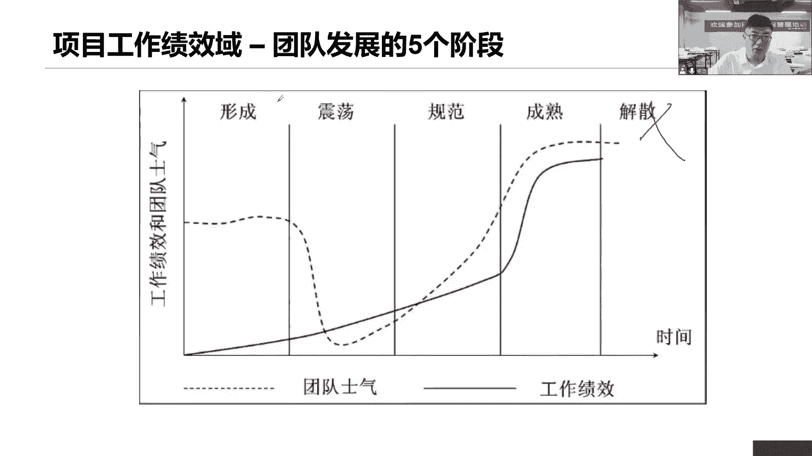

那么我们从几个维度来说，这五个阶段都应该有一些关键词，关键信息，来帮助我们去判断他当前处于哪一个阶段，第一个相互认识，就说我们之前没有接触过，不了解不认识，即便是那个公司也有可能啊。

哎我们现在重新重新组建一个新的团队，但是呢我们之前没有合作过，这都是什么新成就，它这个时候我们要相互认识，但是呢不一定开诚布公，说这啥意思啊，其实我会跟你去说，相互认识，我会给你介绍我是谁。

但是我不会跟你说太多话，你把我们之间还没有达到非常有什么关系，很好的一个地步，只能说相互认识，介绍介绍你是谁，我能叫出你的名字就可以了，震荡阶段，大家开始工作了，但是不合作，不开放，不沟通。

由各种各种不同的观点分歧冲突争吵，在这个阶段冲突是非常多的，不同意意见不一致啊，意见不一致，谁都不负责，不听冲突，争吵，正当定了，第三规范，请记住，开始信任，开始协作，开始沟通，开始互动，开始交流。

一个是开始，一个呢是信任，这是当前规范阶段两个重要的一个什么，一个关键词，第四个呢成熟阶段说，当前我们这个项目团队能够相互依靠，平稳高效的开展工作，我们能够高效地完成工作，我是这个区，我是这个工作。

这个区域的负责人，有我在你们团队的高效的开展工作哎，相互依靠，高效完成工作，这是成熟阶段，所以我们发现一个点，就是咱们这个成熟阶段能够高效开展工作，意味着我们希望能够尽快的让我们团队。

迈向我们的成熟阶段，而尽可能缩短我们的形成震荡和规范阶段是吧，这怎么成熟的，那么这个成熟成熟意味着什么，当前大家应该能够独自的思考问题，逐字做决策，逐步的开展工作，因为你们已经是个成熟的团队了。

但说到成熟的，那什么是成熟团队，是不是我们自主的团队啊，前面做了自己做决策，制定目标，自组织团队，他们就是一个成熟的团队啊，在这里他们都是由我们的跨职能的，通常性的专家做建设的啊。

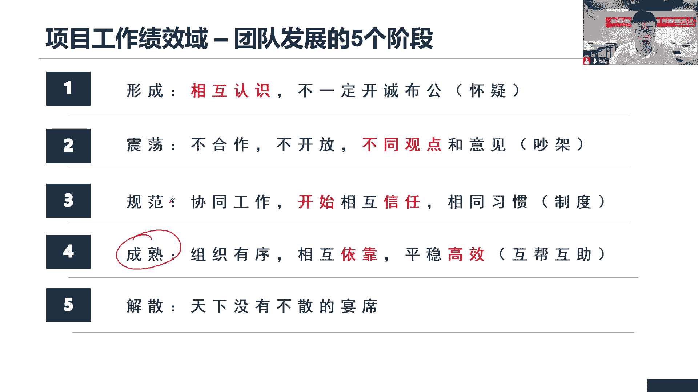

接下来我们看看这个培训啊，培训也是一个重要的考点，对于这个培训来说，我们先搞清楚他的场景，当前我们团队人员在一个预测型的项目里面，能力不行，经验不足啊，绩效绩效跟不上，那这个时候要不要开展培训啊。

因为当前团队啊确实有些问题是技术没有掌握，能力也不行，经验也不足，工作效率很低，总是完不成工作，培训新技术，新工具能够产生一些效果，但是大家不会玩培训，但在培训之前先不要着急，我们暂缓什么冲动的决策。

啥意思呢，先做好一个评估，在这个培训之前，先了解了解大家哪些人需要培训哪些维度，哪些领域，哪些技能需要培训，不是把所有人召集团来，我们所有人开展培训，那就错了，按需培训，减少浪费，那培训怎么做。

按计划做计划，哪个计划，资源管理计划，还记得不自愿关计划内容啊，第一个，当前如何去定义团队，如何去定义资源，如何去获取资源，我们的项目团队里面有哪些角色，这个角色他对应的职责是什么，他的权利是什么。

他的能力要求有哪些，如何去管理我的团队，从定义团队获取团队是吧，这个管理团队配备资源，遣散团队怎么做，如何管理资源，还有呢项目的组织图，项目的汇报关系，来我们项目从下级到上级整了一个汇报关系。

组织图以及当前的培训，培训的策略是什么，主题频率时间，团建的方式，团建的形式有哪些认可和奖励，及时的认可与奖励，那这些都是还有实物资源怎么去管理，前面说的人员怎么管理，那还有实物资源怎么去管。

这就是我们当前资源管理计划，所以你看有没有培训，肯定有啊，写进来，不抛弃不放弃的原则，针对当前这个人能力不足，经验不足，你能不能说把这个人给换掉了，找直升经理说，你看你给我一个什么鬼，歪瓜裂枣。

啥都不行，我换一个人能这么做吗，或者说当年他这个人工作完不成，那好这些复杂的工作，你别做了，我给你简单的工作，然后把这些复杂的工作我交给别人去做，你觉得这样做伤不伤心，让他伤不伤心，能不能这么做。

项目经理可不能这么去玩是吧，或者你不管他不闻不问的，不管他也不行啊，你也不要天天去指责他，压迫他，强调给他压力没用，你需要给他什么引导指导辅导，关心培训，帮助他能够尽快的完成工作。

他的工作该他做还是得由他来做，不能把它转移给别人，你要指导他如何去完成这个工作，更好地完成，更高效的完成，你的指导不就是培训吗，不一定说我们要组织一个会议啊，大家在一起哎呀，我们请个老师过来讲课。

这是一种什么，在这是一种培训没错，但是很多时候我们说这个培训培训你的指导，你的引导辅导也是一种培训啊，所以培训的策略是很多的，但是还有一个问题，什么问题呢，你跟他做培训吧，不抛弃不放弃没错。

你一直鼓励他，支持他，但是他就是什么扶不起的阿斗，那你说怎么办，还要培训吗，你别着急啊，延迟冲动的决策，暂缓冲动的决策，你的情商体现出来，这个培训如果没有效果，是不是问题，你说是不是问题，那么四个问题。

按照我们前面的问题解决六步骤，你要不要跟他聊聊，找原因是不是找原因，这是个问题啊，这找原因为什么给你朋友说还是没有效果呢，才能够找到更好的解决办法，那么这个人你要跟他培训，他这个成员是不是你的干系人。

你的肝需要管理，怎么管理，我们说了两个字，沟通是不是，这既符合了肝性的管理，又符合当前问题的处理，这多好的方案，先沟通嘛，找原因再说，我们应该怎么去解决，如果觉得这个培训的方法策略时间有问题。

我们调整就可以了，没问题，或者说你自己要做些什么改变都可以啊，这是以后要做的事情，但是在这个策略啊，先沟通找原因，然后呢再确定一下如何解决啊，这是培训，那么项目环境啊，我们整个团队里面大家不在一起。

虚拟团队我们说了不在一起，那么这个时候我们需要使用一些电子的，线上技术来开展沟通，以彼此互动，再次强调哈虚拟团队，虚拟团队沟通显得尤为重要，所以很多时候我们考这个分布式的虚拟团队，考的就是沟通。

而这个沟通他关注的点是有一个重点，就是文化，跨文化的沟通，要关注集中办公，我们在一起，我们天天在一起，抬头不见低头见，就这意思，那提高工作效率啊是吧，我们沟通成本很低，想聊随时聊，在一起聊都可以聊啊。

这是我们彼此靠近的总统战略布局，能够让大家能够高效地开展工作，尽可能的选择集中办公，如果确实不行，条件有限，有些制约因素，那就虚拟团队也可以，但是要注意了，我们的沟通显得尤为重要。

在这里面要尽可能利用好这些线上的技术。

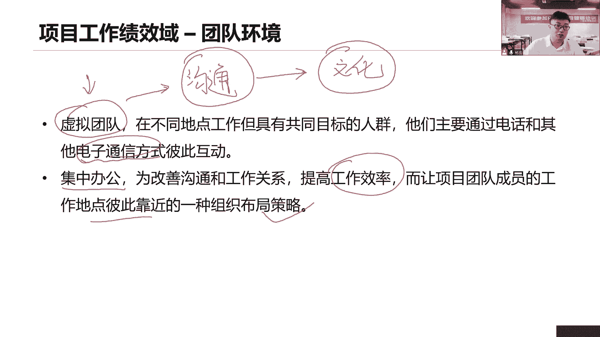

同部门工作协调工作，促进沟通，团建团建，当前我们团队遇到一些问题，我们要开展团建，团建的目的是什么，强化我们的社交关系，意思是让我们团队人员能够加强沟通，促进交流，促进协作，打造一个积极合作的氛围。

给大家营造环境，让你们能够积极的合作，积极的协作协作工作啊，如果说大家不在一起，虚拟团队没有办法面对别人沟通，那我们要不要团建，我就问大家，虚拟团队可不可以团建，我们线上可不可以团建在一起。

线上我们来开个会，可不可以，这开会本来就是个团建工作啊是吧，你也可以在线上，我们一起来啊，这大家做个什么菜起来一起品尝，一起来炫一炫都可以啊，这种线上的沟通方式其实也很多，形式有多样了啊，丰富多彩。

它还可以开展很多团建的活动，非正式的沟通，有利于建立好我们的相互信任的氛围，以及良好的工作关系，所以我们才说这个社交关系很重要，人际关系技能在团建里面就更容易去强化，这一点。

更容易帮助我们去有建立好的人际关系技能，你说很多时候我们出去团建，出去吃喝玩乐，真的是为了大家出去吃喝玩乐吗，是不是要搞好这个人际关系啊，社交关系打好良好的什么工作关系。

团队成员之间要建立一个相互信任的良好关系，促进沟通，促进协作，项目经理应该辞去了监督团队的效绩效，确定当前是否采取一些措施或者预防措施，纠正措施来解决当前团队各种绩效问题，那么你绩效出了问题。

一定是我们团队整体的问题，那么团队整体的问题，通常来说开展团建是非常有效果的啊。

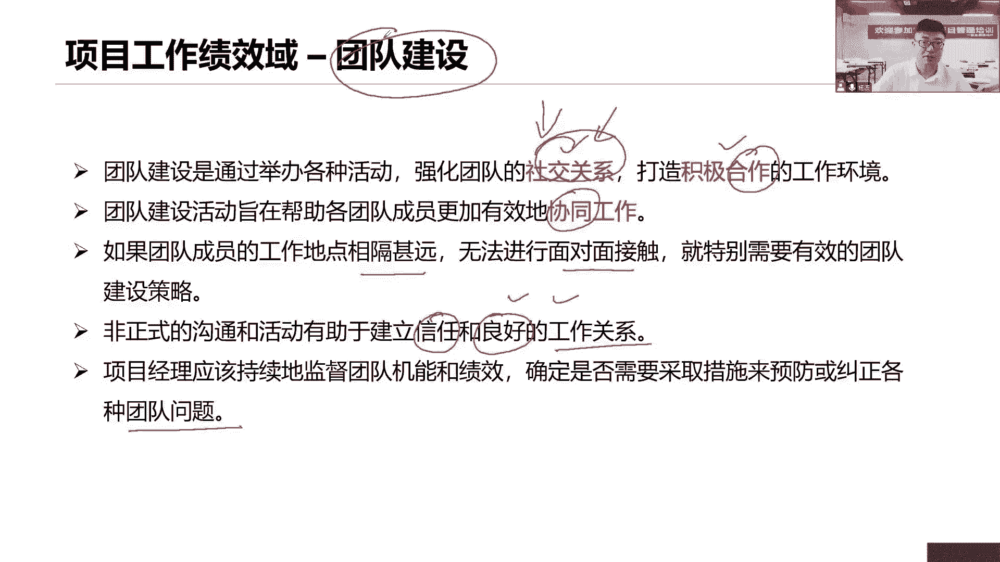

任何和奖励也是一样的，我们在项目过程当中发现了有些人表现很出色，做出了总党的贡献，我们要给予一个及时的认可和奖励，那这个奖励一定是什么，要满足个人需求的，也就意味着当前我们要考虑一个点。

大家有没有听过马斯洛需求层次啊，我们这个人的需求层次在哪里，能不能跟这个奖励满足他的需求，才能够看当前是否是一个有效的奖励，所以很多时候我们说这个企业里面，定了很多的一些奖励制度。

但是很多时候我们都形同虚设，大家视而不见，为什么，因为这些奖励制度，其实根本就不能够满足我们当下这些团队资源，他们的需求，那你要考虑他们的需求是什么，这个奖励多种啊，有形的奖励，无形的奖励是吧。

有的人喜欢什么，喜欢权力的奖励，有的人喜欢环境的奖励，有的人喜欢成就的奖励，在各种激励方式是不一样的，那奖励也要考虑文化，也要考虑文化背景，所以我们团建考虑文化，虚拟团队，考虑文化沟通。

考虑文化认可基地，也考虑文化文化文化差异不同，我们的沟通方式吧，我们当前的工作开展的方式是完全不一样的，不要冲动，要尊重人的团队，使用这个尊重，尊重什么，你要尊重他的文化，大多数相同的。

要得到彼此成长的机会，获得成就感或者赏识，或者欣赏，或者赞赏或者鼓励或者认可，从而产那个什么塑造更好的激励，项目经理，应该在整个项目期间给予一个及时的表彰，认可，欣赏鼓励支持，帮助理解。

而不是等到项目完成的时候才说，那就太晚了，在项目整个生命周期，当它出现了好人表现好的时候，及时的鼓励激励表扬个人与团队的评估。

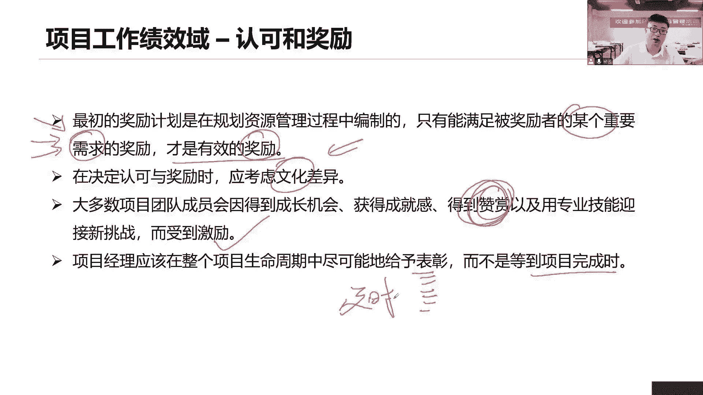

评估评估就是想了解我们每个团队成员，他们的优势和劣势，也就是他们的长处和短板，他们的不足怎么了解呢，来我们通过一些什么问卷调查，可不可以啊，啊我们说这个什么一对一的沟通，结构化沟通，面谈评估。

甚至我们做一次什么能力评估，能力测试，可以啊，做些题嘛，让他练习练习，看看每个人的性格呀是吧，那个什么兴趣呀，能力啊等等都可以做测试的，甚至我们开会讨论也行，就这些方式也是各式各样，没问题。

但是目的是什么，我们就是想了解每个人对他性格上的优势，这个人是内向还是外向，合不合群，如果他不喜欢和大家一起来沟通协作，那么可以开展团建啊，我们来促进你们的人际关系。

团建不就是要促进团队成员的人际关系技能吗，这是很好的一个事情，所以说通过这些活动，有利于我们促进团成员彼此的理解了解信任，承诺沟通交流，在整个项目期间，我们要不断的提高团队的成效和绩效。

那么通过这些方式来评估，然后接下来来思考，就你们当前这个优势和劣势，如何放大你们的优势，发扬你的优势，如何能够弥补你们的劣势和短板。

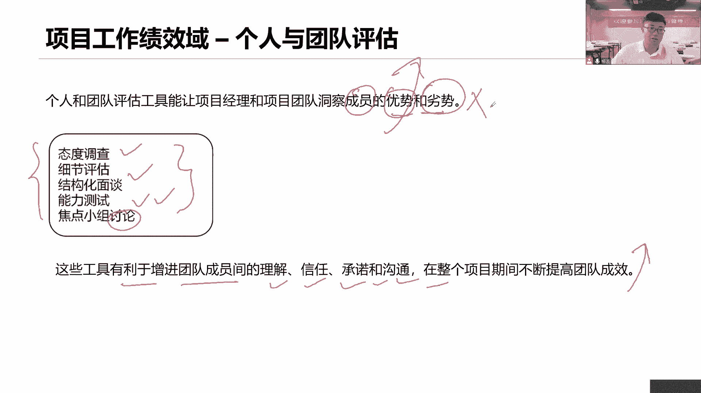

最后形成我们团队的评价，你对当前开展这些工作已形成评估之后，那么最后你是不是应该给我们团队做一个，总体的评价，这个评价就是指当前我们每个人的能力，通过这个团建之后有没有得到提升，团队的整体能力。

有没有得到提升，我们团队的凝聚力，有没有提升团队的离职率稳定性啊，这个离职率有没有下降，流动性有没有下降，这些都是来帮助我们衡量，对这个整个团队的一个评价，让他有各个维度，所以我们说开展这个团建活动。

其实是有效的，能够提高团队整体绩效的，你看促进沟通嘛，促进协作，营造氛围，相互沟通才能够提高团队整体的绩效，从而实现团队目标，提高项目成功的可能性。

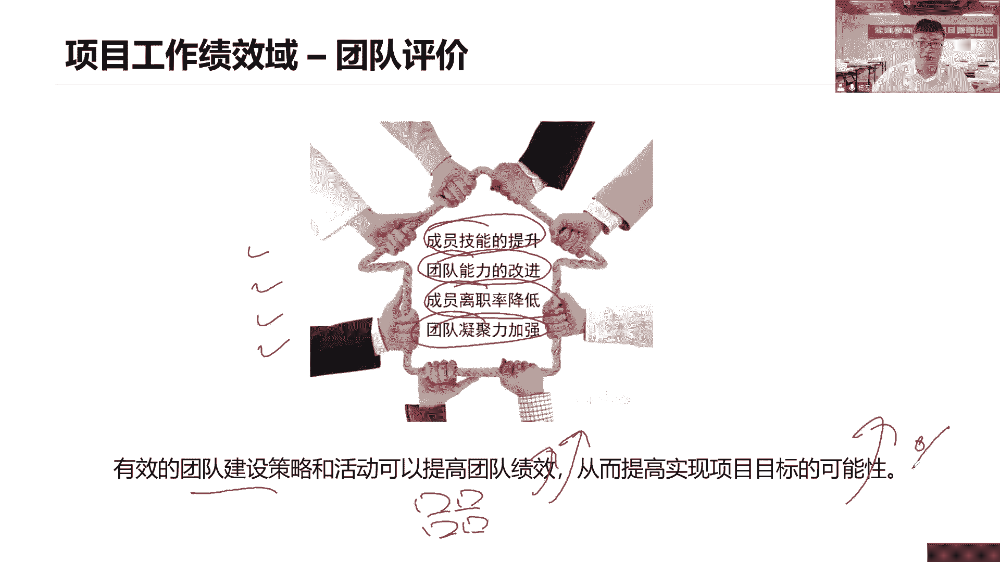

团建，然后接下来日常工作，除了团建之外，我们还有很多的日常工作需要去开展，比如说团队的问题怎么解决，团队的冲突怎么解决，有没有一些团队成员一些变更情况，又应该如何去开展工作。

那这是我们当前管理团队想做的事情，沟通冲突啊，协商领导，当项目经理应该留意团队成员是否有意愿，有这个能力完成工作，他的意愿，他的能力，我们说有一个能力意愿模型，他们会讲这个人民医院模型。

他就是用来提高提现我们项目经理领导力的，而这个人刚进来，他的意愿高，能力低，我们应该什么方式来领导他，那么接下来他能力慢慢提升，但是意愿又下降了，那么意愿低，能力高就应该用什么样领导力的方式。

要促进沟通，促进协作啊，采取团队的基本规则，团队跟团队基本规则就是团队章程，团队规范都是啊，团队章程以及成熟的项目管理事件，以及减少冲突，所以我们说团队章程里面是不是有还记得吗，我们团队章程里面内容。

两个团队团队的价值观，团队的共识，两个指南，沟通指南，开会的指南，两个过程，一个是冲突解决过程，一个是决策过程，能不能够解决冲突啊，看我们的团队章程是可以的，又提到情商了，在管理团队的时候。

情商依然是很重要，情商情商他考虑的维度是这个情绪，我要控制好我自己的情绪，同时我还要影响他人的情绪，我的移情能力，共情能力要体现出来你的人际关系能力，哪家要控制住自己的情绪，同时影响别人。

而且还要让我们整个团队成员，大家都能够充分的表现出自己的领导力，表现出自己的情商，相互的影响，同样的促进合作，促进沟通，影响力呢也是一样的，我们要包括你看印象里包括什么，有效的倾听，积极的倾听了解。

站在对方角度思考各种问题，各种观点，以合作的方式，以双赢的思维方式达成一致啊，我们可以采用不同的领导力的风格，这些都是我们什么外部的影响力在这里面，所以管理团队也就是利用我们的情商，领导利益影响力啊。

结合着我们的团队章程来管理，我们当前团队的一些各种问题和冲突。

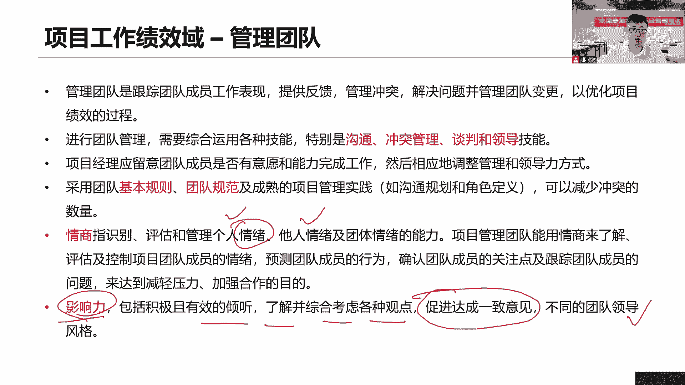

就这么一句话总结，那么管理团队的冲突介绍过吧，第一个优选方式是合作，面对美国同双赢思维来解决问题，达成一致，就是我们说的交互式的沟通，能够帮助我们达成一致，双方达成共识，彻底的解决这个问题。

解决一个冲突，如果当前我们没有解决冲突的环境，或者说由他人来解决，不是我来解决，我们就采取回避，拖延，不解决问题仍然还存在，如果当前情况比较紧急，我们需要快速的得出结论，没有时间跟你们做合作沟通。

开会讨论分析了，那这个时候就采用强制把竞争性很强，强迫采取一方建议而忽略另一方，一输一赢太好，除非说这个项目环境情况特别紧急，需要快速的做出决策，那么我们用强迫可以，第四个呢缓和缓和当前的情绪和氛围。

我们要维持一个良好的和谐的氛围，我们求同存异啊，我们强调差异性，我们强调一致性，有弹性，要强的一致性，找到这个共同点，当然同时我们说你们之间的分歧依然还存在，维持关系，第五个妥协。

在一定程度部分解决冲突，一定程度上解决冲突，一定程度令大家满意，但是还有一部分呢没有几个问题，它既是双赢也是双输，双赢是因为有一部分达成了双输呢。

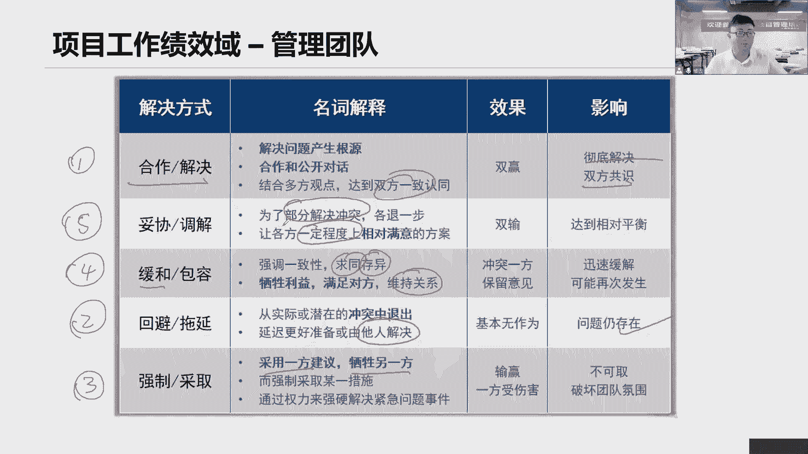

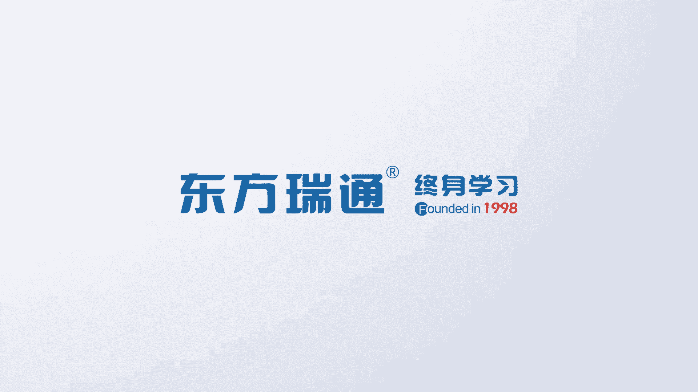