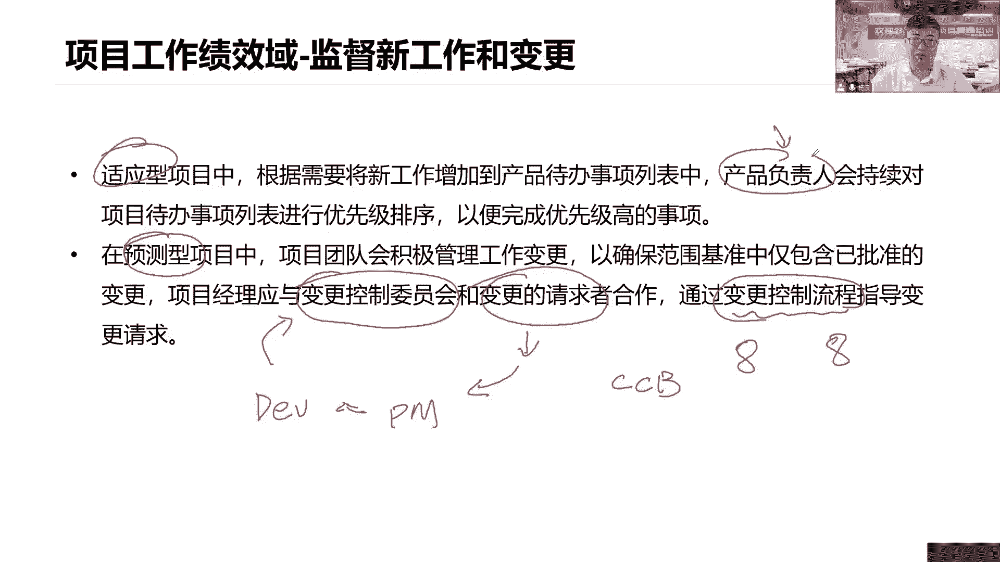

# 全新录制PMP项目管理零基础一次顺利拿到PMP证书 - P35：PMP精讲项目工作绩效域-监督与实施变更 - 北京东方瑞通 - BV1qN4y1h7Ja

我们来看，接下来关于监督新工作和这个变更工作，要不要监督变更，要不要监督，都得去监督啊，那么看对于变更来说，我们怎么控制呢，如果说是一个适应性的敏捷项目的话，我们通常会把我们的工作新增的工作。

新工作忙变更，直接添加到我们的产品待办列表，还记得吧，敏捷首先有一个大的产品代码列表，从这里面选择优先级比较高的需求，我们把它放在我们的冲刺代办列表里面来，这些都是经过分解之后的一些任务。

然后呢两周一冲刺，最后呢产出我们的最小可行性产品是吧，产出我们的最小可运行的一些产品好，然后按照这个产品我们去开展一个平时按验收，最后呢我们可能是做一个什么发布在这里面，然后呢下一个阶段又是这样的。

价值比较高的需求，又开始放在我们的冲刺蛋白列表，两周一冲刺做出我们的一个增量产品，这个增量产品如果有问题改没有问题，我们就再一次发布一个子集好，这就是我们当前一个变更，那么这个变更了之后。

他说首先放在我们的产品单单列表，由我们的产品负责人，有这么一个负责人，他对我们当前的一些代办列表，做一个什么优先级的排序，就是这样说，哪些我们可以拿到当前这个充值里面，去开展工作。

我们要对它做一个优先级的排序，我们肯定是首先完成优先级比较高的工作，那么这是我们预测性，因为毕竟嘛两周一迭代周期比较快，我不可能把所有的需求全部拿出来，这个做不到，只能通过排序，哪些先做哪些后座。

看以价值为导向，而对于我们预测性的项目来说，瀑布型的项目我们怎么变更，那么这个变更就意味着，很有可能会对我们一些基准做出一些调整，那这个时候一旦涉及到基准，我们找谁，在我们前面说了，变更控制委员会。

是不是和当前这些变更的提出者一起来合作，意味着你们应该先给我们一个变更请求，这个请求交给我们项目经理，由项目经理带领我们的什么团队，我们一起来做综合评估，如果当前这个问题涉及到基准。

我们会找我们的变更控制委员会，找他们来做什么评审决策啊，一看是否要去做这个病人，所以我们一般会遵循一个变更控制流程，这个流程写在哪里，是不是写在我们的子计划里面，变更管理计划里面，变更管理计划。

或者说当前我们变更八步骤是什么，CCB的成员有哪些人，他们的职责又是什么，都会写在我们的变更管理计划里面，所以我们参照变更管理计划来看看，我们必要的变更就可以了，如果是适应性的。

我们没有什么严格的什么变更发布之后，我们就找产品负责人好。

因为还要做出决策，到底哪个先做哪个后做，在整个项目期间要不断的去学习，总结经验教训，那么这个知识的学习，马说知识分为显性知识和什么隐性知识，那么这个知识怎么去学习呢，首先我们说这个显性知识啊。

就是拿给我们去学习的好，就是要去看当前我们总结了这么多的经验教训，总结了这么多知识，这些都得什么分享出来，让大家去看看，我们这个显性知识要不要分享，要分享，那么怎么分享呢，用于我们当前的信息管理系统。

软件系统拿出来分享啊，记录在各种文档里面去看呀，那么隐性知识怎么分享呢，他说通过开会的方式来，我们跟大家，今天下午我们开个会来做技术分享会，可不可以，我们当前掌握了什么技术，我没写，这个很难写出来。

我只是跟他去交流，那么交流就开会呀，或者说通过大家的人际关系一样嘛，也是交流沟通了解，促进沟通，促进协作，来分享一些大家头脑里面所学习的一些知识，都可以知识管理啊，他最重要的一个环节是什么。

要营造一个相互信任的氛围，而这一点很重要，就是为了说我们要促进我们团队的沟通交流，首先你得有一个氛围，这个氛围是什么，相互信任的氛围，只有相互信任的，我们才愿意把这个知识分享给你。

如果说我们企业里面是一个末尾淘汰制的，那你想想，我还愿意把我们当前所学习的，高精尖的技术分享给你吗，让你成长，不可能你们成长起来，我就有可能是最后一个人，我就会被淘汰出去，那不行啊。

所以说我们需要有一个相互信任氛围，这样才能够激励大家，激发大家愿意和别人一起来分享知识，促进沟通，促进交流，那么这个知识知识更新到哪里去啊，更新到我们的经验教训登记册，这是我们的一个项目文件。

前面讲了经验教训登记册，在项目早期就应该创建，用来记录我们当前所学习的知识，总结的经验，在整个项目期间要和我们当年全员，不管是人还是团队，反正你记住一个词，在整个项目期间。

全员参与记录更新我们的经验教训登记册，最后阶段结束，或者说项目结束，我们要把它存档存档到哪里，我们的经验教训知识库，哎这就是我们的组织过程资产了知识库啊。

