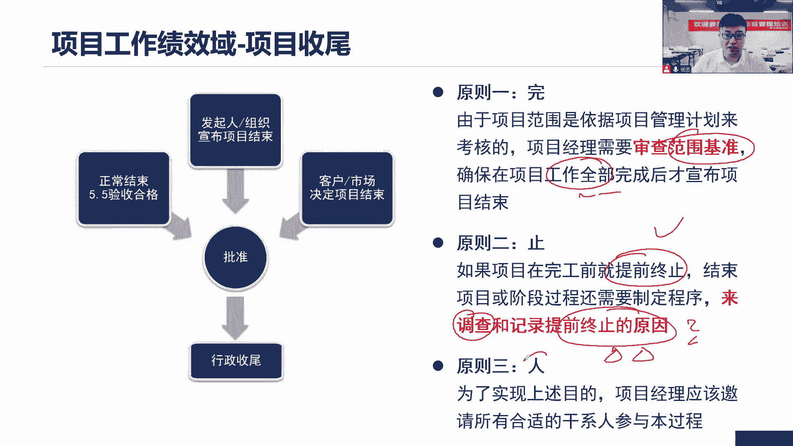
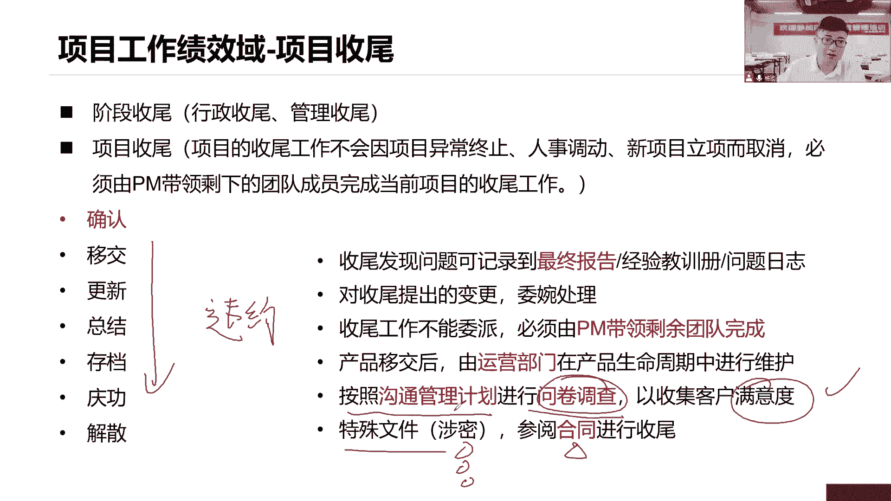
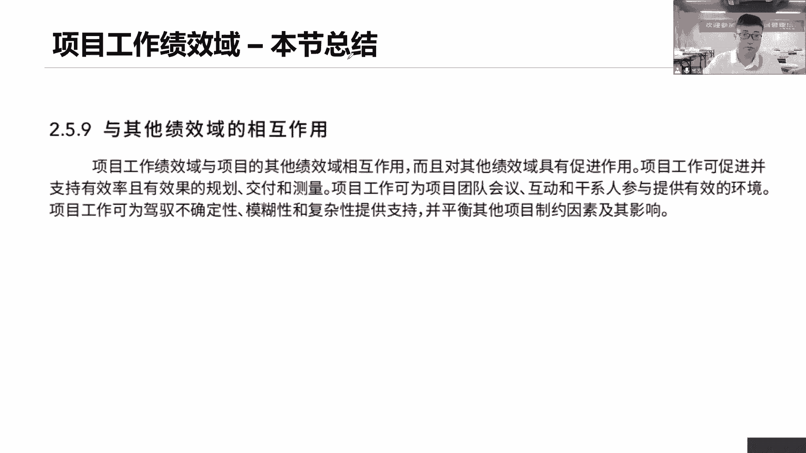
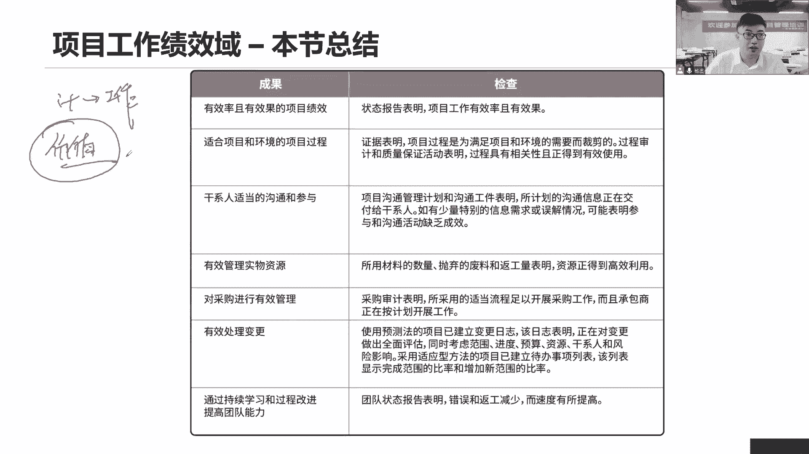
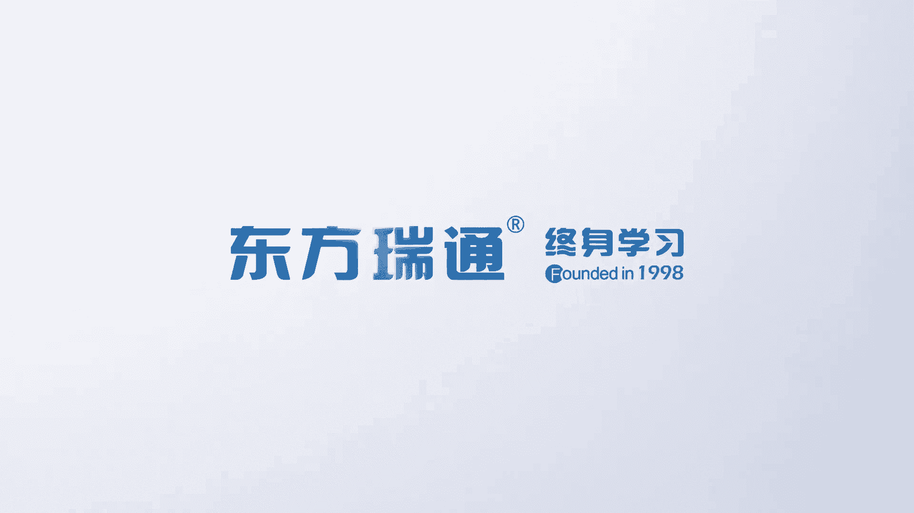

# 全新录制PMP项目管理零基础一次顺利拿到PMP证书 - P36：PMP精讲项目工作绩效域-项目收尾 - 北京东方瑞通 - BV1qN4y1h7Ja

最后项目收尾，我们来看项目设备，就是说当前要检查，是不是我们该做的工作已经做完了，我们拿出我们的范围说明书，WBS和WBS吃点来逐项检查，确保当前我们的全部工作都已经完成了，项目的范围啊。

里面会写我们的项目范围，我们的产品范围是吧，项目范围就是我们要做的工作，是不是全部做完了好，如果做完，我们可以收尾，没问题，找我们当前的一个领导签字确认，那如果说我们的项目提前终止，有没有可能也有可能。

要么是我们自己的没有资源了，没有时间了，没有技术了，成本严重超支了，我们为了及时止损，单方面的终止，也可能是甲方单方面的终止，说当前没有需求，没有义务了，没有价值了，不做了，那都是说什么提前终止好。

要想提前终止，首先各位发起人是吧，PO客户，你得告诉我提前终止，我不可能我没有这个权利直接终止，我需要你们给我一个审批，给我意见，同意我们充值，那好我们就终止，我们就收尾没问题，但是收尾归收尾哈。

我们要记住一点，要调查一下，为什么这次提前终止它的原因是什么，这是总结经验教训了，以便于未来我们去做项目，要参考这个点，不要再犯之前同样的问题，因为毕竟这是一个什么提前终止它，这代表着这个项目失败了。

没有做完，这是个问题，我们要把它记录下来，对不对，记录的问题是可以啊，甚至我们还会说我们收回的时候会写个报告，这个报告叫什么呢，最终报告这个最终报告是说截止到目前，我们项目总能够完成我们整体的迹象。

从各个领域整体绩效情况，我们做个总结，做个概述，这个最终报告也可以记录，当前我们说提前终止的原因是什么都可以，这全都是我们的经验教训，谁来参加人。

哪些人全员全员所有人全员参与进来，所以我们来看对于项目设备来说，我们应该怎么去做项目，说你这个项目好，有可能什么当前阶段设备也可能是项目的设备，如果说阶段社会的话，那就是当前这个阶段社会。

我们进入到下一个阶段，如果这个阶段是最后一个阶段的话，那就是项目的收尾，项目收尾的工作不会因为项目的异常终止，人事调动或者新项目的立项而取消，这个是不会的，就是很多场景他会告诉你说当前项目经理。

你正在开展一个工作，你正在准备进行收尾工作，但是有另外一个项目要启动了，需要你过去协助，需要你带项目，我不管什么情况哈，总之当前这个项目你还没做完，那么就意味着项目经理，你应该带领当前剩下的团队成员。

一起把这个当前的项目工作做一个社会，这个收尾工作是不能够委派给别人的，必须有你看这么收尾工程是不可以委派的，必须由项目经理带领，你身边的团队全部都完成这份工作，可能有的团队成员他们已经走了，没问题。

但是即便走，你们也要告诉我，你们之前你们做了一些工作，我要做记录，要做总结，要做归档啊，我得收集你们的信息，你得给我一个信息，所以项目经理这个收尾工作你不能委派，必须由你亲自完成，你是责任人。

你是负责人啊，做你能力强，你要去做新项目，可以别着急，先把当前这个项目做完都可以啊，那么在做收尾之前，我们首先要确定一个点，确定什么，就是确认，当前我们是不是已经经过了正式验收了。

就是我已经找到我的客户，找到我的发起人，我们已经拿到了正式签字的验收清单了，就这意思，你要想收尾项目，第一步先确认是不是已经签字确认了，这个可是很重要的一个点哦，这是在讲确认范围的时候。

我们说要签字确认，必须让我们的客户或者是发起人签字，以证明当前你说没有问题了，别人到后面我们正在庆功的时候，说当前要改不改的话，不给钱，那不行，所以这个签字确认显得很重要，避免后面出现了问题很被动。

那之后你该移交就移交，移交给谁，移交给了运营部门，那么产品移交之后，后续出了问题找谁先找运营部门，看他们能不能在产品生命周期里面去做好维护，做好修改，可能有些工作你只需要改个配置就可以了，没问题啊。

不需要我直接去动项目，如果说即便当前这个项目确，这个问题确实很严重，需要我们重新立项，调整之前这个产品，那可以我们产品更新换代升级，我们就重新立项再做一次项目，把这个产品我们做个迭代更新，没有问题啊。

但是后面一旦移交出去了，那么这个产品的生命周期，后面的工作都是由我们运营部门来负责，该更新的更新吗，该总结的总结总结经验教训吧，存档归档啊，庆功，最后结他们团队，你看这些的最终报告。

这个最终报告是指当前我们说到目前为止，我们整个项目整体的迹象是什么情况，做一个概述，所以收尾的时候，如果发现一些问题诶，或者有人给我们提了一些新的需求，新的变更，这个是一般我们不推荐变更。

因为都已经验收了吗，客户都同意了，还变个啥变，如果你变了之后，提交变更请求，走变更八步骤，把这个问题给解决了，但是你解决万一又出问题怎么办，谁负责任，谁的责任，客户不认哦，客户已经说了。

这个我的工作已经验收了，如果出了问题，全部由你们负责，你们花了钱吧，你们耽误的时间，你们影响的业务都由你们自己负责，所以谁敢承担这个责任承担不起啊，所以收入的时候咱们不要去做什么，提交变更请求不做。

你把它记录下来就可以了吗，记录在你的经验教训，问题是这怎么最终报告，我们考虑你的问题，我们考虑你的新需求，但是当前这个项目已经验收通过了，咱就不改了，如果你非得要改。

可不可以可以我们违反人处理怎么处理呀，重新立项马你这个变更影响太大了，我们重新立项，可以啊，重新签个合同，就基于当前这个产品增量，我们再做一次什么更新迭代可以啊，或者说这十几个问题确实。

但是呢我们说这个运营部门他们可以解决，他们可以帮你解决，无非就是改个配置而已，很简单，操作一下就可以了，他们教你，你放心，可以解决好，再次强调下这个收尾工作是不可以委派的，项目经理带领团队完成工作。

如果说项目收尾，我们要去收集一下客户的满意度，怎么收集，这是个考点，大家小心点，按照沟通管理计划进行问卷调查，收集满意度，按照沟通管理计划和谁，用什么方式传递什么信息，调查什么内容，以获得什么信息。

这是不是沟通管理计划要写的，当然如果这个项目有点特殊，它涉密他是个安全项目，它是个重大，是这个重大涉密的项目，那我们这个社会不是说简单的这么更新，总结存档一下就完事儿了，这个社会工作请记住参考合同。

合同里面会说就针对这个特殊的项目，这个保密的项目，涉密的项目应该怎么进行，设备可不要按照你通用的方式去做，你这一做有可能就是什么呢，违约了，那就要受到处罚，所以一旦涉及到一些涉密的项目。

参照合同。

要本章关于我们这个项目工作内容也就这么多，其实我们会发现这个项目工作绩效域里面，他讲一些内容，其实还是就是按照我们前面所说的这个规划，绩效域里面一些提炼出的计划来开展工作，是不是啊。

比如说我们前面说了唉，我们对工作要做一些改进，我们要关注质量，我们要做质量审计，要做问题解决，要做PDC，不断的去改进我们的过程，这样吧，团队要不要管，要去获取资源，那肯定是啊，获取资源。

找我们的职能经理，找其他项目项目团队，项目经理以及找外部的工商去招人，获取资源，获取资源要考虑我们的资源日历是不是啊，以及呢在过程当中，我们要不断去开展一些团建活动，提高团队的整体士气。

提高团队的整体的绩效，还有呢过程当中还可以开展一些培训，给大家提供各种能力的提升的机会，在这里面及时的认可和奖励，你们是开展各种团建活动，还有呢要解决问题，解决冲突，这都是我们当前团队管理的一些绩效率。

里面都已经提到过了，只不过呢这里讲了一些比较具体的策略和方法，在这里面好，这是管团队怎么去管，还有呢在我们的工作当中，我们要不要管理食物资源，人力资源管好了，你看当前团队官号码，还有干系人诶。

干系人也是这样，持续的保持什么沟通和他们传递信息，然后呢不断的去监督他们的参与情况，有没有发生变化，因为你想提高干性的参与度，你就只能通过沟通管理干系，也只能通过沟通，你看他们的参与度有没有提升。

不断做监督监督怎么监督，同样的嘛，先分析他的需求，期望利益权利影响力啊，他的态度，然后呢对它做一个分类管理，权利利益方格，基于态度呢，来我们分析分析你的这个呃参与评估举证，看看你的参与程度。

基于我们的分类信息，基于你们的参与程度举证，我们就可以定我们的参与计划，更新我们的参与计划，然后重新再更新我们沟通管理计划，按照新的沟通管理计划开展沟通，重新提升你们的参与度，这样吧，好这是管人啊。

有团队有干系人，接下来就是管事情了，那么管事情首先有些这个食物资源怎么去管，那就看要不要采购，要采购，走招投标流程，怎么采购，先打广告，然后呢招投投标人会议，接下来开标评标，接下来谈合同。

按照这个流程把采购做完，在采购结束的时候呢，我们应该考虑什么，应该考虑当前第一个采购的这个绩效审查，拿着合同来审查当前供应商的迹象，第二个呢拿着我们的合同去检查你们的成果，结果是不是符合要求。

第三个我们不断的去审计审计，我们双我们双方自己审计，自己，看我们的采购流程是不是都已经做完了，然后再看这个变更，你看变更什么，当前如果说是采用这种预测性的方法了，我们就写我们的变更日志。

按照变更步骤八个步骤，预测型嘛，变更八步骤，根据CCB的决策来开展工作，来决定是否是做还是不做，那如果采用适应性的方法呢，和谁合作，一般来说就是和我们的这个产品负责人。

由他来把这个工作放在我们的产品蛋白列表，对它做一个优先级的排序，是这样吧，然后呢在整个项目期间里面，我们要不断的去总结知识，总结经验教训，更新我们的知识，不断去学习知识啊，好这是当前我们说工作。

就像你要开展的一系列的一些事情，开展工作嘛，那就是这些工作啊，管人管事，管物管管团队都不算目的，还是希望能够高效地开展工作，尽可能的按照我们的计划来驱动，我们的工作敏捷，那就是持续的产生价值。

对我们工作做优先级的排序，以持续的产生高价值，把当前这个价值。

