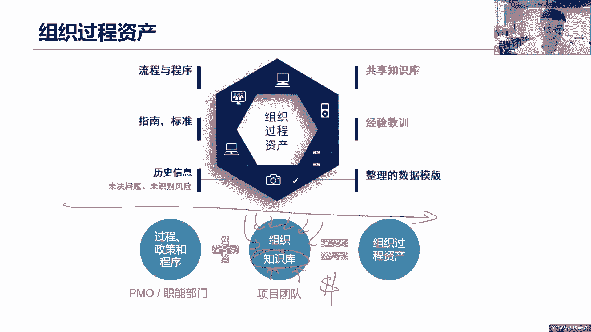

# 全新录制PMP项目管理零基础一次顺利拿到PMP证书 - P6：PMP精讲课项目环境与PMO - 北京东方瑞通 - BV1qN4y1h7Ja

接下来来看一看这部分内容，项目的环境与PO。

我们的项目环境和pm怎么去磨练，让我们一起来看看项目环境，项目的内部的外部的环境有哪些，在项目的这个工作当中啊，我们说要考虑企业的内部环境，和我们企业的一些外部环境的一些运作，这个是非常之有必要的。

因为这些环境会直接影响到，我们项目的工作的开展，那么有哪些环境会影响了内部环境和外部环境，内部企业内部组织，内部企业内部了，外部呢企业外部来，我们一起来看看有哪些环境内部环境。

你看这里说了，当前我们组织的一些过程资产，也就是我们历史项目所遗留下来的一些模板，框架文档，什么各种资源库数据都可以拿过来，这是我们的过程资产，还有什么什么治理文件，数据资产数据库知识资产经验教训。

以及一些什么安全的一些知识，安全一些实践，组织的文化，组织的结构，组织的治理，组织文化是什么，会不会影响我的项目开展，这个必须得影响我们当前是一个末尾淘汰制的，大家就很拼，是不是你万一我被淘汰了呢。

而且竞争意识非常强，可能没有什么合作在这里面，那如果说我们是一个相互信任的一个组织文化，鼓励大家分享知识，总结经验，持续改进，这是一个相对来说比较温和的，而比较舒服的相互信任的环境。

那么我们又可以开展什么工作，可不可以促进沟通，促进交流，促进经验教训的总结，我们的组织结构扁平化的矩阵型的，它直接影响我项目经理的权利啊，当前我们组织有哪些基础设施，一台挖掘机，一个会议室。

当前我们的团队是怎么分布的，集中办公还是虚拟团队，影响我们团队的管理，我们有哪些基础设施，哪些硬件资源，你想我们用了哪些软件技术，用了哪些工具软件来开展工作，有影响这些人他们能不能用是吧。

什么时间可以用，有影响团队成员的能力，有没有影响，有啊，都是实习生，还是说是一般工作了78年的老专家。

那对我项目的开展也有很多的影响，这是我们内部环境，外部环境呢，外部的市场的，社会的法律，法规的，外部的监管和商业的环境和行业的要求，市场的监管，怪不得说这么多。

我们一起来做一个梳理，来我们把它按照这种方式来梳理，项目的环境受哪些因素的影响，我们分成两类，第一类事业环境因素，第二类组织过程，资产事业环境数分为内部和外部，内部事业环境就是我们前面说了组织文化。

当前团队的分部，团队成员的能力，当前我们组织里面用了哪些基础设施，用的什么管理软件，这是我们企业内部的，我们组织内部的一些因素，通常这些因素我只能够遵循啊，你说能够靠我一个人把我们企业文化给改了吗。

我能改吗，当前我们企业就这么一个会议室，那你就只能将就着用，你受限于当前我们这个企业内部的事业环境，所影响你的工作开展，当前我们这个企业就是一帮刚毕业的社会的，刚毕业的一个什么实习生组成的这个团队。

那你也得接受啊，受限于受限于当前我们内部的事业环境因素，什么是外部呢，市场的法律法规，行业的要求，监管的条件，市场的变化，风险行业的数据，你说我作为项目经理，我能不能去改变当前的一些行业的标准。

这些GB杠T这些ISO国际标准，国标行业标准我能改吗，我肯定也改不了，他们只会影响我们的工作，所以说呀事业环境因素，通常来说我们只能去遵循它，很难去改变它，但你说可不可以改，有些因素它可以改。

比如说员工的能力，这是我们企业内部的事业环境税，那我可以提高员工的能力啊，咱做项目嘛，不就是为了提高团队人员整体能力嘛，能力提升了，事业环境因素也就发生变化了，好这是事业环境因素，通常我们只能遵循。

它会限制我们工作组织过程，资产又分为两个，第一个政策程序和过程，第二个组织知识库，对于政策过程程序是什么东西呢，软件开发的程序，公司的质量政策，采购政策，当前的一些变更程序，我们怎么样去开展日常的沟通。

我们那些工作流程是什么，怎么去提财务报销是吧，怎么去请假，这些过程这些东西谁来定的，也不是我来定的，都是公司什么高层人员，他们来定的，开发流程是什么，公司的质量政策，采购政策，风险政策。

我们的变更程序是什么，我们的审批流程是什么，这不都是公司高层人员，为了让组织能够更好的发展，为了让组织的各个职能部门，能够有机的结合协调，为了让项目能够更好地推进，我们对已有这些过程。

政策和程序方针指南或什么，或者一些流程，你得告诉我们，在这个企业里面，我们应该怎么去做事情，接下来知识库是什么东西，会学习很多知识，会总结很多的文档和模板，往这里面存就行了，知识库，文档库，经验库。

数据库，材料库，配置库，各种库都是我们的组织，知识库，全都是知识啊，那为什么我们要总结经验教训，为什么要把这些什么各种文档模板成果，经验数据全部归档，全部存档，存档到这个知识库里面，目的是什么。

是不是让我们的项目在做未来的项目的时候，能够开展的更顺利啊，之前踩过的坑，扛过了雷，未来项目里面就不要再犯，同样的问题了。

哎这就是我们为什么要做知识库的道理啊，所以你看事业环境因素是吧，组织文化什么虚拟团队工具，技术能力都是我们内部的事业环境，通常我们只能遵循外部的法律法规，天气市场的社会的，这是外部的。

那这个你根本就改变不了，你只能遵循它组织知识库啊。

组织我们的过程，资产有过程，都是我们的过程唉，所以说你看当前我们的组织资产，他是能够去什么，我们尽可能项目经理啊，你和你的团队嘛尽可能多的去什么，丰富我们的知识库，丰富我们当前的组织过程资产。

你做完一个项目，不是说做完，我们应该是在整个项目生命周期里面，不断的去总结知识，分享知识，提供知识，为我们的知识库做贡献，把我们学习的知识归档存档，这也是在为我们企业创造价值，让把这些知识留存下来。

因为现在人员的流动性是很强的，你这个知识点知识某些人他掌握了，但他离职了，你怎么办，这块内容就缺失了，所以说我们为什么要做知识的管理，目的也在这里面是吧，更新总结存档。

为我们企业的知识库创造价值，好了，接下来看下面这个内容，项目的组织结构，在项目的组织结构里面，我们要分，你看这里有好多好多项目组织结构，那么这些组织结构里面我们得去掌握哪几个呢，重点掌握他们机构职能型。

强矩阵，弱矩阵，平衡矩阵和项目导向型，咱就掌握这五个就可以了，来看看这五个组织结构，对我项目经理的影响又是什么。

来先看第一个职能型的组织结构，大家一起来看图说话，在这个图里面，请问大家项目经理在哪里，大家有看到吗，项目经理在哪里啊，咱们看图说话，咦好明显啊，你没发现吗，他在这，他在这他在这，他在这。

任何一个人都有可能都有可能，都有可能都有可能，但是我就是不想承认你是项目经理，因为你没权利啊，权利在谁手上，职能经理手段，职能经理百分之百的掌握着这个所有的权利，职能型组织结构就是这样的，什么叫职能型。

我是一个部门经理，职能经理也叫做部门经理，部门经理下来肯定有一帮人啊，这些人都是我这个职能部门的人员，他们只隶属于我这个职能部门，比如说我是开发部的，他们只管开发，他们懂开发技能，我是测试部的。

这些人全都是搞测试的，我是设计部门的，这些人全都是搞设计的，所以我现在要组建一个项目团队，是不是从各个职能部门里面去把人抽出来，把人抽出来，我们组建一个跨职能部门的这么一个项目团队。

但是呢因为当前是一个职能型的组织机构，这些人他们只会听部门经理的，如果说我是项目经理，他们会听我的吗，绝对不会，所以在职业性的组织结构里面，当项目经理管理项目遇到的问题，你的方式是什么，上报。

你没有权利啊，你没有权利去管理这一帮人，去协调他们，去开个会，组织来协调他们的冲突，现在场景就是职员A和职员B，他们两个产生冲突了，你作为项目经理，你希望解决，但是你能帮他们解决吗，他们根本就不听你的。

你解决个啥呢，他们听的是谁，职能经理A和职能经理B的，所以说你遇到这个情况，应该首先什么上报，你先上报给职能经理A和B，让他们在经理层面进行协调，已达成一致了，然后他们会把他们所达成一致的意见。

告诉给他们对应的职员，那么对应的资源才能够知道该怎么做事情，这就是职能型组织结构，项目经理没权利，所以沟通麻不麻烦，特别麻烦，我还得上报经理，等经理有空的时候在这个层面进行协调，协调完了之后。

他们才会通知对应的资源该怎么去做事情，好麻烦，项目经理没权利做什么事情都很麻烦，还有一个点，大家有没有发现项目的协调在经理层面，也就意味着同学们，我们一直在说，这个项目。

项目希望能够做到一个跨部门的协调和沟通，因为有的时候这个项目它来，它需要多个部门来协调工作，但是我们就是推进不起来呀，为什么推进不起来，因为你的组织，组织结构就已经决定了你这个事情你做不了主。

因为我们是职能型组织结构，协调成本只会在心理层面，如果当前我们企业是这种组织结构，你又想做一个跨部门的协调和沟通，想把这个项目继续往前推进，你觉得你这个拦阻力大不大，特别大，你连自己的职能经理都不如。

更不用说去找他了，他更不甩你，所以呀我们要推荐我们的组织变革。

变革变成什么，变成矩阵型啊，这才有利于我们做跨部门的协调和沟通，在各个层面，我们组织在项目层面，在项目层面，我们就可以让我们的团队成员，开展协调和沟通了，不需要什么事情都告诉职能经理，在这个层面。

这就可以做到跨部门的协调和沟通，但是在矩阵型里面，什么是矩阵，既有横向又有纵向，纵向，你们还是一个职能部门，你们还是来自于当前的对应的职能部门，但是横向我们多了一点，多了一个横向什么。

我们多了一个产品线，业务线，项目线，也就意味着大家要考虑项目上层面的工作了，所以为什么现在很多企业要走业务线，产品线，项目线这个方式呢，因为他们在做矩阵型，他们想做跨部门的协调和沟通。

你们来自于各个职能部门没错，但是你们也一定要站在什么产品线的层面，去思考问题啊，因为只有产品才能够V1才那个什么，为我们企业创造价值，而不是你这个部门单独创造价值。

是我这个产品为我这个企业整体而创造价值，这个价值是最大化的价值，所以大家得考虑产品层面，在这个产品层面，大家都协调，多沟通，就这个意思，但是这个矩阵矩阵它分三种，第一个弱谁弱，我很弱。

在这个图里面你根本看不到我，我就是这个项目经理，我还是一样，没有权利，我几乎没有权利，权力依然掌握在职能经理手上，Function manager，Function manager，职能经理，业务经理。

功能经理，职能经理都掌握在他手上，所以说遇到的问题，其实我还是得什么上报给职能经理，只不过呢告诉他们什么当前出了什么问题，让他们给我做决策，而不是给职员做决策，职员可以自己在这个层面做些协调工作。

甚至我也可以带领大家一起，我们来做一个协调也行，但是这个时候因为我没有权利，可能他们不一定听我的，我需要上报给我的职能经理，跟他们说这个事情可不可以我来做协调，而如果他们说可以那行，那就我来做协调配。

至少你们是认可了这个层面的，因为我没权利，那你给我下发权利啊，我就有权利，我就可以在项目层面做协调了对吧。

但始终很不方便，因为我的权力很小，所以我希望组织能够认可我，我希望组织能够承认我，于是乎我们改改成平衡性的矩阵，平衡平衡意味着我项目经理和你职能经理，我们是权利相当的，我们混合掌握着这些资源。

资金和权利，权力几乎相当，那是不是我就可以带领团队开展工作了，你们是不是应该听我的项目经理了，但同时他们也要听职能经理的话呀，所以问题就出现了，请问这个职员他到底是听职能经理的，还是听你项目经理的。

因为你们两个都有权利，你们两个都对他的KPI打考核，他到底听谁的，他每天的工作八个小时，我到底是多花些时间做部门上的事情，还是多花一些时间做项目层面的事情，他搞不清楚，他很模糊。

你们两个经理之间也有很多冲突在这里面，所以说冲突最多的就是平衡性的矩阵，因为你们两个权利相当当，必然会产生冲突，一山不容二虎啊，你们两个老虎在一起经常打架，所以你们要即便说是平衡性的举证。

我们出现了问题，别打别打别吵别吵，我们一起来做一个事情干嘛协商，当我们两个经理达成一致了，我们在一起告诉这个职员说，你应该做多少时间的部门工作，你应该花多少时间做项目层面的工作，只有这样他才能搞得清楚。

才能够避免出现冲突，所以我们两个经理得先协商达成一致，但感觉还是很麻烦，是不是啊，总是觉得这个做项目做到这种做如碍手碍脚了，你这个人总是来打扰我，团队，给我工作，给他分配任务，你有权利分配任务没错。

但我也有权利啊，你这一分配的话，他就会分心，那我这个项目还怎么推进啊，我是希望我这个项目，大家能够专心致志的看成工作，能够专职，不是兼职，所以我总是觉得爱是矮脚的。

来再变强举证，我们非常的强，强到什么层面，我不听你只能尽力了，我有我自己的老大，我听我自己老大的，因为我强，所以我不仅能够做跨项目的协调和沟通，还有一个点，各位大家注意了，我很强势，我掌握着当前团队。

成而独立的掌握着他们的一些权利，我独立掌握了这些资源，所以说这个时候是不是我组建的项目团队，你们这些职员应该全心全意，专心致志地做我项目成本的工作，如果说有任何一个部门经理来打扰你们。

让你们做项目产品的工作，你们告诉我，我站出来和他们去，实是他们pk，他们怼他们，你们怎么能够给我的团队分配任务呢，因为当前我们是强举证，我独自掌握着这些资源，虽然这些资源来自于你职能部门没错。

但是一旦他们进入了我项目组，那就全权由我项目经理来负责他们的考核，他们绩效，他们的任务，职能经理你就不要再来指手画脚了，这就是强矩阵，但是我们说会这么说哈，但他总是喜欢来做这些事情，很烦，你不觉得吗。

有你在这我就看不顺眼，我看起来很碍眼。

我想把你干掉干掉干掉来，我们再变项目导向型的组织结构，通过这个图，大家有没有发现，请问我们曾经让我们很讨厌的职能经理，他现在在哪里，你们说现在的职能经理在哪里，其实都没有智能经理这么说了。

由我项目经理全权管理着整个部门的工作了，这些人员他们来自于哪里呢，有的是搞行政的，有的是搞采购的啊，有的是搞市场，有的是搞开发，有的是搞测试，我想要什么人员，组织就给我分配什么人员。

我不是从职能部门去调取人员，而是当我现在这个项目需要什么人，组织就给我分配什么，招人都给我招过来，没有职能部门，我们就是一个项目团队，我们就是一个部门，我们整个部门就是做这么一个项目。

我们这个部门所需要的任何人员，任何职能人员直接拿过来用，没有职能部门，你们这些人员都归我管，归我管，没有职能经理这一说法，在这里面，没有职能部门极大的自主权，全权管理所有的工作，整个部门都归我管。

或者我可以这么理解，我是一人之下，万人之上，就这么理解，可以吧，这个项目你想怎么玩就怎么玩，那归你管，那你说什么企业会这么牛逼啊，会这么牛，开展成这个样子，我们很多的科研单位，我们的一些外包供应商。

我们搞一些建筑的，搞建筑行业的一些项目团队就这么玩的，就举个例子来说，科研单位是不是这么玩，我们当前做这个什么人造卫星发射啊，人造非常对接新冠疫苗的研发，这是跟国家大战略相关的，你想要什么人。

国家给你分配就是了，你想要什么专家随便给你调过来，你想怎么玩就怎么玩，总之你记住你的目标，把这个成果拿出来，科研单位嘛，研究所嘛，是不是就这种外包团队也是这样的是吧。

所以说像这种团队里面就大家注意一个点啊，项目经理是不是全权掌握这个所有的资源，权力很大，那你说那干脆大家都用这个项目组织就行了，还干嘛要什么职能型矩阵型啊，可他也有弱点，他也有缺点，他的缺点是什么。

以前我们说有职能部门，一个项目做完了，大家各回各家。

各找各妈，就这意思啊，你看前面那个图嘛，如果这个项目做完了好，你回你的职能部门，你回你的职能部门去去找你的领导啊，去找你的资深经理去，你也是一样的，我回我的家，各回各家，我没有家呀。

那现在我的家在哪里呀，我的家我的家我的家在哪里，如果说一个项目做完，提问他们何去何从，何去何从，哎那你说分配到下一个项目不行吗，那我现在告诉你，我们公司现在没有下一个项目了，他们何去何从，去哪里呀。

来去运营，运营跟你说了，不要这其他部门不要忍不要忍不要忍，那这帮人在这养着干嘛，天天摸鱼，天天看pp，天天上网刷视频，看报纸，喝咖啡，开玩笑嘛是吧，你说这些人来到公司里面是为了成长。

是为了进一步的是为了学习的，你现在告诉我没项目了，他们是不是感觉到忧心忡忡的，哎呀这个企业怎么回事啊，我是不是得罪项目经理啦，当前是怎么回事啊，学不到知识了，我是不是我应该是跳槽。

我是不是应该重新找工作，大家是出现什么情况吗，是得罪了哪个人吗，谣言四起，什么情况啊，忧心忡忡的这种组织结构，也不是万能型的得分情况，所以当前我们讲了这么五种结构，其实讲这么多的目的是干嘛，要告诉大家。

职能行弱举证项目经理权力很小，你只能上报找职能经理平衡性的举证，如果和日本经理权利相当，我们要去协调达成一致，强举证，我全权控制这个资源，你不要打扰我的团队，项目型，我当前我的职员。

都不需要从你职能部门去获取的，全都由我管，我掌握了极大的权利，所以你看是不是职能这个组织结构的不同，我项目经理的权利是完全不一样的对吧。

来一总结，我们来做个总结，从智能行道，项目型项目经理的权力在逐渐的增加，逐渐的增加平衡性呢，大家一起混合掌握，所以说默认为了大家做题，记住默认我们是平衡性的矩阵，除非题目里面说了诶我们是职能型音。

我们是弱矩阵，他如果说了这些什么矩阵矩阵，那就不一样了，如果你没说，我们默认是平衡性的决策，我们有权利给团队分配任务，定考核，打绩效，对于职能型和矩阵型，就前两种，就这么前两种哈。

职能型和矩阵型资源都是从职能部门借来的，也就是说从职能经理这个地方协调过来的，这个项目做完了，你还得还回去啊，各回各家，但是如果是项目型这个资源，如果你用完了项目做完了，它应该是分配到下一个项目去。

如果下一个项目没有呢，我也不知道怎么办，玩着呗对吧，反正肯定是做下一个项目，但你也要知道一个企业怎么可能只有一个项目，那几几百个几十个项目等着你去做呢，忙得要死，每天996007来。

我们看下面一个概念，哎这个概念有点意思了，这个概念是个蒙未来奋斗的目标，各位同学们，你们的奋斗目标就是他至少当下，至少当下你们应该把这个目标聚焦到这里来，它叫做项目管理办公室office吗。

O就是office，既然说是一个办公室，意味着他是一个职能部门，他是一个部门，这个部门干嘛的呢，PM做项目管理的，哎，PO你做项目管理，我项目经理也做项目管理，那不是工作重复了吗，哎真的重复吗。

那不是哦，首先来看看这个概念啊，pm是一个组织结构，没错，一个部门，一个管理机构对其项目相关的治理的过程，项目治理搞清楚，我们是做项目治理的，不是做企业的组织治理的，我们做项目层面的一些管控的。

所以叫做项目治理，对它的一些标准化的流程，资源的分配，工具的使用以及方法的制定，技术的公开分享和培训，我们是开展这个的，这是pm的作用，PO它分为三个类型，第一个支持型，什么叫支持型啊。

给我们提供模板经验培训的，就说有的企业我们想推行PO怎么推行，一开始你们的角色里面的这个格调要放低一点，姿态要放低一点，怎么放低，你首先得获得各个业务部门职能部门的认可啊。

也就是说你得给我们的各个业务部门，职能部门提供支持，提供模板，提供培训，提供资，提供各种经验，在这里面服务于我们的各个业务部门的项目，职能部门的项目，让大家能够看到诶。

我们公司这个PO确实还是很不错的哈，要什么资源，给什么资源，要什么模板，给什么模板，要什么方法，要什么文档，他们都有能够帮助我们快速的开展工作，协助我们开展工作，说明这个PO得到了组织认可了。

那既然说我们得到组织认可了，得到了业务部门的认可好了，我们是不是应该前面都给你免费提供服务，现在我们得玩真格的了，我们得给你，我们得提高自己的权利了，你们既然已经习惯了有我好，你们已经习惯了这些模板。

习惯了这些工具，习惯了这些流程，那行这样我们PO统一的来制定一个流程，我们统一的制定模板，我们统一的开展培训，我们统一的给大家提供服务，而且我们有权利要求你们必须服从我们的规定，你看权力上来了，先认可。

接下来我们开始控制我们整个业务部门，我们整个企业的各个职能部门，业务单元，他们的工作流程开始逐步逐步的加强控制力度，开始逐步逐步的提升自己，在这个企业里面的影响力，我有权利要求你们去使用好了。

到了这一步还不够啊，有些人还是不愿意去听从我们的，特别是有些项目不知道该怎么去开展，做的乱七八糟的，有些项目大家没有经验，要不这样吧，我来我来亲自管理这个项目，我来直接管理这个项目，你们做不来。

不懂没关系，由我pm项目管理办公室出人，专门出几个人来带领直接管理这个项目，你们不需要派什么项目经理来，各位业务部门职能经理，你们不需要给我项目经理，由我PO亲自出人力来管理这个项目。

因为你们不懂这个行业，不懂这个业务，这是新兴业务，这是新兴行业，组织里面从来就没有做过，甚至我们要做一个跨部门的协调工作，一个大型的项目由我PO来牵头，以主导和管理这个项目。

你看我们的地位是不是逐层的上升，逐渐的提高我们的影响力，pm就是这么玩的，那有的指令型就满足了吗，那还不行，有的企业他的眼光非常的高，格局非常的高，他们继续往下走，再往上是什么，书上没写，但是有战略性。

啊书上是有的有的战略性的pm，我们站在组织高层，组织战略层面去和我们公司的CXO进行对话，有效的对话来提供战略的辅导，提供战略的一个指引，然后同时我们对上负责组织战略对象。

负责各个业务员甚至跨项目的协调和沟通，这就是战略性的pm最高级别的来。

我们看pm的职责是什么，第一个给我们制定项目管理的方法，定标准，指导我们辅导我们，引导我们培训，我们监督我们控制，我们给我们提供服务支持和帮助培训，看到没，项目经理能力不行，来找PO，我来给你做培训。

刚刚招进来一个项目经理，不熟悉业务，不懂流程，来我给你培训啊，我们定项目管理的方法，我们定项目管理的流程，大家按照统一的流程来开展，因为项目经理嘛本身你自己的知识储备，你的管理风格。

你的管理方式大家都不一样，你不可能说我们整个企业里面，大家想怎么玩就怎么玩不行，我们得统一制定一个标准，按照这个标准来管理项目，大家按照一致的流程来做事情就可以了，这样才便于我们去未来做审计。

你有没有按照我们的标准，政策程序模板来开展工作，如果有好审计，OK如果没有，我找你麻烦，因为我有权要求你去使用，但是你不用你怎么玩的，你这个绩效肯定会受到影响的，还有我要制定政策程序，这是啥。

这是我们前面讲的组织过程资产哎，对你看这就是我们前面讲的组织过程资产，所以公司高层来定，还包括PO他们来制定，没问题，看第五点，区别就出来了，我们PO做跨项目的协调沟通，不是管理一个项目，项目经理。

你玩自己的项目就可以了，但是pm我们管的是跨项目的，多项目的项目，几项目组合之间的一个协调和沟通，以及管理跨项目的资源，多个项目我都负责，然后呢建立什么管理系统，项目管理系统。

当前我们是用project传道还是JO，还是ta t a p d还是work tile，用什么工具，你说了算，只要你统一标准，大家按照这个标准去用就可以了是吧，把这些什么流程经验教训全部都模板化资产化。

所以啊，这个PO和项目经理的职责是不是完全不一样，定义方法定标准，定政策，定流程，定模板，做审计，而且有一个非常核心点，在这跨项目的协调和沟通，他们组织多个项目的沟通和协调。

类似于我们的项目基金经理和项目组合经理，甚至在项目基金组合经理指数，来帮助我们去协调我们工作的一些资源。

项目的资源，你看这里pm的多种形式，他这里说了，第一个项目指导者给我们提供指导，提供模板，提供服务，这不就是我们刚刚说的支持性吗，支持支持嘛，给我们提供，这就是支持性的共享服务，啥东西。

规划什么什么各种的各种活动提供服务和支持，而且有权控制我们项目，这不就是控制性吗，控制型啊，共享服务，并且有权利要求我们在这个共享服务的基础上，让我们去用这些服务部门的一部分，他又怎么说的。

对多个项目进行集中化管，直接管理项目指定行，指令行监督项目的工作啊，为我们提供战略结果，提供战略，就是给我们下发指令，怎么做啊，管理项目企业级的PO1PO啊，组织战略，你看这就是战略级了。

战略级将组织战略的实施结果，与项目及项目组组合相关联起来，这就是什么战略级的PO，最高级别的第五个是什么，敏捷卓越中心，价值交付办公室，value价值啊，价值交付办公室啊。

那么这个价值交付办公室敏捷卓越中心是干嘛，那就是专门用在敏捷项目管理，这是我们后面要专门去讲的敏捷项目管理，对于项目经理来说，你就是一个敏捷教练，你是一个敏捷教练，应该教大家怎么去做事情。

你应该指导我们的这些项目的发起者，以及我们的产品的负责人，对业务的做需求的负责人，怎么样能够让他们更加熟悉的承担好责任，担任好自己这个角色，你得辅导他们，指导他们，所以对于敏捷有专门的一个PO。

那么这个PO我们把它叫做价值交付office啊，d video或者是敏捷卓越中心，ACLE敏捷作业中心和价值交付办公室好。

这是pm的五种形式，那接下来我们看关于pm的关键能力，第一个培养培养什么交付成果的能力啊，培养我们当前的每一位项目经理，怎么样去交付成果，对于要关注于我们当前每一个项目。

培养当前项目经理站在每个项目里面，以独特的方式来交付我们的成果啊，然后呢给我们提供支持嘛，第二个是保持全局观，在项目整体的角度，那这个就是站在项目组合这个层面喽，站在这个战略的基础这个层面楼。

站在项目总体的层面来评估，如何把这个价值最大化，持续改进知识转移和变革管理，我们要不断的去改进我们的工作，我们要做好我们的知识的备份，知识的转移，促进大家的学习和沟通，以及促进组织的变革。

促进组织变革不断的去共享知识，转移知识，转移知识，共享知识，大家一起来学习啊，以促进我们组织的变革，怎么变革，从传统向敏捷的方式改革，以促进我们PO的变革，我们PM1的不断去变革。

从知识型的控制型到指令型的战略级，一步步的变革，以促进我们组织战略的变革，组织的战略调整，这是我们pm的一些关键能力的一些体现，在这里面，培养人才啊，有大局观吧，站在组织的战略层面去考虑我们项目组合。

项目基以及做好组织变革的一个驱动，所以项目的演变，你看关注于当前我们的一些计划啊，关注于当前计划，关注我们项目的一些绩效，然后呢建立一些什么精简流程，减少一些当前项目层面的一些工作啊，减少审批。

以提高效率，以提高协作，以不断的去持续改进，然后不断的培养我们的人才，培养项目团队人员，培养项目经理，培养我们的是各种什么产品负责人等等，提高他们的管理能力，提高他们的领导能力。

提高你们每个人的战略能力，然后呢鼓励大家促进变革，促进变革，组织的变革是很重要的，你说我们当前做项目的目的是干嘛，不就是为了促促进，从一开始就讲，从当前状态驱动到未来状态，我们要做变革呀。

驱动组织的变革来适应当前的什么乌卡时代呀，适应当前的什么乌卡时代，多变的一个环境，在当前的一个项目经济时代下，我们组织要不断去变革，否则就会被时代给淘汰了，就是拍死在我们这个沙滩上面去了。

所以说要不断促进组织的变革，站在战略层面促进变革，提高我们自身的优势和竞争力。

所以用这个表来总结来看，PO和项目经理它的根本区别是什么，目标第一个项目经理，你的目标是站在什么项目本身的，而对于我PO来说，我是站在企业整体的，对上负责组织战略，对下负责跨项目的沟通，企业内部。

而我项目经理呢是负责单个项目，项目本身，我考虑的是项目及项目组合等等，包括运营我都得考虑，我考虑的是项目单个项目的目标诶，PO共享的是组织资源，组织的所有资源，而我项目经理关注的是已经分配给我的项目的。

一部分小资源，PO关注的是战略，你记住它战略是很重要的，基于这个战略来促进我们组织的变革啊，以及你的项目及项目组合，项目的一些各个支线的一些关系，而项目经理，你只需要考虑你的六大制约因素就可以了。

范围进度成本质量资源风险，六大制约因素，做好你的项目就可以了，所以PO从项目整体的角度，从组织，从战略整体的角度来考虑，而我项目经理只站在项目的层面来考虑，所以说你有没有发现。

大家有发现这两个人他的眼光格局是不一样的，所以同学们我们是不是应该朝这个方向去走，我们当前先把自己的工作做好，项目经理你就做好你自己的项目管理工作，没错，项目经理你是一个权利小。

责任大的PO呢是一个权力大，责任大，他能够直接管理项目甚至终止的项目，还能够对上负责组织战略层面的一些制定，权力大不大，责任也很大，那如果说当前你看我们都是责任很大，两个州的责任很大。

但是关键是我的权力很小，现在那如果说当前在我们权力小的时候，我们依然能够通过集成这些各个专家，各个团队人员，各个物质资源，各个市场资源，而集成资源我就是集成资源的，然后呢干好一件事情，注意是干好一件事。

不是干完一件事哈，做项目是要做好，不是做完，如果在我们权力小的时候，依然能够集成资源，干好一件事情，是不是当下正式锻炼我管理能力的最佳时机，大家想是不是这个道理，你说项目经理每天打杂的，背锅的。

防救火的，什么都什么人都来找你，是人是鬼都来找你，你要满足他们的需求，满足他们的利益，而你自身的利益还不是最高的，你感觉你很可怜，那是当下你感觉很痛苦，但怎么说呢，既然学习项目管理眼光格局。

上帝视角马上改变你的思维方式，未来我们是要成为这样的一个人的，P某等人，甚至是CEO这样一个人，总经理，部门经理这样的人，当下这些批评我的，看我不爽的，总是给我提负面反馈的，对我有意见的这些人。

他们都是在推动我进步的人，希望我能够尽快的进步，希望我能够尽快的改变，希望我能够尽快的提升的人，这不挺好的嘛，他们给你提意见是希望你能够改变进化，是希望你能够去提升调整，以便于未来能够有更好的姿态。

以更完善的姿态去应对我们这个pm的角色，所以说大家要注意了，现在你的意义上得提升提升，我们当前确实处于一个逆境，很可怜，但是在这个逆境之内，不要去抱怨啊，不要放弃，要坚定自己，相信自己，未来我就是pm。

我就是站在整个企业的整体，整个战略的布局层面来管理更多的项目，我是走上公司高层的人员，我不可能一辈子做项目经理，我不可能一辈子就管理这么一个小的项目，我管他干嘛，我管的是一群人对吧。

