# 全新录制PMP项目管理零基础一次顺利拿到PMP证书 - P8：PMP精讲课管理原则 - 北京东方瑞通 - BV1qN4y1h7Ja

好了同学们好，今天我们来一起学习，关于项目管理知识体系指南，我们第七版内容的人员管理这一部分，那么在考试大纲里面，我们说人员管理它的占比达到了42%，那么占比是非常之高的，对于人员什么是哪些人员。

也就是我们项目相关的一些刚性人，想想回忆一下，我们前面讲基础知识的时候，讲到关于这个干系人，我们要结构化的去识别，上面是领导，下面是我们的团队，前面是客户，后面是我们的供应商来左边是一堆的职能经理。

右边是我们的外部人员，行业的协会，是不是从上上下左右，我们都可以结构化的去识别，识别到这些干涉人的目的，是需要能够把他们管理好，管理他们，让他们能够支持我的项目，如何支持，其实也就是让这些人员。

他们能够积极地参与到我的项目里面来，只有他们真正有参与进来的，每个人才会有主人翁的意识，有了主人翁的意识才会支持你的项目，项目确认了给我人力资源，给我物质资源，当年缺钱了，给我钱，那就这样了。

当前我们的这个项目遇到一些问题，大家一起来协作，促进合作，共同推进这个项目往前开展，这就是一种支持，在这里面大家表态哎这个项目值得去做，我们付出努力，一起努力加油，把这个项目做完，那这是什么项目。

所以对于整个的人员管理啊，我们要注意一点，这些人我们知道要去管，但关键是这些人怎么管，才能让他们有效地参与进来，来我们再回忆一下，我们一开始我们讲关于创新四流的，是不是讲过一个点什么点。

这边是我们的开发方法，然后呢我们PMI给我们定义了，现在我们的项目领导者，咱们必须还得有影响力啊，那这个影响力它也包括很多了，是包括我们的领导力，领导力可是非常核心且重要的。

而情商是不是我们当前共情能力，移情能力怎么去谈啊，怎么去协商我们的各种人际关系技能，那这些都是在我们的影响力的范畴之内，我们需要具备这种影响力来影响他人，让他们能够参与到我的项目呢，尤其是我们的领导力。

白领导体的风格有非常多，那么最后我们还讲到了我们的商业的洞察能力，我们要关注自己的商业商业洞察能力好，那么说到这个人员管理，我就来看它主要包括哪些内容呢，我们会讲到关于冲突，团队的冲突。

我们干性能相关的一系列冲突，怎么去解决，当前我们要去开展沟通啊，你说这个管理关系人怎么管，那肯定是沟通，跟他们传递更多我们项目的一些信息，还有我的这个团队怎么去管理。

要知道可交付入我们的可交付成果谁做出来的，那一定是团队啊，所以对于团队来说，是不是我们当前整个项目一个不可或缺的，一个必要性的人员，在这里面这些一定要重点管理，我们要打造一个高绩效的团队。

才能够我们高效地完成工作，以为我组织创造价值，以实现我们组织的战略目标，所以团队更重要，那很重要，那这个这个团队怎么去管，怎么打造高绩效团队，我们会开展一系列的团队建设的活动，因为那时我们这个团建团建。

可能有的同学就会想到，因为我们公司经常开展团建，出去吃喝玩乐，那当然这都是团结没错，那我们为什么要出去吃花果的呢，干嘛呢，我们组织一次聚餐，我们组织一次什么剧本杀，我们组织一次爬山活动。

这些活动的目的是干嘛，是不是希望能够提高团队的凝聚力啊，希望大家能够彼此敞开心扉，沟通协作，我们多聊哎，大家彼此相互熟悉，站在对方的立场上去考虑一些问题，甚至有些户外活动。

有些拉力赛也是在考验大家团队之间的配合，默契程度，那这些都是一些团建活动，但通过团建，我们想要希望能够提高团队整体的记忆效，你要打造高绩效团队，那通过一些团建活动去开展，那这个团建活动有很多。

不光是我们户外的思维也可以啊，还有什么这个生日会是吧，我们这种技术分享会，吐槽大会，那这些室内的各种会，那怕是我们开一次会，一个短小的5分钟的会议，只要能够促进我们的一些沟通。

促进我们班前去了解彼此的协作，那都是一种很有效的团队建设的活动，好在这里，那么看关于这个团人员管理人员这块内容呢，我们首先会讲一些关于原则的行为，因为毕竟第七版工作是以12项原则，来指导我们工作。

以产出绩效，那么有哪些跟人员相关的原则，我们得了解，基于这些原则，我们来开展工作，开展各项工作是不是应该阐述各种绩效啊，所以我们还要基于这个原则来看看，有哪些绩效率会涉及到我们人员相关的内容。

我们会把这个原则和绩效率都把它拉出来，看看到底要开展哪些工作，这些工作如何来做。

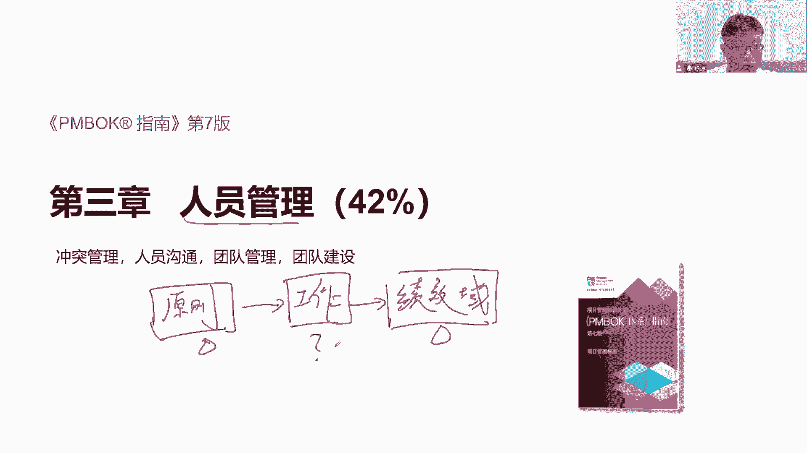

如何来衡量好，我们以这样的方式来进行解读，首先看关于这个原则，先看这块的原则，然后再看绩效，首先第一个概述怎么说呢，他说项目都是由人来实施的，也是服务于人，项目由这些资源。

我们得集成这些资源来干活来实施，然后这个项目他也是服务于这些资源，也就是我们这个项目，他最终的回报价值也是产生了每一个资源上面，每个人上面，所以项目管理一切都围绕着人来开展的，不管是我们开始工作啊。

准备工作，实施工作，以自己的收尾工作，还有呢对这个项目所产生的意义和价值，都是围绕着人来开展，那这些都是我的资源。

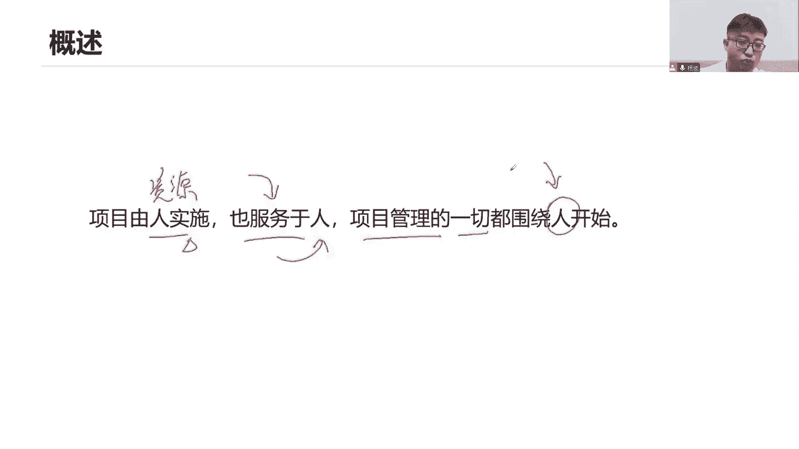

这里面人员怎么管，首先来看这个项目观点12项原则，那这也是一共是12行人，这12项原则，其实都在指导我们怎么去开展这个工作，那么跟人相关的内容有哪些原则呢，在这里面，第一个我们先来看。

成为一个勤勉的尊重和关心他的管家，作为一个领导者，我们是一个管家，那说这个管家它的生存质量含义是什么呢，大家都知道啊，看看那些电视剧，管家管家，其实大多数都是像类似于仆人一样的一个管家。

服务于我们的主人对吧，把这个家管好，打理好，这个家，不管是这个家里面的一些人，还是一些事情，一些家务琐碎的事情都要管理好，那作为一个项目来说，其实也是这样的，我们说作为一个项目，项目上的人，琐碎的事情。

还有他当前的一些各种工作，真正的去管，这就是管家管家管家，我们是一个非常勤勉的管家，勤奋的独立的管家，然后呢，我们是尊重他人，尊重我们的干系人以及关心他的，我们有利他之心，关心他人，促进他的成长。

协作合作的这么一个管家，那我们就是一种仆人式的领导风格，在这里面要尊重他们，相信我们的团队能够完成工作，那这个管家他在我们的工作里面做什么事情呢，还要帮助我们，首先第一个营造我们团队氛围，营造团队环境。

什么样的环境啊，一个相互协作，相互合作，相互信任的这么一个环境，他认为营造环境，那你如何营造，那就需要你在工作当中去协调工作，你要制定一系列当前一些团队章程，在这里面，让大家按照这个指南，按照这个方针。

或者说我们大家一起来制定一系列措施，尽可能的在工作时间我们能够相互促进合作，促进沟通诶，那这是最好的一种工作方式，管理好自己的团队，营造好我们的团队氛围和环境，这是作为一个服务型的领导，作为一个管家。

时任领导一个仆人式领导，我们应该要做一个核心的工作，营造的环境，只有这个环境营造出来了，那么大家才能够在这个环境之下，高效的开展工作，以提高绩效，那除了官网的团队呢。

我们项目上不是还有很多很多人感谢他领导，客户主管经理，这些跟我们项目利益非常相关的人，这些干系人我也得去管他们，我怎么管，我不是跟你们去营造环境，我是希望你们能够积极的，主动的参与到我们的项目里面来。

你们的参与是很重要的，我需要获得你们的反馈，你们的需求和期望得告诉你，在我在定我的计划的时候，在我在有效的去管理我的项目的时候，我得知道你们的期望和需求是什么，那我尽可能的满足各位的需求和期望。

当他们知道我的项目能够符合他们的目标，能够满足他们的期望时，自然他们就会积极地参与进来，参加的项目来给我做各种反馈，我也为什么不断的给你们提供各种项目的信息，让你们了解当前我这个项目处于什么进展。

当前我们项目实现了哪些收益，当前我这个项目有哪些功能完成了诶，不断的和他们做一些沟通反馈，积极的参与，有效的推动工项目完全开展，这是管好我的干性能，那光是管好我们团队，管好干线，这是一种非常理想的说法。

但关键是有的时候，这个人他确实有不同的小心思，每个人的性格也是不一样的，你希望营造环境没错，这是好事，你希望大家能够积极的投入到你的项目里面，来参与进去，给你提供各种反馈思路和建议也可以。

但是这只是我的期望，我的需求，我希望这么去做，但是如何能够做好，所以需要充分的展现，我们作为一个管家，作为一个服务型的领导，一个仆人式领导，他有一个非常核心且重要的点，就是要塑造自己的领导力。

展示出自己的领导力，领导力是什么意思啊，就是当前我展示出自己的一些人际关系能力，在这里面哎我的冲突管理能力，我的人际关系能力，我的情商，我的利益上，我的共情能力，移情能力，我的影响力。

这些全都是我的什么，跟领导力挂钩问题，不要把他觉得想得很抽象，其实我们在学习的过程中会发现领导力啊，大多数都是一些工具和模型，可以帮助你去提炼，我们可以把这个领导人当做一个工具去学习，没问题的。

所以我们需要展示出自己的领导力，来管好我的团队，营造的氛围和环境以及管好我的干系，能让他们能够积极的主动的，有效地参与到项目里面来给我支持，所以展示自己大力非常重要，那光是我一个人展示你大力就可以了吗。

那你这个环境怎么去营造，如何让这么多的干线都参与了，是不是还需要我们团队每一个人，和我项目相关的，每一个人都需要展示自己的领导利益，让我们轮流着发挥着我们自己的一些领导利益，相互影响，相互促进。

相互协作，所以说应该是整个团队，我们全员都能够积极主动地发挥领导力，那这样的话我们的项目不言而喻，肯定未来都是一个非常采用供应项目，一个标杆型的项目在这里面，所以啊我们一共会有这四项原则。

在这里面来指导我们如何去开展工作，怎么去把人资源管理到位来，我们首先要知道有这事，那你说其他原则是不知道，当然你是知道我的工作啊，难道你不就叫价值吗，必须要你管的目的是什么，希望他能参与。

那么参与的目的又是什么，那能够有效推动工作，推动工作的结果是什么，让这个当前我们这个项目能够尽快的产出结果，那么结果的目的又是什么价值，所以要不要去加价值，都得到聚焦额，你在管理的过程中也得整合。

也得整合，整合什么这些肝性人他们的需求和期望，你也对这些管理的方式要做一系列的裁剪，同时你管人是管理团队管理的这个干系人，同时你也得考虑，当前在一个管理的过程中有没有风险，我们琢磨把这个质量产品的质量。

大家一起来思考，每个人都会提出一些质量需求，这些人的质量需求怎么去梳理，怎么去管理，每个人都有小心思，怎么去管好他们的需求很复杂，我们一样的要拥抱适应他们，随时给我们提些变化，当他们的权利变了。

影响利益变了，他们的利益关系发生了变化，你得抱着去适应这种变化，然后呢让校长出去充满韧性，能够尽快调整工作方式，以适应我们干系人，对我们提出一些频繁的变更是吧，总之聚焦价值无理。

还是希望能够推动组织的变革，所以其实我们后面这些原则都是在制造工作，只不过这前面四项原则，但是更多的是站在人员这个层面去管理，所以我们更多会花些时间来讲这四个原则，那么至于后面这些原则要讲。

都要讲那是有更多其他的跟过程相关，跟商业相关的侧重点，我们会在其他地方去找他，而不是不影响都12项原则都会知道我的工作。

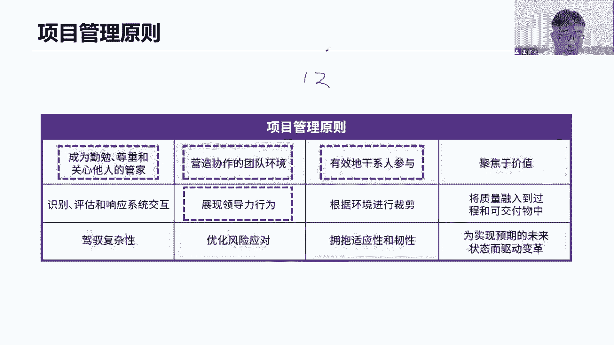

这四个我们会重点去梳理，那就这四个是干性能有效的参与，让他们积极的参与，只有你参与了，参与进来了，你才能够知道我们这个项目怎么去开展工作，他们的参与呢达成了诶，我们的项目成功也就不远了。

积极的参与能够提高他们的什么满意度的，不仅仅只是客户是吧，我说干系人干性有很多，其实我们都是希望让所有干系人都满意，但是认可那这是最好的，来成为一个什么官家，勤勉的，勤奋的努力的，那么服务于他人的。

正直的，关心别人的，可信的，相互信任的这么一个管家，那创造高效的协作的环境，给我们团队营造一个环境，这个环境相互信任，相互支持，相互帮助，相互协作，我们只有相互训练的时候才会传递知识，分享知识。

分享经验，一起来协作，一起来合作开展工作，高效的开展工作，从而实现我们共同的目标，我们的团队，什么叫团队，大家一定得有一个共同目标，这是什么，重要的，如果连一个整个团队的目标都没有，那这个叫团伙。

这叫团队啊，咱是不是有领导力，作为一个项目领导者，你作为一个管家，你知道要管人，要管事情，但是如何管好，你得充分展示出自己的意大利，让这些人能够积极地开展工作，帮这些事情，把这件事情给他做好。

所以展示自己的意大利，对你的团队，对你的各个干系人都应该展示时间更大力，同时你还得培养一个团队的领导力，让每个人轮流发挥着我们的领导力的作用。

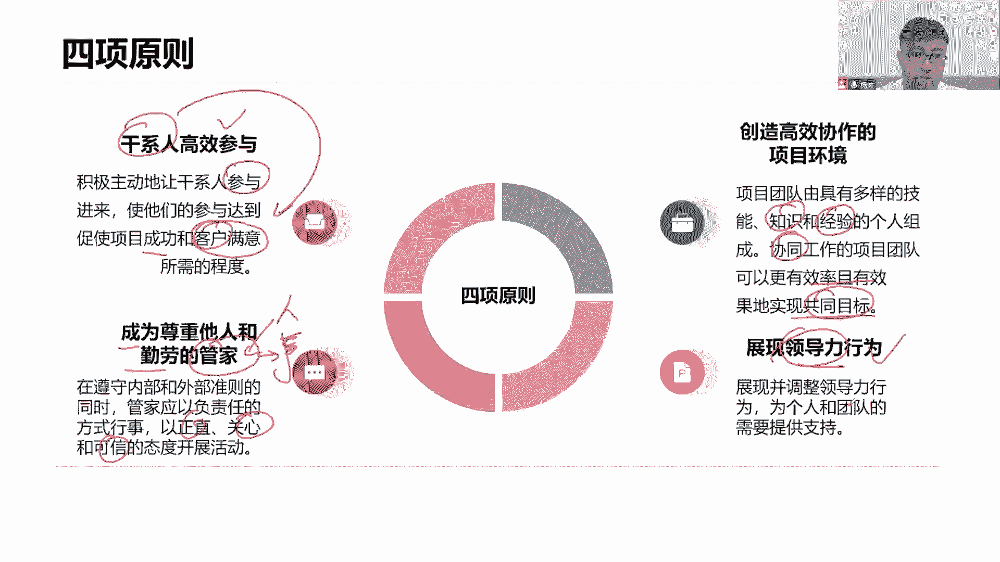

积极的去影响我们干系的，那我们现在第一个原则，我们是一个短接，这个管家是一个勤勉的，尊重他人的，关心他人的努力学习的高情商的证明的管家好，这就是我们说希望自己成为这样的管家，在这个管家里面。

我们必须要以什么正直关心他人啊，要可信的这些态度来开展，工作人员在这里关心政治可信的合规，你做项目就得合规啊，你不能够符合我们当前，而不能够去违背我们什么法律法规吧，什么社会影响，你得做出正确的引导。

你得以身作则啊，这是很重要的啊，管家那这个管家式的管理啊，包括在组织内，组织外，其实我们都会有相应的职责来对应，我们秉持是一个什么当前管家式的管理，同时还要考虑财务的，社会的技术人员的。

资源的可持续发展的，各个什么外部的内部的一些环境，因为我们具有外部和那个职责，那必然就会考虑我们内部的外部的一些环境啊，这些环境怎么去营造。

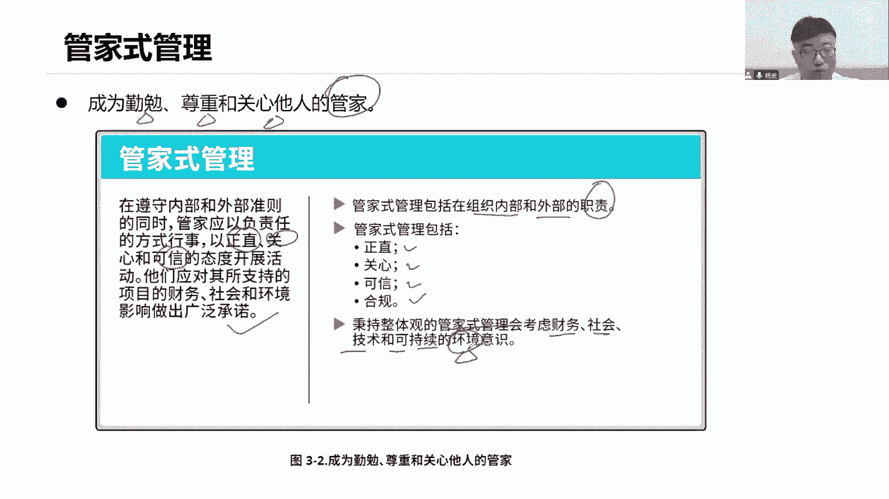

是不是从后面那些原则要梳理的好，那成为一个管家管家式的管理啊，就是一个服务使用和管理，在这个网站里面我们怎么去做事情呢，开管事务，这是监督工作这个意思，然后呢以负责的方式来规划我们的工作。

同时呢合理的去使用和管理，我们当前的一些人员，或者是用物质资源，团队资源啊，物质资源既有人又有物，把这些资源合理的利用，维护好我们团队的价值观，维护好创统一我们的团队，搭建团队的共识。

同时要维持一个职业道德，你直接说你要做合规的事情，不能做合规的工作，那这个就很重要，所以这就是管家上具备的一些理念。

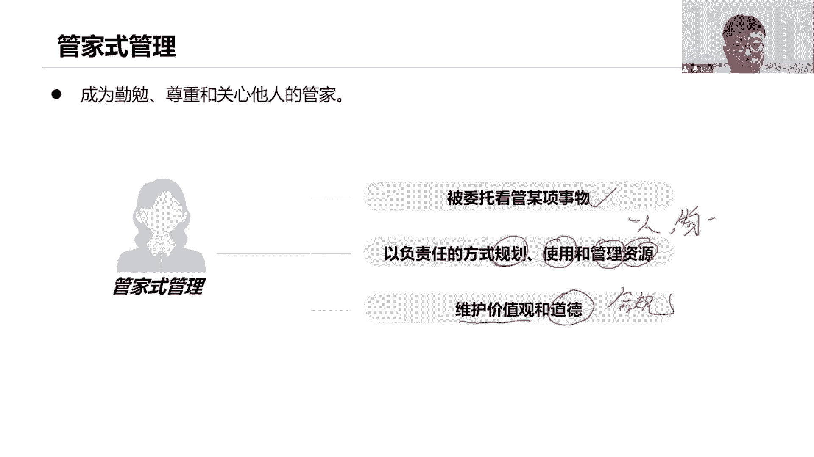

在这里管家你看对内的管理，哪些是对内的管理啊，组织类，这个是指组织内哈，我们企业内部的维护好我们组织的目标，维护好我们组织的战略和愿景，还有使命啊，让他能够长期的价值，就是站在一个高屋建瓴的角度。

一个上帝视角说当前这个项目的目的是什么，我们的愿景是什么，传递给大家，让大家开展工作室，有动力，有意愿知道我们这个项目优势什么，竞争点在哪里，亮点在哪里，和同行相比，我们的优势在哪里。

做这个项目的意义和价值是什么，它对于我们每个人的价值又是什么，它是否符合我们组织的战略目标，诶，我们我们这个项目的优先级是如何，你得让大家去了解这个问题，那你得让大家来，首先你得知道是不是，然后呢。

你维护好，尽可能随时去传递，去贯穿我们当前组织的愿景和目标，是不是愿景和目标，你说我们不生产水，我们只是大自然的搬运工，这是愿景和使命，当然是啊，我们是全球最大的医疗器械生产商。

我们是全球最大的it服务供应商，全球最大，全球还很宏伟的愿景和使命，尊重我们的团成员，你这个管家记住，要尊重我们的团队成员，让他们能够获得公平竞争的待遇和机会，每个人公平公正的去对待他们。

或者说有些团队成员他和你的关系好吧，跟你之间可能有更多的去接触，你在他这个绩效考核的时候能够有些偏重，那不行啊，这个可能不行，公平公正尊重每一个人员啊，包括他们一些民族的信仰等等，文化的不同。

因为有可能我们是一个跨国团队，来自于不同国家，那么每个人的愿，每个人的什么文化差异是不一样的，你得尊重别人啊，然后呢给大家提供一些公平的待遇，或者是进行测的机会。

其实就是说我们在进KPI的时候要什么公平，哪些人是一个水平线，哪些人又是另外一层水平线，咱不能有太大的差异，在这里面，在最公平的对待每一个我们的团队人员，监督内部使用一些组织财务或者资源的情况。

就这些资源和资金怎么使用的，你要尽快的去监控他们，哎钱怎么花呢，项目的成本，项目的预算如何发展，监督项目的资源，人力资源，物质资源又是怎么分配，怎么使用的，定期去监督。

做好这些资源的使用和资金的一些使用，正确的去行使我们当前项目管理者，我们管家的一个权利，尤其是在领导职位上，我们说项目经理是不是一个领导，他是一个领导，是整个团队的领导，那么这个职位他带领了哪些权利。

你要正确的去使用我们做哪些权利，你给团队去分配任务，是不是，当然是啊，那你给他们定KPI都是你给他们奖励，你给他们处罚，惩罚其实都是职位代表你的权利在这里面，那么问题是你是每天去骂他们。

还是说经常我们去鼓励他们，表扬他们认可的更好，其实大家都能想得出来，是不是如果有一个领导天天在那边说，你这样不行，那样不行，这样做不好，那也是道啊，通过各种的观点来指责你，你觉得你的心情会很舒服吗。

肯定不一样，你连开展工作的动力都没有，没有激情，但即便说当前我这个做的不好，但是我的领导他会告诉我，小杨你做的不错，至少你比上次有非常大的进步了，我很看好你，就这些话术一说出来，这个我就感觉很舒服。

领导在关注他，知道我的进步，他知道，我认为我们这个团队的贡献力量，认可及时的认可，激励和表扬是非常重要的，所以我们要正确的去行使当前为领导者的权利，项目经理也是一个领导者，我们说管家是管家。

我们是一个仆人，是个领导风格而已，但毕竟你也是一个领导者经理，项目经理，那么对于组织关系来说呢，我们要关注些什么，外部的事业环境素，还记得吗，我们的事业环境数也分为内部的，有分为外部的。

外部的什么行业的法律法规的，天气的环境的变化，内部呢企业内部相关的企业文化，当前我们企业的一些组织变革，组织结构，还有呢当前我们企业的一些基础设施，技术人员能力，这些都是事业环境数来。

他们会这些事业环境因素，什么持续性，以及组织对资源的使用情况诶，我们都需要去做好关注，这是我们组织外部的提出，然后呢维护好我们外部利益相关方，企业外部的一些人员，客户供应商。

这些人和我们的供应商伙伴取得伙伴，做好一些人际关系，打好关系，虽然说关系很复杂，但是你得去维护好关系啊，关注我们组织及项目对社会的影响，也就是指当前我们这个企业啊。

企业与我们市场的整个外部社会的监管的等等，我们这个行业的发展，我们在这个行业里面我们起了什么作用，我们在对这个社会运行的一个什么样的影响力，推动行业发展，推动行业在项目管理这个这块领域的一个什么。

最佳实践，就是我们在这个项目团队里面，所采取的一些方式和方法，希望能够推崇到以他为标杆，推送到我们整个行业，让我们整个行业都来参考我们的工作方式，我们的最佳时间，这不就是提升你的组织的影响力吗，对吧。

那是很重要的，管家是对内，对外都要展示出自己的影响力的领导力。

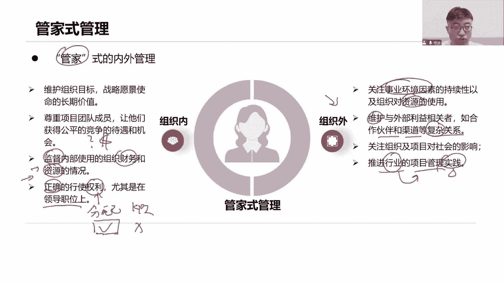

那管家是职责是什么，第一个诚信，刚刚说诚信什么，就是你看这里说合乎道德，树立榜一样，建立信任很重要，信任的氛围就是乐于积极的倾听他人，并接受他的一些反馈，这都是一种展示出自己的一种诚信的表现。

尤其是注意这一点，同学们建立信任的关系是很重要很重要，它是直接影响你当中，未来能不能打造出一个高级要团队，一个非常核心减重的一个点，这个氛围一定的相互信任，只有在性能环境之下，他们才愿意去主动跟我交流。

分享经验，分享知识，如果没有这种相互信任的环境，你觉得我们还愿意去分享知识吗，我还愿意把我所学的知识给你做分享，让你成长起来，那我们就有可能被淘汰，这就不是一个项目骗人，这是非常充满竞争的一种。

是企业文化在这里，所以我们要印证这种相互性的氛围，而且要乐于去倾听他的，就是说我们在一个企业里面，不是在快，不是看我们有多么上学期给别人做服务，就是我们想往这个组织里面往上走。

并不是看我们多用商业区给别人做反馈，而是在看我们多么善于去接受别人的反馈，那么接受别人的反馈，是不是就是在倾听啊，我们乐于倾听，我们积极倾听别人给予我们的一些反馈，不管这个反应是正面的还是负面的。

我们都要怎么认真去听，所以这个积极的倾听，乐于倾听，它本身体现出来就是个领导力，在这里面你不能说别人在跟你说话的时候，你马上反驳他，你马上强词夺理你，甚至在干别的事情，那这些都不是一种积极心境。

在这里面作为一个管家管家，诚信诚信很重要，在这里面尤其是我们的信任和积极清清好，第二个呢关心那字面意思啊，关心谁啊，关心你们团队啊，密切的关注我们团队的各种问题，不光是绩效，不光是我们工作绩效。

不管是还包括什么，当前我们的一些团队的一些发展啊，他们一些期望他们的需求，特别是关注我们团队的一些产出，这个产出直接是什么，就是价值A产出，我们的口腔污染，我们的成果产出的是我们的成果。

这个成果会直接产生价值，这个价值会直接对应到我们的组织战略目标的，对吧，所以我们要关注我们产生的成果，是否符合我们的质量要求，是否符合我们客户的验收标准啊，在这里关心我的工作，关心我们的成果。

然后呢可信让我们团队建立彼此相互又是性能，你看这里又提到了信任，你说这个性能重要，性能更重要是建立高效的一个基础，一个基石，一个必要性，管理者应该让大家相互信任的信任，你看这个信任在这里面做了更加强调。

做了一个更深的强调诚信，诚信帮他其实是个诚信，就分成两个，一个是诚实，一个是信任，那加起来就是诚信，所以我们说信任也就是可信，一定要营造一个相互信任的氛围，这个性能性能大家未来把它当做一个关键词。

要把它记住，你要看到这个新闻，你要知道这是我们管家是管理的时候，他的一个基本职责，在这里面，我们要营造一个氛围，这样才能够相互沟通协作，未来我们还会讲这个性能，它的一些其他的知识点。

这个新人会引出很多的知识点，能合规，符合法律法规的要求，这个字面意思啊，在合规是前提啊，咱做任何一个项目，你得符合当前行业的标准，社会的这种要求，符合我们的法律法规，合法合规，在这个基础之上。

专门产能够有效的开展工作啊，尤其是涉及到职业道德的问题，那就很重要了，有的时候企业在开展性工作，可能他并不会去考虑这么多，但是我们作为一个管家，对把自己的什么这个视角提升起来，职业道德。

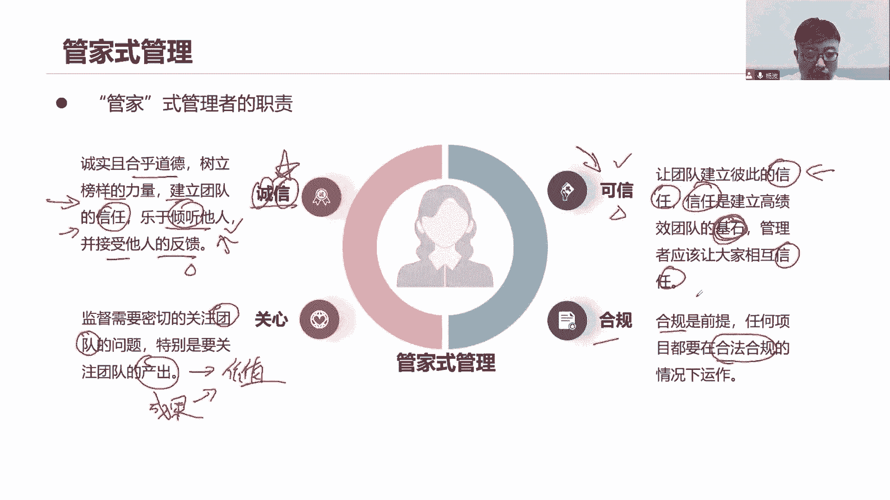

所以你看管家式的管理项目，可能会产生一些正面的或者负面的影响，或者是成果，那么团队需要去权衡权衡什么，组织和目标与我们这些干系人，他的一些需求和期望来做出最后的决定，所以说这个肝细菌啊，在整个过程当中。

他们会积极或者正面或者负面的去推动作，影响我的工作，那我们就应该怎么去整合这些干性能，他们的需求和期望，所以干性能的管理他会作为一个绩效率来考核，我们有效地引导干系人积极的参与。

这是我们管家是管理他的管理员工作，在这里面，还有呢国家社会管理必须要以透明的方式，且相互信任的方式来进行引导领导，辅导指导团队工作，这个透明是什么意思啊，意味着当前我们要对我们项目的各种信息公开。

或者把它叫做分享都行，你不能藏着掖着，不管你当前这个技巧是好还是坏的，好的你肯定要分享出来，那坏的呢，同样的道理啊，你不能说报喜不报忧啊，那这个肯定不行的，任何跟我相不相关的各种信息。

咱就必须把它公示出来，公司出来公开出来，张贴出来，让所有的干系呢他们都能够来到我的办公室，一眼就能看到当前有哪些做得好，哪些做的不够好，你透明是以相互信任的方式，相互信任。

甚至来领导我们进行干系人积极的参与进来，越来越多组织从整体的角度去看待业务，那么同时也考虑什么，各种财务的技术，社会的环境的性，相互的影响，从项目整体的角度，或者说从组织的整体的角度。

那这个组织整体我们前面说有一个人，他在看组织整体C，这些人是不是在看我们组织的人体，那我们也要朝这个方向去看齐啊，我们要站在组织层面，整个企业的层面去考虑一些问题，格局眼光要放高点。

我们甚至可以看到我们组织的战略问题，当前有些新型技术你会见得到，如果说我们组织没有去正确的看待他，那你要思考这个新兴技术，会不会对我们组织产生断崖式的影响，这些都是我们战略的去思考，你要洞察。

要洞察当前商商机啊，在这里面是否能够把握住这个机会啊。

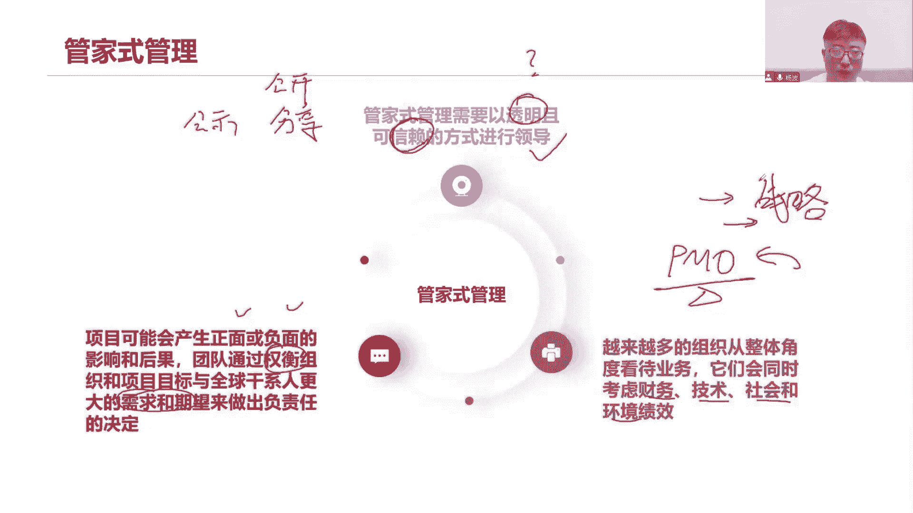

这是管家知识管理一个更高的期望，在这里面好，我们再看这个团队的原则，团队的原因是什么，要给大家营造一个良好的企业，做的相互信任的一个氛围，又输了信任，团队管理原则，首先团队是有多样的建筑技术知识。

进入个人注射，就是大家来自于五湖四海，你的知识，你的背景，你的经验是完全不一样好，你的个性报，你的个性与独自工作的一些个人相比较，协同的工作我们更有效，更有利于实现的可交付成。

所以我们要打造一个什么样的绩效团队，要打造一个相互协作的团队，在这里面那个打仗，打仗是你自己把它打造出来的，还是说需要我们团队一起来，相互共同的去促进这个工作，协作和合作，才能赢得这个氛围。

现在营造氛围才是关键点，我们要打造一个高绩效团队，怎么打造，希望就是你要促进团队合作，你要给他们机会，让他们相互的协作和合作，而不是你一个人就把这个服务给做完了对吧，所以你要站站在这个团队的角度来说。

你要思考一个问题，怎么能够让团队成长起来，怎么能够让他们一起来协同工作，合作与开展工作，项目是由团队交付的，这个是很重要的，他们交出的是我们的成果，既然成果这么重要，我们关注成果，关注这个价值。

所以团队的管理显得尤为重要，在这里面，那你看项目团队在组织和企业文化，还有什么原则的范围之内开展工作，没错，基于我们的企业文化，基于企业环境，基于当前一些什么各种原则理念啊来开展工作。

通常会建一个自己本地化的文化，这个本地打个引号就是团队文化，企业有企业的文化，团队有团队的文化，我们要营造一个什么样的文化，相互支持，协作互助，帮助努力和鼓励这些文化都可以协作的环境，有助于什么。

你看这个算诶，保持我们的组织文化，只能一直保持我们的个人进步，个人的学习，保持我们为交付期望的成果而做出最大的贡献，做出最大的鼓励，所以我们才会不断去营造一个协同的环境，协作的环境。

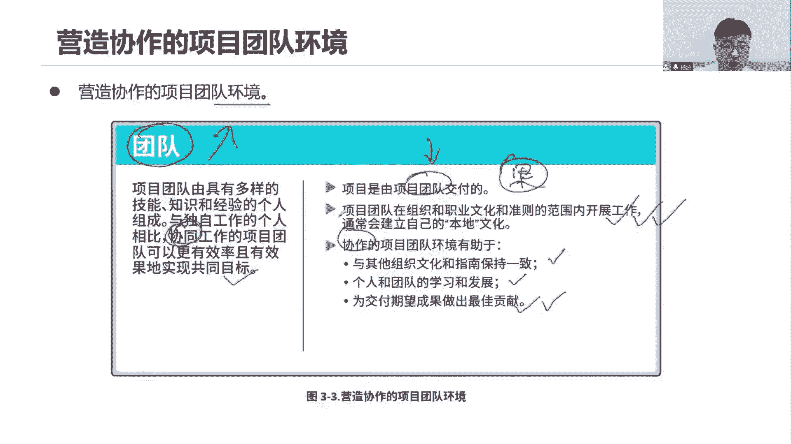

那团队团队的营造什么样的团队环境呢，团队的共识，组织结构过程和团队文化，我们从四个角度来看，对于我们说这个团队的环境啊，首先第一个要达成共识，我们必须得有个共同的目标，这才叫团队对我们当前所定的计划。

定的目标以及我们的价值观，我们对达成一个共识，接下来是一个组织结构，这个组织机构不是我企业组织团，是我团队的组织结构，基于我项目经理中心，我下面有哪些部门，哪些单元，哪些小组以及这些人员。

他们对你的角色职责，权利和能力等等，都有可能会思考这些问题，以及为了完成这个工作，我们要开展哪些过程，开展哪些开展哪些工作，在这里面，然后呢，团队要不要团队文化必须得优化，我们现在说像营造一个氛围。

营造一个环境，那这个营造氛围和环境，其实就是要打造出要塑造出我们的团队文化，什么样的文化相互理解，相互包容，关心他人，相互协作，相互沟通，相互合作，这么一个环境在这里，这才能够利用于打造高绩效团队啊。

那么至于后面你说这个组织机构，你看说了很多，确定角色职责而不去分配，大多把工作分配到人，然后呢确定目标，然后以及我们开展各种展会，那这就是具体的工作里面，它体现了是吧，基于这个组织结构里面。

我们该怎么开始工作，我们要用哪些人，哪些角色，哪些职责，我们之间的权利是我们怎么去交接工作的，还有呢过程怎么去开展工作，激励过程中说这个什么工作分解，把工作做一个分解，我们还要做一些梳理，需求的梳理。

以及当前的需求，我们把它粘贴出来好，这些都是为了完成这些工作，我们要去分配任务，跟我的团队去分配任务，那这些任务怎么去分解，这些任务怎么展示，这些任务怎么去梳理，那后面的过程。

你讲的这些内容都在我们的过程运营。

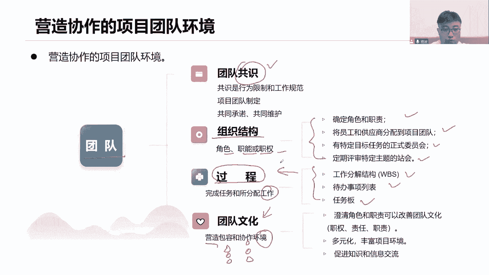

或专门拿出来说一下，那有效的管理我们干性的参与，对于干性的参与来说，这个原则要记住，这个显然有为重要，你说我们怎样有效去引导他们呢，积极主动让那些人参与进来，使他们的参与达成我们项目的成功。

让客户满意度，他所需要的程度就是我们的该系统的参与程度，直接影响了我们这个项目的成功概率，或者说我们客户的满意程度，这就是项目方，为什么这些干线呢要把它管理起来，积极的参与，参与度越高。

项目的成功的概率就越高，客户的满意度也就越高，所以他会对我们产生很多正面或者负面的影响，在这里感谢会产生这些影响，那我们肯定要积极主动去引导他们，来引导他们，通过争取现在干性的参与。

为我们当年这个团队来做一些服务，以及为他们的助学服务，都可以，干性的，积极的主动的参与会推动我们价值交付成果，该系人注重参与进来，能够有规律地参与到，像你们一些评审验收为梳理，以便于我们能够准确的是吧。

以合理的方式，在既定的时间地点推出我们的产品和交互。

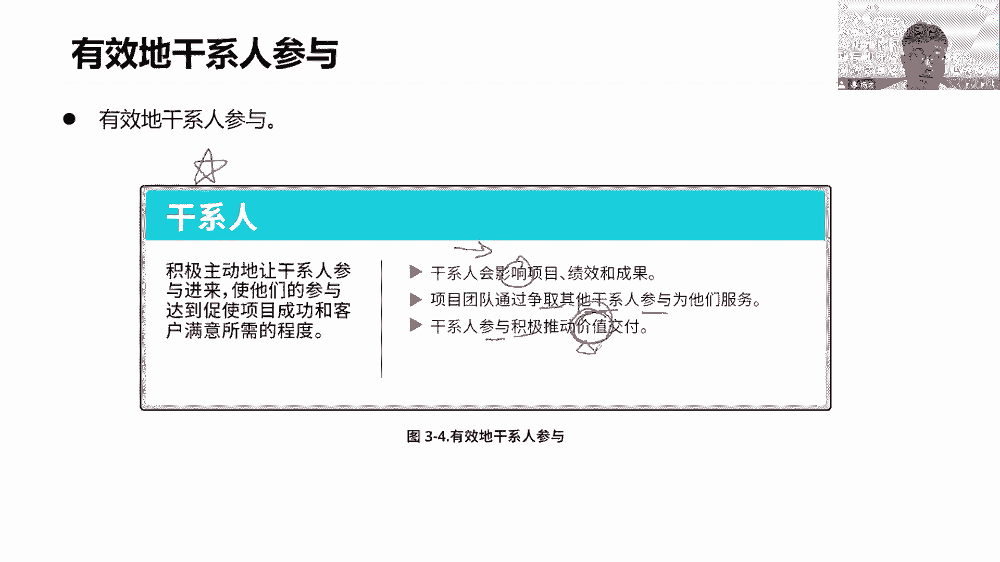

实现价值交付，干性能在整个项目期间，比如说干性的参与表，它是要持续的，那有可能某些参干系呢，他们的参与程度会发生一些变化，但不管怎么说，我们怎么变化，他们肯定会影响我们的项目。

我是希望他们能够积极主动地参与到项目里面，同时通过这个参与啊，他每天看到我们这个项目，是能够给予他们一个回馈，给予他们一个反馈的，在这里面，所以在整个项目期间，项目条件要积极的。

让我们干系主动参与进来到我的项目里面，来一减少我们的消极影响，把它们的积极影响它放大，参与，有了主观意识，他们才会提出更多的意见和建议，那这还说让我们干系人脉参与，有助于我们团队找到更为广泛的干性。

能接受的解决方案，只有你们参与进来了，积极的主动去提出一些需求和期望，我才能基于这个需求和期望去想，我们有哪些解决方案可以来满足各位项目感性。

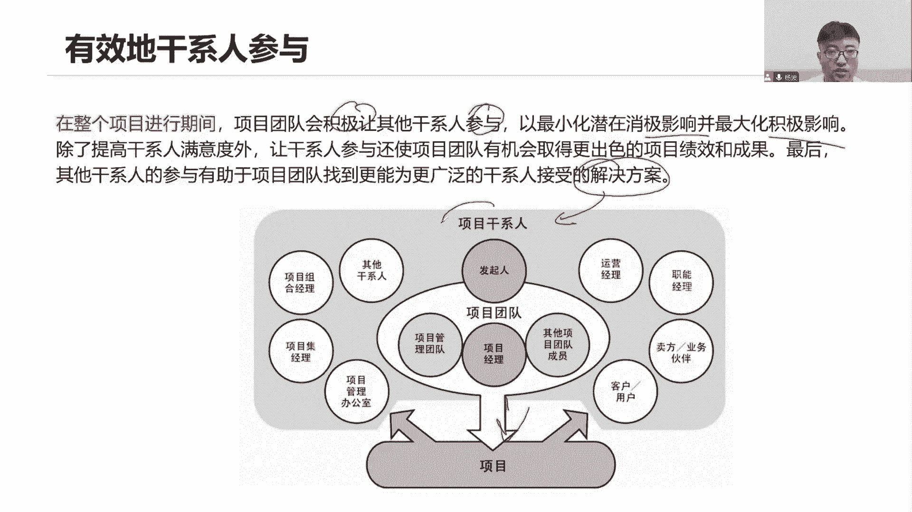

但单性参与包括哪些，他说包括我们在定需求的时候啊，对我们进度计划的时候，制定我们成本预算的时候，以及管理项目团队的时候，制定整体计划以及交付我们可将的成果。

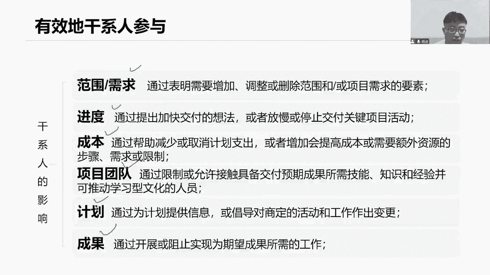

大家看看就可以了啊，交付一些成果，然后呢还有我们这些文化项目，文化企业文化收益的一些，实现这些风险的管理质量管控，以及提高项目成功的概率，那这些都是什么，我们当年有效的参与。

我们干性的一个必备的一些内容啊，我们这些工作。

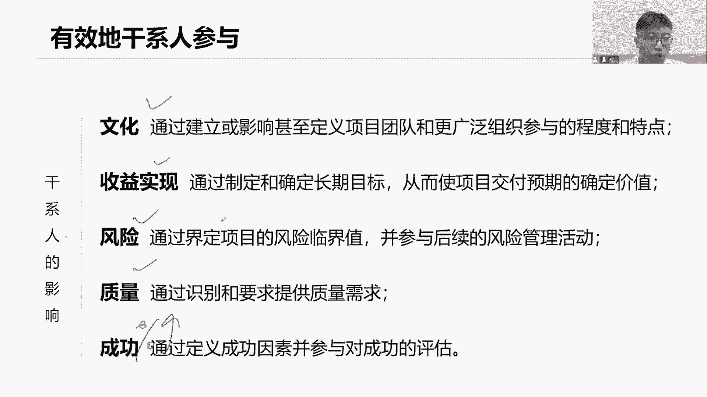

他们对我们项目的影响到底影响在哪里，那接下来是0。0，然后前面我们讲了，要想让干性的积极的参与，要想营造一个良好的协作和相互信任，一个氛围，怎么去做这些事情，做事的方法，做事的流程，这个好说。

但关键是毕竟人怎么去管理起来，用什么样的思维方式去做事，那是不是显得就非常重要了，所以我们要展示出自己的什么领导力影响力，我们的移情能力，共情能力，让他们能够积极的主动的参与进来。

诶那这个就显得非常核心提升了，所以我们要展示出自己的领导力的风格，在这里面领导你啊，特别特别的核心和关键点，然后呢展示领导力怎么去展示呢，你在这里说，留下的领导力也可以帮助你去取得项目的成功。

你觉得你取得积极的结果，能够不仅是我自己，你看任何的项目团队性能，他们都应该展示出自己的一个什么领导力，在这里面必须展示出自己的一些仪器，的一些重大利益，还有呢领导力与职权不同。

这句话怎么去理解与实权不同，领导力啊和这个职责权利是不一样的，你有项目经理，你是项目经理，你是一个经理，你是个领导者领导者，你可以下班，可以怎么去下发指令，这是你的权利，但你这个下发指令人，你是在管理。

你在管理团队，并不是在领导团队，我们说的领导是纸张讲，你有你的个人魅力的，人际关系的能力和情商管理的共情能力，先让他们能够主动的开始围绕着你来干活，而不是通过管理的方式给他下放任务分配制度。

这是和管理是不一样的，领导和管理是完全不一样的，有效的领导者，他会根据我们的情境来调整自己的风格，当前我们说这个团队在不断的发展，在不同的阶段，我们团队会有不同的反应或者这些情况。

那这个时候我们要不断的去调整自己的，领导力的风格，那待会我们看到有哪些领导人的风格，这些每一个领导力的风格，它的意义是什么，我们可不可以混合使用领导的风格在这里面。

然后他说领导力领导者必须要有什么诚实的，政治的非常人，那前面讲了，我们要做事情合法合规，来展示出我们所期望的一些行为。

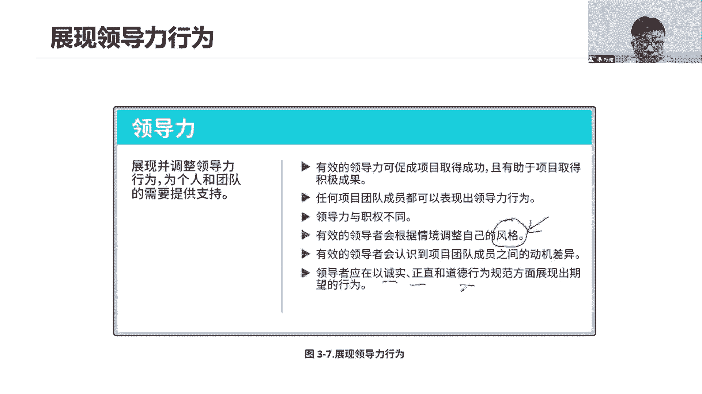

是诚实正直，具有职业道德，那你看展示出自己的领导力的一些行为，任何人开展的项目人员，其实我们都应该去展示自己的领导力的风格，只有任何开展项目工作人员，不光是我这个管家团队的团队人员。

和我们这种干性的每一个人，他们都可以展示出自己有效的领导力，来影响别人，来推动，或者说来促进我们更多的感性的，能够通过我们项目里面来参与进来，来执行我们的工作，已经完成了产品的科教学成果。

意大利他包括项目团队内外的个人实战影响，以及你看以便于实现预期的成果和态度，所能利于性格和行为，他就是在说这个领导力的定义啊，就说领导力他有个定义，就是就是我们个人的一些内部的，外部的施加影响。

对我自己是什么情况对吧，对外部人员又是什么，我内部人员我怎么听一下，外部的人员如何去施加影响，你表现出我们当前每个人，对我下面一个不同的态度，领导力不应该很多，职权划分，刚才说了，职权是指管理领导病人。

他是指领导，你看他说当某些高级经理的优先事项发生冲突，有冲突，有分期不一致的时候，我们中立的领导要比详细的建议更有帮助，这句话啥意思呢，有冲突，我们尽可能引导达成一致，双重嘛就是不一致啊，有分歧。

那这个是我们最好的方式吗，引导达成一致，而不是提出更多更详细的解决方案，来让你去选择去做决，策错了，引导面对面的沟通，以合作的方式解决这个冲突，项目组成员通过增加或者时间。

各种技能技术的组合来加上领导力，所以我们说领导力他并不是很虚的东西，它是可以用这种构成工具和技术，工作工工具和技术来提升的，后面会讲一些模型啊，领导力的风格，有专制型，一言堂是吧，大家投票方人型不充分。

授权指令型给你相关指令，参与型积极战争，参与自信心必然出自己的一个自信，也让团队能够相信自己知识性，给你们提供服务和帮助，共识达成共识，共时性一直不利于致力于达成共识，在这个团队里面一直共识。

所以领导的风格是多种多样的，那是只有一种风格，他是是否有当前我这个项目，那就错了，你没有必要去专门找一种领导的风格，来去开展某一个项目，这些领导你的风格，他都可以这么混合起来去使用的，在项目的不同阶段。

在项目的不同层面，你会用不同的风格，比如说刚开始你是这个团队，刚开始建立，你就指令啊，因为大家不熟悉，不认识，不知道该怎么开展工作，你就下发指令指哪大学，你说什么他们就做什么事情，这就是指令性。

一开始组建的团队好了，后面我们团队慢慢的慢慢的哎规范起来，慢慢的规范起来，是不是可以用参与性的方式啊，让他们积极的主动的参与这个项目，来你们提出自己的想法和意见，提高你们的意愿，但是呢我也回不用去监督。

我会看你们这个解决方案到底有没有问题，可不可以再增加一些点，比如说哎如果再增加123，这三点就更好了，我在让你们参与，其实我也在这个过程去参与，我们一起来碰撞的想法，参与，当大家都到成熟的阶段之后。

那就意味着什么，你可以充分授权你作为管家，你有权利在市场，那你这个权利可以下放给你们团队，让他们自己开展工作，自组织，自己定目标，自己定决策，唉自己组织工作了，那你把权力下放了，你做什么事情。

你不就变成一个什么支持性，一个服务性的工作，在这里面来给大家提供支持，提供服务，提供帮助，引导辅导指导，鼓励支持，帮助多好，而不是你一个人一个人说了算，这样才能把什么达成共识了。

所以你看是不是多种领导的风格，他都可以混合着使用，所以没有一种风格会被认为是业界最好的，总领导的风格，没有不同场景。

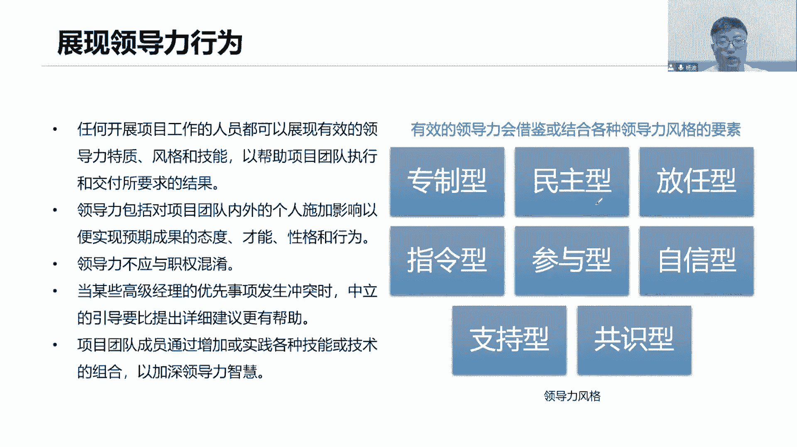

用不同的管理方式好提升领导力，怎么去提升，有助于我们让团队聚焦于什么是上天，有些目标啊，这里大家看看就可以了，聚焦，然后呢采蜜我的愿景，不断去官宣我们的愿景，以及当前啊获得一些项目的一些资源。

或者是支持，达成共识，克服障碍，克服障碍等，教练团队指导团队。

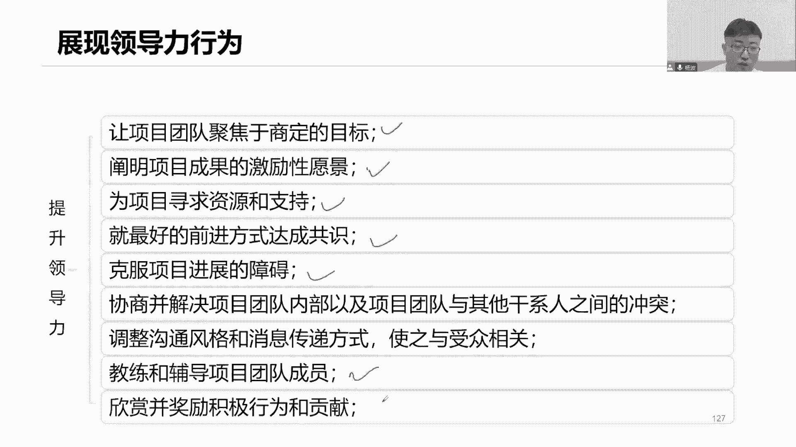

欣赏每个人贡献，鼓励温和以及引导达成决策，提供发展的机会和支持，那这些都是什么，提升领导力的一些行为，在这里面啊，怎么建立有领取这些团队对自己的偏见和行为，有自我意识，自我意识就受到情伤了，然后呢。

那么适应变革，就这个什么各种角色来开展一些工作，知道大家工作承认错误，勇于承担错误，都是来提升我们领导力的方式。

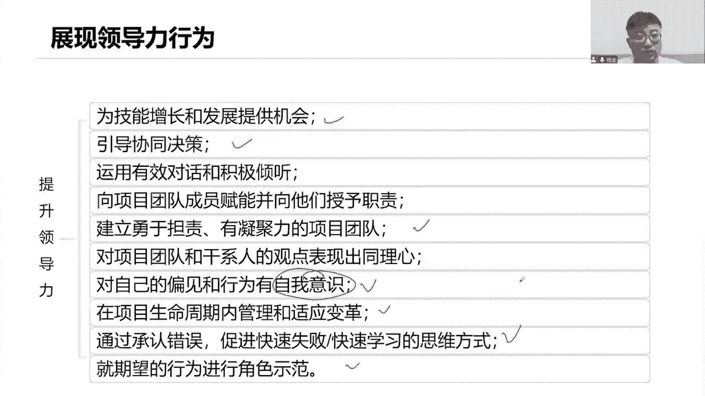

在这里面，接下来我们对领导力做一个总结，领导力并非是特有角色所独有的，那就是它不仅仅只是我们项目经理，所应该具备的领导力，他要求我们每位团队成员都应该轮流着，发挥着我们有效的领导力的技能。

所以我们的很多很多的团队成员，他们应该都自主地表现出来，我们可以领导，是不是我们可以团队成员自己组织，一定要教我来组织吗，大家可以轮流发挥领导力的作用吗，以及我前面说了，有人来到了我们的项目团队。

那这个时候我们是不是可以轮流着，给我们的新团队成员，介绍一下当前我们项目的情况，我们项目当时遇到一些问题，不需要照顾，项目经理专门去给这个新成员去做鉴赏，第二个呢，成功的领导力能够使我们在任何情况下。

影响他人，激励他人，指导他人，教练他人，每个人都可以这么去做指导辅导激励，帮助影响以及言传身，教，教他们怎么去按照一个正确的规则来开展工作，仅仅拥有职权还是不够，这个职权职权包括你的责任，包括你的权利。

就怎么说，管理是需要，但是呢不够，还需要用我们的领导力来激励我们的团队，实现我们整个团队的共同目标，那用我们的领大利亚领导引导指导，他们能够积极主动的开展工作，影响甚至影响高层，影响到我们的高层人员。

调动他们的个人利益，来支持我们当前团队的一些工作，已取得团队的成功，并非是个人的成功，所以说领导力它能够激励我们团队，共同实现目标，促进大家协作和合作，也能够影响我们这些利益干信任。

希望他们能够支持我的项目，支持我的团队，从而实现我们整个项目的成功，有效的领导力会借鉴或结合各种领导力的风格。

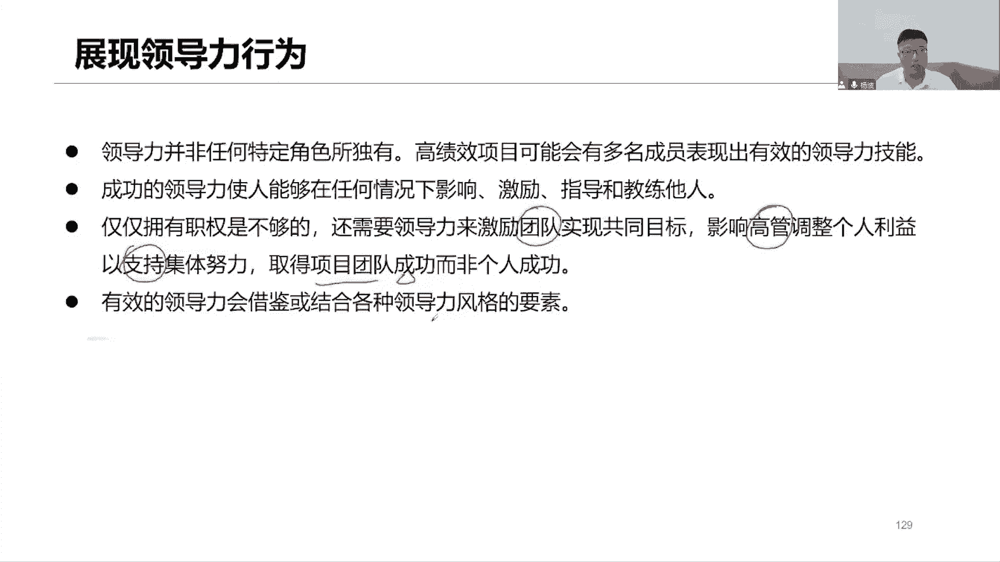

附加素，也就是我们前面看到的这些，各种领导力风格的要素，都可以混合着结合着一起来使用，因为并没有说任何一种它是非常有效的，或者非常专业的，都有都有在特定的场景之下，他能够发挥特定的作用。

所以我们在项目的不同时期，或者说在我们团队成员他们成长的过程当中，结合着不同的领导力的风格，让我们团队尽快的成长起来，把他们培养起来，成为独当一面的人，那么到后面我们肯定都是一个方，任性的项目领导者。

我们都给大家提供各种支持和帮助，诶后续的工作，那当然就由我们团队自发来组织。

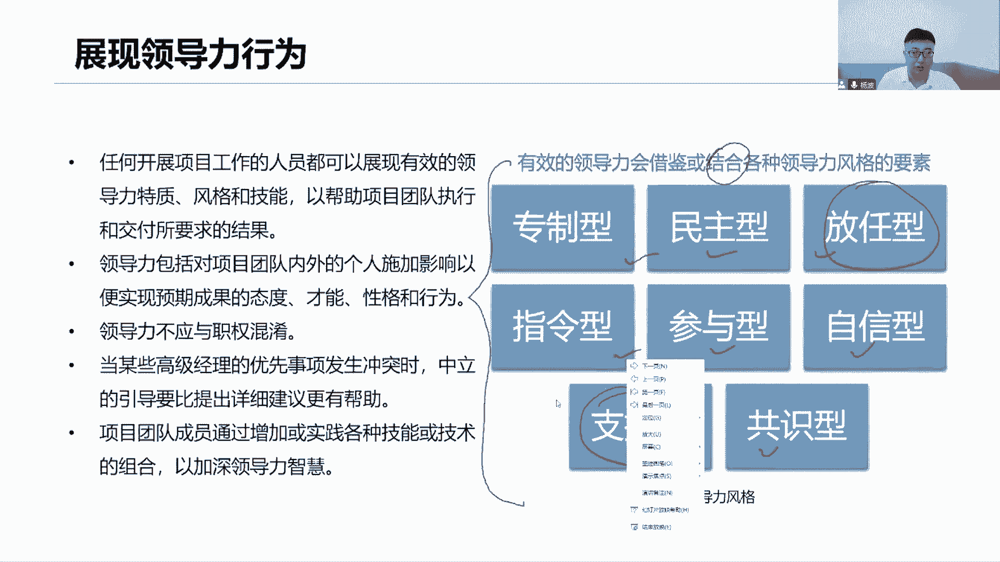

因为他们已经成熟起来了，好接下来我们说这个领导力，关于这些原则就讲到这里，那么现在我们是不是学了我们四项原则，这四项原则包括第一个，我希望我自己能够成为一个勤勉的，尊重他人的，受人尊敬的同时呢。

也是关心他人，利他之心的这么一个管家，那这个管家里面其实也就是要服务于我们团队，那么服务团队或者说服务于我们干系人，那就意味着我有两个对象，第一个对象是我们当前的团队，我会给大家营造一个良好的氛围。

围绕我们的团队里面有这样一个良好的环境，或者我们把它叫做文化诶，我前面看到团队的文化营造出来的文化呢，性能的协作的，公开了，开放的安全等等等等等，一个正向的良好的环境，只有在这个环境之下。

我们才能够按照我们自己所确定的，一个项目的目标，共同的去努力，第二个服务于我们的一系列的利益干系人，那这些利益干系人我是希望他们能够支持我，那就这里提到了给我一个支持，给我鼓励和认可。

他们能够积极地参与到项目里面来，才会支持，所以支持是一方面，另一方面呢，要希望你们能够真正有效的去参与，参与到项目里面的，有了主人翁意识感，才会投入心思，投入精力量，以及帮助我们团队投入资源。

投入资金等等，那么这些我们这些我们作为管家要管好团队，要管好干系人，我们要充分地发挥着自己的领导，你才能够管理好我们团队和代谢，那么除了我有领导力就够了吗，不够啊，是不是希望大家都能够有领导力。

这才是我们的核心啊，大家都需要共同的领导，每个人都发挥着领导力的作用，来激励我们团队，互相帮助，互相协作，互相合作，相互影响，相互影响，我们共同进步，来我们携手进步，我们步履不停，一起进步。

当我们团队里面有任何可能能力不行，绩效不足的时候，或者当前工作表现不足的时候，我们可以指导他，教导他，以获得我们整个团队的进步，获得我们所有人的成功，因为团队的目标就达成了，那我作为管家。

目的也是希望我们通过自己的努力，达成我们整个团队的一个目标，那这就是我们当前说管人的一些原则诶，我自己要成为管家，还我要给大家营造环境，让大家能够相互协作，营造氛围，营造文化。

第二要希望我们的干系人有效地参与进来，那这样他们才能够支持我的工作，就积极的引导他们去参与，那如何引导如何营造氛围呢，充分的发挥着我们自身的领导力，同时我还要教所有的我们的相关方面，我们的团队们。

他们都需要具备领导力的能力，来共同为我们的团队目标而开展工作啊，管人他的一些原则，就这四项核心的内容大家掌握之后，接下来我们会针对这些原则来开展工作了，在工作的过程当中，我们就要看结果做的到不到位了。

是不是按照这些原则来做了，如果按照这个原则来开展工作，那么接下来是不是我们就要看看我们的绩效了，我们的绩效到底是如何怎么去体现我们的绩效，所以接下来我们会从我们的两个核心的绩效域。

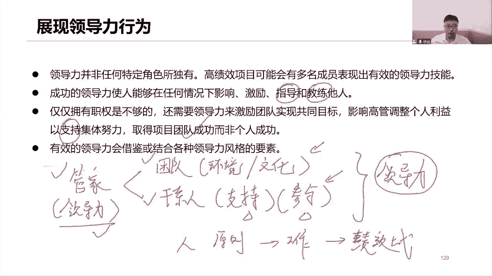

来开展。

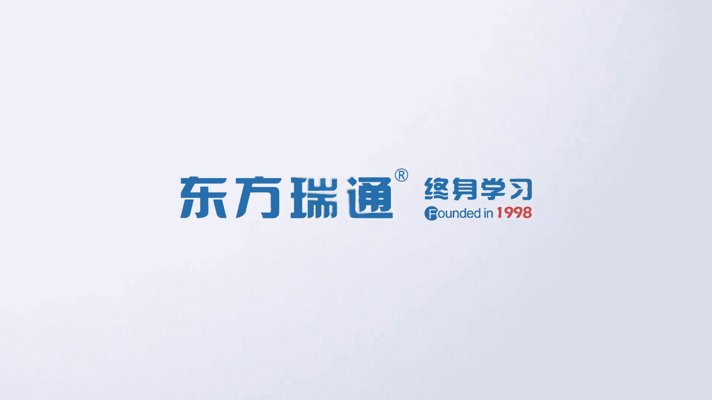