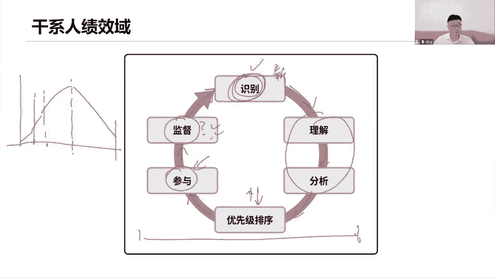
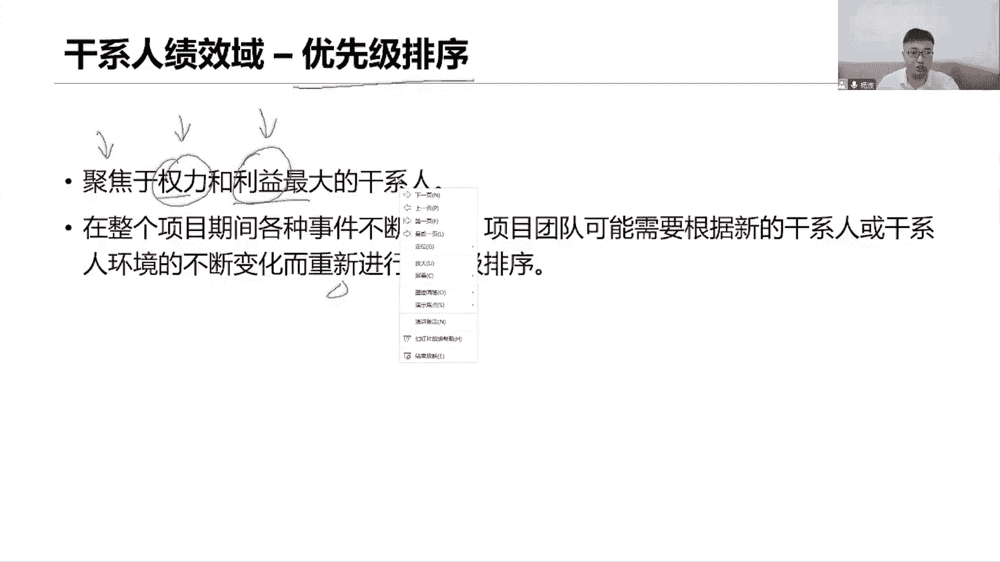
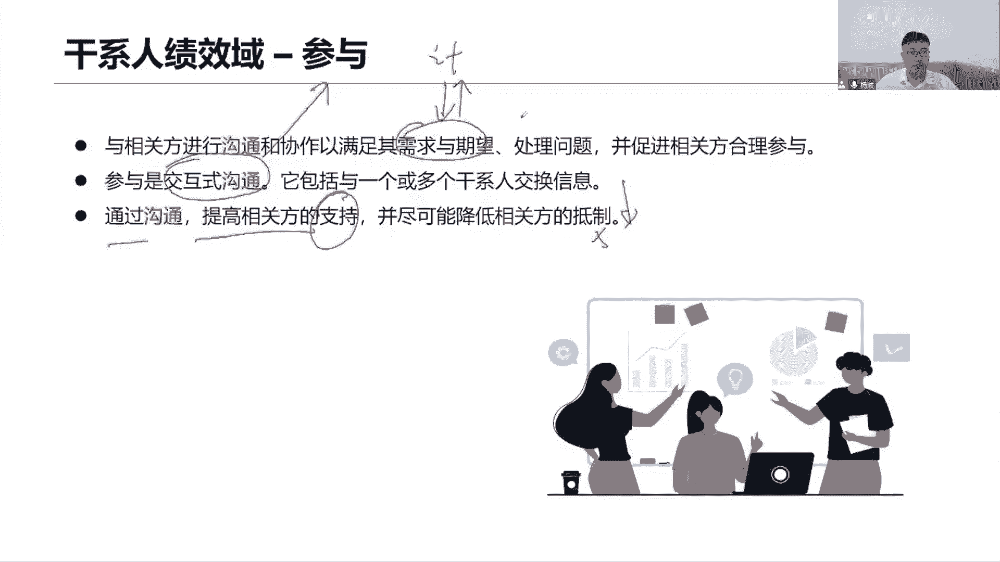
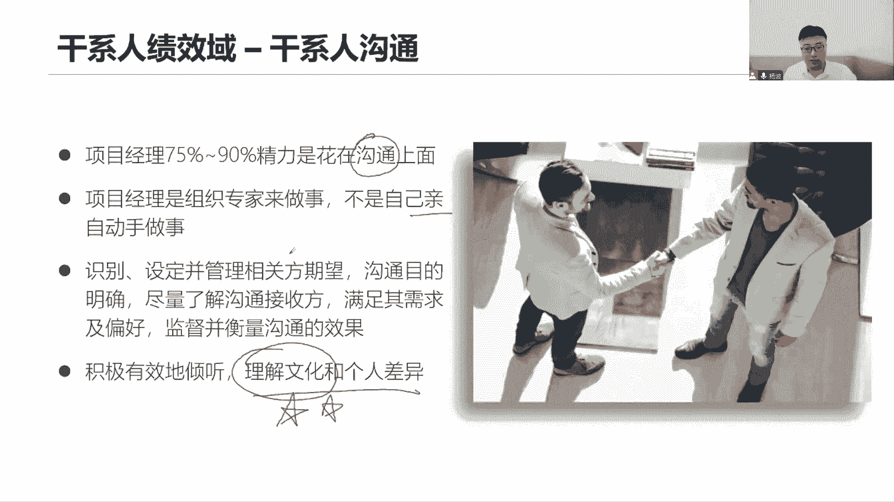
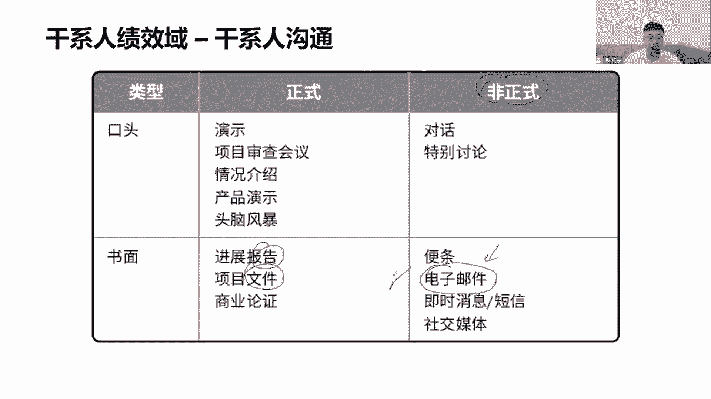
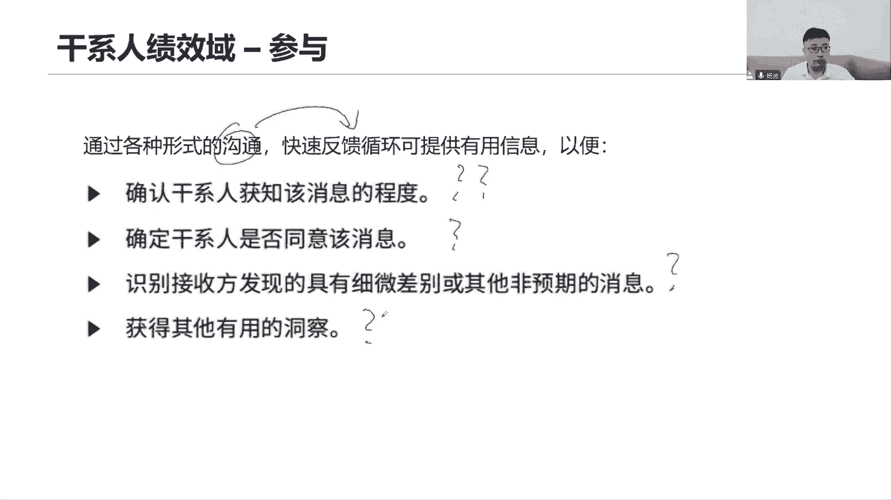
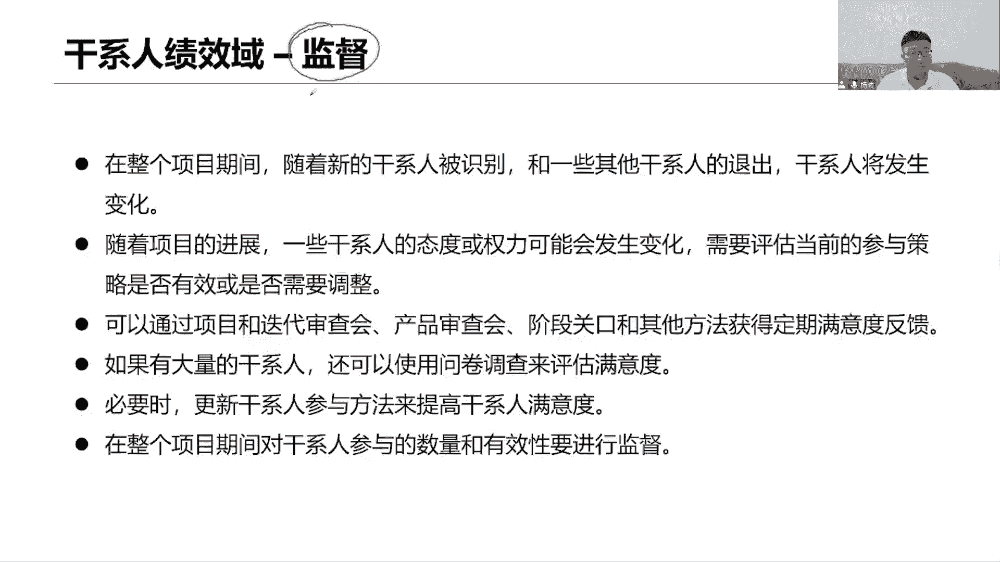
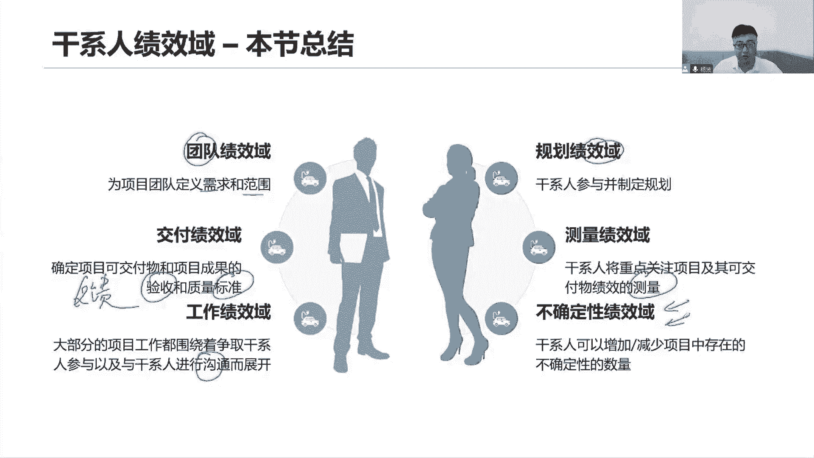
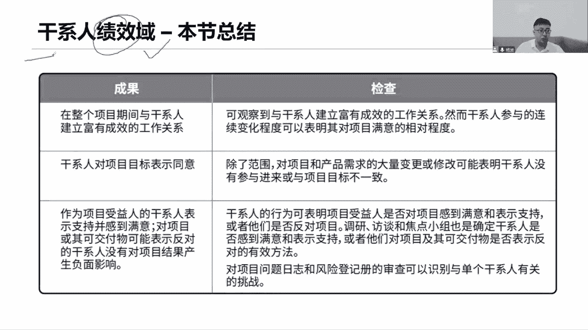
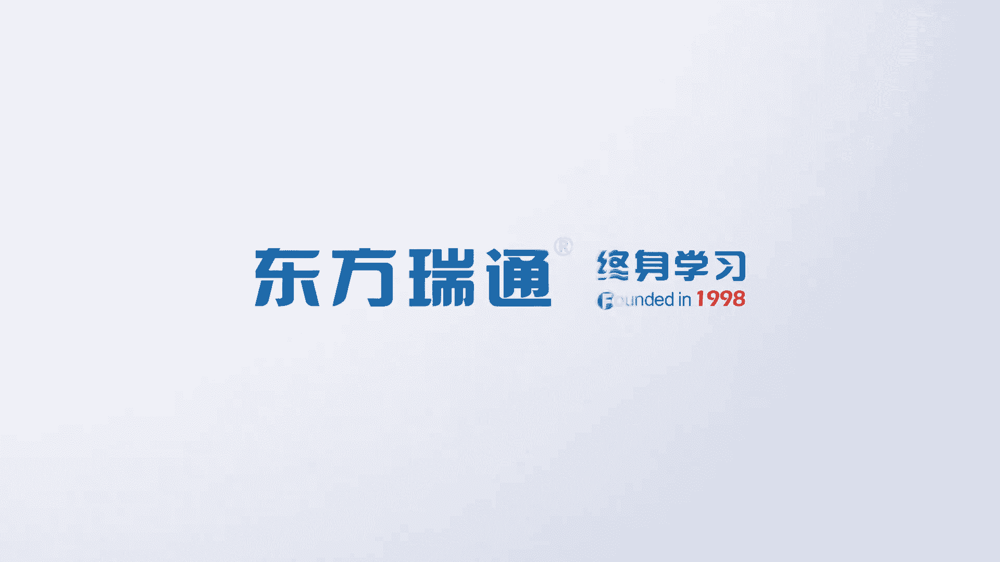

# 全新录制PMP项目管理零基础一次顺利拿到PMP证书 - P10：PMP精讲课干系人参与2 - 北京东方瑞通 - BV1qN4y1h7Ja

那我看干性人怎么管理，首先我们一共分为这么六个流程，在这六个流程里面，我们首先看看第一个识别相关方，识别干线找人，找到这些人之后呢，接下来我们去考虑点分析和理解，我们可以把它合在一起，可以的理解他人嘛。

同理心，那你怎么去理解呢，那我得先了解你当前有什么需求，有什么期望，意味着我还要同时对你做一个分析，在这里面分析各位，感谢你们的需求，希望你们的权利利益影响力，还有你们对我向往的态度找到人。

然后呢对他们做一些充分的分析和理解，之后做这些事情，目的找到他们的一些特定的一些权利，利益影响力，是因为我们需要对这些人做一个分类和排序，哪些人我们需要重点去管理，而且和我项目之间的利益关系也很好。

那像这样的人，是不是我们就应该去重点去关注他，对重点关注啊，让他传递一些比较核心的重要的一些信息，让他能够在关键节点做出一些关键性的决策，这才是重点管理好，接下来，那么基于这个分类信息之后啊。

我们就希望能够制定出一些参与计划，然后呢按照这个参与计划，不断的和他们开展沟通，让他们能够积极有效地参与到项目里面，来提高他们的参与度，以及获得他们对项目的支持，在整个项目生命周期。

刚刚说要不断的去监督各位该新人，你们的需求和期望有没有发生变化，另外一方面，你看这个建筑物他为什么又指向识别，为什么指向识别，还记得前面我们在讲相关的三个曲线吗，有一个曲线。

是他在不同阶段参与的人是不一样的，那既然说是不一样的，是不是我们要不断的定期的反复的，持续的去识别，所以说又回到识别去找人，有哪些新的干系人来了，我们又要对他开展理解分析排序，重新定参与。

然后呢不断的去监督，又没有有心的人以及这些人，他们的态度是否又发生了变化，而不断的去监督监督监督企业，都在整个项目生命周期里面，都在用持续的任务啊。

那么看干性的识别，第一个识别干系的定期圈出来，这是个重点，这是一个考试的重点，定期反复持续的去识别，因为各个阶段参与的他不一样，那么把它找到之后，我们还要干嘛，分析分析什么呢，他们的权利利益影响力。

参与度，依赖关系等等，以及对我项目成功的一些潜在影响，好好多好多内容我们都需要把它分析出来，并且把这些内容都给记录下来，那么既分析又记录的目的是什么呢，使我们的团队能够建立对每个相关方。

或者每个我们的相关方的群体，做一个适度的关注，他们当我们了解了这些信息之后，我就知道哪些人我们需要重点关注，哪些人，我们可能需要监督就可以了，做一个适度的关注，这个适度意味着我们分不同的类型。

不同的策略去关注他们，不是每个人都一视同仁，有区别的，然后识别，当前看，是识别每个干性人，对我们项目的一些需求和期望，了解他们的需求和期望，分析出来，以及他们对我们项目的一些贡献和作用，也就是影响力啊。

在什么阶段他们的影响力比较大，之后就没有影响力了或者减少了，那都得分析出来，对识别就是去分析，那么怎么分析哪些内容，看这里再次做个总结说，那么权力作用态度，信念，期望影响程度，临界性利益义还是什么。

其他方面说这么多啊，咱们要做个总结，要做个归纳，那到底我现在识别该性能，对他们做分析分析的是哪些内容，我们分成三类信息，第一类信息大家可以写一写，就是这道题，我们对这些干系呢，他们的第一个权利。

还有呢利益，以及在不同阶段，对我们项目产生的影响力有多大，这是第一类信息，第二类信息呢是指当年每一个县官方，每个干系人，他们的需求，以及各位你们的对我项目的一些期望是什么。

你希望我这个项目能够达到什么样的水平，那你希望我这个项目能够满足你的什么利益，第三个呢，那就是当前对我这个项目的态度了，到底是支持还是反对是吧，这个态度很重要，所以我们去总结分析该系列。

着重掌握这三个类型就可以了，这三类信息权利利益影响力，这是为了便于我们对他做一个排序，而用的，而这个需求的期望呢，是便于我们未来在做开展工作的时候，能够把他们的需求期望纳入到我的计划里面去。

而他的态度呢是指当前诶，他对我这个项目的态度，以及我们应该如何去改变他的这个态度，维持他这个态度，态度也会影响当前或者一些制定，他们对我项目的参与策略很有作用了，所以这三类信息一定要把它记住啊，三内容。

接下来你看这里说了，权利利益影响力，这是什么，第一类自勉，意思啊，这个人的职权这种级别，这个和我项目的利益关系，这个人对我项目的推动作用啊，影响能力，还有呢作用和期望，改变这个改变项目，改变执行能力。

改变项目执行的一个能力，其实这三这是前四个都是一类，然后接下来是什么需求和希望又是一类，当前对我项目期望期望，也可以理解为是他的需求需求，也可以把它从侧面来理解为，我们是对这个项目的期望到底是什么。

最后他对我项目的态度是支持还是反对，还是中立，还是不知情，或者说他能够充分地发挥着自己领导力的作用，来推动这个项目开展，了解你们各位的一些态度都得了解，接下来基于前面的分析。

我们要对我们的干系人做一个优先级的排序了，也就意味着当前到底有一个重点管理哪一类人，对吧，聚焦于权利和利益最大的，能够很能够直接影响我的项目产生直接影响，做出重大的决策。

同时他和我这个项目之间的利益关系也很高，它受我这个项目的影响，他既向我的项目，又受这个项目最终了效益的影响，或者说当前我们做这个产品，它会直接用我们的产品开展工作，开展业务，那当然利益关系很大。

这类人我们要聚焦，既然说是聚焦，意味着要重点去管理这些在整个项目期间，各种事情不断发生，项目团队可能会根据我们新的干性或者干性的，环境的变化而重新排序，是不是就是前面这种监督干性的参与啊。

当他们权利利益影响利益需求，期望态度发生变化的时候，发生了变化，我们要重新去分析他们，分析他们当前的变化是什么，然后重新对他们做一个优先级的排序，才能够在变化当中以适应它的这个变化，从而制定一个最优的。

适合于当前这个环境的一个餐饮策略，能够让它始终保持一个积极的主动的参与程度，始终让它发挥着领导力的作用，来引导我们的团队或者支持我们的团队。

好排序之后，我们就知道了，当前哪些人需要有不同的参与策略，那么就希望他们按照我们会定一个参与计划，按照计划来指导我们的干系人，有效地参与到项目里面来参与参与，其实就做一个事情，沟通。

和我们的肝系统的相关方开展密切的沟通协作，以满足你们的前面我们所识别出来的一些内容，你们的需求期望这一点很重要，只有满足了他们的需求和期望，他们才会有效的积极的持续的参与，以支持我的工作。

所以我们要不断的和他们沟通，以传递项目的信息，这个沟通不仅仅只是说我和你说话，我和你聊天，那我跟你聊什么其他工作或者工作之外的事情，它就是指当前我们这个信息的传递，那你的传递方式就有很多。

可能是我和你面对面的沟通或者书面沟通，或者什么钉钉微信的沟通，或者我给你发个邮件，或者我把这个信息给你共享出来，你自己来取，这都是什么，项目成员，沟通目的是希望你了解我的项目参与了。

我们说更多的是一种交互式的过程，这是最好的方式，所以交互交互就是指他，我们和干系人之间做多次信息的交换，我和你开会打电话，视频会议都可以，就是我说你听你说，我听我们反复进行多次信息的传递。

沟通和确认已达成共识，这是最好的一种沟通方式，交互式沟通，所以能够让他们有效的参与，希望我们能够多做一些互动沟通和交流，通过沟通才能够提高他们的支持，以降低他们对我们项目的反抵制。

因为他们知道参与进来了，你们才能了解我的项目啊，了解我的项目，你们才能知道自己的需求和期望，是不是按照这个计划能够满足，如果可以满足，请你们给我一个反馈，支持我的计划，我希望你们是支持，不要去抵制我。

推动我的计划尽快的完成，这样才可以满足各位的需求和你们的期望。

所以目的就是做沟通，一个优秀的项目经理啊，大多数时间是吧，我说大多数的时间，大多数的精力都是花在沟通上面，不是说你什么事情都要你自己亲力亲为，错了，我们说项目经理啊，他通常来说是一个非常专业的人。

或者在某个领域比较厉害啊，他是某某里面的某些专家，以及不管说是做管理，做技术，他都能够融会贯通，那像这种情况，我们知道项目经理他是很专业，他能力是很强的，就意味着在工作当中，他可能会看我们的团队成员。

做事能力不行，绩效不行，速度有可能没有执行力，效率低，然后呢做事情质量不可控，他就喜欢自己亲力亲为好，你这个事情不做了，我来做什么事情，都项目经理，你亲自来做，那你的团队未来就会形成一种什么文化呢。

这个事情找项目经理，他能帮我们搞定，有人来问你的团队这些需求这么做，问我们项目经理问他，他知道，也就意味着你是整个团队的瓶颈，没有让团队成长起来，他们并不能够独当一面，并不能够自组织的开展工作。

更别别说领导力了，那更谈不上，因为我们希望每个人发挥在领导力的作用，所以这个时候下面你要注意，你就已经陷入到了人力陷阱里面去了，什么叫能力陷阱，就是你越擅长的事情，你就越喜欢做，你喜欢亲力心理去做。

因为你是专家，你擅长吗，你是专家，你是擅长，但是呢我们知道你越擅长越喜欢做，你越做就越擅长，那这个事情以后就脱离不了你了，这个事情以后都只能你来做，团队做不了，那么团队就发展不起来，成长不起来。

团队成长不起来，去思考一下，对我们项目经理来说，它的影响有多大，我们都知道前面讲了，项目经理的定义和概念是什么，是由执行组织委派的，带领我们的团队，带领我们的团队来开展工作，以实现项目的目标。

也就是说我们得利用好团队的力量，如果他们不成长，你没有培养出自己的左膀右臂，请问我们项目经理如何晋升，家里有同学可能会想，他们如果不想起来，那不是把我的位置给挤掉了吗，对就是要把你的位置挤掉。

就是希望有人能够代替你的位置，你才能够真正的往上走，你要想你往上走，你这个位置不就空出来了吗，那么请问空出来谁来做，当前没有人来做，只有你能做，只有你能够把这个团队做好。

只有你能够带领团队去完成当前的工作，那我怎么晋升呢，那你说组织不可以招项目经理吗，可以招，但是招揽了项目经理，有你熟悉公司的业务吗，公司可不愿意承担这个风险，而且还花成本，那就只有你继续做。

所以啊你就卡在这个位置上面了，动不了了，也就意味着可能未来3年五年七年，你还是一个这个项目的项目经理，你怎么往上走，你怎么成为我们前面讲项目管理，基础知识里面讲的，他这个人厉不厉害，可厉害了。

他对上负责组织战略，对下负责管理，那你不想成为这样的人吗，当然想，所以我就继续往上走，只有我们能够培养出自己的人才，培养出企业的骨干管理人员，我们的影响力才能够看到我们的外部可见性，才能够看到。

当我们的团队绩效有所表现了，能够为我们企业创造价值，能够为我们企业的战略目标而服务，公司的领导，高层是看得到的，就会把你批判起来，因为这些岗位也需要人啊，越是上层的管理层越需要有能力人。

越需要培养出更多的优秀的管理人员，所以越需要我们这些能够培养出骨干人才的，向领导者好，所以大家注意，不要什么事情都亲力亲为，说到这，我们只讲个题外话而已，尽可能的利用团队的力量。

也就是说我们要和团队多一些沟通，怎么沟通呢，你可以和大家一起来去沟通，我们当前项目的愿景，产品的愿景，项目的目标，团队的OKR等等都可以沟通的，那你这东西太虚了错了，顺便又讲一个题外话。

我们说经常和我们的团队啊，不管是开会还是说在做个人绩效考核的时候，要做一个很重要的沟通，是怎么沟通呢，就是指当前我们的愿景和使命，你可以站在企业的愿景使命上面，还可以站在部门的发展目标上面。

也可以站在项目的目标上面都可以，就是要对我们的团队成员去做这些事情沟通，如果有的团队责任这东西太虚了，不想听听不进去，那就说明什么，每个人对啊，我们到一家企业里面去开展工作。

每个人都在寻找一个工作的意义，这个意义是什么呢，你会发现有的时候我们的团队人员里面，他们有的会自愿留下来，多做一些事情，希望把这个事情做好，希望多学习一些知识，为什么。

因为每个人也有每个人个人的愿景和使命啊，我个人的职业发展目标都得有，如果个人的意义，个人的发展目标，符合我们项目的目标是保持一致的，能够贴近于我们当前的部门的，这个整体的一个发展计划。

甚至能够和我们企业的战略目标保持一致，和我们整个企业的那种我们项目的愿景，产品的愿景，企业发展的愿景和使命保持一致，那么他们就愿意为之而努力，愿意为之而付出，他们当前更多的精力在这里面做好一件事情。

而不是做完，那你说这样的人是不是值得你培养，是不是值得你去把它挖掘出来以培养，所以说我们很多时候去宣读去怪圈，我们项目的目标，部门的目标，企业的愿景，产品的愿景是有意义的，因为他是在帮助你去选拔人才。

不是不用的，你就要去看哪些人更愿意去认可，我们企业的愿景，去理解当前我们整个部门的发展方向，去理解当前我们项目的目标，项目的愿景，从而为之付出努力，表现出自己的领导力的行为。

表现出自己当前付出更多的精力，在我们的项目工作上面，这是不是会帮你选拔人才，项目经理，你要注意哦，擦亮你的眼睛，看一看周围的人，哪些人正在为之而付出努力，所以我们要沟通，就是沟通这些内容。

同时当然我们也会去沟通，我们工作上的一些内容，我们工作上肯定当前有一些绩效绩效情况，团队成员的绩效，你要不要沟通，当然得沟通啊，团队之间有冲突了，有冲突也得去，我们开展一系列沟通。

团队之间有团队遇到的问题也得沟通，所以我们工作上的各种事情，咱得去多沟通，不是你去帮他们做啊，这里还说你看最后一页，沟通要注意他把他圈出来，这是后面我们专门去讲沟通，要重点去关注这个点。

理解文化和个人差异，因为现在很多全球很多项目里面，他都来自于不同领域的不同国家的一些人，我们是一个多元化的团队，甚至说我们是一个跨国团队，那像这种跨国的多元化团队里面，文化差异是很明显的。

那这个文化差异，我们在沟通的时候就要思考一个问题，我跟他传递的信息是否理解了，我给你比一个拳头，你是什么意思啊，不是我要打你，不是我要揍你，是我给你加油助威加油，你是最棒的，我相信你是可以成功的。

我给你传递正能量啊，不是要打你。

你想沟通沟通呢分为正式沟通和非正式的沟通，那正式沟通呢可以是我们当前开个会，我们做产品的演示啊，做产品的一个演示，或者说我们开展一个头脑风暴，大家提创意，提意见开会啊，那非正式呢就是一种非正式的对话。

在不同的场景，可能在非工作场景下，我们开展一些特别的一些对话啊，然后呢还有一种是书面的沟通，那么书面就是写各种报告，写各种文件，非正式呢给你写个便签纸，写一张卡片，写一个邮件，发一个语音啊。

通过钉钉微信给你发个消息，那这就是对称设计不通用，大家小心点，这个内容在工作当中，我们大多数情况下都是发邮件打火车啊，不管你们用什么软件啊，用什么用什么系统，其实我们很多时候都是以邮件的方式。

来给大家传递一些信息，比如说跟我们说团队怎么样公公示一个信息，你认为是一个真实的，或者说你给领导请示一个内容，让领导给你个反馈，说同意还是不同意，可能LINDA就是毁了一个意见同意。

那你认为这是正式的吗，错了在我们整个项目管理体系里面，邮件回复了，那都不是正式，一定要用什么以文件的形式，文件或者报告的形式，那这才是一个书面正式的方式，你得给我签字和确认，我得留存我的存档啊。

不要用电子邮件。

干性的参与来看，对于参与来说，我们参与的方式通过沟通，以快速的获得反馈，来给我们提供一些有用的信息，这就是参与，通过沟通来管理我们的干系人，积极的参与项目里面来，所以通过沟通能够确认。

当前你对我这个信息了解没有了解到什么程度，是否同意啊，是否有些不一致的理解，或者说你了解了其他什么额外的信息了吗。

生成这个信息有没有了解，这就是沟通，在参与的时候，我们要不断的去监督我们各位干系人，他们之间的关系也会发生变化，你看在整个项目期间，我们随着一些新的人被识别了，那新人来了，人来人往，咱得去买。

去识别了他们，有人走了，有人来了，我们都要去识别，因为他们在发生变化，有些人来，那么这个人对我项目的影响力是什么，他的需求期望又是什么，我得去不断的去识别是吧，这个识别是不是刚刚讲定期的。

反复的持续的去识别，随着项目的开展，一些干性的态度啊，权利啊，利益啊，需求和期望会发生变化，所以啊我们要重新去调整，他们的个什么参与策略了，因为之前评估的参与策略肯定是有问题的。

这一系列的属性全都发生了变化，有一个人他升职了，有一个人调岗了，你觉得参与策略不变吗，升职了可能权利啊会发生变化，是不是这个人调岗了，可能利益又会发生一些变化，影响力等等都会发生变化。

甚至他的什么需求和期望也会随之发生变化，所以重新去分析，重新排序，重新制定参与策略，重新按照策略去和他开展新一轮的沟通，传递信息，始终保持让它在整个项目期间里面，都能够对我们项目发挥领导力。

以支持我们的工作，可以通过各种会会会，以获得一些满意的度的反馈，就是我希望能够调查各位，感谢在这段时间以来，对我项目的一些满意度情况，希望各位各位如实的反馈，那你可以组织一些各种会议啊。

来收集他们的意见，这些会员后面我们专门讲敏捷的时候，会跟大家去讲好，如果有大量的干系人，那用问卷调查来收集满意度，想要获得满意度的反馈，除了开会以外，如果人特别多，而且大家都不在一起，那你有问卷调查。

问卷调查大家理解吗，以前你看比如说我们去商场去餐厅，很多时候有的有的服务员，他们就拿一个什么问卷过来说，让你花一分钟或者2分钟帮忙做一个问卷调查，你或者你对我们这个产品的一个买入。

或者说是对我们这个这个用餐的满意度，服务的满意度，这个口味的买入啊，这些都是做问卷调查，以便于他们去改进工作，他就得收集你的需求，或者男生打游戏也是这样的吗，游戏里面也有很多这个有奖问卷调查。

说你喜欢什么类型的游戏啊，你喜欢这个游戏呢，是因为是这个界面好看，人物造型好看还是剧情好看啊，剧情剧情满足你的要求，你未来还喜欢玩什么类型的游戏是吧，是角色扮演还是实时的这个对战。

或者说是什么经营类的游戏，你都会做很多的满意度调查，就是希望收集各位的需求，我只有了解你的需求和期望，我才能够制定你的参与度啊，我希望你能够推出什么新的产品，新的服务让你参与进来，让你对我这个品牌。

对我们这个企业有更好的满意啊，就是这样的对吧，必要的时候更新我们干性的参与度，以提高满意度对，因为你知道知道这些内容一旦发生变化了，重新去更新我们的参与策略，以提高满意度。

甚至我们说始终保持一个较高的满意度，在整个项目期间，对干性的数量来进行有效的，什么和有效性要进行监督，有哪些人参与到我的项目里面来了，人多不多，人多的话，后面我们会学习一些参与类型的模型。

但他选择的模型也是不一样的，而参与度有没有效啊，要做进一步的建筑，如果没有效，重新更新我们的参与方法，所以监督监督就是在整个项目期间，不断去监督各位该县人的状态是否发生了变化。

以便于我们去制定调整新的参与策略，那所以我们看对北站我们做一个小小的总结，对于我们说当前这个干性能参与啊，是希望我们通过一种流程，什么流程呢，先我们去识别到它们，识别之后呢，我们要去理解理解对方。

然后呢分析他们，分析他们的权利利益之后呢，我们会对他们做一个优先级的排去，重点聚焦于这些权利高，利益高，影响力高的人，接下来理解之后，我们排序之后，我们就要积极的调动他们的参与度了，要想调动参与度。

那就是和他们传递信息沟通沟通传递信息，在参与过程中，我们还要不断的去什么监督，监督各位参与的参与度的情况有没有发生变化，如果有新人来了，我们还要重新去识别这些干性的，而按照这个流程去管理就可以了。

那么这个干性的绩效率啊，其实还和其他的绩效率之间有所联系，你看团队是你的干系人，那必须是他肯定是你的担心是吧，所以你要去有效的调动你的团队，为我们团队定义需求，了解需求，定义范围，定义目标。

交付呢要知道这些钢铁人，他们会对你们产品的可加物要做什么验收的，他们要给你做反馈的哪些工作完成了，哪些工作没完成，哪些符合要求，哪些不符合标准，那工作及教育围绕着干系人，他们的参与开展沟通，传递信息。

那么制定一系列什么参与计划，这是我们的规划，绩效与大家来看我的参与度是否得到了提升，这个参与度就是一个测量标准呢，还有呢要考虑风险，在整个项目里面，我们的风险和质量是都得管控的，一个风险，一个质量。

那像这种情况下，我们就要去思考我们的关系呢，会不会影响当前我们对质量和风险，的一个管理啊，当然会他们积极参与，能够帮助你更有效的推动我们的风险和质量。

一些更好的管理和识别，那现在他的成果和检查，我们做了一个总结，在整个项目期间，我们说干系人要建立一个非常有效的工作关系，打好人际关系技能，希望能够了解你们的需求和期望，以获得你们对我们项目的一个满意。

积极的参与，建立良好的工作关系，该系统对项目的目标表示同意，达成共识，我们说管理干线其实目标是什么，就是希望你能够认同我们当前的工作方式，工作方向以及工作目标目标得达成一致啊。

按照这个目标才能够有效地推进我们的项目，我们希望大家都能够认可我，支持，我感到满意是让你们感到满意，通过我们的问卷调查，你们是非常满意的，那么通过什么方式呢，来，或者呢大家看可以通过调研一对一的调研。

或者说一对多的多研调研，一对一的访谈，或者说什么焦点小组开会，大家围绕着某一个主题来开会沟通，以确认当前你们是否满意，是否支持或者是否反对，或者是否当前你们对游戏不同的是，我们这个项目有不同的意见。

在这里面好，还有呢我们可以拿这些文件你看，比如说项目的问题认知，或者项目跟风险相关的一些文件拿过来做审查，黑帮你去识别当前这些干系人有关的一些挑战，就是这个干系呢当前我们在管理他的时候，遇到了什么问题。

问题日志，这是我们项目的文件，后面会专门讲，他就是用来记录当前我们项目所有的问题，那你说干系人管理出现了问题，是不是可以记录下来是什么问题，分析分析原因，找到解决办法，然后重新和他开展了新一轮的沟通。

对于我们当前这个干系来说，管理如果管不好，它有什么风险，如果这些干性的参与度不足，又有什么风险，会对我们项目产生什么潜在的影响，或者威胁我们都可以去看一看，知道当前这些干系人想要管好它，具备什么挑战。

有什么困难，有什么阻碍，我们要去识别的，针对这些问题啊，针对这些风险，我们要去分析和评估，找到一个更有效的解决方案，来应对当前一些问题和风险，目的还是希望能够获得他们的一个什么满意，获得他们的支持。

就越是那种负面的干系人，就越应该重点去管理好他们，你不要说这个人对我反对，我就不管他，那不行，我们就是要促进该行人对我们项目的支持，他当前反对，他当前持负面态度以后，他要开展有效的沟通。

甚至对沟通可能会做一些产检，你得先考虑清楚，他想了解什么内容，他喜欢用什么方式来和你沟通，对沟通做裁剪啊都有可能，所以这就是我们本章的学习的重点，在这里面，对干性的管理。

目的就是希望能够获得他们的支持啊，那支持满意，这是一个衡量标准，这个是看我们的结果，结果是好的，那该税的管理就没有问题，以我们的原则来指导工作。

