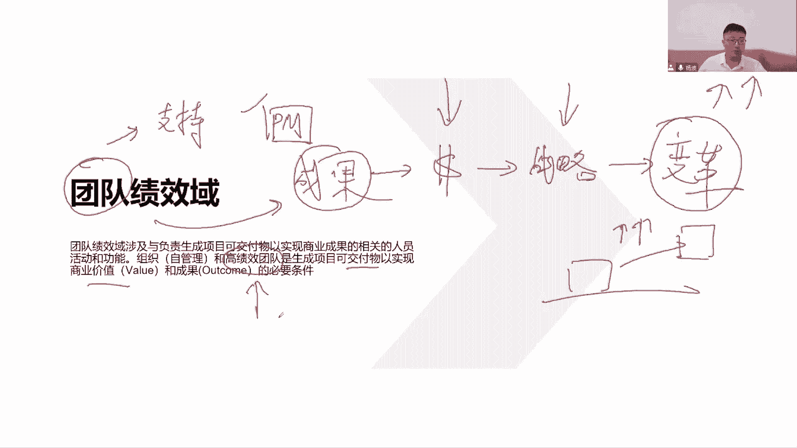
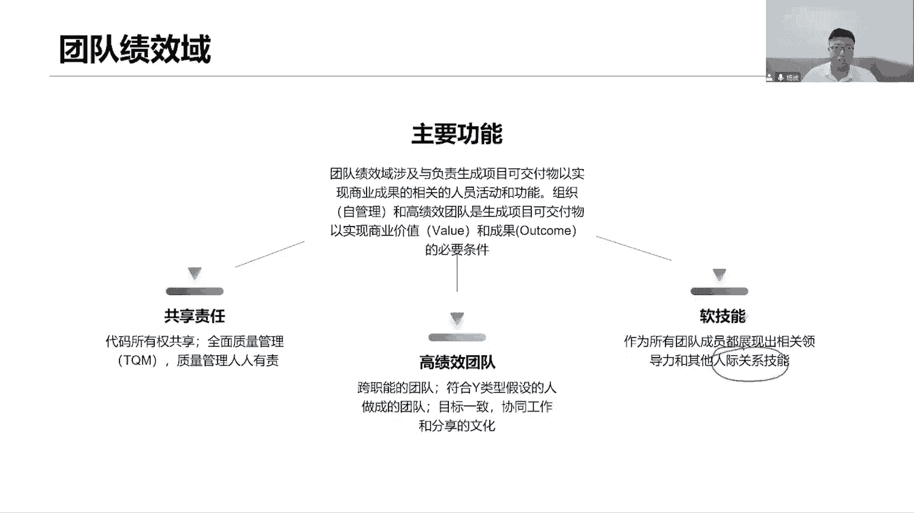
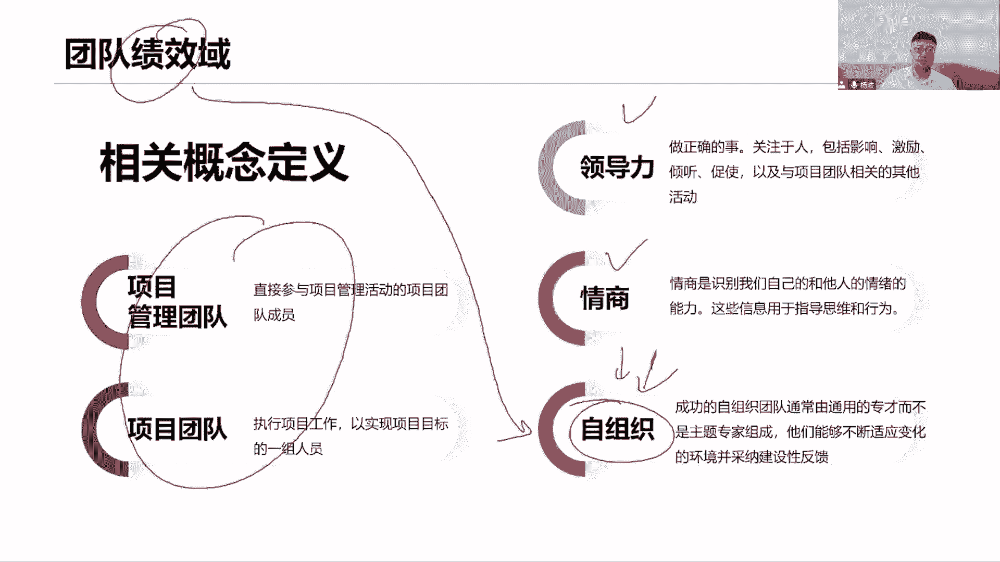
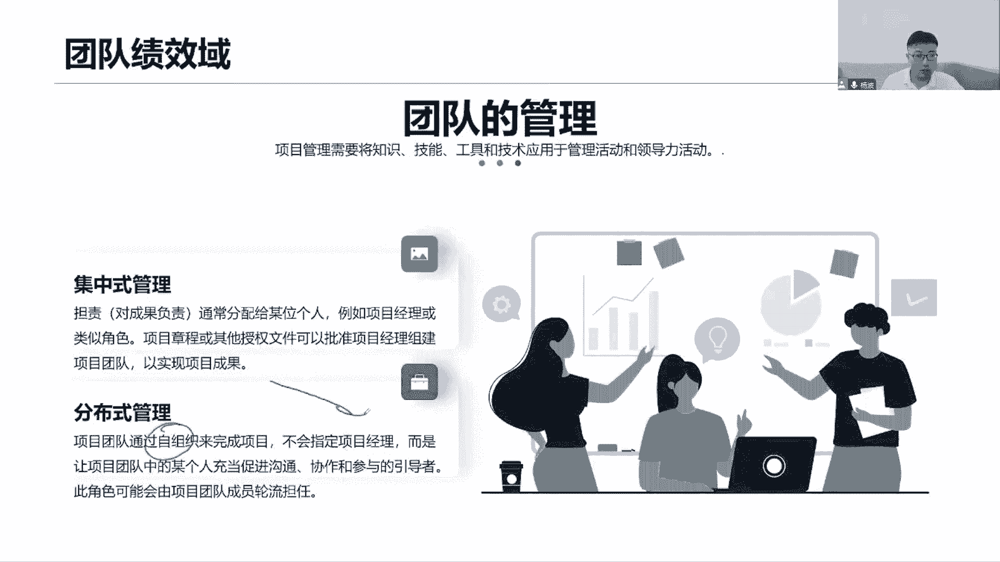
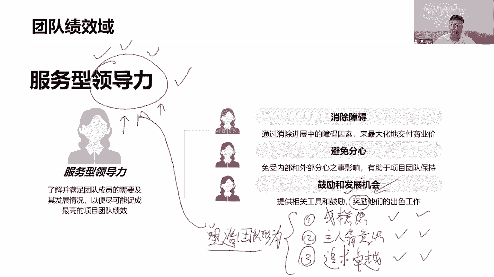
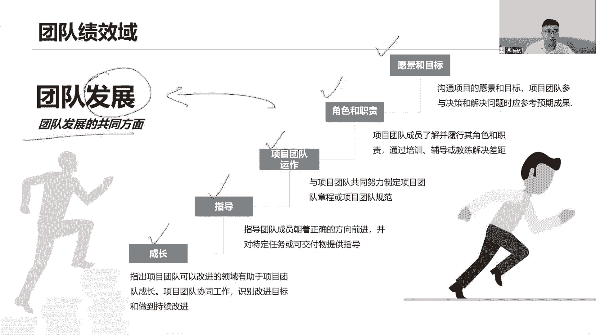
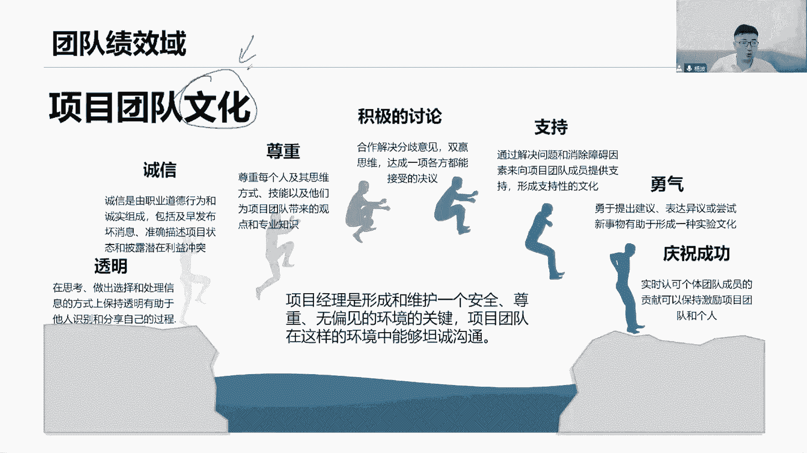
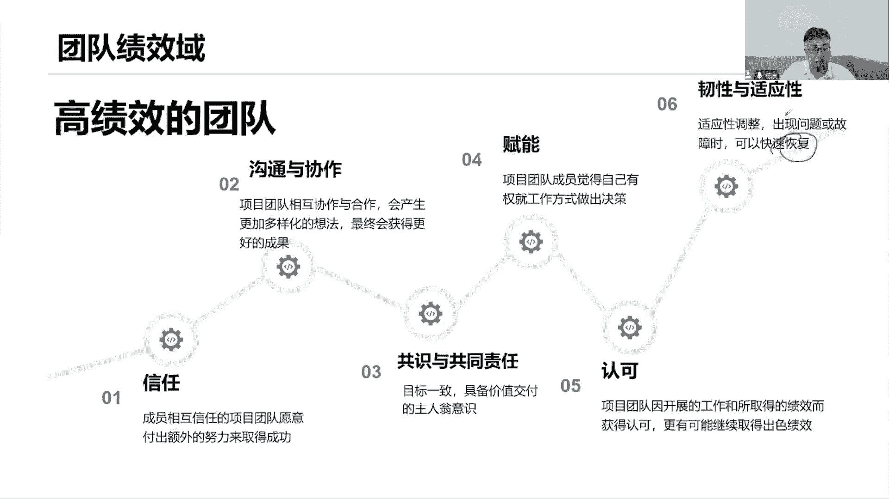
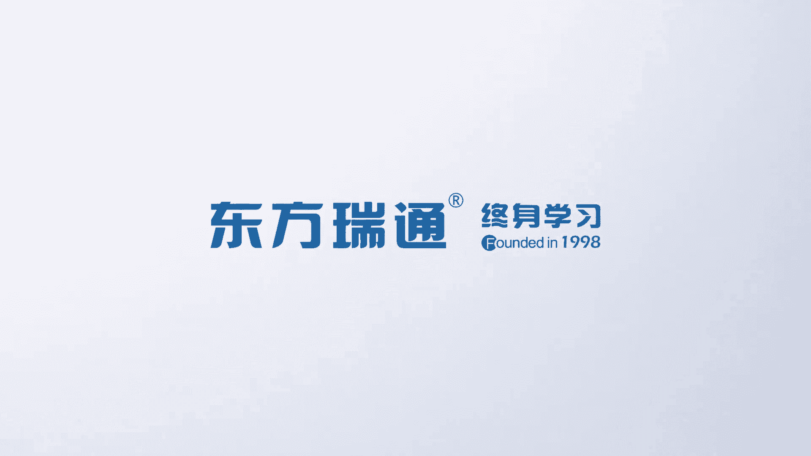

# 全新录制PMP项目管理零基础一次顺利拿到PMP证书 - P11：PMP精讲课高绩效的团队 - 北京东方瑞通 - BV1qN4y1h7Ja

第二个我们来看关于团队绩效预言，对我说这个团队倾向于它本身，是不是也是我们当前干系人管理的一个重点，在这里面诶，做好团队哦对了，也是干性的，不要忘记啊，干性能干净，它的范围是很大的。

能影响项目和受影响项目，他们能不能影响项目，他们能不能他们会不会受项目影响都会啊，所以他也是干事的，我们也希望我们的团队能够满意，对我的项目支持，这样他们才能够积极主动地围绕着。

以我为中心之下来有效的开展工作，那这就是怎么说团队绩效率好，团队团队，那么知道，既然说我们希望你能够支持我的项目，支持我的项目，意味着项目咱得产出成果，这个成果是谁产生的，不是我项目经理产生的。

是各位团队成员通过利用你们的知识技术，技能工具是吧，产出我们这个成果呢，我们的可加服务是由团队产生的，那为了这个成果，它才能够产生价值，产生价值，才能够知道我们是否实现了组织的战略。

实现了是否实现了组织的愿景和使命，所以你说团队重不重要，很重要，我们希望能够打造出一个高绩效的团队，这个不得了，高级小团队，也就是说希望团队能够自己组织工作，自治组织开展工作，自我发挥着领导力的作用。

自我团结，自己定目标，自己做决策，自己做交付，哎这就是一个成熟的团队啊，不需要什么事情找项目经理，我只是一个仆人，我只是一个管家，我只是给大家提供服务，提供支持和帮助了，不需要我亲力亲为去做这些事情。

哎你看通过高效产生我们口腔物，以实现商业价值，这个就是我的商业价值啊，以及和成果的必要条件，最后我们看，促进我们当前组织的战略目标的实现，只有战略实现了，才能够推动我们组织的终极目标变，比如对吧。

从当前状态驱动到未来状态，提高我们的市值，提高我们的估值，这是我们的为企业做贡献，推动企业的变革，推动企业变革，其实也就是什么为社会做贡献，那你要改变世界啊，各位怎么改变世界，你先把这个成果拿出来。

怎么产生这个成果，我们先要打造成一个优秀的团队，那你是这个团队的一员，发挥自己的领导力啊。

发挥领导力改变世界，就这意思，好团队效率，我们来看主要功能，第一个就是刚才看到了，首先成果是由我们团队的负责交付的，那么就是说我们要打造出一个高质量的团队，这个就是我绩效于当前团队绩效率的一个重点。

我们的目的，我们的结果是什么，高绩效自组织开展工作，那样实现高效，首先第一个共同担责，每个人对这个产品，对这个项目的质量，但这其实不光是质量，各项内容在这上的，也就是我这个产品的方方面面，全员担责。

我们这个项目的各项工作，全员担责，结果过程都是一样，全员担责，高级的团队，请大家注意一下，把前三个字圈出来，画一个非常重要的五角星，这是考点，我们组建团队，我们组建什么样的团队呢。

他这里说的是跨职能的团队，才能够未来有效的快速的，打造成一个高级小团队，何为跨子的呢，这个跨子呢你在旁边写几个字啊，一专多能，在某个领域这个团队成员，他是这个领域的专家，他很熟悉这个领域。

同时他还掌握着其他领域的各项技能多能，那就不一定专业，但是他会呀，他能够和我们其他团队成员一起来协作合作，配合完成工作，推进项目往下开展，一专多能，所以啊我们讲的是，通常我们要的是通才型的专家。

一专多能，啥都会，啥都会一点，我们不推荐主题专家，不推荐组建团队的时候，你说这个主题意味着，那你就熟悉这个主题，你针对这个主题很专业，其他的你不懂，其他的他不懂，他只熟悉当前这一个领域。

那就意味着如果大家都是主机专家好了，要是有一个人，他这个里面他很熟悉，他有一天请假了，他生病了，他离职了，那请问这个问题谁来解决都解决不了，因为只有他一个人能解决，这就出现了瓶颈，而我们通常型的专家。

我们一专多能的，成熟型的团队会出现瓶颈吗，你请假了，你离职了，无所谓，来剩下的人大家一起合作协作，继续把这个问题往前推进，我们这个人他是最熟悉开发啊，他会有一些开发语言，但同时呢他还会做懂一些测试。

他会写测试用例，他会写测试脚本，他懂事的话，测试框架他还会画UI设计图，他懂设计，还会画图，画图，他也了解一些，他会他会用什么PHOTOSHOP，这东西会PS都会一专多能，就这意思会几项会多项都有。

可能我要的就是这种人，我要的我组建的团队，也就是跨这种团队，对之前有一个考试场景，说我们要组建一个敏捷团队，是让你去在内部里面选拔人才，你该怎么选，第一个主题专家，你要不要我肯定不要。

第二个他非常懂敏捷的工具，我光懂工具，我不要，他非常熟悉这个敏捷的流程，敏捷流程工程不是不可能，技术还不懂，哎最后我们懂我们知道是什么，我们是来这个跨职能好了，这个就是我所需要的，你啥都会一些一专多能。

可能有的人你动几懂几个工具，懂几个流程，或者有的人他专门懂一些各个领域的内容，同时呢又懂我们当前这个工作，以及工作怎么去开展，怎么打好人际关系，技能诶，具有团队的意识等等，好多好多。

他都会从各个领域里面了解一些，他不一定专业，但都了解都懂都会好，我们要的就是这样的跨职能团队，组建成了一个，这个才能够未来打造成一个高质量团队，目标得一致，咱们这个目标团队目标始终保持一致。

你说我们连目标都不是一致，那叫团队吗，那叫啥，那估计就叫一个团伙，是个什么，我们是什么团队啊，团队团队有个共同的目标，团队目标，我们要一起合作协作，我们希望促进合作协作，然后呢同时呢分享知识，分享经验。

就是我们这个环境，它是一个相互信任的环境，只有相互信任，我们才能够愿意去沟通互动交流，分享知识，促进进步，促进合作，促进沟通，我们有这样的一个团队文化在这里面，这是一个相互信任的团队文化。

诶那我就愿意去沟通，如果你跟我们说，我们这个团队强调的是末尾淘汰制，谁要是绩效排名，最后就直接干出去了，踢出去了，那么请问各位，我们还愿意去分享知识吗，我们还愿意去和你去说，哎我们今天我找了一个好技术。

我给你分享给你，让你也能够尽快成长起来，末尾淘汰啊，那万一我成为最后一个人，我干嘛，我就被淘汰出去了，我就丢工作了，谁都愿意干这个事情，作为团队的文化，积极分享，相互信任，相互协作。

相互合作的团队文化多重要，领导力不说了，作为一个团队来说，你想打造一个高绩效团队，光有技术能力还不够，技术是一方面，你们懂技术，你们一专多能行，请问领导力重不重要，人际关系重不重要，各位情商重不重要。

这个见人说人话，见鬼说鬼话真的很重要，搞好关系，这是很重要的，技术型，那那好，但是呢我们说你的这个说话方式，你的情商，你的同理心，你的移情能力，共情能力，情商逆商，领导力，影响力全都很重要。

你要积极的影响别人，影响别人的情绪，控制别人的情绪，站在别人，站在对方的立场上去考虑问题，以推动这个问题解决，达成共识，解决冲突，解决分歧多重要，这都是我们的什么软技能，全都是我们一些相关的那个软件的。

啊很重要，来看团队气象一里面，首先第一个团队项目团队怎么组成的，项目团队的定义是什么，项目团队是执行工作了，实现目标的一组人员，一群人员，一堆人员对吧好了，这个项目图它怎么组成的。

大家注意一下团队的组成，首先把我加进去，那我是整个团队的领导力啊，我是整个团队的主导核心啊，大佬啊，然后呢，团队成员要不要对，有啊，下面一帮团队成员还有谁，他们加进来，我们的管理团队。

在一个项目团队里面，不是只有我一个人，项目经理有管理权限，我会把我的团队可能分成几个小组，几个单元，甚至几个部门，开发部，测试部，我自己分开，没关系嘛，因为我说我们可以成为一个什么这个项目型的。

项目导向型的，或者是举证导向型的矩阵型的，那就是举证，我作为项目经理来说，我可以把我的团队分成几个部门，几个小组，几个单元，每个小组是不是有小组长，每个部门也可以，一个部门的主管啊。

我们这个主管都是可以的，这些人就是我的管理团队人员，他们协助帮助支持我对项目的管理工作，政治部门的管理团队可以的制度去分配，所以项目团队由这三个部分组成，领导力咱不说了，做正确的事情啊。

对我们的人影响力，激励他人，倾听他人，促进他人，促进合作，领导力，情商特别重要，你看待会儿情商我会重点去讲，这是我们一个考试重点，情商是识别我们自己和他人的情绪，先管好自己再说，你要想管别人。

先管好自己，你的自我控制能力，你的自我意识，你的自我情绪的控制能力，以及影响他人，管控他人情绪的能力，别着急，别发火，冷静，我们再沟通，就这意思好了，自组织也很重要特别重要。

他是我们当前用在敏捷项目管理里面，非常核心的作用，一个高低效的团队，那就是一个自组织团队，所以自组织那就是有一般跨知名团队，有一帮空才选的专家组成，不要不要主题专家不要，然后在这个通常学的专家里面。

大家一起协作合作，适应环境的变化，自己定目标，自己做决策，自己提出一些建设性的意见，建设性的反馈，自己完成我们产品的加护，独立的开展工作，高效的配合，这就是一个自组织团队，一个成熟的团队。

一个绩效的团队，我们的终极目标，把自己的团队打造成一个自组织团队，这就是我们说的结果，既然是绩效嘛，看结果结果什么，这就是我要的结果，我先把这一帮人组建起来，然后呢通过发挥个人领导力。

通过展示自己的情商，通过我们日常的工作协作配合，然后呢最后打造成一个自组织。

高效的成熟的团队，团队的管理，团队的管理分两种方式，第一个集中式管理，以我为中心，通常把权力分配给我，然后项目经理，你这说了，项目经理啊，分配给项目经理干嘛，就是需要有一些文件来给我授权。

他这里说的项目章程啊，后面会专门讲这个项目章程，它的内容是什么，但现在我们先了解一个问题，它就是一个立项文件，这个项目要立项了，立项立项就得有立项文件，那么一旦立项之后，就会给我们项目经理授权授权我。

项目经理可以动用组织的资源完成工作，我来用组织的资源完成工作，那这个资源包括人力资源，也包括物质资源，对人力资源我就可以去分配工作，定目标，打定要考核来来完成，他组建好自己的团队，完成项目工作。

这就是个中性，所以权力全部的都集中到一个人身上，那你从刚刚才讲的这个权利不太，我们是希望每个人轮流的发挥在领导力的作用，你要充分的授权项目经理，你得充分的授权，让他们自己做事情，定目标，做决策，做监控。

做交付，我们不太推荐这个集中式的管理，那既然你提到了意味着什么，可能在某些场景你还真的有用什么场景啊，当然不是刚刚组建完成一个团队吗，刚刚形成一个团队，组建好一个团队，大家来自于五湖四海，经验不同。

技术不同，性格不同，什么都不同，能力也不同啊，参差不齐的，那这个时候我敢不敢充分的授权，我能不能直接说好，你们自己玩去吧，我相信你们是可以完成工作的，我相信你们是个成熟的团队，那你自己玩就玩死了。

这肯定不行啊，我们就要集中管理，充分的授权，这个时候我会跟你们说，我用指令性的方式来指导各位，指令性的方式，充分的什么下发指令，你做什么事情，你做什么，张三你负责干嘛，李四你负责干嘛。

今天你们俩负责干嘛，下方指令我指哪，你们打哪，我说怎么做，你们就怎么做，我在教你们做事情，这就是集中性的管理，所有权利控制于一身，我跟你们说，你们就怎么做，这是第一种，那前期吧团队刚刚形成。

大家还不熟悉，不了解能力还不是很，还不适配我们当前这个岗位，那这个时候我们就可以集中生产管理，第二个分布式好了，意味着大家自主知，我们已经自主地开展工作了，我们已经成熟起来了，我们能够高效的配合。

独立地完成工作，那就不会指定项目经理，还更指定我干嘛，权力全部下放了，下放给你们每个人，团队中的每一个人，每一个人都可以轮流着发挥手，促进沟通，促进协作，促进参与的引导者，领导者。

每个人都可以轮流着发挥，所以说是某一个人，具体是谁都可以无所谓，但肯定不是我项目经理轮流，看到没，这里说了，轮流轮流担当这个角色，你们的领导力，你们的组织能力，你们的协作能力。

把你们的沟通能力请大家充分的发挥出来，这就是一个分布式管理方式，你们自己来管理团队了，我是相信我仍然实际项目经理，只不过这个时候我给大家营造氛围，提供知识提供帮助，哎呀夏天来了，天气很热很热。

我给大家买了西瓜冻一冻，一会儿来吃来，今天下午我给大家点奶茶，今天下午我给大家点点什么什么蛋糕啊，有人过生了可不可以呀，这就是营造氛围啊，这是给我们提供服务，提供支持和帮助，管家嘛，仆人给你们提供服务。

如果真的是团队在这个自主的框架之下，遇到了困难和问题，当然还是需要我站出来，和大家一起来共同面对，以推进问题，帮助团队移除困难和阻碍，你不可能完全相信你的自主框架，说他们简直无所不能，上天遁地都可以。

那这个有点夸张了，毕竟团队还是团队，他们的权利不及你，那如果说有的外部那些领导来打扰你的团队，他们敢说不吗，谁敢说不，还想不想在这待着，能达到你的团队，让他们分心的，不能够专注于自己的工作。

这就是阻碍和障碍，你是不是应该站出来和这些什么外部的领导，主管经理跟他们聊啊，那你们的这个工作开展的原则是什么，你们的价值观是什么，你们的环境是什么，那个去介绍，去教育，去引导他，引导这些干系的。

不要来打扰你们团队，有事情找我。

你想了解项目的什么细节找我，我来告诉你们都可以，好，服务型领导，你看提供服务，提供支持，提供帮助的这么一个领导力，首先消除上就是刚刚说了，通过消除工作当中的障碍，来最大化的交付生产价值。

因为有些障碍团队他们真的搞不定，已经超出了他们的权力范围了，超出了他们的能力范围了，你得帮他们一起来消除阻碍，消除障碍，避免分心，希望我的团队人员，他们能够专注于自己的工作，我们就写个专注就可以了。

专注专注工作，不要分心，不要受外界的干扰，如果有外界发展找我项目经理，我来给你移除出去，把这个干扰给你移除出去，以确保团队始终保持一个把专注，避免分心，不要被受干扰，鼓励大家和发展机会。

给大家提供各种支持，帮助鼓励啊机会，希望你们能够把这个工作做得更好，奖励你，激励你们，认可表扬，鼓励支持和奖励，那其实说到这个奖励啊，奖励啊，他的这个领导力是非常息息相关的，独立奖励，比如说举个例子。

张三诶，今天下午因为我们要开会，所以呢我们需要他给我们买一些什么，就是个白板的水彩笔，因为经常我们开会嘛会在白板上面去写东西，用水彩笔来写，但是我们现在发现我们这个教室里面，水产品没有了。

于是呢张三他自己主动的就去买这个水彩笔啊，他跑了很多地方了，货比三家，然后最后买买到了比淘宝还便宜的水彩笔，拿回来了，拿回来，那我们看到这个事情是不是要表扬它，那肯定得表扬啊，这是好事情啊。

帮我们买水彩笔，积极主动的，而且呢还比了这么多家，价格还很便宜，买回来了，很辛苦啊，跑得满头大汗的表扬奖励，做得好，做得好，做得非常棒，做的很出色，那我们光是表扬就够了吗，同学们想想。

如果你是一个项目经理，当你看到这个新闻，你要表扬，确实倪光是表扬，说好你最棒，你为我们团队做出了贡献，我们应该向你学习就够了吗，那可能有同学说是不是应该发钱，可以花点钱激励激励，我还发个奖状表彰表彰。

全员表彰，做的非常棒，给予激励就够了吗，真的就够了吗，如果做这些事情，只能说我们没有领导力，我们作为一个领导者，作为一个项目经理来说，光是说表扬激励认可，做得好，做得棒，以最棒，也是我们团队的标杆。

向你学习，说这些话只能说明一点，我们没有领导力，应该怎么说呢，做得好，你很棒，这句话肯定要说，但是请记住，不要忘记了，你还应该说我们为什么表扬张三，为什么奖励张三，为什么我们要说这个为什么，如果你不说。

我们根本就不知道你是基于什么原因去表扬他，因为他做这个好事吗，那这个好事背后的原因是什么，有可能第一个领领导回收，你看张三货比三家，找到了，比淘宝还便宜的这个这个是水彩笔，说明他很有成本意识，成本意识。

这是不是就是在说为什么有成本意识，所以我们要怎么拒不表扬它，也就意味着大家为了就知道了，我们这个领导他很关注成本，未来做事情，尽可能朝着这个成本这个方向去思考，大家都知道思考方式怎么样获得表扬。

或者说领导会说，你看张三买这个水彩笔这么简单的一个事情，做了这么多事情做的很好，说明他很有主人翁的意思，这是另外一个说法，主人翁的意思，那为了大家知道我们做事情啊，应该把自己的事情当做。

把应该把公司的事情当做自己的事情来做，这样才能够获得表扬，大家有这个认识或者说什么呢，你看张三跑了这么多家，比淘宝还便宜，说明张三在追求卓越，追求卓越，即使这么小的一个事情，他都能做的这么好。

给予表扬和奖励，那么未来大家就知道了，我们这个领导他在追求卓越，他喜欢我们追求卓越，即便这个事情再想用心做，仔细做，做好它，这就是追求卓越，你看表扬一个人，原来背后还有这么多不同的意思，如果我们不说。

为什么他们怎么知道我们为什么要表扬，所以这些事情都是在帮助我们去干嘛啊，塑造，团队雄伟的，这才是充分的表现出我们的领导力，你说光是一个表扬就这么复杂，我希望通过表扬来塑造团队的行为。

知道我们团队文化推荐的是什么，希望大家朝着什么方向去思考问题，思考成本，还是说当做把公司的事情当做我的事情，公司就是我家，还是说我们要做事情，追求卓越，基本再小，这个事情我们要尽心尽力，用心思考。

追求卓越，这就是在塑造团队的行为，这才是一个有领导力的领导者，他应该知道怎么去表扬我的团队，这就是领导力啊，同学们有没有学到，所以大家觉得领导力复不复杂不复杂，那关键是我们要尽可能多的多。

的去思考一些问题，未来我们会学习很多的工具模型和方法，来帮助大家去塑造领导力，提高领导力，他并不需用工具技术来来帮助提高，那你说奖励惩罚有没有啊。

后面会讲怎么给团队做负面反馈好，那么看团队的发展，团队的发展呢有几个公共方面，第一个希望团队成长起来，要让团队整个发展，那你每个人的成长起来，大家一起协作合作，促进改进，促进改进，持续改进。

PDCA同学们，你们的企业里面有没有用，当前我们的企业里面有没有推崇大家鼓励大家，支持大家去做pd c a持续改进，尤其是在质量方面的持续改进，有那就鼓励大家去做成长起来。

指导的团队朝着正确的方向去前进，指导团队如何去完成我们口腔中提供指导，引导辅导，鼓励支持，帮助提供各种机会，提供各种帮助，指导我们去开展工作，对啊他的用词好像是指导大家，不是去强迫大家的，逼迫大家指导。

项目团队的运作，项目团队应该朝着一个共同的方向去努力，完成工作，这个时候呢我们会去做一些什么，团队氛围的营造，怎么营造呢，我们会制定一个什么文件，大家看这里哈，项目团队章程或者叫做团队的规范。

团队的行为约束，我们希望团队能够有效的高效的配合协作运作，营造这个环境怎么营造，你得告诉我们，当前我们团队的接受的行为方式有哪些，我们的行为下限是什么，开会怎么开，如何开，团队日常沟通怎么沟通。

当团队出现了冲突，如何解决，当我们要做要快速的做出决策的时候，怎么做出决策，我们团队的价值观是什么是吧，价值观我们团队的共识有哪些，团队的目标是什么，甚至说团队的愿景价值观都可以。

你说这些是不是都是我们团队章程里面，应该要说清楚了，这都是我们的行为啊，这都是我们的意识，行为和意识才能保持一致，形成规范，上班就做上班相关的事物，做不要去摸鱼，这就是规范啊。

上班沟通也是沟通和沟通相关的事，和这个工作相关的事情，你别聊什么，怎么八卦角色和职责呢，你要确定好当前我们这个项目团队人员，每个人的角色和职责，了解清楚，我们说这个角色就是这个岗位嘛，这个岗位这个角色。

那这个岗位的角色他要做什么事情呢，职责是什么，开发岗位，你的工作是什么，写代码完成交付，还有呢有可能说了更多，你的职权权利是什么，你可以对我们的代码库进行修整修改，而你有这个权利提交代码。

修改代码还可以写更多，当前我们对这个岗位的能力要求是什么，3年以上，5年以上的工作经验，可以写都可以，但是至少你得说清楚，我们这个团队里面有哪些角色，这些角色他对你的职责是什么，否则你不说清楚。

未来我们沟通怎么沟通，我这个工作做完了，我找谁交接，我找谁审批，我找谁，测试是测试经理，你的职责是什么，你的职责是带你测试团队去看看工作，定方向，定方案，测试人员他们指责什么，写测试用例，做做手工测试。

做自动化测试，那就这样了，这就是我们当前的角色和值得说清楚，未来我才知道我这个工作做完了，应该找谁来做下一步的交接，做下一步的移交，做下一步的评审，说清楚每一个人的职责，以便于我们去开展日常的沟通。

促进团队的协作，项目团队的目标和愿景，那就太重要了，我前面说了，目标和愿景，作为项目经理一样给大家去解读，去营造，去说明，去灌输，去沟通，让大家能够了解我们开展这个工作的目的意义，价值背景是什么。

当他们遇到了问题的时候，通过我们的愿景和使命和目标，去鼓励大家积极的解决问题，以及呢我们接着说，是不是还可以帮助我们去挖掘人才，对啊，因为有的人，他们发现了自己的职业发展路线，和我们团队的愿景目标。

企业的愿景目标是保持一致的，他希望能够在这个企业里面走得更高，走得更远，所以呢他会努力的好好的，坚持的勤奋地开展工作，并且发挥自己的领导力的作用，体现自己的价值，展示自己的外部可见性。

所以愿景和目标作为团队发展来说，是需要去做解读和官宣的沟通好，所以说团队发展朝着共同朝着好的方向去发展，怎么发展，让团队成员成长起来，不断的指导他们开展工作，然后呢营造一个良好的氛围，定我们的一些章程。

并且在章程里面说清楚我们这些角色和职责，以及不断的去描述和沟通我们的愿景和使命，以此来让整个团队朝着共同方面，良好的发展起来，一步一步地打造成一个高级向团队。

很多文化这个了解就可以了，好透明，我们要共享信息，公开信息，分享自己的各种各种信息，但要诚实去分享，尊重他人，尊重别人，积极地参与一些讨论，达成共识，给我们团队的成员或提供一些支持，提供帮助。

当别人有困难的时候，帮助他们，支持他们对，然后呢有勇气去表达当前我们所想的一些意见，建议直言怎么直接相见，有勇气提出来这些想法提出来，我们欢迎大家提创新，最后呢和大家团队成员一起来庆祝成功。

那么这就是传统文化，你看项目经理这句话，大家小心点，要理解，项目经理是形成和维护一个安全的，尊重的，无偏见的一个什么环境的关键，我们是关键什么关键，营造氛围，形成氛围的一个关键，什么氛围呢，所有安全的。

尊重的，相信的，信任的，支持的，服务的，无偏见的，公开的这么一个环境，我们团队啊才可以在这样的环境之中坦诚相待，直言相谏，相互尊重，积极沟通，庆祝成功，环境啊特别重要，所以我们说原则在讲什么原则。

我们前面讲的团队原则，就是希望给大家营造一个相互协作的氛围，给大家营造一个相互信任的一个文化，团队文化就讲过啊，前面的原则，那这个文化无论怎么去营造。

有哪些文化，这不就介绍了吗，营造文化，所以高质量团队，我们打造高效团队，相互的性能，一起的协作沟通，相互共同支持，帮助达成共识，给我们团队赋能，这个富人不是负的，是技术能力，看清楚负的是什么权。

决策权力下放权力，积极的给他们认可，鼓励支持和帮助，然后呢适应我们团队的一些变化，适应外部的一些变化，同时让我们项目团队具有韧性，当我们团队出现了各种问题，故障，能够快速恢复，这才是我们的任性。

团队的氛围我需要营造，但是有人来破坏氛围，会不会有人肯定有人团队之间有冲突，这就是典型的破坏氛围，破坏我们的湿气，两个人天天吵，天天闹，你说我们这个项目团队氛围是不是影响，所以就因为这个事什么。

要快速的去解决这些冲突，尽快解决，让我们团队的士气始终保持一个和谐的氛围，营造出和谐的氛围，恢复到以前和谐的氛围，让你们能够握手言和，让你们能够相亲相爱，相互拥抱不就完事了嘛对吧。

这样就可以快速恢复到以前，我们这个具有战斗力的团队，一个充满士气的，充满友爱的。

