# 全新录制PMP项目管理零基础一次顺利拿到PMP证书 - P12：PMP精讲课领导力技能 - 北京东方瑞通 - BV1qN4y1h7Ja

那么要想提高领导力，我前面说营造环境，营造氛围是需要有领导力的来营造，不是我说他们就可以营造出来，那么这个领领导这个技能在哪些方面，我们要重点去关注呢，第一个建立维持一个愿景。

让大家能够了解我们整个项目的运营，朝着一个方向去发展，这是不是展示我们领导力，激励团队，鼓励团队，认可团队，表扬团队怎么去表扬，刚刚说了，第二种激励也是展示领导力啊，批判性的思维，这是第三个。

什么叫批判性思维，就是指我们要无偏见，没有偏见去对待我们的团队身上，希望大家在日常沟通的时候对事不对人，什么叫对事不对人啊，拿客观数据事实拿出来进行一个什么分析，不要以主观你的意愿去分析，那这就不对。

第四人际关系技能，情商决策冲突，这三个都是重点中的重点，考试中的重点，青山怎么考，就是考你赚钱，对青山的理解，从四个维度，我们怎么做决策，有哪些决策方式，我们的冲突怎么解决，有五种方式。

这些都是考试重点，尤其是人际关系的，大家都很认真去学习。

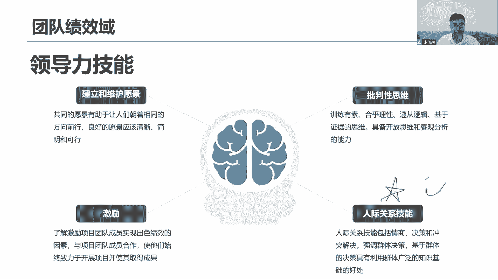

来我们先看第一个，建立和维护好一个愿景，其实对于企业来说，对于我们整个企业来说，它有企业的愿景和使命没错，但是我说这个团队里面其实也得有啊，我们首先得了解，当前我们这个做这个项目的目的是什么。

项目的目的，这就是我们当前项目的愿景，他所总结出来的内容，我们是不是应该得给我们团队去介绍官宣，沟通我们的愿景，沟通我们的目的来，就是指当前对让他了解咱们为什么做这个项目，目的是什么，怎么去理解。

就举个例子来跟大家说，你说现在我们去修建长城，修建长城好，如果说我们穿越回去，我们穿越1000多年啊，我们讲说回到秦朝，我们回到秦始皇这个时代，让大家思考一下，秦始皇为什么要修建长城，目的是什么。

讲的是我们的目的是，是不是要去这个抵御外敌啊，抵御匈奴，我们这是一个军事要塞，长城啊，军事要塞，这是我们的目的好，这个时候你是项目经理，你来到这个项目里面来，秦始皇任命你为项目经理。

你来帮助我们去修建这个长城，带领团队完成这个工作，那你首先得知道我们做这个项目的目的是什么，抵御外敌，我们要修建一个军事要塞，那你能不能说我们把它修建成一个什么火锅，一条街，烤串一条街，按摩一条街。

你要是这么玩的话，那秦始皇可能就他就挑，他要他这个棺材板就按不住喽，他可能要跳出来找你麻烦了，是不是我要的是什么，修建一个军事要塞，你跟我要，你给我修了一个什么东西，这些不对劲啊。

你没有了解我的项目的目的，我要抵御外敌好，随着时间的推移，我们回到今天，今天我们去维修长城，维修这个长城，我们现在不用去修建了是吧，我们只是维修目的又是什么，就今天目的是什么，是不是对我们长城来说。

这是我们的文化遗产对吧，我们希望他保护好它，让它能够源远流传下去，让他能够看到我们历史发展的一些步骤，历史发展是吧，在这个过程当中有哪些有哪些是吧，我说这个感人的事迹在这里面。

它体现出了我们中华民族的什么样的优秀传统，什么精神，这是需要我们去渊远流传下去的成果成果啊，这是我们的成果，所以我们要去不断去维修长城，但同时我们说，现在长城是不是已经成为一个景点了，是啊是几个景点。

咱也可以登上去看的景点常人，那既然说是个旅游景点，那你可以这么玩儿，火锅一条街，烤串一条街啊，这什么酒酒店条街都可以啊，附近嘛附近有这么多人娱乐设施，休闲设施，你得吸引旅客来来看啊，看看长城。

了解我们长城背后的历史，你就不要去修正什么军事要塞对吧，而且这里是要打仗了，这里是放长矛的，这里是放盾牌的，这里就是放这放箭的，我这么玩了，谁敢来呀是吧，围起来都看不到。

所以说呢目的目的要了解项目的目的，项目目的，而且它会随着时间会发生变化一样的，所以你告诉我们给我们去宣读愿景，建立愿景，维护愿景，你得告诉我项目的目的是什么，项目成功的标准是什么，什么可以成功。

什么叫做可以发布，这不是我们按照计划把这个事情做完了，项目就完成了，项目就成功了吗，还是说别着急呀，我还得看我们干性能的，买一度通过问卷调查收集满意度诶，能够达到95%以上的满意才算是成功。

或者说我们前面就讲过了商业分析，我们看当前我们的商业论证，效益收益实现计划里面的目标收益有没有实现，有没有达成，达成了多少才算是成功，那这些都是我们成功的标准，成功的定义你得说清楚啊，愿景项目交付之后。

未来将如何才能变得更好，我也我还要去提出什么，有一些改进，我们的愿景是是这样的，我们达成这个愿景，没有离这个愿景还差多远，我们还可以做得更好，要想做的更好，怎么去做，不是我一个人好就好了，他好我好。

大家都好，哎这是愿景，要满足所有人的需求和期望，让项目能做的更好，团队如何知道自己是否偏离的愿景，就是我们做着做着标方向搞偏了，那你来告诉我们我们的目标，我们的方向是什么，良好的愿景应该怎么说呢。

他说应该清晰简明可行，愿景应该怎么描述，来看看用一个简短的有力的语句来描述，做出概述，A有能够看到成果，还有呢能够形成一个画面感，有画面感能够激发大家的热情，把这个说的有点抽象，我就问大家一句话。

我们不生产水，我们只是大自然的搬运工，这是哪个广告的愿景，这是哪一个广告人广告语，我们不生产水，我们只是大自然的搬运工，好农夫山泉没错，这句话简不简短，很简短吧，做出概述对吧，我们不成熟。

我们是大致外运工，结果是什么，我们是大自然的搬运工，这就是描述了一个最佳的成果啊，我们再把大自然的一些什么成果搬运过来，让大家都能看到，都能够体会到，都能感受到大自然的美丽，大自然的贡献。

大自然给我们人类的反馈，大自然你说这个画面感强不强，哎呀从上从天上到瀑布之下，瀑布下面，然后呢把这个水从上往下流，山泉清澈美丽，幽静干净清幽，很舒服的一个画面，山泉啊是吧。

把这些山泉最后呢展示出我们的农夫山泉，让大家有什么购买渔网有热情诶，我就想尝一尝，你说这个农夫山泉有点甜，是不是真的很甜，我对你这个称呼有热情，有期待，有想法，我想要买一瓶喝一喝。

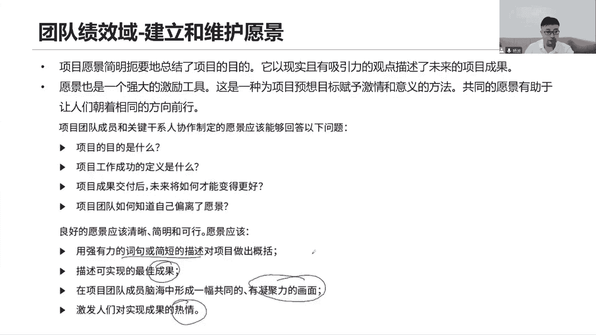

对不对，运气吧，好批判性的思维来看看，批判性的时候就是这么找到偏见，别有偏见，别人有偏见，你要说收集无偏见的均衡的信息，分析分析有没有偏见，以解决问题，识别出偏见，说明是什么原因导致的偏见。

那分析分析数据证据以评估这个问题，观察事实，运用归纳推理，然后呢什么总结逻辑，其实说这个东西是啥东西啊，先总结总结就是指当前我们要对事不对人，不要有偏见，那你说这个对事不对人。

当前要做些负面反馈嘛啊无偏见无偏见的沟通，无偏见的对待某些人，这个事肯定是具有挑战性的啊，是具有挑战性，但是你说我们这个对事不对人，这是我们中国的一个话术来说啊，大家做错事情了，我们要无偏见的对待。

那你说这个事始终是人在做，那你不还是在对粉吗，是不是你光说这句话有用吗，很多时候我们在给我们团队成员去做批判性的，写什么一些说法的时候，一些负面反馈的时候，你总是说对着哎。

你看你这个人最近怎么这么怎么回事啊，这个事情怎么做的吗，你最近感觉这个工作能力不行啊，总是迟到呢，你和团队还是没有融入进来呢，就是有一系列观点来批评我们，谁愿意每天被别人用观点来指责，都不愿意。

你光说对事不对人，这个事情是人做的，你还不是对人对啊，你说这个领导力，领导力你怎么体现出你的领导力，你怎么体现出你的批判性的思维，所以这个时候大家注意一下哈，我们在给你们团队成员去做一些。

负面反馈的时候，你确实要做到一个无偏见，你确实需要有一个批判性的思维，在这里，你确实你现在正在批判，但是这个思维方式你要调整，首先我们应该说找到事实，事实是什么，也就是说把这些数据。

把这些证据也收集起来做一个分析，比如说我举个例子，我们每天早上是比如九点钟开早会啊，假如说哈我们几点钟开早会，然后今天你迟到了，领导跟你说，小杨我们是早上九点开早会哟，今天你早上是09：20起来。

这是不是吃，我没有说你不负责任，我没有说你没有时间观念，没有说这句话，我只是在说一个事实，事实是毫无争议的，大家都都都都认可这个观点，你9。20进来的，我们九点钟开场会，这就是一个事实。

但是我没有去批判，我没有表达，我自己的各种观点，第二我会跟你说，当前我们的一个短期影响，短期影响是什么，你看你9。20进来，我们并不知道你的工作情况，也无法和你的工作做对齐，你也没有了解到。

我们当前项目团队目前的最新进展，你没有了解的，你不了解我们项目，我们项目也不了解你，当前我们这个你当前的工作做到哪一步了，所以我们没办法做到工作对齐，这是一个短期影响好，第三步，长期后果。

没有办法做到工作对企业，那对于我们项目接下来的开展会有很大的影响，并不知道当前我们的目标是否能够实现，也不清楚我们这个迭代的目标是否能够达成，对我们整个团队当前的一个目标实现，产生了一些影响，可以吗。

有风险是有风险，不了解情况，现在有风险，这是长期险，还有要注意一点，要和个人的利益挂钩，记住一定要和这个人的利益，老头就在这个长期后果里面，要补充一句，如果持续下去也不利于你在我们团队的形象。

也不利于你接下来的绩效考核，来大家思考是不是就是你的个人利益挂钩了，所以我们说这个视频做负面反馈，你看这就是一个批判性的思维，一个正确的负面反馈的一个方法，你想我并没有批评你，当前你的能力不行。

技术不行，也没有福建观念，我只是说一个事实，然后告诉你们短期影响你的长期影响是什么，还有最后我就告诉你吧，这个事情其实他是在影响你自己的，如果长期这么下去，你总是迟到，影响的是才是你自己。

影响是你自己在这个团队的形象，影响的是你自己的绩效考核，让他知道这个事情，我们以后我以后不能再犯了，否则对我会产生严重的影响，也是在帮助他去管，去改变行为，这就是对事不对人，正确的做法。

真正的是对对事情，没有针对你这个人的批评，我只是给你提出来了，会影响你，但是比如说他批评你，我只是在想希望还是什么，塑造你的行为，依然在塑造你的行为，我们依然在提高我们的领导力。

用我们的领导力来给你做负面反馈，所以大家今天有没有学习一些比较好的方法，怎么表扬，怎么批评，怎么叫做对事不对人，这不都是在体现我们的领导力吗，所以未来大家可以在工作当中去尝试着用，用学习学习。

看一看是不是你的团队成员在发生了一些变化，用你的领导力去影响他们。

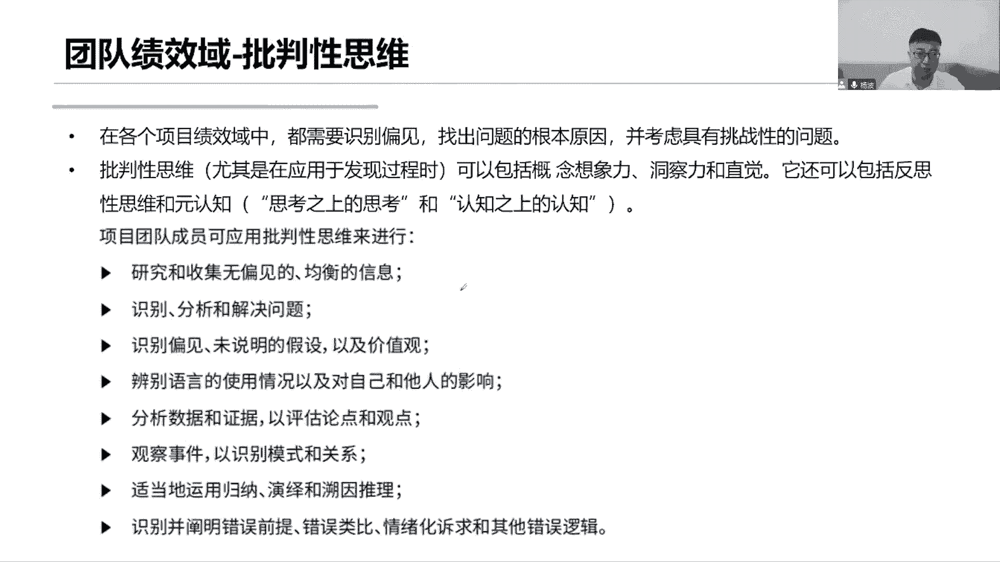

好激励激励团队，做得好，可以表扬，刚刚说要做一些更多的反馈，然后呢团促进团队合作协作，让他们致力于取得成功，这个基地啊，我们后面会学习一些模型，它会告诉我们有内展基地，有外在基地。

先说这个外宅基地做得好，发钱做得好，给你发个什么奖状，那未来好，尤其是发钱啊，这个大家注意一下，发帖这些都是什么外部基地，但是我们要注意小心一点，用用人外部基地真的特别小心，因为你要这样想好。

什么事情都跟钱挂钩，很多时候我们团队人员会认为，这个人这个领导的格局有点低，总是发钱，我并不是为了钱，我留下来加班，希望能够多学习，我是希望能够把这个事情做好，不是为了钱，如果你什么时候都给我发钱发钱。

我就觉得你的格局有点低，或者说从另外一个程度来说，有的人认为这个钱太少了，物质的去干，你发钱可以，但他觉得和他的期望太少，他也不能够形成激励，所以大家觉得这个外部激励是个好东西吗，可能在某些情况下有用。

但它并不是个长期的，当这个钱不足以产生价值的时候，他就是没有任何用，反而会起到一个反作用，所以啊我们应该更多的是什么，激励大家内战内战激励目标，你的目标是什么，你的期望是什么，我们要专精于自己的工作。

钻进自己，让大家能够积极的更多的投入到自己工作里面，来形成目标，我们要什么主动主动的去开展工作，而不是受外界的激励，我觉得这个事情对我的工作来说，是非常有意义的，我愿意主动开展这个工作。

我找到了我当年开展这个工作的意义，兴趣在哪里，我有一个目标感，我会愿意投入更多的时间，去把这个事情做得更好，做专业，这才是什么内驱力，所以啊我说激励激励，更多的是要从内区这个方式去激励大家。

这样才能够长久下去，如果光是外区的话，你要这个外部基地以这个方式方法不得当，不适用，那就会起到反作用，还有呢让团队能够形成一个自己的工作方式，保持自己的工作时间，自己的节奏，愿意怎么去寻求一些自主权利。

表达出更好的角色，这就是自主知，这就是自主团队根据我们个人的偏好，对集体方法进行裁剪，对每个人的偏好进行裁剪，以帮助实现个人和项目绩效的最佳，就是当年我们在激励这个团队啊，要思考一点。

可能有的时候我们有些人，怎么样能够更好的去激励他呢，他们对权力，他们更看重权利，就是有的团队成员，他们喜欢给他们下放权力，让他成为这个什么小组的小组长，而这个小小主管，让他能够去充分的发挥他自我的权利。

去带动下面的更下面的人去开展工作，这样才能更好的激励他，所以说你看是不是有的人，他们喜欢权利，他们喜欢权，你给他权利，这样才能更好的激励他，有的人呢他特别喜欢当前这种环境，和谐的环境环境而没有冲突。

没有竞争，一个相互和谐的氛围，他们愿意在这个氛围能够为之高效而开展工作，没有竞争，没有相关的勾心斗角，我们是一个和谐的氛围以及氛围，来激励我的团队也可以啊，你要看有哪些人对这些方式有有什么偏好。

还有一个人呢，他们喜欢以成就的方式来实现自我激励，就是指当天他做了一个事情啊，你得给予他一个认可，表扬鼓励称赞是吧，给他一些仪式感，让他觉得哇主管在认可我，把项目经理在给我表扬，我获得了价值。

我获得了成就，我为这个团队贡献了力量，我成为这个团队的标杆了，很有成就感，以这种成就感来激励他，你甚至什么哎这个人做的很好，我们不一定花钱，我们说了不发钱，我们怎么做呢，我们做一次表彰会。

灯光红地毯是舞台中央话筒，你什么各种各种仪式感满满的，让你站在这个中间，在全员表彰大会上做你的演讲，多么有仪式感，多么有成就感，这种成就感有些人他们特别喜欢你，就给他给他们营造，这就是不同的激励方法。

要对方法做裁剪，当然你得根据每个人的偏好，因为有的人不喜欢这种玩虚的，他就被封，他就喜欢来实际的钱全都可以，有的我不要钱也不要钱，也不要虚的，我只希望我待在这个环境里面，能和大家一起合作协作配合。

每天能够聊得开，聊得来，幸福感满满，开心就好，就是这些，所以每个人呢他对这个对这个激励的手段方式，方法和方向都是不一样的，那我就得从各个维度去思考，去裁剪，看看怎么样去激励团队。

这是不是都在体现我们的零达利亚，所以说你看我们今天讲的这些，全都是跟领导力划分，所以说领导力这么重要，它本身也是作用的，像原则来指导我们这个原则，我们要每个人轮流着发挥在领导的一个作用，当然说项目经理。

你首先你得把你的领导力充分的发挥出来。

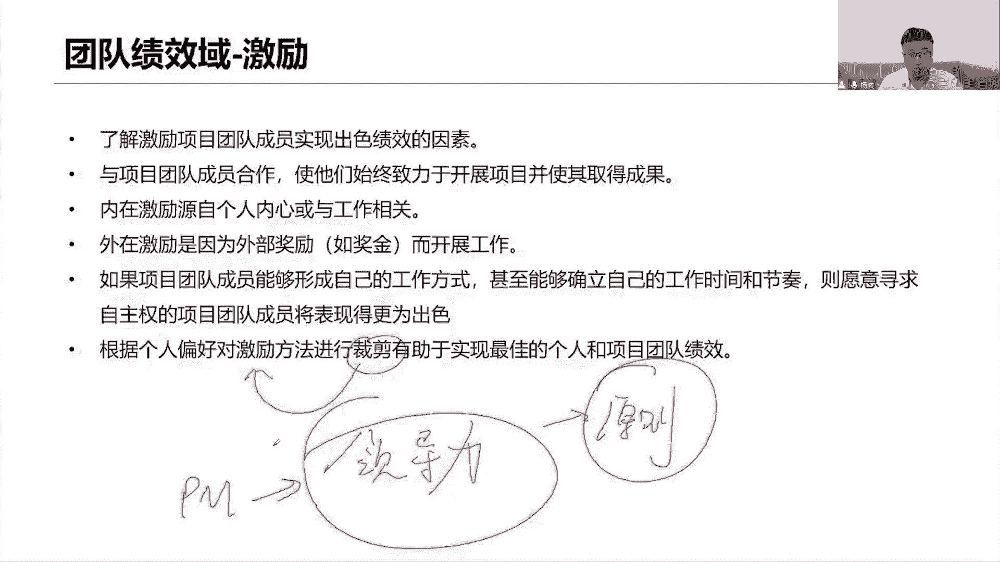

影响你的团队，激励你的团队，打造一个高效的团队，接下来看下面部分内容，人际关系记得好，重点是重点重点，大家认真听这部分考试核心和重点情商，首先第一个情商是啥，情商是我们那些识别我们和他人的情绪。

能力自我意识和他人管控情绪的能力，它分为四个维度，我们看来我们这里还说情商也是领导力的基石，看到没是领导力的基石，那第一个他从四个维度来解读青山自我意识，首先我得有一个自我意识，有一个自我评估的能力。

我得了解我自己，了解我自己的情绪，目标动机，优势劣势，长处短板，各种状态，我得去自我了解，你想要先管好别人，先管好自己，就这意思，那么我自己我的情绪怎么样，我的性格是怎么样的。

我在这个项目里面做项目经理，我的目的和动机是什么，我希望成就我自己的什么，我的优势劣势什么，我的长处和短板又是什么，先有一个自我，就是了解自我，看这里说嘛，了解自我的各个维度。

我希望能够把握自己的一些好的方面，发扬光大我的不足，我得去改进啊，控制好我自己的情绪，我不要发火，别发火是吧，就这个意思，自我自我意识，我得了解我的情绪，我的性格是什么好，那你光有自我意识够不够。

还不够来自我管理，那就真的是要采取行动了，自我管理是在破坏性控制，破坏性感受和冲动，并使他们改变方向的能力，这种能力我要改变他们，不要产生破坏信任，不要冲动，不要激动，不要发火。

我在查他是在采取行动之前，先进行冷静的思考，以及暂缓仓促的判断和冲动的决策，就是我在工作当中啊，我得冷静，我得控制好自己的工，控制自己情绪，我在做出一系列的决策之前，相信你有权做出决策，没错是吧。

你在你在采取行动之前，做出决策之前，先冷静思考，先缓一缓，你在做出判断之前先冷静思考，这是你的自我管理的，你在采取行动，你知道你的情绪有问题，你知道你的优势，你的劣势是什么。

所以你在工作当中采取行动之前，做出决策，之前做出判断之前，冷静思考，暂缓行动，别冲动，别发火，就像我们说，这个教育小孩子啊真的是一门学科，尤其是到了上小学这个阶段，你说幼儿园还还好，说，没作用吧。

无所谓，想中文怎么玩，但上了小学那个老师也布置作业，在家里面一回的做作业，看了作业做的情况，这么简单的问题你都不会，你说你容不容易发火，你就心中就认不出那个火，你跟他说了怎么去做这个事情。

你教了他怎么去做，还是不会，哎呀，这个火真的是忍不住，所以说当家长一样，你先冷静思考，你先想想你的情绪是什么，你的自我意义是什么，我应该怎么去教育小孩子，我在他这么小的时候，我是怎么学习的。

我的能力又是什么情况，我的优势劣势又是什么情况，共情移情能力啊，站在他们的，站在他人角去思考问题，别发火，冷静指导他，引导他不会，那么你换一种方式，你可以先分析一下是什么原因导致你不会。

是不是当前我们说这种方式，你不用去理解，那你管团队也是这样的，团队成员他当前做事情不熟悉，不了解，能力不行，绩效不行，完不成工作总是拖后腿，分析原因吗，怎么样去指导他，采取行动之前，先管好自己。

控制自己的情绪，别发火，好好，这是自我管理，那么接下来我们看我们都知道在项目团队当中，社交人际关系技能是很重要的，我得有另外又是一个意思了，社交意识，什么社交意识呢，同理心考虑他人。

站在他人的角度去思考问题，包括能够读懂别人的暗示，肢体语言，首先同理心站在他们角度去思考问题，考虑他们的感受，充分考虑他们的感受，不要以自我为中心，你要记住我，还有很多人，我会每天和他们抬头不见。

低头见，我得想尽一切办法和他们打好关系，这样吧，同理心移情能力，共情能力，感受他们的一些心情，同时还包括你看这里说了，读懂非暗示语言，什么肢体语言，就是我在开会的时候，我正在说话。

说着说着旁边一个人踩我一脚，用胳膊肘撞我一下，那你得知道是啥意思啊，你得立刻体会到他是个啥意思，什么动机，是不是我我有些话不该说对吧，就这个意思啊，你要注意一下我的说话方式哦，有可能吗。

别人在友情的提醒一下，或者别人给你一个关爱的眼神，你能够从这个眼神里面读出来，他是在关爱你，不是对你有其他意思，你别想歪了，我只是希望把这个人他可能会关心你一下，是不是最近加班比较累啊，多注意休息哦。

但你别理解偏了哈，不是他对你有意思，不是这层意思，理解他人，读懂他人，读懂他人给你的信，表现一些肢体语言啊，这是社交意识，建立好人际关系啊，你得等明周卫生间，每个人他们是怎么和你传递信息的。

因为非语言传递信息，它会更多更丰富也更热情，你得理解他这个热情不是激情之热情好，那光有意识也不够啊，我得充分表现出自己的社交能力出来，你看有哪些，它涉及什么，他说是什么人际关系的巅峰啊。

巅峰啊社交能力很强，包括什么项目的团体群体，建立好各种人际关系网络，寻找各种人际关系基础，建立融洽的关系，打好关系，打好基础，和领导打好沟通关系是吧，平时吃饭的时候多多沟通沟通，多交流交流。

大家注意一下这个点很重要，之前考虑过说，我们有一个团队成员，在工作之余和我们的项目发起人开展沟通，以了解项目的一些需求，问你这个行为行不行，怎么就不行呢，他就是要充分的展示自己的社交能力啊。

建立好人际关系，和我们公司的高层，高高层CEO这个层面都可以在工作之余建立关系，我们在我们家住在一起，我们一起回家，怎么了，不可以吗，我在建立一个良好的关系，让他们能够支持我的工作啊。

所以他问你项目经理应该怎么做，你做你也没关系，之后我再和你确认一下，当前你所收集到的这些干性能，他们的需求，希望我们一起来沟通讨论，多好啊，不要认为这种方式不可以，每一个人都应该轮流着。

发挥自己的领导力的作用，做好人际关系网络，搭建好自己的人际关系，我们说这个人际关系啊，它有一个陷阱，什么陷阱呢，就是我们作为领导者，总是喜欢和自己什么性格相同，情一个意趣相同的这些人打好关系，错了。

应该和周围所有和项目相关的人，都应该打好人际关系网络，打好人际关系技能融，建立一个融洽的关系，不是去找那些和我们志同道合的，和我们志趣相投的，和我们兴趣相投的，和我们成长背景相同的，哎呦我的天啊。

怎么哪有这么多人啊，每个人的背景知识储备，成长经历是不一样的，性格都不一样，你就应该怎么和大家一起来协作沟通，所以说见人说人话，见鬼说鬼话，这个鬼话连篇。

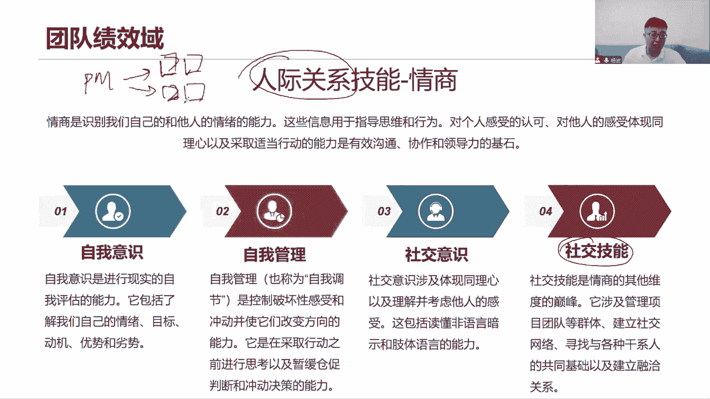

不是说不好，你得分情况啊，所以四个维度大家看看自我意识和自我管理吧，就是在困难的时候表现出自己的冷静啊，表现出自己的冷静，然后社交意识呢，是指更更有利于和其他干性能打好关系。

这些都是我们的领导力的一种基础，所以这个图大家注意一下，要注意四个维度，上面是自我管理，上面是自我的，下面是社交的，左边是意识，右边是管理和技能，把这个图给记住，未来他会用这个图来问你，当前这个场景。

表现出的是自我意识还是自我管理，表现出来是社交意识还是社交技能，所以你得通过这个题目的场景去区分，这就是有区分的要点啊，你得把它区分出来，或者他直接给你个图给你描出来，这个人在这个位置。

这个人在第一象限，问你第一象限是什么，所以这个图咱们去画，而且你要知道这个内容它表现的是什么，意说清楚决策。

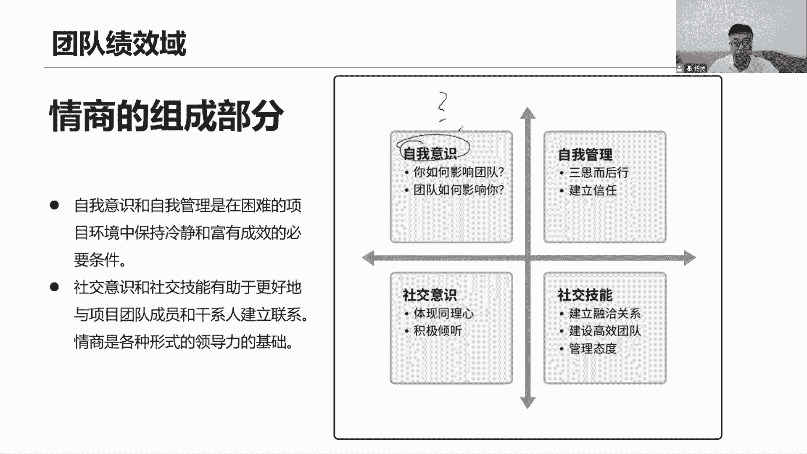

重要决策我们可以单方面做出对项目经理，你可以因为你有这个权利没错，优点是什么，快缺点呢容易出错，因为这毕竟是你一个人做的，就是你并没有充分的考虑各个维度，你的考虑可能不周全，你并没有容纳大家的一些想法。

容易出手，但是快呀，第二种方式，群体决策诶，利用全体的知识，这是好处，这是它的好处，利用了团队所有人的想法，意见建议，充分的考虑了大家所有人的想法，这是好处，就是不容易出错是吧，我们考虑的周全。

那么缺点呢耗时比较长了，你这个一开会，每个人轮流着发挥的意见，每个人轮流去讨论，那个耗时间比较长咯，那比较长哈，而且工作容易被打断，你想想我们当前自己哈，工作当中，你正在做事情，突然叫你们来。

我们一起来开会，我们一起来做一个群体，是参与决策，开会以讨论做出决策，那你不是你们要赶紧停下来，在自己手上的工作吗，你自己的工作不就被打断了吗，然后呢一起来开会，就这样容易被打断，耗时很长，群体决策。

项目团队经常决策要遵循什么发散和汇聚发散，什么意思，头脑风暴我们先随便想，天马行空都可以想，想完之后汇聚到一点，就针对哪哪些想法比较好，我们做进一步的什么头脑风暴，汇聚汇聚发散汇聚发散汇聚。

直到我们达成一致，找到一个最好的方式，这才是决策决策决策嘛，你最终得形成一个统一，你光发散头脑风暴，可以形成决策吗，肯定不行，你最终还得汇聚下来，最终也形成一个决策，找到一个点。

就围绕这个点大家去思考行不行，对超出项团队权利的决策，这个时候呢我们得想了些备选方案，找到备选方案交给领导，升级上报，上报给拥有权利的人员，这个点大家注意一下，一个小小的考点。

也是对我们工作当中有实际意义的，找领导帮忙经常出现，但是你直接说领导，你看这个事怎么解决，领导我遇到问题了，你帮我解决一下，领导你看你有什么意见，帮我给我参考参考，你要是这么说，哎呀又没有领导力了。

天哪怎么体现出这些领导力量，找领导做决策，领导领导高高在上，他们用的权是什么权，决策权不是帮你分析问题，评估问题，讨论问题，收集数据，他干这个事情吗，绝对不干，领导的时间很宝贵的，他们只有一个权决策权。

所以你应该找到这些备选方案，就针对这个问题，有哪些方案可以解决当前这个问题，然后你的推荐方案是什么，你为什么推选这个方案，因为它能够花时间，最少要花资源，最少能够最快解决问题还是什么什么。

你得跟我说理由啊，你为什么选择他，你的推荐方式是什么，然后最终由领导来决策，到底是按照你的方式来选，还是说他另有想法，他们是做决策的，不是来跟你去分析问题的，所以我们应该带着一些方案去找领导。

以便于他们做出最终的决策，上报上报，找领导解决问题方式方法，这才是领导力的体现是吧，拿出方案，而且是一些方案，不是一个你这一个方案给你了，如果他直接批了，那直接直接否决了，那你怎么办，那你又回头去想。

又去返工，又去重复做，又去重复想，何必呢，来多几个方案，就这个方案你觉得很好，那么你要说清楚为什么好，你通过什么成本效益分析了多标准决策，你分析出来当前有这些点，它都能够充分的让我们用最少的时间。

最少的精力，最少的资源，最快的解决问题，产生最佳的收益，那你得说下是什么原因吗对吧，推荐方案，然后让领导领导做出决策权。

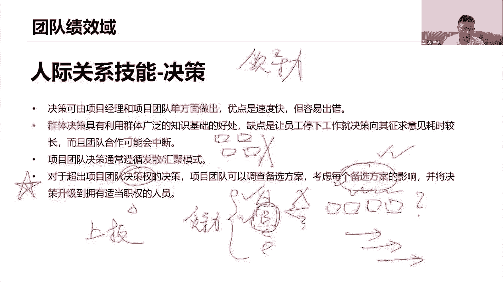

这才是应当的冲突管理哎呀更重要，冲突冲突日常工作中，冲突是无处不在是吧，沟通的时候，我们要表现出尊重他人，对事不对人就说哈，聚焦于当前，而不是过去，然后呢一起来寻找预览，又是备选方，说备选方中断了。

这就是个项目部的思维方式，在这里要怎么解决冲突是吧，这个问题首先对事不对人，刚刚说了啊，怎么对事不对人，然后呢聚焦于当前，而不是而不是过去。

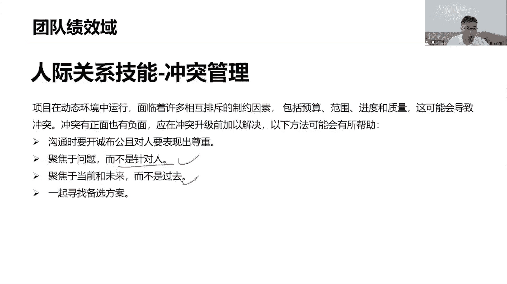

就是过去怎么做，那是以后我们聚焦于当前，甚至未来，我们应该怎么去解决这个问题，来我们看冲突管理五个方法，这个图很多，大家可以理解下来之后，你们还要去把它写下来，这个图默写下来，就和前面那个情张图一样。

你得把它默写下来，冲突管理最佳方式，以合作的方式来解决这个冲突，这是最好合作，以解决冲突，怎么合作呢，面对面的沟通合作，以解决问题，双赢啊，双赢思维还记得吗，前面专门讲过双赢思维，一解决问题，合作解决。

达成一致沟通，避免就这个事情啊，不用我解决，由别人来解决，你说两个人正在讨论技术问题，技术架构，你说我项目经理，我有时有些东西我太搞不懂了，太专业了，这种专业技术的问题，有的时候项目经理不一定懂。

于是我就跟你说好了，大家先不要讨论这个专业技术问题，会后我们找技术经理，找他去帮忙，由别人解决，那么当前我所采取的策略是什么，回避避免撤退，先不讨论，后面我们再说，我们先把当前开会的一些其他议题过一过。

这个意思，竞争啥意思啊，竞争也叫强迫，就是当天我们两个人提出了两个不同的方案，我直接采取张三这个方案，我忽略了李四这个方案，这次竞争它的前提条件是要求我们什么，当前得尽快的得出结论，尽快的解决冲突。

没有时间来给你们分析沟通讨论，达成一致了，没有时间让你们尽快给出一个结论，然后就只是通过竞争强迫的方式啊，张三我就用你的方式看起来还可以，李四以后再说吧，以后再说，一赢一输，它的前提场景什么。

一定得要快速通过题干场景能够描述出来，需要快速做出决策，快速解决冲突或者竞争，包容啥意思啊，包容它也叫做缓和，缓和当前的情绪，缓和当前的氛围，维持一个和谐的氛围，你们不要吵，不要争执。

大家吵得面红耳赤的，没必要冷静下来，分开分开，冷静下来，这就是缓和，这就是包容，求同存异，要举个例子来说，这个不太好理解，算奶茶，现在我手上有一杯奶茶，就一杯就一杯奶茶，有两个男生，张三张三李四。

我说这个事情谁能够把它做完成，做完好做好，我就把这个奶茶给谁，现在张三做完了，李四也做完了，他们都说自己做的好，分母就绪备案，这是不是冲突，是冲突，那么到底给谁，我怎么解决，他都说我做得好。

他们都说我自己做完了，提前做完了，我他他们都要往这边来查，现在我要包容他们，怎么包容啊，求同存异啊，你们两个男生都喜欢我们部门的另外一个女生，我把这个奶茶给他好不好，哎，好好好，可以可以可以没问题。

就这样吧，这就是求同，找到这个共同点，求同，但是你们两个之间的冲突是不是还存在存异啊，求同存异，冲突依然在，问题依然在，问题依然没有解决，我只是缓和一下大家的氛围，只是希望能够营造一个良好的氛围。

你们俩不要吵，给他好不好好维持一个良好和谐的氛围，问题还在以后再说，这个问题妥协什么意思啊，一定程度一部分解决，就是说我这杯奶茶一人一半，这次妥协我只在一定程度一部分满足你们，但是并没有完全满足，我。

这杯奶茶并没有完全给你，张三，也没有完全给你离世，只是你们一人一半一定程度一部分解决问题。

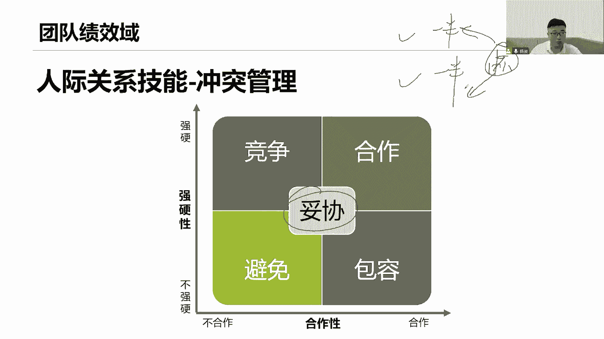

这就是妥协啊，那么看产检领导力的风格。

大家注意啊，这个冲突管理啊，这四这五类大家明白哦，他们刚刚讲这个场景的，明白用什么类型，但什么场景用什么类型。

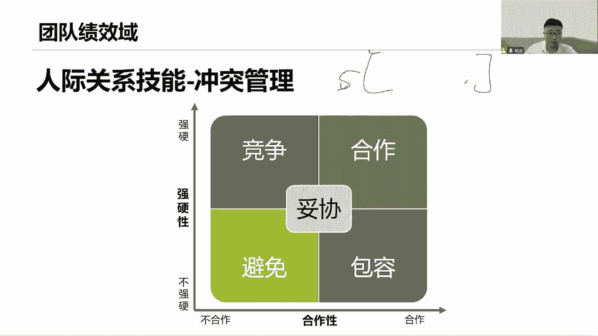

把这个图下面去换一下，朋友们理解它啊，差一点领导力的一些风格，领导力的风格取决于当前还不错，第一个项目环境这些变化，当前很多团队，是不是已经有一个更强的自我组织了，那就不需要再说就过多的去管他们是吧。

以及当年大家已经成熟起来了，在某些领域已经成熟起来了，也不需要过多去指导他们，管理他们政治组织结构的一些变化，还有呢分布式团队，我们当前还是处于一个什么样的团队情况，是集中办公。

还是说用一种虚拟的团队的方式，如果是虚拟团队，我们可能会有一些线上的技术，什么网站啊，音频视频及时会议来改善我们的沟通，裁剪我们的领导风格啊，怎么去领导团队，当前是不是已经成熟起来了。

当前他们是不是已经是某个领域的专家了，当前我们的组织结构也会发生一些变化是吧，以及当前我们说这个团队是怎么在分布的，集中还是远程的，都会影响当前我们如何去领导，我们团队的工作啊。

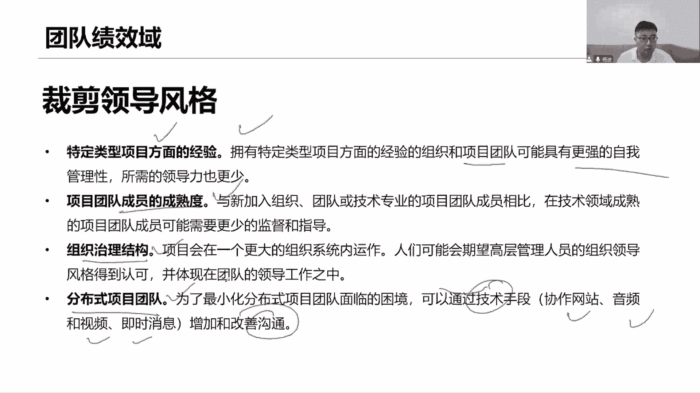

在这里面和其他技巧啊，那个本来我们都是本章做一个总结，大家看这里，首先打造高绩效团队，希望大家能够共同承担责任，把这个责任下放，你说我下放权利可以，但同时责任这边也下放了，咱们都共同承担这个愿景和目标。

大家能理解它，我会给你们宣读，同时共同承担产品的结果，高绩效团队怎么高绩效团队啊，哎相互协作，相互合作，相互信任，适应当前的变化，让我们团队具有韧性，能够快速的能够给我们负责下放权力。

让我们团队能够什么高效的开展工作，自组织开展工作，给他们赋能，给他们赋能，下放权力，展示出自己的领导力，从你的情商是吧，决策冲突，什么批判性的思维，建立愿景和使命，各还有什么激励。

从各个维度都要充分的展示出自己的领导力，和人际关系技能，才能够让每个人在团队里面轮流着发挥的作用，以打造高绩效团队，好了，关于今天我们讲的关于这个人它的过程域，我们就讲到这里，最后做一个总结。

关于人的过程，关于人的这个领域啊，我们说由四项原则来指导我们去开展这个工作，在工作里面我们会重点关注两个绩效，第一个是我们干系人的管理，是不是真的有效地积极地参与进来了，第二个呢是指当前我们这个团队。

是不是打造出一个高绩效的团队了，是不是通过我们充分授权，给大家宣读愿景和使命，让大家共同承担责任，并且给你们释放权利，然后呢，在我们的情商，人际关系，以及我们说各个维度，都能够充分展示自己的领导力。

从而打造高绩效团队，以此来验证我们的工作人管人，这份工作是不是已经做到位了，用原则思想原则指导工作，看看两个绩效率的结果是如何，一有效参与，二营造团队的一个文化，营造团队的氛围，打造高绩效的团队好。

通过相近的领导力来开展工作，同学们注意要通过领导力来开展工作好。

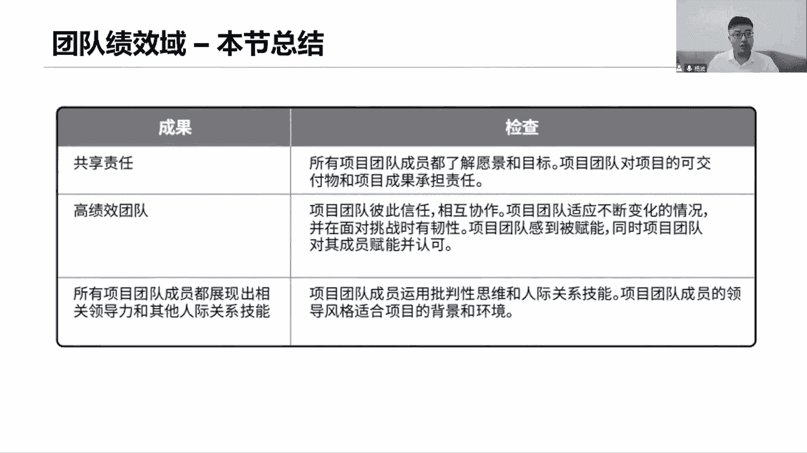

这是我们今天我们所讲的一些核心内容啊，下节课我们会去讲关于过程的人占12%，过程50%的内容，过程怎么去管控，用什么流程，用什么计划去管控，做的过程，我们就要讲基于传统的项目和基于敏捷的项目。

我们的管控方式有点不一样，会分开好，同学们，我们今天先讲到这里。

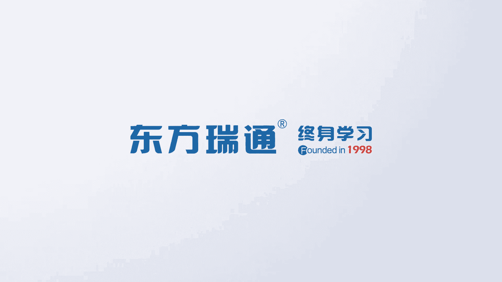