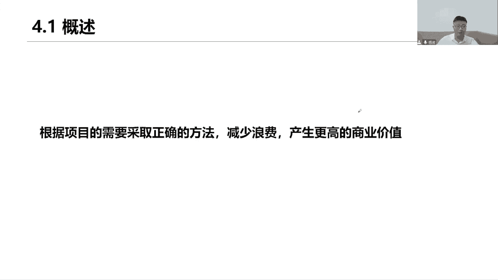

# 全新录制PMP项目管理零基础一次顺利拿到PMP证书 - P13：PMP精讲项目管理原则 - 北京东方瑞通 - BV1qN4y1h7Ja

好同学们好，今天我们来讲关于第四章过程领域的一些知识，那前面我们学习了关于人的管理，占了42%，从我们的四个原则指导我们的表格计效率，来做好Z面的管理，那么它包括了我们的干系人，还包括了我们的团队。

给我们团队营造一个相互协作的氛围，知道我们团队如何去高效的开展工作，干系人士，希望他们能够有效地积极的参与我们项目，支持我们的工作好，这是我们管人前面的两个领域的一些绩效，接下来我们看看关于过程的管理。

那这个过程其实就是说的事情怎么去管，人要管事情也要管，那我们的事情里面包括了很多，当前我们要定一个计划，按照这个计划来推动我们的工作，怎么去开展，这个计划如何来定呢，在整个过程当中。

我们如何把这一系列的工作做好做到位，那这么多的工作，项目经理你应该站在项目整体的角度去把控，整合我们的项目，最后还要做到持续的改进，改进我们的工作，改进我们的质量啊。

这些日常的工作有很多事情是需要去开展的，好先从这三个部分来讲读，第一个一句话概述一下过程，第二看我们开始讲原则了，还是以原则来指导工作啊，有三个原则来重点帮我们去理解，后续的这些过程。

按照什么原则来开展，三个原则，一个是价值，第二个是质量，第三个是驱动和变革，以及第三部分管理绩效，也就是看我们后面六个绩效员，六个对应的六个迹效率，他们是怎么样来测量，来衡量我们的工作有没有做到位。

就是看结果，以这三个原则来指导我们工作，工作做得好不好，用绩效来衡量，先看我们的第一句话概述，根据项目需要采取正确的方法，用什么开发方法还记得吗，同学们，我们前面介绍的是不是有预测性。

还有呢我们的迭代和增量型以及我们的适应型，用这些方法或者加起来混合，用混合的话开整，那取决于当前我们项目的环境，或者行业的变化等等，用正确的方法，用更多的解决方案来应对这些问题，从而帮助我们去减少浪费。

减少这个浪费是指当前有些不必要的，比如说库存，不必要的一些工作返工，等待这个产品的缺陷，那些全都是浪费，我们要减少浪费，尽可能做到一次性把事情做对，从而产生更高的商业价值，我们产出一个刚需的成果。

符合质量要求的，符合验收标准的可交付成果，这个可交付成果它能够为我们创造商业价值，满足客户的需求和期望，提高客户的市场竞争力，从而实现我们组织的战略目标，推动我们组织的变革发展好。

这就是我们说做事情找到正确的方法来，我们看原则，从12条原则里面，他们都可以制造工作，其中有三项重点制造第一个绩效价值，咱们开展工作一样的，以结果为导向，这个结果就是我们的交通。

咱们得把这个交付物拿出来，因为只有这个交交付物，我们才能够创造这个价值，以价值为导向，第二呢，这个交互得关注质量，把质量融入到我们的过程和可降温度，也就是说卧槽和结果，我们都得去关注我们的质量。

你想如果说我们的结果不好，我应该可以反推，是不是我们的开展工作方式有问题，那就成功的过程啊，想想我们在日常工作开展的时候，当前我们是怎么叫怎么去沟通的，我们怎么去对接的，我们怎么去开展审批的。

怎么去开展开发，怎么去做测试的，该怎么去做设计的，这些流程都是我们企业里面，事先就已经制定好了，如果我们并不按照这个流程去开展工作的话，那可想而知，我们的结果也好不到哪去，所以当前我们结果出了问题。

我们应该往前追溯，避免出现问题，怎么避免，那就先看看过程有没有做到位，我们肯定会对这些当前的日常工作，做一些审计啊，看看这些活动过程是否合规，合规，合规是指符合我们当前公司的政策流程和程序。

当然也同时要符合市场的行业法律法规等等，都得合规，才能够确保我们按照正确的流程交付，正确的结果，结果要符合质量要求，要符合验收标准，对质量既考虑过程，又要考虑结果，才能够帮助我们最终以产生。

以这个结果来产生我们的价值，那么有了这个价值，是不是可以驱动我们组织的最后一项工作，变革啊，就这个变革变更就是我们下一个原则，我们要实现预期的未来状态而驱动变革，那以价值来驱动这个变革。

不能光想光想没有任何意义，我们要通过项目的方式来驱动变革，那么项目它会产生这个结果，会产出这个价值，通过这个价值已驱动，我们当前从当前状态驱动到未来状态，问我们的企业增加市值的提高。

估值提高我们的市场占有率啊，以及调整我们当前组织了些什么开发方法，组织结构，当年做各种跟组织相关的一些变革啊，有对应的变革模型的，所以这些都是在帮助我们更好的做事情，做事情的目的也就是说驱动组织变革好。

我们看第一个原则，聚焦价值，那在这个聚焦价值过程中，我们首先这个价值什么是价值，商业价值要符合当前的商业目标，保持目标对齐，以及预期收益和持续和价值持续进行评估，从而做出调整。

我们首先要确定一下当前我们的目标，这个目标来自于我们业务需求评估，所以说我们实现和确定这个业务目标，以它来确定当前我们要实现最终的目标，收益好，也确定我们的商业目标，我们预期的收益不变。

这些都是需要和我们当前法制的目标，战略一致的，那么真正针对这个目标啊，咱不说一开始定的就完了，我们还得怎么持续的去监控，那么这些商业目标，这些业务目标，收益目标是否要做调整，它取决于当前我的市场发展。

取决于当前我们所做的前期的一些商业分析，但是我们商业分析看到了市场前景出现了变化，当前有些新型技术来了，我们去调整这个战略，调整我们的收益目标，所以要适当的做出这个调整。

价值价值是我们项目成功的一个最终指标，在这里面有没有产生既定的商业价值，我们的目标收益有没有达成价值，可以在整个项目期间或者项目结束，或者项目完成之后四天，那其实就是这是我们的项目生命周期里面。

把项目划分成了多个阶段，每一个阶段后面有一个关口，这个关口来验证我们的目标收益有没有实现，也就是价值就会出现价值，目标他也是按阶段来划分的，不是到最后这个阶段，我才去看我的目标有没有实现。

为什么做阶段划分，不就是便于我们更好的管理吗，以便于我们降低风险，所以每个阶段我们都要去验证一下，我们的目标收益有没有实现阶段性的目标，有没有达成阶段性的商业价值是否有实现。

已确定是否可以进入下一个阶段，或者说做人整改之后，进入下一个阶段，或者直接止损，这个项目咱不做了，就这意思啊，所以价值在这个过程当中，我们都要去做衡量和检查，你看是否完成价值。

以及对价值具有促进作用的收益，可以从定性和定量两个维度来定义，也就是这么办的价值怎么去衡量，一个是定性，定性意味着对我们的价值做优先级排序，当前的工作有很多还记得吗，咱们的一些什么项目组合管理。

是不是就是基于我们的战略目标来调整了，也就是基于价值啊，这个项目这些工作哪些更具有商业价值，我就把它的优先级调整一下，这就是定性，那定量呢那就要说你这个价值很高，高到什么程度对吧，量化下来。

你可以通过模拟的方式，可以通过当前什么定量风险分析，来对我们当前这个价值做一个分析和定义，所以分两个维度，一个是主观的，一个是客观的主观的排序，客观的量化聚焦于成果，可以使我们的团队能够支持和创造价值。

预期收益价值以结果为导向，只有成果才能够产生价值，所以你聚焦价值其实也就是聚焦成果，那这个成果谁来做团队来做，所以我们说团队绩效比较关注，同时这个成果是不是刚刚说的，质量这块也很多啊。

它质量既包括了我们的过程，也包括了我的成果，所以这个成果的质量有没有达标，也是我们需要聚焦的和关注的，这就是下一个机效率是吧，那把我们的质量融到我们的可见物里面去，项目团队评估进展，并进行适当的去调整。

从而使期望的价值知道吗，要想到这个价值最大化，我们在过程当中要不断去调整和评估，基于当前市场的评估，整体环境的评估，我们团队的评估啊，还有呢做一些一系列适当的一些调整调整，目标调整是我们期望既保持一致。

同时又能够使得目标价值最大化。

因为价值观看它的定义，价值就是什么，某种事物的作用，重要性和真实性，也就是指它是我们项目的一个驱动因素，以价值来驱动的工作价值聚焦于可交互动，有成果，它聚焦的是成果，项目的价值。

可以表示为对组织发起了一些财务贡献，钱钱看得见摸得着，这是有形的有形的价值，还有呢可以说这种公共事务，公共利益，这是什么无形的价值，看这上面写了无形的价值，包括什么商誉，品牌，公共利益。

商标知名度占有率，有行动价值呢，就是钱货币资产，财务股东利益，这些各种相关的能看得见摸得着的有形和无形，最后一句话大家小心点，基于商业论证来启动项目，可还记得我们的商业论证啊。

来在这里我们一起来回顾一下，说说项目早期我们要做三件事情，把三件事情，第一个是不是先要去做一个需求的评估啊，告诉我们当前需求从哪里来，需求所产生的业务目标好了，马上就提到业务目标了，是什么。

那做这个项目的价值是吧，这些有形价值还是无形的价值，继续交于这个价值了好，那有了这个业务目标之后，接下来我们要做一个事情，商业论证发起人，你要做我们的经济可行性分析啊，商业论证，把这个目标先抄过来。

并且告诉我们，当前有哪些方案可以用来应对这些业务目标，应对这些业务需求，我们要做很多个备选方案，那这么多个备选方案，我们到底选择哪一个呢，用成本效益分析，以此来选出一个最佳方案。

并且确定当前我们的目标收益是什么，基于这个目标收益，我还要写一份补充性的文件，叫做什么，收益实现计划，那这个收益实现计划它的目的是干嘛呢，对我们当前这个目标做一个解读，目标收益先抄过来。

生意在什么时间用什么方法来测量，以及这个目标是否和组织战略保持一致，那对它做一个补充和说明，这就是我们说的收益实现计划，那么前期我们所做的这一系列的经济，可行性分析之后，如果这个项目可行。

我们就会开始做立项，立项就要去写，我们后面会专门讲了一个文件，叫做项目章程，立项立项就是给我们项目经理授权，同时也是给我这个项目正式的授权，让我们项目经理带领团队完成工作，实现我们的项目目标。

那么这个项目目标，肯定会写在我们的项目章程里面的，以保持目标一致啊，我的项目目标是不是来自于我的商业论证，商业论证里面会写我们当前项目的目的目标，我们项目启动一些理由是什么，以及当前项目的一个业务。

他的目标又是啥，总之保持目标对齐，既然我能保持目标对齐，同时你也做了目标的战略一致性，也就确保我们商业论证后面商业商项目章程，他的目标也是符合组织战略一致的，所以项目要求启动。

它是基于我们前期的一些经济可行性分析。

其中有一个重要的文件商业论证，聚焦价值，很多项目都是取决于商业论证而开展启动的，商业论证里面包括了三个核心的要素，第一个是商业的需求，第二个是商业项目启动的理由，看到没有，这个理由。

记住为什么启动这个项目，还有呢商业战略，保持我们当前目标的战略一致性的对齐，你要搞清楚业务需要和商业战略，在项目的生命周期里面，我们项目可以发生一些变化，没错，那当然有变化，我就要适当的做出一些调整。

在工作当中，在整个项目做工周期里面，诸如各种变更，但是很有必要的，也是很正常的事，那针对这些变量，咱就要去怎么去应对，去调整应对这些调整，应对这些变更，以评估当前我们新的需求和期望。

因为这些变更它能够产生价值，既然你以价值为驱动，了解其中，始终想到我们聚焦价值，这些变更都是客户的，用户的，基于市场的环境，基于当前业务的发展，怎样去调整加需求改方向，那接着他们要变，项目要变。

我们就应该适当的做出一些应对，以调整方向应对这些变更，从而创造出更大的价值，创造出我们期望的成果，项目团队会根据当前期望输出输出基准，商业论证不断的去评估的发展情况，已确定当前项目与商业需要自保持一致。

还是在说始终保持一致，加速我们专业价值，这个保持一致是指目标的一致性，诶和我们当前的项目目标和战略目标保持一致，如果项目或者其他干系，不在于商业需要保持一致，或者项目似乎不可能再提供价值。

你看都谈不上价值，那你觉得这个项目还有必要做吗，那自己干嘛终止就没必要再去投入了，咱们这个商业论证里面就到这就结束了，说这个项目我们就不做了，不投资了，因为它不能够产生预期的价值。

它不能够与我们当前的商业目标是保持一致的，我们的商业需要现在不需要了，商业不需要了，那就意味着，你这个项目已经没有了存在的理由了，没有存在的理由，已经不符合当前的商业战略了，我们就赶紧终止这个项目。

由于所有的项目都有干系人，因此要考虑为每个干性人群体产生不同的价值，每个人都有他的小心思，这些小心思里面其实就是他们所期望值，他们的价值，诶他们的需求，所以我们要去实现他们的需求。

实现每个人在这个项目里面，他们所应该产生的一些价值，同时优先考虑我们客户的价值好了，这个会产生不同的一些价值，意味着什么，当前我们这个每个干系人，会对项目提出一些不同的需求和期望，那作为财务部门。

财务部门，他说我们看看这个项目应该尽可能节约成本，300万搞定这个事情，但是对于我们质量部门来说，希望我们能够提高质量，多做一些培训，多开展一些测试和检查，那你这个培训测试点的得花钱啊。

你买设备也得花钱啊，花钱好500万搞定他，那么这个时候两个人意见不一致啊，主管经理意见不一致，而我作为项目经理，请问我到底应该听谁的呢，听谁的都不行，就应该干嘛，你考虑每个人的需求和期望。

如果那你就说你要去引导他们达成一致，怎么引导，优先以客户的价值为基础，无论是为客户做项目的甲方，是我们的客户啊，我们是为客户着想，不是说站在我们自身的利益下，不是看在我们自身每个人的部分的利益对吧。

那这样的话我们才能够以客户的导向，以客户价值为导向来开展这个工作，从而实现客户的商业价值，也就实现了我们企业的组织战略目标，我们要拓展市场，这就是战略目标啊，所以优先考虑客户的价值，这个点找到之后。

大家就一致认可。

同意满意就可以了，第二个原则是这样，既然说要以价值为原则开展工作，创造可将成果，那么这个可交付成果，我们需要关注什么质量要求，以及为了实现这个可教不成功，我们会开展一系列的一些过程。

那过程也得符合当前的性能质量要求啊，所以质量质量对产生可将户的质量，进行适当的关注和保持，这些可交互要符合项目的目标都是必须的，我们做的项目就是要实现项目目标，那这个实现我们得拿出结果，结果就是可交互。

所以可交互物要实现我们的项目目标，并与相关干系人体提出一些需求，什么用途验收需求来保持一致，验收标准功能都保持一致，相关资料要求，对达到该行人期望，并满足项目的需求和产品的需求，项目有项目的需求。

产品有产品的需求，全都得去满足啊，满足各位，感谢他们的一系列需求和期望，质量聚焦于可交付成果验收标准，先把这个颜色标准圈出来，这就是个考点了，对当前可交付的验收标准，通常我们会以指向的方式来展展开延展。

已确定当前我们用什么样的质量指标，什么样的质量标准，项目质量要求，确保项目过程中尽可能适当且有效，尽可能的合理的开展工作，选取正确的开发方法，并且用这套体系的开展工作行之有效来。

这是质量管理要做哪些基本原则，那么质量质量其实就是对我们当前可消化成果，产品服务的一系列质量要求，我们去验证是否满足是不是符合要求，符合我们的质量要求，但质量的度量主标度量的维度有哪些呢。

几个你看第一个绩效只看得关注，记下是不是和我们之前的一些什么指标，保持一致的，保持一致的一致一致，那就是一致性，我们当前来说，阐述了各个成果和我们的这些结果，指标必须一致，而且稳定可靠，产品是稳定可靠。

具有韧性，一个快速的恢复过来，相关方都比较满意，该行人都很满意，给我一个正确的反馈，统一他们产出多个不同的这个，通过同样的方法产出不同的成果，这些成果它们的质量必须保持一致的，质量是一致的。

质量的要求都是一致的，我们要降低降低我们什么投入，降低我们的质量成本，我们要尽可能的多的去开展工作，就是降本增效，说重点就这意思，降本增效，用最短的时间投入最少的资源，产出最大的效益，这就是效率。

而且呢要不断的去改进我们的质量，持续改进我们的质量，P d c。

好来看记者模式，将质量融入到过程或者可加服装里面里面，其中包括了项目团队根据需求，使用度量指标和验收标准来测量我们能指标，所以啊我说质量的管控，他肯定会有一些度量指标的。

以及他肯定会有一些验收标准来测量，我们的可交互物，它的质量要求是否达到了，项目团队会通过检查测试，对结果进行检查和测试，拿着文档来检查呀，做我们的结构化的测试，用的自动化测试软件测试工具来进行模拟。

你看我们对这些可降物它的质量是否符合要求，然后呢除了考虑结果，还要考虑过程，那对于过程来说，我们是怎么衡量的，我们是通过审计审查审计来进行评判，审计重点圈出来审计对过程的审计，其实就是对过程的检查。

在这里面成绩他主要做的事情是合规性的工作，合规性的工作，做这一系列过程，是不是符合组织的政策流程和方针，这就是我们要做审计了，质量活动侧重于发现和预防缺陷，发现缺陷这个不说了。

找到问题关键点是他预防预防出现了一些缺陷，质量活动侧重云，也就是在我们做规划质量的时候，就要充分的去考虑当前我们这个产品，它的一些各个质量特性诶，易用性，维护性，安全性，操作性是吧，各种特性。

这是我们在未来我们会把这个产品扣下，我们交给予营，那运营他们方方面去运营啊，会不会操作啊，怎么去指导客户去使用啊，客户在操作的过程中，他们也觉得要不容易用对，有没有问题。

这些都是需要我们去做充分的考虑的，所以质量这个工作他从早期规划的时候，我们就开始去思考这个问题啊，如何把它做到更好啊，质量是规划出来的，不是测试出来，也不是设计出来的。

是在早期规划的时候，就我们就要把它给拿出来去分析，然后第三项原则就是变革为实现驱动，为实现组织从未来状态驱动到未来状态，我们要怎么去做呢，就是做变更，组织要做变革，要持续开展这些工作，要做好自己变革。

首先我们从这个状态对什么过渡，过渡到未来状态，咱不是一下就切换成未来状态，我们是要一步一步的慢慢的去过渡，有这么一个过程，有这么一个行为在这里面一步一步逐渐驱动，结构化的变革。

可以帮助我们个人群体或组织，从当前状态驱动到微软状态，从当前状态，通过项目的方式驱动到未来的状态，变革可能源自于我们的组织内部或者外部，基于我们的内外部的环境来驱动变革，促进变更具有挑战性。

因此所有干系人都会促接受去变革，并非所有人都支持，并非就是说当前我们这个组织啊做转型做变革，可能会有一些老专家，他们已经习惯了之前这种研究方式，工作方式，那这个时候选择他们去接触这个病人就很困难。

那这个时候呢我们就需要诶，然后去去管理相关法律，让他们支持我们，不要去反对，我们没必要保持中立，所以说并非所有人员我们都支持这个变革，得看当前哪些人，我们重点去做该项目管理。

那么在短时间之内尝试过多的变革，可能会导致我们这个组织变革疲劳，或者说感受到一些抵制，就是在变革的过程当中，我们要尽可能去尝试尝试，哎想想是不是当前大家疲惫于我们改革，忽略了我们工作。

我们对改改革做持续的创新和持续改进，不要在短时间之内大量的进行大幅的改动，再回到总部有很大的风险，干性的参与和激励，有助于去顺利的推进这个工作，所以需要我们干性的绩效率啊，他这个参与啊。

从一开始我就第一个绩效率就去干性的参与，以及团队有效的参与，是有助于帮助我们去识别风险，分析风险，评估风险以及对风险做一些应对的啊。

是很重要的，他们会提出各种反馈意见，那么实现我们所驱动为了组织的驱动变革的话，首先第一个变革，管理是一种综合的综合性的，周期性的结构化的一种方法，有助于我们去做项目变更控制，以综合的评估。

那么当前项目变更它的影响在变更的管理中，采用我们的激励策略，并不是采用这种强制性的策略，不一样重要，我们说组织变革里面有很多的高层，尤其是一些年龄比较大的一些人员，他们不太喜欢去接受病人。

他们更喜欢当前这个运转方式，但是你说呢我们组织现在需要去辩驳，那么需要变革意味着希望他们能够接受，那他们怎么接受呢，你光是给他们发产品说明书可以吗，不可以，我们还要干嘛，多沟通，多交流，多分享。

在整个项目期间，我们应该向组织和一些所有人员要求，说明变革的收益和它的价值影响，以便于大家去理解和认同我们这个变革，使变更的速度适用于当前环境接触的意愿，成本和能力在什么时候进行切换。

我们变更的速度要把控很多快，是不是今天我们快下班了，你才跟我们说，我们想变革，明天我们要用，那这个怎么行呢，我们怎么去变革，一夜之间就变了，肯定不可能啊，认识和解决该性能。

在整个项目期间内去接受我们变革的需要，接受我们当前变革的价值观是什么，以便于由他们来产生一些变革，怎么的，项目过程中就是指我们的团队啊，由他们来进行整合，整合什么，整合我们的产品的一些变革。

从而使成功取得成果更加具有可能性，提高项目成功的概率，由我们大家一起来做整合。

