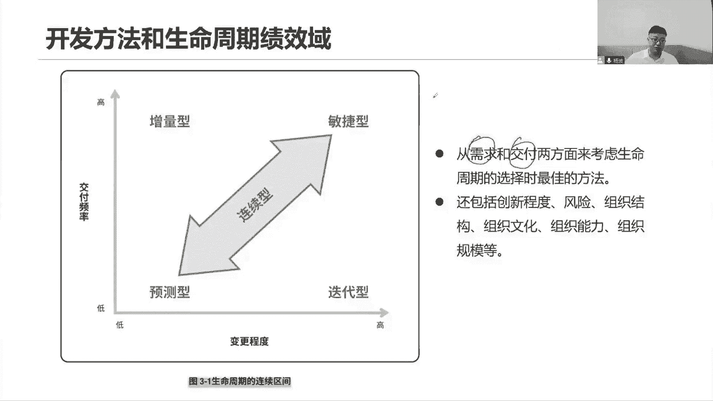
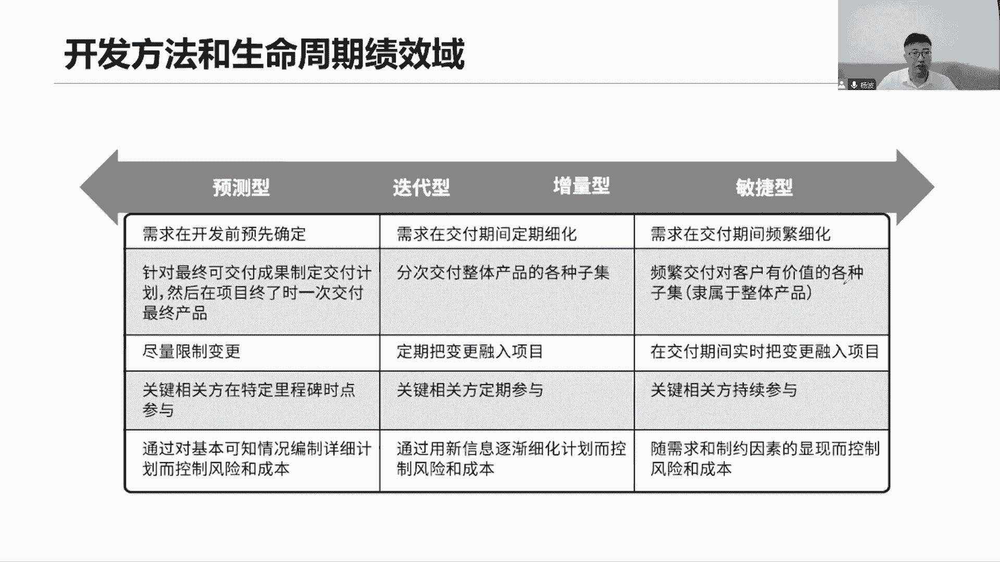
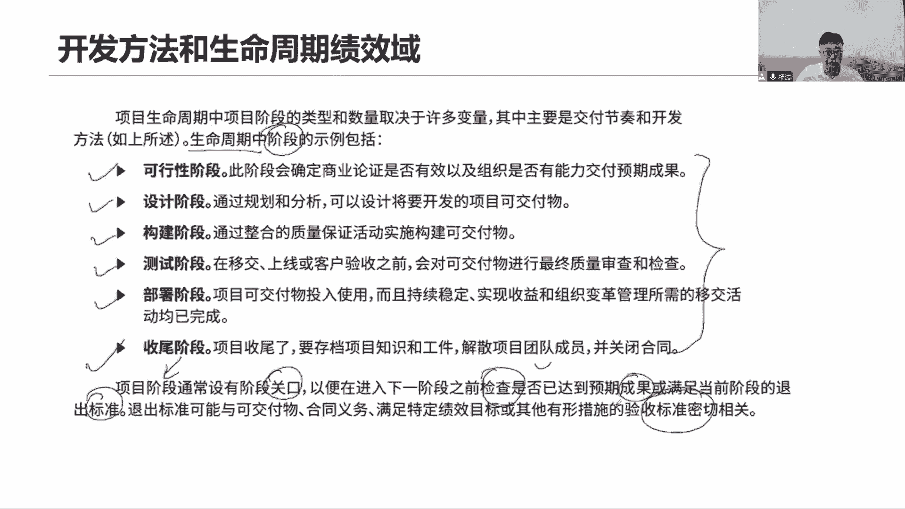
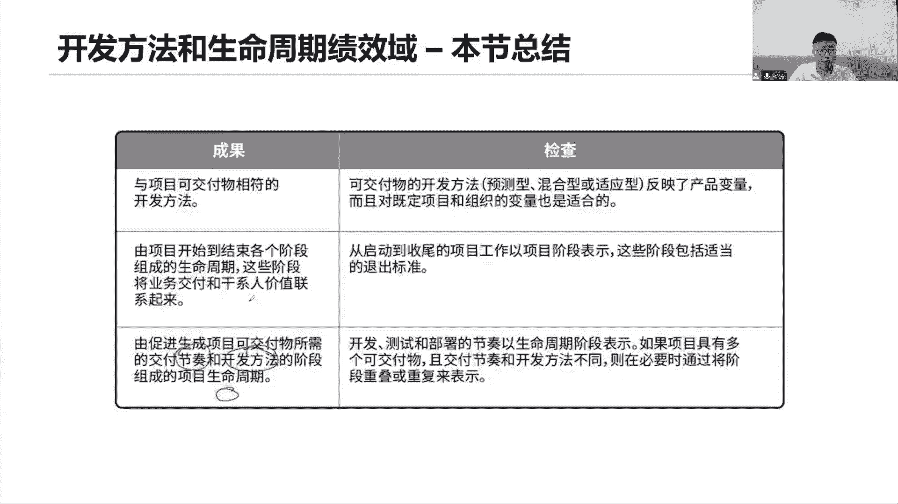
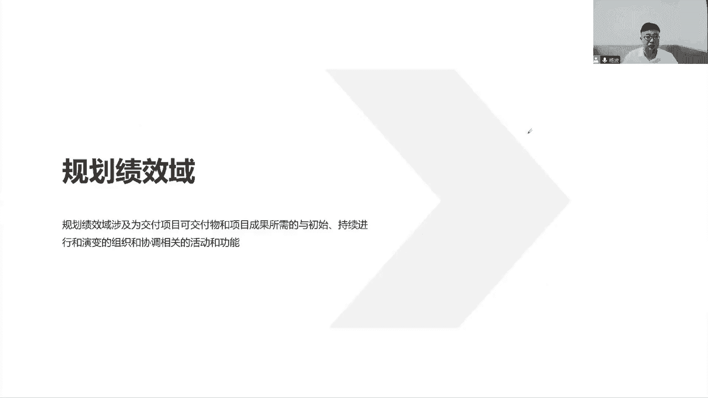

# 全新录制PMP项目管理零基础一次顺利拿到PMP证书 - P15：PMP精讲选择开发方法和生命周期的阶段划分 - 北京东方瑞通 - BV1qN4y1h7Ja

所以针对我们的开发方法来说，我们刚刚讲的这个敏捷适应性，那对我们增量型迭代型预测性，我们要根据我们前面所说的节奏来判断，到底用什么样的节奏来判断，我们当前应该选择什么样的开发方法。

更能够帮助我们去创造最佳的一个什么收益，所以选择开发方法很重要，怎么选，有两个节奏，第一个需求变更的节奏，第二个交互的节奏，所以说横坐标用我们需求变更，纵坐标用我们交付的节奏，我们来衡量。

以此来选择我们的开发方法，首先来看敏捷，对于敏捷来说，它的开发方法是指什么，第一个需求变更节奏非常的快，频率非常的高，随时都在变化需求，所以我们才会有小规模的去试错，小规模的去尝试小批量去交付。

以此来获得客户的反馈，到底是增加需求还是三点需求，还是应该去调整需求，修改需求，尽快的去适应你们的变更，以便于我们重新去找正确的解决方案，来应对你们这些金融价值，同时啊这个交互频率也很高啊。

你看我们是不是每两周咱就要去什么，加速一个最小的可工作软件，所以交付频率是非常的快的，频繁的交付我们各个迭代的功能，各个迭代的什么最小可运行软件，需求变更节奏很快，加速的节奏也很快，又敏捷好了。

接下来第二个迭代，那么基于迭代来说，我的需求也是变化非常快的，随时会有人提出一些新的要求，新的需求，因为你也是以迭代的方式来开展的，你和敏捷都是一样，都是以迭代的方式来看。

只不过你的迭代周期会比较长而已，因为你不强调速度，慢慢来一步一步的交付，甚至我们最后一次性的交付都可以，没问题，大家思考，像平时我们说的这些office软件，以及大家很少用到这些QQ。

之前做了202016版本，2018版本，20202023，是不是几乎是每一年一个版本，或者每两年一个版本，那QQ也是一样的，200920102020都是一样的，为什么会有这个以年份来作为作为版本呢。

因为他们迭代周期真的很长，特别长，他不需要频繁的发布版本是吧，他已经占领市场了，现在用户上市面上有很多很多的吧，因为我在你说WPS有没有也在用啊，大家也在用，那大家都是什么，以别的方式来看待。

不需要去抢占市场，是不需要去去更频繁的去融入新的功能，像这些比较大型的复杂的项目，那么就迭代迭代的目的是，尽可能希望我们去优化功能，优化性能，改进功能，学习功能和创新功能，不是让你们去快速加速。

只希望你们去找到一个更好的解决方案，来满足当前市场的变化，市场在变，需求在变没错，但是我们交付的频率会非常低，一步步来，可能三个月一交付，六个月一交付，12个月一交付都有。

可能它交付的周期频率节奏很慢很慢，这个时候用迭代性好了，接下来看它增量型，增量型啊，这个时候就要注意了，交付非常快，几乎和敏捷差不多，它强调就是要快速的去交付，加速了，是一个完整的一些功能。

在这里面增量嘛，增量的增加功能在上一个迭代的基础之上，在上一个增量产品基础上，我们去增加功能好，要求快速的产出这个增量产品，但同时啊大家注意一下这个需求的变更，它就没那么快了，对于增量级来说。

我们前期一定要先确定这些需求是很明确的，我们现在要完成一个功能，那至少这个功能你是得把需求给我确定下来，而且一旦确定之后不允许再做调整了，我就按照你的这个需求快速交付，这个功能就不许再变了啊。

别别这反复就变，那么这个功能怎么去实现呢，我要的就是要快速的交互，直接交付这个功能不是去适应你的变化，我要的就是要尽快交付功能，你开始使用这个功能，不是像你之前敏捷迭代这样一轮一轮短迭代。

去交付一个半成品，交付一个半成品的功能，我要的就是个完整的功能，尽快交付啊，这是增量性，所以过程当中我们限制变更，但是呢我要求快速交付，而我们40arm预测型它就不一样了。

需要我们以所以就是变更频率会比较少，而且呢我们的交付频率也很低，我们最后一次性的交付，然后呢中途也是完全的向限制这个变更，那用预测，要么前面举个例子啊，我们说我们现在我们要做一个产品。

做这个产品叫做app，做的什么产品呢，一个社交app，那这个社交app啊，就是现在我们做社交app的目的是，希望能够超越市场上占领第一的微信，那么第一个版本哎我们说我们先抄微信的功能，它有什么功能。

我们就抄他什么功能，那这个时候是需求非常明确，需求很明确，预测行吗，中途不会变更，我们把它抄过来，一次性的发布第一个版本，你有什么功能，我就有什么功能，接下来我们第二个版本就需要大家辛苦一点了。

而且我们说要超越对方，不光是有它的功能，我们还有它没有的功能，但你有面对面建群，扫码进群，我们就是什么，面对面的时候抖手跺脚跳一跳就可以建群的，摇一摇就可以建群了，是不是可以啊，你没有啊。

我有我要求大家快速的推出这个新功能，两周之内尽快的上线，两周之内完全的去交付，我们当前这些新的特性要求你们快速交付，两周之内交付哦，啊，这个时候是不是就是用我们当前的链接，来开展这个工作啊。

然后呢后续用第二版本，我们用敏捷快速交付，中途我会给你们提大量的变更，大量的变更在这里面随时发生调整，随时给你改需求，随时让你融入新的要求，那之后好，经过好几轮迭代之后呢，我们发现确实有效果。

这些新的功能客户他们比较喜欢，打败了卫星，终于占领了市场，成为number one了，那既然说我们已经占领了市场，成为整个行业的一个领头者，那你觉得我们还有没有必要这么频繁的去变更，我们的需求，没有了。

我们只能稍微缓一缓，把我们的时间周期延长，延长我们的时间周期，那么呢让我们大家能够更多的去学习，快速的去适应变化，这个学习哦，学习我们的一轮一轮迭代，用很长的迭代周期去学习，去尝试，去研究，去试错。

找到更好的解决方案，打造我们一些生态系统，来基于我们整个社交app周边的一些生态，比如说什么视频啊，视频号，我们也搞了个什么视频号，然后呢还可以做一些其他的一些互动，在这里面。

这个时候我们就可能会有些迭代以及和增量型，增加了增量才增量交互啊，就这样迭代和增量型，我们也可以用混合的方式来开展，没有问题，而在不同的时期，我们选择不同的开发方法都是可以的。

以帮助我们选择最佳创造最大的价值，所以怎么选择开发呢，今天是不是讲了一个两个节奏，需求变更的节奏和交互的节奏，基于他们来选择不同的开发方法。

最后一总结预测性的方法，我们首先需求在一开始就非常的明确，预测传统方式，然后呢针对这个产品，我们最后一次性的去交付，中途会限制变更，注意一下，看看我们相关方干系人他们是怎么参与的，他们说这些关键人物啊。

他们都是在既定的里程碑时间节点，里程碑的时间节点，或者把它理解为就是个关口，一个阶段一个阶段的关口，他们参与进来，来检查我们当前的工作是不是做到位了啊，那么迭代和增量技能两个一起来混合着。

使用需求是什么，定期分批次的家族个子集，定期融入需求，定期融入变更，定期参与我们的项目名单，所以用混合型的方法迭代和增量型，我们要的是什么，定期参与，定期变更，定期细化需求，而我们敏捷呢，定期还不够。

我们还要更快，它的用处就是频繁频繁，甚至实时把这些需求融入进来，那么相关方的参与呢，持续参与，反复的参与，持续的参与，在这里面要求更快，因为我们要更快的把这个需求融入进来，那你是不是应该持续的。

及时的和我们去说这个事情啊，你不能说你的基金里程碑或者定期，那你的定期可能时间就比较长了，我既然你要求，我们把快速的把你的需求纳入进来，所以你的持续跟我去沟通，你想要的是什么，把需求说清楚啊。

要邀请他们来参加评审，所以都是持续的有规律的，一步一步的来参加我们的这些各种项目的，一些活动或者会议啊，这是什么呢，四种四种类型。

所以用于总结这个开发方法，对于混合型的开发了，那其实就是相结合嘛，不管是你预测的还是适应的，还是迭代的，还是增量的，反正把这一箱结合起来，用混合的方式来开展工作，当我们的口架构可以模块化的时候。

或者当我们的用不同的团队来开发，可交互的时候，我们用混合方式就变好了，混合混合那就是来自于不同的团队，他们不同的开发方法都可以带入济南，在采用混合的时候呢，他这个示例你看这里说什么。

用适应性的方法来开发，用敏捷开发，而且在需求，因为需求具有大量和不确定性，不过我们可以采用预测的方法来做产品的部署，产品的发布，因为按照阶段一步一步的把它发布出去。

这种部署不可能说一批量一批的小批量的部署，我只只给你部署一部分，明天再给你部署一部分，还有很多客户不喜欢这样，你要记住你的产品已经做完了是吧，你开发你小P的开发，这个没问题。

但最终你阐述的是一个完整的产品啊，那这个产完整的产品，你就可以把它切成一小片一小片来部署，部署部署，那就是一步到位，按照计算，按照标准流程，上一个阶段做完，我们部署下一个阶段再部署，再下一个阶段工作。

这就是预测性的方法，混合这个实例而已，再来一个示例是什么呢，说一个项目可能有两个可加入，其中一项采用适应另外一项，那就必然采用另外一种方法，可交互，有多种可交互，但是这个可交互它采用的是不同的开发方法。

所以其实一总结还是第一句话没啥区别，你这个234都是一句话说，混合混合两种方式相结合，那这两种方式取决于不同的场景，那就看是不是开发啊，当前遇到了很多期啊，需求不确定。

还是说当前我们需要有两个不同的成果，一个是适应，一个是预测，那是我们具体环境，具体方法是对的。

总之混合就是一个两个方法的结合，或者多种方法的结合，在三分周期里面，我们说可以把这个生命周期划分很多个阶段，当然每个阶段怎么划分呢，其实一个通用阶段，那可行性的设计的，构件的测试的部署的收尾阶段。

这些各个阶段该怎么画就怎么画，取决于当前项目的特性是什么，以及取决于管理风格，甚至行业的不同，都有可能阶段通常是有关口阶段，关口关口的目的是为了把检查选出来，这是一个考点，我们之所以划分阶段。

阶段划分是希望能够在每个阶段末进行检查，检查我们预期的成果有没有产出，检查我们预期的收益有没有价值，有没有达成，检查我们当前的成果，是不是满足我们的质量要求，我们质量标准看绩效，对吧。

拿着我们的项目管理计划去检查看绩效，拿着我们的项目章程立项文件去看我们的目标，项目目标有没有实现，有没有调整，拿着我们的商业论证收益实现计划，去看当前这个阶段的目标收益有没有达成，这就是检查。

通过检查来尽早发现问题，是在今天的这个阶段窗口去检查，我们当前是否有问题，及时调整，已满足，最后我们所产出的都是符合验收标准的。

所以本章我们一总结，我们会看看后面这个内容哈，文章总结，所以第一个开发方法有很多种，预测混合适应迭代增量都可以，就是任何一种方法我们都可以去选择，当然也不是说用这一种方法，就可能适用于多种场景，不对的。

我们得看当前我们这个项目的一些具体的环境，特定的环境，特定的环境，特定的组织会用不同的方法我们自己去选择，项目，生命周期是指当前项目从开始到项目结束，所经历的一系列的阶段，我们把它组成了这个生命周期。

在每个阶段后面有些关口，关口的目的就是需要去检查，当前我们是否已经实现了这些既定的业务价值，这些价值是来自于我们干系人，他们的一些需求和期望的，有没有满足，有没有得到。

有没有得到当前的一个一个价值的交付，那我们去管他要去检查，以及当天你看我们说免疫阶段，他还有一个退出标准，能不能退出，当前是不是需要退出，是不是要及时终止这个项目，都得我们对其标准来衡量。

我们当前的偏差是否已经不可接受了，第三个由促进向可交付物所需的交付节奏，你看提到了需求变更的节奏，加父的节奏，来判断当前我们用什么样的开发方法，用什么样的选择生命周期聚聚，当前我们说一个需求变更。

频率和降低的一个节奏，在这里好，这就是我们当前关于这个开发方法的，一些核心的内容。

所以总结啊，咱们还是在说当前这个开发方法，应该如何去选择，基于节奏来选择，还有生命周期，怎么去划分生命周期的每个阶段，其实就是做检查，找到这些特定的环境，找到特定的一些场景，那一起来选择一个。

最适合于当前项目开展开发方法，既然现在选择了开发方法，我们是不是要去规划规划，基于这个开发方法，我们如何去完成，我得去定一系列计划，有可能当前我们用的是敏捷方法，也有可能当前我们用的是试验方法。

那两种方法它对应的什么计划是不一样的，两种方法，我们在规划工作的时候也是完全不一样，所以接下来我们讲规划吉祥物，那就要去思考，基于不同的开发方法，我们的规划方式是完全不一样的啊。

所以我们接下来会去讲我们规划技效率。

