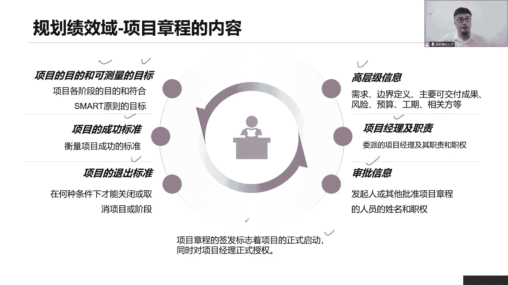

# 全新录制PMP项目管理零基础一次顺利拿到PMP证书 - P17：PMP精讲规划绩效域-项目章程 - 北京东方瑞通 - BV1qN4y1h7Ja

首先来看第一个制定项目章程，那么制定项目章程，它是我们项目最早要开始完成一部分，也就是我们得先拿出这个立项文件诶，这个B项文件是一个非常重要的，因为他在给我们项目经理授权，那么要做这个理想理解。

首先我们一起来回忆一下前面我们学习的内容，在项目早期啊，我们说发起人他会做一个事情，什么事情呢，需求评估，这个需求评估告诉我们当前有哪些业务的目标，这个需求从哪里来，这个需求产生什么样的价值。

这个需求我们要做什么工作，要做到哪些，要做完之后，我们的成果怎么体现，还是要做一个有新的产品，还是无形的产品，它的价值也要说明清楚，那这些就是一些业务的目标，也是我们的商业需求是什么。

那么基于这个商业需求，我们要确定下来他的目标，然后呢把这个目标抄过来，写在我们的商业认证里面，搞清楚他的目标，然后呢怎么去应对这个目标，有哪些方案去应对，我们要形成一系列的备选方案。

也就是说当前既然说要做这些项目的话，我们这个项目取得的理由，目的和目标，以及我们怎么去应对这些目标，还有我们要选择一个方案，有这么多个备选方案，到底选择哪一个，成本效益分析，选出性价比最高的方案。

挂最少的时间，投入最少的资源，产出最大的效应，最快的产出效益，以及我们当前这个目标，是不是与我们的组织战略保持一致，我们的目标最终目标效率是多少，是为公司赚一个亿还是赚十个亿，哎这种确定下来。

天总商业论证论证完成之后呢，我们接下来要做一个补充性的说明，告诉我们，当年你为什么说，当年这个项目能够给我们产生这么大的价值，所以我们要把这个目标效益超过来，然后呢，再来说明一下。

当前这个目标效应是否与组织战略保持一致，请记住，保持一致是特别重要的，不管你是做商业论证，还是说我们下一管理计划或者收益时间计划，一定要始终保持和我们相组织的战略目标，一次性啊。

一切还要说明当前谁应在什么时间，用什么方法来测量我们的目标效应是否有实现，以及这个目标效应是否有组织把福字，那么这一次我们做效益管理计划，对我们的商业论证做一个补充和说明的。

那么经过这两个文件的商业分析之后啊，如果这个项目的经济可行好了，我们就要开始立项了，那么立项立项就要写一个立项文件，这个文件就是我们的项目章程啊，项目当然可以由项目经理写，也可以由发起文章写。

其实谁都谁来写无所谓，但关键是最后我们得到发起人的签字批准，这个是特别重要的，因为发起人家对这个立项文件的内容做决策，这个章程的签发，它就标志着我们项目正式启动了，也标志着项目经理被正式授权了。

好我们来看这里，要想制定项目章程的内容，首先我们怎么去做，怎么去收集数据呢，首先通过一些访谈来收集，干性能的一些高层级的需求，注意啊，这个高层你先把它圈出来，就显得特别重要，为什么叫高层级。

因为在项目早期，我们没有详细的事情，我们只能得到一些高层级的粗略，大概的宏观的一些信息，这都是一种高层级怎么收集，你可以通过访谈，一对一的访谈，你也可以怎么召集，这些关键相当我们一起来开个会。

开会来引导大家，引导大家把你们的高层级的需求提出来，那在开会的过程中，如果大家来自于不同职能部门，那你们提的需求和你们提的要求有点不一样，不一致啊，甚至有冲突怎么办，我作为项目经理。

我就要引导大家达成一致，引导大家站在同一个方向，比如说我们可以站在我们客户的利益角度，去思考诶，当前我们这个项目的预算或者项目的工期，应该是到达什么样的级别，应该是在什么样的目标，我们得确定下来。

如果我们目标未知，我无法开展工作，所以我们这里可以把目标达成一致，接下来说到这个目标一致，还有一个意思是什么，那就是我们的目标要与我们商业论证当中的，战略目标保持一致，那这个女方说所以怎么保持一致啊。

咱把目标超过来不就得了吗，项目的目的，项目的目标从商业论证里面抄过来，那你这样是不是就可以保持一致啊，没问题啊，当然可以的啊，项目经理他可以来写我们的项目章程啊，只要你得到授权，你就可以写。

最后呢需要得到谁的签字法，大家注意，通常来说是我们发起人来进行签字和批准的，那如果说发起人不在怎么办，我们可不可以找到PO，可不可以找我们公司高层都可以，因为他们有权利啊。

他们可以来给我们做商业论证审批，发行人对我们章程的内容做最终的决策，通常也是他来做决策，因为这个项目前期都是你来做的分析，这个时候由你来做决策是最合适不过的，章程人类变更。

我们后续都会直接转发起来进行协商，有的时候要调整变更，调整我们商业认证，或者是我们的项目章程的变化，直接找发行，因为你在做兼职一些决定性的一些工作，你在做主要的决策，所以我们找发行人来进行协商。

以解决当前前期的各项文件的一个调整好，这就是我们执行刚才我们要做一些工作，在这里面收集数据，然后开会引导我们通过多轮的会议，最后我们达成一致，达成之后，我们就会形成一个最终的项目。

造成找我们的发起人已签字好了，项目正式立项了，同时项目经理都会被正式授权了，那么现在我们是不是想知道一下，你这个文件既然这么重要。

一个授权文件到底内容有哪些，好了，接下来我们来看看关于项目章程的内容，首先第一个项目的目的，可测量的目标，那么这个目的是随着时间发生变化的一个目的，目标基于smart原则的一个目标，两个目先锁死。

为什么做这个项目，我们的目标是什么，第二个项目的成功标准和退出标准，这个项目什么情况下达到成功，如何衡量项目成功，要定义出一系列标准出来，比如说是不是全员定计划，按照这个计划完成的工作，可不可以。

我们的干系人，他们的满意度达到多少，我们当前这个项目是一个成功的项目，还有我们这个项目啊，前面说了，商业论证开头有目标收益，那么这个收益是否有实现，实现了多少，达到了多少。

那也是一个项目成功的一个标准啊，所以这些都可以成为一个标准，那以及项目推出，我这个项目达到什么情况下可以正常退出，如果说有一些异常终止提前退出，他又应该有什么标准，谁批准达到什么条件，做收尾了。

没有完成才可以推出我们的项目好，所以两个标准一个成功，一个退出标准这一块我们那就很重要了，高层级信息早期信息不足，我们只能收集一些高层级的信息，找我们的关系人，一对一的沟通，甚至我们开会讨论与达成一致。

这些一致的都是高层交信息，包括什么，你看有我们的需求，有哪些比较重要核心的需求，我们的范围的边界怎么去定义呢，当前我们可交付成果，最后是做个硬件还是做个软件，因为哪些。

当前已经识别到一些比较重要的风险啊，我们工期我们的预算大概是多少，有哪些关键的干性能，相关方提前识别到的都可以往里面写，所以项目早期我们识别到哪些关键信息，全部写在我们的项目章程里面。

后期我们在制定计划的时候，会把这些高层级的信息纳入到对应的知识领域，里面去做细化详细的说明，那你比如说预算，那我们会在我们规划成本的时候去考虑，工期，会在我们规划进度的时候考虑。

干系人相关方会在我们干系人去规划的时候，也要去考虑那是什么范围的需求的可交付成果，这些是在我们规划范围的时候，详细的说明是风险一样的，所以每一个信息啊，它都有它对应的领域。

未来我们会做进一步的细化梳理和分析的，当前只是一个高成绩，所以通过这个高成绩，大家思考一个问题，我们能不能够拿着项目章程来指导，我们后续的详细的工作，能不能这么做，想想用项目章程来指导我们后续的工作。

当我们后续在工作当中遇到了一些问题，不清楚该怎么解决，能用项目章程吗，显然就不行了，因为这个太过于粗略了，我们应该是拿着我们项目管理计划，或者说对应的子计划，这样才可以指导我们工作。

如果我们说只是说当前项目，我们不了解他的目的和目标，不了解当前项目的成功标准或者退出标准，那你可以看章程，因为章程里面是专门写了的，我们这个项目的目的和目标，以及两个核心的标准，那这个可以看。

但是一旦到了具体的内容，就不可以看我们造成的需要用计划来指导工作，以及把自己的名字写进去，还有呢我的职责是什么，项目经典职责是啥，是带领团队完成工作啊，那就意味着未来这个章程一旦被审批，你就有权利带领。

动用你的组织资源去完成工作啊，这是给你授权，以及有哪些人参与了审批，除了发起人，还有谁，还有哪些人员，他们的名字，他们的职权写在这里面，如果发行的不在，我还可以找其他人来帮忙审批，都可以好。

这是我们章程里的一些核心的内容，在这里面大家记住目的目标，成功退出标准高层级信息，项目经理40，以及哪些人参与审批，了解这些就够了，章程的签发，标志着项目正式启动，同时也对于我们项目经理有一个正式授权。

意味着他对我们的项目要做一个正式的授权，项目有了正式的定位，同时也是给我们项目经理暂时授权，项目经理有权利可以动用组织资源完成工作了。

等着，那么章子一旦被签字确认之后，接下来我们要开一个具有仪式感的会，这个会员我们可以把它叫做initial rating，来简称我们的启动会，那在这个启动会里面，我们主要做什么事情呢，章程被批准之后。

我们邀请当前我们说这些个为关键性的发，我们一起来开个会，在这个会上我会给大家把这个当成变成PPT，在会上跟他去解读介绍介绍这个章程内容，陆地目标成功退出标准，高层级信息。

项目经理是否是发起人签字确认好了，未来我们希望大家能够按照这些高层的标准来，后续来指导我们后续的工作，希望这些高层级的标准大家能够达成共识，我希望获得各位相关方一致的认可，我要获得你们的共同的承诺。

这才是我开会的目的所在，不是为了单纯给你们介绍介绍，如果要介绍，我何不发一个邮件出去就可以了，我要的是什么，在会议上我再次确认各位，这是我们大家一致认可的，达成一致的高成绩的目标，希望各位能够达成共识。

我获得你们的承诺，接下来我会带领团队，按照这个高成绩的标准，目标去定我的项目管理计划，我将后面按照计划来开始我一系列的工作，也就是说通过后续的工作。

