# 全新录制PMP项目管理零基础一次顺利拿到PMP证书 - P18：PMP精讲规划绩效域-范围1 - 北京东方瑞通 - BV1qN4y1h7Ja

好了，接下来看关于预测性项目里面，下面项目章程里面涉及到一些范围的边界，需求，可交付成果，那这些都应该是在我的范围过程中去，做好规划的，对这些可交付成本做一个细化说明，对我们当前的产品范围。

项目范围和边界做一个详细的说明，对我们的需求要做一个详细的梳理了，也就意味着，当前我们要去制定我们的范围管理计划，需求管理计划，以及我们未来如何去验证我们范围的绩效，我得提前把它规划出来，我的测量指标。

我的开展工作方式，是我们当前所涉及到的一些需求，咱得提前把它梳理出来，以便于进来，我们按照这些需求，按照我们的产品范围，项目范围来开展后续的工作，一步一步的把它做到位，进一步的把它分解下去好。

这是我们当前范围要开展工作，首先第一步我们要做什么事情，先规划此计划跟范围相关的子计划有两个，一个是如何管理我们后续的这些范围，相关的工作，以及如何去收集需求，定义需求，澄清需求排列，需求。

验证需求跟需求相关工作，现在我们需求管理计划，这两个计划都是在指导我们如何去做后续范围，相关的一系列的工作，那么有了计划之后，就可以按照计划来知道我们怎么去收集需求，这么多的需求是不是要全部都做不。

我们要圈定一个范围边界出来，那这个边界它会形成我们的项目，产范围和产品范围，但这两个范围太大了，没办法知道我们看什么，我们要尽可能把它们分解得更小，更易于管理的组件，这样才能够去开展工作。

那么以此来形成我们的一个范围的测量指标，多听且重要，好我们一个来看这四个过程。

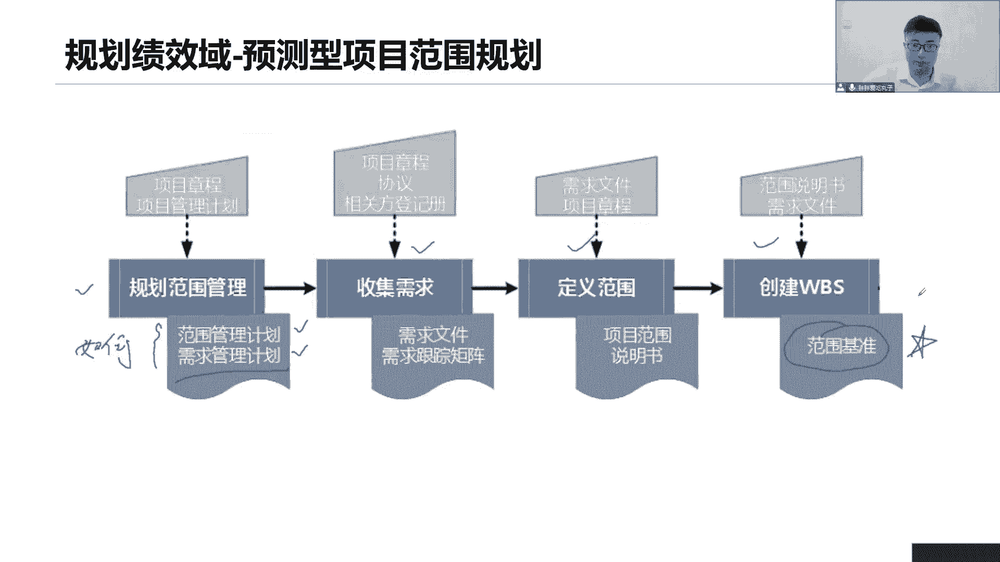

第一个我们做规划范围，形成我们的范围管理计划，在规划范围的时候，他这个范围管理计划的内容它大致掌握着，我看看就可以了，说如何去制定我们的范围，说明输入法如何去做，如何去做我们的备选方案，怎么样去做。

我们WBS如何去识别上里面的一些核心内容，怎么去做，如何去维护好我们这些范围基准，在这里面怎么去描述我们的范围变更，如何去收集我们的需求，定义我们这些需求在这里面很多很多。

就是告诉我们这些事情应该如何去做是吧，所以范围管理计划仅仅只是告诉我们，接下来我们要开展一些范围相关的工作，如何如何做，他这里面有没有说具体的取消它没有哦。

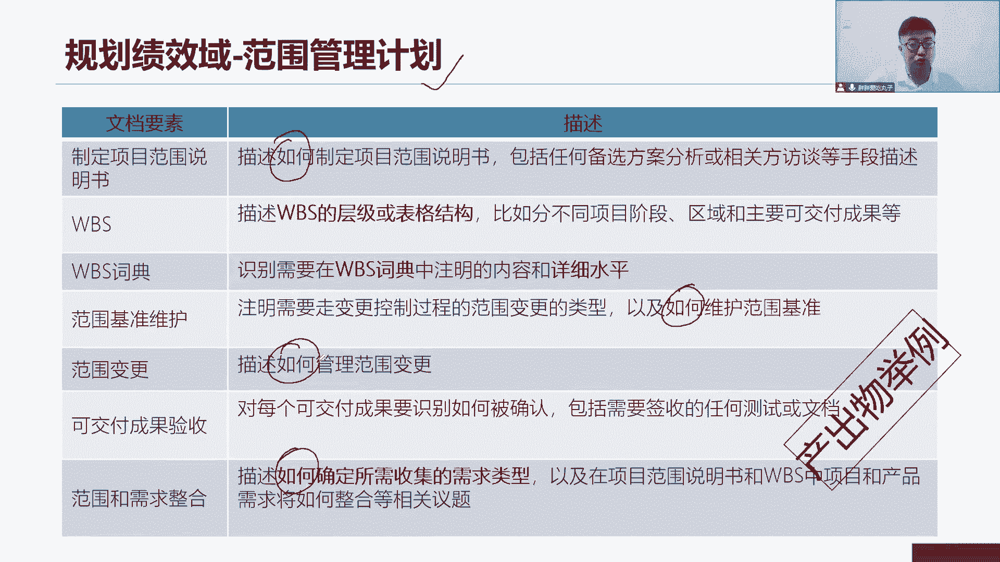

后续工作怎么做，只是告诉我们一个做法，包括需求管理计划也是同样道理，他也在告诉我们诶，我们接下来会有哪些方法，来帮助你去收集这个需求，如何去分析我们的需求吧，如何对我们这些需求做一个分类。

如何去记录我们的这些需求如何做，如何对需求做排序，如何去验证，那这些全都是一样，是告诉我们怎么把这个需求管理到位，如何去管理需求。

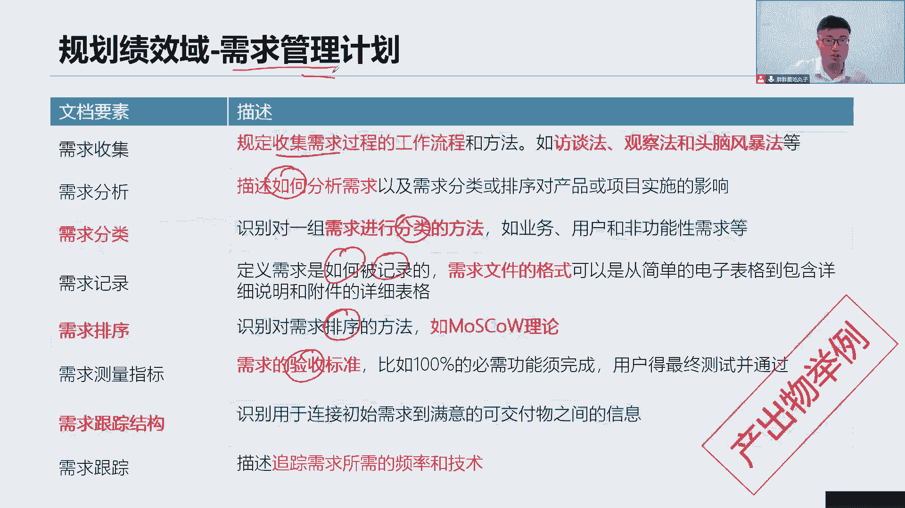

所以其实这两份文件大家注意，两份文件我们统一来说他都是在描述如何，所以他并没有具体的我们的产品范围，项目范围的描述，也没有具体的产品的需求，最近大家思考一个问题，未来我们的客户给我们。

提出很多关于需求上的变更，要加功能加工作可以加，没问题，只要我们领导审批了，可以加，那么加了之后，我们会不会去改，我的范围管理计划和需求管理计划，大家想一想，我会去改它吗，加一个需求，加两个需求。

加四个需求，哪怕是加1万个需求，我们会去改这两份文件吗，他们并没有具体的功能，需求范围和描述，只是说怎么做后续的工作，我做事的方法不变。

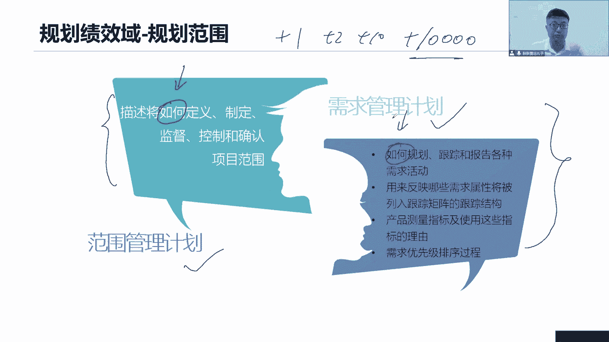

那么如果这两个计划就不会发生变化了，好接下来看第二个过程，收集需求，现在我们怎么收集呢，大家注意，这个收集需求和我们项目早期的需求评估，是两回事哦，项目最早之后我们做了需求评估。

只是在做项目这个企业整体的角度来说，这个需求谁提出来的啊，整个大的业务需求它的目标是什么，一个很宏观的一个需求平衡，但是对于我们现在来说，收集需求他要搞清楚的是，当前我这个产品的每一个详细的需求。

很清晰的一个具体的小个的详细的需求，有什么功能，有什么特性，有什么性能，有什么各种指标，诶这是在收集我们产品的需求，那么我们怎么去收集，收集的方法特别多，这个大家看看，第一个一样是反弹。

找我们的关键干性能去了解您的需求是什么，我们来一对一的沟通，我想了解这个需求它背后的一些细节是吧，所以我来和你一起来一堆的沟通，详细的沟通，交互的沟通，一对一的沟通呢可能效率比较慢。

所以我们组织一个会议叫做焦点小组，组织这个会议呢，是希望我们当前召集一帮主题专家，聚焦某一个主题，来讨论，当前大家对这个领域的一些需求是怎么看的，比如说今天上午我们开个会，焦点小组。

然后讨来讨论什么空气，下一步我们在卡友会来讨论，当前跟我们这个项目预算相关的一些需求，有哪些，可以啊，这就是聚焦啊，聚焦某一个主题，明天我们来讨论风险有哪些风险相关的需求。

后面来讨论有哪些质量相关的一些需求，当然可不可以啊，完全可以，我们就聚焦这个领域，大家一起来讨论，把我们的QA是吧，各种高级工程师，测试经理全部造出来，我们一起来开始会讨论资料有哪些核心的需求。

我们要去满足的，那么在开会的过程中，如果大家意见不一致怎么办，领导领导达成这个，很多时候这些人他们来自于不同职能部门，跨职能部门，那就意味着，大家只会站在自己这个领域去思考问题。

很难去站在我整个项目才能去思考，甚至站在客户的角度去思考，那就需要我来引导，需要项目经理，我们开个引导式研讨，会，把大家的需求希望尽可能朝着一个方向去引导，从而达成一致理解，以形成一个统一的目标群体。

创新创新创新头脑风暴，这个不解释了，同学们在工作当中应该经常用到特拉弗莫，就是指当前我们提出一些发散性的一些想法，创意点子，不做任何的批判，想到什么说什么都可以，只要是一个很好的创意，大家都可以提出来。

我们来收集民营小组呢，收集到这么多的创意，咱是不是应该做一个排序啊，你发射之后是不是应该汇聚汇聚到一起，我们才能够针对某些比较好的点子，再做进一步的发射，再进一步的汇聚，才能够形成决策。

不能全部都是天马行空，那这样我们怎么做这个需求就太多了，所以我们要用名义小组还是一样，我们组织一个会议，大家一起来投票，做决策，哪些点子，哪些创意它确实比较优秀，我们在做进一步的分析，名义消除。

其实就是排序，对当前我们的各种创意需求做一个事情排排序，清河图，何为清河图呢，当前我们收集了这么多的需求，我们要用亲和图来对他们做一个事情分组，或者把它叫做分类，哪些是管理类的需求，哪些是技术类需求。

哪些是商业类的需求，哪些是市场类的需求，可以吧，分组分类，因为需求太多了嘛，我们得尽可能把它分类，以便于我们从某一个类里面去进一步的分析，当前这些需求，它的优先级又怎么去确定，可以吧。

思维导图这个太常见了，我们现在收集了这么多一些创意和需求，我们用一种图形化的思维方式把它展示出来，让我们当前的创意啊可视化去吧，角色技术呢，既然大家提了这么多很有点子想法需求，并且还对他做了排序。

做了分类，做了展示，我们是不是应该做出决策，哪些需求更符合业务目标，哪些需求优先级更高，我们应该先做什么，我们要做出决策，到底做了哪些事情是吧，到底落入哪些需求好，第一个前三个都是跟投票相关的。

投票一致同意理解，大多数同意超过一半，相对多数呢都没有达到一半，但是我们看谁更多，我们就选择哪些方案，选择哪些哪些需求优先级比较高，或者我们先完成什么，相对来说你比如说40%，30，二十十。

那加起来刚好百分之百，那么我们选择相对多数的40%啊，你虽然说没有过半，但是你这块大家同意的人比较多，多标准决策分析是啥意思呢，说咱们在收集训的时候要做这个多标准决策，决策的决策。

是因为我们先要做多标准的分析，才能基于这个分析得出这个决策，从多个维度来考虑到，你这个需求的可行性和业务价值，就像我说以前我们去这个面试的时候去面试啊，我们的人力资源，它会从多个维度来分析。

我们当前是不是适合于这个岗位，哎你住哪里呀啊你结婚了没有啊，你有小孩了没有啊是吧，你工作几年了，你得会做什么性格测试，来了解我们的性格做的怎么样啊，会提出一些各种问题，你对我们公司了不了解。

为什么来到我们公司，你未来的职业发展是什么啊，你的规划有哪些，你的期望薪资是什么，是不是从多个维度来考虑，当前我们是不是适合于当前这个岗位啊，他要做多标准的分析，得出这个决策到底是适合还是不适合。

甚至会看你的证书有没有PP证书啊，有没有高效的证书，有没有敏捷的证书都考，这都得考虑了，是吧好，这里是多标准决策问卷调查，当前我们要想收集需求，但是因为人太多了太多太多。

而且很多时候他们还不在一个地方很分散，我们希望能够快速的收集到这个需求，以便于我们后期做一个统计，哪些需求大家认可啊，大家这个啊就提出了同样的要求比较多，那这个时候我们会通过问卷调查，来做统计和分析。

所以问卷调查更多是在于我们说人比较多，而且呢我们要快速的收集需求，那就问卷调查，问卷调查它应该是用过吧是吧，问卷星用了没，也就是我们想收集当前不同人，不同地理位置的人。

把分散的人他们一些意见需求和期望是什么，现在很多时候我们去商场就一下，我们去商场购物，去买东西，去逛街的时候，比如说我去销售，还有一些客服，他们就来勾引他，说过来找你，我们能不能耽误你2分钟的时间。

我们要做一个问卷调查，希望你能够帮我们做一个调查，给你个有奖有奖问卷，我给你发一个什么纸巾，发一个什么扇子，给你发个什么小礼品，然后呢你在这个问卷里面就是做选择题嘛，选选选，你觉得满意。

打勾就不满意就不打勾是吧，或者你打分也可以，甚至有些问卷它会让你写一些内容啊，你的期望是什么吗，你的下一次，你的这个我们商场里面还是能看到什么内容，你打游戏，男生打游戏也是一样。

很多时候我们的游戏里面也会弹出一些问卷，调查来收集你，你为什么喜欢这个游戏，你喜欢这个游戏的是什么界面还是剧情，还是人物画画风是吧，你喜欢哪些类型的游戏，是战略性的，是对战类的还是剧情类的。

还是休闲类的，都有很多，这种问卷调查就是在收集需求，他面对的受众群体会特别的多啊，大多数情况下都是分散的，以便于他们能够做出下一步的决策，到底应该怎么去做好我们的服务，做好我们的游戏啊，问卷调查。

包括我们项目做完之后，其实我们也会用的问卷调查，来收集我们客户的满意度，就是我们项目做完客户嘛，他们有很多来自不同的地方，也是一样的，用问卷调查收集各位的满意度，是否满意，提出一系列的一些选择。

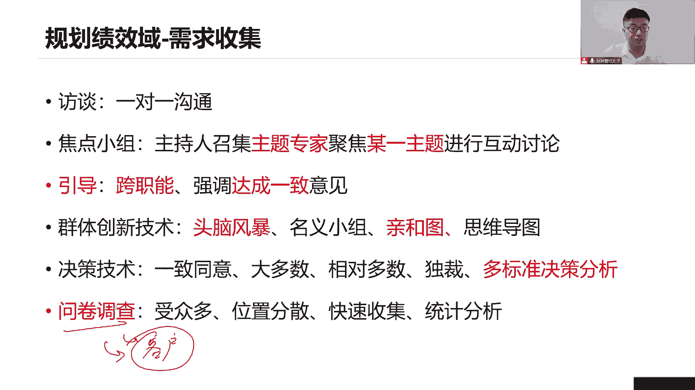

让你们去选，当前努力去干洗的人，他们说不清楚，倒不明白，也不想说这个需求，那你就别说了，我来看我看你怎么工作的，我看你的工作流程来帮助你树立需求，也可以好，圆形法这个特别重要，因为它常用于我们敏捷。

后面我们专门讲敏捷项目管理，讲讲这些原型法是怎么做出啊，怎么用我们的原型吧，圆形圆形它其实就是一个模型啊，就是一个模型，一个产品的模型，我们先做出这个模型，然后呢交给用户，你去体验交给客户。

你来体验都可以，根据体验之后请你给我一个什么反馈，我需要收集这些反馈，你的反馈就是需求，举个例子来说吧，你说我们当前我们要做一个app啊，做一个比如说我们购物app，那么这个购物首先我们是不是有登录啊。

用户名密码点击登录，登录之后呢，跳到我们的主页面，主页面上面就有很多很多商品的logo，把商品的广告，商品的一些一些清单在这里面点击某一个清单，你就进入到这个商品的详情页，详细的描述。

但是这个商品是什么内容，点击这个购物车加到我的购物车页面好了，加到购物车页面之后，再点击下单，跳到我们的支付页面，可不可以啊，没问题吧，这就是一个模型，它仅仅是一个模型，并不是什么一个真实的产品。

它并不能够运行业务，只是说在这个模型里面，你可以去操作，可以去点，你可以来看当前你所想的功能里面有没有，以及这个界面布局，你喜不喜欢颜色风格，你是否满意，你要给我一个反馈啊。

让我来调整当前我们这个界面的布局，调整当前些功能，优化一下当前我们整个的设计，这就是用模型的方式交给用户去体验，总比你说我拿着文档来跟你说要好很多吧，比如说客户，客户他说不出来，他倒不明白的。

他都不知道自己想要什么，那你别说来你自己的体验体，看看这个是不是想象的，你在这个操作的过程中，在体验的过程当中修理你的需求，就像我们以前我们说买房子之后呢，我们是不是要做一个事情装修啊。

装修房子找谁装修，设计师，设计师要不要给你个东西叫做效果，这个效果图里面有很多很多的内容，说当前咱们这个家吧，这是主卧，这是主卧，卫生间，这是客厅，这是什么厨房，这又是什么其他其他位置，那次卧。

然后呢这是生活阳台好，就这么一个房间，你得给我下个图啊，哎这个客厅我怎么办啊，这是我们电视，这是什么沙发，这是茶几，这是我们当前的这个啊，厨房厨房，然后呢，这是我们的卫生间，这是主卧，这是次卧，布局好。

我们说这面墙不要把这面墙不要把它拆掉，这个地方我想加一个什么东西，这个地方我想改成什么东西，你得给设计师说，他重新给你画效果图，这个效果图是不是就是圆形，就是模型啊，就这个道理，通过这个体验之后。

你想要梳理出来，你到底是想装修成什么样子，田园风，欧美风，简约风是不是你的装修风格，你当前你的家里面的布局说清楚，那么未来当年我们确认了这个原型，确认这个效果图之后。

装修队就开始按照这个设计图施工装修了，就这样吧，那我们做项目也是一样，当这个圆形确认了好，我们先按照这个原型一步一步的去做，当然原型也是持续的反复的去迭代了，慢慢的去把这个圆形的梳理出来。

当前线梳理完了，我就先做什么，一步步的把它做完成，这是原型法，用于敏捷里面，前期需求不明确，需求很模糊，需求异变，我们就用圆形法来帮助我们的用户，客户梳理需求，尽快的确定需求。

以便于我们接下来开始迭代的工作标准，对照与其他项目，其他行业，其他组织，其他部门进行比较，以找到最佳的需求，那既然其实比较比较说得通俗易懂一点，那就是抄抄别人，你有什么好的点子，你有什么好的功能。

你有什么好的创意，我全部把它抄过来，所以我的需求啊我也可以有没问题，只要不涉及到专利，我都得把它抄过来，系统交互图诶，人系统人啊，还有呢和其他之间的一些交互怎么交互的。

其实这就是三个偏技术的一个什么系统架构图，来帮助同学梳理创建技术层面，产品层面系需求文件分析字面意思分析文件，看看合同可不可以啊，看看我的商业文件里面提到了哪些目标收益，提了哪些高层次的需求。

拿过来我们分析分析做进一步的梳理，专家判断，当前我不懂不了解这个行业，不熟悉这个项目，我们找专家找顾问，让他来帮助我们，协助我们一起来梳理需求啊，啊这是我们当年收集需求的一些点，那么收集需求之后呢。

我们把它记录在哪里呢。

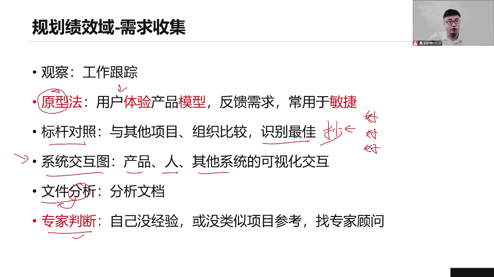

你说这么多方法都可以收集，接下来我们把它记录下来，记录在第一个需求文件，这所有的需求啊往里面写，这只是个吃力而已啊，大家看看就可以了，多当前需求我做一个详细的描述，做一个描述。

然后呢需求谁提出来的详情有哪些。

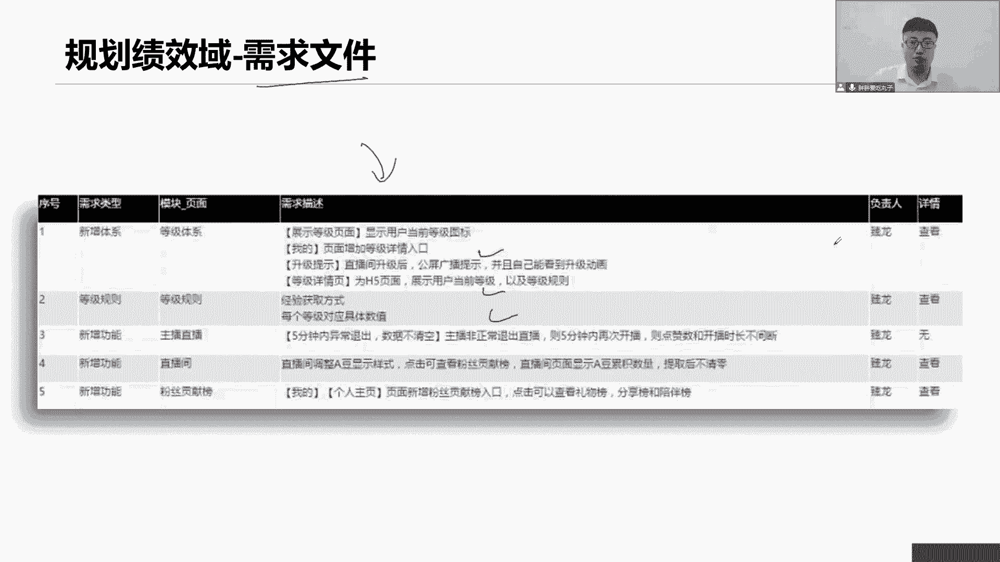

做一个简单的说明，另外一个需求问题，那它就显得尤其重要，叫做需求跟踪矩阵，怎么跟踪呢，首先说每一个需求，既然说咱把它记录下来，那就跟踪到底这个需求有没有被执行，被落地，有没有被验证，是不是这叫跟踪啊。

还有呢，咱们这个需求往前可不可以追溯到是谁提的，需求，基于什么业务目的提出来的，可以的吧，所以说这个需求啊咱得跟踪往前追溯，追溯到我们的业务相关的一些目的和目标，基于什么样的一业务目的。

我们当前有这个需求，从而来确保我们所做的每一个需求，它都是具有商业价值，不是无中生有的，它是符合我们最早我们需求评估得出来的，业务目标的，没问题，第二呢好往前追溯，我可不可以往后追溯啊，可以啊。

往后追溯，那就到我的成果了，当前我们的成果都应该有，当年我们的每一个需求，都应该有一个小的成果来与之对应，不管这个成果可能是一个按钮，一个界面，一个小功能，一个小组件都可以，我要确保每一个小的产品需求。

都与之有一个可交付成果一一对应，来确保每一个需求都可以执行落地了，那么要铲除这个成果，这个是这个成果怎么设计的，谁设计的，谁开发的，谁主导谁测试的测试用例是什么，测试通过了没有。

以及我们还可以写这个用力验收，没有验收通过了没有谁验收的，你看是不是可以往后追踪到，我当前后续的各个项目可交付成果，以及他的各种各个阶段全部跟踪起来，往前追溯，往后跟踪，所以这就是我们需求跟踪矩阵。

一个非常庞大的矩阵，确保每一个需求都有价值，也确保每一个需求都可以被执行和落地，避免出现遗漏，这就是我们说的需求跟踪矩阵，那么像这些各种需求的描述，业务的目标，项目的目标需求，对应的成果。

需求的设计开发测试验收，其实这些都是我们需求的各种属性，我们记录的就是需求的各种属性，来你的业务属性吧，比如说你们可交付成果的属性，设计属性，开发属性，测试属性，验收属性，我们记住的都是一系列属性。

把这些属性跟踪起来，确保每一个需求有价值且落地执行。

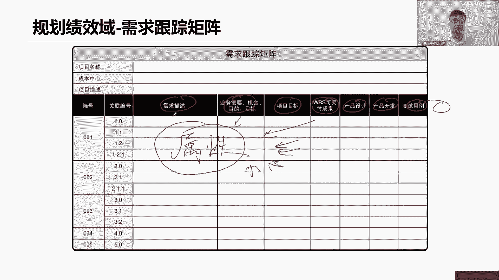

所以我们总结需求跟踪矩阵，它可以溯源到我们的一页的目标，当前啊我们的业务目的和目标是什么，确保每一个需求具有商业价值，已经描述了我们当前各个产品需求的各项属性，从业务到成果的设计开发测试验收的高速当中。

我们可将你去把我们的每一个需求都被执行了，落地去把需求文件中被批准的每一项需求，在项目结束的时候都能够交付出去，因为我们已经形成了可交互了，把需求转化成可交互产生价值，它会随着需求文件的更新更新。

那你说这个需求文件啊，前面几个各种需求客户加了个需求，你得先把需求文件改了，如果这个需求被批准了好了，我们跟踪矩阵同步的改了，要跟踪起来，确保每个需求它都有什么可交互来与之对应的。

随着可交互物的数据流的更新和更新，意味着什么，我们这个可交互是谁设计的，谁开发的，谁测试的，所以验收了，这不就是他那个数据流吗，按照这个阶段，按照这个步骤，把我们的可加工一步一步的交付出去来。

它的数据的更新，那么我们的数据分录取的各项属性，也得跟着更新啊，当面试的时候向官方提出了不满足业务需求，业务目的，业务目标怎么办，因为我们已经跟踪起来，你说不满足就不满足了，不对呀。

我们得先和我们的干系人一起来审查，我们的需求跟踪矩阵，尤其是在我们后面做正式演示的时候，或者阶段演示的时候，是不是可以找到这些文件项目经理，你来和我们这些干干系的，一起来审查做这个事情。

看看是不是真的漏了，是不是真的有遗漏或者需求对你业务不对。

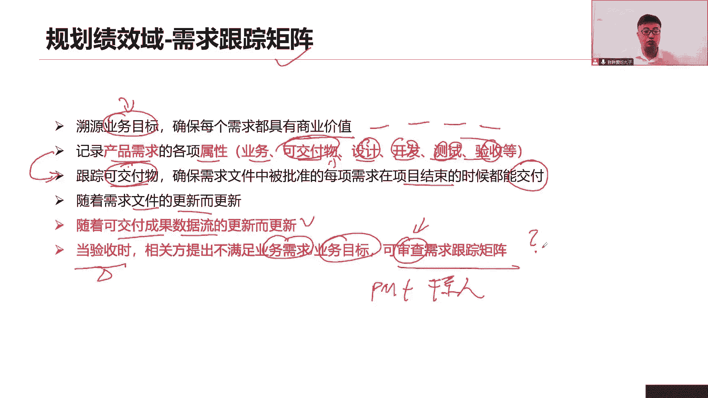

你做什么，这么多的需求是不是全部都要做呢，确定一下犯人边界了，也就是指当前基于已定义的需求，我们来定义我们的范围，形成我们的范围说明书，这个范围说明书里面它还包括几个核心内容，第一个产品。

我这个产品还要具备哪些功能，以及为了完成这个产品这些功能，我们要开展哪些工作，项目也就有了好啊，完成这些产品的功能，那么这个产品最终的成果要去跟他做一个描述，可交付成果，因为早期的项目章程里面。

你只是一个高层次的描述，现在基于我们进一步的分析和数据之后，我要对你做个详细的描述，以及这个成果啊，他应该怎么被验收，验收的一系列标准，就说明清楚未来他会怎么去在验收的时候，用什么标准，用什么定义。

用什么方法来验收，除外责任当前有哪些工作，我们明确了，在这个版本里面，我们不做我们做且仅做范围之内的事情，有些需求，有些功能，我们当前这个版本不做不做，那么未来验收的时候，你要注意哦。

客户说你有些工作没有完成，来看看范围输不输，是不是，这批工作在我们除了车站里面验收的时候，客户跟你说，你的一些工作不符合我的验收标准，来看看验收标准又是啥，那也就是说。

范围说明书也可以帮助我们在验收的时候，对于我们的验收标准和没有做的工作，做一个说明，除此之外还会有其他，比如说提出一些假设信息，或者我们识别到有哪些制约因素，对我们项目产生一些制约。

那么这就是我们当前一些范围说明书，还需要描述的内容，前面五个内容，大家一定要把它误以为牢牢的记住，因为后面我们会涉及到一些大量的相关的，一些绩效，大量相关的一些基准，它会包括在我们的打的是个书面。

基于现有的这个产品范围和项目范围，因为太大，可能说产品范围，所以当前我们要做些功能，我们举个例子吧，比如说我们现在要做一个购物app，那么这个购物啊，购物我们只会说还有哪些核心功能，比如说用户管理功能。

商品浏览功能啊，我们的购物车功能，支付功能，查看物流的功能，你光说这么大的一个功能，请问我怎么去做，就说简单点，这个用户管理那就太多了，用户名密码是吧，当前怎么去登录用户的信息怎么填写，怎么更改。

好多好多用户的绑定吧，是手机绑定，微信绑定还是什么绑定，这些全都是我当前的一些各种工作吧，注册登录密码，你说这么多小的功能，是不是要把它分解出来，我才知道你光说一个大的功能太大了，我不知道怎么做。

再说这个工作，这个工作一样，我要做市场调研，需求分析一下这个设计工作，研发工作，测试工作啊，发布工作我举个例子来说，你这个设计工作你要做什么设计啊，概要设计，详细设计涉及到什么程度啊。

你要不要做数据库的设计，要不要做接口的设计，要不要做这个图形界面的设计，都得做怎么做啊，一步一步的把分解下来，因为这个工作现在太大了。

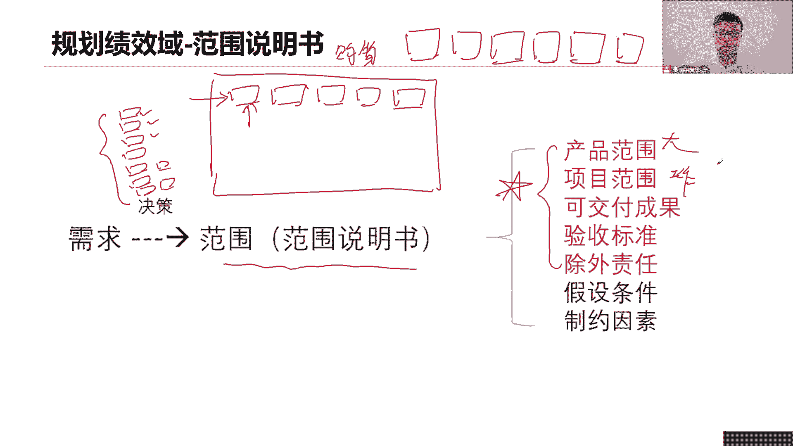

所以我们会做上海的工作，分解对于我们的工作，对我们的成果做一个分解，以塑形化的结构来把它分解，那你看这个图，现在第一个左边这个图，它只是按照我们功能模块，按照功能来分析的说，咱们这个APP呀。

这个产品有哪些子系统，每一个系统上面有哪些子功能，哪些子模块都可以进一步的去分解分解，分解的更细，更便于我们去去管理，那再看工作啊也一样，咱们要完成这个产品，要做市场规划调研，需求分析。

系统设计与研发实现，那你这个规划要怎么做，是要做下一步的规划需求呢，收集分析系统设计呢，概要的详细的是不是那么大，要详细六分啊，具体详细在什么程度，进一步往下分，数据结构继续往下分解，分解的更细。

更便于我们去管理，但你们的分解的太细了，你这一分解的太细，一定往上汇总还得多麻烦啊，所以要注意分解的流程，我们待会讲分解的原则好。

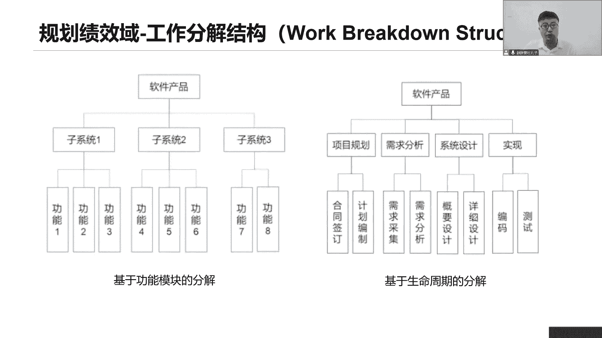

我们来看工作分解结构，那么工作分解结构w bs work breakdown structure，好，这个工作分解结构前WVS，他就是把当前我们的成果，我们的工作做一个分解。

分解成小的易于管理的各种小的组件模块，工件零件都可以啊，对分解的对象一是成果，二是工作，那么成果对应的就是我们产品范围有哪些功能，此功能是系统工作，对应的就是比哪些核心能力小的工作，那么分解的原则。

首先第一个自上而下，这个没什么好说，把最上面这个最大的软件，分解成下面一个小的功能，或者说一个小小的什么工作都可以，自上而下分解，滚动式规划，大家尤其要注意啊，这点很重要。

它体现的是我们项目的渐进明细性，像有些工作近期就要开展，我可以明确的把它细分再细分，但是有的工作未来六个月之后，一年之后，两年之后才会做，我有必要这么早把它分解出来吗，有这个必要吗。

你这个计划赶不上变化，有可能后面这个事这个事情都不做了，你还有必要把它分解吗，没有谁来分解，大家一起来，谁最熟悉这些工作，谁之前做过，就由谁来分解，那这样的话执行的力度，执行能力啊。

我们说执行的可行性才会更高，才能更准确，可行性才更准确啊，你没做过，你怎么分解，你都不知道他用什么组成模块是吧，所以我们要全员大家一起来分解，百分之百的原则是什么呢，我们从上往下分解没错。

我们可不可以自下往上汇总，汇总到最后这个大的产品里面，如果能够汇总到一起吧，符合百分之百原则，如果网上汇总发现，最终我们加起来，把工作量或者我们的规模达到120%，200%，差不多，什么原因。

有人在往里面随意的加我们的模块，加功能或者汇总起来之后，发现只有90%，80%，有些人把工作给他砍掉，漏掉遗漏了，不符合百分之百的原则，这就不对了，所以在分解的过程中，咱不可以随便去加工能减功能。

因为我们所定义的范围，我们的范围是已经定义好的，前面那个过程啊，定义范围已经形成的范围说明书了，咱们范围已经确定了，怎么可以随便用改呢，我们只是把这个大的工作分解而已，并不是随意加减功能。

所以我们必须要保持一个百分之百的原则，最底层的这些包是什么，包这下面最底层包工作包，工作包是WBS最底层的组件了，那么每一个工作包，是不是应该对应一个责任人啊，到底是谁来负责这个工作。

很多时候因为我们的职责不清，导致后面有很多混乱的工作，有可能这个工作嘛两个人重复再做，有可能这两个人都没有做，他以为我在做，我以为他在做，甚至这个工作包未来出了问题，互相推诿责任，但这不是我的问题啊。

你问他，他说这不是他的问题，抛给我踢足球，踢皮球，这怎么甩锅啊，所以为了避免这些问题，每一个工作方，咱们必须得确定一个资格认证，谁来负责这个工作方，张三你阻挡这个工作，你负责李四，你来协助完成这个工作。

方，说清楚谁是浙江人，最底层是我们的WB，最近是我们的工作方从上往下分解，最底层，这些就是我的工作包了啊，那么有些就是还可以继续往下分啊，你这么说，这么说，我们为了便于区分我们的规划吧。

我们这么把这个图分解的更细一点好了，那么最底层的这些，第三层是不是就是我们最底层的，他们就是我的工作包了，那么你们你们是什么吧，这就是规划包，我现在不着急分解，没什么必要，我知道你们内容是什么。

我知道你们的范围是什么，但是这个事情什么时候做，我不知道，已经很久以后才做，都有可能我现在没有必要去分解，因为我遵循的是滚动式规划，近期的工作我详细的规划成工作方，以后的工作以后再说，那就是规划方。

等他去规划路小宝WB4，还有一个组成部分控制长度，说，这个控制任务是进行项目进度控制，和成本控制的管理，控制点做政治比较，以做绩效测量的意味着什么，这个汇聚点这个控制点是这三个工作包。

网上汇总完成这三个工作包，我一共花了多少钱，我一共用了多少时间，我来测，我来测量一下，你看我们当前的成本和进度的绩效，这就是个综合的评估，我并不是只看你当前你花了多少钱，也不是看当前你的时间用了多少。

我是综合的评估，基于你完成了这些工作，基于你完成这些需求工作，包，我来看你总共花了多少时间，用了多少钱，因此综合评估我们的记忆小，这是要做正直，本期记住大家记住政治正值，其实就是看当前进度和成本绩效的。

我们把它叫做增值，后面会专门讲我们那个政治管理，所以这个控制点，这个控制账户，就是敢说当前我们进度和成本低效的。

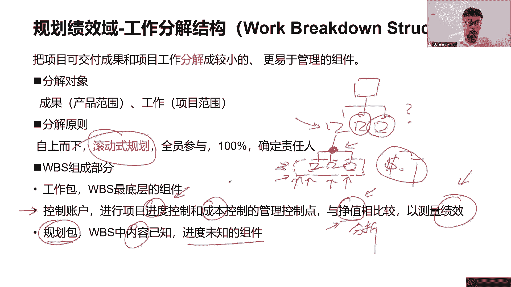

好了，现在我们既有了范围说明书，也有了当前自上往下分解的WBS，现在还有一个东西，什么东西，词典词典怎么理解呢，因为是全员分解的，全员分解，你分解的工作别人能不能看懂啊，这个工作包是个啥东西啊。

我们举个简单的例子来说，现在我们要做，就刚刚说的这个购物app没错，它有各项工作要做M需求的设计的分析的都做，那么分解出来还有这个app想要运转起来，我是不是还得做一个什么硬件支撑。

我得搭建什么硬件环境啊，否则我这个app怎么运转啊，我的服务器，我的存储设备都得有啊，不然我怎么去运行呢，这个客户量这么大，那用户每天数据这么多，这个数据的存储下来，所以我还得去部署一下硬件环境好了。

我要往下部署我的硬件环境，接下来我这么去分解，e cs吧ideas ips read，那么请问同学们可曾看懂这些是什么东西，如果说我不对他做一个解释和说明的话，谁能够读懂我们当前分解的内容是个啥。

可能有的同学他们没有做过，跟云或者跟安全相关的一些工作，就看不懂吧，是不是云服务器，是不是我们的磁盘阵列，是不是我们入侵检测各种系统在这里面对呀，那如果我不说怎么知道呢，这就是一个存数据的磁盘阵列而已。

专门用来传数据read，你还要继续分啊是吧，但是read1000read5，但是继续往下分都可以，没问题，但是我得说明一下，我怎么说明我要写一个词典，就像我们上面读文章，有一个字不认识。

翻译了中华词典一个档，现在我们分解的工作包，因为全员分解你分解的工作包，别人看不懂你是个啥意思，所以请写一个词典，对我们的工作包做一个描述，并且说明这个工作包有哪些资源投入进来。

每一个工作包是不是应该对应一个小的成果，这个成果依然是有颜色标准啊，就像我们说范围说明书，你的这个可加工成果你都有一个大的验收标准，那我这个小的可加工成果，可不可以有一个验收标准也可以呀。

这个可交付成果的质量要求是什么，唉要花多少时间完成，要花多少钱完成，都需要做一个详细的说明，这就是我的词典对我的工作包做解释和说明的，让别人能够看得懂，因为我分解的工作不是由我全部来做。

有可能由别人来做来执行，所以你让别人看到，还有大家注意看这里WB是词典，我们说对工作包做一种描述没问题，以及因为现在我们在做规划范围，是不是你看这里提到的资源质量进度成本，我们还没有规划到这么远的。

能写出来，写不出来，说明这个词典是不是也是滚动式规划，和我们WBS一样啊，近期工作详细规划，远期工作以后再说，先放在这儿，先空在这，我知道要写资源，但是我现在还没有到规划资源这一步呢。

先空在这滚动式规划，一步一步走，后面慢慢的把它填进来，写进来，丰富进来，细化下来好了，这是我的词典，那么基于现在我们说有了范围说明书，有的WBS，有了词典，这三个文件，它并没有对我们的范围做任何的修改。

增加或者删除，只是对它做了一些分解，只是对它做了一个详细的说明而已好了，我们三个文件可不可以打包到一起，打不到一起干嘛呢，接下来我们要做个很重要的事情，要把他们打包到一起，变成我们的范围基准。

我们要找领导去审批，这三份文件，一旦审批通过了，它就是我们整个项目的范围，基本整个项目范围啊，那种基本都是偏向于预测性项目啊，这个基准测量指标，那么未来我们就可以拿着这个基准来验证了。

你截止到目前这个时间，你该完成的工作有没有完成，今天我计划做五个功能，但是我实际上只做了三个功能，有两个偏差没有做完，你的范围绩效，我觉得能看得到了对吧，该做的工作有没有做完，这就是我们说范围的基准。

又能衡量范围的绩效的，所以范围的基准由三个文件组成，范围说明书，WPS和它对应的词典一共出三了，那么我们再回头想一想，前面我说了，客户加需求，加工人加工作加要求，我们不改范围管理计划。

我们不改需求关联计划，我们改的是啥，是不是他计算，就是记得当我们领导审批通过了，感情基准，具体改了什么文件范围说明书里面，产品范围，项目范围内要做调整吗，要啊这是一个什么验收标准。

你的可交付成果都有可能会做调整，WBS改改，当前有些新的需求加进来了，意味着诶你要重新多加一个功能，这就是你的新需求，那这个需求这个工作包，要不要做一个解释和说明，都得说对这些文件同步一起修改。

我们改需求，改的是这些文件，而不是改什么饭馆的计划啊，用大制作范围基本用来衡量范围，绩效的，加了功能，加了需求同步修改，那除此之外还要改什么需求文件改不改，需求跟踪矩阵，改不改都得改呀。

只要领导通过审批说这个需求在做，让你全部的地方加到我们的需求文件和，需求跟踪矩阵里面去。

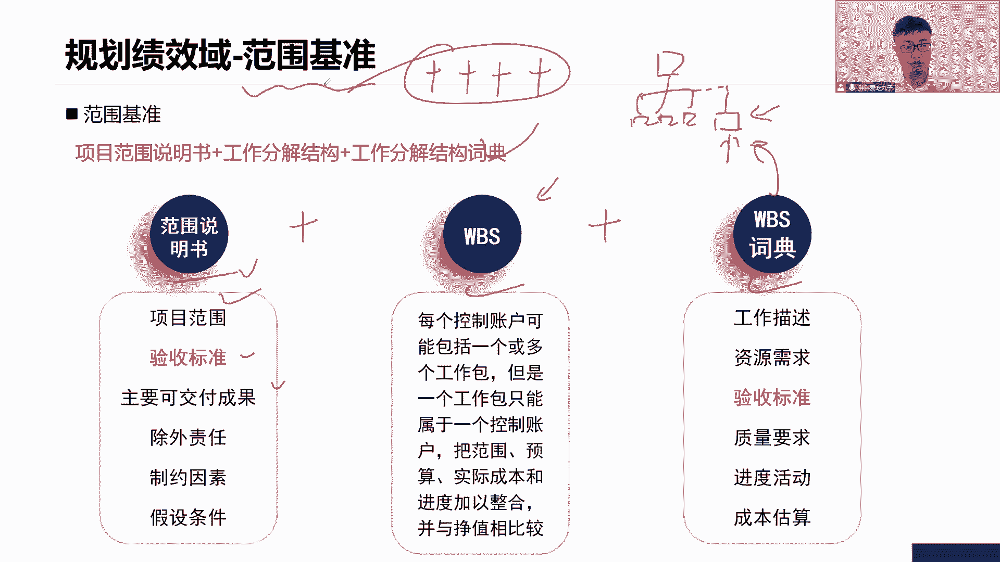

