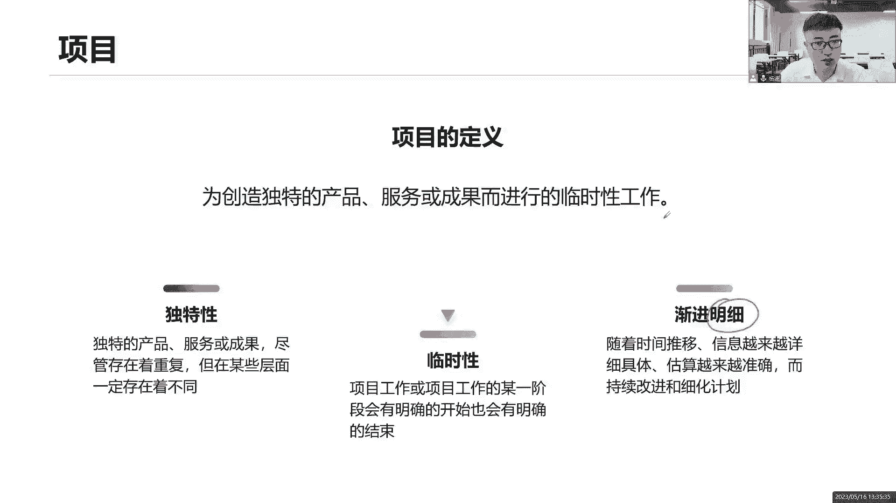
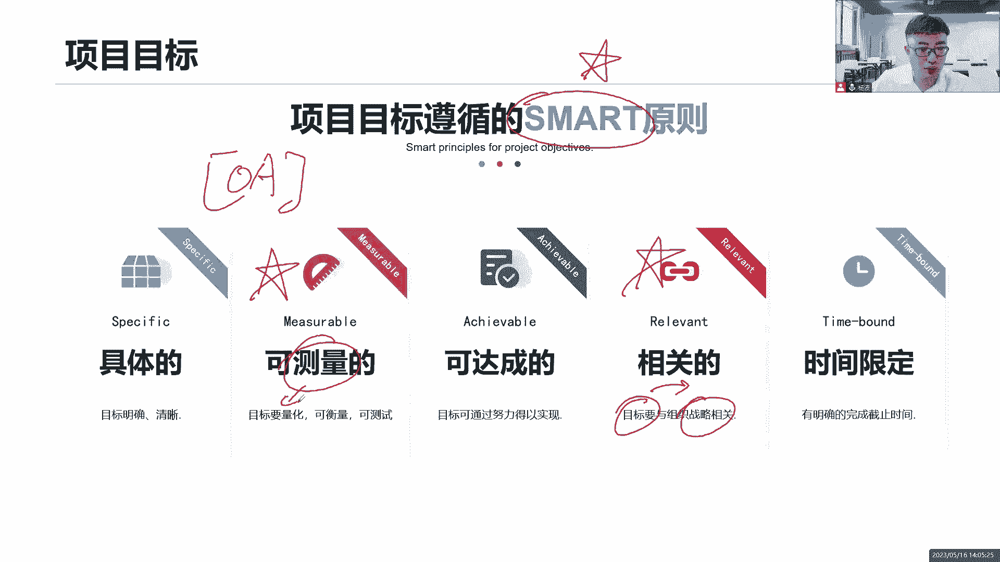

# 全新录制PMP项目管理零基础一次顺利拿到PMP证书 - P2：PMP精讲课项目及项目管理 - 北京东方瑞通 - BV1qN4y1h7Ja

好了，同学们，我们接下来进入第二章的学习，项目管理的基本概念，那么前面我们掌握了当前我们对于项目管理，知识体系的一些创新的理念和创新的思维，接下来基于这些创新思维，我们来看一看它有什么创新。

首先从项目管理的基本概念入手，在这个章节里面，我会带着大家一起来学习什么是项目，从一个最基本的概念，最底层的概念来解读项目以及项目管理，还有和项目相对应的运营，以及我们说单个项目怎么管那么多个项目。

或者说整个组织所有的工作又如何管理，我们讲价值交付，那么整个这个价值交付的体系，它的信息流如何运转的，在整个组织里面，作为项目经理，我要考虑哪些因素会影响我项目的管理，那这些都是我们当前要了解的一些。

底层知识和逻辑。

好，我们首先来看第一个概念，什么是项目，我们书上的解读说，为创造独特的产品服务或成果，而进行的一个临时性的工作，好这句话怎么解读来再读一遍呢，为创造独特的产品服，务或成果而进行的临时性的工作。

感觉没读懂是吧，书上的概念比较抽象，所以啊我们就应该把这些概念转化成，我们生活当中的实际的案例来分析一下，那比如说现在我们要开这个奶茶店，知道大家特别喜欢喝奶茶好了，我们现在要开一家奶茶店。

那么开这家奶茶店是不是，我们首先得首先先要选址装修，是不是咱得先把这个奶茶店装修出来，把你的硬装，你的软装，咱们这个是布置什么田园风格，还是什么欧美风格，还是还是小清新的风格，诶，先装修，装修完了之后。

接下来我们是不是要买一些，当前怎么制作奶茶的工具啊，我得去买工具啊，你看我们平时去奶茶店里面都会看到，在里面有很多人忙碌着，他们在做这个奶茶，有很多的设备机器啊，在上面去做，很快就做出来了，好了。

买这些工具，买完工具之后，接下来我们都已经准备好了，那么我们还要买什么买食材啊，是不是我们每天都要去买这些食材，新鲜的食材在这里面，那你这个珍珠是吧，你的介绍一些这个奶茶里面的牛奶啊，红茶啊。

这些食材真的经常去买呀，我们不说每天买它经常得去进货啊，新鲜的食材啊，什么西米露啊，这些果仁啊都可以啊，买了食材之后，我们就可以用工具来做这个奶茶，那这个奶茶做出来，商店把它卖出去吧。

那我们就意味着我们要销售出去，哎我们搞活动，销售出去好了，就这些工作大家思考一个问题，这个装修是我们每天装修，天天装修，还是说它是一个阶段性的工作，大家思考是一个阶段性的工作，做完就完事。

还是说我天天装修，每天装修，天天年年月月都在装修，是不是一个阶段性的对这个工作做完就完事了，那么你买这些做奶茶的工具呢，你那些厨房用具是不是也是阶段性的，你把工具买回来就完事了，你不需要天天去买。

没这个必要好，那么买食材呢是不是我们经常去买，甚至有的东西要天天买，因为你必须要保持这个食材的新鲜啊，你今天这个食材如果说没有卖完就过期了，有可能就不能再用了，我明天要重新去，尤其是水果夏天吧。

你不光放冰箱，那也不行啊，这就影响他那么影响这个食材的美味啊，所以我们得经常去买，甚至天天买，反复买，持续买，那消失更不用说了，你这个肯定是天天要做的事情，咱们重复做，持续做，反复做。

所以有没有发现他们的区别啊，这前面两个工作和后面两个工作的区别就有了，他们两个是阶段性的工作，做完就完事儿了，这就是项目，他有结束时间，那你这两个东西呢天天买反复买，持续买，定期买重复买。

我们把它叫做运营，它是一个持续的重复的一个工作，在这里面，那这就是我们整本书的最底层的两个逻辑了，什么是项目，什么是运营项目，它是创造成果，我要把这个奶茶做出来，他创造成果，但这个成果我们创造。

它是不是有一个阶段性的工作，开始开始完成时间是有的，它是一个临时性的工作，不是一个持续性的工作，那这就是项目啊，所以我们现在能不能理解了，我们为了创造这个产品服务或成果。

这个奶茶我们开展了一些临时性的工作，那么什么叫独特的产品呢，我当前第一杯奶茶和第二杯奶茶，看起来味道都差不多，是这个包装也差不多，我们一我们同时再去一起来开始做这两杯来茶，包括他的食材也差不多。

那他们有没有不同啊，肯定有些独特的地方在这里面，那你刚刚说什么时间不一样啊，你第一杯奶茶和第二杯产出的时间是不一样的，有可能你里面所使用的一些调料的配比，你不可能完全保持一致，它一定会有些不同。

甚至我们说盖两栋楼，这两栋楼同时开始动工，他的楼层一样，把他的这个外装修一样，它的户型完全一样，那他们有没有不同的地方有啊，地理位置不同啊，梁德龙的地理位置肯定不一样，那么意味着这个独特独特。

它代表什么意思啊，就说这个当前这个项目和我上一个项目，虽然说本质上相似，但一定会存在一些不同，这些不同就意味着什么，它有一些不确定性，也不能够完全按照之前的工作来做，那这个不确定性是不是代表着。

我们当前这个项目有一定的风险，所以为什么说，我们前面在说这个12项原则里面，这个风险一定得做这个绩效率，八个绩效率一定得考虑风险，因为项目他创造的成果是独特的，和上一个成果是不一样的。

那么这个屋檐就意味着有些不确定，不确定就意味着有些风险，你说这两栋楼下面打地基好，你的地理位置不一样，下面这个地基很牢固，你随便怎么敲无所谓，但是另外一栋楼它下面是什么煤气管道，天然气管道你敢随便挖吗。

下面发现了文物，你敢随便动工吗，肯定不敢啊，是不是，那这就有些风险在这里面好，所以我们现在回头再来读一读这句话，为了创造独特的成果，产品服务或成果而开展了一个临时性的工作，有开始有结束时间。

那这项工作我们把它认为就是一个项目了，那什么产品服务或成果怎么理解，我们这是我们的手机，是不是产品，我们用的笔是不是产品啊，用的电脑都是产品，什么是服务啊，我们做了这项偏僻的培训，是不是服务。

那我也可以理解为这是我们企业的一个产品啊，我们这个企业有这个产品PNP的产品，DP培训服务的产品可以呀，所以咱们没有必要把它做一个严格的区分，产品服务，都把它理解为就是成果，什么成果，科研成果啊。

新冠疫苗是吧，大家打的这个酒驾，这都是疫这疫苗不都是成果吗，所以不要把产品服务或成为严格区分，我们都统称为是一个成果，或者我们把它叫做是一个可交服务，在这里面，那么为了实现这些成果，为了完成这些成果。

为了铲除这些成果，我们开展了一些什么临时性的工作，所以独特，当前这些成果有可能在某些方面存在的重复，或者类似，但是一定在某些层面，他们一定有不同，一定会找到一些不同点，两个产品之间看起来一样。

但至少你的产出时间不一样，可能你的配比不一样，那可能你的质量也存在一些不同，不一样的问题，好产品，然后呢看着临时性的工程，临时临时，意味着当前这个工作他有明确的开始时间，也有明确的结束时间。

那一定得结束啊，你如果不结束，那就是运营的持续的开展下去好，这句话我们带出了两个特性，第三个特性它没有在这句话里面去体现出来，但是做项目一定得围绕着这个原则，或者这个特性来做，他也是一个渐进明细的工作。

这个渐进明细怎么去理解呢，大家思考一下，我们在做项目的时候，尤其是早期阶段，项目早期我们的信息是不是非常的少，对我们当前对这个产品所获得的一些信息，或者说对这个产品的一些需求，一些功能信息量非常的少。

不知道该怎么做事情啊，那你说我怎么去裁剪，我甚至连最后这个可交付成果都不知道，他是个什么东西，该怎么呈现，软件还是硬件完全不知道，所以项目早期，项目早期信息很少，信息不足，但是随着时间的推移。

随着我们文档的产出，随着我们代码的编写，随着我们成果的逐步的产出，我们的计划，我们的目标啊，我们的范围进度成本质量资源等等等等，各项属性是不是都越来越清晰了，因为我们的成果在不断的产出啊。

基于上一个成果，我们进一步的往下开展，进一步的往下细化，往下分解，那就越来越清晰了，那范围一旦明确了，需求明确了，后面呢该怎么做，需要花多少时间，需要投入多少资源，需要花多少钱，我都很清楚了。

一步一步地把这个信息逐渐的明细下来，确定下来，准确的定义下来，那这就是渐进性，这个过程好，随着时间的推移，我们会慢慢慢慢的清晰，因为项目早期信息不足，我只能粗略的去开展一些工作，随着时间的推移。

有些工作我可以细化了，我可以明确下来了啊，这就是我们项目的三大特性。

独特性，临时性和渐进明细性，所以独特独特，因为具有独特，所以在某些方面存在的不确定性，不确定性代表着风险不确定嘛，那就代表有可能有可能它是一种概率，那就有可能发生，也有可能不发生，这是一种风险不确定。

提升了项目工作的挑战，成果的一些竞争力，对独特的产品意味着我和你之间有些不同，有不同意味着我就有区别，有亮点，有竞争点可能重复，但是一定在某些程度存在着不同，一定有不同项目的产出物，可能是有形。

可能是无形诶，这个怎么理解，那这个成果成果它可以是产生有形的，也可以是一种无形的价值，在这里面，所以有心有心啥意思呢，我能看得见摸得着的，你看我们做项目产出这个产品，做这个手机卖，投入市场赚钱啊。

是不是赚钱，这个成果它的价值是有，它的价值是有限的嘛，能够看到真金白银好了，我们修一个英雄纪念碑，大家想想修英雄纪念碑，我们是为了赚钱吗，想想同学们，天安门广场的英雄纪念碑，它的意义是什么。

它的价值是什么，是不是希望它的价值能够远远的流传下去，影响我们的子孙后代，他是为了赚钱的不，这就是无形的价值，把我们要去传递，我们要去传递当前一些民族的精神在这里面，那这就是无形的价值在这里面好。

所以有心有心，我们可以把它对比的，它就是为了利，为了利益，那无形的民生嘛就是为了民生，那有的企业做项目，他不一定为了赚钱，可能只是为了拓展他的什么市场的占有率，品牌的知名度啊，提升它的商誉。

提升他的商业，商业的品牌知名度啊，市场的占有率，那这些都是什么无形的价值。

在这里面名声提高，它的名声，临时性呢具有明确的开始和明确的结束，再来这句话，要重点去关注一下临时临时有开始有结束啊，目标实现了，或者因为其他原因终止这个项目了，那就结束了，这个项目我们会按计划进行。

他正常结束也有可能提前终止，需求不在了，我们没有技术了，没时间了，没资源了，没成本了，提前结束都有可能，那不管你正常结束，提前结束，异常结束，那你总得有一个结束了，有结束，就是项目的临时性。

临时性不意味着这个时间的长短，那大家思考一个问题啊，你说这个我们比如从古代开始修建长城，大家知道画了多少年了，从西周时期开始到明朝，那怎么说也得有2000年吧，长不长，这个时间长不长，那他是不是项目啊。

有结束时间啊，那就是一个项目啊，从西周开始到明朝结束，管你跨越了几千年的时间，那它是一项不意味着时间长短，包括我们的三峡大坝30年的时间，时间也很长，那也有结束时间，所以临时性不意味着时间短。

临时性不考虑时间的长短，他只考虑有没有结束就可以了，临时性不宜适用于当前我们的成果，怎么说呢，就是指我们这个成果的意义和价值，就像我刚刚说了，我们修建这个英雄纪念碑，不希望他的这个价值有一个结束时间。

而是希望他能够远远的流传下去，影响我们的子孙后辈永远的流传下去，所以说他就没有结束时间，那临时性肯定就不能用在我们的成果上面，临时性只是用在我们的工作上。

不能用在成果渐进明细，随着我们项目的开展，随着时间的推移，随着可交互物的产出，我们的文档的输出，目标计划范围进度成本质量，资源风险都能够逐渐逐渐的清晰，也就是什么规划，大家把他劝一劝，这个很重要了。

这就是个考点呢，随着项目我们的工作逐渐的清晰，这是一种什么规划，这是一种滚动式规划，近期的工作我们详细的分解，梳理远期的工作以后再说，慢慢慢慢的做，你不要从一开始就把我们未来一年两年。

3年之后的计划定得清清楚楚，明明白白，有这个意义吗，没有必要，没有必要，乌卡时代啊，我们的项目，我们的计划，我们的需求随时在发生变化，我们的行业，我们的市场，我们的竞争随时在发生变化。

你怎么会这么早就把这个计划定下来了，过早的定计划对于我们来说是没有任何意义的，我们的项目应该是渐进明细的，到了这个时间节点，我们再来慢慢进行下一步的规划，你可以把它当做是一个什么。

当前近期的工作我们详细的做一个分解速率，因为近期当前的目标范围计划已经很清晰了，至于以后的工作，粗略的想一想就可以，粗略的规划规划就可以了，没有必要太过于详细，滚动式规划好项目的早期粗略的估算。

用一些的可行性的研究哎，因为项目早期信息不足，信息不足，没有这么多信息，我只能做一些粗略的，大概的宏观的类比的这么一个估算，那用于我们早期的一些商业分析啊，市场分析，我们的什么各种什么社会分析。

技术分析等等，一系列的可行性的研究，在这里面渐进明细不等于什么范围蔓延，什么叫蔓延呢，就是说当前我们没有并没有按照，我们没有按照一个正规的流程，既定的流程来去扩展我们的需求，增加我们的需求，增加功能。

想加就加客户说价我们就马上就加了，也没有走流程，没有去记录我们当前的一些变更的情况，这就是蔓延，大家注意一下渐进明细，他和范围蛮讲是不一样的，渐进明细是当前我的工作在一步一步的清晰。

不是说当前我得去增加我的工作错了清晰啊，因为之前我们的信息不足，我们需要做这些事情，但是并不知道该怎么去做，那现在我们很清楚了，我们要做这个事情，但是怎么做呢，我们一步一步的明确下来，并非是蔓延。

蔓延是什么，没有走流程，直接就把一些工作给他加进来了，我们肯定会走流程，只不过这个流程我们会一步一步的慢慢走啊。

这就是我们说的见机银息来，所以我们来看基于项目的三个特性，独特临时渐进明细，我们来看下面这些例子，哪些是项目，哪些不是项目，对于第一个来说，举办一场温馨的浪漫的婚礼，这是什么，是项目吗，那必须是啊。

因为有一个结束时间，咱这个婚礼也就中午那一会儿时间吧，是不是咱们中午12点开始，或者晚上夜场也可以呀，然后呢到几点钟结束，一般来说到个01：30差不多了吧，你不能让宾客们一直等着你啊，因为饿吗。

你总得让大家吃东西啊，所以这个仪式这个婚礼仪式一旦结束了好了，那我们就可以开始开工了，或者我们今天啊我们今天中午这个仪式结束，下午咱们还有仪式，晚上还有仪式，那你总得结束啊，这个今天晚上结束之后。

那咱们这场婚礼就举办完成了，我们就永远的在一起了是吧，这个婚礼也是项目，中午我们饿了要点一个外卖，不管是你给你自己点，还是给你心爱的人点外卖，那也得有一个结束时间啊，那这个外卖员把餐给你送过来就结束了。

至于你吃不吃，那是你的事情是吧，他会把他送过来，结束送过来搞定它，或者说你想提前取消它，你不吃了，我喝西北风，那你取消也就结束了吗，提前取消这个项目，可以的啊，他也是项目，这两个都是第三个。

我们计划一次爱琴海的浪漫旅行，哇，我的天呐，太浪漫了，爱琴海啊，是不是啊，那计划一次旅行是不是项目呢，那也得是一个项目啊，咱这个计划总得拿出一个结束时间，你不能说我一直在计划，一直在激化。

那你这个心爱的人恐怕是等不了你这么久了，咱得有一个结束时间，尽快把这个攻略定下来，我们什么时候去去哪里，过程当中我们去看哪些景点，我们在去哪里拍照，去哪里吃美食，而几天之后几周之后我们就回来了。

毕竟刚刚举办完婚礼嘛，大家度蜜月，我们去哪里度蜜月啊，我们去爱琴海，太浪漫了，接下来看这个生产线，每天批量的生产口罩，每天每天持续的反复的重复的，这就是运营了，哎这就是运营的，你不能停啊，你这一停。

你这个生产，你这个生产线一停了，我这个企业还卖啥呀，卖那我可能就倒闭了，破产了，我们这一次偏僻的培训有没有接触时间，那其实也是有的是吧，我们说这个培训嘛，我们的精讲课讲完之后，唉咱们这个课程就结束。

或者说我们后面可能还会涉及到一些，考前的辅导，考前的冲刺啊，考前的讲解，考前串讲，那这些课程也是在后面有所安排，当他们讲完之后呢，咱们这个培训啊也就结束了，那么我们再看最后一个，奥运会的基础设施的建设。

那必须也是啊，我们说我们国家在这个08年的夏奥会，还有呢我们这个冬奥会，冬奥会，夏奥会，不管怎么说，开展各种的一些基础设施的建设，这些基础设施建设也是一个项目，不能没完没了基础设施。

咱们国家的基础设施建设那是很给力的是吧，所以也希望我们能够持续的不断的去举办，我们的奥运会，让我们国家的影响力能够不断的发扬光大，好接着看做这个，所以我们再回头来看，说这个还没说完，你看这个项目。

大家思考一下，这个项目，是不是只是我们工作当中做了一些工作，可不是哦，你看我们生活当中是不是处处都是项目啊，我们生活当中全都是项目，不仅仅只是我们的工作啊，我们的学习，包括我们的生活全部都是项目。

所以同学们我们要了解一个点学习项目管理，除了为你的工作打好基础，让你的工作能够开展得更顺利以外，其实也能够帮助你的生活，帮助你们的生活，推进你们的生活能够什么开展得更丰富，你要知道你的生活怎么去计划。

怎么去规划你未来的职业发展是什么，两个人在一起不容易啊，两个人在一起遇见的概率是多少，很低的是吧，很低的这个概率，那么要想在一起的话，我们好不容易遇到走到一起，我们一定要什么长久的走下去啊。

那么怎么去规划好我们的人生，规划好我们未来的一个幸福之路，林业局当做一个项目来经营，因为作为一个项目来说，不是说当我们做这个项目就去干这个事情，是一定得用到一些项目管理的思维，来经营我们的生活。

否则两个人有可能会有很多争吵，争议在这里面有争吵，意味着他在破坏你们的氛围，所以我们得学习一些比较好的良好的时间，提升我们的管理思维能力，用在我们的工作当中，生活当中，实践当中去经营我们的生活。

包括我们说子女养育，养育我们的小孩都可以当做一个项目来开展。

后面我会讲啊，有些例子项目驱动组织变革来，为什么要做项目，因为项目能够给我们企业创造价值，所以在这一页里面大家可以写四个字，创造价值，创造什么价值，商业价值我们就写四个字就可以了。

创造价值创造我们的商业价值好，所以说我们组织啊，我们企业啊，我们公司啊才会去开展这么一系列一系列项目，在这里面好多好多项目，把我们企业从当前状态驱动到，推动到未来的状态，也就是提高我们企业的市值啊。

增加我们企业的估值，因为我们现在创造了哎非常成熟的成果吧，我们先进的一些技术啊，我们一些非常优秀的一些服务，专业的服务，有了这些成果啊，技术和服务，那不就是提升了我们企业的市值和估值吗。

创造商业价值驱动我们组织发生变革，从当前状态驱动到未来状态，所以为什么做项目能够创造价值。

那这是好事，那这个价值分为有形价值和无形价值，你看这里说的有心的真金白银，看得见摸得着的啊，我们这个分红股权利益都是有形价值，那么无形价值呢哎商誉品牌，知名度，市场占有率，生育这些都是什么无形的价值。

所以做项目做项目既有可能产生有性，也有可能产生无形，当然我们说做项目最好的是什么，两个都有，那当然是最好的，我既铲除了这个成果，这个成果投入市场之后，反应非常的良好，得到了客户的用户的认可。

而提升了我们的知名度，商誉品牌声誉度都提升了，那这就是最好的，有形的无形的价值，我们都获得了，所以我们才会做项目，因为它创造价值，为企业创造价值，那你说为我们个人呢，你既然说能够为企业创造价值。

那你个人的能力不就体现出来了吗，你个人的影响力，你个人的外部可见性，你个人的不可替代性全都体现出来了，那你未来也是一样的吧，走上人生巅峰，升职加薪。

走上人生巅峰，迎娶你的白富美，启动项目不能看，说的好，项目为企业创造价值，为我自身创造价值，说的倒是挺好的，但关键是这个项目从哪里来呀，那同学们思考过吗，项目从哪里来，我们企业这么多的项目。

那这么多的项目从哪里来的，可能我们大家第一反应的是客户，这里来的相关方，客户相关方吧，跟我项目相关的一些人，组织群体，这些都是客户的诶，或者说我们企业高层人员，他们给我们提了一些要求，提了一些需求。

有需求，那就把它当做一个项目来做，可以啊，没问题，还有呢符合法律法规，符合社会的一些要求，你看以前我们疫情期间人手一个健康码，这个健康码算不算是项目，你得当成一个项目来做这个软件啊，做这个小程序啊。

他为什么要这个健康码，因为社会需要在疫情期间，我们要做防控啊，我们要做监督啊，必须得人手一个绿码健康码，你不管到哪里都得需要，这是社会需要，还有呢，你看我们现在对产品的改造升级改进和升级，那也是项目。

一个产品升级迭代更新改造，都得把它当作一个项目来做，你看现在我们说还有人在用IPHONE4吗，IPHONE5还有人在用吗，估计没了吧，那大家现在用的是什么，十二十三十四。

以及未来还有更多更多更多了一些新的产品，在这里面，这是产品的更新和换代，都得是一个项目来推进的，企业的组织战略发生了调整，我们对组织战略发生了调整，业务的战略，组织的战略，你看以前我们说这个疫情期间。

口罩卖的还挺贵是吧，一个口罩能卖到十块甚至20块钱，那你说你现在我们还去生产口罩吗，这个口罩你一块钱能够买到十个，你觉得有必要吗，所以这个是我们的组织战略是不是要发生调整，咱不光是生产口罩。

那我们的医疗用品，什么酒精防护服，什么什么什么体温计，还有什么测温枪，这些你该有的配套设施都得做出来，这就是战略发生了变化，战略变了，项目奔着就来了，所以啊我们说这个项目的来源也挺多的。

但至少有这么四类，第一个客户跟我提，相关方提，第二符合市场的法律法规，第三产品的改造升级，第四组织的战略发生调整，产生了这些项目，所以这些工作我们去分析项目从哪里来，这是在做什么事情啊。

大家写四个字特别重要，非常核心，我们把它叫做虚需求，评估这是项目最早最早在立项之前，我们所做的第一个事情，由我们企业的高层人员啊，有权利人员他们来做这个事情，需求评估，搞清楚当前呢这些需求从哪里来。

是来自于社会的，还是来自于客户的，还是说是我们组织内部的一些改造或者升级，或者调整，先分析清楚这个需求从哪里来，这个项目从哪里来，以及未来我们还知道这个项目它产生什么价值，是有形的价值还是无形的价值。

都是来自于我们的需求，评估这个项目的意义是什么价值，什么亮点是什么，都有可能从我们的需求评估，这个过程开始做起来，就是希望能够搞清楚当前我们的业务目标，诶，是希望我们能够知道当前咱们做这个项目。

他的业务目标是什么，那需求从哪里来，项目从哪里来，怎么去实现，你有什么价值，有形还是无形，做硬件还是做软件，先评估啊。

那接下来我们看项目管理，什么是项目管理啊，来项目管理其实就是用到了这些什么，我们所学的知识，我们所掌握的技能，我们所学习的一些工具和技术，用起来来实现这个成果，那就可以了。

就是把当前我们那些知识背景音储备能力对吧，我们那些工具技术模型，方法过程全部用起来来开展，我们这个项目已产出我们的成果，所以这一大堆的东西怎么做，怎么管理，怎么运作，通过项目管理来运作。

那这就是项目管理，指导我们的工作如何完成可交付物，以实现组织的价值。

那这就是项目管理，那么项目管理的目标是什么呢，来这里我们看看项目管理的目标，这个目标我们要记住综合的评估，因为前面说了，是不是我们项目的一个系统的复杂性啊，项目很复杂了，你不能光考虑一个因素。

不能说我们当前做这个需求做的越多越好啊，我们尽可能满足我们客户的，越来越多的一些需求，他说加什么，我们就赶紧加，因为客户嘛他是上帝啊，他的需求一定要多做多做，反复加，各位思考一个问题。

没有这个范围的不断的增加，需求不断增加，会不会影响我的进度和成本，咱们做这个项目啊，得按照进度计划来开展我们的工期，我们的预算，甚至我们的资源是有限的，不是无限制的加需求，所以单从一个领域去考虑的时候。

你要知道它是否会影响其他各个领域的影响，其他各个领域是否受到影响，那至少我们有六个领域，它会受到影响，哪六个呢，就这里写的范围，成本质量，资源进度和风险，我们把它叫做项目的六大制约因素。

任何的一个因素的变化，它至少会引起另外一个因素发生变化，加需求好，你加加了这么多的需求，加了这么多的任务和功能进来，那么请问我的进度会不会受到影响，有可能既定的时间完不成，我的进度有可能会延长。

让我进度延长好了，我不希望我的进度变得太变，得怎么延长的过过多，那这样的话对我来说，项目的收益会受到影响，那所以我可能会加资源，资源就上去了，那这资源加进去，成本就上去了，这么多的人，大家没有配合他。

忙得手忙脚乱的，质量又下去了，质量降低了，返工有很多的返工风险又增加了，那你看是不是一个因素的变化，引起了多少因素发生变化，你想要去降缩减你的工期，缩减空间，那你得加资源，加人力资源嘛，加了资源。

你的成本又上去了，你想要去缩减成本，控制成本，缩减预算好了，那有可能你就砍资源呗，你的资源你的成本大多数来自于资源，所以为什么说有的企业裁员裁员裁员干嘛，因为他要控制成本缩减缩减资源啊，是不是那人少了。

你这个进度肯定就延长了，所以你说是不是任何一个因素的变化，都会影响其他各个因素随时随之而发生变化，这就是制约，那作为一个项目领导者，作为我项目领导者来说，我能不能只考虑一个因素啊。

我们是不是应该综合的分析啊，这个就是综合的分析了，这个就是项目在驾驭项目的复杂性，我们要综合的评估分析当前系统的复杂性，这个系统是站在项目整体的角度来评估的，我的范围进度成本质量，资源风险。

它到底会是怎么个影响，我综合的分析，我做整合，整合的目的是什么，我要去协调他们，不能够一味的加需求，我要去统一他们，我要找到一个目标，找到一个唯一的目标，一个大家都认可。

都满意的统一的一个目标来开展这个工作，同时我要考虑一个点相关方的满意度，客户的满意度，领导的满意度，团队的满意度，跟我项目相关的各个一些一系列的干系人，他们的满意度这些领域我要考虑没错，我做整合。

同时我还要整合什么，客户的满意度，也不能够完全来说，忽略了一些一些点在这里面，所以大家要知道衡量一个项目成功的标准，他会考虑我们这些干系人的满意度的，你不能说我们当前做完一个项目之后，大家怨声载道的。

即便说你按照这个计划，把这个项目最后做完了啊，项目是完成了没错，但是大家对你不满意呀，哎呀你看这个项目经理怎么在干活的，怎么带领我们的工作了，大家怨声载道了，那不行，那这就是个失败的项目。

所以得考虑什么相关方的满意度，来让说到项目目标，我们要遵循一个原则，这个原则特别重要，又是个考点来了，这是一个非常重要的考点，叫做smart原则，smart原则基于我们的五个英文字母的首字母。

那么看是哪五个哪五个原则，第一个具体，咱这个目标得具体明确，清晰完整，能够理解，你不能够太过于模糊，抽象主观不行，是不是太模糊，我们读不懂了，我都不知道有个描述的是个啥意思，所以我们希望什么。

咱们这个目标也得非常的清晰明确准确，能够理解你的这个目标想要表达是什么意思，第二可测量目标可量化，可衡量，可测试，可验证，不能太过于主观，我要做一个高质量的产品，那么请问你这个高高到什么程度。

可不可以通过测试覆盖率质量，那我们就缺陷率，我们的故障率，我们的恢复时间等等一系列指标来说明，你这个质量高高到什么程度，真得把它量化下来，如果你这个目标不能量化，那么请问我们未来怎么测绩效啊。

因为我们得按照这个目标来验证，我们的工作是不是做到位了，质量是不是符合要求，如果连女的不能够量化，我怎么测量，你说这个高高高太主观了，你说高就高吗，不能我们要把主观的概念，把它变成客观的测量标准指标。

可衡量，可验证，可测试量化，以前有个考题，他就这么说，说我们在做一个什么OA系统办公自动化，我们公司多个部门都要去开展，我收集了来自于比如说我们的人力资源部说，他们希望能够对接这个OA系统。

缩减我们合同管理的时间，从一天30分钟缩减到15分钟，然后呢又对接了我们的这个什么法务部门，说他们在对接这个啊，就是司法合同对接的时候，也是能够提高他们的工作效率，从以前的40分钟吧。

我们缩减到20分钟，然后呢，我们这个开发部门说，我们希望通过这个AI系统能够就像刚刚说了，提高代码的质量，请问你这个高提高到什么程度，什么叫做提高，那如果你项目经理，你接下来应该怎么做。

你就应该找到这个开发部的经理，跟他说说什么，你这个目标没有量化，我要找你来沟通沟通，你这个目标具体的量化指标是什么，这就是我当前项目经理，我下一步应该要做的事情，因为你不符合smart原则，对吧。

目标可达成，那这个没什么好说的，那不光说我们大家一起来做这个事情，虽然说很讨厌，但至少做了这个事情之后，我能够什么达成目标，实现目标，如果我们天天在一起加班加点的干活，最后目标还不能够实现。

那你认为你给我们定的这个KPI有意义吗，你认为你这个KPI能够有效的激励我们吗，肯定不行啊，是不是定目标，定这个绩效考核的目标，咱得可达成，然后呢，我们说这个目标要相关，和谁相关。

项目的目标一定要和组织的战略目标息息相关，必须记住，像我前面说了，我们做项目为企业创造价值，这个价值怎么来衡量呢，其实就是符合我们组织的战略发展的目标，在这里面，所以一定一定项目的目标。

必须和我们组织战略的目标，什么叫组织战略，大家可能首先一个组织里面，它是不是应该有一个什么愿景和使命啊，基于这个愿景和使命，我们怎么去达成这个愿景，使命要有短期的，占短期的目标。

中期的目标以及远期的目标，5年计划，10年计划，15年计划，那国家发展都有这个我们的十三五十四五，这就是战略，一味地实现你的目标，实现你的愿景，实现你的使命，一要怎么去一步一步的做到位，短期的规划。

中期的规划，长期的规划，这就是战略，要符合我们组织战略目标，因为组织战略目标来指导我们整个企业，如何去规划和发展，让我们能够长期的生存下来，并且创造更大的价值，那你创造价值一定得符合我的组织战略。

最后时间限定我们的这个目标，什么时候来验证答案有达成，你就得给我一个时间，结束时间不一定是按照我的项目结束时间，可能有同学有同学会联想到我项目的临时性，项目结束时间，让大家思考一个问题。

我现在做一个app可不可以，这是我们的成果吧，我们做这个AP的目的是什么，要给公司创造一个亿的收入好，那么请问这个成果我刚刚做出来，就能马上看到一个亿吗，能够吗，显然不行。

当前我们这个app0用户怎么产生价值，是不是得交给运营啊，交给我们的运营部门，售后部门，市场部门，销售部门，让他们把这个事情交给客户，卖出去，教客户使用，让客户买单，也就是说把这个价值要做到最大化。

这个价值在这产生的，在运营产生的，所以说啊你要运营多久，是一年两年还是10年，咱得说清楚，最后到了这个时间截止时间，我来验证一下，是不是你产出了这么多的一个成果，目标得有一个结束时间。

什么时候我来验证你的目标有没有达成，结束时间啊，有明确的完成时间好了，这就是我说目标smart原则，记住啊，这是个重要的考点，尤其是考的最多的可测量相关说，当前项目经理发现了我们的目标。

和我们前期的一些商业分析，组织战略目标不一致，问你下一步应该干嘛，那你得赶紧停下来，找我们公司的高层发起者，和他们确定我们当前的战略目标，以及组织的目标，还有我们项目目标必须得保持一致。

以及我们刚刚举的这个例子是吧，所以我们在做一个什么项目，现在发现了去收集这个需求，但是有些需求他没有给你量化下来，有些目标他没有给你量化下来不行，必须得量化。

因为我要去测量，我要去测试。

