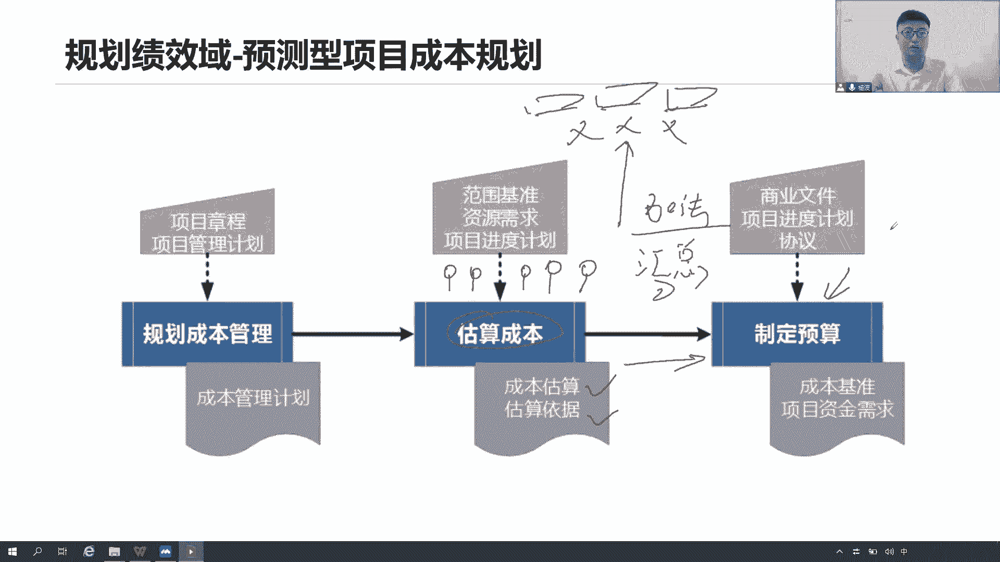
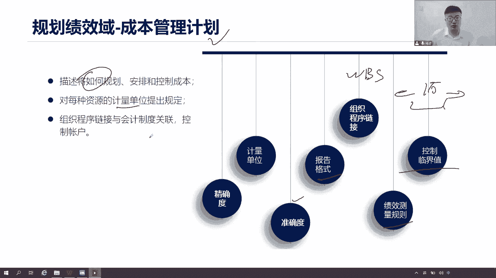
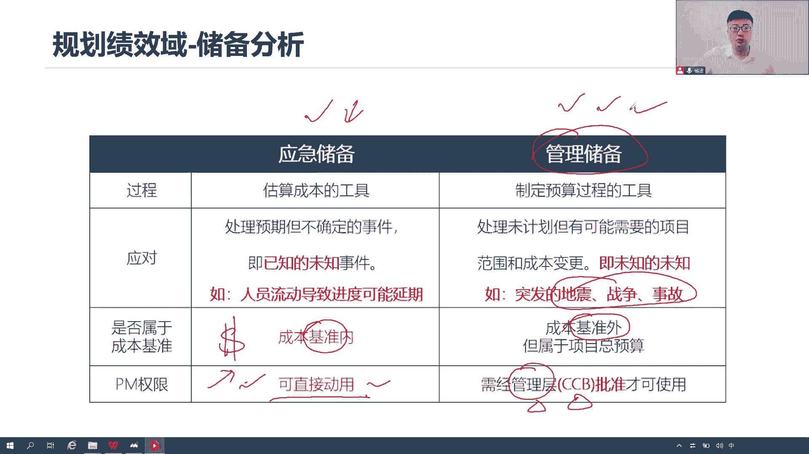
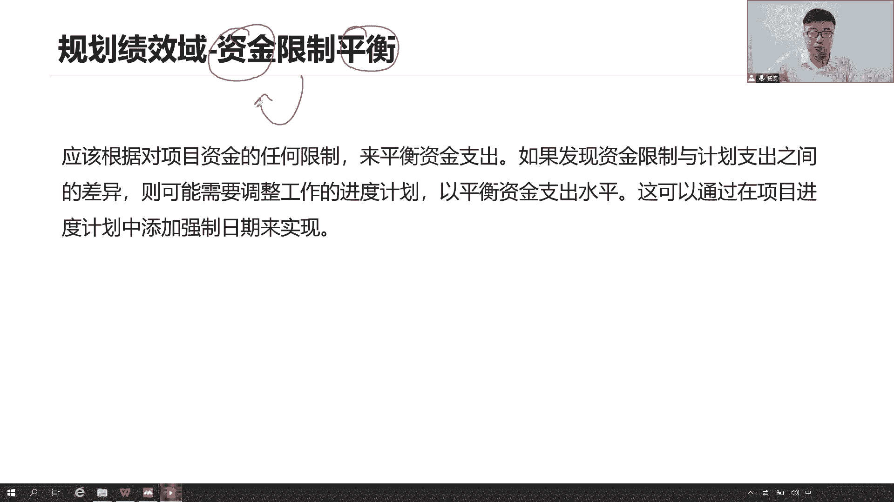
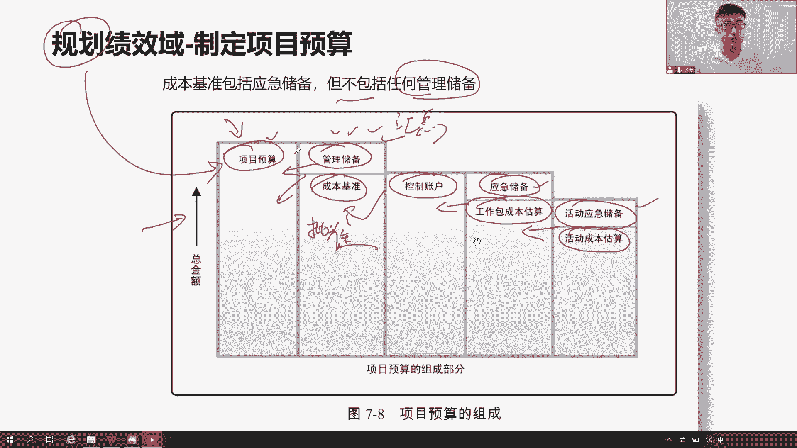
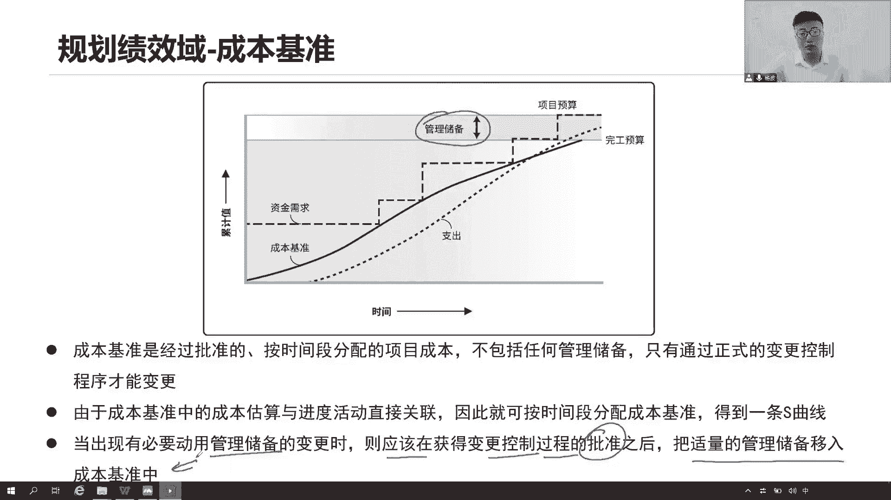
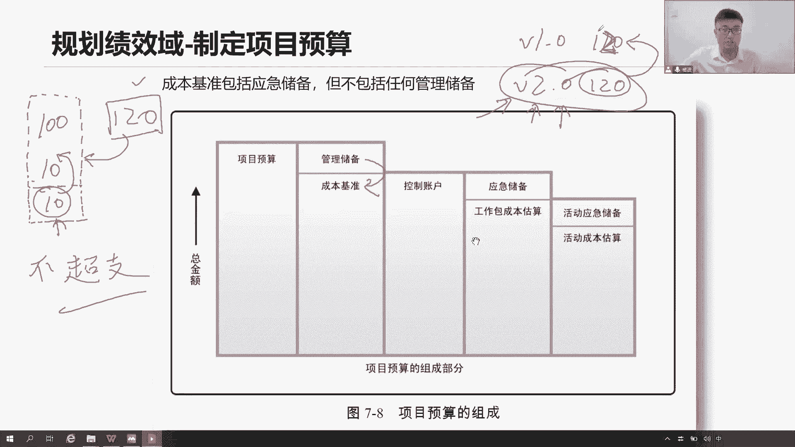
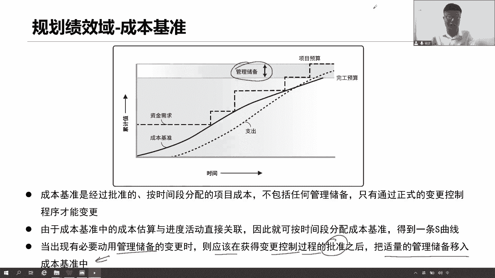

# 全新录制PMP项目管理零基础一次顺利拿到PMP证书 - P20：PMP精讲规划绩效域-成本1 - 北京东方瑞通 - BV1qN4y1h7Ja

进度的甘纳左右了，是不是下面我们要去规划规划我们的成本了，你说现在范围基准有了，进度基准有了，我还要做第三个基准，成本的基准，我希望知道这个成本技能是怎么做出来的，怎么去规划出来。

早一早期这些各种的测量指标，我们如何去把它规划出来，来看看第一个规划，一个基准，首先是不是得先有计划，先把这个子计划拿出来啊，如何去管理我们的成本，怎么去规划成本，估算成本，制定预算，形成基准怎么做。

还是一个词，大家记住它如何就可以了，你说具体这个机关里面有当前项目的成本吗，有具体每一个活动，每一个工作包的成本吗，没有啊，就是说如何做事儿，给我一个行动指南好，有了行动指南。

接下来他会告诉我怎么去估算成本，估算成本其实和估算进度一模一样，三点估算类比估算参数，估算自下而上的估算一样，到底还有呢储备分析，是不是啊，都可以来做估算成本好，以形成我们的成本估算。

然后呢你是怎么样算，把你依据说一说，那么基于这些各项活动的成本估算完之后，我就可以去定我这个项目的预算了，很简单，怎么做，他可比我们的进度简单多了，我们就做一个事情会做，把底层的活动成本汇总到工作包。

工作包汇总到控制账户，控制账户汇总到整个项目成本足下的网上汇总，都没有什么关键路径啊，说进度又这个进度压缩，资源优化，没有没有没有这么复杂，我们就做一个事情，加法从下往上加汇总。

我们会拿到我们最后的一个项目的预算，项目的预算找领导批准他。

你最后才能给他批准啊，可不可以，这个是很重要的点好，那么看第一个使用这个成本管理计划，一个子计划，是不是乍一看和我们的进度管理计划，几乎是一模一样，没错就这个意思，只不过他把这个成本啊。

把这个词从进度改成了成本，然后呢我们这个度量单位换一换，因为你进度嘛都是什么天小时秒是吧，人月我这个成本呢人民币人民币，美元，欧元日元吧，泰铢，你这个说钱啊，你不给计量单位。

我怎么衡量是不是到底是人民币还是美元，你得说清楚，至于后面什么准确度精确度报告格式，WBS链接到这个框架以及什么测量方法，测量公式，控制临界值在什么区间之内，我可以接受在什么区间之内，我不能够接受。

完全一样，没有任何区别，这就是我的成本管理计划，反正如何做事情，以及各种什么计量单位，各种什么关联方式，各种计算公式，各种控制的一些值，以及它的准确度，偏差度。

了解了解就可以了啊，他估算了说一样的，有储备分析，储备分析分为应急储备的分析和管理，储备分析和我们前面的估算进度一模一样，应急储备是针对当前已知的风险，我们接受它发生接着它发生啊。

你看比如说什么人员流动导致的进度，可能的延期，就是提前识别到有人不够稳定，有人还要提前走，人员的流动会导致我们当前资源产生短缺，资源短缺进度可能会延期形态，这就是以识别的风险是吧，我要去提前预行。

我要提前想好，可能这个人走了之后，我是不是得花钱重新招人啊，那你这个钱应急储备是吧，多预留点钱做缓冲，然后呢管理什么呢，我也不知道，这个是计划之外的，意料不到的这个事情，地震来了，突然爆发战争了。

突然发生了什么重大的交通事故，路上大堵车了，你说你会预料到吗，你说我能够预料到，明天我们这个高速公路上会有个，连环追尾的事件，我怎么可能预料到，突然明天高速公路发生了一个警匪大战，战争嘛。

是经常看这个TVB的，那个香港的经费大片，不就是这样吗，突然就开始了啊，有的人有人抢银行了，抢银行开始打仗了，警察土匪而已，对战我也不知道怎么会有这种情况，意料之外，那这是预料之外，我得花钱去应对是吧。

有可能会出现事故，对我项目产生影响，那这个时候这个钱就是我的管理储备，但是这些点大家好理解，关于后面这个点，大家应该记住，应急储备，他一定是在我们基准之内用来考核绩效的。

而我们管理部门呢他是在基准之外呢，这个一定要搞清楚，要搞混的，那既然说是我们基准之类的，我就可以用了，项目经理本来这个基本就是给你用的，这些钱本来就是为我们准备，该用就用你的，你直接审批就可以了。

但是如果说是管理，所谓请记住它在基准之外的这个事情，你能够直接审批，能够直接使用吗，肯定不肯找谁，找高层，找我们CCB变更控制委员会，这个我们讲啊，他是个专门一个变更的一个控制委员会。

来帮助我们做当前这些影响了我们的基准，是否可以通过审批来使用，未来会找这些高层人员，他们来审批，而不是我自己审批，弱算啊不对，所以应急储备项目经理，你直接审批，直接使用可以没问题，因为这是你提醒你。

本来就是为了应对风险而准备的钱，当他发现你用你的没关系，但是如果说是管理储备这种意外想要去动用，请走流程，走我们的一个非常严格的变更控制流程，由我们的高层人员，由我们这些有权利的人员，他们审批之后。

我才可以动用这部分的资金，来应对这些突发事件。

资金限制平衡，在我们制定这个预算的时候，我们除了网上汇总，还要注意一个点，就是未来啊咱们这个资金啊怎么去支出更合理，不要平衡的支出，你不能这么去玩，那就有点风险太大了，说当前我们这个项目分成三个阶段。

第一个阶段我们规划书我们要用一个亿，领导问你，你们第一个阶段计划用多少钱，我们计划我们规划差不多用一个亿好，那么他问你第二句呢，哎不要紧，那第三个阶段呢不要紧，那大家想想这样的总资金的支出有没有风险。

一开始就把这个钱全部都花出去，买设备的买全部堆在这把，造成的人把这些人全部招过来，后面他是不花钱的，有没有风险，这种情况有极大的风险，是不是，所以我们才会说我们要去平衡支出呢，怎么平等支出啊。

当前三个阶段，第一个阶段差不多3000万，第二个阶段差不多3500万，第三个阶段差不多3500万，可不可以，相对来说比较平稳的支出，可不可以啊，当然可以啊，没有必要从一开始就把钱花出去吧。

万一这个项目突然终止怎么办，万一这个项目遇到各种意外怎么办，你这个花出去的钱就没了，所以啊我们要相对平稳的每一个阶段，我们都要去做一个，咱不是说了吗，阶段有一个阶段关口，每个端口都要去验证一下。

当前你计划应该花3000万，实际上你花了多少钱，我们要做绩效考核的，我们要保证当前什么每个阶段都是合理支出的，那意味着什么，你前面用一个亿，你也可以做很多事情，但是现在第一个阶段你只有3000万人。

意味着有些工作你可能开展不了，那么有些工作就要往后挪一挪，等到下一个阶段有钱了，你才能够进一步的开展，那么往后挪，是不是你的进度计划可能会受到一些影响，你可能需要去调整我们的进度计划。

因为前期第一个阶段咱没这么多钱，那有些工作也开展了，咱这个项目团队把资金拨下来了，有钱了你才可以去做后续的工作啊，所以它可能会影响我们进度计划，但除非说这个钱差距比较大，一般讲操作一般来说不太会影响。

但是我们更希望的是能够做到资金的平衡的，平稳的支出，我们要限制这个资金，能够忽忽高忽低的一种使用，那这种对我们项目来说风险太大了。

那么要制定预算，我刚说汇总汇总怎么汇总啊，就是把最底层的活动，我们做做一个什么三点的类比的，参数的自向上的估算，以及考虑的储备分析，当前这些活动有没有哪些已识别的风险，我们把应急储备识别出来。

然后呢汇总到我们的工作包，工作包是不是也可以做一些储备分析啊，来看有哪些应急储备，所有的工作包的上涨是哪里，控制账户，控制账户汇总到一起，就是我整个项目的成本，整个项目的成本找领导一批准。

它就变成了我的成本基准，这个成本基准是包括了我们的应急储备的对吧，但是我们说了嘛，因为有些活动，有些工作他要考虑一些意外，这些意外就是我的管理储备，所以我们这个成本计算，加上我们基准之外的管理储备。

一共组成了我的整个项目预算，我项目预估需要花多少钱完成这些工作，这是什么项目预算，我就做出来，直接汇总，直接把所有权全部汇总到一起，基准它包括应急储备，但是呢不包括我们任何的关系，因为它不能够考核绩效。

不能考核绩效，那就不是我的基本，但是这也是属于我们整个项目的一部分的预算，如果你发生了，是要算到你的预算里面，那如果你不发生，他干的更好啊，没问题是吧，你不发生，那就那就不用这笔钱，那最好。

那最后我们会做一个总体的核算，只不过这是我们当前早期我们在规划的时候，我们规划到可能需要这么多的预算，不是最终我们并不是最终实际的成本是多少，这个我们最终会算项目结束之后会算的，但是现在在项目早期。

我们在规划过程，规划过程意味着，我就要考虑到这些所有可能支出的点，我都把它加起来，放在我的整个项目预算里面。

以便于未来我们做一个统计和分析，那成本基准，那么看这个图啊，大家知道这个成本基准啊是经过什么，当年批准的，按时间阶段，那么资金限制平衡，一个阶段一个阶段一个阶段去支出啊，这是没问题的。

这是一个项目的成本，不基准是不能够包括管理储备的，所以基准要想改可以改，需要通过一个正式的流程才能改，因为它已经形成剧本，那通过这个图，你们看到基准在哪里，哪个是基准。

是不是就是我们这个黑色的线成本计算，而这个黑色的线其实就是我们当前的完工预算，完成这个工作，完成整个工作，我们所需要的一个预算，这什么成本计算，他加上我的管理储备，才是我整个项目的，所。

所以成本计算它的另外一个名字，完工预算，这个完工预算和项目预算，大家不要混为一谈，完工完工，只是说基于当前这个成本基准之内完成的工作，叫做完工预算，可不是我所有的预算，我们所有预算还要加上管理储备。

才是我们整个项目的所有预算，所以记住这两个词，不要搞混了，完工预算是成本基准，是帮助我们把应急储备吧，活动汇总的工作方，工作包汇总的账户，账户汇总到整个项目成本，正好经过领导一批准。

才变成我们的完工预算，让大家看这个图，在成本计算中，我们说成本的估算和进度活动是相关联的，因为我们是按照时间阶段来分配这个成本基准，得到什么图，把这个圈出来，大家注意把它圈出来，S曲线图。

这个图啊就是个虚线，这个虚线可能S看的不是很明显，我们这么来画支出情况吧，我们要合理的支出是吧，在项目早期啊，我们可能支出的水平比较低，因为项目早期我们就是做什么估算啊，市场调研啊，做计划啊。

还没有投入大量的人力，但是一旦到了什么项目过程中，我们投入大量的人力来做开发，来做设计，来做实施，直到后面的项目快来收尾的时候，我们的资源相对的支出，我们资金相对支出会比较平稳对吧。

你开展工作你肯定得花钱啊，买设备，买物料，买买买各种东西去买回来用用用，按需采购，不是一开始就把所有东西采购完了，刚刚才讲过的哈，每个阶段限制资金的平衡，就这样的，当时我们在工程中。

我们会做出大量的资金去使用在这里面，所以它是一个S曲线，把这个图画的不够明显，随着时间阶段我们去分配，我们的成本，基本就是支出嘛，这个分配意味着就是支出支出，我们的成本去花钱去用钱。

所以中间它的坡坡度会变得比较到位啊，看起来像一条S曲线，这个S曲线其实不会衡量，就是用来做正式分析，用来测量机效，那么第三句话，当出现有必要动用管理储备的时候，在这钱应该在获得变更，就是找我们高层。

找高层批准之后，我就可以用，没错，然后呢，把市场的管理设备，移动到我的成本计算里面去好，最后一句话，啥意思，把适量的管理储备移入到成本基准里面去。

看这个图，再回到这个组，我们明明说了，成本基准和管理储备是严格的分开，严格的分开，你们不能包括在一起，现在他说了，我们用了管理储备，要把这个管理储备加到我的成本基准去，请问为什么大家可以思考这个问题。

现在要把它们汇总到一起，要汇总到一起，要加到一起，如何去理解，举个例子，现在我们要花100块钱，完成这100块钱的工作啊，但是完成这个工作，我提前识别到有些风险，我已识别到了风险，我计划多准备十块钱。

这个十块钱是不是我的应急储备啊，那么好，我的成本基准是不是有了成本基准，就是这110，意味着我要花这110块钱，完成这110块钱的工作，刚刚完成了，按预算完成，那这是我的目标。

花110块钱完成这110块钱工作，我在想是不是有可能还有一些意外，我再准备十块钱，这个十块钱就是我的管理储备，但是很不幸我们这个意外它真的发生，于是乎我们用了120块钱，用了，实际用了120块钱。

去完成这110块钱的工作，于是财务一查账，看到过比我的基准花的钱还多，他说我炒，他说我超支了，那么同学们说这个财务部门查账，说我超支公不公平，公公不公平，说我超支了，如果你认为不公平。

但是这个账对不上啊，我们实际花出去就是120，我们的基准就是100亿，你这就有偏差呀，那就是超级流，你理论上说确实不公平，是因为管理储备不能用来考核绩效，但是实际一查账又对不上，你怎么说。

让你跳进黄河洗不清啊，所以我们才要说，为什么要把这个管理储备，加入到我的基准里面来，目的就在这，我是希望我的理论说得过去，管理储备不能够考核我的绩效，我们不能说我超支，但是实际情况下呢，我还要做调整。

把我这个基准从第一个版本110块钱，变成我们的第二个版本，120块加进去，我要保证我的实际支出，就是按照这120块钱，完成这120块钱的工作，这样才能够保证我们是不炒制账，也对得上，理论也说了过去。

所以我们的基准变了，变成120了，就是要把这个管理资本，加到我的成本基准里面去，那我就没超支了，没问题啊，因为我确实动用了这个管理组队，我们确实应对了这些未知风险，所以我们多花钱，但是不考绩效，不考试。

我就把绩效给改了，把绩效给改就可以了，找流程去改，找找领导审批，走流程，把计算改成第二个版本，大家注意一下，改基准可以改，走流程去改，当领导审批了，你可以把基准直接把把基准改成120可以。

但是你能不能这么做，在上一个基准的基础之上，直接给他改成120，能不能直接覆盖你这一时间覆盖，请问我以前的绩效，我以前的工作我怎么考，所以大家说基准可以改，可以更新，怎么更新，在配置库里面新建一个机械。

新建一个版本，我们是第二个版本，我们的新基线是120，而不是以前的110了对吧。

新建一个版本，创建一个编号，创建一个什么一个标签，在这里面不要直接覆盖你。

