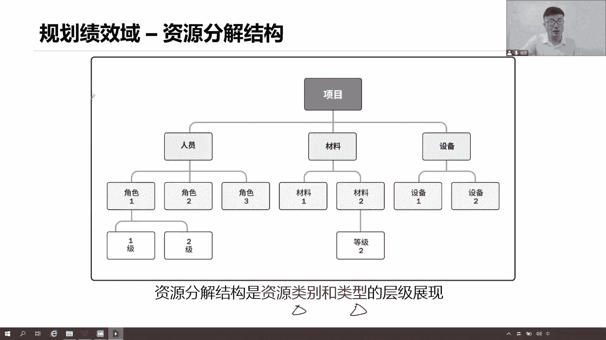
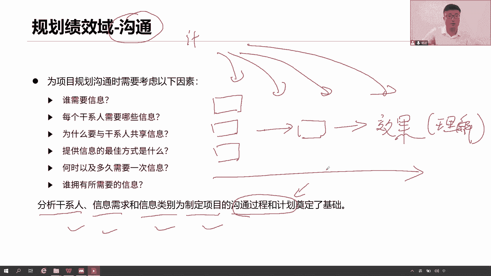
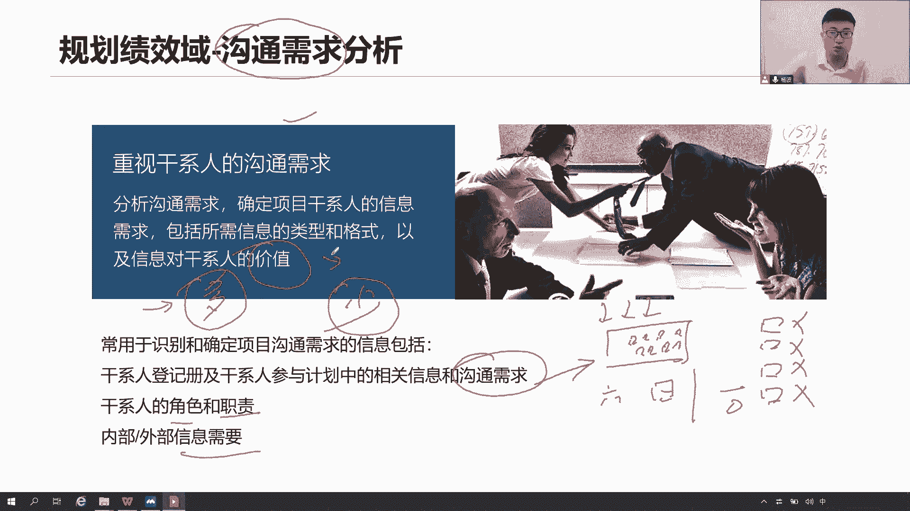
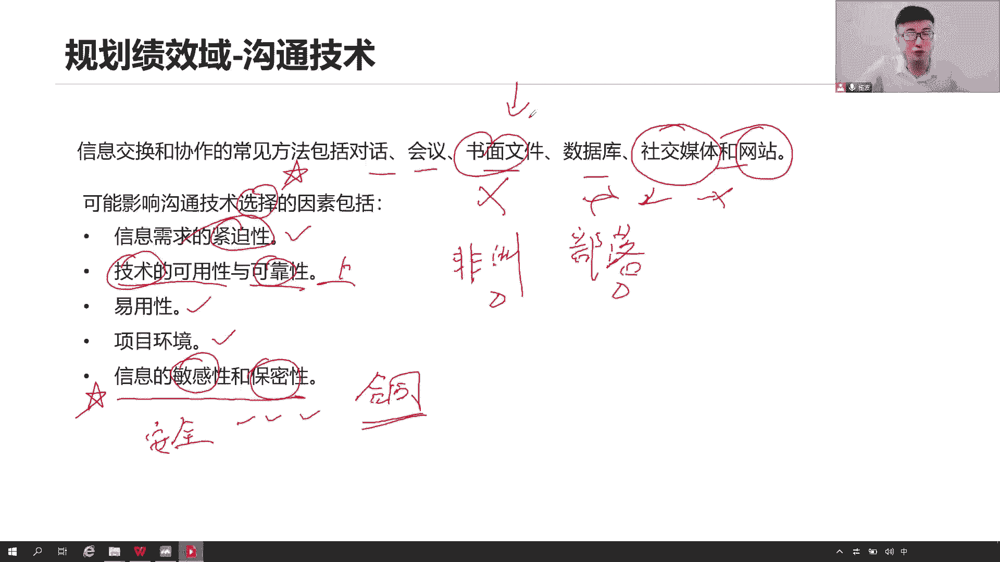
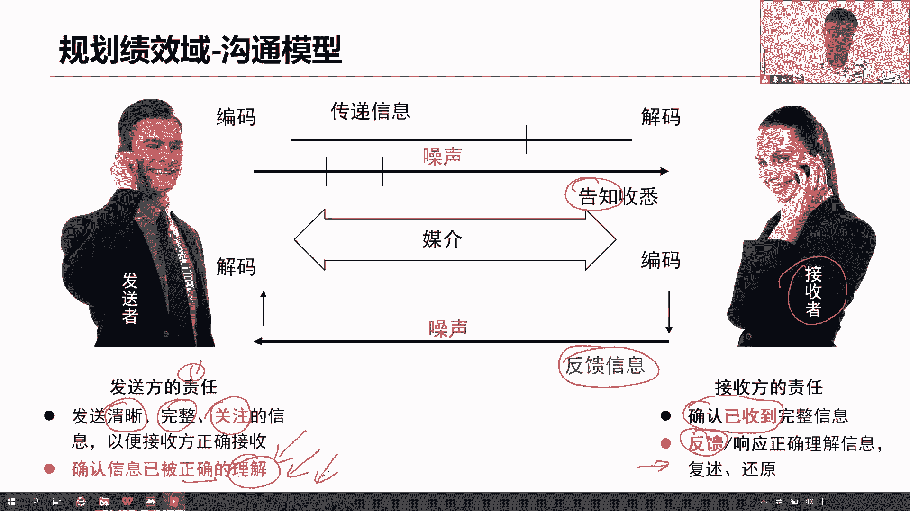
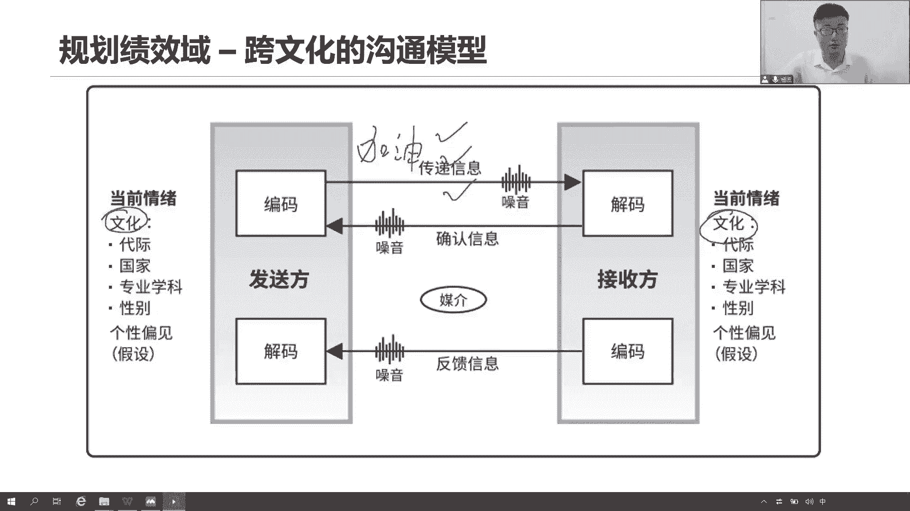
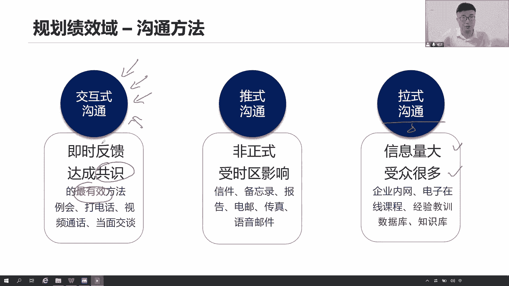
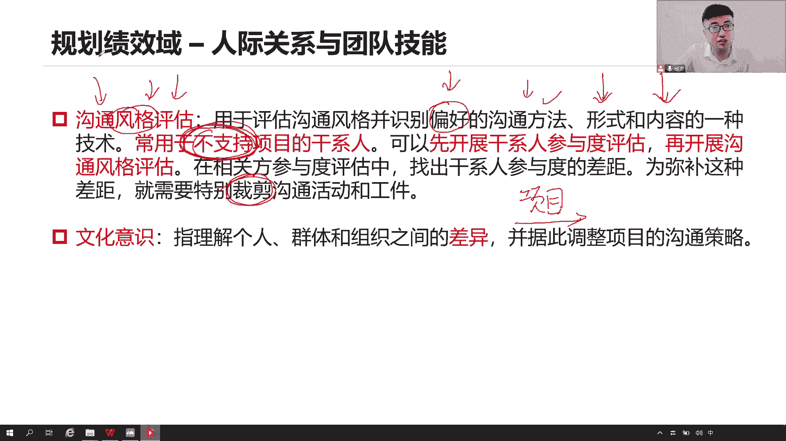
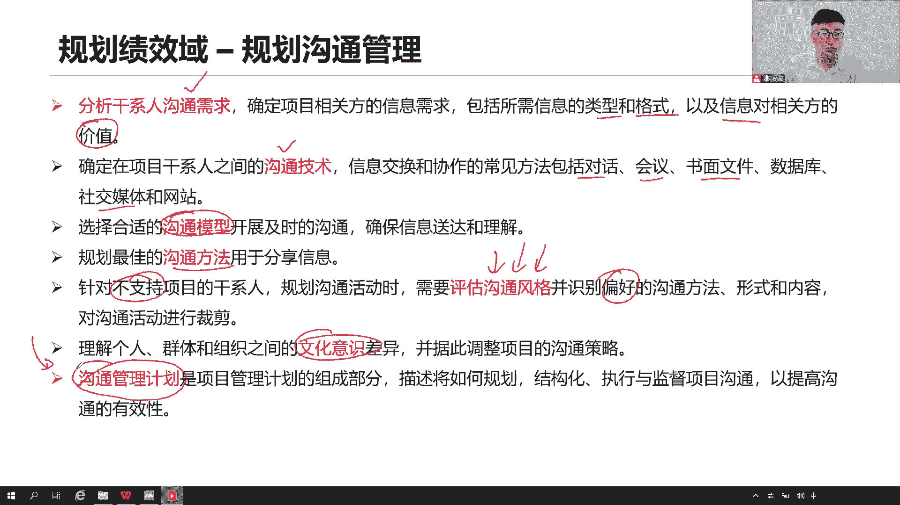
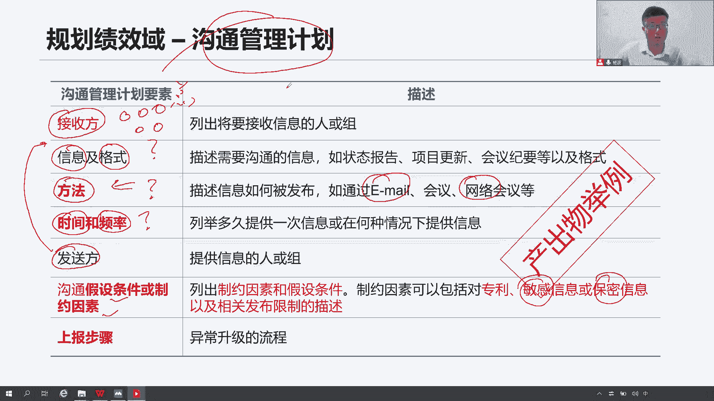

# 全新录制PMP项目管理零基础一次顺利拿到PMP证书 - P22：PMP精讲规划绩效域-沟通1 - 北京东方瑞通 - BV1qN4y1h7Ja

接下来我们来看关系和沟通唉，沟通也要做规划，为什么你要思考一个道理，思考的想法，你说我们每天早上开晨会，你要邀请哪些人参加，同学们，你们工作当中有没有周会啊，或者双周会或者周例会有没有这些贵啊。

一般来说都有是吧，那我想问你这些都会双周会例会，你要邀请哪些人来参加，邀请哪些领导来参加，我占了你们团建，你们只是把自己团队内部人员召集起来，就可以了吗，你们不希望领导加入进来吗。

你不觉得在这个酒桌上好办事情吗，这个团建要不要沟通，要沟通啊，沟通邀请哪些人来对啊，他会邀请哪些人呢，当前我们要做什么一些决策，当前我们要做一些变更的决策，这个决策是会又是邀请哪些领导来。

你得提前做好规划呀，不是你想怎么做就怎么做的，内部平时我们和团队一起沟通，这个煤场，包括但是一旦到了一些关键的利益相关方，你要跟他们传递信息，你是每天发微信给他们发，还是说每天你给他们发邮件。

还是说来我们就开个会，简单几句话说一说就可以了，还是说你给他写一封信诶，我不管他了，反正这是不是各种沟通方式在这里面啊，对吧，一样的嘛，那你到底选择哪一个是哪一个方式呢，你是早上九点钟给他们发早报。

还是每周五下午六点之前，就是五点钟给他们发周报，还是说半夜两点来领导，我们来聊一聊，可以啊，我不是说你有问题没有问题，这得看你怎么去规划这些信息，我如何去给你传递和沟通，到底谁要这些信息。

我给哪些领导传递信息，这些人他们想要我，他们很多时候会让我哎小杨，你给我发一个你们公司这个这个当前项目周报，给我发，发你们当前项目的进度报告，成本报告，工作绩效报告，总部报告，质量报告，风险报告。

我的妈呀，你要这么多的报告，我你要这些信息有用吗，我有时间做这些信息，做这些报告吗，需要哪些信息，这些信息对你来说有没有用，你为什么要这个信息呀，干嘛呀，我给你传递的方式，最好的方式是什么。

发微信还是发语音，还是打电话，还是下午刚刚下班的时间，六点来，我们开个会，可不可以都行，所以你觉得这个沟通了太多方式了，太多技巧，太多内容了，太多方法，所以我们要知道。

我们希望把这个正确的信息在正确的时间，通过正确的方式传递给正确的人，并且产生正确的效果，这是我的期望，这是我的目标，那我怎么可以在正确的时间，正确的内容把这个信息传递给正确的人，并且产生正确的效果。

能够让他理解呢，哎呀这个事情太麻烦了，所以我得规划规划已形成一个子计划，沟通管理计划，用这个计划来告诉我到底应该在什么时间和谁，用什么方式来开展什么沟通啊，就这个意思啊。

所以要规划好当前我们这个项目的沟通，怎么沟通，才能更有效分析我们的这些干系人，他们的信息需求，沟通要求，沟通类型，沟通的内容，为我们项目制定一个非常好的沟通管理计划，是非常有用的啊。

所以我们提前得分析好这些各项内容，以便于我们制定出一个有效的沟通管理计划。

咱们看首先看第一个沟通需求，就这些刚性人他们的沟通需求是什么，有的领导说，你给我发一个你们的项目周报就可以了，写一写你的进度和成本以及质量，已经完成了工作，尤其是整个甘特图WBS，请把它汇报在一起。

你看这是不是他给我提了他的沟通需求啊对吧，沟通需求，那我得按照他的需求来做，我们是吧，周报把它形成模板，未来发给我们，各位领导可以啊，但还是领导他会跟你说，你不要给我发太多，你只需要跟我说。

当前你们这个项目的进度是什么就可以了，其他我不关心，另外财务部门的领导说，财务经理他说你不要给我看什么进度，我只看你们这个项目用了多少钱，我只关心钱，就是每个人啊，他们都有很多的沟通需求。

我要让他们能够积极地参与到项目里面来，我就要跟他们传递他们所需要的信息，不是一股脑的把这些人划分到一个群组里面，然后呢我发邮件，我直接给你这个群主名发出去，所有这个群主群里面所有的领导主管经理。

全部收到我已答对的信息，有时候你很烦是什么，你说我们过了一个周六，过了一个周日，然后呢，周一我们来到上班，打开邮件一看，我的妈呀，几十封邮件未读邮件，当你看到这个几十通为主角讲你的心情是什么。

其实我很理解，然后呢你不得不花时间去看嘛，因为你并不知道你有，而且很多人很过分是吧，给你搞个标题吧，这种标题党更过分是吧，必看的三个重要信息哦，哟结果一看，其实根本就不是我想跟我关心的事情。

跟我没关系呀，这是哪个项目啊，谁在做这个事情啊，怎么一直在给我发这些无用的信息啊，他就是很烦，说明你根本没有了解对方的沟通需求，他想不想了解你的信息呀，想不想了解不想了解你干嘛给他发这么多呢。

所以你得提前分析到每一个干系人，他们的沟通需求，什么要确定啊，我们当前这个干系人他们的沟通需求是什么，了解他们的角色，了解他们的职责，了解他们的需要，那给他们发送有价值的内容，别发些无关的信息。

发出去没用，他们可能会觉得很讨厌吧，收这么多，甚至有的时候觉得哎你怎么这么少，这么久才给我发这么一点信息啊，能不能多发点你们项目上的各种成绩的信息，他觉得我发信息发少了，有的人说给他发的信息发多了。

哎呀不好调整，所以啊，每个人你都要去了解他们沟通需求是什么。

以传递正确的信息，沟通技术来看看，常见的方法有很多，比如说来我们一对一的对话聊一聊，我们可以开个会一起来聊，因为人多，我不可能一对一的沟通，那就看那一段时间了，我们就一起来开个会。

把这个事情说完就是就行了，还有一个方式我们不说，说不清楚，大伙明白，我给你写一封信，他不可以吗，我觉得也是可以的，比如说你中意我们办公室的哪个女生，你不好意思说可不可以写，可以啊，这也是一种沟通啊。

然后呢数据库以及他们社交媒体钉钉微信，大家有没有用过这个东西啊，还有还有这个东西，这些都是我们的社交软件是吧，微信钉钉可不可以用啊，就这些各种包括我们说很多企业里面，还有他们自己的一种及时沟通的软件。

就是我们自主研发的，因为可能会有些涉密信息嘛，所以我们公司自己研发一套设备，这个沟通的软件，信息传递的软件，我们在这个软件里面，平时开展我们日常的沟通啊，和我们企业里面的所有的员工一起来沟通互动。

通过软件，还有的网站网站也可以啊，网站的沟通，比如说有的时候我们打开这个网站，你有没有发现这个右下角他弹一个框出来，给你弹一堆广告出来，然后有个什么助手，他跟你说你有什么需求啊，联系我啊。

我的微信是多少啊，你加我呀，你加不加，一般我不加我就像那个什么去发信息就可以了，聊就行了啊，我想咨询这个课程，我想了解这个这个产品，我想问问这个服务，我想问这个产品多少钱问吧。

这就是我们说网站上面的沟通也可以的，就这么沟通方式真的很多很多，但是这些方式怎么去选择，这个选择显得尤为重要，我们考虑在考这个选择，你看说我们可能会考虑当前这个信息的紧迫性，这个信息也非常紧迫。

需要及时的传递，你发现隔壁发生火灾了，你说别着急，我给119写封信，那这个人有病，是不是啊，这么紧急的事情发生火灾了，你不应该是赶紧打电话吗，是不是还说写一封信有病，技术的可靠性或者技术的可靠性。

怎么去理解呢，我们比如说我们这个虚拟团队，我们这个虚拟团队啊，有个有些非洲朋友啊，我们有非洲的友人，大家知道这个非洲有些部落里面，有些部落里面他其实很落后，没有网络，然后你跟他们说，兄弟们。

我们今天晚上一起来云聚餐啊，云团建大家上线哦，你让别人怎么玩，技术不可行啊，技术达不到啊，没有这个网络啊，我们上不了线是吧，我们只能干瞪眼，就这个意思，你能不能用易用性项目的环境，大家是在一起的。

还是什么分布式团队的，尤其是大家注意这个地方很重要，这也是我们经常考的题，但是现在我们越来越多了，会考什么呢，我们的一些安全项目，这个项目他会跟你说是这个安全项目，一个政府的项目。

它具有一些非常敏感的信息，一些保密的信息在这里面，那就意味着当前啊，这些信息我们能不能通过刚刚说的是什么微信，钉钉陌陌去传，能不能通过互联网去传，能不能通过邮件去传，能不能放在什么百度网盘，能不能放。

显然不可能啊，像这种方式，你觉得这些沟通方式可行吗，绝对不可以对吧，那你只能够通过线下的方式把这个信息，你出差拿过去，或者你说加密是吧，数字认证数字证书啊，这都可以都可以，但是前提是你要看清楚啊。

这些场景里面，他是不是要求我们这个信息是非常色，如果是涉密信息，一般来说我们会说按照合同的要求来传递啊，这是可以的，或者说尽可能用些什么线下的方式写下来也行，都可以，但是不能什么。

在公共的网络上就传出一些涉密保密信息，这个绝对不能学，很明显违反了什么安全的原则。

去安全的时候应该很清楚，那么看沟通规划，这样沟通模型，沟通还有模型吗，那这就是个模型啊，你看发送者和接收者之间怎么传递信息，一个最简单的方式，最简单的方式就是，我发送者把这个信息做了一个编码处理。

转化成我的语言传递给你就完事了，那这复杂点呢，你接受者你收到这个信息之后，你得告诉我，当天你收到了，如果再复杂一点，你还得给我一个反馈，你给我的反馈是让我去怎么确保你有没有理解，你得给我复述一遍。

你得把我的话做到官员，我这个发送者要确认，你这个接收者有没有理解我的信息，所以在这个沟通模型里面，我去看当前发送者的结责任是什么，首先我要确保当前我发送的是一个清晰的，完整的。

并且是你所关注的一些信息接受者，你所关注的信息我得发给你，以便于你能够正确的接收这个信息，那么当我接收到这个信息，我得先确认一下好，我收到了感谢你的发送，我已经收到邮件了，那你光说你收到就可以了吧。

还不行啊，我的还有另外一个则是什么，我要确保你这个信息被正确的理解，如果你不给我反馈，我怎么知道你有没有理解，所以接受者你赶紧给我一个反馈，说哎老师你看你说的是不是这个意思，123描述一下，复述一下。

还原一下，让我知道哎这位同学你确实理解了，你学的很不错，这个知识点你已经掌握了，就这意思啊。

这次的沟通模型在这里面，那除此之外，大家注意在这个沟通模型的复杂基础之上啊，我们说发送确认，并且给我反馈，这个都好说，还有一个点，这是考试的核心，且重点我们一定要考虑啊，这个双方之间的文化差异。

文化差异很重要，尤其是现在很多跨国团队，多元文化的团队很多，很多一个大型复杂项目，我们来自于不同国家，我们的文化信仰背景，教育环境，个性都是不一样的，可能有的人具有什么一些性别歧视。

一些宗教歧视都有了是吧，文化其实也有，所以我们说一直以来在告诉我们，团队要尊重别人，我们打造的团队文化就是尊重别人，这是什么尊重别人的文化呀，我们在沟通的时候啊，我给你比一个拳头，不是我要打你。

不是我要揍你，加油，你最棒，我相信你是最好的，我相信你是最胖的，我给你加油助威，不是为了揍你，不这意思，你理解错了，这叫啥，这就是文化差异，他觉得我要打他要揍他，我哪里是揍你吗，我干嘛揍你啊。

不是让你加油，这个事情对我们校长来说很重要，你要努力哦，要要加油哦，要帮帮的哟，就这意思，哪里会想揍你。

来看沟通方法，三个沟通方法很重要，第一个交互式的沟通，交互式的沟通啥意思呢，他说是我们达成共识最有效的方法，比如说开个会打个电话，来一个视频，当面沟通，一对一的沟通，面对面的沟通，这就是交互式工。

我们经过多次频繁的信息传递和沟通和反馈，这就是交互式工来一回的确认，以便于我们达成公式，所以为什么我们前面讲了这个冲突管理啊，合作是最有效的方式了，因为在这个合作的过程中，我们就是用交互式工。

以便于我们达成共识，就尽可能的把这个话说开了，我们尽可能把自己充分的表达出来，你再说我在积极的聆听，听完之后我来表述我的意见，你又在积极聆听，就这么反复多次交互式的互动沟通交流。

才能够促进我们达成共识啊，第二种推辞沟通，退退给你就完事了，给你发个信件，发个备忘录，发个报告，发个邮件，发个传真，发个语音，你有没有理解，我是真不知道，我只负责把这个信息推给你就可以了啊。

对你你有没有理解，我还真不知道，所以他就不太容易去达成一个共识，那为什么我们要退市沟通呢，因为有一种场景还真得用推式沟通，什么场景，这个时区域太大了，你说我们怎么去建立视频会议去聊天啊，我们在白天上班。

你们在睡觉，我说兄弟来起来，我们开个会，你这个就有点过分了，对不对，时区相差比较大，这个时候我们只能通过，以邮件的方式来传递信息，而这是一个特殊场景来了解第三种的拉丝沟通，信息量一大堆。

好多好多人我怎么发，我不可能说把几十个G，几十个G，上百个G甚至一个T的文件，我要通过邮件发给你，我的天光是这个带宽我都搞不定是吧，而且还是几百号人，大家不在一起，我怎么发，所以我怎么做呢，来大家。

我把这个信息啊放在一个百度网盘，共享网盘，在线数据库，在线知识库，在线经验教训，各种库，各种库，各种网盘，你们需要自己来取，你们需要自己来拉取，要什么信息自己去取，要看什么视频。

自己在网上去下去看就可以了，就这意思啊，你看我们的课程是不是就这样，我们的课程，把它放在我们这个在线在线课堂上面去，大家去看，随时去回顾都可以看，这就是拉丝沟通，因为我没办法把全部给你们发送过来。

我怎么发发不过来，你们自己取吧，需要就取自拉丝过程，它的场景就是信息量比较大，容量比较大，然后呢又是一堆人，因为这些人还不在一起，所以我们就有拉丝沟通当然是最好的方式，推荐的方式，工作当中。

我们鼓励大家用交互式的，面对面的一种沟通方式，是最好的最有效的一种沟通方式，因为它能够帮助我们达成共识，有了共识。

共同的目标，共同的价值观，才有利于我们团队进一步的开展工作啊，那么在规划我们团在规划这个沟通的时候，还要考虑一个点，那这就说到人际关系了，刚刚说的文化肯定是大家记住，文化一定是重中之重啊，大家记住。

能够看到文化，你首先想到的是什么，沟通在开展沟通的时候，要考虑我们文化之间的差异，这个我们就先讲到这，记住很重要，另外一个点就是它了，沟通风格评估说当前因为有些干系人，他们并不是对我们很友好，不友好。

意味着他并不支持这个项目，说这个项目不行啊，没有绩效，绩效不好啊，不产生价值啊，不做了吧，就这些人反对势力，那你说这些反对势力，我们要不要和他们开展沟通呢，肯定呀，而且你还可以积极的去沟通。

有些领导比较关键，但是他现在对你持反对意见不支持，所以我们要沟通，但是这个沟通怎么沟通呢，你不能说还是按照以前的方式说，早上开个早会，中午发行什么邮件，下午发个支付周报日报就完事了。

还是按照日常的沟通方式来做吗，那他只会越来越反对，他要的并不是你的信息，所以你要对这些沟通做一个裁剪，这样了解了解你喜欢什么样的沟通方法，沟通形式，沟通内容，我先投其所好，你是喜欢我们在一起开会。

面对面沟通，还说你平时喜欢微信，还是说你喜欢给我打电话都可以，我先了解了解你的沟通方法，交互式的还是推迟的发油进行推市是吧，打电话就是交互式，开会也是交互式，那沟通的形式吧。

我们是面对面沟通还是书面沟通，还是说通过这种软件的方式来沟通，你喜欢聊什么内容啊，我得先评估一下，先了解了解，那有的领导他喜欢聊天气，聊体育，聊八卦，聊人生，我们就先聊这些内容，先把咱们的话题打开来。

领导最近就你这个足球赛看到没有，最近篮球赛看了没有啊，最近这个游戏还有有的领导喜欢游戏吧，最近这个荣耀集结啦，聊聊嘛，先把这些话题打开，聊完之后，他觉得诶不错啊，我们喜欢聊这些，我们可以聊的越来越好。

之后再慢慢的切入到项目里面，那领导你看关于目前咱们这个项目啊，其实还有一些问题需要给你传递出来，沟通沟通，也同时想了解你的一些想法和看法，你看这不就很自然的，过渡到我们的项目过程了吗，是不是。

所以啊咱们这个沟通的风格要做一些评估，尤其是针对这些不支持我的项目的人，我得先对他们做一个什么，了解你们的偏好，投其所好，然后呢我才能开展后续的沟通，所以沟通风格评估。

本身是一个非常核心且重要的人际关系技能。

是不是要体现我们的情商啊对吧，注意规划沟通，现在要形成我们的沟通管理计划，要想形成它，前面我们做了一大堆的铺垫，包括第一个分析沟通需求，以确认你想了解的各种类型的格式的，以及这个信息对你来说是否有价值。

然后呢，确定我们沟通技术，是我们打电话开会还是书面还是什么软件方式，然后再确定一下当前我们的沟通模型，我们是做一次简单的微型传信息就可以了，还是你要给我一个互动，给我一个反馈，以及我们要考虑什么。

双方之间的文化差异，这是一种模型，选择最合适的模型，用最合适的方法是交互式，交互式肯定是最好的方法，然后呢如果你对我不支持，我还要不仅要加50，我还要干嘛，先给你了解你所喜欢的偏好的方式。

基于这一系列内容，沟通需求，沟通技术，沟通模型，沟通方法，沟通风格，沟通文化全部考虑到一起，然后呢，我们再充分的定义一个完整的，有效的沟通管理计划，告诉我们应该如何传递信息。

并且使之有效，你看这就是一个沟通管理计划，举个例子来说，我是一个发送方，我要给你，谁是接收方，王总，什么总，我不管你是什么种，反正这种我会给你们发信息，我在什么时间给你发呢。

是每天发一周发还是双周发一次，我是用什么样的方法给你呢，微信钉钉邮件还是网络会议，视频电话，这个信息的内容是什么，来格式是什么，都得确认一下，开会一样的道理啊，开什么会呀，你说清楚么，会议吗。

不就是方法吗，这怎么会在什么时间在哪里开始会议，给你传递什么信息，各位主管，各位经理，各位总，请大家及时的按时间来参加这个例会，是不是沟通管理计划里面，就是描述的内容和谁用什么。

在什么时间用什么方法传递什么内容，我要确保你能够理解，我要确保你能够接收到这个信息，除此之外还要考虑到什么，一些关于沟通的假设条件和资源，就是有些信息有的时候我们要考虑，你看这说话涉密信息。

保密信息是不是受限制啊，就要考虑了这些内容我怎么传递给你，不能够通过像这种方式传递啊，这种方式怎么可能会传递生命信息呢，不可能，这对我的沟通是否限制，我要想想如何来传递，还有上报上报也是一种沟通。

就有的事情，我搞不定，超出了我的权利范围之外，我要去上报，找我了，我怎么上报团队成员，你们搞不定，找我上报给我项目经理，我项目经理搞不定，我就找我的发起人，职能经理PO，我找你们帮忙。

这个上报的流程写清楚，怎么上报，不要越级上报哦，这个东西可不太好啊，我们不推荐越级上报，就直接上报给你的主管说清楚，有问题沟通没有沟通解决不了的问题，如果有，那就是你的沟通管理计划有问题。

记住没有沟通解决不了的问题，如果有更新你的计划。

