# 全新录制PMP项目管理零基础一次顺利拿到PMP证书 - P25：PMP精讲规划绩效域-风险 - 北京东方瑞通 - BV1qN4y1h7Ja

好接下来我们来看看关于这个风险的规划，在风险控制一直以来都是我们项目管理，贯穿整个项目的生命周期的一个重要工作，在做这个工作之前，我们先要做好关于风险管理的一系列规划，就基于当前我们项目早期。

我们所识别的一些风险，我们怎么去规划，怎么去管理项目，风险管理的目的在于提高正面的风险概率和，或者说是影响正面风险，我们要提高这个正面的风险，我们把它理解为就是一个机会，希望能够把握住这个机会。

让它发生的概率增加，或者提高它产生的影响，降低负面的风险，我们把它认为是威胁这些威胁，尽可能的减轻它的概率，或者说产它的影响，我们做减轻，从而提高项目成功的一个可能性，在这里面好。

每个项目我们都在两个层面存在着风险，一个是对这个项目产生影响的单个风险，另外一个呢是项目的整体风险，这个整体的风险是指当前有一些单个风险，不确定的各种风险，导致了我们当前项目的工期。

或者说项目整体的预算受到影响了，那么有哪些风险，我们要把这些风险给变了，对这个项目整体的影响，这个影响的量化，我们要把它确定下来，在敏捷或者适应性的环境当中，通过跨职能项目团队和已经审查。

增量式的工作产品来加快知识分享，以确保对风险的认知，意味着在适应性敏捷的项目里面，我们要经常的去做一些检查，经常审查我们大家这个最小的可运营产品，也就意味着我们要有规律的去做这个审查，审查目的是干嘛。

其实是要做一个什么识别风险，对风险的认知怎么做个加强对风险认知管理，所以我们说在敏捷里面，我们为什么强调小批量交付呢，一方面我们前面说的对质量管理，他需要去定期的去审查，尽早的发现问题，尽早解决问题。

提高质量，还有一个呢真正战胜这个小批量的产品，我们进行审查，另一方面是为了识别风险，尽早的识别风险，对这个风险进行一个管理，所以这么敏捷，强调小批量交付，所以当前啊咱们这个风险啊。

它的管理实现有这样一个认知，提高正面的降低负面的概率和影响，这个风险它有单个风险以及项目整体的风险，那么这个整体风险，主要是在项目整体的工期和预算这个角度来，说说当前这些小的风险。

单位风险对于项目整体的工期和影响，这个预算的影响到底有多大，我要做个整体的量化，所以我们要考虑单个风险，也要考虑项目整体的风险。

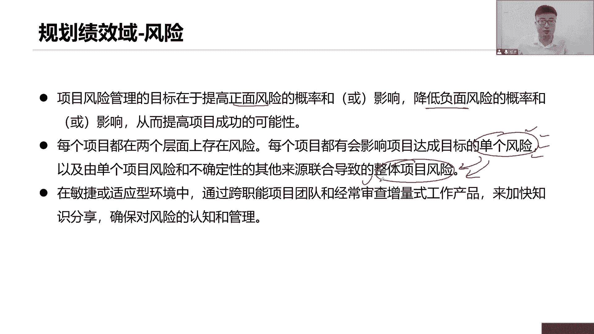

它的影响好，而关于这个风险的管理啊，首先要确定它的风险临界值怎么确定呢，作为一个风险观点来说，首先一个组织它的风险偏好是什么，就取决于当前后，这个组织里面的一些关键干性能，他们的风险偏好。

所以我们在做肝性能管理的时候，为什么要去识别当前的干性能的需求和期望呢，这个需求和期望就包括了，当前他们对风险的需求和期望，我们有了干系，他们对风险比较激进，他们喜欢追求风险，高风险。

因为高风险带来高收益，而有的干系呢有的领导他们比较保守，不愿意追求这样的风险，我们追求的是低风险，低利低收益，所以每一个人他的风险偏好是不一样的，那就意味着当前我们整个组织要去分析了。

我们这些关键干系的，他们的风险偏好是什么，但是不管你怎么说，这个激进的保守的中立的都是过于主观，那太过于主观的风险偏好，太过于主观的风险的需求，不利于我们去开展工作。

我们要把主观逐步的转化成客观的可量化，将你们的风险偏好转化成风险的承受力，个人的承受力，个人的风险承受程度，数量容量，那你看这是不是就是在不断的转化成，可衡量的目标变化对吧。

那么这个程度程度怎么样来体现这个程度呢，这个程度我们把它转化成临界值，在什么样的一个区间之内，我们可以接受这个风险，允许它发生在什么样的一个区间之内，我们不可以接受诶。

这不就和我们前面讲的控制临界值有点相似吗，没错这个临界值来自于风险临界值，基于当前我们组织的风险偏好，而转化成风险临界值，将这个风险临界值，再把它转化到我们后续的进度管理和成本管理，这两个计划里面。

把它变成控制临界值，而在延期多少时间范围之内，或者说在超支多少范围之内，我们可以接受，超过之后我们就不可以接受，那现在我们是把主观的风险偏好，转化成了客观的临界值了，那么基于这个客观临界值。

这个边界值我找到了，那么未来我就可以针对这个边界值。

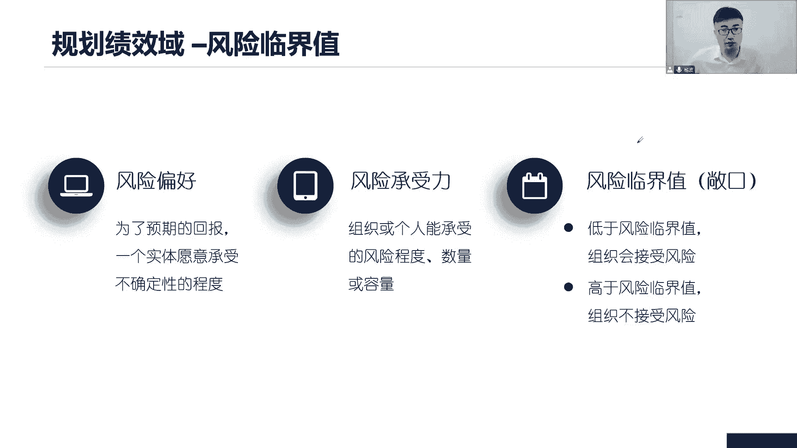

来做后续的一个风险的定义了，你看风险的概率和影响定义就出来了，既然你知道了当年我们哪个边界能接受，哪些不能接受，那么不能接受意味着它的风险等级会比较高，如果能接受呢，它的风险等级会比较低。

所以我们要对我们的风险做一个分级，怎么分级，在什么样的概率之内，在什么样的影响之内，当前它的风险优先级会比较高，我们不能接受，那就划分，因为很多时候我们说肝系呢，他们就这个风险偏好。

他们的理解是不一样的，我们要杜绝这个问题，我们要引导大家达成一致，说当前我们认识这个高风险，那么这个高我们得用概率和影响来描述，大于70%的概率，我们认为就比较高了，或者说当前它产生的影响。

对时间的影响，对成本的影响，对质量的影响，这些影响我们就要把它转化成一个范围，一个区间来衡量，当前你这个高这个很高到了什么级别，那么未来我们当前在评估每一个风险的，概率和影响时，就看了。

我们今天拿出这个定义，拿出这个标准来衡量，当前我们每一个风险的概率和影响，以此来决定当前它是一个高风险，中风险还是低风险，所以取决于当前的临界值，根据临界值来确定，当前的每一个风险的分级的边界。

那么基于当前这个风险的概率和影响。

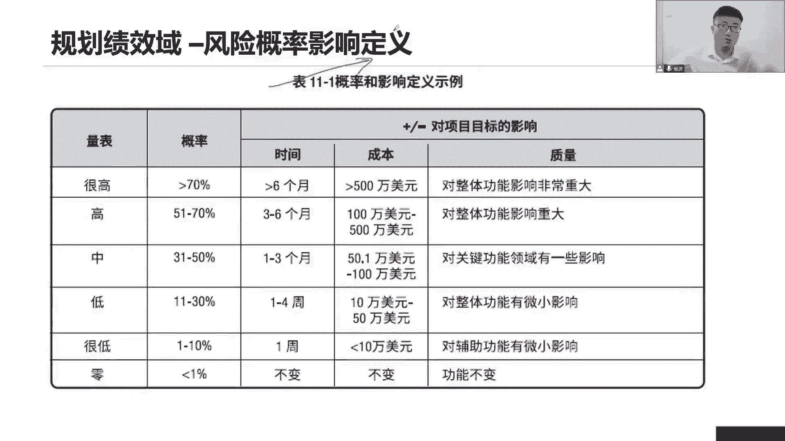

定义之后，这些定义啊，我们要把它转化成下一步举证，拿出当前我们的分子级，这里是五个级别好，这里是五个级别，针对我们的概率和我们的影响，不管是机会的还是威胁的，我们都考虑，然后呢把这五个级别拿出来。

这五个级别的定义，横坐标和纵坐标都有了，横向纵向都有了，那它就会形成一个矩阵，那么中间这个值是怎么来的呢，你会发现就是我们的概率和影响，两两相乘变量相乘得到这个分子，这个分子就是我们说了概率影响分值。

这个分值就显得特别重要，因为这个分值用来帮助我们去判断，当前这个风险的优先级别，优先级别，未来也会拿着这个矩阵，来对我们的风险做排序的，那么你看现在这个矩阵得出来之后，中间就什么层级。

那么我们就知道在什么样的范围边界之内，它是一个高级别，什么边界之内，我是一个中级别，什么边界是一个低级别的风险以后啊，我们在识别出每一个风险的时候，我们会找专家评估，当前每一个风险的概率和影响。

然后呢他们两个值相乘得到这个分子，这个分值我会带入到这个矩阵里面去，看它当前在哪个区间之内，是在当前这个区间还是这个区间，还是这个区间，那就可以判断出当前他们优先级了，如果大家都在这个区间之内。

那我们来看你的分值更大，它的优先级就更高，优先级更高，是不是应该放在更上面一层，我们要优先处理它的概率这么高，影响这么高，你不优先处理吗，难道等以后到发布的时候再去应对，那就太晚了。

所以我说未来我们去排序。

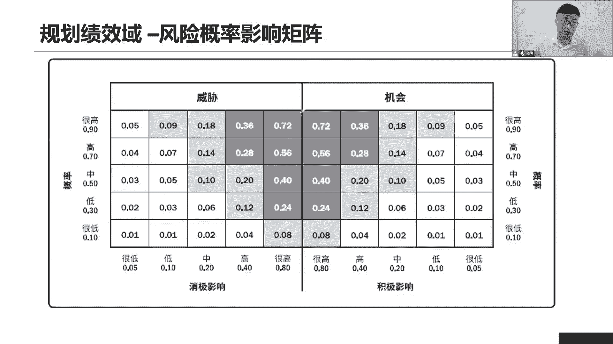

就要用到我们的概率影响矩阵，接下来又来了一个我们的风险分解结构，那这个风险分解结构啊，和我们前面那个资源分解结构它都叫RBS，只不过这个R现在变成了风险了，好这个风险分解结构它怎么分几分。

把当前项目风险的来源我们做一个分类，做可能来自于技术类的，管理类的，商业类的外部类的市场吗，但是举个例子哦，那么技术又分为哪些比较详细的啊，当时有各种技术技术技术管理呢，各种管理管理管理商业。

那包括我的合同，供应商，分包客户，这些市场呢外部的法律法规与外部的天气，外部的市场竞争，这都是老外的风险，所以其实就是把我们当前风险的来源，做了一个大类的划分，然后再基于这个大类下面去划分更多的此类。

目的是干嘛，便于我们接下来要做一个事情，识别风险，我们会拿到这些细分的领域来帮助我们，去提醒我们，当前会有哪些领域，哪些层面，哪些维度的风险需要我们去考虑，我们要逐步的去识别到它。

所以是便于我们去识别风险，所以我们现在要对当前风险来源，做一个结构化的分解好。

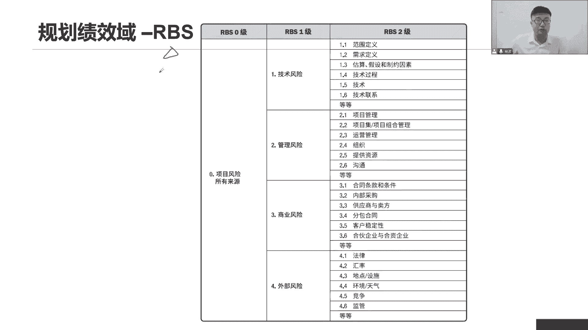

这是我们的风险分解结构，所以基于当前我们说所规划出来的，当然风险偏好，风险的临界值，风险的概率影响，定义风险的概率，影响的矩阵，风险的分类RBS，那这些内容我们都已经规划好了。

我们就可以把它形成的风险管理计划，首先告诉我们如何做事，那如何去开展我们的风险管理，以及当前管理这个风险，他有哪些角色和职责，哪些是风险组长，也是风险经理，哪些是风险小组的成员。

每个人的角色和职责说清楚，以及前面我们是规划的一系列内容，加上这个风险的安排在什么时间开展风险，我们会投入多少资金应对这些风险，风险的报告格式，内容频率，风险怎么去偏重，如何跟踪这一系列内容。

都会形成我们的风险管理计划，所以你会发现我们这个风险管理计划，里面有具体的风险吗，没有对吧，如何管谁去管我们的风险来源，怎么去分类，来当前组织的偏好和临界值，以及当前我们提前定义好一个矩阵。

这个矩阵用来排序怎么安排啊，风险报告的格式和内容有哪些风险，怎么去跟踪，没有说具体的风险，所以风险管理计划也只是一个指导性文件。

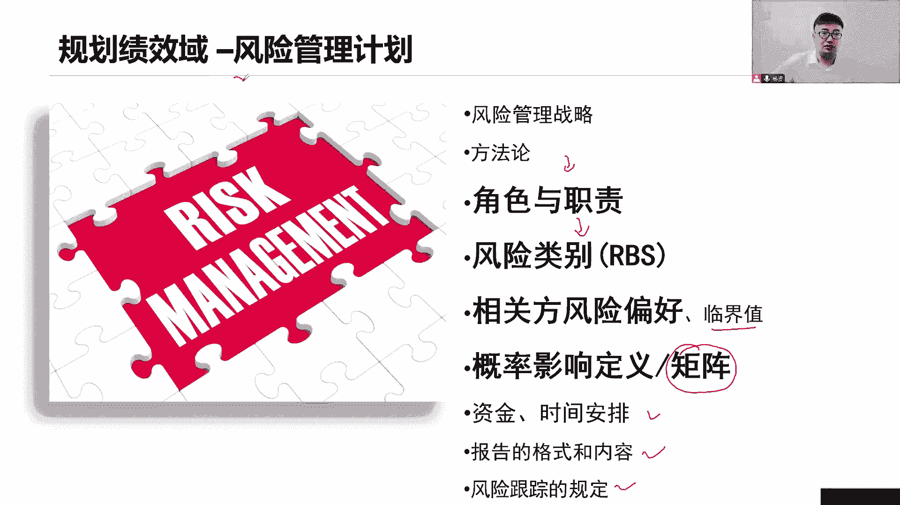

在这里，接下来我们开始做识别风险，有了计划之后，我们就按照计划先告诉我怎么去识别风险，在识别风险的时候，我们现在知道有三个分类，哪三个分类呢，第一个是已知已知风险，就是当前第一个我已经识别到了。

并且呢我能够主动的去管理好这些贡献，就基于当前的项目成本，我们可以有条件去规避这个风险，减轻单或者转单或者提高风险或者风险风险，那么这后面是机会，这前面是威胁，对这种威胁。

我们要尽可能规避减轻或者转移给别人，那如果是机会呢，提高他分享，他后面会讲，拜托他都可以，那怎么去应对呢，我们就要规划好的应对措施啊，在我们当前识别到这个风险之后，我们要对风险做排序。

然后规划好风险应对好，这是一个已知已知风险，那如果是已知未知风险呢，第一个已知还是已视频，第二个就变成未知了，我一直就是我也不知道怎么去管理它，我们只能接受它发生啊，就是我没有办法去主动去规避它。

减轻它，转移它也没办法去提高它，分享它，那我就让它发生吧，当它发生的时候，我至少我可以提前准备好一些时间，资金去应对它，我还能够办法主动接受这个风险，就让他发生，就这样的风险发生，发生的时候呢。

我接受你的发展，只不过我这个接受我会提前，因为我已经识别到了，我就会提前准备好一些时间，准备好一些资金以识别风险，然后制定出一个行动方案，一个应急计划，当你发射的时候，我可以积极的主动的来应对你。

不管是机会还是威胁，我总是可以有办法，想尽办法来应对当前的风险发生，这是我们已知未知风险，所以他动用的是什么应急储备，应急储备相近，因为是以示标已失标，我就可以自己去做调整处理，那如果是未知风险呢。

我都不知道会有这个风险意外，那就是被动离职，当它发生了就是发生，因为你并不知道当前这个风险会在，你没办法主动应对它，你只能被动去接受它，那么被动接受我们怎么做呢，权宜之计该怎么做就怎么做。

他就叫做权变措施，就这个行动方案，这个措施他叫权权变措施，全权宜之计，他怎么处理，他怎么变化，我们就怎么去应对，动用的是什么管理储备，大家强调当前未知风险，它一旦发生，我们动用的是找我们的高层。

找我们主管去审批，以获得我们额外的资金，和这个什么时间来应对当前这个位置的风险啊，这是我当前风险的三类，在这里面，那么识别风险，怎么去识别风险呢，我们可不可以当前结合着RBS。

刚刚看到那个RBS最右侧的这一部分，明细的内容来帮助我们去识别风险，当然可以了，识别风险是识别单项风险以及项目整体的风险，感觉就是有哪些风险，会影响我下的工期或者进度，并记录到这些工具的特征。

而我们鼓励大家全员参与，反复识别，定期识别，为什么这么做，要知道风险它贯穿整个项目生命周期，不是说当前我在规划风险，我当前先识别出来有哪些风险就完事了，以后就没有风险了，不是的，降噪机理。

做规划可以在这个规划过程，我们也能够识别到一些风险，但是随着项目的开展，随着项目的执行，是不是会有一些新的风险产生啊，即便当前我们采取一些应对措施，去应对这个风险，那你这个应对措施会不会产生新的风险。

也有可能，所以识别风险是贯穿整个项目生命周期，我们在不断的定期的反复的去持续识别风险，识别风险，相信你不是你一个人去识别，你要召集当前的全员各方的干系人，让我们一起来开会，风险研讨会通过什么呢。

可以是头脑风暴，大家一起来听，提出自己的想法，也可以是一对一的沟通和访谈，还有呢，我们可不可以用这个核对单，来帮助我们去收集和识别风险，诶这个合同怎么去理解呢。

合并单把它理解为什么我们的check list，检查清单，这个检查清单，那至少你是一个清单，这个清单里面会罗列各项，那么我们举个例子来说，比如说我们当时买了一台笔记本电脑回来，从京东上面买一台笔记本。

这个笔记本呢我们收到之后，我们打开货物一看，里面是不是应该有清单，现在里面会写第一个笔记本有没有，你确认一下第二个充电线有没有，你确认一下第三个鼠标有没有，你确认一下第四个保修卡有没有。

你确认一下第五个使用说明书有没有，确认一下，逐项确认已打勾，这就是一个检查清单，那我们现在去识别风险也是这样，之前我们识别到有哪些风险，你罗列下来，我们在当前这个项目里面去查看，有没有这些足够的风险。

如果有，你就确认打勾，这代表着你当前已经识别到这些风险了，那如果有些风险你可能不涉及，那你不管他就不涉及，我们要注意哦，这个核对单它是来自于我们的组织过程资产的，并不是我们重新写的。

并不是用来记录当前我们所识别到的风险，我们这个合同人来自于以往过往项目，曾经识别到的风险，我们把它写在合同单里面，以便于告诉我们，当前我们这个项目应该参考借鉴，曾经我们识别出来的风险。

以便于我们更加全面的去识别风险，所以这个核弹显得非常重要，他就是来帮助我们去收集，当前一些诗歌上的风险，有哪些风险，我们一起来识别，通过头脑风暴，通过访谈一对一的沟通，也可以通过我们的文件核对。

带来帮助我们去识别风险，同时呢可以结合到哪些呢，还有哪些分析工具呢，包括sword分析这个word文件，啥意思啊，就是当前我们在考虑，我们这个企业的优势和劣势，以及我们市场的机会和威胁。

我们来充分的去衡量我们的机会能不能把握住，这个，把我们的优势可不可以把握住机会，我们的优势能不能够避免这些威胁，我们的劣势会不会影响我们对机会的把握，我们的劣势会不会放大威胁，就两两相结合来看。

当前我们能够识别出哪些风险，这就是sword分析文件分析，字面意思，就看前期我们各项工作计划文件里面，有没有写着不确定的比较模糊的地方，这些不确定都是风险，看文件，那么最后呢。

我们引导各方干系人对这个风险达成一致，就是识别风险，他认为是风险，我们认为不是风险达成一致，不要对风险产生偏见，消除偏见，最后达成一致，当我们把这些达成之后所识别到的风险，我们要把它记录下来。

记录在哪里呢，这些单一的风险我们把它记录在风险登记册，大家记住这个名字，风险登记册，这是一个非常核心且重要的文件，它就是来帮助我们去记录项目里面，已经识别到了已识别的单个风险。

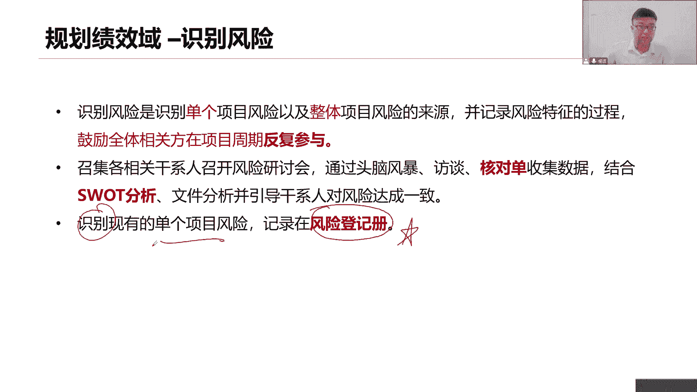

全部记录在风险本身，那么风险政策它就描述了，当前我们已经识别到了一系列的风险，风险清单罗列进去啊，一个人把它写进去，还有呢，我们会有一个潜在的应对清单，和一个潜在的风险责任人。

就是为了这个风险到底由谁来做负责，你要知道任何一项工作都应该有一个责任人，即便是风险也是一样，因为这个风险你现在去应对它，那么到底是谁来去应对呢，用什么样的措施，用什么解决方案去应对呢，现在还并不知道。

因为我们还没有对风险做评估，也没有对风险做规划应对，根本就不清楚，所以我们只能显示一个潜在潜在，那就意味着后面随着项目的开展，我们会把这个潜在变成确认，什么时候变成确认了。

他说随后我们会将由在规划风险应对这个过程，把这个潜在变成确认，而我们责任人呢说，在随后的风险定性分析这个过程，把这个潜在变成确认人，我定下来了，而且具体的主应对措施我也会确定下来。

那么未来由这个人按照这个措施去应对，这个风险就可以了，尽可能的解决掉当前这个风险，这是一种风险对策，首先我们先创建风险对策，先把这些风险罗列下来。

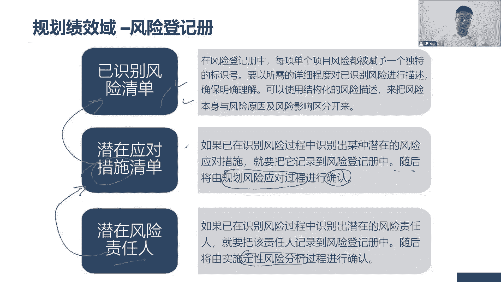

并且写几个潜在的人和潜在的措施，那么接下来我们是不是要开展我们的定性，风险分析啊，对我们的风险做一个评估，评估呢分两种情况，一个是定性风险分析，一个是定量风险分析，那么我们说这个定性风险分析。

就是指评估当前单个风险发生的概率，以及它的影响，还有他的其他特征做一个平衡，对风险进行优先级排序，重点关注高低级的风险，看清楚哦，我们重点关注的是高优先级的风险，高优先级的风险我们会指定专人。

所以为什么在定性风险，把潜在的责任人变成确定的责任，因为我们在指定专人处理，因为这个风险很高，我们需要一些专门的有经验的经验丰富的人，由他们去处理，而对于我们第一优先级的风险呢，我们把它列入到观察清单。

以便于定期去监控就可以了，放在这，放在我们的观察清单里面，这个观察之间不是一个单独的文件，它就是在我们的风险登记册里面，只不过我们可以罗列了某一列，把它作为一个观察形态，一旦观察带兵器的去监控。

那么高星级肯定要优先处理，因为我们要重点关注，优先处理，很难记住啊，再次强调啊，高风险高风险一定是优先处理，不管是传统项目还是敏捷项目，所有高风险一定是优先处理，那么这个定性风险他怎么去评估呢。

分三步来着，所以第一步我们先评估每一个单个风险的，单个风险的概率和影响，评估风险的概率和影响，谁来评估，可不可以，团队成员可以，项目经理也可以，第三方专家都可以，谁都可以来，谁最熟悉这个风险管理。

就是谁来评审，评估当前我们的风险发生的概率和影响，说明天可能会有80%的概率下雨，对我们进度产生延误，一天对我们成本产生造成那个什么超值，1万块钱可以啊，这就是风险，明天有80%的概率会下雨。

下雨就不能开展户外活动，导致稳定度延期一天可以吗，对精度影响，对成本影响呢超支，因为你要应对这些风险啊，如果它发生了水灾，这么多的水，你要花钱去排水好，这是当前我们说找专家评估出来。

当前每个风险的概率很影响，那么你当前这个数据它准不准确，可不可靠，我们要做又一个评估，这就是数据的质量评估，这个数据是什么，就是什么概率值和影响值到底是否准确，是否可靠，就你说这个明天会下雨。

80%会下雨是怎么得出来的，我说我是通过中央气象台吧，北京气象台天气预个地方气象台天气预报，我要求这个平均值算出来，明天大概率会有80%的概率会下雨，诶这个可以吧，没问题，这个具有依据可以啊。

中央气象台吗，那你说我是个老顽童啊，我今天有点头有点痛苦，多半明天要下雨，80%概率会相遇，你这个就没有科学依据，即不可信不可靠，所以我们要去评估一下，当前你的给出的这个值从哪里来啊，从他的客观性嘛。

完整性相关性去评估你的数据质量是不是可靠，是不是够准确，如果你这两个值确定没问题，可靠准确好，我们就把这两个值两两相乘，得到什么分子，这个分子干嘛，是不是可以带入到我们的矩阵里面去。

查当前它投入到哪个区间之内，是高风险，是中风险还是低风险就有了，没错吧，这是我们做的一个排序，但是光看我们的概率和影响就够了吗，还不够，我们还可以有很多的参考特性等等，哪些参考特性呢。

你看这里说比如说什么风险的可监测性，风险和各种应对时间风险的紧迫性，那这些各种其他的特性我们也能参考其他特性，比如说风险的紧迫性，当前有两个风险，A1和两个BA风险的概率影响分子很大。

B风险的概率分子很小，那么很明显A它的优先级会更高，但是我告诉你A呀，他就一点都不紧迫，但在未来两年之后才会发生，两年之后哦，arm b风险下周就有可能会触发了，那你说你就先关注了哈。

马上这个B的优先级就提前了，即便你很小，但是你优先级也要提前了，而你很大，但是以后再说，以后再说，放到后面去，我们先应对当前这些风险，这就是我们的考虑我们的风险的其他特征，对我们的风险重新再做排序。

第二次排序，那么这个排位虚高是不是就完了，还没有还没有，我们说这个风险管理，它取决于当前干性的风险编号，我们可以拿出来当前经过我们的概率影响评估，数据质量评估，紧迫性评估之后。

得到的这个顺序交给我们的干系人，让他们做调整，让他们做参考，让他们去看当前是否符合他们的风险偏好，如果符合没问题，有确认，如果不符合，你可以调整，没问题，我接受我接受你的调整，你们可以调整。

这就是风险定性分析，其实简单粗暴的一句话，那只是对风险的概率影响进行评估并进行排序，对每个单个风险进行一个。

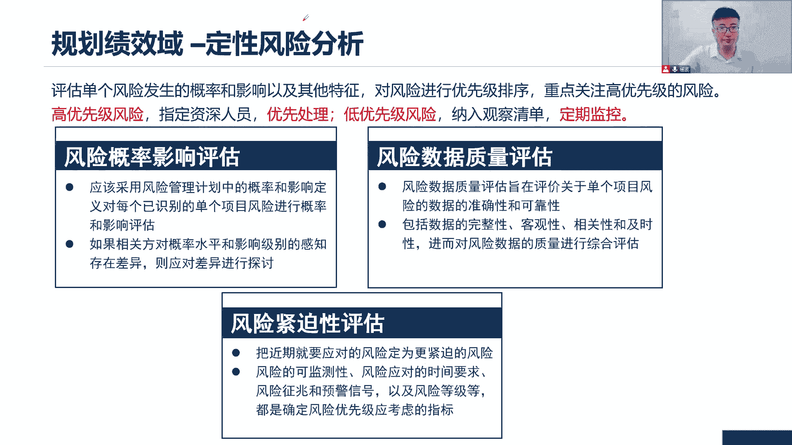

优先级的判决，所以我们总结定性风险分析，早期我们先在规划的时候，先根据风险偏好确定风险临界值，给予临界值得出我们概率想定义电池标准，根据这个定义的标准来得出我们的干员想举证，然后让我们开始去识别风险。

识别到这些风险之后，记住要在整个项目期间持续不断去识别风险，当时的那个风险之后，我们就要去做我们的概率和影响，评估了，你的这个概率和这个影响怎么来评估出来的，通常我们会参考我们的概率影响定义。

基于这个定义来评估当前你所看到的这些风险，有的人这个风险很高，有的人就很低，高还是低，根据我们的标准来确定是高是低，来评估他们的概率和评估他们的影响，那这个概率和影响。

其实也是基于当前我们所定义的这个数值，来进行评估的，好了，基于评估完之后，我们就要考虑当前这两回事，他的数据可不可靠，准准确，数据只看评估，然后呢定义带入到我们的这个矩阵里面去查，我们第一次排序。

把这两个值相乘得到的分值，分值带到我们的矩阵里面去查，得到第一次排序，第一次排序完了之后呢，再参考其他因素，考虑我们其他特性，比如说紧迫性，临界性，监测性，观察性等等特性，做第二次排序。

看看是否有优先级的调整，调整完了之后呢，我们可以找干系人相关方，让他们了解是否符合他们预期，如果有些问题他们想调整，也接受调整，欢迎调整，因为这毕竟是根据你们的偏好来开展的工作，而如果你们想做调整。

接受欢迎，以表明你们当年是在对我们项目，进行一个关注的，你们是在积极地参与到我们的项目里面来的啊，所以说我们定性风险分析，其实做了三次培训对吧，第一次查举证，第二次其他特性，第三次干皮的你们也得做调整。

最后我们完成了我们的定性风险分析，也就是我们首先要关注的是，重点关注的是高优先级的风险，至于低优先级的风险呢，我们列入到观察清单以做监控。

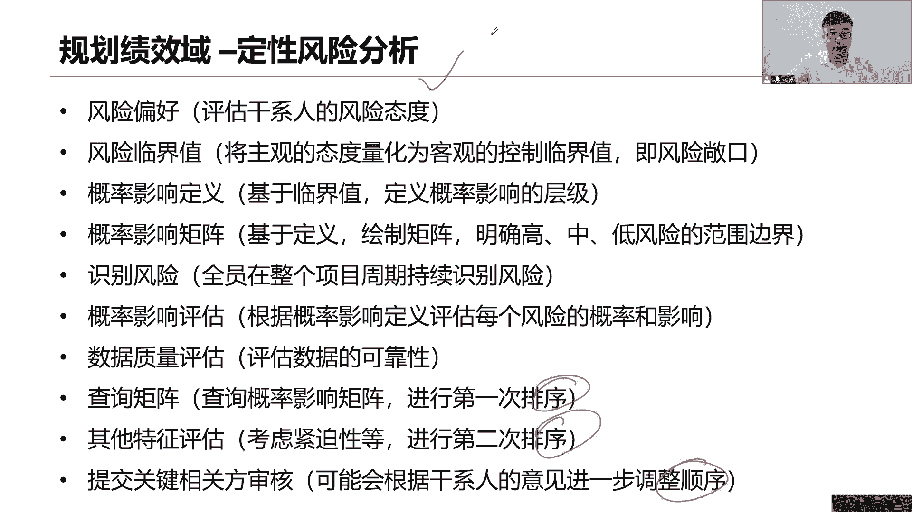

接下来定性做完之后，我们叫做定量风险分析，那么定量定量，什么叫定量，是当前这些单个风险，对外项目整体的影响有多大，他不是在分析单个风险的概率和影响，这个概率和影响已经在定性分析评估完了。

我们现在说的影响，是当前项目整体的影响是什么，也就是说对我当前项目完工日期，和我们当前整个项目的预算的影响有多大，我分析的是这个影响，不是分析的是单个风险的影响，它是项目整体的影响，那么用什么方法呢。

第一个模拟也叫做蒙特卡洛分析，怎么去理解呢，想想基于风险的估算，我们前面是不是讲过三点估算，三点估算会告诉我们说，当前我们有这么几个一系列活动，这个活动在一天之内完成的概率，是30%啊。

然后3000年是50%吧，七天可能是80%，然后呢活动币也是一样的，一天23%天，我可能70%，活动C1天百分之百，活动地也是一天，三天五天七天好，就这些三点估算，我们会得出来他的一个概率值。

这些值只是当前这个活动的基础数据，这个活动的基础数据我们要带入到模型里面去，什么模型进度模型啊，我们这个进度网络图不就是进度模型吗，我们甘特图就是进度模型，但这个模型里面去。

这个模型是我项目整个工期的模型，我要进行一次多次的模拟，最后产出了这个概率里程碑分布图，这是什么图，模拟出了一个图，这个图形怎么去解读，在某个时间之内完成的概率只有10%，在某个时间之内完成的概率。

能够达到90%，再多给我点时间，我能够保证百分之百完成这个项目，我要的就是在具体时间，具体的概率值主要是个概率评估，这就是量化，量化，是当前这些单个风险，对我项目整体的工期和预算的影响程度有多大。

我们要进进步实现，那么我的成本也是一样，成本成本是不是前面说这是个S曲线图，当前成本支出的情况，如果你给我二两百二十万，我能够占我有23%的概率，能够完成项目，你多给我一点钱，245万。

我能够80%的概率完成这个项目，我们要的就是这个概率值，这就是我的定量分析的结果，在这里面，我的这些风险对我项目整体的影响到底有多大，影响我的完成工期，影响我的完成它的概率又有多大，蒙特卡罗分析。

记住啊，模拟模型蒙特卡洛分析，把他们三个牢牢的锁死在一起。

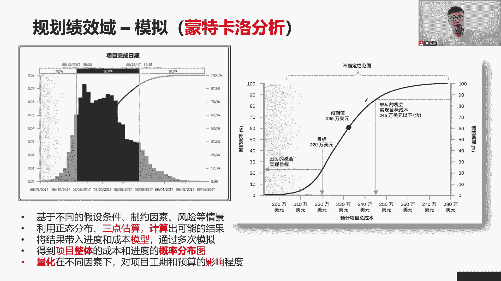

模拟模型蒙特卡罗分析，锁死他，他们都是定量风险分析，第二个定量风险分析是敏感性分析，敏感敏感怎么说呢，说当前把基于前面我们定性风险和其得到了，每一个风险我们都考虑到，并且考虑每一个风险都发生，然后呢。

我们用他们的概率，小分值的绝对值做倒序的排序，小的放下面，大的放上面，用绝对值哦，这是威胁，威胁是左边啊，我们机会是右边，好威胁是负的嘛，那么对于它的绝对值，那就是这样，我们看它的大小，谁的变小。

所以放在下面，然后上面的图层变大，逐层变大就这样了，那么这个最大就是你了是吧，我就意味着当前我这个项目的整体一下，你对我产生整体影响最大，或者说我这个项目对于你这个风险最敏感，这叫做敏感性分析。

那么大家看这个图会发现，这个图像是是不是像我们龙卷风呢，像不像我们龙卷风相马，就像我们这的这个做气象台预报的时候，他那个什么最简最简化的一个图龙卷风，所以它为什么也叫做龙卷风图呢，就知道了。

因为他先龙卷风吗，所以龙卷风图其实就是敏感性分析，敏感性分析就是龙卷风图，帮助我们对这些风险做一个排序，看当前哪个风险对我们项目产生的影响最大，或者换句话说我这个项目对哪个风险最敏感。

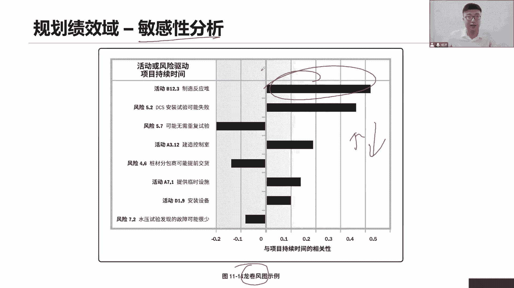

这就是敏感性的分析，第三个分析工作决策树，当前有很多种方案，但是我们并不知道我们怎么去选择方案，因为每个方案都具有太多的不确定性的，它既有机会也有威胁，怎么理解，来看这个图上的例子。

就知道当前我们是要新建一个厂，还是改造这个老厂，如果说新建厂的话，有60%的概率机会，这次机会需求市场很强劲，那我们可以去盈利，那我们可以赚完了是吧，这个8000万，但是你要扣除你的成本。

你的成本是多少，你的成本是是多少，是3600万是吧，建筑新手投资投资1。2个亿，投资1。2亿，但是呢你说需求强劲，你赚了两个亿，那你要扣你的成本，扣除你的成本就只有8000万的利润了。

如果说60%需求比较疲软，我们只能赚9000万，9000万，减去你的成本1。2亿，你还亏了3000万，40%亏损3000万，60%可以盈利8000万，那么赶超老厂也是一个道理。

60%我们可以盈利7000万，40%我们可以只能够盈利1000万，就这样了，好，既有机会又有威胁，现在我们要求平均值怎么求平均值啊，不是1+1除以二这个平均，而是指当前我们的机会的概率乘以影响。

加上我们威胁的概率乘以影响，得到这个平均值，这就是我们说的平均值，这个值叫做什么，叫做预期货币价值，它叫做预期货币价值，那么这个预期货币价值，我们是不希望它越大越好，你越大才有可能产生收益呀。

如果你是负的，那很明显你是亏钱的，那么通过这个例子，我们发现，你看现在我们用60%乘以8000万加，因为是负的，因为它是因为它是亏损，亏损就是减减去40%乘以3000万，最后算出来是吧，是3600万好。

那么如果说是用改造老厂呢，同样的方式求平均算出来是4600万，那么我们选择哪一个，一定选择一个预期货币最大的公司，因为它能够帮助我们产生收益，所以我们选择改造老厂，就这意思。

所以决策事务决策是帮助我们做决策，当前因为有不同的方案，他的该他有机会有危险，包括我们说买股票，它是不是一种风险，是风险，当时买这个A股票，它有百分之多少的概率能够让你赚多少钱。

有百分之多少的概率能够让你亏损多少钱，这是A股票，我们求平均B股票也是同样道理，如果说这两个值算出来，因为买一个是1万块钱，另外一个呢EV算出来只有500块钱，你选哪个，很明显你会选择A啊。

因为A它的预期货币价值最大，我们就选择最大值，它能够帮助我们产生既定的更多的效应，在这里面好，这是预测数，那么预测出其实就是我刚刚说的定量风险分析，三种方法在这里面，一模拟，二敏感性分析，三决策树。

由他们来帮助我们。

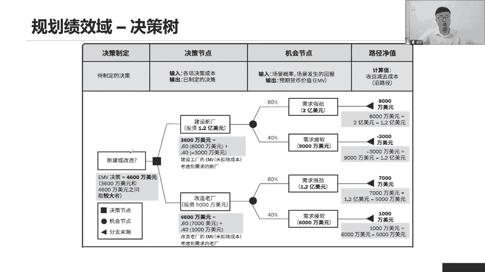

去做我们风险的定量风险分析，那么接下来看既做了定性风险分析，又做了我们定量风险分析，我们做了一系列的评估，那么接下来我们要思考一个问题啊，我们怎么样去关注我们当前这个风险，他的一个应对措施是什么，好。

接下来我们来看看关于我们这个规划，绩效域里面，针对风险，我们如何去应对，那么应对风险的话，它分为两种策略，第一个是针对我们的威胁，负面的影响，负面的风险，第二呢是我们的机会。

那么现在看我们的威胁威胁有这么几种，第一个呢是回避规避，怎么回避呢，他说我们当前风险回避啊，其实就是指把改变我们的项目管理计划，他直接改计划，你完全消除这个威胁完全消除哦，或者改变当前受威胁的一个目标。

比如说你看他说延长进度赛事，他说当前我们这个项目有可能会延期，有可能会延期，这是一个风险，那么如何消除这个风险呢，延什么期啊，来再给大家一点时间，把时间进度，把这个进度基准给你延长了。

那你还有延期的风险吗，没有，那比如说之前三个月，我们说领导这三个月可能完不成啊，有延期的风险来再给大家加一个月，四个月，一个月之后还不行，那再加一个月，我们不要求大家去强调速度。

我们是希望我们正在用迭代的方式来开展工作，迭代迭代周期很长，迭代周期很长，我们要求尽快的去不知情况，要求我们什么，最好的去把我们的解决方案梳理出来，用最优的解决方案来完成这个工作，而不是强调速度。

所以给大家足够长的时间去优化学习，调整改进我们的解决方案，这就是没有延期的风险啊，改变策略或者缩小范围，缩延期，继续说，这个延期有可能延期好三个月，那么有些工作我不做，那就没问题吧，改计划，有些工作。

有些需求，有些内容我们不做了，三个月之内搞定它，因为这个优先级可能不太高，或者风险比较大，或者当前没有任何价值业务，没有什么需求，那就不做了，我们就做些仅做有意义有价值的工作，三个月搞定他。

这就没问题了，你看不管你是延长我的进度还是什么卡的需求，那你们都是在赶我的计划，所以说我们回避回避它的一个最大的特点，就是有些工作我们不做或者延长我的进度，改变我们的计划，直接调整计划。

那要知道改变计划是不是得走流程，要求我们的变更控制流程，我们后面会讲啊，变更控制流程，第二个是我们的转移转移给第三方，这个好理解，把当前的风险以及整个人都转移给第三方，因为你们来承担，尤其是大家注意啊。

我们考的最多的是转移，是一个财务风险，注意转移的是我们很多一些财务上的风险，你比如说买保险算不算啊，想想买保险肯定是啊，不管我们说买车，买车险还是买我们的人的人身意外险等等。

那都是通过买保险的方式把这种风险转移给，转移给谁，转移给保险公司，由他们来承担，当我们的车出了问题，当我们人出了问题，一个保险公司来进行赔付，所以我们大多数都是为了减轻我们的财务风险。

为了转移我们的财务风险，所以我们会去把当前去做这些事情，转移给第三方，由他们来承担我们的财务风险，买保险做担保都可以，那么减轻呢，减轻是指当前我们要减轻这个风险发生的概率，或者说减轻这个风险产生的影响。

比如说还是拿干的例子来说，项目可能会延期，那我们家人吧，帅不帅，家人就一定能够保证不元气吗，那可不行吧，有可能，但是呢我们说这个他延期的概率发生了这样变，发生了变化，人多了嘛，好不适应我们和赶工啊。

赶工就是帮助我们压缩进度，但如果说赶工这个过程当中，大家出了问题，质量不够好，还要返工，那你这个肯定有可能还是会延期，只不过呢我们说减轻了年轻的概率啊，或者我们说做测试，我们测试一轮测试，两轮测试三轮。

你就一定能够保证，我们客户在验收的时候不出问题吗，也无法保证，它只是减轻了我们客户发现问题的概率对吧，这是减轻概念，什么是减轻影响呢，所以减轻影响是指当前，比如说我们做这个服务器的备份冗余啊。

做双机热备，做集群那一台服务器，现在我们在承接的这个业务，客户的业务在这个服务器上面去运行，如果这个服务器出现了故障，我们还要有一个什么备份的服务器，来承接这个工作，尽快的切换过来。

所以现在很多市面上的一些设备的软件，集群的软件不就是在做这个事情吗，他只是减轻了我们当前这个故障之后，产生的影响，影响降低了它不是降低概率哦，没有降低概率，只是说产生了影响之后，我们能够快速的恢复过来。

降低他的影响，这都是一种减轻策略，那么什么是接受呢，接受了致命意思接受这个风险，但是这个接受它分两种情况，第一个呢是我们说主动接受，主动接受，我们就提前准备好我们的应急计划，应急计划拿出来。

还有我们要准备好自己的应急储备，不要忘记我们的应急储备，就是为了针对当前这个已经识别的，但是呢我们没办法主动管理，我们只能接受它发生，那么接受的，反正我就提前准备好资金，提前准备好钱。

以便当这个风险发生的时候，我能够应对这个威胁，还有一种接受，那就是真的是什么都不做了，被动接受，当它发生的时候，我们就有权宜之计，权变措施，然后呢我们动用我们的管理储备，提交变更，提交审批。

动用我们的管理储备，用用我们管理储备来应对这些未知的，没识别大的意外的，不可控的自己风险，那么就是被动接受，最好的理解这么去说啊，就说有的时候我们出差出差以前啊，疫情期间这个出差还是挺麻烦的是吧。

那即便说你可以出差好，那这个风险也挺大啊，有可能被感染，那这个时候你说我不出来了，我们远程这是不是在改计划，这就是回避吗，如果转移呢，张三你替我去，李四你替我去，我不去了，把这个出差这个人交给第三方嘛。

交给别人去做，什么是碱性啊，诶我穿好了这个什么，我多带几层口罩，我戴好了防护服，穿戴好我的防护眼镜，全身喷酒精，出门都是都是这种装备，把这些各种装备全部往身上去弄，减轻被感染的风险，什么是接受呢。

行行行，我出差也没问题，我提前准备好联系好当地的医院，提前联系好当地的专家嘛，医疗专家多准备点钱，这是我们应急，这是不是我们造的应急计划和应急储备，当我出现的问题，我直接去联系。

我们已经预约好的专家和医院和门诊，然后呢动用我的应急储备去解决就可以了，什么是被动接受，那啥也不做，无所谓，我这人心大的很，没事，出了问题再说，这就是非同接受。

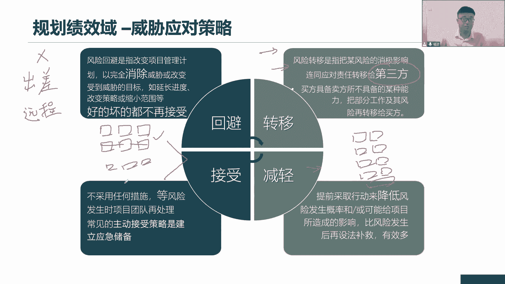

大家能理解就好，那么它关于威胁，他就是说规避规避，我们更多的是采取一些行动来完全消除威胁，那么还有呢转移转移是转移给第三方，由第三方来承担这个危险发生的影响减轻，要么减轻概率，要么减轻影响。

或者两个都减轻，那是最好的，接受，主动接受和被动接受，还有一个点是什么上报，那这个上报我们来看看，他说如果项目团队或者发行，认为这个威胁不在我的范围之内，跟我无关，或者说提供这个应对措施。

超出了我们的项目进程权限的，超出我的权利范围之外了，或者跟我们项目目标没有影响，不产生任何关系，那我们就上报上报给谁呢，影响谁就上报给谁啊，你可以说上报给你的发起人PO。

你也可以上报给其他项目的项目经理都可以啊，这也是一种上报，因为这个风险他影响别人，不影响我，我就上报给他啊，就算把。

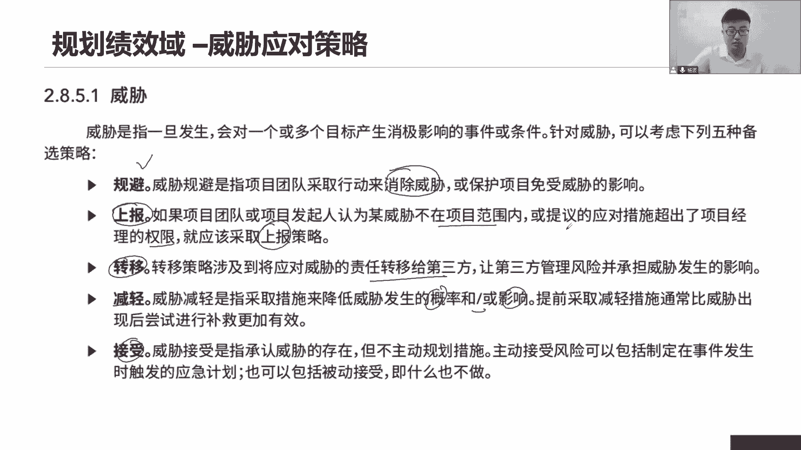

那么对于这个威胁来说，你看有哪些例子啊，第一个回避回避就是改计划，那就是改计划，大家记住这个策略就可以了，你看这是不是改计划吗，去除我们要完成的工作，改需求，改基准进度的成本的基准。

甚至说这个项目咱就不做了，风险太大了，那就没威胁了，完全消除威胁，没有威胁，不做了，减轻呢减轻概率或者减轻影响，咱们看家人可不可以是吧，采用这个精简的流程也可以啊，进行更多的测试，减轻影响。

发现问题的影响，选择更靠谱的供应商吧，减轻我们质量的影响，诶啊小心一点哦，这个大家小心一点，圆形可还记得我们前面讲收集需求的时候，用圆形，用圆形的目的是什么，帮助客户去梳理需求，定义需求。

那能够把这个需求明确下来，那明确下来之后，我们才能够帮别人去开展工作啊，那你说这个定义中的原型之后，需求确定了，后面就一定没问题吗，需求就没有发生变化吗，就不会出现反攻吗，我们只是降低了反攻的影响。

而降只是降低了我们反攻的概率而已，用圆形啊做培训也是一样的，提高大家的质量意识，风险意识降低，我们说出现问题的概率，加冗余做备份，这些都是我们减轻影响，这些例子大家注意，因为考试会出现这些场景。

出现场景，你就知道我们当前采取的是减轻策，转移给第三方，记住一个转典型保护期，就记住一个典型啊，把我们的财务风险转移给mp3，尤其是这个点很重要，跟财务相关，积极的接受和主动接受，主动接受，主动接受。

就是指当前准备好应急计划，准备好应急储备，当风险发生的话，我们就直接动用我们的应急储备就可以了，提前准备好应急计划，如果是被动接受的，啥都不做，以后再说，这是被动接受。

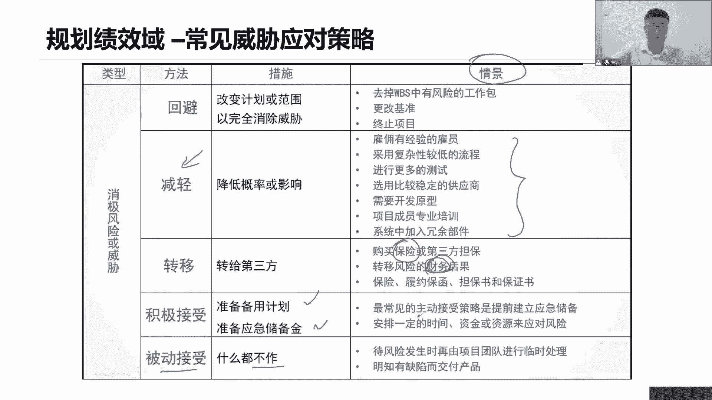

对于机会的策略来说完全就不一样了，所以我们看第一个机会啊，一个是开拓，一个是提高，我们先看其他两个，接受这个字面意思其实和我们的主动接受，被动接受完全一样，就是和我们的威胁是一样的，它也分为主动。

一个是被动，就是我提前准备好的资金，提前准备好了，这个啊时间当你这个机会发生的时候，哎我们主动去追求，还有一种就是不准的追求，当你面就会发生，我到时候再看看能不能把握住，把握住就算了，就无所谓好。

还有他分享也是一样，第三方转移给第三方，分享也是给第三方和第三方，一起来联合共同的合作，以把握住当前这个市场的机会，可以吧，没问题，接下来两个一个提高，一个开拓，其实你会发现这个提到好看上有点类似。

你看当这个机会，我们确保这个机会肯定会出现，必须得把握住这个机会，然后呢，我们使用组织里面最有能力的资源分配给我们，项目团队来缩短时间以完成这个项目，把组织最好的资源分配到我这个项目里面，来。

参与到项目里面，来，尽可能的把握住这个项目，或者说采用最先进的技术，最成熟的工具来帮助我们节约时间，节约成本都可以，这全都是开拓，就是说当前我们家的这个资源，不管是人力资源还是物质资源，总之非常先进。

非常成熟，非常专业，非常全新啊，那提高呢那就是讲这个举个例子，以前十个人开展这个工作，现在有一个机会，我在你家十个普通的人，我们1400个人，我现在还是四个人，加起来，你以前是十个人，这是极端吧。

我现在在你家十个高级工程师，十个主题专家，十个博士生，那不一样吧，高级呀，专家呀，博士啊，教授啊，这些都是组织里面最牛的人了，我把这些人全都给你了，希望你们是一定要把握住这个机会啊，这就是开拓。

所以说看你家的资源是什么样的，如果只是一个普通资源，那就是提高了，而如果说当前我们是一个高级资源专家，资源最有能力，最先进，最成熟，最优秀，最专业的，那就是开除了，就看这个资源它的前缀有没有前缀。

有前缀。

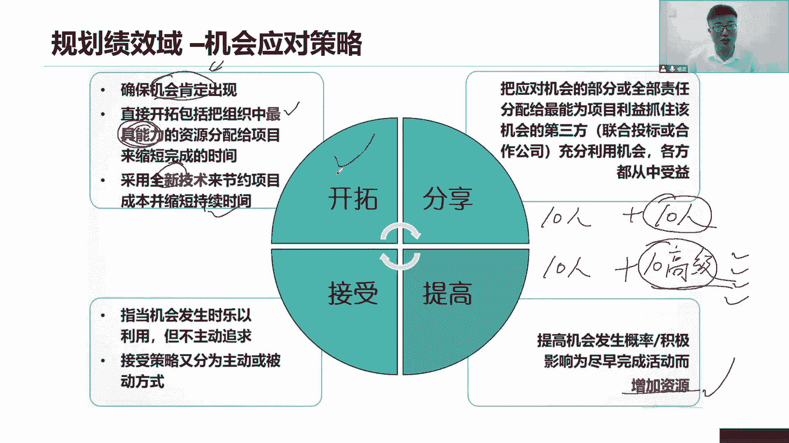

好东西用起来开拓，所以机会其实一个道理，开拓开拓，确保当前这个机会一定可以出现，上报一个道理，当前不在我范围之内，跟我无关，或者超出我权利的，我就直接上报分享，分享给第三方。

提高提高概率或者是提高影响都可以假资源，然后呢接受主动接受。

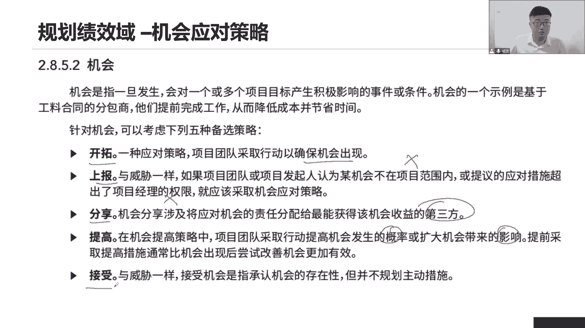

或者说是被动接受，和我们威胁一样，一个主动，一个被动，那么看它的场景开拓开拓，把组织里面最有能力的资源分配给我们，项目里面，以节约时间，节约成本，或者采用最先进的最新的一些新的工具，新的技术用起来。

我们可不可以用一些最先进的技术来玩一玩，当前的工作呢，以提高工作效率，如果可以，这就是开拓分享，分享和第三方一起来联合投标，一起来合作开发这个工作啊，提高提高项目，提高当前我们完成工作。

一个是概率或者是影响都可以加资源，以前是什么资源，我还是给你加什么资源，提高概率，接受主动接受和被动接受，主动接受，建立好我的应急储备，包括什么，预留预留时间，预留资金，预留资源。

以便在机会出现的时候加以利用，你看提前准备好的应急计划，应急储备多好，如果是被动接受呢，那就什么都不做无所谓，我不需要这么追求，那到时候再说好，这是什么风险相关的一些规划到这里就结束了。

那么对这个风险的规划，咱们可以一起来梳理梳下说这个风险规划，首先我们在规划风险，是不是应该先定一个风险管理计划，风险管理计划他会告诉我们，当前咱们这个这个项目啊，它的风险的来源怎么去分类的。

我们这个风险大家主观这些关键干性能，我们组织的风险偏好是什么样子的，但是这个偏好太主观，我们就把它转换成客观的临界值是吧，客观临界值基于这个临界值啊，我们要转化成当前的概率或影响定义，基于这个定义。

我们再转化成它的一个矩阵，这些都是为了我们后面做定性，风险分析而准备的一些事情，以及当前我们说这个风险如何去开展工作啊，如何去做这些这些工作需要有哪些人参与人，也就是我们的资源。

这些资源的角色和职责是什么，我们的风险报告，风险报告它的频率，它的内容是什么，如何去跟踪我的风险，如何去监控我的风险啊，这是我们风险管理计划的内容，那么接下来基于这个计划，我们要去识别风险。

搞清楚当前我们的项目里面有哪些风险，那么识别风险我们怎么做呢，我们可以用一对一的沟通反弹，可以开个会，大家一起来焦点小组聚焦某个主题去讨论，可不可以啊，可以啊，还可以呢。

我们可以用我的sword分析文件分析都可以，但是有一个非常关键的点让我去识别分析它，就是和，答案check list，这个很关键，注意啊，这个工具本身在项目里面，他起的就非常重要的作用。

后面但凡是遇到好的人，我们都会拿出来专门去讲，有些管理过程他会的识别风险，把风险找出来，风险找出来之后，我们记在哪里呢，是不是应该记在我们的风险登记册里面是吧，风险登记册里面会记录当前一系列风险清单。

潜在的责任人，潜在的应对措施，好了，识别完了风险，接下来我就应该做一个视频，要对风险做评估评估，分两步走，第一步先定性风险分析，定性分析其实就是对我们的风险做一个事情，排列优先级的顺序排序怎么排序啊。

先评估每个风险的概率和影响，再看看这些数据质量可不可靠，准不准确，两个值相乘，得到我们的分值，这个分值带入到前面这个矩阵里面去查一查，然后再考虑其他的因素，紧迫性，临界性和监测性和管理性。

再做第二次排序，然后呢再找我们的关键干系人做第三次排序，台湾学车，我们定性风险分析做完了，我们是不是应该更新一下我风险登记册，把当前这个优先级顺序调整一下啊，因为你一开始创建，你只是把所有的需求。

所有的风险全部罗列进去，但是当前我们已经过排序了，你重新把它做一个调整，以及把当前潜在的责任人变成确认的责任人，因为当前已经知道他的优先级了，那么优先级高的，我们应该派专人，专业的人。

熟悉的人去应对这个风险，至于这个低优先级的风险，那无所谓了，随便派一个实习生去监督着就可以了，好定性风险更新风险，根据测，接下来我们可以做一个事情，定量风险分析了，那么这个定量风险分析。

主要是站在项目整真的讲去评估，当前的影响不是评估我单个风险的影响，单个风险影响已经在定性分析完了，我现在要的是分析这些单个风险，对我项目整体的工期和预算有什么影响，我要看当前在什么时间之内。

我完成项目的概率是多少，在什么成本之内，预算之内我完成项目的概率又是多少，那我们可以用模拟，然后呢，还可以用龙卷风图看我，当前我项目整体对哪一个风险最敏感，龙卷风图敏感性分析，以及用决策树来判断。

基于这些各种方案，我们到底应该选择哪一个方案，来应对当前这些问题呢，来解决当前这些问题，选择方案，因为每个方案都存在着不确定性，他都有机会，也有威胁并存，那么就要取决于当前的预期货币价值了。

来根据预期货币价值来分析，我们应该选择哪一个方案，定量分析完了之后，现在既识别了风险，又有评估的风险，我们是不是应该做一个事情，叫做规划应对措施啊，这个应对措施分两种情况。

一个是我们说威胁这些不好的风险，我们怎么去应对，还有一个呢是针对我们的机会，我们又怎么去应对，都有这么五种方式，都有这么五种方式威胁，要么改计划规避它，要么降低，把这个转移转移给第三方。

尤其是比如说买保险啊，财务转移给第三方，或者说降低这个风险发生的概率，或者影响他原型法是吧，多做几轮测试，选一个靠谱的供应商，然后呢我说怎么加资源都可以减轻风险概率，减轻风险发生的概率，或者说影响。

然后呢接受主动和被动，最后呢上报跟我无关，超出权力我就上报机会一个样子，首先把组织里面最有能力的什么，最专业最先进的资源加进来，或者最新的最好的资源工具技术用起来，开拓加普通资源，提高分享给第三方。

接受主动和被动接受，最后跟我无关，超出权力，我上报，我得先提前规划好他们的应对措施是什么，那么这个规划应对措施大家注意一下一个点啊，这些应对措施只有一个吗，就针对这些单个风险，我们只有一个应对措施吗。

显然不是，我们肯定会用到，之前我们讲过的备选方案分析，是不是成本效益分析，哪一个是处应对措施，哪些是备选的应对措施，当这个组应对措施它不生效的时候，我还可以快速的怎么切换到备选应急措施里面，打开了啊。

所以这些我们前期所做的风险管理的，一系列的规划都在这里面都有了，就是早期我们识别到这些风险，我们想一想有哪些风险，这些风险他们的影响是什么，我应该如何去应对它，这是早期我们做了一系列的规划。

在这里面全都是规划，那你说我早期把这些凶险都规划完了，我后面还做不做，必然得做，我因为这个风险贯穿整个项目失踪，你难道只是在项目早期识别风险吗，错了在项目执行过程中会有新风险，那么新风险来了怎么做。

还是按照这个方式啊，识别风险，记录风险，评估风险排列，风险规划应对，是不是，所以这些工作它会贯穿整个项目始终的，我们之所以在规划讲，是因为知道我们项目早期已经有了一些风险，我们先把它做好，先把它规划好。

资源方面我们在不断的开展过程中，我们还是按照这个策略一步一步的走，还是按照这个方式来把它做应对措施，规划一个道理，所以规划风险先做好一部分工作，后面再持续开展，接下来看我们的定性。

这个指标主要当前我们说要验证工作的绩效，我们肯定需要拿出一些指标来，有很多很多指标，包括但不限于这三个，这三个其他的是比较重要啊，我们考试高频考点，第一个临界值，刚刚讲完的风险，临界值。

是不是基于当前我们的这个干系人的风险偏好，确定了临界值，这个临界值就是一个什么指标，在这里面，根据这个指标我们来验证哪些风险可接受，哪些风险不可接受，以便于我们确定当前我们风险的概率影响定义。

根据定义我们才能够得出它的概率影响举证，通过它们来对我们的风险做排序，第二制定质量测量指标，前面也讲过了，质量测量指标一系列的各项可量化的指标，以及说这些指标我们应该如何去验证，有没有达到这些指标。

那这些指标也是我们质量相关的度量指标，进度的成本的范围的，各项基准是不是基准也是一个指标，说当前我们这个项目预算100万，我们这个项目工期六个月，那你得按照这个六个月完成这个工作啊，如果你超期了。

那你看是不是在你的临界值之内，如果在还可以接受，如果超过去了，那不行，接受不了，成本也是一样的，你不能够超支，超出100万，100万，超支之后，我们不能够接受，要在100万之内我们才可以接受。

这就是我们的基准，为了根据这个基准来验证我们的实际绩效，把我们的实际的绩效，和我们当前的基准来做一个比较，你看看中间有没有一些偏差，有偏差，我们找到之后就要去分析什么原因，分析原因。

我们才知道该如何去提，炼出我们的什么解决方案，针对原因呀来去解决这个问题，是找到解决方案，然后呢去实施我们解决法，解决一解决这个问题，对这些各种度量指标，度量指标，度量指标都是帮助你去看我们绩效的。

是不是在这个绩效范围之内，是不是可控啊，是不是符合要求，是不是我们的偏差在临界值之内，偏差有多大，偏差程度是什么，注意哦，做项目得看绩效，要想看绩效，你得提前先规划出来有哪些测量标准。

这些都是一个最低下限，一个最低的标准，这个标准一定是经过批准之后的，我们形成的标准，我们就按照这个标准去执行，不能超出这个标准，超出这个标准。

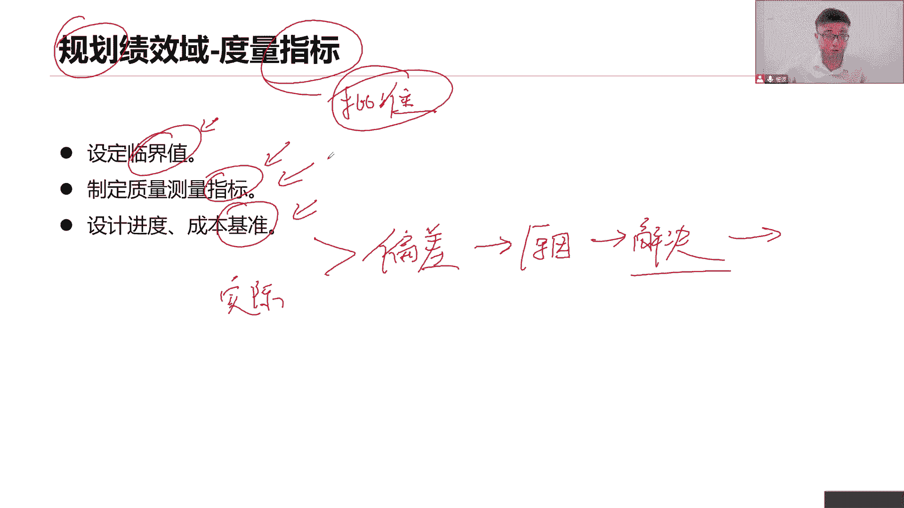

