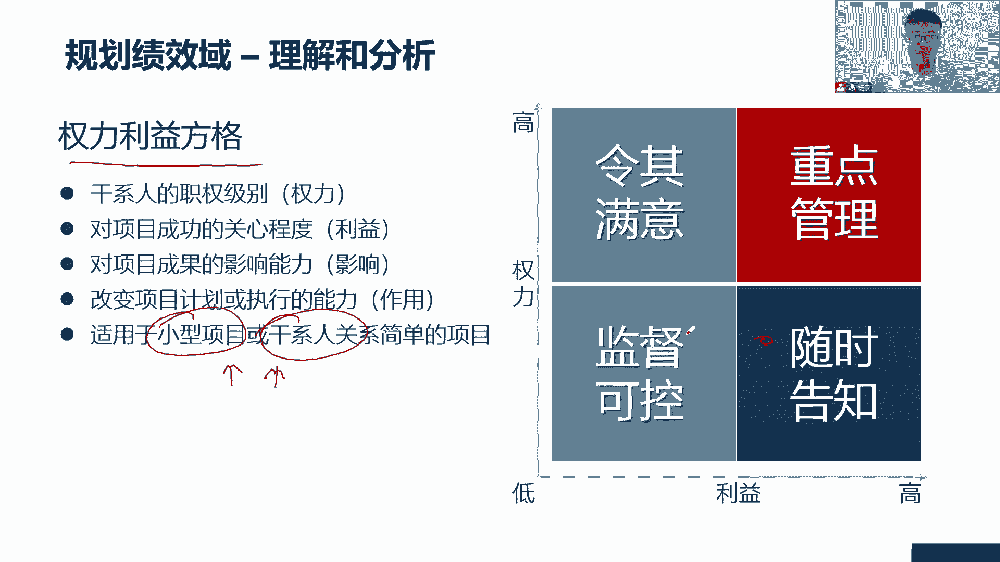
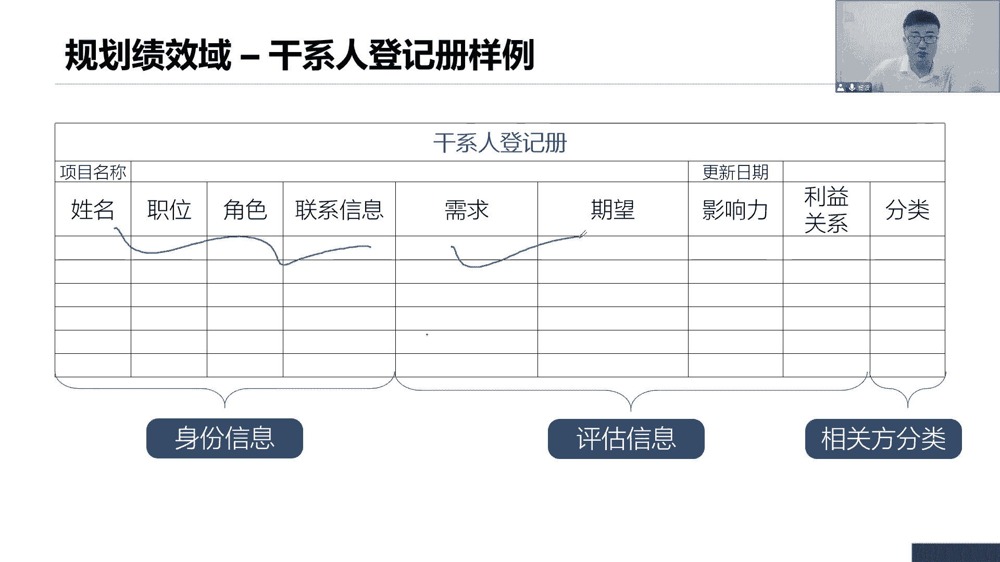

# 全新录制PMP项目管理零基础一次顺利拿到PMP证书 - P26：PMP精讲规划绩效域-干系人 - 北京东方瑞通 - BV1qN4y1h7Ja

好肝性能的管理，那又回到我们刚才的肝性能，说肝性能是本来就是我们的一个管理，绩效预案对，那么大家会发现，未来我们开展了后续的各项工作，其实也都会回到我们前面说的干性能绩效率，还记得不。

我们干性的绩效率是怎么做的，先我们是不是要去识别干系人啊，把这些人全部找出来，然后呢我们要去什么去分析，去理解他们，理解分析分析他们的需求和期望，去理解他们的需求和期望。

然后呢基于这个圈子的权利利益影响利益，我们要对他们做一个事情，排列优先级，要驯马人也分369等啊，排完序之后呢，我们按照一个新的策略，去让他们积极的参与到项目里面来，参与的过程中。

我们还不断的去监督当前他们的参与策略，是不是发生变化了，来重新去调整的参与策略，同时我们说不同阶段的人参与的不一样，来到上面的人不一样，人来人往，我们要不断的定期的反复的持续的去识别，我们的干系的。

识别到又开始按照这个策略不断的去去规划，去监督啊，所以说我们看规划单行人又来回到前面，每一个项目都有很多的关系，他们会对我们项目产生积极的负面或者正向的，负面的影响，施加影响，相关积极的要么是负面的。

所以我们要去管理好这么干系的，尽可能让他们支持我们项目，推动我们项目，它是积极的影响，相信你和团队应该正确的去识别并引导，这些干系人，他们的参与，这样的话能够决定我们项目是否是成本。

所以我们说衡量项目的成功标准，一定更干性的挂钩，也就是当前这些干性的这些相关方，他们的满意度满不满意，支不支持衡量我们项目成功的标准，在这里面，那提高项目成功的可能性的话，应该在什么章程被批准。

项目经理被委任团队组建完成之后，进并早的开始去识别干系人，并引导他们积极地参与到我的项目品牌，所以说识别干系人，识别相关方，我们会把它放在启动过程中，在制定项目章程的时候，我们就开始去识别干系人。

可以的，没问题，我们说他他理论上来说哈，批准之后我们去做这个事情，那是因为带领团队去看这个工作，但是如果说在章程批准之前，作为项目经理，你可以自己去识别干系，那也是可以的，不影响啊，有没有违规啊。

只不过我们说章程批准之后，你有权利动用组织资源，我们一起来全员识别干系人，为了实验项目收益挺不错，识别干系人引导干性能参与过程需要迭代的，持续的反复的去开展持续发展，因为在整个项目期间。

我们参与的人不一样啊，识别干系人定期反复持续再次强调哈，定期反复我们要去分析他们的利益参与度，依赖性影响力，权利利益影响力啊，原来以便于我们对他们做视频的关注，所以识别干系人就是去识别每个干线。

对我项目的，还有呢需求和期望，以及他们对项目的信作用是什么，那这是我们前面所讲过的权利利益影响利益，这些把它分成三类信息是吧，第一类信息是我们的权利利益影响力，第二类信息前面讲的需求和期望。

第三类信息是当前我们这个干性能，对我项目的态度，我们就是要根据当前所识别出该性能，对他们做分析分析，把这三类信息分析出来，为什么，因为接下来我们会针对这三类信息，做重点的管理。

那我们看看吧，第一个权利利益方格干嘛的，就是根据我们识别出来的权利利益，影响力作用等等，对他们进行分组和分类，以便于其他跟他们做虚，那看怎么说，基于当前这个权利利益方格哈，横坐标横坐标是利益。

纵坐标是权利，这就是权利利益方格，一个二维的方格，那么这个权利和利益它也分高有分低好，那么看第一个象限，这里第一个象限说这里面第一个相亲的人啊，他们的权力非常高，而且利益也是非常的高。

这一类人我们一定要重点管理，举个例子让大家理解，现在我们在做一个财务软件啊，这再做一个财务软件，这个财务软件啊，谁要用呢，公司的CFO大家都知道，公司的首席财务长官权力大不大，那是大的，非常大。

利益很高，为什么说，因为他要用这个财务软件啊，他要通过这个财务软件来做一些什么，数据分析和挖掘来来得出一些，得出什么一些预测，比如说他提出，我希望你们这个财务软件有一个统计，近三个月的一个财务分析报告。

报告报表的一个功能，以便于窝去做预测，我们公司未来三个月我们一个财务运转的情况，一个资金运转的流程啊，一个趋势等等都可以，那他会给你提需求，因为他要用这个环境，那你说他利益和这个我们这个项目利润高不高。

高啊，你这个项目如果这个功能有问题，他的分析就有问题，这得出来的报告就有问题，报告有问题，你想一个企业的财报有问题，他的影响是什么，非常的深远，一个财报的问题，那么作为首席财务长官。

我怎么去预测我后面的一个什么公司的一个，资金运转的一个趋势啊，你的数据本身有问题，我怎么预测，预测不了，我怎么去把控，是不是你要做数字化转型，你这些基础数据，你不你的可靠性，你的准确性得有保证啊。

所以说这个软件和他的利益关系非常高啊，这样他才能够给我们公司，制定一个合理的发展方向，否则这个公司的发展方向错了，那你想想想这个影响得多大，有可能公司直接就关门倒闭了，利益非常高，那针对这一类人。

我们应该怎么管，他说了重点管理就这么四个字，重点管理他不会跟你说具体怎么管，我们也不知道具体怎么管，什么叫重点管理，天天在一起吃饭睡觉喝茶聊天，这叫重点管理吗，我不知道没说，我们只是讲的是策略而已。

我们只是说当前这个项目管理啊，我们学的是策略，就针对这一类的，我们的策略是重点管理，那么具体这个项目你想怎么重点管理，那是你的执行策略了，那就是你具体的执行方法，那他也可以具体作为PY。

他会把它写在我们的教材里面吗，我们只是给大家提供一个框架体系，策略方法怎么用，就看各位你们自己把控了啊，第二类的呢，他说权力还是很高，但是跟我这个项目没啥利益关系啊，什么CEOCEOCIOCDOCO。

反正他们又不用这个软件，但是这些C什么O还是大佬，我们还是得罪不起啊，这个权力依然很高，只不过他们不用这个软件而已，那这些人怎么管，令其满意就可以了，那就举个例子说，早上看到CEO了，电梯门口看到他了。

打声招呼，领导你好，我是谁谁谁，我们正在做什么项目，希望这个项目未来能够公司创造更大的价值，哎这话说出来多好听啊是吧，领导觉得小杨很不错哦，可以哦，加油你最棒，我相信你们可以成功的，满意就可以了。

就让他们舒舒服服的在这个舒适圈里面呆着，你别来干扰我的项目，你不要反对我的项目，我让你们满意就可以了，但是利益关系很高，那就是我们财务部门的同事们哎，同事们，那是不是跟我一样，咱们权利都比较低是吧。

同事们都是我们员工，都是我们企业的员工好了，但是这帮同事们他们也得用这个软件啊，你这个软件的功能会直接影响他们的工作，绩效的，会直接影响他们的工作效率的，你说利益高不高很高，那怎么管，随时告知。

告诉他们当前我们这个项目啊，这个功能有哪些，怎么去用，怎么去维护，怎么去怎么去提问题，怎么去需求，我们新一个版本的功能会增加哪些，我随时告诉你们啊，你们有些什么意见和想法，随时提出来告诉我们都行。

我们随时可以干，改了之后结果是什么，我们也随时告诉你们，就是随时告诉你们，当前咱们这个项目，咱们这个产品，咱们这个软件有哪些核心功能，怎么去用，怎么去维护，接下来会更新哪些功能，你告诉他们。

让他们能够提前知道我们的工作方向，我们的工作内容，我们接下来会用什么样的工作功能，来帮他们去完成工作，第四类的权力又低，利益又低，这个人我们就是要监控他们就可以了，权力又低，利又低，跟我项目没啥关系。

我们监控，但这个监控监控啊，监督控制不是去监督他每天干了什么事情，也不是监督他今天早上几点来，下午几点早，也不是监督他的工作绩效做的好不好，我们是监督这个人和我的关系有没有发生变化。

这个人有可能突然有一天他升职了，突然有一天他调岗了，你想想是不是权利利益发生变化了，升职嘛，权力就高了呀，生成主管了，厉不厉害，厉害吧，权利就上来了，这个人调岗位啊，调到财务部门去了哦。

利益关系又发生变化，那得监督啊，不同的策略，你的管理方式是不一样的是吧，不同的维度它的管理方式是不一样的，所以你来看，所以为什么我们去分析他们权利利益影响力，作用力呢。

其实就是为了便于对他们做一个什么事情，分类的分类管理啊，我不是说每一个人都要给你们做一套管理策略，那我忙死了这么多利益相关呢，我怎么管得过来，就是把你们分在不同的点，哪些人可能利益会相对来说比较低。

你们就在这些象限里面去描点，我就给你们描点，这个是张总，这个是李总啊，这个是什么诡异种，这个是什么什么种啊，这个不是总啊，这个什么门口的保安保洁阿姨，是不是因为权利很低嘛。

还怎么总不可能是什么种分类分类管理好，大家注意一下另外一个知识点，就这个权利利益方格是一个二维的方式，所以它通常只适合于这种小型的项目，小型项目或者说干系人不是这么多，那就这么几个鬼。

我们关系也比较简单啊，这个直接管理就可以了，没有这么复杂，哎呀我们上面有一个主管经历个什么分组经理，分组经理上面一个总那个什么主管经理，主管经理上面是一个什么PM，PM上面是个什么总监。

总监上面是一个什么董事长，还有看到这一堆人头都大了，是不是没有这么复杂的关系，就几个人，几个主管在上面盯着，然后呢下面几个小小的，我们一起来做一个小型的项目，用全力第一方格。

简单简单简单描几个点就可以了。

知道这些人该怎么管，那第二种呢这个大家了解了解哈，凸显模型它从三个维度，第一个呢是权利一样，权力高低啊，权力第二个呢是这个紧迫性紧迫性，什么叫紧迫性啊，第一时间约束后，相关方对项目的成果有重大利益诉求。

而需要立即加以关注，经过吧，立即下，第三合法性，这个项目参与的适当性合法性，有没有权利想了解到这个信息啊，你有没有权利可以参与到我的项目里面，然后通过三个维度中间这个圈交集吧。

那是不是你看它就是高凸显性，高凸显什么颜色很深啊，三个通常这三个圈是不同的颜色嘛，只不过我们把它画成一个颜色，那不同颜色交织在一起，这中间这个就颜色很深，那么它就是高通用性，两个圈的交集团中凸显性。

一个圈呢就是低凸显性啊，不同的策略又是又来了，那像这种凸显模型它用在什么地方呢，大型的复杂的社区，或者说当前我们这个项目很复杂，大型复杂项目以及该系统之间的关系也很复杂，错综招常在一起。

我的上面是一堆的人，各种关系网络交错在一起，看都看不懂不认识，反正这些人跟我是有关系啊，这就是这么说，用我们的凸显模型，它主要是用在大型复杂项目或者人际关系，网络比较复杂，已经形成了一个社区了。

那这就是一种凸显模型，用起来啊，这个事例大家可以看看就可以了，看这不就是三国类型吗，权利的合法性的紧迫性的去看怎么去管理，用什么样的策略。

用什么策略来管理不同类型的人，接下来这样说，我们用了凸显模型，用了我们权利利益方格就可以去对他们做分类，同时呢也能够排列它的优先级的权利，高利高，重点管理，那就是优先级高不高。

重点管理我肯定要聚焦这些人，我必须得重点去打好关系，管理好他们，但是要注意哦，在整个项目期间，我们的人他是会发生变化，也就是说他的权利利益影响力会发生变化，那这个一变我就要重新排，就像我刚刚说了。

你不要小看一个门口的保安，一个保洁阿姨，有一天她突然调岗了，有一天他突然升职了是吧，就小心一点了，是吧，以前你怎么对他，他以后就怎么对你，所以说你要重新对他们做优先级的排序。

因为他们的策略管理策略是发生变化的。

那么基于我们前面做了这么多的分析，把权利利益影响利益需求，期望态度做了这些一系列的分析，还对你们做了分组分类又排序，这些信息咱是不是得把它记下来啊，你不能记在自己脑子里面，有这么多的人。

这些人你要把它记下来，他是属于什么策略，怎么去管，所以寄到哪里，记在一个非常重要的文件里面，叫做干系人登记册，风险记录在风险登记册，干系人记录在干系人登记册里面去啊，那你记得哪些信息，这个人的基本信息。

你叫什么名字啊，你在公司的职位是什么，你住哪里啊，你的电话是多少啊，然后呢你家里面还有谁呀，那你的紧急联系人是谁呀，你的兴趣爱好有哪些，是你的工资是多少，我也可以写啊，就反正是基本信息嘛。

你想写什么都写的都可以，因为毕竟这个人嘛，你关心的是这个人啊，不是关心他被他的一些什么其他方面，所以把基本信息能够获得的更多，尽可能写下来，以便于你未来能够更好的和他取得联系，打好交道。

甚至说不定你会发现诶我们还是校友哦，有可能吧，教育背景啊，这也可以写啊啊打好关系，评估就是我刚才说的需求，期望你的影响力这些这是我们评估出来的，当前这个人的沟通需求是什么。

我好去定了我后面的沟通管理计划，这个人的风险偏好是什么，期望偏好，我要定我的风险临界值，以便于定我当前的这个概率影响定义，概率影响举证，你看这就是通过我们当前前期分析，干系人得到的一些信息，重不重要。

特别重要，负责未来你的沟通怎么管，你的风险怎么管，你得了解他们的需求和期望，然后相关方的分类分类型什么，那权利利益影响力写进去啊，他们以及对这个分类的结果，他的管理策略是什么，重点管理令其满意。

随时告知还是监督都往里面去写，就三类信息，基本信息，评估信息。

分类信息好，这是我们干涉等级测点，记住等级测这个例子就说了啊，就举个例子，基本信息，然后呢评估信息以及分类信息写一写就可以了。

这就是个例子，大家看看就可以了，简单了解了解好了，接下来我们对这些干性能，都记录在我们的像干系人登记册里面，对他们做了各种分析，那分析完同时呢，我们也对他们做了一个排序，优先级的排序，哪些重点管理。

哪些定期满意，都做完了，那接下来我是要规划一下，怎么让他们参与到我的项目里来呀，我要做我的干性的参与这一步骤做参与了，我想怎么去规划，我要定一个参与计划，我们干系人对应的值计划就得拿出来。

也就是说他们的参与策略是什么好。

那么基于这个前面已有的我们做排列，这个排序，对他们做分类，重点管理，令其满意，随时告知和监督好，这是他们的分类信息，同时我还要了解一个点，这个态度还没用起来呀，大家有没有发现权利利益影响力。

这是用来分类的需求期望，这是用了定额，我们其他领域的一些计划，好满足你们的需求期望，才能够保证你们的支持我的项目，但是这个态度呢我还没用起来啊，所以马上用起来啊，态度分为五种，不知情反对中立。

支持领导这双鞋，当前的相关方有这么一堆，C表示当前他们处于什么态度，当前一个人不知情，这个人反对这个人中立，我希望你们什么都是支持这个D就是我的期望，我的期望不是你们的期望。

我期望你们都能够支持我的项目，我需要你们参与，我需要你们的参与程度达到支持就可以了，那这个领导是啥意思啊，这不给他举例子，现在大家来学习偏僻认证你的主管直属领导，知道了，你在学习，他跟你说加油，你最棒。

我相信你一定能够考试成果的，为我们公司添砖加瓦，支持，这就是支持，什么是领导的，加油，你最棒，我相信你一定可以的，我之前也考过，我把我的资料分享给你，你有什么不懂的来问我，我帮你解答。

你看是不是就有明显的区别了，你只是说加油，你最棒，我不仅说我还有行动来推进你的工作，这就是领导好大的区分哦，但是呢大多数情况下，你说要一个主管，要一个经理，要一个领导来领导你的项目，确实有点过分啊。

有点奢求，有点奢望，你们只需要支持我就可以了，这是我当前的期望，对大家说，希望各位能够支持我就可以了，领不领导，那是看你们自己的意愿，但是至少我希望各位能够支持我们项目。

是不是通过这个该系统的参与评估矩阵，这个矩阵横向纵向都有信息来帮助我们，看看当前这些干系人，他们的参与超浓度就出现了，我们要了解干性的差别，承重就通过这个取证来看，你说当前你们中间有没有偏差。

我希望你支持，结果你完全不知情，你都不知道我在做个项目，说明了参与程度很低呀，你都不知道我的项目是吧，当前你保持中立，我希望你能够支持，而你的参与程度呢有那么一点点，但是你不表态，这个我觉得不好。

不开心的，你到底是支持还是反对，请求回国直接的结果，你痛快一点，哎你说你如果反对可以好反对，那至少说明你现在知道我的项目啊，你的参与程度还是比较可以，只不过呢反对我，我还是需要给你做一个惯例。

希望能够给你传递更多的信息，让你能够了解我的项目是不是通过这个举证，我能够看到当前各位干系人上官方，你们的差异程度，你们中间有偏差啊，我要弥补这个偏差，我怎么弥补这个偏差呢，做一个事情。

勾通给你们传递我项目的信息，来我们一起开展会，来我们一起开周会，我们开双周会，我们开月度会，我们开展团建活动，我们一起出去吃喝玩乐，啥都可以，那我们一起来做我们当前这个项目的重大决策。

让你们参与到项目的执行过程当中来，都可以就是通过给你们传递信息，让你们了解项目，以便于各位你们支持我的项目。

这就很重要了，所以我们看规划干性能参与，要想形成我们的参与计划，要想形成参与计划，怎么做呢，首先规划干性的参与是根据他们的需求期望，权利利益以及影响力，然后呢制定我们当前他的一个参与方法。

所以啊我说前面分析是很重要的，这是个基础，你得先了解他们的需求期望，你才能为了去规划怎么去满足他们的需求期望，如果连他们的需求和期望，你都不能够满足，他会支持你吗，不可能结合的刚性的分析结果。

什么分析结果，分类信息以及呢参与评估，我们得到了参与程度啊，一个是分类信息，一个是参与参数，通过这些信息我们来制定一个科学的参与策略，这个策略就是我们说的参与与计划，这个参与计划里面就会写各种策略。

参加什么，会做什么决策，所以参与计划是一个什么项目管理组成部分，没问题，这是一个子计划，它是确定用于促进肝性能，有效地参与决策和执行的一些策略，在这里面，在哪些过程，你们要积极地参与到我们的决策里面。

在哪些领域，哪些维度，你要积极地参与到我们的执行过程里面来，所以我要形成一系列的参与策略，参加什么会参加什么评审，参加什么沟通都要写清楚，参加什么活动啊，公司周年庆啦，可不可以啊，都可以啊。

至于各种活动参与进来吧，支持我的项目干性的参与计划，包括但不限于什么，调动个人和干性能参与的策略，就是说你们各种参与策略，你怎么参与的项目，来参加哪些会议，参加哪些活动，参加哪些工作，做哪些决策。

做哪些执行活动，写进来，至于这个会什么时候开，和你传递什么信息，用什么方式传递信息，那是沟通管理计划要确定实行，我现在还并没有谈到这个信息怎么传递，我只是说你要来参加这个会，我要告诉你一些信息。

至于这个会什么时间用什么方式怎么传递，那是沟通管理计划要说的事情，所以大家一定要注意，不要把参与计划和沟通管理计划搞混了，参与计划它更多是要强调这些干系人他的态度，以及我们怎么去弥补这个态度。

他要参与哪些工作，而我们的沟通管理计划呢，它关注的是我们的信息，不一样的对象是不一样的，也是关注的是我们的干系人或者相关方，都可以啊，干系人相关方，我们关沟通关键词，信息怎么样能够有效地传递给我们。

接收方。

他关注的是信息的有效传递，这两个是有根本区别的，所以咱们一总结啊，咱们这个规划干性能参与他怎么一个来龙去脉，我们总结总结，先结构化的识别，把这些人找出来，上面是领导，下面是团队，前面是客户。

后面是供应商，左边是直男经理，右边是外部的行业协会，先把它们找出来，怎么找全员一起来找，不是我一个人，我们要持续的反复的定期的一直去识别干线，因为参与的人在各个阶段是不一样的啊，不要忘记了这个图好。

接下来该性的分析，把这些人找到之后，分析你们的三类信息，权利利益影响力，第一类信息，以便于我进行什么权利利益方格给你们做分类，他用的方法是映射分析表现，这个映射分析表现。

其实是我们以前的一个工具和技术而已，只不过呢用这个分析主要就是分析分析之后，把他们用一种图形化的方式表现出来，这种表现的形式就是权利利益方格，第二类信息需求和期望，我要了解你们的需求，期望。

未来我要让你们支持我，我会满足你们的需求和期望，提高你们的满意度，第三类信息态度，态度是用来帮助我们去做我们的相关方，参与评估举证的，这个举证是来帮助我们去了解当前各个干系人，你们的参与超度的。

那这些信息咱就把它记录下来，记录在干系人登记册里面去，然后基于当前的分类信息，基于当前的参与程度，我就要制定一个科学有效的干性能参计划，那么我的规划到这里，你就做完了。

就至少我现在把我这个子计划拿出来了，我知道了，基于当前已识别的干系人，他们应该有什么样的参与策略，参加哪些会参加哪些活动，做哪些决策，我都已经有了，我对目前我的干性能规划到这就做完了。

那么后面我们到了项目过程过程当中，我们就按照这个计划去执行呗，有哪些会你就把他们邀请过来参加就可以了，然后按照沟通管理计划传递对应的信息，完事了，后面我们监督诶，该系统它的参与度是不是发生变化了。

以前反对，现在根据你的策略是不是变成支持了，以前不知情，现在是不是都变成支持了，还是说你本来就是一个支持，通过你的参与测试反而不支持的，那说明你的计划有问题，后面就去调整。

