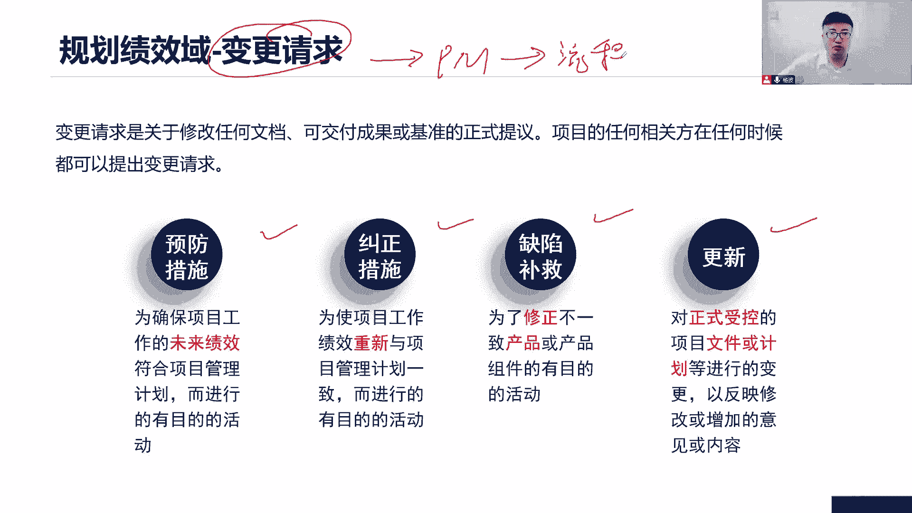
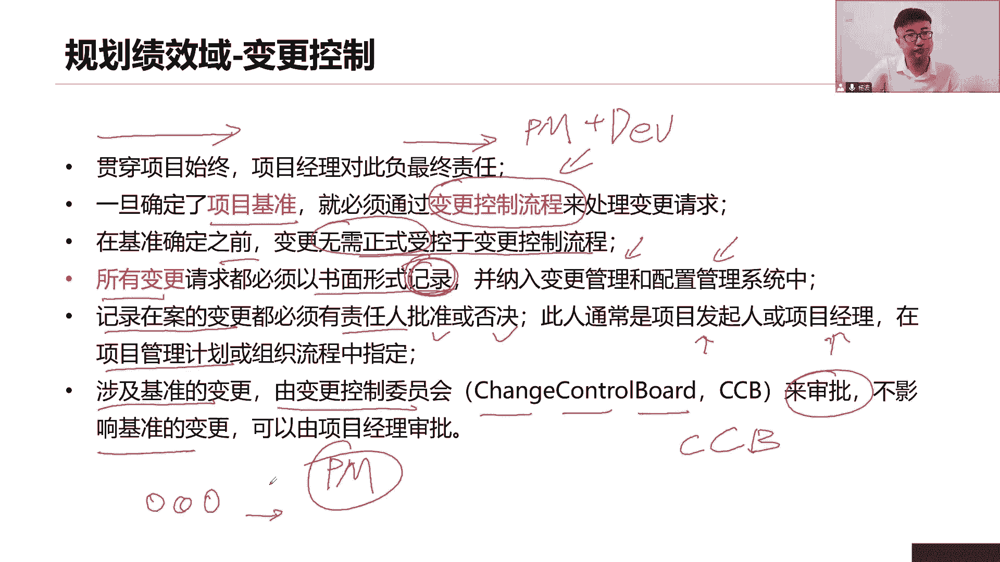
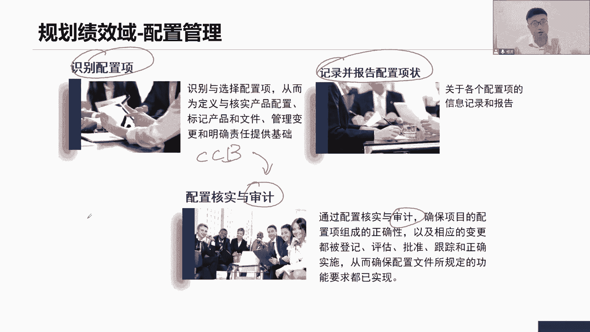
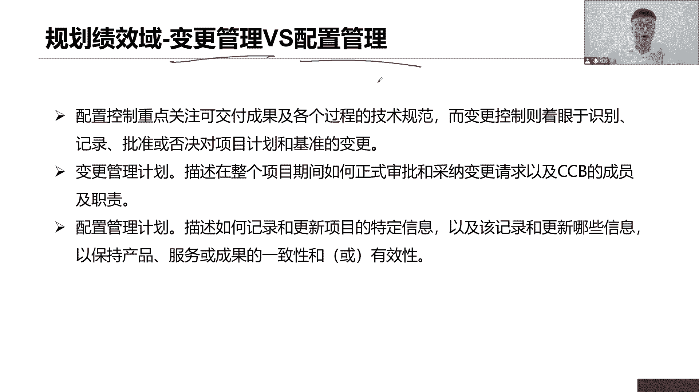

# 全新录制PMP项目管理零基础一次顺利拿到PMP证书 - P27：PMP精讲规划绩效域-变更 - 北京东方瑞通 - BV1qN4y1h7Ja

变更又来了好了，这个变更变更项目里面变更，那是肯定有的，那变更得有一个什么变更流程，这个变更怎么处理，怎么评估，谁来给决策，给了决策之后，接下来应该怎么做，按照这个流程来一步一步的去做这个事情啊。

我们说预测性的项目，通常我们会有一个固定的流程，一个详细的流程来指导我们怎么去做，那你这个变更是不是应该也有一个子计划，变更管理计划，这个变更管理计划来告诉我们，我们变更流程是什么，由谁来做出决策。

你得告诉我们啊，如果说是采用适应性的方式，敏捷的方式呢，那这个变更呢它就比较简单了，它会通过先调整我们工作的优先级的顺序，因为毕竟敏捷，他强调是价值，加强了什么价值，我们就要调整优先级的数据，哪些先做。

哪些不做，先做的一定都是具有优先级，具有价值的工作去做，如果说有一些工作啊，我们是签了合同的，和供应商签了合同，那么在合同里面，我们其实也可以写一些跟合同相关的变更，控制流程，就说一定要参照合同。

我们不能够单方面的按照我们自己的流程去变，那不行啊，你这个得至少得双方达成一致，所以有可能会按照一些合同的变更流程来处理，后续和供应商之间的一些各种变化，而且需求的变化。

合同的变化都可以按照我们的合同要求来处理，那这怎么变更它的一些规范，在这里面就说前提前提我得先规划出来，我们当前基于这个开发生命周期，我们是写一个详细的变更流程，还是说我们按照这个策略定优先级来去调整。

我们的变更，或者说我们跟供应商，按照我们的合同变更流程去处理，那这个变更流程你得写下来，前提得先说出来，大家一致同意认可，协商达成一致，那这就是我们的变个流程，所以前期在规划的时候也得说清楚我们怎么变。

接下来看看我们的变更请求，那既然说你涉及到变更流程，意味着我们对于传统项目来说，我们就要提出这个变更请求，因为变更请求本来就是我们变更流程，一个一个开始，一个输入，你得先提出变更请求。

然后我们才会去按照我们的变更流程去执行，把这个变更请求交给项目经理，由项目经理来实施，无论这个整体变更控制，按照流程来实施变更好，那这个变更请求啊，大家注意啊，它是关于我们大家修改各种文档也好。

成果也好，基准也好的，有什么正式的提议，我提出正式的变更请求交给你项目经理，由你来做一个整体的评估，以判决定当前这个是变还是不变，或者你跟上面的人，跟上面领导，让他们做决策都可以。

那么变更情有这么四种形式，第一个呢是预防措施，他是说为了确保未来的绩效符合计划，你看他是说是未来的绩效，这是预防，因为当前我们可能还没有发生较大的偏差，这个偏差程度比较小，但是如果一直按照当前这个迹象。

继续往下开展工作的话，未来我们的项目它的延期，或者说我们这个项目的这个超支会比较严重，会超出我们的接受范围之内，会超出，那这个时候怎么办，我们就要想办法先提前做好预防措施。

避免未来我们绩效严格的电网的绩效，未来的绩效超出我们这个计划，与我们计划有偏离，所以我们会采取一些预防措施，纠正措施呢，就当前这个绩效已经偏离了，已经偏离了，还没有偏离了，这个是还没有偏离。

我们做一些预防，但是现在是已经偏离了，我们要重新让我们的绩效回到正轨，和我们的计划保持一致，我们就要用纠正措施提变更请求，说当前我们这个进度已经延期了，怎么办，赶工快速跟进啊，提交变更请求，以加资源。

或者说串行改并行，可不可以啊，提变更请求嘛，这就是我们的纠正措施啊，第三类缺陷补救，就这个产品他有bug，它有缺陷，我们要去修正这个缺陷，测试发现了问题，QC说你的问题，产品问题，你得改呀，怎么改。

提交变更，行不能随便改，提交一个正式的变更请求，我们采取纠正，我们采取什么缺陷补救，来改我们产品的一些缺陷，所以前面两个是跟绩效挂钩的，这个第三个是我们产品的缺陷，那第四个呢文档计划受控的文档。

受控的计划，受控的文件，我们要改更新，更新也要提变更请求去拿，所以变更请求的话，它有什么四种性质，这四种形式其实都是在走我们的变更流程，因为只要你提了请求，我们就会来项目经理。

你要按照流程去处理这些变更，按照我们实施整体变量控制，这个流程变更的流程去处理啊。

全部搞定好，变量控制在整个过程当中，其实这个项目的过程中我们都有很多变更，所以我们要贯穿整个失踪，项目经理对此负最终责任，因为由你来实施这里面的控制，你带领我们的团队，我们一起来实施变更的。

一旦确定了项目基准，那就必须走流程来改变我们的当前的一些基准，或者改变当前的工作，如果没有系统基准呢，那可无所谓，那你想怎么改就怎么办，因为当前还只是个草稿而已，都可以看，无需遵循正式的电动控制流程。

所有的变更请求，都应该必须以书面的形式来记录下来，就是我们会有一个变更日志，这个变更政治未来记录当前我们所有的变更，我们都应该有书面性的把它记录下来，就你给我提变更请求可以，但这个变更请求。

我未来会把它记录在一个变更日志里面去，这是我们的项目文件，以便于未来我们去跟踪，并纳入到我们的变更系统配置管理系统啊，就是软件系统里面去做跟踪，做审计来变去做做记录。

存档记录在案的变更必须有责任人来进行审批，是的每一个边你现在把它记录下来，那么我们在按照这个流程去执行的时候，肯定会有人来给你做出决策，到底是批准这个辩论还是否决这个变更，通常呢可能是我们的高层人员。

或者说有项目进来也可以，但是取决于当前基准是不是设计的基准，那你看他是不是说在我们的项目管理计划里面，会确定的这个项目管理计划里面写了，其实就是变更管理，变更管理计划会确定当前谁来做批准。

如果涉及到基准的，通常由变更控制委员会，变更控制委员会简称C1C1B由他们来审批，就是如果涉及到我们的范围，进度成本或者项目管理计划里面的各项内容，涉及到基准，这个基准是经过批准之后形成的基准。

那就说经过批准之后形成的受控文件，对授课文件如果影响这些基准，找CCB，如果不影响基准的话呢，项目经理你可以直接审批，那你可以直接省略，没问题，说简单粗暴，理解范围，进度成本，找CCB，除此之外。

不要找他们，找我，项目经理，我帮你搞定，快速搞定，快的很。

那么CCB啊，他的这个CP干嘛的，其实就是在帮我们做决策的，到底是通过还是不通过，但一定是什么跟基准相关哈，但是强调你但凡是找CCB变更控制委员会，一定是跟基准相关。

就是我们所有的变更都应该实施整体变更控制，这个流程，但不是所有都要交给CCB以基准之类的，项目经理，你自己搞定就可以了嘛，如果对这个基准发生变化，要调整基准之外的事情，你找CCB这个没问题啊。

比如说你看这个说动员管理储备，这是你基本之外的事情，如果说你要用你的应急储备呢，相机你直接说了算就行了，你不用找CCB，这是你的基础之类，那么CCB一般由哪些人组成呢，你看这里说发起人PMO职能经理。

项目及经理，项目组合经理，客户都可以，这些大佬在上面可以组成，他们的职责是什么，给我做决策的呀，那这些内容是不是应该写在一个文件里面，就说我们的变更控制程序是什么，我们参与的人有哪些。

这些人的职责是什么，都应该写在一个文件里面，这个文件就叫做变更管理计划，所以变更管理计划会写这些内容好，我们来看关于这个整个的变更流程到底是个啥，既然你说了，所有的变更都要以书面的形式记录下来。

首先我们第一个第一步干嘛识别变更，提交我的变更请求，变更请求作为第一步，输入各位干系人，你们任何时候谁都可以在任何时候都给我提出，我的变更，没问题，你们提出你们的变更请求告诉我啊。

以变更请求方式来告诉我提交变更请求，这是个正式提议，但是我们说了，所有的变更都应该以书面的形式记录下来，所以我第二步赶紧做一个事情，记录变更，把你们所说的这个变更请求。

以书面的形式记录到我的变更知识里面，我这个知识就会写，谁在什么时间给我提了一个什么变更，我当前只能写这么多信息记录的变更日志好，接下来我开始分析了，就这些变更，我们是不是想讲六大制约因素。

充分的分析范围的变化会不会影响我的进度，成本质量，资源风险，六大殖民速度，所以我要去整体的综合的评估，你这么一个小的变更，对我其他领域的影响是什么，我一定要和团队，我们一起来综合的整体的评估一下。

这个当前这个变量对我项目的影响是什么，是有利的还是不利的，加需求，这是范围的变化，那么这个范围变化会不会影响我，其他领域的变化，我要充分的考虑啊，六大致病因素以及肝肾的满意度。

是不是我们前面讲都会充分的考虑，综合的考虑，整体的考虑不能只考虑一方面哦，这是不行的，那么评估之后就能得出，当前这个变更对我项目来说是有利的，还是独立的，如果说是有利的可以。

我们接下来就要去跟肝新人做反馈和沟通了，找审批人张总，我们这儿有一个变更，对我们当前的项目呢，这个执行效率非常高，能不能快待会儿过会的时候快速过一过，我们可以尽快实施，可以吧，跟审批人施加影响。

跟他做反馈，待会过户的时候快一点，我们尽快去实施，如果说这个变更对我项目是不利的，经过评估之后发现不利，找到提出人说，李总，你看你这个变更啊，对我们项目的范围进度成本质量资源沟通，目前财富都不利。

要不取消吧，或者说放到下一个版本去做，可不可以啊，你要跟他去施加影响，你要跟他做反馈啊，做沟通啊，对不对，那如果说他坚持要走这个流程好，那就继续走吧，我们就审批，如果说不涉及到这个基准的变化，我自己来。

我给出结论，如果说涉及到了基准，好继续往上走，提交给CCB，向CCB提交，我们变成请求，因为我做不了主，这个涉及到计算，那不管说是我批准还是CCB批准，总之大家把结果给出来，我要的是个审批机会。

要么批准，要么否决好了，有了结果之后，接下来我要做什么事情，更新更新啥呢，他没写，但是要分情况，如果这个变更请求被否决了，我更新变更日志，因为前面变更，这次他只写了谁在什么时间提了个什么要求。

提了个什么变更，中间走这么多流程，你不记录下吗，变更的综合评估的影响是什么，谁评估的这个变更，谁给的结论，为什么给这个结论，结论是什么，基于什么原因都应该写下来，以便于未来我们要有这个文件拿过来。

什么做审计，做跟踪的病变，后面说有人说哎这个病跟谁P谁P的啊，怎么这么多问题，那可不是我审批的是吧，有可能是指别人审批的流程存档，来避免未来出现问题，现在很多场景他会考试会告诉你说，当前有两个干系人。

对某一个经过CCB批准之后的变更有意见，他们不爽，他们想改你，你的第一步干嘛，先拿出来这个变更日志和他们沟通啊，这个变更是谁批准的啊，什么时间批准了，为什么批准，基于什么原因批准了，你们两个吵没什么用。

看一看就可以了，所以拿着变更日志和你们来沟通，以解决你们的忧虑，以解决你们的担心，以解决你们的疑问，可不可以啊，所以为什么变更是这么重要，那就是因为我们要去记录这个变更，整体的流程好。

那这个否决好说更新变更证就可以了，但是如果说这个病一旦被批准了，你除了更新我的变更日志以外，还得更新对应的计划和文件，向下基准啊，尤其是我们的基准，如果这个需求被批准了，加你要不要改我的范围说明书。

WBS词典需求文件，需求跟踪矩阵，进度被批准了，要不要改我的进度计划，甘特图要不要改我的进度，网络图要不要改我的活动活动清单，活动属性全都得改，一堆的文件和计划，是不是，否则你不改的话。

未来我们验收的时候，你的文件还是老的文件，但是我们这些新的功能是已经加进去了哦，那为了你延迟对不上了，你怎么对得上这个新功能，我们在做啊，新功能要验收，但是你会发现你的文件里面根本就没有这个，新功能。

对不上，那就是你的问题了，所以如果一旦被批准，你还要做更多的事情，对应的计划文件，该更新的更新，最后第八步通知相关方，这个提示人你肯定通知啊，哎张总很很不错哦，这个辩证我们批准了，我们接下来会去执行。

那如果被批准的，你除了通知那个变成提示之外，你还要通知谁看清楚不，项目团队要不要通知，你得告诉他们按照这个新的变更去执行啊，还有一个点，你的QC团队要不要通知开发团队，他们说了，我们要做做的到不到位。

这个批准的变更请求有没有执行执行的，对不对，我们要做测试啊，所以你还告诉你们QC团队，让他们去检查去测试，如果说这个项目还涉及到供应商，你还要不要告诉你的供应商团队，我们当前有一个计划做了调整。

我们当前有个需求发生了变化，你得告诉他们，所以你要通知的人还挺多的，所以我们更多的是在强调这个批准的变更请求，他后续有些流程怎么去找否决，这个好，说否决就不做了嘛，没关系，但是如果一旦被批准。

你看你要更新好多文件计划，你看通知团队通知PC通知供应商，这些事情都得做，我未来他们才会按照这个新的标准。

新的计划去执行，大家再来看这个配置吧，如果说这个变更一旦被批准了好，我们是不是要去记录到我的配置文件里面去，这是一个配置项，像我前面说了，你这个基准第一个版本是吧，110块钱，现在我们基准发生了变化了。

我们要去改基准怎么改，把它改成120，这些都是放在我们的配置文件里面，我们不能够直接去覆盖，覆盖不了，所以我们前面提前识别出来有哪些配置项，这个基准里面要记住哪些配置项，哪些内容把它记下来。

以便于未来我们会按照这个版本去管理配置，配置管理，如果大家不理解，你换一个词来理解的，版本管理，这个好理解吧，是不是文件的版本，代码的版本，成果的版本，不同的版本我们要把全部都把它归档，会长起来。

第一个版本，第二个版本，第三个版本它发生了什么变化，这些配置下对吧，记录下来啊，各种配置下，大家举个简单例子，这个手机我们在生产这个手机，我们手机的各项属性嘛，第一个版本我们手机的尺寸是14寸的。

8888十寸，那个四寸四寸14寸手机手机啊，有点夸张，四寸的电池容量是多少，3000ma的是吧，四寸的屏幕电池容量是3000的，我们内存大小多少，内存比如说什么8G，然后硬盘64个G可不可以啊，可以啊。

哎我们第二个版本的手机，我们做了升级更新换代，我们变成六寸的屏幕了，好大呀好吧，我们的电池容量也加了，变成4000ma的哦，好厉害啊，内存还是8G，但是呢我们的这个存储容量变了啊，变成变成什么。

变成了这个128G的，下一个版本变成256级的，可不可以，这些是不是你的配置下啊，全都是你的配置，你把十别出来，未来你要去记录，你要去报告你的各种配置项的状态是什么，每一个版本的配置项都得记住。

你不能够覆盖，因为最后还有人来审计，有可能是CCB，他们会来审计你的这些配置项记录了没有，把那些各项记录有没有被记录，我们要做审计的，以便于大家去喷，看看我们的版本的管理到不到位。

版本管理他管制物件，所以我们看变更管理和配置，管理它的它们的一个总体呢，我们来做一个区分配置管理，他重点关注的是这些成果，这些属性，各种规范有没有可以记录，其实关注的是什么结果，你的配置项目。

那不就是都是结果吗，而从变更管理，他关注什么识别变更季度变更，审批变更否决变更吗，以及通知各种变更更新计划和文件，它关注的是什么流程，变更管理，关注的是我的变更控制流程做的好不好。

你配置管理关注的是当我这个变更走完之后，有哪些需要改，这些项就是一个结果，这个结果要把它记录下来，这些都是各种技术规范，各种属性，你把它记录下来，所以变更管理计划，它描述是整个项目期间如何证实了审批。

采纳变更请求，以及CCB成员的一些角色和职责，就是我描述的是整个变更的八个步骤，以及这个CCB的成员的角色和职责，而我配置管理计划，它描述的是我这个项目特定的一些版本，信息属性，信息技术规范信息。

哪些信息要记录，哪些信息要更新，以保持我们成果和文档的一致性，全部入库，入到什么库啊，我的配置管理库里面去存档更新啊，所以编程管理关注流程配置管理，关注的是各种结果。

哪些属性要变。

