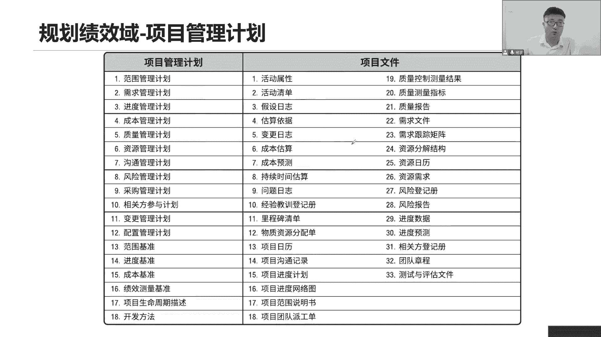
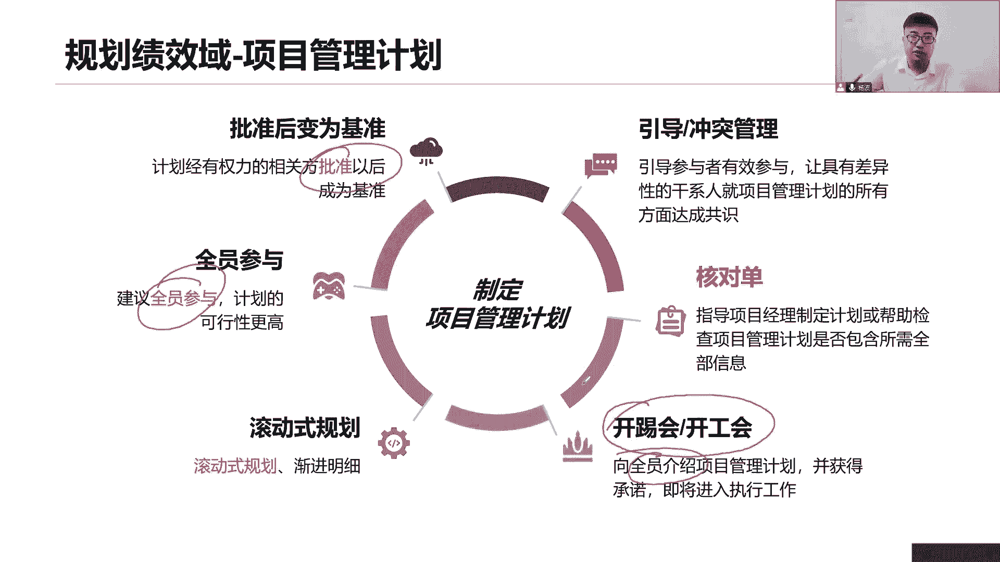
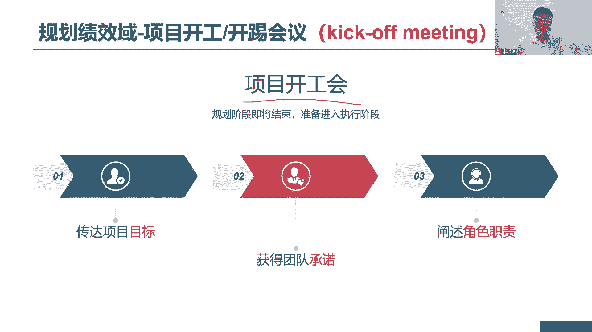
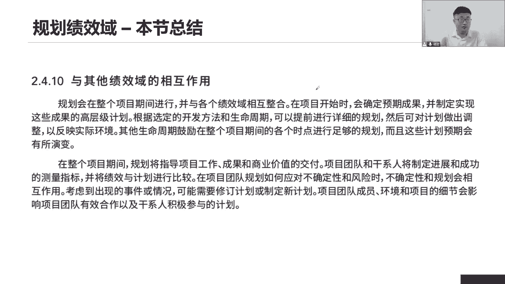
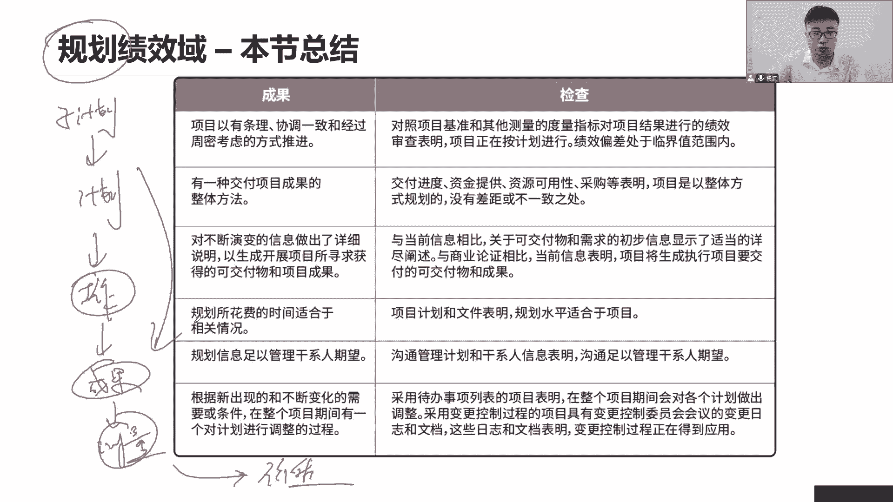
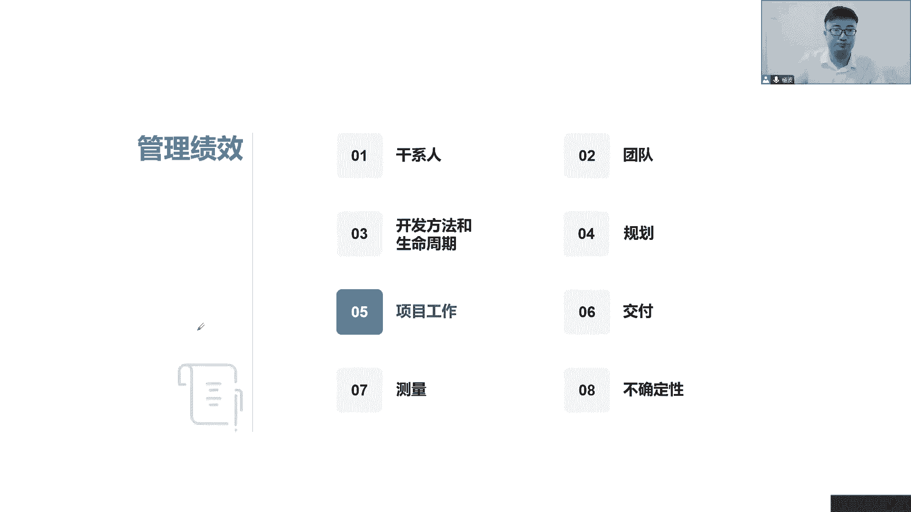

# 全新录制PMP项目管理零基础一次顺利拿到PMP证书 - P28：PMP精讲规划绩效域-项目管理计划 - 北京东方瑞通 - BV1qN4y1h7Ja

接下来我们来看看这个内容，就基于我们前面规划了一系列的内容啊，基于规划一系列容，哎呦，你看好多这些计划，是不是前面我们说在规划的时候，已经全部全部都是那个窝点出来了，变更管理计划。

刚刚讲的还有配置管理计划也是一样的，如何去配置这个如何去变更需求管理计划，如何去变更，如何如何去什么收集需求，定义需求，以及我们各个领域的子计划全都有了，在这里面，所以这些仔细化做完之后。

我们要做一个非常重要的事情，要把它们汇总整理整合平衡，统一协调成一份项目综合的整体的管理计划，叫做项目管理计划，所以项目管理情况它的核心内容有哪些，第一个我们来分这么多，记不住，我们把它拆分开来。

我们用结构化思维来分，首先范围进度成本质量资源沟通风险，采购该系人，这是九个领域，九个领域它对应的子计划，没错吧，九个领域哦，接下来还有呢需求，变更配置我们并没有专门的一个需求管理领域，变更管理领域。

配置管理领域没有啊，以前就十个领域，抛开整合就还有九个领域，那么这三个独立的计划把它记下来，做项目得看绩效，这个绩效怎么来衡量，用基准来衡量哎，三打基准我们前面都讲过了，三大基准。

但是如果我只看一个基准，能不能够有效的衡量我当前的工作能不能公平，说，当前我们这个第一个阶段计划发出去5万块钱，但实际上我们花出去的15万15万，他说我超支了，他单看成本，他说我超支了。

你有没有考虑过点，我这第一个阶段做完之后，我其实已经在超前完成第二个阶段工作，所以我多花钱，理所当然，你应该是综合的评估，我都做了多少事情，你要看我的工作量啊，所以我们要把这三个基本打包到一起的。

综合的评估，就像我们前面讲这个WBS分解结构也是这样，中间这个这个东西是个啥，控制账户，控制账户怎么测量的，看我当前完成这些工作包花了多少时间，用了多少钱，以综合的评估本绩效，所以我们怎么去衡量。

要把它们打包成一个基准绩效测量基准，说完成了多少工作，花了多少时间，用了多少钱，以此来综合评估的项目绩效，这个才合理好吧，至于下面这些东西，你把它理解为就是一个其他就可以了，不痛不痒无所谓了。

什么开发方法，生命周期阶段划分，裁剪项目的目标都可以写，你写再多无所谓，但是我很关心的是什么，933要这四个数字是我核心的九个子计划，三个独立的计划，三个基准以及打包到一起的一个绩效测量基准。

这是我们的项目管理计划，还有呢其他信息可有可无，看你那你需要好，所以我们总结出来了当前项目管理计划，至于这游戏大队的内容，那是我们当前在规划过程的时候，我们可能会输出一些其他的项目文件。

比如说定义活动输出这些内容是，然后呢我们估算时间，我们会有什么估算的依据啊，当前成本的估算也是一样的，估算活动时间，估算活动成本是不是都会输出，你的具体的估算估算值是多少，变更有没有变更日志啊。

记录到我们变更问题写的问题，日志总结经验教训，写的经验教训登记册是吧，还有呢我们当前什么这个什么后续的文字，他已经见过了吧，是不是范围基准，所以后续都是我们当前的，要么是规划过程，要么是执行过程。

我们说阐述一些各种文件在这里面好，这些文件我们后续会专门去讲，包括这些其实很多都见过了是吧，干性能灯测好多都已经见过了，甚至有的是在我们控制过程才会输出的文件，项目上有很多的文件啊。

对于一个传统项目来说，其实我们会发现我们会写好多好多文档，传统项目按部就班一步步做事情，按计划驱动工作，所以计划也是一大堆，那你说对于敏捷来说，它会需要这些东西吗，一般来说敏捷它通常不会强调这些东西。

敏捷还要去快，怎么可能会写这么多详细的文档不行，没什么时间，至于这些文档，我们后面会专门在具体的过程。

我们会拿出来讲一讲啊，了解了解，所以项目管理计划，我们来看第一个项目管理计划经过批准之后，我们会把它变成一个基准，项目管理计划也得经过批准，你也会形成一个基准，因为你本来里面就包括了我的三大基准是吧。

这个计划记住啊，要全员参与哦，因为所有人要定了计划，把这个子计划拿过来之后，我们才能够形成一个总体的计划，全员参与了滚动式规划，这个没什么好说的，近期工作详细规划，远期工作以后再说。

体现的是我们的渐进性的工作啊，就从我们前面讲的这个制定范围基准的时候，范围说明书，Wb s，WBS磁铁里面的各项内容都是滚动式规划，所以我们整个项目管理计划也是滚动式规划，近期的工作详细的做一个梳理。

一些详细的计划，以后的工作慢慢再说，一步步来，因为这个计划我们在执行的时候，可能会遇到很多人有冲突，有冲突，不要怕引导大家达成一致，形成统一的结果，形成统一的方向，形成统一的共识。

又是你重不重要特别重要，你就说当前我们这个大椎把9533要记不住，所以我们会用核对单逐项核对打勾范围，计划有没有进度，计划有没有范围基准，有没有进度基准，有没有逐项核对与打勾确认，避免我们的工作有遗漏。

所以让我们的项目管理，计划是否包含全部的内容，我们做一个检查，这个计划一旦被批准之后，它会形成一个基准，那这个是我们希望能够开一个，具有仪式感的会议，叫做开T会，开公会来跟大家去介绍介绍。

既然是大家一起定的来，我们最终我们一起来做一个总体的介绍。

开这个会的目的是干嘛呢，开工会开机会记住它的英文名字，Kick off meeting，为什么要记kick off呢，因为很多时候我们说这个启书上，有的时候还会翻译什么启动会，大家还记得启动会吗。

项目章程制定完成后，我们会有个initial meeting是吧，但是有的时候我们的考试他翻译啊，把这个开工会也给你翻译成启动会，就是你搞不清楚了，你这个系统会是个啥意思，是这个key吗。

还是说是个initial meeting，说不清楚，所以尽可能大家去看看英文，尤其是这个开工会和启动会经常容易混淆，kick off开踢嘛，就像我们中场开球一样，裁判一吹哨，马上开始传球，传球踢球啊。

开踢开，这个会说明当前我们规划过程已经结束了，我们即将进入到了项目执行过程中，我们即将到了我们的工作绩效率了，开展工作，按照计划去开展工作，那么开这个会的目的，首先第一个给大家传达一下。

我们整个项目的目标，让大家有一个方向感，目标愿景使命都可以传达，以及获得我们所有人员的承诺，因为这个计划毕竟是大家一起来订单，获得你们的承诺，达成共识，然后呢，我要阐明一下。

基于当前这个资源管理计划里面，写的角色和职责，我在会上再次跟大家强调一下，哪些人是哪些角色，是哪些岗位，分清楚，避免未来沟通出现问题，也是希望大家，为了在沟通当中能够尽可能更顺利更畅通。

你要知道你是什么抉择，你的工作做完之后，应该交接给谁，应该给谁审批，应该找谁处理，应该找谁检查，每个人决策上只要搞清楚，那么未来我们开展沟通，开展项目就会变得更顺利，所以我们开这个会的目的其实很简单。

就是把这个项目管理计划变成PPT，在会上给大家演示演示，说我们的目标是什么，我们要获得大家的承诺，内容嘛，把内容给大家讲一讲，你获得你们的承诺，希望大家支持这个内容，并且重点讲讲。

我们资源管理计划里面写的角色和职责，以便于我们未来去开展公众，所以这是什么。

开通会集会目的在这里面，好，本章咱就做个总结了。

咱讲这一章内容讲题特别多啊，咱们对这个内容做一个总结，因为现在我们说当前我们说规划绩效率，其实就是在对我们当前跟踪，我们在讲预设性的项目，预测型的这个项目，我们会定一个项目完整的计划。

因为在传统的项目里面，我们这个传统项目我们会讲讲，以计划来驱动我们的工作，所以我们大多数都是在先把这个计划拿出来，至于我们适应性的这个适应性的项目的话，敏捷我们肯定不强调计划，我们强调自己价值。

那么这个价值来推动我们的工作，所以说难道说适应现在你们有没有计划有啊，迭代计划发布计划，只不过这个迭代计划发布计划，我们当时我们接下来没有讲，我们会留着后面后面专门讲这个敏捷的时候。

一起来梳理这个逻辑啊，如果现在再去讲，那么又搞混了，咱们一起来先做个总结，我们要做这个规划，绩效率，首先要有条理的协调一致的，经过周密思考的方式来推进这个规划，一步一步做到位啊。

我们做目的是要去交付我们的口交付成果，我们要整合出一套有整体的一个方法，就基于一个什么样的计划，我们的交付最终的成果以计划的驱动工作，以工作来交付我们的成果啊，不断的演进。

详细的说明当前我们的工作是怎么样，一步步做出来，就是成果是怎么样一步步做出来，然后呢规划所花的时间适用于相关的情况，就是说你在这个规划的时候要注意一下，我们当一个项目适不适合于当前这种项目，如果是敏捷。

你就不要花这么多时间了啊，如果是传统项目的话，要尽可能多的去做详细的计划，然后呢规划信息足以管理好干性的期望，你要知道我们做任何的工作，其实都是为了满足这一堆人的需求和期望的，那么你这个需求和期望。

在你的计划里面有没有体现出来啊，你的干性能参与计划就应该包括在这里面是吧，而你的干性能参与计划怎么来的，通过我们的需求，肝性能需求分析，肝性能就期望的分析我们了解出来，写在我们的肝性能分析测里面的。

然后呢通过我们的分类信息，我们的评估矩阵啊，参与参与程度矩阵定出我们的计划了，按照我们的参与计划，把它放在我们的项目管理计划，通过这个管理计划来驱动，来满足我们的干性的需要，所以要记住干性能参与计划。

沟通管理计划其实都是很重要的，来帮助我们去满足刚性的需求和期望，让他们能够支持我的项目，推动的项目，确保项目成功了，确保商项目项目是成功的，最后呢你看根据新出现的不断变化的一些需求。

在整个项目期间有一个应对计划，及时进行调整，这就造成我们敏捷了，对我们敏捷来说，我们后面会专门讲那么大一班四香啊，对我们工作做一些调整，然后呢如果说是传统项目的话，我们会找到CCB。

因为需求需求是范围啊，范围就要找到我的CP来评估，也就是说变更控制委员会由他们来进行尊重，并且更新我们的变更日志，更新各种文档，让我们变更控制程序，能够在整个项目期间，能够产生一些比较重要的作用。

避免出现一些进度或者说绩效去较大偏差啊，在这里，所以这就是我们整章的一个总结啊，在这里面就是物理，希望是在这个整个规划过程当中里面来，我们按照计划一步一步的驱动出来，把我们的各项子计划拿出来。

汇总到我们整体的一个项目管理计划，这些计划里面会告诉我们怎么去开展工作，以产出我们的后面的成果，所以接下来会是工作绩效率，以及在我们的交付绩效率，而且我们的测量绩效率，要去测量你的成果是不是符合要求。

以此才能什么产生我们的价值，他掌握了价值，所以我们的工作机效率，其实也是按照这个流程一步一步的开展工作。

如果适应性呢。

