# 全新录制PMP项目管理零基础一次顺利拿到PMP证书 - P29：PMP精讲项目工作绩效域-指导工作与学习1 - 北京东方瑞通 - BV1qN4y1h7Ja

同学们好，接下来我们来看下一个绩效与项目的工作，绩效预工作绩效率基于我们前面学习的规划，绩效运在规划绩效绩效域里面，我们从两个维度来说，第一个如果说是预测型的项目，传统的项目。

我们会把当前各个子细化整合到一起，形成我们一个非常完整的详细的项目管理计划，按照计划来驱动我们的工作，知道我们接下来应该如何开展我们的工作，绩效率，而另外一块内容呢，那就是我们的适应性的项目。

对于适应性敏捷这样的项目来说，我们早期会做一些产品相关的一些愿景，愿景目标价值，基于愿景来驱动我们的路线图，这个产品怎么发展，它的一个发展的路线图，基于这个路线图。

我们再驱动出来我们的发布计划可不可以发布，什么时候发布，基于发布计划在驱动出我们的迭代计划，每一个版本我们要经过多少轮迭代，那么每一个迭代我们应该如何去开展，我们更多的是以价值来驱动我们的工作，哎。

以价值驱动，我们需要各项工作运敏捷，他交付了就是价值啊，那这是我们当前规划绩效率，既然说现在有了这一系列的计划，我们的详细的项目管理计划，发布的迭代的计划，那我们是不是可以按照这个计划来驱动。

下一步的工作了，好我们看工作绩效域里面有哪些啊，包括当前所涉及的各种建立的项目过程，管理的资源嘛，做做人力资源，物质资源都要去管理啊，还有呢营造学习的环境。

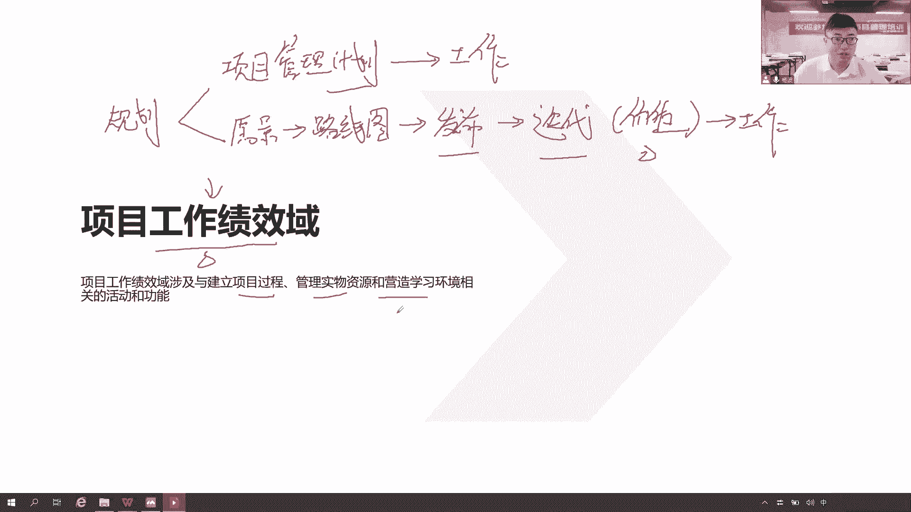

学习知识等等很多很多，所以我们说在整个工作绩效与里面，我们的主要工作就是建立一些各项工作，以及他们之间的联系，看我们的绩效，关注绩效了，前期我们定了很多的规划，知道该怎么去做这个工作。

那么现在就应该按照我们的规划，来开展以下的工作，这些工作要看他的绩效，以及如何去开展这些工作，管理好我们的各项工作，实物资源，人力资源，管人管事都要做，以及营造相互信任的氛围，以此来促进学习。

沟通和交流啊，以达到我们当前有效的一个项目绩效，所以在过程里面，我们要不断的去精益求精，改进我们的过程，精益求精，以经营的生产方式按需生产，减少浪费，提高我们工作效率，开展的项目过程，专注于当下的过程。

我们将专注当下的工作，要注意保持平衡，这个平衡是很重要的，也就是前面我们说六大制约因素，任何一个因素的变化，它至少会引起其他因素而随之发生变化，项目工作当中应该去做好整合平衡，统一协调。

接下来要开展工作，开展工作有必要的沟通，沟通的目的是什么，是希望我们这些相关方当事人，他们能够积极的有效的按照我们的参与计划，积极参与进来，促进我们项目的成功，提高我们项目成功的概率，让他们尽可能满意。

支持我们，如果当前有些食物资源没有去采购，那么就按照采购的工作来开展，把我们那些人把我们的物都给他采购回来，买过来，租过来都可以，然后以确保当前我们的项目变更，纳入到我们可控的范围，前面。

我们规划了变更变更管理计划，如何去变更，那么在工作当中，就要确保我们按照这个变更管理计划，去开展工作，也就是按照我们变更的管理过程，那么传统项目有传统的八个步骤，敏捷我们怎么去变更。

是不是通过我们的产品负责人，我们团队，我们一些变更相关方一起来开展沟通，也促进这个变更，所以很多时候我们的变更决策，是由我们的产品负责人来决策，而对于我们预测型的项目来说，通常是由我们CCB来做决策。

在项目工作当中不断的去持续学习，总结经验教训啊，总结经验教训的目的，是为了让我们工作能够做得更好，以便于未来的项目能够参考这些内容，那么学习的知识知识怎么区分，知识可以分为显性知识和隐性知识。

能够写下来，显性说不出来，大家都明白，记在我们头脑里面的我们称为隐性知识，那不管显性知识还是隐性知识，都要促进分享。

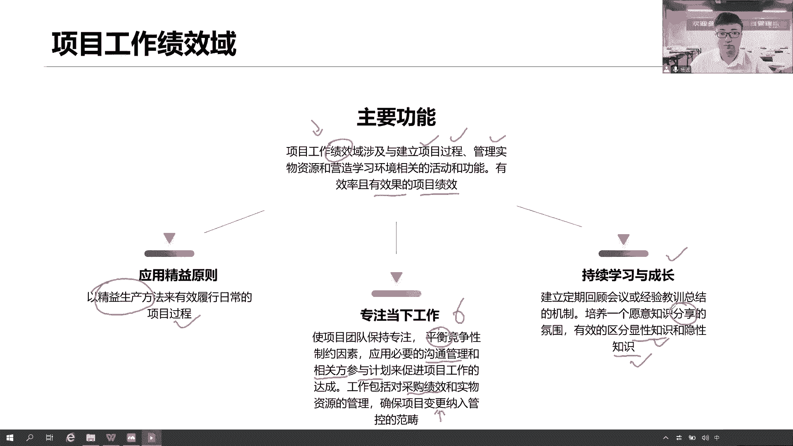

沟通交流，因为我们是一个相互信的氛围，在这个技巧里面，我们先看一些基本概念，当然说显性和隐性来自于知识层面，这块学习知识能够记录下来了，看得到的显性在自己头脑里面的，我们自称为隐性知识。

要通过大家一起分享沟通，然后还有涉及到采购相关的工作，我们前面说做采购之前，先准备好我们采购文件，包括我们的什么招标文件，采购说明书，我们的供方选择标准，独立成本估算，以及我们会开一个正式的会议。

投标人的会议来和我们潜在的卖方来帮助我们，他们对这个需求有一个统一的理解，我们做需求的澄清啊，这是我们后面再讲这个采购一次，造成非常流程的时候，会跟他去介绍，然后我们采购如何去开展工作。

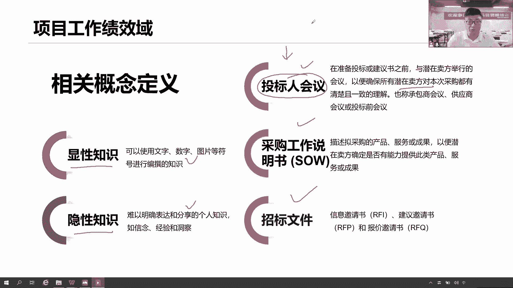

那么对于工作绩效率来说，前面都做好了一系列规划了，那接下来就应该按照这些规划来开展，后续的工作，如何去执行工作，怎么按照计划去执行，怎么才让我们工作管人管事，中间要不要看他的绩效，要看绩效啊。

以及项目做完之后，我们还会做一些项目和阶段收尾的时候，我们要做一些收尾的工作，在这里面，那这都是我们的工作绩效率要看的内容。

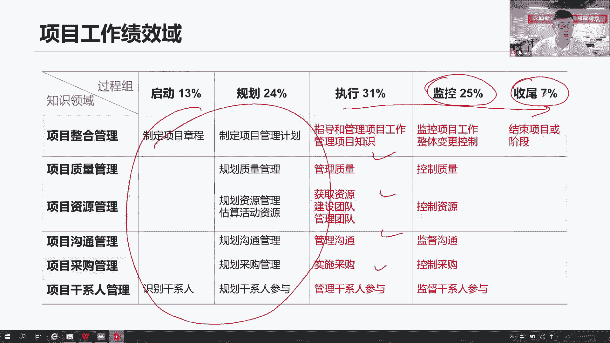

我们看第一个管理项目工作，我们应该是按对于传统预测性的项目来说，他怎么管工作，首先它是按照我们详细的完整的，综合的正式的项目管理计划，以驱动我们的工作，这是对于一个预测性的项目来说。

同时我们要执行已批准的变更请求，变更八步骤，当这个变更被批准之后，是不是我们就通知我们的团队，通知我们的QC，通知我们的供应商，让他们干活，不要干错了，我们有一些新的计划做了调整，我们应该按照新的方法。

新的流程，新的计划来开展工作，干活不干错了，同志们，团队接下来项目管理信息系统啊，这是一个非常庞大的一个集成的一个系统，我们把它称之为事故软件也可以了，那这个系统就可以为是软件了啊。

不是我们前面讲的这个整个项目框架，此系统就是一个真的可以说是一个软件系统，那么这个软件系统呢，它更多的是帮助我们有效地开展工作，高效地开展我们项目管理的工作，就类似于大家在工作当中。

我们用的肠道TPDG软，work tile等等这些管理软件，帮助我们有效的开展工作，而当前我们说这个项目管理系统，既然称之为一个大的系统，意味着这个系统里面他肯定继承了很多子系统，哪些子系统呢。

配置管理系统怎么做好版本的管理，变更控制系统怎么做好，当前我们项目的变更，它的流程怎么去监控工作，授权系统在正确的时间唉，我们给正确的人，让我们去做正确的事情，以合理的方式来开展工作，我给你做授权。

不能说大家想怎么做就怎么做，我们得有一个授权，就像我说红绿灯啊，我们交通红绿灯要给个信号，你才能走，不能说是红灯，你往前走，那就不用那违反交通规则，违反我们的规则不合规，我们的工作不合规。

会被审计出来的，所以我们需要有个工作授权系统，正确的人在正确的时间，按照合理的顺序来开展工作，系统收集系统与系统发布系统，我们当前还会收集很多一些日常的工作数据，还有呢当前我们怎么去发布我们的产品。

怎么去发布我们当前的各项文档，我们软件都可以通过发布系统，那你看这些都是我们当前项目工作当中，要用到的各项系统，以指导我们如何去开展工作，以合理的方式来开展工作，包括版本的管理，变更的管理。

授权的管理系统，数据和收集与发布的管理，还有各项的软件工具啊，那么这些工具呢包括什么，我们在管理范围，进度成本质量资源沟通的时候，还有相关方等等，各项的管理工具也可以用起来，你看质量管理工具，把鱼骨图。

流程图，直方图都可以用这个工具里面，如果这个工具里面集成了这个系统里面了，那我们就可以用，还有各种资料库，文档库，知识库，数据库配置库，那就是我们记录一些经验，总结一些经验，总结一些知识。

可不可以写在我们的项目管理信息系统里面，可以吧，怎么开展沟通，也可以按照项目管理系统里面的一些沟，通工具来开展，都没有问题啊，接下来当完成一些工作阶段或项目的时候，我们肯定会产出成果，那么按照计划干活。

干活得有成果，这个成果就是我们的可降服务，我们的结果，在执行过程当中，我们说从每个执行过程中去收集，我们的原始数据，收集系统收集数据，你这个收集收集收集啥，一个是收集的结果。

还有呢我们得收集一些各种工作的一些数据啊，原始数据基于这些数据，我们要做一个什么分析了，什么分析偏差，分析原始的数据和我们当前的什么计划，要进行比较，既然说有了一个计划，按照这个计划就要去开展工作。

如果我们的工作绩效数据和原始数据有偏差，就要分析这个偏差有多大，在不在我们的控制临界值之内，它的偏差程度有多大，为什么出现这个偏差，怎么去解决这个偏差，那这次工作记下信息了。

要做进一步的分析统计加工和处理，变成信息原始数据，这个数据是原始数据，没有任何意义和价值，我们要经过分析挖掘处理啊，变成信息，信息才是有价值的，而这个信息要知道，我们项目里面各个领域都会有一些信息。

至少有九个领域，这九个领域的一些信息，我们都会把它统计出来，因为九个领域它都有对应的子计划，原始数据和子细化做对比，以形成各个领域的偏差信息，这些信息再交给项目经理，你来做整体的把控，你要做整合。

只有你可以站在项目整体的角度，去思考这个问题，就当前这些各种迹象，各种偏差，我们怎么样，可以体现出一个最好的一个解决方案出来，以满足当前的整体偏差，以解决当前的一个整体的问题，我要做整合了。

找到一个更好的解决方案，提前出来，已写在我的工作绩效报告，也就是我们说的状态报告，那再通俗一点就是各位同学们，你们工作当中的周报月报，这就是要向领导汇报工当前整个项目进展了啊，这是整合整合成一期。

变成一份综合的正式的报告，根据我们的沟通管理计划，邀请我们对应的人，在争取的时间传递我们这个工作，绩效报告的核核心内容，在整个项目生命周期里面，如果说项目过程中出现了问题，这个偏差是不是问题，是啊。

你的进度有偏差，成本有偏差，是问题，我们的产品会不会有问题啊，当前产品有各种缺陷，这些缺陷是不是问题是，那么问题应该怎么处理，是先应该记录下来的，记录在哪里啊，问题是你记录当前我们所遇到的各种问题。

不一致，甚至冲突都可以使不理解，也可以是各种问题记录下来，然后呢，我们会按照我们问题的处理方式，来开展后续的工作，待会会讲问题怎么处理，如果在开展项目过程中发现的问题，要怎么去解决问题呢。

不能说直接去解决问题，那不对了，既然前面我们定的变更管理计划，那这个变更的形式还记得吗，四种形式，一个呢是我们的预防措施，第二个呢九等措施，这两个措施都是在解决绩效的问题，绩效有偏差，第三个呢缺陷补救。

那这个缺陷补救补救的是啥，补救的是这个产品的缺陷，那么产品我们发现了问题，要不要改改，怎么改，走流程，提交正式的变更请求，按照我们的变更控制程序，交给项目经理实施整体变更控制，在这个过程中。

我们要去综合的考虑，就这个问题的解决方式，对我们当前项目的整体的范围的进度了，成本的质量和资源的沟通的风险呢，有没有影响我们要做综合的评估啊。

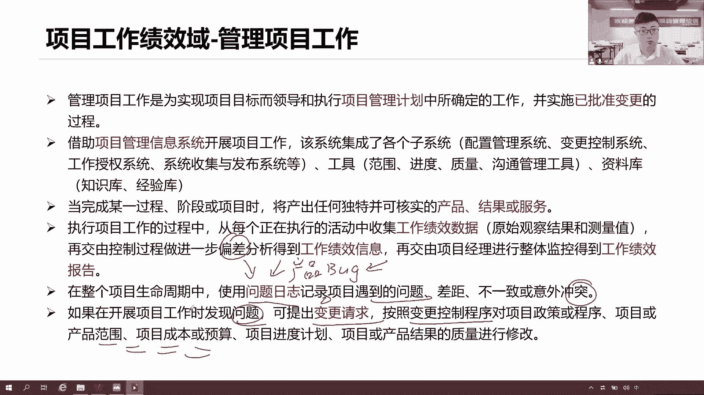

所以这就是我们大家要做实施在里面给控制了，他们看刚才这个工作绩效的是数据流，这个工作计算数据是什么呢，首先我们会在工作当中产生原始的数据，今天我完成了三个功能，今天我花了1万块钱，1万块钱。

今天我发现了五个缺陷，今天我提了三个变更，那这些都是为了原始的绩效数据，原始的我做了什么事情，做了什么，就是什么实际的数据，那么这些数据是不是应该，和我们当前各项的一些计划，基准指标进行什么对比。

一看中间是不是符合要求，有没有偏差，找到这个偏差，以及为什么产生这个偏差的原因，我们把它形成一个信息，一个有用的信息，那么这个信息是谁来做呢，当然是九个领域里面的各个控制过程。

九个里面它都有对应的控制过程，这个控制过程目的就是拿着我的计划，以及我的原始的数据，我们要把它通过一些分析加工处理，以形成我们的工作绩效信息，还有呢当前如果有问题，我们可能会走流程，走什么流程。

变更流程，因为这个绩效也偏差，绩效的偏差本身就是问题，是问题，我们叫做缺陷，我们要做什么，当前这个纠正措施有可能是预防措施，也有可能是九等措施，来针对我们当前的一些绩效，各种偏差，好了。

九个领域里面都会有一些对应的绩效信息，那么这些信息应该交给一个人来做整合，统一协调，把这些信息汇总到一起，已形成一份综合的报告，我们可以把它称之为状态报告，什么状态，这不是我的状态，是我们项目的状态。

当前项目的一个进展，把这个项目状态报告一，把当前汇编各个领域的绩效信息汇总到一起，当前有没有偏差，从而来分析如何去解决这个当前的整体偏差，我们要提炼出各种备选方案，让他选择一个性价比最高的方案。

并作为我的执行方案，同时我们还要看未来我们趋势，整个项目的发展趋势是什么，那这些都会形成一个综合的报告，写在我们的状态报告里面，把这些综合的信息已按照沟通管理计划，传递给正确的干系人。

让他们了解我的项目，从而支持我的项目，就是看当前他们的需求期望有没有得到满足，满足了多少，还差多少，希望他们能够继续支持我的项目啊。

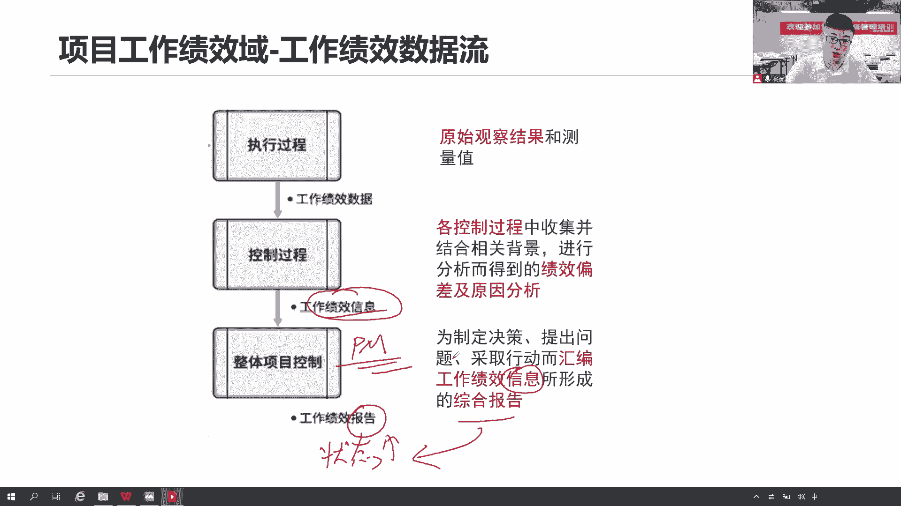

你看工作绩效数据数据数据一定是原始的数据，包括哪些当前的各种关键指标啊，以及当前变更的数量，缺陷的数量问题有多少啊，什么时候完成实际的完成情况。

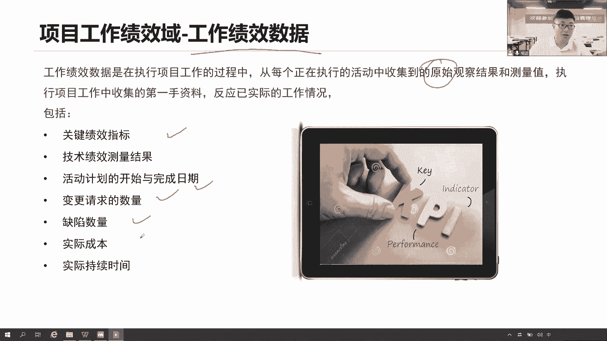

实际的挖出去的这个情况都有原始数据，没有经过分析，那么经过一些一系列的分析之后呢，我们就把这个数据转化成了我们的信息了，这个信息那就它就具备一些很多内容，包括当前我们有哪些偏差。

我们偏差的严重程度达到了什么，是不是已经超出了我的控制临界值，想想回忆一下同学们，我们的控制临界值，是不是来自于我们的风险偏好，主观的偏好转化成客观的临界值，这个临界值在什么范围之内，我们可以接受。

可以接受，那就不要着急变更，如果说超出这个临界质量不可接受，那就赶紧提交变更请求，走流程去改改我们的绩效，改我的问题，所以这个绩效信息怎么来的，就是把当前的数据和我们的计划做比较，已形成偏差。

并且找原因，那么这些是什么工作技巧信息，根据这些信息，我们提交我们的变更请求，去纠正当前和整体的偏差。

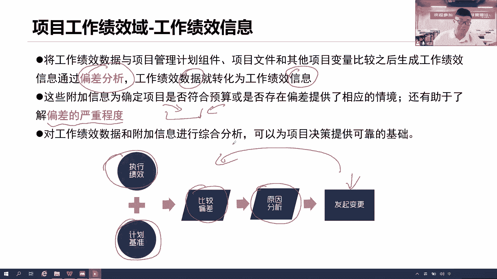

接下来我们要形成报告，要形成这个综合的项目状态，报告的话，我们会做这么六个分析，首先第一个项目的政治分析，政治分析就是看当前的绩效，看当前的整体，我们的PV，我们的EV，我们的AC，这是绩效，哎。

我们在规划的时候，我们应该会形成这些机效，然后呢接下来看当前的计，当前计划完成多少工作是吧，我们已经完成了多少工作，我们实际花出去要多少钱，那这些是我们当前的绩效，那么这个绩效和我们的计划有没有偏差呢。

原始的绩效和我们的计划有没有偏差，通过偏差分析来衡量是否有偏差，偏差程度有多大，那么有偏差是什么原因导致这个偏差，我们要从根本上找到这个原因，你看它的偏差原因是什么，那找到原因之后，就要解决这个问题。

但是解决由多种方案去解决，有哪些方案去解决，再次强调备选方案，我们项目管理和原则一个思维方式，在这里面，我们尽可能提出多种方案，不能把这个方案只提一个，那如果这一个不生效，那就有问题又要返工。

所以这个时候我们会提出多种备选方案，有这些方案都可以针对这个原因，以解决这个偏差，那么到底选择哪一个方案呢，我们会通过成本效益分析，来选择一个性价比最高的方案，如何选择这个方，为什么。

因为它能够最好的帮助我们去解决这个问题，投入最少成本，花最少投入最少资源，花最少的时间，能够快速的看到这个效应，看到这个收益，那这就是个最好的办法，那除了刚看当下，还要看未来。

所以我们要基于当前的绩效来分析，分析未来我们整个项目绩效发的一个发展趋势，它的一个态势是一个什么情况，哎这就是六个核心的分析工具，先看看我们的绩效如何，接下来绩效，原始的绩效和我们当前的这个计划做比较。

你看有没有偏差，为什么出现偏差，有哪些方案可以解决这个偏差，以及最后选择一个方案出来，同时未来我们的绩效，又是朝着一个什么样的方向去发展的，诶按照这个逻辑，我们把这六个分析工具啊记住。

就像我们平时咱们说这个生病了，去看病也是一样啊，哎当时我发现我感冒了，我这个体温和正常体温有偏差，有偏差，那我找原因啊，为什么这个现在有点发烧，感冒发烧为什么发烧找医生啊，医生给你看病啊。

让让让你去怎么查询是吧，让你去怎么查体温，去去检做，做各种什么检查，什么查查之类的都可以，这个讲完之后，他就会给你找到原因啊，原来你可能是因为这个什么病毒的感染，急性的什么肠胃炎之类的，导致你的发烧。

那么问题就是说这个原因找到了，我们应该怎么去解决呢，医生跟你说，你要么输液能不能接受，要么打针可不可以，要么这个什么吃药，或者说其实也没啥啊，你身体好，年轻人，你扛也可以扛得过去，就给你这四种方案。

你应该怎么选输液，这个太慢了，是我们平时白天还要上班呢，太慢了，打针不行啊，这个我怕痛了，这个硬扛太难受了，受不了，哎呀这个体温发烧，大家都很太难受了，很难受，很痛苦，接受不了，于是我选择什么吃药啊。

我有病，我吃药吃药解决问题吗，慢慢来恢复啊，多注意休息，那我这种通过我们这个成本效益分析，我选出来我就吃药，那么吃完药之后呢，未来能不能更好，我可能还要做个趋势分析，那有时候医生可能会带你去复查。

看看当前这个吃药有没有效果是吧，那我去趋势分析，那这个吃了药之后如果没效果，未来应该朝着什么方向去发展，但是你的实际情况是什么，我们还可以再做分析，再做偏差，再来是什么，当前后续的一个就是不断的去监控。

你的一个监控你当前的一个状态，身体状态就像我们项目也是一样，我们项目也是按照这个方式，不断的去监控我们的工作啊，监控监控嘛本来就是什么。

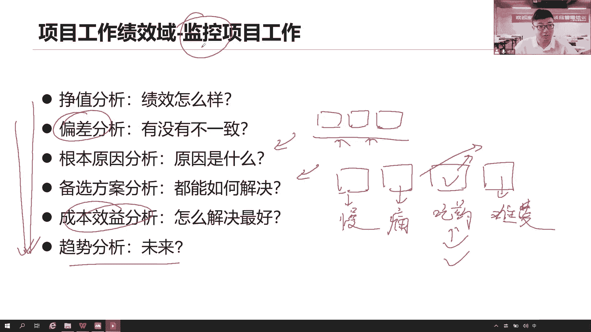

要不断的去做这个工作的最后一期，形成我们的工作绩效了报告，也就是我们说了状态报告，那这个状态报告，他汇总了当前我们各个领域的工作绩效信息，汇总到一起，它包括哪些内容呢，包括当前面各种呃正直的是吧。

嗯质量的缺陷的，还有那什么风险的，采购的各种信息在什么范围，进度成本质量资源构成风险，采购相关方都有，都在这里面，那除了当前这个信息，我们做了分析之后呢，那我得找到一个更好的解决策略啊。

我只采取什么行动来解决这个问题是吧，通过你的备选方案，选出一个最佳的行动策略，然后除了看当下，我还要看什么，看未来未来我要做个预测，当前我们的这个未来趋势朝着什么方向去发展，我要不要采取一些预防措施。

以避免未来出现严重的偏差在这里面，然后呢按照我们的沟通管理计划，把这些各项内容在会上，向我们的干系人做一个汇报，让他们能够看到我们当前的工作绩效，一个状态是什么，如果不能来的。

我们可能会是通过邮件的方式把它发送出去，那么至于沟通方法，我们前面说了有很多种，要么就是交互式沟通开会，要么就是推迟沟通，我给你发过来，要么就是我把它放在一个网盘里面。

你们自己去取拉动拉动式沟通都可以啊，好这就是我们当前的一个工作状态，报告状态报告核心内容，就这些核心内容，当前整体的绩效，未来的绩效以及有哪些方案我们可以去解决，所以未来同学们你们写周报怎么写。

是不是应该可以包括当前我们各项的一些绩效，信息范围进度成本质量，资源沟通风险，采购干系人以及有哪些备选方案，这些备选方案，我们到底应该选择哪一个行动措施，还有请不要忘记了预测一下。

因为很多领导他知道你当前有些问题，这是已经表现出来了，那么他关注关注的是什么，未来这个项目还能不能持续开展，未来这个项目还能不能够持续产生什么收益，产生效益啊，干系人这些利益相关方，他们的利益在哪里。

利益在这里，这个效益能不能够持续产生，能不能够持续放大，你当前项目绩效确实不好，但是我更关注什么，未来我们的绩效又是朝着什么方向去发展，你有什么对策，让未来能够更好地开展工作，不要出现当前这样的偏差。

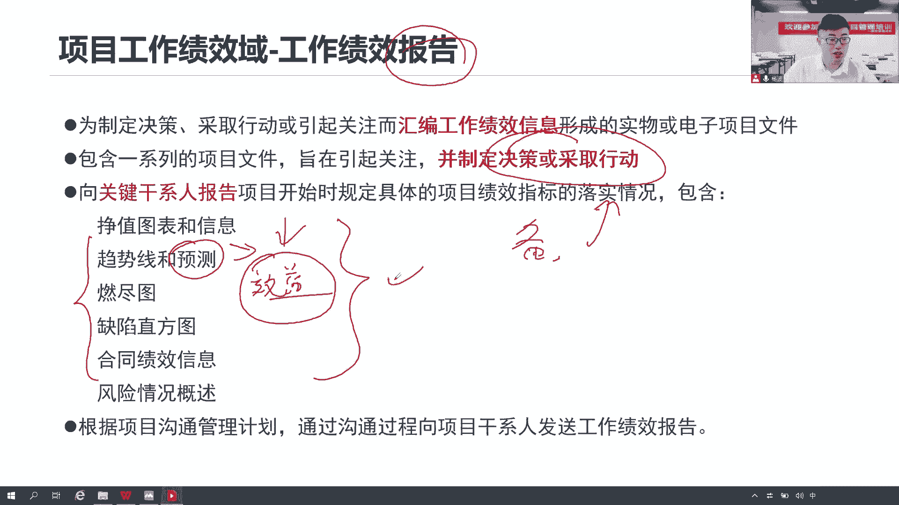

这是他们比较关注的电影，那么有问题我们会记录在问题日志，那这个问题是就是记录下来，把谁在什么时间发现了什么问题，有什么方案可以解决，哪些方案提炼出来，最后选择哪个方案，这个问题有没有解决，谁解决的。

这个人就显得很重要了，任何一项工作，我们前面说都WBS下面的工作包，是不是要确定一个责任人，包括活动是不是也应该确定一个责任，这些工作这些任务应该谁去做，出了问题应该谁去解决，想想回忆一下。

前面我们在讲资源管理，规划资源的时候，有没有这个举证责任分配矩阵，对应的某一项任务要和这个人他的责任对起来，这个责任是什么，就是个负责任，你得负责啊，这个责任归你管，这个事情归你管。

我们我们通常这个分配任务不能说张三李四，你们俩把这个问题解决一下，那这话说很明显，这个问题解决不了，到底是张三还是李四啊，有可能我们重复做这个事情，浪费资源，浪费资源，有可能我们都不做，他以为我在做。

我以为他在做，甚至出了问题，未来这个问题没有解决，这不是我的问题，他的问题，他说这不是他的问题，是我的责任，互相推诿甩锅，那为了避免这一系列的问题，我们就应该说张三你主要负责这个问题。

李四你来协助解决这个问题，你看这话说出来不就职责很清晰了吗，谁是责任人以及问题解决实现啊。

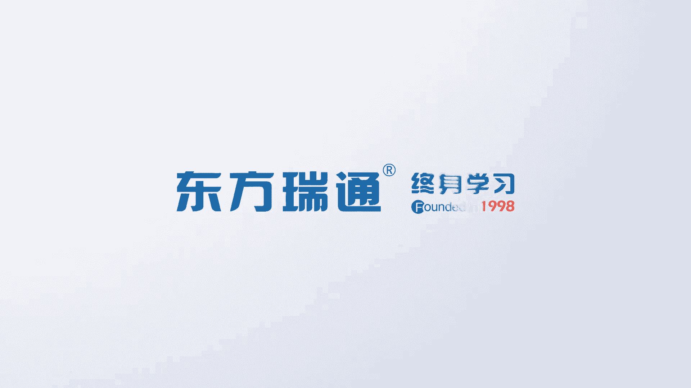