# 全新录制PMP项目管理零基础一次顺利拿到PMP证书 - P3：PMP精讲课价值交付系统 - 北京东方瑞通 - BV1qN4y1h7Ja

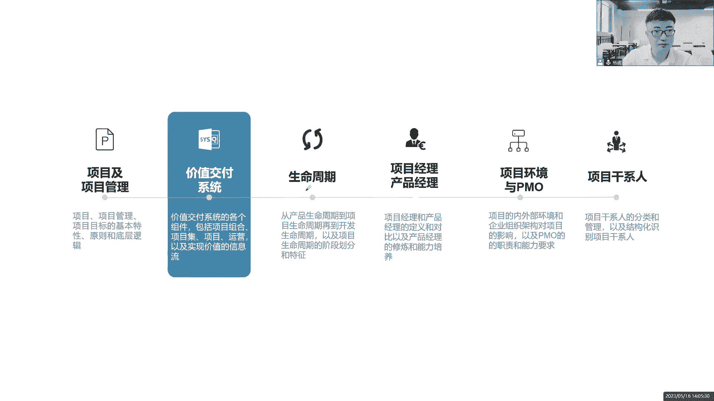

接下来我们看下一个概念，项目组合管理好。

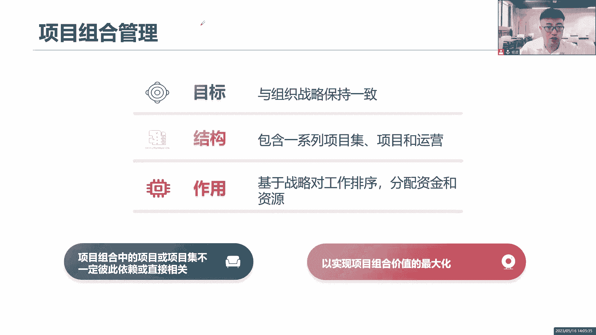

这就是一个新的概念了，为什么要讲项目组合管理呢，是因为我们在这里你看价值交付系统，我们现在要去进入到价值交付了。

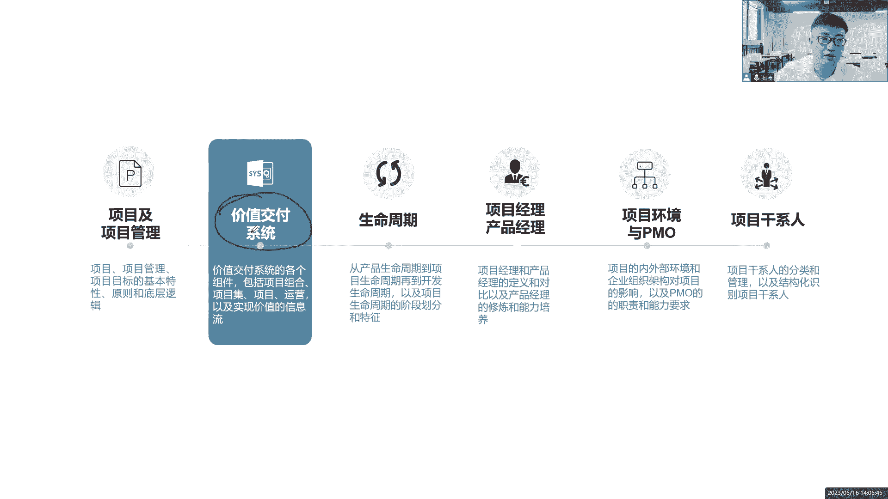

做项目你是不是要给我们企业创造价值，这个价值怎么交付呢，它有哪些组件呢，首先来看第一个组成内容，项目组合管理这个概念是啥意思，没见过，我们还是举个例子来说好呃，举个什么例子呢，就以我们当成前面说的。

我们要开一家汽车工厂，诶我们生产汽车哦，很厉害，我们的愿景和使命先拿出来，我们是全球最大的汽车服务供应商，我们是全球最大的汽车供应链，我们是全球最大的汽车车载服务提供商，可不可以啊，可以啊。

全球最大的汽车配件物流供应商都可以，全球最大，你看我们的愿景，我们的使命多大啊，或者说我们有句话，我们不生产水，我们只是大自然的搬运工，熟不熟悉啊，这是谁的广告，这是谁的愿景和使命啊，农夫山泉有点甜。

不就是这就是愿景使命吗，那么为了实现这个愿景和使命好了，为了实现这个愿景，我们是生产汽车的，全球最大的汽车配件生产商，有了这个愿景，有了这个目标，有了这个使命，接下来我们是不是要定战略了。

短期目标是什么，中期目标是什么，长远的目标又是什么，这就是战略诶，我们也有一个5年计划，10年计划，15年计划，这就是战略了，基于这个战略，现在我们要去开展，我们要去生产汽车，那么生产汽车。

首先咱是不是得先把这个汽车厂修建起来，建厂啊，我先选一个地址，选址选址之后找我们的政府部门，环境部门审批，要到文件，然后呢开始建厂，那大家知道这个舰长，是不是当前我们组织的战略的第一步啊，我先做建厂。

于是乎我们组织就把他那些人力物力，财力精力投到我们这个建厂工作里面来，做这个项目，这个项目我们开展项目建厂，然后呢我们搭建这个什么生产线，搭建生产线的目的是为了生产汽车好了。

既然说现在我们建厂生产线也搭建起来，这个搭建生产线也是项目，都是项目，那现在我们就具备了生产汽车的能力了，那于是乎现在我们就开始做事情了，做什么事情，生产批量生产，每天生产，天天生产，持续生产。

这是什么运营，因为我们现在组织战略变了吗，变成生产汽车了，于是就把我们组织的人力物力，财力精力又投入到运营里面去了，因为常见完就完事了，我们就把另外的这些精力，时间成本投入到运营里面去开展工作。

好生产这个汽车，但是现在我们生产汽车，发现这个市场有变化，这个市场对于这个新能源汽车的需求比较高啊，客户对新能源汽车比较高，但是我们这个厂，现在不具备生产新能源汽车的能力，于是乎我要改造生产线。

那么大家说改造生产线是项目还是运营，是不是项目它依然是项目改造生产线，让我们具备生产新能源汽车的能力，于是组织战略变化了，当前我们经常说要改造生产线，于是就把人力物力，资金财力投到改造生产线里面来。

当我们这个生产线改造完了，是不是我又可以开始生产了，哎于是我们组织战略又变了，大家应该要加紧生产我们的新能源汽车，因为市场需求很紧迫，市场我们的市场需求非常大，我们要尽快的占领市场。

这是把我们的人力物力，财力资源投入到生产新能源汽车，也就是说现在我们公司既在生产普通的汽车啊，这个头石油了，又在生产我们新能源的汽车，都在持续的运营，持续的开展运营。

那么大家有没有发现在整个管理过程里面，我们的资源精力，资金物质资源都是在不断的发生调整的，怎么调整，那就看你的这些工作，这些都是我的工作，建厂生产改造又是生产，全都是工作，这一系列的工作。

谁更符合我的组织战略，我就把当前我们企业那些优秀的资源，资金投入进去开展这个工作，让他能够尽快的完成，以实现我的组织战略目标，以创造价值这种管理方式叫什么，项目组合管理，大家听懂了吗。

根据我们这一系列的工作，它的战略优先级来调整，我们组织的一些资源和资金的分配情况，也就是说说的通俗一点，总结一下，对这一系列的工作，我们做一个重要性的排序，以组织战略为导向来进行排序，谁更符合组织战略。

谁更重要，既然你很重要，我就把我们组织的一些资金和资源，不管是人力资源还是物质资源都分配给你，让你能够尽快的完成，让你能够更好地去完成，顺利地完成，以符合组织战略，以创造价值，这就是项目组合。

所以目标与组织战略保持一致，对他就是跟我们组织战略息息相关的，只要战略发生变化了，我的组合肯定会随之而发生变化，我的管理方式会随之而发生变化，因为我看你这个组织战略，你想做什么，我就去关注这些工作。

哪些跟你的战略相符合，所以一旦提到战略这个词，我首先想到的是项目组合管理，他为了实现组织战略目标，而开展了一些排序的工作，项目组合里面它包括了很多的工作，你们看见我前面说了哎，有建厂，有改造生产线。

这些项目还有持续的运营，以及还有相机诶，这个又是什么概念呢，马上就讲到，我们后面就会讲到他作用是什么，基于战略，对我们这一系列的工作任务活动，做一个优先级的排序，已分配我们组织里面稀缺的资金。

现有的资源分配给他，这就是项目组合，它的作用，项目组合里面的项目或项目级，不一定彼此就有依赖关系，也就是说这里面的这一系列的工作，他们彼此之间可以有关系，也可以没关系，啥意思呢。

你说我现在在考取偏僻学习偏僻考取认证，可能有的同学说我考完这个pp之后，我会去学习一下敏捷，有可能我会再进一步的深造，学习高效，或者说我们学习pg mp项目集管理有没有关联，必然有非常强的关联性。

因为它是基础啊，PMP它是基础，你没有这个基础，你怎么学习后面的知识好了，有的同学说我学完P之后，我想考一个教师资格证，我想考一个厨师资格证，那请问这些跟我们p mp项目管理有关系吗，那没啥关系了。

你们之间没有什么依赖关系，在这里面，那你说我这个我还有生活啊，我还有运营啊，我每天要生活，我每天要上班啊，我每天要睡觉，这都是是不是运营的工作啊，我还要谈恋爱，我还有很多谈恋爱的事情。

那请问现在你又要开始做组合了，哪个是你的优先级最高，有的同学说我现在优先级最高的是谈恋爱好，你把你的时间精力资金投入进去，今天看电影，明天吃海鲜，后天计划去爱琴海，可不可以啊，可以啊。

如果说你说当前你的经历，你的优先级是学习pp好了，那你就少玩游戏，少看抖音，少刷视频啊，少看电影，把你的时间把你的精力，把你的资金投入进来，大家说这是不是项目组合管理，在生活当中我们也在做组合管理。

那就看谁的优先级更高，我就先开展什么工作，那就这个意思啊，这里面有些工作相互依赖，有些工作没有任何的依赖关系，在这里面，为了实现组合价值的最大化，我们要去开展我们的组合管理。

以实现我们组织战略的目标价值最大化，那既然说到项目集，我们就来看看吧，什么是项目集管理，项目集管理员，他就说更好的管理项目的依赖关系，也就是说我这个A项目和你这个B项目，我们之间是有依赖关系的。

我们之间是相互依赖，相互制约，相互影响的，我们把它纳入到项目集合里面去管理啊，一个是组合，一个是集，它包含了一系列的子集，或者是项目，或者说是运营都可以，它的作用是用来协调资源M协调资源啊。

协调资源的一些竞争冲突，影响制约，协调资源，怎么去理解呢，你说两个项目之间有依赖关系，举个例子，这是一个项目，小孩子上小学又是一个项目，那么请问同学们，这两个项目之间是否有依赖关系。

大家思考有没有依恋关系，我要买房，我的孩子要上小学，有没有依赖关系，必然有，是不是这些什么学区房，什么鬼，不就是因为他们在一起，所以出现了吗，是不是啊，而且还贵的要死，那他们怎么相互依赖关系诶。

你买房子，两个人刚刚结婚在一起，相互比较有好感，我们决定了买婚房，哎我们看到哪里啊，离这个购物中心比较近，我们随时可以去买东西，可以逛商场，把这个环境还不错，挺热闹的，周边买买买就买，这还不错。

根本就没有考虑过你们的未来，你们还有小孩子，你们小孩子六岁七岁还要上小学，没有考虑，但是如果真的到了那个时间节点，估计还没有到这个时间节点，你就开始忧虑了，我又要买房子了，因为什么上小学啊。

跟你的户口相关联啊，跟你这个买房的地域是相关联的，这个地区这个区域上什么小学，那都是规划好的，不是你想上哪里就上哪里的，就看你的户口落在哪个地方，是不是，如果说我们能够提前想到这个点。

那你在买房的时候是不是就已经考虑到了，未来我们在一起，我们结婚在一起，不是为了一时高兴，我是想和你长远的走下去，我们想组建一个家庭，这个家庭得有孩子，孩子到他之后会上学，我们得考虑这一点。

所以这个房子买在哪里，花多少钱，怎么规划，我提前纳入到项目机里面，以避免未来我还要重新考虑买房，我还要重新去做装装修，我还要把之前的房子卖掉，重新买一个新房子，来考虑小孩多麻烦，浪费时间，浪费精力。

浪费成本，我们做项目企业的管理是为了什么，获得一些单独管理无法获得的增值收益，这个增值收益就是帮助你节约时间，节约成本，这就是增值的收益，增值的利益在这里，所以说我们要管好这个依赖关系啊，显得尤为重要。

以此来协调当年我们的资源，或者说是资金都有可能协调，这就是项目机关理。

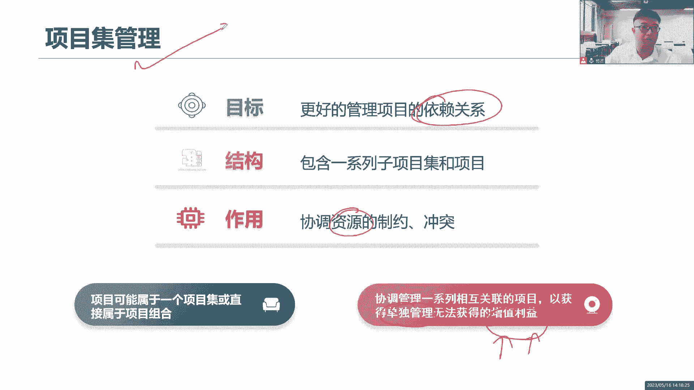

好像的项目组合，项目集我们做了一个基本的介绍了，那接下来我们来看用这个图来整合的说明，基于组织战略，我们有一个非常庞大的项目组合，基于战略来做组合管理，把我们企业所有的工作全部纳入到一起来，一起管理。

看谁更符合组织战略，我们就把资源优先分配给他，那这么多的项目，有些可能是一个单独的项目，它并非是属于某一个组合，某一个级啊，它是属于我们整体的一个大战略，下面的一个组合。

有的项目呢它们两者之间必然有依赖关系，那我们赶紧纳入到项目集里面，如果你觉得这个项目集太大了，你分成项目子集，可不可以，完全可以，你觉得这个组合太大了，你分成子组合在这个子组合里面。

可能有些项目级或者子集都有可能，然后把这些一系列内容纳入起来管理好，都可以进一步的细分细分细分，你只有细分分解到位了，分解得更小，才能便于你去管理啊，你太大了，怎么管这么大的一个集合，你怎么去管。

继续分解，继续分解，有些是相关的，有些不相关，你把它剔除出来，所以你看这里啊，运营是不是跟我的项目及相关，也跟我的项目组合相关，运营一定相关的，是不是，然后呢，不管你是项目项目还是项目组合。

反正你们共享是我组织的一些共有资源，稀缺资源，我们组织的资源就这么多，不可能保证你们每一个项目都有充足的资源，你们想要什么就要什么，那做不到，有些资源非常的稀缺，什么高级架构师，高级QA。

然后高性能的服务器，我们那些什么会议室，多功能会议室是你想要就可以用吗，你要排队啊，因为有的其他项目他们正在用，是不是有的时候想要去企业里面要人，真的很麻烦，要不到啊，他们很忙，正在开展其他项目的工作。

要一台电脑，要一个笔记本，要一个什么会议室都很难，很难，你还提前去预定，因为这些资源很稀缺，不是我们想要就要的。

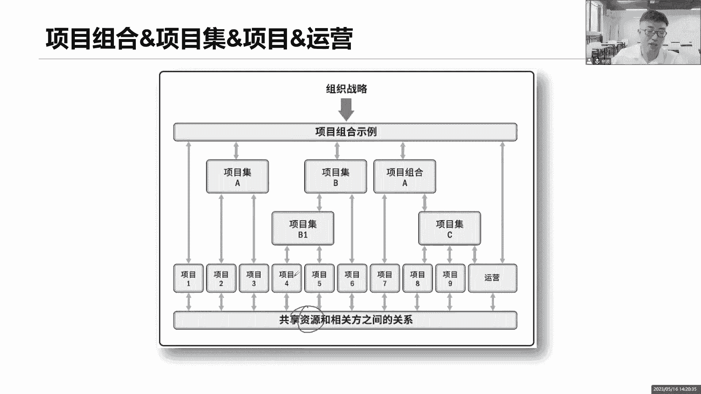

共享所有的稀缺资源，来我们一起通过这个表格来区分一下，项目集和项目组合，项目集说了这个项目集里面的各项工作，不管是运营还是项目，他们必须一定务必有内在联系，而项目组合呢可以有也可以没有，那无所谓了。

反正把这些所有东西打包到一起，我管你有没有关系，我只看你们的战略优先级，我不关心你们之间有没有关系，有关系，那就是你项目主要考虑的事情是吧，我们的目的是什么，已获得单独管理，无法获得了增值的收益。

节约时间，节约成本，节约资源，协调资源，而我们项目组合呢它是更有效的去分配资源，根据我们组织战略的优先级来分配我们的资源，项目集管理的是依赖关系，项目之间的依赖关系，项目组合它管理的是什么，战略优先级。

对基于战略优先级来对我们的项目做排序，以便于分配资源，那你其实你也是在管理分配资源，只不过这个分配资源，你并没有考虑到组织战略层面，你考虑的只是这些项目之间的依赖关系，根据依赖关系来分配资源。

我也在分配资源，只不过我考虑的是组织战略的优先级，来确定到底谁重要，谁不重要，所以我们项目级如何把这个事情做好，项目组合呢怎么做比较好，我来规划，为了整体的规划好。

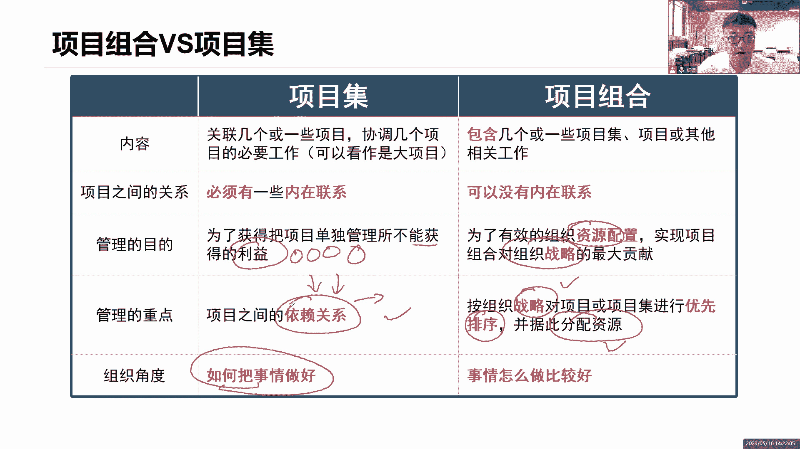

接下来我们看下面一个概念，运营的运营和项目之间严格区分，咱先把严格区分，这是我们整本书最底层的逻辑，项目就是项目，运营就是运营，你们俩是严格分开的啊，那么运营干嘛呢，你是持续开展工作的。

保证业务的高效运作，降本增效啊，你也得考虑这个点，那运营也是为了支撑我们日常的工作的，是为了实现业务的战略目标而开展的手段，所以你看其实不管是项目还是运营，是不是我们都是围绕着组织战略。

而开展了一系列的工作呀，是不是我们开展了一系列工作都在这里面，你们都是为了服务于实现于我的组织战略目标，而开展了一系列的工作，在这里面，那其实这就是我们项目和运营的共同点了对吧。

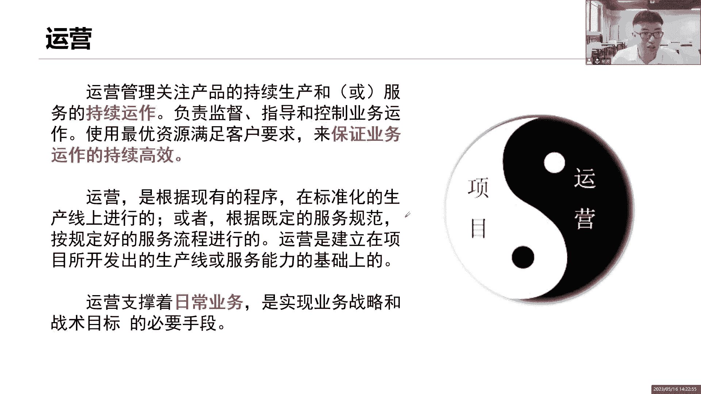

是我们共同点诶，那说到共同点马上就来了，第一个实现组织战略的目标的一个工作，在这里面，这是什么共同点啊，这是我们共同点，还有呢我们项目和运营都需要什么规划，先把计划拿出来，按照计划去执行。

在执行的过程中不断去监控绩效，项目要做，你运营也得做啊，虽然说你运营是持续的开展工作，但是你也得有一个运营计划，按照计划来执行，我们要监控你的绩效，是不是你真的做到了降本增效，这就是你的绩效。

我要去监控，那不管是什么工作，你这个由人呢总算是必须的，哪怕说是机器人，那也得有人来管控啊，那还是人，我们还没有发展到什么，我们全部靠这个机器人来操作，还没有到我们未来这个世界，我们还是当下这个世界。

有人来说人是什么资源，人是不是我们企业的资源，那么这个资源受不受限制，受不受约束，受不受限制，必须受受资源的限制，哪些人能开展，哪些人不能开展，哪些人能够投入到这个项目中。

哪些人能够投入到这个工作当中来，你得考虑资源的可用啊，你得考虑资源的竞争，资源的制约，资源的约束，好在这里面，那这是共同点，然后呢，我们再来看这个交叉点是啥意思。

说项目和运营之间虽然说我们是严格的分开了，但是我们在有些时间节点我们是相互交叉的，他这么说的哈，项目和运营怎么交叉，当我这个项目做完了，我是不是应该把我当前这个项目的第一个知识，第二个资源。

第三个可交付成果交给运营，咱得移交给运营啊，让运营把这个成果按照这个姿势，按照这个知识来教我们客户怎么去使用，去部署，那如果说你不会用怎么办，咱不是还有一些资源吗。

人力资源有些可能是把我们这个项目做完之后，他会转运维，转运维什么意思啊，到运维里面去啊，和运维团队一起来开展工作，教运维怎么去处理，怎么去安装，怎么去调试，怎么去用用户指南。

配合着用户指南来教客户怎么去使用这个软件，这个产品哎，移交我的知识，把我的资源，把我的存款都给运营，这是第一个交叉，第二个交叉，反过来，当我项目要立项的时候，我是不是得考虑一下。

你运营在市场层面的一些反馈，收集的一些客户的需求意见，那你就说你要把你运营的知识，把你运营的可能会涉及到一些资源交给我项目，我来参考，然后呢以便于我去立项，开展下一个产品的更新和换代，可以吧，没问题。

这就是交叉点，我借了你两个，我还给你三个，可以吧，你看我把我的成果也交给你了，移交给运营，让运营把这个价值最大化好，这是他的交叉点啊，可加不成果，我们的知识，我们的知识还有资源。

在这个过程中来回的进行什么交接和转移。

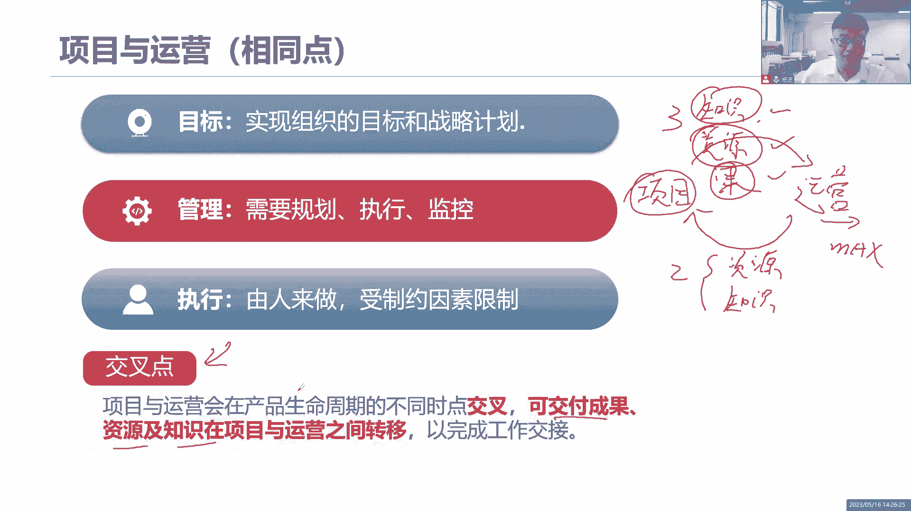

那有相同就有不同不同，对接的对标的是我们项目的三个特性，临时性，独特性和渐进明细性，那对于我运营来说，它有三个特性，持续性，重复性和标准化持续，举个例子来说，大家喜不喜欢吃肯德基，喜不喜欢吃麦当劳。

来我们就说我们现在开一家肯德基餐厅，一个炸鸡店，开这个炸鸡店呢，希望他能够持续的经营下去，不能说第一天开张，第二天倒闭，那不行，持续经营，第二我们这个肯德基餐厅啊，每天都在重复的做事情，每天重复的进货。

然后呢做我们的什么汉堡，是汉堡，画的不好哈，薯条对吧，什么鸡翅啊，不会画啊，不会画，大家知道就行了，鸡翅还有呢可乐，对不对，重复的生产，不断的生产，而且这个同样我们只能说是类似，而不能说完全一样。

因为知道这个成果它是具有独特性的，类似的，比如说汉堡，大家有没有发现，你不管什么时候去这个肯德基餐厅，你点了汉堡，哪怕你点一个点两个点三个点两个汉堡，那这两个汉堡来说对你来说都是甜的嘛。

你不是说第一个是甜的，第二个是苦的没有，而且我们每次发现这个汉堡的味道都差不多，这有什么可乐，鸡翅，薯条的味道也差不多，是不是类似于产出相同的成果，重复的开展工作诶，那他怎么样可以产出这么相同的成果呢。

是怎么做到的，因为他们有一个标准的烹饪系统，标准的生产流程，是不是生产服务标准化呀，你会觉得我们肯德基餐厅里面，都是些中华级别的大厨吗，没有吧，大多数都是些什么实习生，尤其是寒暑假的时候。

你会发现那暑期打工的很多都在这里面，他们怎么可以做出美味可口的汉堡薯条呢，因为按照这个标准的烹饪系统，这个土豆切怎么切，切多厚啊，火候是多少，烹饪多久，烹饪完之后，接下来应该是放在哪里去量。

然后呢撒多少盐，对不对，这个流程它的标准化，才能够做出相同的美味可口的食材，所以说运营的三个特性，你就想想我们肯德基餐厅就可以了，持续经营，重复的生产，标准化的流程，和我们的项目三个特性完全对立起来的。

你看是不是完全对立起来。

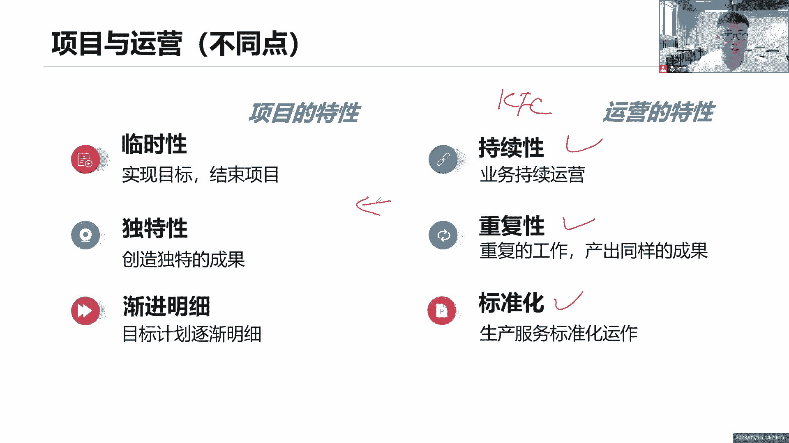

哎这就是它们的不同啊，在这里这个大家了解就可以了，接下来重要的内容来了，价值交付系统，它由哪些组件组成，这个系统大家不要以为真的是个软件系统啊，不是这个意思啊，这个系统我们把它理解为是个什么。

是一个整合，是一个框架，是个体系，我们按照这个框架来交付价值，按照这个体系来开展工作，它叫做系统，所以我们说整本书里面的系统，系统系统其实是项目整体的一个整体的概述，一个整合一个整体的一个框架。

一个体系并非是真的是一个什么软件系统，不这意思好，我们来看就这个价值加服务系统，它的组件有哪些组成，先搞清楚它的组件有哪些，我们再来说它是怎么运作的，那你看它里面是什么东西，项目组合。

项目及项目运营咱都了解了，我们都熟悉了，我们都掌握了，是不是都是我们这些组件，全都是来帮助我们去实现价值交付的，这个我们其实都理解了，你说站在组织战略层面，我们有很多个组合，很多个组合。

每一个组合下面有可能会有很多个子组合，或者子项目集或者项目集，项目集下面有多个多个相关联的项目，或者说是一些单独的项目，在这里面都有可能他对单独的项目，单独的子集都有可能，然后呢。

结合着我们所有的运营工作来开展已交付价值，这不就是我们的组件吗，都在这里面是价值交付系统，它的各项组件其实就是为了什么，创造了我们的成果，你要想创造成果，你得把这些工作拿出来做呀。

因为只有项目项目才能够产出成果，把这个成果移交给运营，我们说交叉点是不是我们的交叉点，把它移交给运营，让运营把这个价值最大化，这就是我们的价值交付系统，它的整个的一些组件在这里面。

但是我们知道创造价值得考虑什么，内企业内部的环境和企业外部的环境，怎么理解呢，企业内部，比如说我们的企业文化，我们企业的一些技术，我们企业的资产，我们企业当前一些项目的一些什么布局。

而我们企业项目那些什么，当前团队的一些，他们的部署方式是在一起还是做分布式的团队，还是个跨国团队，是不是都会影响我这个价值最终的交付啊，外部环境呢，外部的市场的法律法规，行业的竞争，外部的天气。

外部的环境，外部的商业的风险，市场的监管，都会影响我的当前最终的一个价值交付，所以说整个价值交付系统，它会受到我们内部的环境影响，以及外部环境的影响，那这些影响会直接影响到我当前对项目，组合的一个管理。

项目集的一个管理，以及这些一系列项目和运营的一些管理，都会受到一些影响好。

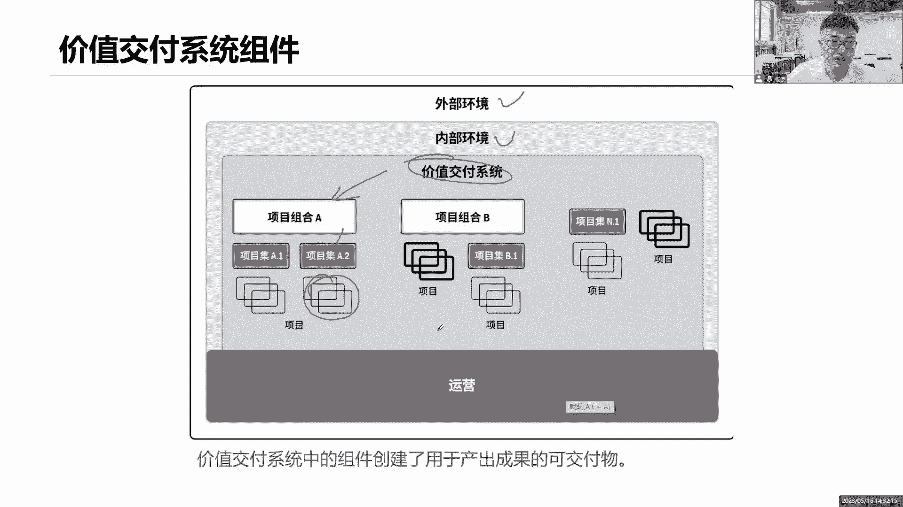

那么这些工作是怎么有机地结合起来，来创造价值，来通过信息流来看一看，首先我们说基于当前企业要想发展我们的公司，基于这个战略，我们的企业才能够长久的生存下去，并且产产出最大的价值，那一说到战略。

是不是刚马上想到组战略项目组合，因为组合组合它是关注你的战略的，基于你的战略来调整，我们下面的一系列的工作的优先级，来分配我们分配我们的资源，那么调整哪些工作呢，就是根据我们当前我们的期望的成果。

期望的利益，期望的价值，对你们当前的一些优先级做调整，对谁调整项目，几亿项目以及运营做调整来开展工作，那这些工作有可能你们现在还没有产生价值，所以我说的是期望吗，基于你们当前我所期望的结果。

我可以做个预测来预测，这些结果是否符合我的战略目标了，我来对你们做调整，所以我是通过我的期望值来调整，你们项目及项目以及运营，那么项目和运营之间是不是有交叉点，对我项目做完之后。

会把我的可加服务交给你运营，让你把这个叫可交付的价值啊，要做到最大化，没错吧，那么运营我们说是不是要反馈给我的项目啊，因为我们项目不是做一次就完了，有可能这个项目还要做什么持续的更新和换代。

于是我又把什么这个交叉点又返回来，把我的知识和我的资源又传递给你的项目，那么这个项目是来自于我们市场运营之后，所获得的一系列的什么反馈的信息，一系列信息我会交给你，让你的项目来重新调整。

那么如果说项目要调整，那就意味着什么，我们当前项目和项目级在开展工作，开展工作要不要绩效肯定会有产出，绩效肯定会说当前我项目的进展是什么，这个绩效其实就是来说，来印证我之前这个预期的期望。

是不是得到满足了，如果这个绩效不好，这个进展落后了，我可能会重新调整你的组合关系，重新调整你的优先级，所以你得把你的绩效反馈给我，组合管理，我作为项目组合经理，我是一个组合经理。

我要关注你们下面的项目集经理和项目经理，你们的工作是否做到位了，是否按照我的组织战略来开展工作呢，你们有没有产出我预期的预期的价值，这个项目是不是做失败了，这个项目是不是延期了，项目严重超支了。

都得看你的绩效来重新调整我的赞，来重新调整我的组合，重新调整你们的优先级，那我的组合发生了调整，我组合也得看绩效啊，我的组合是不是符合了满足了我的战略目标，如果发现战略有要做调整。

那我重新定战略来重新知道你的组合啊，是不是一层一层的反馈，反馈再重新一层一层的传递传递传递啊，同时我的高层还需要制造一个点，基于当前我们说产品的运营情况，你们当前的成果收益价值实现。

我要做一个整体的分析，市场的分析，战略的分析，来看一看我的战略是否也要做出一些调整，基于市场的反馈做大数据分析，就这个样子的项目项目组合，项目集，你们都可以阐述具体的一个绩效数据，也只是一些数据。

数据经过分析变成一些信息来传递给我们，但是市场运营呢我也得通过一些分析，得到一些当前的绩效信息来进行对比和分析，挖掘出有价值的工作，有价值的数据来重新调整我们的组织战略，你看这就是我们说这个信息流。

把当前我们的组合及项目运营以及组织战略，有机地结合到一起了，来开展这一系列的工作，才能够保证我们当前我们的企业，是能够长久的发展下去的，是有一个非常有效，行之有效的组织战略，来保证我们当前我们的资源。

我们的计划，我们的价值是符合市场要求的，我们的企业内部是保持一种相互协调的工作，来开展的，诶这就是信息流。

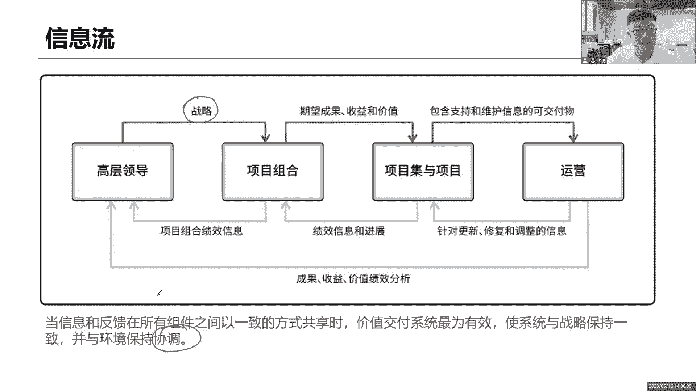

那么通过这个我们来画组织的战略地图，所以组织战略地图其实就是一个三角形，先有愿景和使命，基于愿景和使命，他这个目标要实现得有一个中期，短期和长期的战略目标，战略目标一旦确定了。

我的组合管理的方向已经定了，组合管理会管理我们当前的一些项目，给予项目还有什么运营，他都归我组合管理，我们一起来对这些战略优先级来排列顺序，看优先级来分配资源，分配这些资源怎么分配。

因为这些资源大家共享的，包括项目集，其实也是嘛在分配资源，根据我的依赖关系来分配资源，那我的运营也得需要资源啊，我的运营人员，我的授权，我的售后全都需要资源，这些资源怎么样能够有机地协调起来。

通过项目组合把所有的工作拉到一起来，协调资源，通过我们的信息流下面，看到这个信息流有机的组合来协调资源啊。

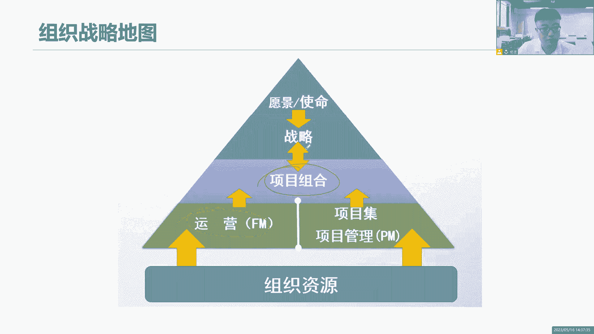

这是一个战略地图，那么基于这些工作到底怎么去管呢，我们有一个专门的一个模型，叫做OPM组织级项目管理，这是一个模型，他就是OPM3，就像我们说CMMI一样的，做I系的同学应该很清楚是吧。

他也是分等级的啊，从一级二级三级四级五级，那这些都是一个模型，来衡量我们的什么成熟度的，那你这个组织的项目管理的成熟度，我也得用一个模型啊，OPM组织嘛，Organization。

组织项目管理的成熟度怎么衡量，OPM组织级项目管理，把当前的战略组合，极易项目运营以及整个企业的内部外部环境，有机地结合到一起，通过这个模型来评估，我们当前组织及企业级的项目管理。

它的一个成熟度达到什么级别了，那么我们用这个模型的评估干嘛呢，也是为了看当前我们组织战略目标是否有实现，战略是否要做调整，希望能够符合我们的组织战略愿景，实现这个愿景，实现这个目标。

所以我们才会去做评估，如果不够成熟改进啊，PDC改进我们的工作方式，改进我们的流程。

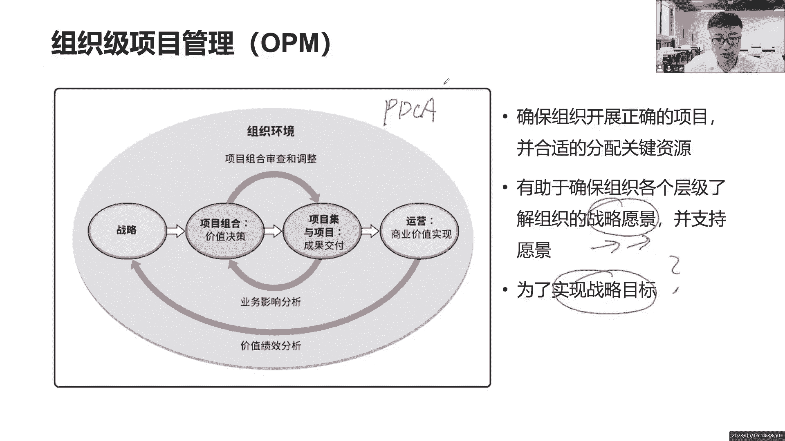

改进我们的决策，以此来重新做一个战略调整，治理来看组织治理了，对于说我们说企业要创造价值，要符合组织战略目标，那么这个企业里面它怎么去有机的管理呢，会有一个组织治理，项目的管理呢，有一个项目的治理。

所以组织治理和项目治理啊，他怎么去理解啊，你看这里描述一大堆，这里一大堆，让大家看一看就可以了，但是总体来说它其实就是一句话，这些治理治理啊，其实就是做一个事情，权力怎么分配在一个组织里面，有多个部门。

这些部门之间怎么样有机的协调，我们部门和部门之间的权利怎么去协调，怎么去分配哪些工作，怎么去审批，由谁由哪些部门来审批，一层层的审批，这是我们组织的治理项目制定呢也是一样的。

当前这个项目我需要由谁来审批，一个小型的项目，其实我项目经理直接审批就可以了，如果说这个项目的规模比较大，那可能我需要层层层层往上汇报，这个是我的权利想的比较小了，是不是我的权利都是分配给了上层的。

那些什么管理人员，他们来开展工作的啊，这就是我们说治理治理，什么叫治理，其实就是说权力怎么去分配，我的组织要运转起来，每一个职能部门权利怎么分配，我的项目要运转起来，我这个项目呢参与了各个人员。

他们的权利又是怎么分配呢，要保证这个项目的审批，项目的批准啊，项目的这些流程，是具有一个什么重要的决策权利。

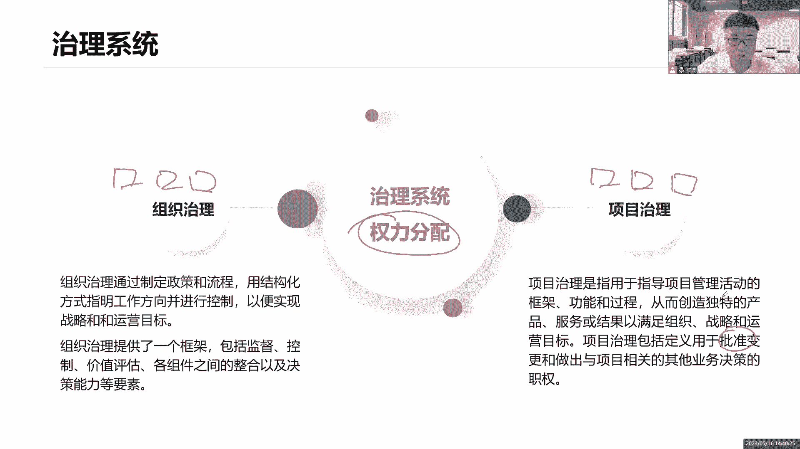

在这里面的权利分配在组织里面，我们会有哪些常见的职能呢，让我们一起来看看组织当中，现在我们既然讲了价值交付系统，要想交付这个价值啊，在做这个项目的过程当中，一定会有很多的职能人员，参与到我的项目里面来。

比如说有些人他们专门来给你提供监督，提供协调的监督，你的项目的，特别是一些高层人员，来对你的项目做出一些什么审计，来看你的工作做得到不到位，甚至来协调你的资源，项目集经理。

项目组合经理不就是干这个事情的吗，给你提出目标，给你提出反馈，当然有些人员，比如说你的客户，他是不是给你提个目标，给你提个需求，你这个需求做没做多做没做到位，符不符合业务要求，他给你做反馈。

那这些人员用户客户给你提目标，给你提反馈的还有哪些人引导和支持，就我们项目团队开展工作人员，我们需要我们的项目经理啊，引导他们，指导他们，辅导他们，鼓励支持，帮助支持他们，什么叫做支持。

给你们提供一些资源，给你们提供一些帮助，来帮助你们去克服障碍，帮助你们去移除障碍，团队之间他们有可能会遇到一些困难，这些困难需要项目经理你站出来，和大家一起来共同面对，如果大家能力不行，绩效不行。

你引导大家怎么做事情，之前没有经验，不熟悉，引导他们，指导他们，有的时候大家有冲突怎么办，引导他们达成一致，给你们提供各种相关的一些支持，还有一些人开展工作并洞察，那这不就是我们的团队人员吗。

他们一起来开展这些工作，是不是来开展工作，然后呢以总结经验教训，以洞察我们当前的一些市场的发展的先驱啊，市场发展一些趋势在这里面。

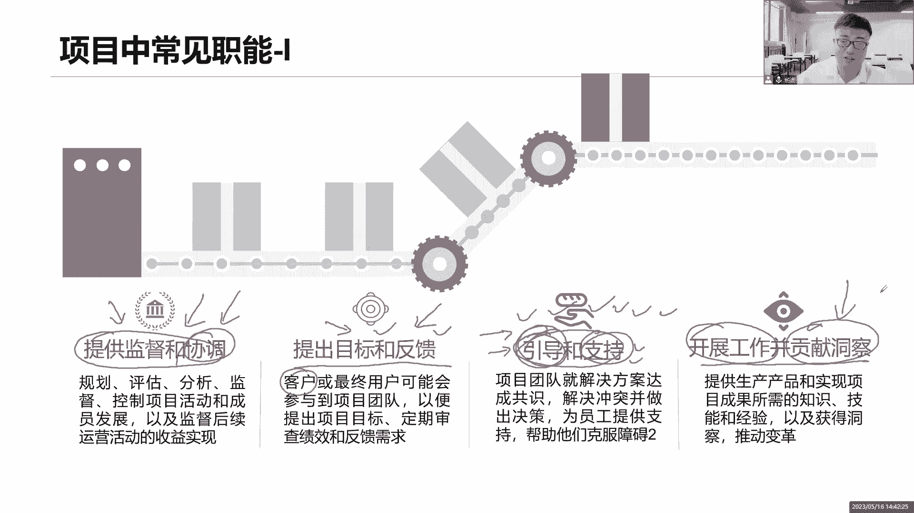

他们也是希望能够推动我们企业的变革的，还有一些专家，有这么一些专家在我们组织里面，我们的项目需要用到一些专业的知识，但是我项目经理不一定懂啊，我找专家这些专业知识啊，我们的主题专家就专门攻克这个主题。

专门攻克这个领域的，他们有非常深厚的专业知识，找找他们帮忙，让他们给我们提供一些专业性的指导，还有呢提供业务方向和洞察了，但凡涉及到业务，其实就是需求，比如说我们的产品经理，产品负责人，产品人员。

业务人员，商业分析师，这些人员都是给我们提供什么业务方向的，他们最懂业务，最懂需求，给我们提供资源提供方向的，给资源项目集经理，项目组合经理吧，我们这个发起人，包括我们PO都是会给我们提供一些资源。

在这里面PM是啥，后面会讲啊，项目管理办公室，一个职能部门，还有呢维持治理的哎，其实就是指当前我们说，在我们这个项目的监控过程里面，我们要维持这个绩效，控制绩效，维持绩效在我们各个领域的一些控制过程。

他们来帮助我们去维持维护好当前项目的基准，或者这些计划，这些管理人员是吧，所以我们的项目团队里面，其实有很多很多的职能人员，他们加入进来，来共同的推进这个项目往前开展，有做事的啊，有领导团队的。

有辅导团队的，他也给我们提目标，提需求了，也给我们定方向的，有专门的一些专家来辅导我们的，甚至还有些什么后续的一些维护人员，把治理人员他们来帮助我们。

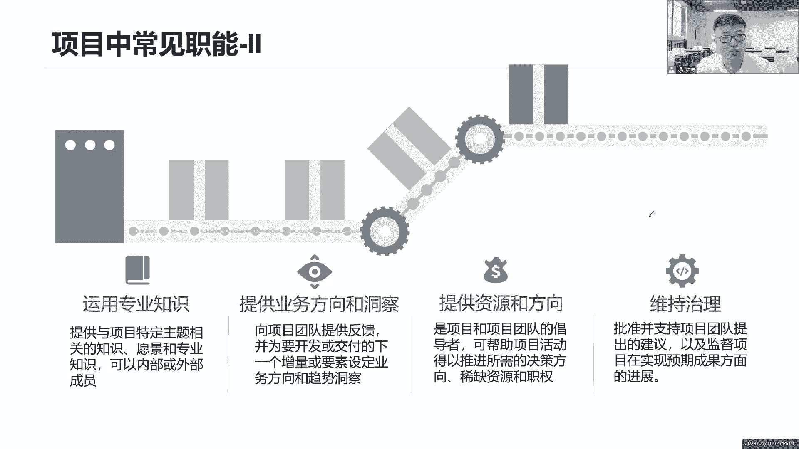

