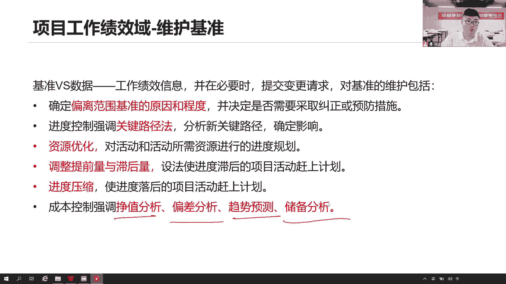
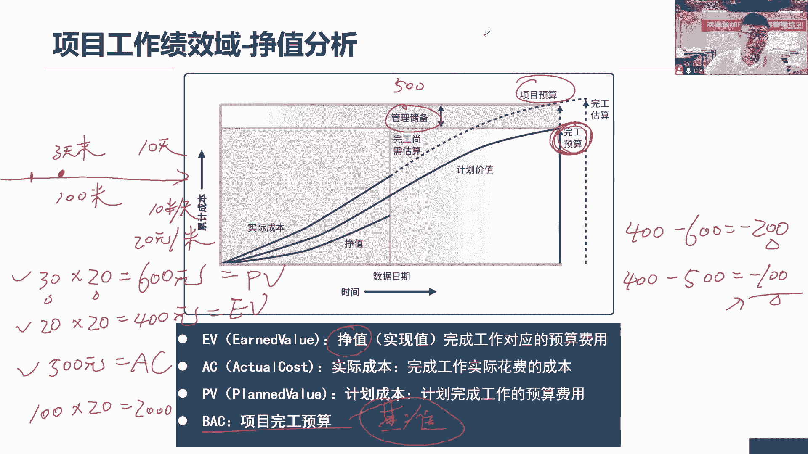
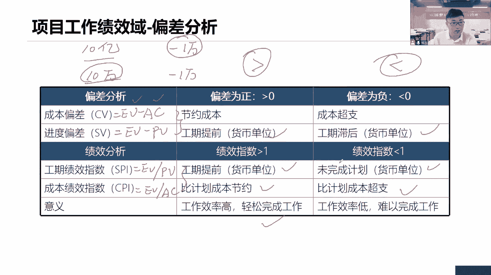
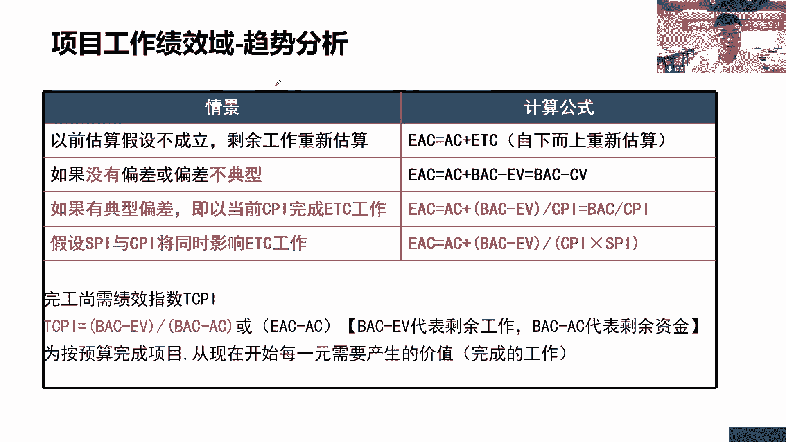
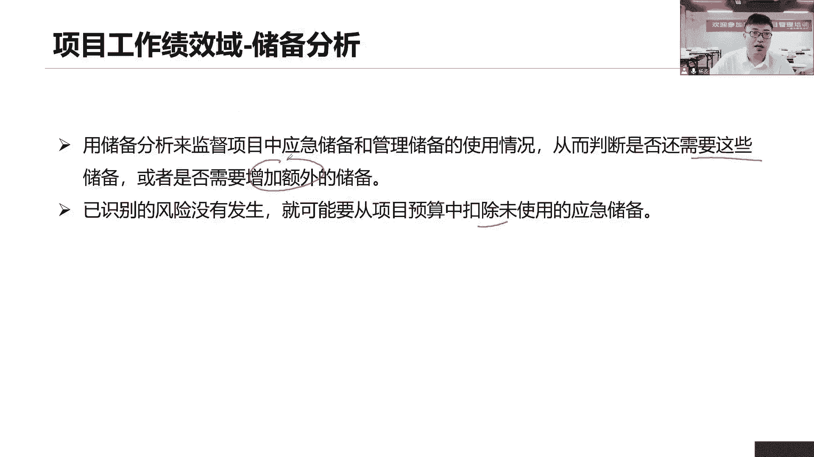

# 全新录制PMP项目管理零基础一次顺利拿到PMP证书 - P31：PMP精讲项目工作绩效域-维护基准1 - 北京东方瑞通 - BV1qN4y1h7Ja

好质量的工作到这里，接下来在工作里面，你除了考虑质量，是不是还应该考虑各个因素啊，因为任何一个因素发生变化，制约因素发生变化，都会影响其他各因素而发生变化，你要想做好质量，你的成本就上去了。

这很简单一个道理嘛，那么质量成本前面学习了这个质量成本，要想提高我的质量吧，将提高质量，产品质量减少返工，你可能会提高你的预防成本吧，有可能还有呢你的评估成本，从而避免你的失败成本。

那你这个预防成本和评估什么，要找到一个平衡点啊，因为本身你这个成本还会想，他本来会花成本的钱啊，千里的资源因素啊，你预算是吧，所以我们综合的去评估，了解当前项目的各项溜达资源因素都得去了解。

同时呢还要考虑什么满意度，你除了考虑六大制约因素之外，你还要考虑大家刚性的满意度，因为满意度本身就能衡量项目成功的标准之一。

它也很重要，都是平衡因素，维护基准，因为前面我们规划过程形成的基准，那么这就维护好基因，为项目过程中可能会调整基准，那么要想调整基准走流程，你必须提交变更请求，才会什么调整稳定好基准在这里面。

那么对于进度的基准来说呢，他怎么说，那范围我们说看吧，按照范围基准来进行找偏差，而镜头呢也是按照进度基础转场偏差，只不过我们在控制镜头的时候，大家关注几个点，你说当前这个进度延期了，他是有偏差吧。

我们就按照提交变更解决这个问题，那么请问当前这个偏差偏差程度是多少，我要去看啊，所以我们还要重新用什么关键路径法，找新的关键路径，把新的关键路径和当前我们这个工期进行比较，看看我们延期又有多少。

确定一下影响，那关键路径没有考虑什么资源优化，那我就做嘛，做我们资源优化，重新调整一下资源的分配啊，因为后面有可能会涉及到什么赶工快速跟进，提前量之后量就是并行，那么进入压缩就是赶工和快速攻进诶。

你看有哪些资源，我们可以采取什么行动来压迫我们的工期，尽可能保证维护好我们的工期，维护好我们的基准，成本基准呢也是想共同去维护啊，有偏差，那这个偏差怎么分析呢，我们首先说政治分析，看当前的PV。

看到时我们看这个政治分析，它主要看的是哪些内容，然后呢偏差分析找偏差趋势分析，看未来趋势以及储备分析诶。

这个储备分析和前面的储备分析不一样哦，那么接下来我们看关于这个政治分析啊，政治分析，政治政治冲几个维度，第一个正值1v earned value正值，他说正值完成工作对应的预算费用。

实际完成工作对应的预算费用，没读懂AC实际成本，实际完成工作所花出去的钱，这个还好理解，pv plan计划计划价值计划，完成工作的预算费用，没读懂BC完工预算没读懂，没读懂怎么办。

我们就让他理解透彻一些，我们通过例子来说，当前我们修100米路，工期十天，意味着我们的绩效每天10米路，我们给甲方修路，甲方你得给我钱，我不能白干，甲方说你每修1米6，我给你20块钱。

每修1米62十块钱，好了计划，目前我们到了第三天没了，现在我们是第三天末，那么同学们思考一下，第三天末我们计划应该修多少米多，每天10米嘛，那就30米，那么这30米路它对应的价值是多少，每米20块钱。

意味着第三天末我们应该修30米路，我们应该完成这600块钱的工作，没问题吧，第三天末，我们应该我们计划完成600块钱的工作，这个计划就是计划价值，计划完成的工作所对应的预算费用，预算每米20块钱。

就这么理解，600，再来看第二政治实际情况呢，我们很不好，我们只走到这儿，我们只修了20米路，那么20米路我们挣了多少钱，每米20码，每米20块钱，我们只挣了400块钱，这个400块钱就是我的一位政治。

实际只完成了400块钱的工作，因为实际只挣了400块钱，政治政治不就是问我挣了多少钱吗，挣了400块钱好找这个财务一查账，发现我们花出去了500块钱，这个500直接给你，你都不用算财务查账，他查出来了。

你用了500块钱好了，这就是PVEVAC计划价值增值，实际完成工作，实际完成工作预算费用哎，我们挣了多少钱，以及市区花出去要多少钱，你每天要发工资啊，你还要还要什么买什么设备，这是你花出去的钱好。

那这就是1VPV和AC，那么现在我们能不能看看一些偏差呀，能不能看到偏差，我们当前已经完成了400块钱，计划完成600块钱，中间有些偏差呀，我们还差甲方200块钱的工作没完成，负的进度落后了。

我们挣了400块钱，实际花出去了500块钱，我们超支了100块钱，进度也不行，成本也不行，是不是进度落后，成本超支啊，再来看这些个指标，BAC完工预算，就说这个项目预算多少，你们说这个项目100米。

它的预算是多少，那还不简单吗，100米路预算是多少，每米20块钱，两千两千就是我的完工预算，也就是我的成本基准了，我们是不是应该拿着这2000块钱，来衡量当前我们的成本绩效啊，你是不是在用在十天。

用这2000块钱把这个工作做完了，有没有超支，还是说有没有节约，那至少从目前看来，你第三天没，你已经超支了100块钱了，那就有问题了，你想要按照这个绩效，如果继续做下去的话，那这2000块钱是搞不定的。

好先把这四个基础值先搞定它，那么说这个项目的预算，它不是我们项目预算啊，再想想这个基准是基准基准，加上我的管理储备，才是我整个项目的预算，所以当前我们看到的只是一个完工预算而已。

这个完工预算就是我的基准2000块钱，至于管理储备是多少，我不知道，有可能给你个500块钱可不可以啊，那么加起来总共项目预算多少。

2500，来看偏差，这刚刚不是算过了吗，偏差成本偏差基本偏差，我们来看它的绝对偏差，两个相减就可以了，当前已经挣的钱减去我花出去的钱，就是我的成本偏差，如果大于零，那说明什么，挣得多，成本节约啊。

如果小于零，那就花的多超支了吗，进度偏差了，当前我们已经完成了工作，减去计划要完成的工作，如果大于零，我们已经完成了工作多，工作工期超前了，那就是当前成本，那这个进度落后了。

但是这个减法减法大家思考一个问题，现在有两个项目，一个项目实际的项目，另外一个项目10万的项目，现在他们两个的成本偏差都是负的，1万块钱都是负的，1万块钱，首先他们这两个数值是一样的吧。

CV数值是一样的，但是这个数值-1万块钱，能不能够说他们两个的成本绩效也是一样的，能这么衡量吗，能不能衡量这个10亿的项目和这个10万的项目，他们两个的成本计算是一样的，那就不行了是吧。

你这个实际项目现在超值1万块钱，冰山一角好，根本不用考虑忽略，但是你这个10万的项目，现在就已经超支了1万块钱了，小心一点，这个心痛啊，那总共才10万块钱，这个时候你就超值1万，那你还盈不盈利啊。

电磁卡这个问题了，所以用减法绝对的偏差，不能够直接衡量两个项目的绩效，那怎么办，我们就要用什么工作能力，工作效率了，这个工作效率高不高，可以来衡量，那怎么衡量，用指数啊，指数怎么算，现在看进度。

绩效指数很简单，以完成的工作除以计划完成的工作吗，把减法变除法不就完事了吗，成本也是一个道理，因为除以我们的实际完成的工作，它就是成本，绩效指数除法，那它代表了什么工作能力了。

如果真的除法不能和零来比较，除法它怎么除都大于零的，那就要和一比较了，如果大于一，而分子大正得多啊，这个完成的工作多，我们攻击超前，如果SSPI小于一，分母的PV多，计划完成的工作比当前完成工作还多。

说明进度落后了，如果说CPI成本绩效指数大于一哎挣得多，节约了小于一呢，分母大，花出去的多，挣得少，成本超支了，所以啊我们说这个指数要和一来进行比较，这个算法大家说要留意一下哈，你要知道该怎么去算。

同时你还知道它的结果是什么，就是和零相比，它的结果是又是不一样的，和一相比结果又是不一样，但是不管怎么说，你没发现大于始终是好事，小于呢，那不管要么是成本超支，要么就是进度落后。

这个意思这个简单粗暴去理解就可以了啊，大于大于好色，小于小就肯定不行啊，能力不行，所以我们说这个指数指数，它反映的是什么工作效率，工作能力，而如果当前是大于一，轻轻松松完成工作，我们效率很高啊。

如果小于一呢，有点问题，工作效率之后呢，工作效率很慢，工作能力很低，难以完成工作很难以完成的，后面你有可能会完成。

但是呢有点难度，这个趋势分析又是怎么去理解。

来我们通过这样的方式来看看，咱们现在呢还是以修路来说吧，我们继续来，我们以这个例子来说，现在我们修路修路修路，假如说这个项目我们不说100米了，我们搞大一点，我们搞大事情，这个项目一共100万。

100万的项目，工期一年，工期一年好了，截止到目前第六个月，目前第六个月，第六个月末，我们应该完成多少钱的工作，现在一共是100万的工作哦，现在截止到第六个月末一半嘛，我们计划应该完成多少50万的工作。

实际情况呢，我们我们的绩效又比较偏差了，我们只完成了40万，我们只完成了40万，实际完成的工作就挣了40万，找财务一查账，发出去了50万，好来我们继续来算偏差，偏差偏差第一个我们来看我们的这个进度偏差。

进度偏差就是用我们当前已经完成的工作，减去我们计划完成的工作，哎，负的10万还差甲方10万块钱，工作没完成啊，成本的绝对偏差，当前已经挣的钱减去花出去的钱也是负的，100040-50。

我们超支了10万块钱，买我们的快进度绩效指数，当前已经完成了工作，除以我们计划完成的工作，40÷50等于多少，584十，0。8成本绩效指数也是一样的，用当前已经挣的钱除以花出去的钱也是0。8。

那这两个0。8的意义可不一样哦，第一个进度绩效指数，0。8是指当前我们每天工作八小时，只有6。4个小时，在正常投入，每天工作八个小时，但是我们绩效不行，只有我们这指指数只有0。8，我们工作能力只有0。

8，意味着我们只能够完成工程吗，做06。4个小时的工作，八个小时，我们只有6。4个小时在正常投入工作，第二个成本绩效指数说，每天我们还是要工作八个小时吧，我们计划花一块钱完成一块钱的工作。

但实际上呢我们只能够完成八毛钱的工作，就这意思，每花一块钱，我们只能够完成八毛钱的工作，那成本又超值了吗，你应该是花一块钱完成一块钱的工作，怎么只完成了八毛钱呢，那说明当前你这个超支了吗。

花钱能力不行啊，啊这是我们制作好了，现在再来看这个图，当前我们已经走到这了，那么请问还剩余多少工作没有完成啊，我们已经完成了40万的工作了，还剩多少60万吧，这后面的嘛加起来还剩60万的工作。

一共还剩60万的工作，但是呢现在我们的绩效是，每花一块钱只能够完成八毛钱的工作，那么现在还剩60万的工作，请问我应该要准还剩，应该要准备多少钱才能够完成这60万的工作，再说一遍。

当前我们花一块钱只能够完成八毛钱的工作，现在还剩60万的工作等着我们去完成，那么请问我们还需要多少钱，两个一除是不是75万，我们还需要75万，才能够完成这60万的工作，因为我们当前成本是在超支的情况下。

我们这个花钱能力不行啊，啊我们这个成本的计算是很不行的，所以你肯定要准备多一点钱好，还需要75万，这是基于当前的绩效我们评估出来的，那如果说我们说我们未来绩效就是一领导，你放心。

未来我们的绩效一定是保证花一块钱，只完成一块钱的工作，那么我们还需要多少钱，你现在剩余60万吗，剩余60万的工作没有完成，你说你花一块钱，我就完成一块钱的工作，那么请问这个是多少。

60是不是有两个不同的情况，就完成剩余的工作还需要多少钱，这就是我们说的etc etc，这个etc不是我们高速公路那个etc啊，不要搞错了，完工完成剩余的工作上需要，多少的成本估算，完工尚需估算。

etc完成剩余的工作，完成剩余60万的工作，我们还需要多少钱，我们做个估算，如果说是基于当前的这个绩效，我们还需要75万，如果未来绩效有所改进，那就是60万就可以了，好了，再来看完成剩余的工作。

要么60万，要么75万，那么请问截止到目前，我们说成本已经超支了，那就意味着这个100万肯定搞不定这个事情，不管你说你这个进度，这个未来花钱那个效率怎么样，你这个100万肯定是搞不定的，那怎么说呢。

那我们就来看完成剩余的工作，截止到目前这个时间节点完成，我们总共项目还需要花多少钱，当前我们已经花出去了50万了，就截止到目前，这我们已经花出去了50万的钱了，那么剩余呢还需要多少钱，也算算etc啊。

要么70，要么65，那么我们可不可以算一算当前我们的完工估算，完成所有的工作，我们要做一个成本的估算，也是一种估算，完工估算它不是完工预算的，你这个100万是一个预算而已，但是截止到目前。

我发现这个净这个成本的绩效指数有问题是吧，超支了，那我想站在当前这个节点来估算一下，完成所有的工作全部完工，我们还需要多少钱，那么完成所有工作，现在花出去了50万，如果说绩效不变，75万。

还需要125万才可以完成工作，如果说绩效发生变化，60万就可以搞定，那么我们还需要110万才可以搞定，反正你这个100万肯定搞不定，这就是说EAC完工估算完成整个项目，我们还估算一下还需要多少钱。

好这是两个预测，大家了解就可以了，一个是ETC，一个是EAC，一个是完成剩余的工作，一个是完成所有的工作，那还需要多少钱，都是做了一个估算，那么再来看接下来储备分析，储备分析在当前我们说在项目工作里面。

要么就是怎么做做监控了，做监控的话，我们要分析什么，监督当前我们的应急储备和管理，储备的使用情况，那么有两种情况，第一个是否还需要这些触动，啥意思，你说你当前有些已识别的风险。

你准备这个应急储备还可以吧，准备我们的应急储备可以啊，但是问题是这个风险它没发生啊，我们已经证明了这个风险是不会再发生的，风险也是渐渐明晰的，当前已识别的风险，我们证明他不会再发什么。

那么当前你准备的这些应急储备，也就意味着永远用掉，用不了它，是不是应该想想你还是否需要它，如果不需要他来，我们怎么做，他说从项目的预算里面扣除，这些没有使用的应急储备，从项目预算里面去扣除它就可以了。

就你实际你花不到这些东西啊，实际你在成本里面是没有这些东西了，他已经不在你的成本基准里面去了，你要改基准的第二种情况呢，或者是否还需要增加额外的储备，那就意味着这个风险发生了嘛，发生之后呢。

我动用了我的应急储备，或者说有可能是什么一些意外发生的，我动用我的管理储备都可以，你动用应急储备，管理储备都行，那么请问剩余的风险和剩余的储备，他们两个之间还能够相匹配吗。

剩余的储备能不能够用来应对我们，后续足以应对我们剩余的风险，这就需要你评估了，这就需要你去分析分析了，如果不够，是不是要增加一些额外的储备来补齐啊，这就是我们当前在监督我们的应急储备和管理。

储备的使用情况，我们用的是储备分析，也就意味着在整个项目生命周期里面，我们早期在规划的时候估算活动时间，估算活动成本，考虑了应急储备和管理储备，现在随着风险的发生，有些储备被用了，那么用了之后。

请问我剩余的储备还够不够，这就是一个问题了，到底还够不够，还足不足以应对我剩余的风险，我要分析储备分析，如果不够申请额外的储备，而如果这些风险没有发生好，移除数据，我用不到它了，我给谁呢。

有可能给其他项目组，也有可能给我自己，咱不是后面还有好多风险吗，万一不够呢，来拿过来用吗，也是一样的嘛，啊都可以的啊，所以这个是我们的储备分析来分析当前，要么是是不是还需要，如果不需要扣除数据。

如果说当年不够，那就增加了。

