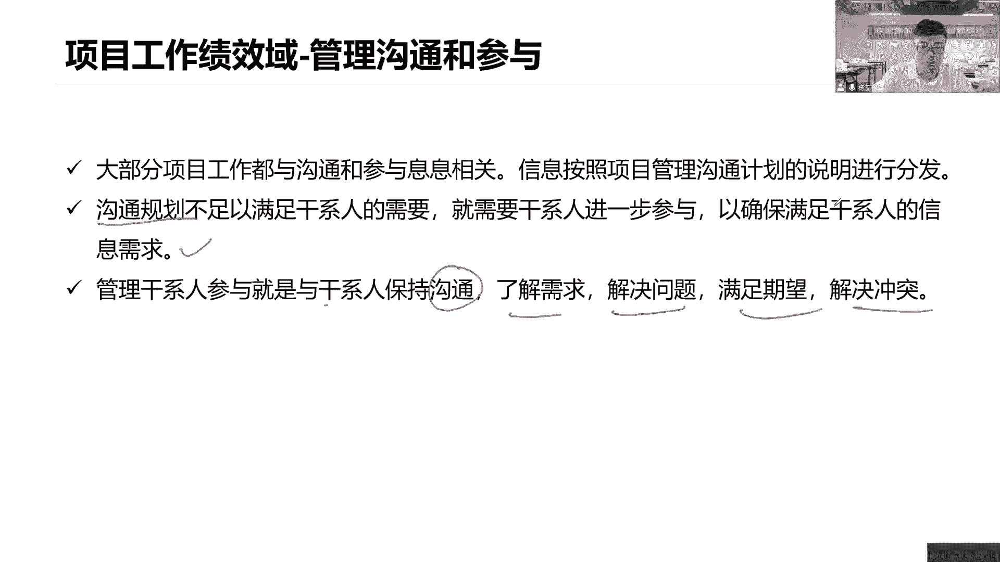
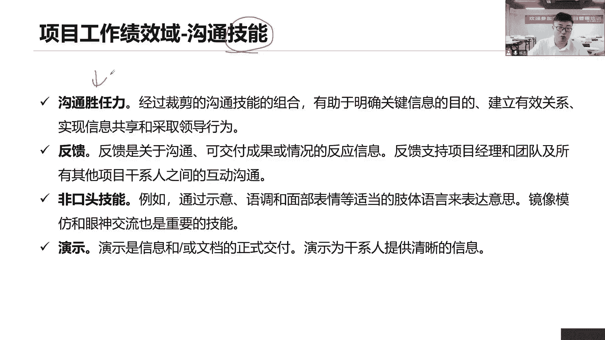
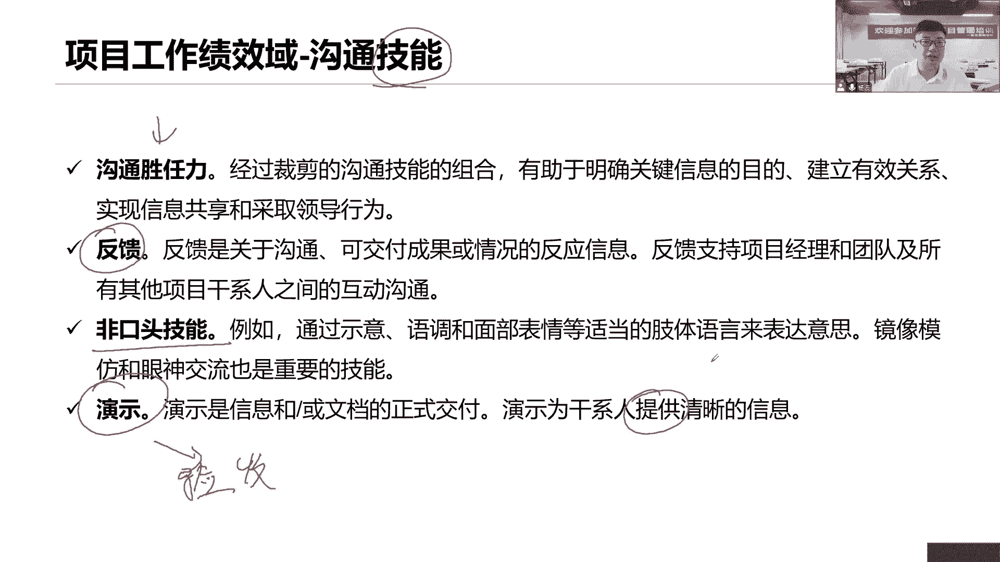
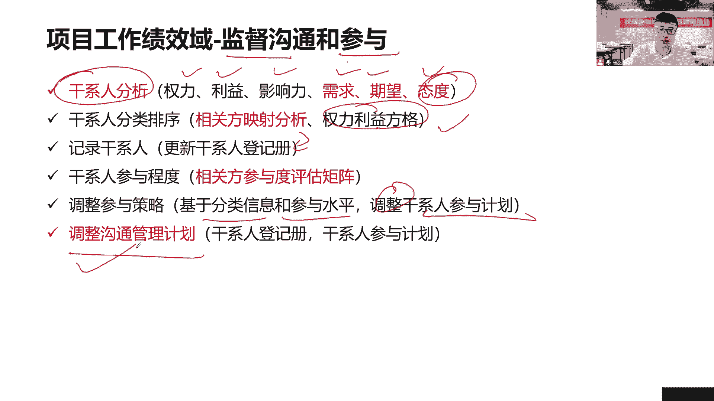

# 全新录制PMP项目管理零基础一次顺利拿到PMP证书 - P33：PMP精讲项目工作绩效域-沟通与参与1 - 北京东方瑞通 - BV1qN4y1h7Ja

管理沟通和参与，在这个过程里面，我们要和我们当前的干系人不断的开展沟通，管理沟通，持续的沟通以及提高他们的参与度，大部分工作都是和沟通相关的，所以要想提高刚性的参与度，管理干系人，你就说一个事情。

沟通按照我们的沟通管理计划，把对应的信息用正确的方式传递给正确的人，让他们能够积极地参与进来，有了参与感，有了参与度，才有了主人翁的意识，才能够支持我们项目工作，如果沟通规划不足，就是沟通管理计划不足。

不能够满足当前我们参与度，那么我们就要进一步的去怎么去调整，我们的沟通，有确保满足他们的沟通信息的需求，干性的管理管理就是和干性的保持沟通，了解需求，解决问题，满足期望，解决冲突，各种解决问题。

沟通嘛开会就有问题。

在沟通时要表现出自己的能力，这个沟通技能就是我们沟通能力什么呢，第一个胜任能力，我们充分的结合了很多的多种沟通技能。

等一些的表现，这些有哪些包括什么反馈，你看就是我在和你说话的时候呢，你要给我一个反馈是吧，就是别人和你传递信息的时候，你就要让对方理解你怎么让对方理解，你要给他反馈复述一遍，您说的是不是这个意思。

123复述一遍，反馈能够让确保对方理解，你是不是真的理解这个信息了，非口头语言就是指当前我们除了说话以外，我们还可以采取哪些面部的表情吧，我们的肢体语言，手势动作都可以衍生的交流也可以呀，没问题。

给你传递了一个关爱的眼神。

你能够读出什么这个思啊，这是非口头语言，还有呢演示通过这个产品的演示，面对面的沟通，以传递更多更丰富的信息，这是演示演示，一般来说就是我们当前正在做一个事情，的验收了，一般来说我们都在做验收。

在这个验收的时候，我们拿这个产品来跟你去操作演示，让你看，你看了之后给我们一个反馈，当前你有什么信息啊，你有什么有什么新的要求，提出来给我们一个反馈。

我们进行基于这个反馈呢来进行调整改进，除了管理沟通之外，我们还要监督监督，不断的监督沟通和监督参与，因为在整个项目生命周期里面，我们说干性的需求，期望权利利益是会发生变化的，那么监督怎么做呢。

要变化依然的，首先干性的分析，分析出当前你们的个人的权利利益影响力，以及需求期望，基于这个新的权利利益影响力，我们要去重新对他们这种分组分类，哪些人重点管理，哪些人令其满意，哪些人随时告知。

哪些人监督就可以了，而我们要形成我们的权利利益方格，或者说什么凸显模型，然后把这些新的信息，更新到我们什么干性的登记册里面去，结合着这个态度，新的态度，我们重新调整了参与策略，调整我们说不参与参与程度。

重新调整这个矩阵，以明确他们的参与程度，基于你们的参与程度，基于你们的分组分类，我们重新调整我们当前的参与计划，分组信息，参与水平，重新调整我们干性的计划，当我们参与计划得到调整。

那你说我们沟通管理计划，是不是也得跟着做调整，因为你的参与策略是不一样的，之前你参加怎么会，现在你又要参加，怎么会，所以他的沟通形式方式，策略是完全又发生变化了，我们就要同步去更新我们的沟通管理计划啊。

