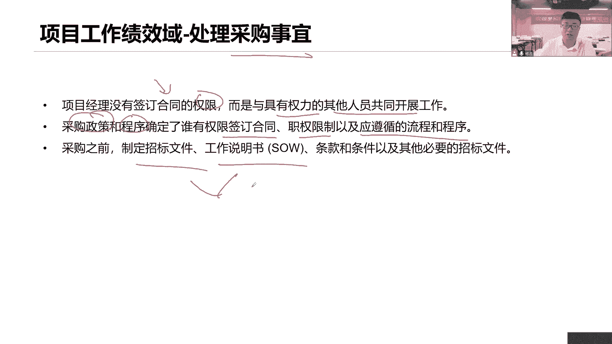
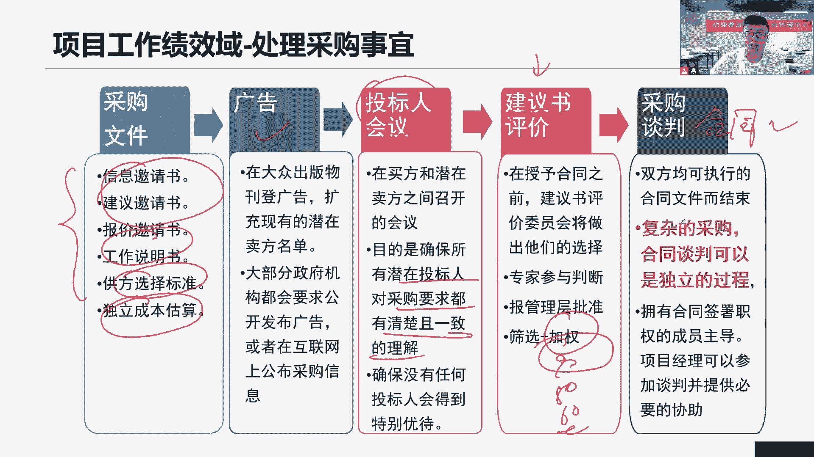
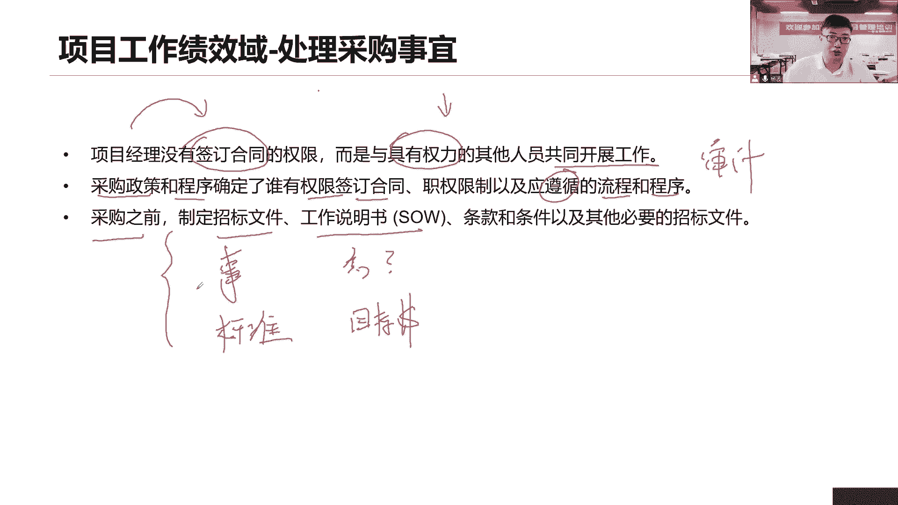
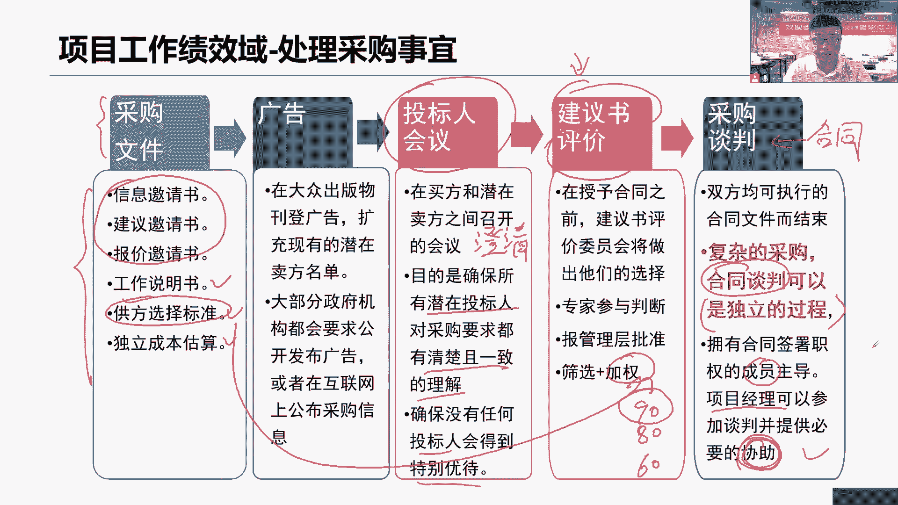
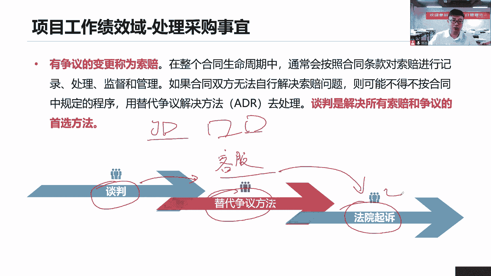
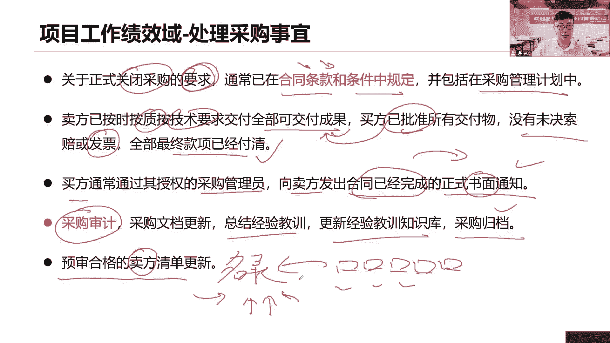

# 全新录制PMP项目管理零基础一次顺利拿到PMP证书 - P34：PMP精讲项目工作绩效域-处理采购事宜1 - 北京东方瑞通 - BV1qN4y1h7Ja

管理实务资源，那么实物资源怎么去管一样的吗，先考虑清楚当年我们到底是买，还是我们自己去做，那如果说涉及到先买的话，那么就做好采购了，还有呢你看大家说了，怎么消除等待时间最小化，报废最小化浪费，减少浪费。

正能促进我们安全的工作环境，那这些都是要考虑到实物资源，去点这个实物资源，如果要买，那就涉及到什么采购处理采购事宜，你看项目经理没有权利签署合同，你没有这个权利去签署什么合同，那么谁去建设呢。

肯定是具有权利的，建筑其他人员啊，那管他是谁呀，他也确定他去做就行了，相信你干嘛还要去做这个事情呢，签合同谈合同没必要吧，这个是非常专业的事情啊，采购政策和程序，决定了当前我们谁有权利去参与这个合同。

对这是我们组织既定的采购政策和程序，按照这个要求来做事情，职权的限制以及什么遵循的控制流程和程序，那这个问题怎么去升级，这个问题怎么去处理，都是由我们这全过程过程，政策和程序，也就是他们去控制的。

去把控的，下面请你不要自己按照自己的方式去做，那就不对了，采购之前要准备好各种招标文件，采购工作说明书这些，这是什么采购文件啊，要准备好，以便于接下来我们去做采购了啊。

找我们，找我们这个供应商做一个什么招投标流程，我们要去做采购，那么说到采购的话，我们就有一个什么通用的一个方式，方法在这里面，首先甲方你应该准备好你的采购文件，你的招标文件，然后呢工作说明书。

公方选择标准，独立成本估算，这些是我们当前的什么四个采购文件分类，那然而基于我们的广告的形式，把这个当前的采购文件里面的一些内容，广而告之嘛，让我们更多的人能够看到，当前我们政府部门要颁发一个什么。

要颁发一个新的项目，哎，这个项目它的一些需求是什么，我们都可以通过我们的广告来了解到，所以我们甲方把这个操作我们练习出来之后，要公示出来，让更多的乙方能够看到，他们去评估自己能不能做这个事情。

以及能不能赚钱，打算去评估，那么在中间呢我们会开一个什么仪式感会议，甲方你得开这么一个仪式馆的会议，这个会议是干嘛的呢，他就是来帮助你，把这个当前你首先得熟悉你的工作说明书，然后除此之外。

你要去给我们前端的卖方去召开这个会议，目的是什么，以确保所有的潜在的卖方，他们都有这个采购要求，都有一致清晰的理解，所以可能是我们题目场景里会说有些干系人，那个供应商他们总是会来问你这个问题。

问你那个问题说明什么，他们他他们当前是不了解我，这个当前采购的一些情况的，所以我们就需要通过这个招标人的会议，投票人会议，然后呢把大家一起召集起来，我们做需求的澄清。

因为这次我们会有很多很多的需求在这里面，那么这个需求的澄清，如果说他确保没有任何人得到特别的优待，就是公平公正的对待每一个潜在的供应商，不能有些灰色交易在这里面，建议书评估，当前我们设置个建议书之后。

也是标书，我们干嘛呢，我们做早期专家做开标，做评标，给他们怎么做加权打分，打分的90分是吧，80分，60分不及格，那么我们肯定选择一个得分比较高的，这个候选人，他来作为我们当前的一个什么啊。

这个候选人来和他们去谈谈和任务，谈，这个合同的目的，是希望他能够理解我们当前我们合同进行约束，双方的职责责任是什么，如果没有问题，双方签字确认好了，这就是个正式法律生效的合同了。

同时你也是我们正式的供应商了，你应该定期给我们提供一些服务支持和帮助的，对于采购谈合伙合同来说，它可以作为一个单独的项目，也可以作为一个单独的过程来开展，都没问题，因为在这个过程里面。

其实项目本身参与的程度会比较少，我们只是做一些提出意见和见解就可以了啊。

好接下来我们看关于采购事宜，在项目工作当中，如果涉及到供应商和协作，那这个时候我们就需要做采购了，那么采购采购首先在采购之前看，第三句话，我们需要提前准备好我们的招标文件，做什么事情。

告诉我们供应商工作说明书这个事情怎么做，如何做，有哪些需求，还有呢供方选择标准怎么选择，我们供应商，你的打分标准是什么，考核标准是什么，独立成本估算，您作为甲方，您的一个目标成本是多少。

我们要看的是你的目标成本，也就是说你的预算是多少，好这些作为我们的采购文件得先形成好之后，然后呢，我们后面会通过一些招标平台把公式出去，在这个工作当中啊，项目经理他说没有权利去签订我们的合同，谈合同。

签合同我没有这个权利，所以这个时候我们需要与具备有权利人员，我们一起来合作开展工作，在这个过程里面，我只是给你们提供一个协协助，帮助提出一些意见和见解就可以了，我没有权利直接签订合同。

我不会做这个事情的主导，那你说这个有权利的人谁呀，到底是谁呀，我也不知道，那你看采购政策啊，开采这个采购程序啊，它里面确定了谁有权利去签署合同，谈判合同，他明确了。

我们就按照我们采购政策和程序来开展工作，就可以了，我们应该遵循这些流程和程序，避免后面到了项目审计的时候，发现我们又做了不合规的，又要受到处罚和惩罚麻烦，所以按照政策流程和程序来开展。

我们的相关采购的工作，谁做主导，谁做协助好，那么在采购之前，我们作为项目经理，应该提前准备好这些采购文件，因为只有我才知道，哪些事情需要我们供应商来做，他们怎么做，符合哪些需求要求，采购多少数量。

质量标准是什么，由我们项目团队来决定。

接下来我们看在做一次招投标流程的时候，我们的整体的流程是什么，来看，第一个，首先准备好我们采购文件就这么一大堆啊，前面三个都是我们的招标文件，然后呢工作说明书，供方选择标准，独立成本估算。

接下来通过广告的形式，把我们当前的采购信息广而告之发布出去，比如说我们的政府做项目，通常都是放在我们的政府的招投标平台，上面去的，我们乙方公司通过这个招标平台，我们就能看到当前有什么项目可以做。

那么现在看到一个项目，但这个项目写的不太清晰，我们作为乙方来说，就会去问我们甲方，当前你的一个详细的具体的需求有哪些，那么就会有很多供应商去问，那就显得很麻烦了，所以我们干脆这样。

甲方我们召开一个会投标人的会议，在这个会上我们开这个会，目的是为了确保所有的潜在的供应商，投标人，你们对这次采购的要求都有一个非常清晰完整，清楚的理解，我在这个会上给大家做一个事情，澄清需求。

搞清楚咱们这次采购的内容要求是什么，我要告诉你们，当前这是采购具体的内容需求是哪些，我们怎么做，这是采购，要确保没有任何的投标人会得到特别的优待，啥意思，就是公平公正的对待每一个潜在的供应商。

不能有一些灰色的交易在这里面，不能因为我和某个供应商关系比较好，私底下有接触，我就把其他的一些报价低价告诉他，那这个肯定不行是吧好了，我们看当我们开完这个投标人会议之后，如果各位潜在的乙方。

你们依然有这个意向，那么你们就把这个标书交给我，交给我甲方，由我甲方把你们的这个建议书就是标书嘛，我们用专业的术语来说叫做建议书，当然我们将各个潜在供应商，你们给我的建议书我们收集起来。

召集专家来做一个事情评标，那么怎么评标呢，怎么给你们打分呢，我们不是有攻方选择标准吗，他就是来帮助我们打分的，我们把这个标准拿过来，我们开始做加权的打分，有的供应商得分很高，有的人相对低一点。

有的人可能不及格，那么好，我们是不是应该选择一个得分高的一个候选人，我要和你做下一步的工作，什么工作呢，谈合同呢，因为我们要准备签订合同，只有合同签订了，你才是我们正式的供应商。

所以这个是我们教师的谈合同，对于合同的谈判来说，我们可以是一个什么独立的过程，甚至是一个独立的项目都没问题，那么好签合同，谈合同这个事情一定是有一些专门的成员，他们去主导，不是我项目经理。

由谈判和签署合同，一定拥有对应的合同签署权利人员，他们去做这个依然是遵循我们的采购政策，采购流程，我项目经理在这个过程里面，我们可以参与没问题，但是这个参与的过程里面，我们仅仅也只是提供一些帮助。

协助提意见，提见解，但是我们不能够做出直接的决策，也不能直接说这个合同就签了吧，怎么能做这个决策，你只是提供建议见解的啊，因为毕竟这个谈合同签合同它是具有专业性的，你了不了解法务法律效应。

法律一些合同要求，懂不懂我们的招投标法哇，这些都需要我们专业人员，所以为什么企业里面会有些什么采购部，市场部，法务部，因为需要他们那些专业支撑啊，在谈合同签合同的时候。

咱们现在看采购工作，当我们签了合同之后，那你是不是正式供应商呢，我们就要定期对你做出什么绩效的审查，他按照合同审查C的绩效，卖方的绩效，卖方对你的合同履约的绩效，我要去审查看你的质量的。

资源的进度的成本的各个绩效是不是有问题，分析分析，是不是存在着各种资源的质量的，一些一系列的问题，所以很多时候我们说供应商他说延期交付，他说质量有点问题，也不符合要求，哎呀我们这里发生台风了。

我们这里有地震了，我们这里发生火灾了，不能和按期交付了，各种问题都有，那遇到这个问题之后，你应该怎么做，先别着急处理，延迟你的冲动的决策，来我们一起来看看这，他这里面一定会说，当出现这种各种问题之后。

我们应该如何去应对和处理，看合同，根据合同来审查卖方的履约情况，是不是出现一些不可抗的因素，是不是因为你们本身乙方你的问题，你供应商的问题导致或甲方这里延期交付了，或者质量出了问题，看合同啊。

合同里面说了，当天我们双方应该领域的问题是什么，出了问题，谁负责任，怎么解决，看合同审查合同，第二成果要不要检查，必须得检查，你卖方应该定期给我提交你的可交服务，我甲方要做检查，要做验收，要做审查。

我甲方给你提，我给你，甲方给你什么拨款，给你提供资金啊，我给你付钱，那你得定期给我成果，我要去检查，一定要保证你的成果，你的质量是没有问题的，是符合我们合同要求的，是符合我们合同里面说了。

我们应该按照我们这些各种质量指标来验证，按照我们的质量规格，质量水平来交付，我要去做检查，第三审计，在整个项目过程当中，如果说有采购，我们要定期的做一些采购审计，那么审计审计的是什么，再次强调哈。

审计审计的是过程，那既然说当前是采购审计，那我肯定审计是采购过程，当前是否有效，我们是不是按照我们组织既定的采购政策，采购流程来开展这一系列招投标流程的，我们的采购过程做的到不到位。

那记住这是双方都应该做的事情，但是你要记住，不是我损你，你损我，我们双方之间没有权利去互相审计的，我审我自己，你审你自己就可以了，我们可以共同来关注一下我们的审计结果，哎这个没问题。

我们可以互相沟通传递我们的审计报告，这个可以，但是我们没有权利去直接审计对方，你的采购工作做得好不好，这个是不行的，如果审计我们说审计的目标是什么，回忆一下审计的目标，是不是说当前哪些做得好。

哪些做得不够，好好的，我们要分享不好的，我们要改进，不管好与不好，总之我们要总结经验教训，在这次招投标流程里面，在这次采购过程当中，我们有哪些经验教训要把它总结下来，不好的地方做调整改进调整。

以便于未来我们整个采购的流程，能够能够高效顺利好，这是我们当前在监督采购的时候，我们要做的这三个核心的工作，一监督供应商的绩效，二监督供应商的成果，三我们双方互一定要审查审计。

我们自己的采购流程做得到不到位。

如果说出现了争议，什么叫争议啊，就是指当前我认为这个问题，但是你们也不是问题，我让你感觉说不敢，这就是争议，这一次是索赔，而有争议的变更，我们称之为索赔好了，那么如果出现了这种索赔，我要求你赔，你不赔。

他要求我多付款，我不付款，这就是争议，就索赔，那么要解决这个争议怎么解决啊，我们说谈判是解决所有索赔和争议的首选办法，来，我们先谈谈饲料嘛，也就是四料，我们能够私下表决，以合作的方式双赢的思维解决问题。

那是最好不过的，我们能够达成共识，但是如果不行怎么办，我们就有替代争议的解决办法，ADR这个替代作用是什么意思呢，事实当前我们找第三方的仲裁机构啊，找第三方来说理，到底是我的问题还是你的问题。

一般会有个第三方的中长机构，如果说连仲裁机构，第三方他都不能够解决问题，找谁，既然签了合同，那好办，合同是具有法律效益的，那么他法院可以帮助我们做出一些审判和裁决，你举个简单例子来说。

就说这个我们去京东嘛，我们说生活当中我们去京东买一台，买了买了一批啊，这什么笔记本电脑，可不可以啊，可以吗，这买了一批还是挺花钱的是吧，我说去京东买一些电脑回来，可以啊，买服务器买电脑。

但是我们发现这个电脑收到之后啊，有问题啊，这个开机开机开不了机，然后呢用着用着蓝屏了，死机了，动不了了，没电了，找这个商家去换，他说不换，这是你自己使用的问题，那怎么行呢，这不是我使用的问题。

明明是你的问题啊，他说不认我就不换，那么我们能够私下解决，如果能够私下解决，协作达成一致，他最好，但是有的商家不愿意啊，那么我们就找谁，这个京东的第三方是谁呀，京东客服啊，那你是店家，你不负责。

那我去找客服是吧，我们找客服服务，客服解决问题能不能解决啊，如果说你能够解决，那最好如果连你也解决不了，那就只有起诉了，大家说我们这个京东上面去买东西，淘宝也好，京东也好，有没有签合同，有没有签协议啊。

有没有签，大家想想，肯定是有欠的一个什么七天无理由退款，这些不是协议吗，我们在需要选购的时候，其实木工人就已经勾选这一协议了，既然是一个协议，那就具有法律效应，可不可以起诉。

当然可以，那么看采购，如果说要正式关闭采购，要做到哪些条件呢，第一个，首先通常我们会在合同条款里面会说，什么样的情况下，我们能够达到正式关闭，有哪些要求，要一些标准的哪些条件。

同时呢也会包括在我们采购管理计划里面，那这个采购管理计划，它本身就是要说，当前我们整个采购的过程和流程，当前我们采购要关闭了，那么需要达到什么要求，达到什么条件才可以关闭。

至少是不是你我们卖方已经已经什么按质量，按技术要求交付了所有成果，并且呢我们也同意了这些成果，已经批准这些成果，你看已经批准了，买方就是甲方，甲方已经同意了，这些成果没有问题，已经验收通过了。

而且没有什么索赔，该开的发票都开完了，该付的款已经全部付清了，就所有工作已经全部清了，全部了结了，那至少这是一个标准，这是个要求吧对吧，这就是我们赚钱关闭合同，关闭采购的一个要求。

在这里你得先把这些事情全部做完，然后呢，这个时候由我们买方，甲方通过一个什么采购人员向我们卖方发出，合同已经完成的什么正式书面通知，哎甲方我跟你说，当前我们这次采购已经做完了。

我会给你发一个书面通知给你，记住哈，是书面哈，你别说我们打个电话，发个微信，发个语音，发个邮件，这些通通不认，那既然说是个正式的验，对于乙方对供应商来说，这是个正式验收，对他来说是个正式验收。

但对于我们来说呢，我们我们还有我们的客户呢，我们还不是一个正式验收，那这个是我们只是说对于我们来说，是一个采购经完成好，那么我们就给他发一个合同，正式完成的书面通知给你，你可以结束你的项目了。

我们自己做我们后面的工作，采购审计，那么说我们要去总结经验教训啊，更新我们的经验教训知识库，接下来采购回答，该更新的更新，该总结的总结，该归档的归档，最后呢我们还要更新一个东西。

预审合格的卖方清单意味着什么，当前我们这次采购，和这个供应商开展合作比较顺利，这个供应商啊，他各方面都符合我们公司的要求，符合我们政府审核的要求，意味着我们需要把这个供应商，纳入到我们的一个名录里面来。

一个清单里面预审合格的卖方清单，就是我们已经入围了政府的名录了，那既然说入围了这个名单，那就好办了，以后政府要是想采用各种设备，把服务器电脑，它就会有可能会直接选到。

我们就不必要再做什么复杂招投标流程了，当他们选购什么产品，直接看有哪些企业已经入围了我的名单了，哪些产品已经入围了我的名册了，我去看，我会选择产品，再找这个产品对应的供应商，找他们，找他们去买就行。

直接签一个合同，说我们买多少，什么时候交付，你给我就行了，还做什么招投标流程这么麻烦，是不是，所以其实很多现在我们做政府，赚政府的钱不好赚，因为你要首先入围啊，入围别的名录啊。

所以很多企业想尽一切办法是吧，获得各种资质认证，什么审查，然后做各种评审，做检测就是目的是什么，需要有这些资质才能够入围，我们政府的一些名录里面，那么未来他们采购各种产品。

会考虑到我们毕竟嘛为政府做项目。

