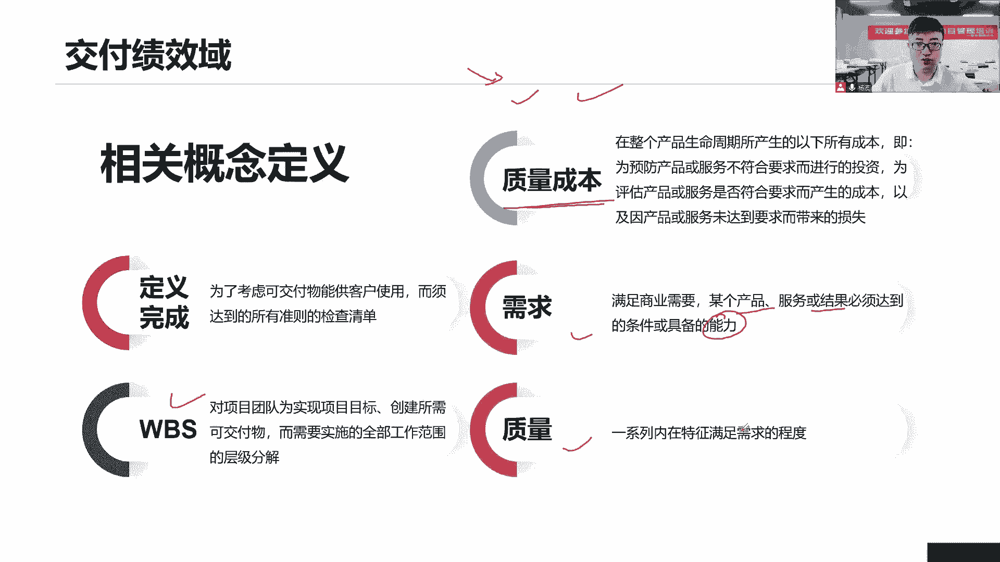

# 全新录制PMP项目管理零基础一次顺利拿到PMP证书 - P37：PMP精讲交付绩效域-交付项目要实现的范围 - 北京东方瑞通 - BV1qN4y1h7Ja

而同学们，接下来我们看关于下面一个绩效与交付纪效率，首先前面我们定了开发方法，决定了用什么样的开发方法，根据开发方法来决定，当前我们怎么去定我们的计划，然后按照这个计划来干活，开展我的工作。

那么之所以开展工作的目的是什么，是因为我们最终要交付出去，所以交付交付就关注两个点了，第一个我们该做的工作有没有做完，这是第一个吧，第二个呢，当前我们这个成果它的质量是不是符合要求的，只有做完了工作。

并且这些工作全都符合质量要求，那我们才可以交付给客户做最终验收啊，才可以交付给后期用了去用啊，去使用啊，没问题，所以这个机这个交付即小于两，他关注的就两点范围和质量，你看是不是交付绩效率。

涉及的是我们当前交付项目要实现的范围，质量就从这两个维度重点去考核，以最终实现我们的什么价值交付，我们要交付的就是价值。

希望这个价值最终能够达成难看，第一个价值交付就是当前我们说做项目，为什么做项目，将项目是希望能够交付出这个成果，只有成果才能帮助我们去实现我们的业务目标，实现我们的战略目标。

所以我们需要交付出这个成果出来，成果才有价值，那么这个价值谁来评判，你看这里说了，客户是评判这个成果是否有价值的，唯一的评价的，所以现在我们知道吧，为什么企业里面说客户是上帝，一切以客户为中心，为什么。

因为现在我们知道了，客户为中心意味着什么，他来评判当前我们做的这个成果是不是有价值，所以需要让我们的这个客户啊，尤其是客户是不是感到满意，提高客户的满意度，这是衡量项目成功的一个标准之一啊。

因为我们说了这个交付，这个绩效率就是以客户为中心的，不是说什么发起人，什么CEO5，不是我们做项目，是给客户做项目的啊，咱们看效益管理计划，那么效益管理计划，那么会写当前我们的收益是否实现。

什么时候实现，如何实现，把它规定了么，各种时间框架规定在什么时间，以实现当前的一个收益。

这个收益也是当前我们企业的价值，在这里面好看，这个绩效域里面有一些新的定义，第一个就是新的完成定义，他说为了考虑可交互物能够提供给客户使用，符合客户要求而必须达到的，所有准则的检查清单。

首先它是一个检查清单，他检查什么，当前它会罗列出一系列的检查准则，检查标准，或者我们把它统称为验收标准，你只有达到这个验收标准了，我们才认为你的工作已经完成了的，举个例子。

你说你这个当前你的开发工作已经做完了，好研发工作做完，那么你怎么证明你做完，我们会拿出一个检查清单诶，大妈有没有解释，有没有做静态检查啊，有没有一些什么告警的问题，没有处理单元测试有没有通过啊。

然后呢有没有提交仓库，只有这些工作全部做完了，我才认为你这个当前，你这个模块的开发工作已经完成了，就是我会列出一系列的检查清单，以验证已验收你的工作是不是全部都做完了，如果这些工作全都完成好了。

我们就认为你确实已经完成了当下这个工作了，可以交付给下一个人了，那看它是不是和我们前面所讲的一个知识点，非常相似啊，它叫做和对答案，还记得吧，我们在识别风险，有没有用它逐项检查与识别风险。

我们在做项目管理计划的时候，有没有用核对单逐项检查，你这个9331有没有全部罗列出来，我们在拿这种核对单做审计的时候注意事项，QA做审计，用核电站全面的做审计以及QC我们做测试，做检查。

开展为系列测试活动，也是拿着合同站进测试，逐项检查，逐项验证，我们的结果是符合要求的，包括识别风险，所以它就是一个检查清单，一个检查的清单，帮助我们检查各项工作是不是全都做到位了，您就是一个准则。

一个标准WBS不解读了吧，质量成本有一致性的成本，有非一致性成本，一次性成本包括什么，当前他的一个预防成本，还有呢评估成本，我们应该在预防成本和评估成本之间，找到一个边界点，一个平衡点。

以帮助我们避免出现内部和外部的失败，把质量成本的分析好，需求和要质量就不解释了，需求就是满足满足某个产品，或者说达到一个能力啊，可能是功能需求，可能是非功能需求嘛，质量呢就是一系列的质量要求啊。

那么看这个领域关注的是范围和质量。

那就看怎么去关注第一个价值交付，我们说这个项目做价格交付，它可以是在整个项目期间持续的交付价值，那就是敏捷啊，敏捷是不是这样的，我们敏捷一个迭代，产出一个具有价值最小可运行产品，我们持续迭代。

持续产出价值没问题吧，也可以是什么，在部署之后，最终一次性的部署产生价值，预测性的方式，以预测性的方式，最后部署产生价值，项目结束之后的很长一段时间，还可以继续产生什么商业价值，那就是交给运营的。

交给运营吧，你们把这个价值最大化，这个商业价值会持续产生赚钱，卖出去商业价值，商业论证通常会提供我们商业项目其中的理由，可不可以啊，可以啊，以及对商业价值做一个预测，哎也是可以的，没问题，做预测。

我们计划在什么时候要达成，这个要达成这个什么预期的收益，以及我们当前的情况是什么，我们通常会拿着商业论证，在每个阶段进行验证和预测，商业文件里面说明了当前项目成果如何，与组织的商业目标是保持一致。

就是我们专业的目标，商业目标，战略目标，业务目标，商业目标，项目目标保持一致，这是我们在商业论证里面，和消收益实现计划里面都得必须保持一致的点，所以收益时间计划里面就是要去论证。

说明你们是怎么保持一致的，项目授权文件，什么是项目授权文件，就是我们的项目章程章程章程章程，你看他说呃，这个文件可能包括什么，当前一些各种高层级的路线啊，这些计划高层级的路线概述了项目的生命周期。

主要的发布成果，关键的可加服务以及其他顶层信息，高层级的信息，章程章程就是一堆的什么高层级的信息，这些高层信息，各种信息都可以包括你的什么路线图，眼镜的方向演进的路线，关键的可交互物。

主要的发布里程碑以及什么各种评审信息，哪个阶段看到哪些，哪些评审都可以写，没问题，这都是一系列的什么顶层顶层高层级的信息，因为早期信息不足，我们只能定一些什么顶层信息啊，这是价值交付里面提到的一些章程。

那么可交付部分呢，那就是我们最后交付出来一个结果，这个结果它反映了当前我们说干性的一些需求，哪些工作我们做完了，以及我们的目标有没有实现，有没有偏移，有没有移动，来看看吧，需求这个好理解。

就是我们要达到的能力范围定义，当我们收集完了需求之后，是不是赶紧做这个事情，就是范围定义，定义范围已形成我们的范围，边界已形成我们的范围说明书，搞清楚我们的项目范围和产品范围是什么。

我们赶紧对这个范围做一个编辑的定义，那么后面还要看当前我们这个目标，是不是按照我们的计划完成了，我们当前有没有可能会延迟发布。

为什么会延迟发布，我们的目标为什么在移动要分析需求，当前我们说具有范围明确，且相对稳定的一个项目，什么项目啊，范围明确，相对稳定，预测性的项目啊，互补型的开发方法，通常需要和干性的来一起合作。

在预先规划期间启发并记录需求，在早期我们就要尽可能的去梳理需求，收集需求，定义需求，那就需要和我们项目这些干性能合作，怎么合作这个头脑风暴，访谈一对一的沟通原型吧，名义小组，焦点小组，问卷调查。

各种标杆，对照好多方法，好多方法来收集需求，找这些干系人去收集需求，启发需求，季度需求明确需求定义需求，对于在项目开始时候，需求已经有了一些高成绩了解的项目，那么这些需求可能会随着随需求一定是这样的。

需求会发生什么变化演变，会有一些新的需求，就是我们需求在不断发生变化，比如说我们的这个适应性的项目里面，它就是什么需求在频繁的发生一些变化，所以我们要做好这个需求启发工作，谁来启发。

一般来说都是我们业务人员，产品里面就是我们产品负责人，产品经理，他们就需要通过一些原型吧，用户故事来帮助我们用户来提炼出需求，启发用户物质的需求启发应该支持什么，引导你们说出你们的想法。

唤起你们当前对这个需求的一个概念，让你们能够尽快说清楚，弄明白，搞清楚你们自己想要的是什么东西，如果搞不清楚没关系，来我们一起合作的方式，我给你一个圆形，你看这说话原型给你演示，用原型来给你演示。

让你梳理出来，让你唤醒你当前你的一些需求和期望，在许多项目里面都会设有一个需求的管理人员，产品经理，产品负责人，业务分析师，产品分析师都可以，这些需求管理人员。

可以通过一些专业的软件来我们的excel磨刀，待办事项列表，什么索引卡，需求跟踪矩阵等等等等，很多方法来保证当前我们的需求具有灵活性，能够随时更改，稳定性能够确定下来，并且处于一个适当的水平。

符合业务需求，并且新的和不断变化的需求也得到了同意，才可以加进来啊，那不是说我们当前你们这个需求管理的人，你们同意就可以了，你得得到团队的同意啊，领导的同意啊，干系人各种各方的同意啊，才可以加进来。

包括客户也是一样的是吧，不是你们想加就可以加的，就这是需求的管理，按照预测性的方式来说，我们一般来说会和我们这个干性能一起来合作，收集需求，梳理需求，定义，需求搞清楚之后，我们再做后面的范围定义。

如果说是适应性的项目呢，那一般来说和我们的产品负责人员，产品负责人一起，我们也是要通过圆形的方式来引导，唤起我们一些需求，不断的是梳理需求，然后呢，后面会通过需求的排序来管理我们的需求啊。

最后这个需求的变更也是一样的，需要通过要么就是传统的CCB一起来合作，要么就是敏捷型的产品负责人。

我们一起来合作啊，接下来看需求，一旦设计完成之后，我们叫做范围定义的圈定范围，把范围分解成更小的，更易于管理一些组件范围分解，但是首先我们得先明确下来范围说明书，做范围定义就是要形成范围说明书。

来我们一起来回忆一下规划范围的时候，形成的范围说明书，它的内容有哪些，想想同学们范围说明书的内容，第一个产品的功能和特性，是不是，这是不是我们的产品范围，产品的功能和特性。

然后呢项目范围要完成了哪些工作，他关注的是我们的工作，来这个关注的是我们产品的一些功能或者特性，以及我们的可交付成果是什么，做一个描述，详细的描述这个成果的验收标准是什么，我们怎么去验收验收标准。

还有呢除外责任是不是有哪些排除项，我们的除外责任好，这是我们的范围说明书，那么就必须得明确下来，我们可交付物的验收标准在这里面得明确下来，那这个分解它分解啥意思，那就是分解成WBS嘛。

把这个范围说明书里面的项目范围，产品范围我们进一步的分解成更小更小的可复，那么这个每一个工作包，它是不是也应该有一个验收标准，因为每一个工作包都应该对应一个什么成果，在这里面啊。

它就是分解分解成更小的更易于管理的组件，在每一个组件都应该对应一个小的成果，那么这个小的成果也应该有一个什么验收标准，这就是会写在我们的WBS词典里面，词典会写我们每一个工作包。

它的验收标准也是他的一些技术，测量指标是哪些，对于敏捷项目来说啊，敏捷要写有敏捷的章程，敏捷的项目章程，产品的路线图以及高层级的一部分啊，来明确各个主题，这些代表着大量的用户价值。

这些主题可以表示为一个什么用户故事，也就意味着当前这个需求啊，敏捷的需求我们用用户故事来描述来，又一起来回忆一下用户故事的三个要素，第一个作为什么角色，我要什么功能。

要这个功能的目的意义和它的价值是什么，通过这个维度来描述我们的用户需求，这个用户需求，就是有一个故事的形式来表示出来的，那叫做用户故事，好用户故事也是一样，也是需要做什么事情分解的。

因为可能有的时候我们梳理出来这个需求，它比较大，它有可能跨好几个版本才能够实现，或者说一个版本里面跨好几个迭代才可以实现，我们就要把它分解分解成更小，能够在一个迭代完成了用户公司。

以便于我们去做价值排序，价值分析和研发，所以我们说与传统项目和适应性的项目，我们都可能会做一个事情，那就是分解范围的分解，然后呢完成了可交互，可交互物，首先第一个验收标准是必须得有的。

我们的任何一个验收，任何一个可交付成果，他们都应该有一个必须的验收标准，你说包括我们敏捷这个需求，他应该也有个什么验收标准，这是我们用户故事3C原则，我们会讲，我们后面会讲敏捷的时候。

专门讲用户故事也有个变色标准，每一个用户故事都得有这个验收标准，就是指他怎么去验证，怎么去测试你这个用户故事做完了，并且符合业务目标，业务需求，技术测量指标是啥，就是我们刚说WBS词典。

它里面所对应的各种技术指标，一些比较详细的指标要达成哪些要求，哪些各种小的验收标准都有，这是写在我们WB的词典里面的，完成的定义，刚刚说了，完成完成定义就是对我们完成做一个定义，它就是一个检查清单。

类似于我们当前的核对单，逐项检查，已确认第一个有没有完成，第二个也没有完成，第三个也没有完成好，都完成了，我才认为你当前的工作已经完成。

对完成我们重新做一个定义，用我们一系列的检查清单，来验证你是不是完成目标的偏移，怎么去理解呢，当前我们计划我们初始啊，我们这个甘特图里面说了，我们计划在第12个月末，我们发布这个产品。

但是呢由于当前我们已经发现了一些新的特性，而有些比如说市场到了第12个月，我们发现这个市场啊有了一些新的变化，有些心理变化可能不到12月，可能到第七个月末，我们发现了当前已经确定了市场上面的竞品。

他们提出了一些新的要求，新的特性，新的需求出来，能够满足客户的要求，于是乎我们把这个时间改了，往后延两个月，我们希望能够把这个新特性的融入进去，我们多花两个月，那你看是不是我们的发布目标。

我们的完成的目标已经发生了偏移了，我们往后延了两个月，然后呢，到了第12个月末，我们又发现了一些新的特性呢，又有一些市场，它的一些新的竞品，提出了这个新的竞品里面，他们尽快上市了，毕竟我们也发现了。

又有融合了一些新的特性，于是乎我们又往后延两个月，我们到第16个月我们才决定去发布，这就是我们总不能完成的偏移，离我们近点的目标是越来越远越来越远，那么大家思考一个问题啊。

你说我们花这么多时间嘛去研究研究新的特性，哎呀谁有新需求，谁有新特性，我们马上就去做，他有我也要有，就把这个目标一直往后延，一直往后延，那么我们就一直没办法去推出市场，没有办法去体现围绕市场上一些反馈。

那你说这是不是个问题啊，是问题啊，是不是一直不断的往后延，我们整个发布周期一直往后延，一直不能够去生产，必须能够去投入市场，接受反馈。

所以这就是我们产品的一个问题，完成的目标在不断的去偏移和这个移动。

那既然说是这样的话，我们是不是应该去尽早投入市场，建议你定了这个发布日期，不管有什么新的特性，是不是应该及时去投入市场，去看当前客户对我们这个产品，有没有一些新的想法，就针对我这个产品。

他们有什么新的需求，有可能这个新的想法是别人没有的，是竞品里面没有的，你去收集这个需求啊，赶紧投入市场，所以为什么也在强调这个敏捷，它的短迭代交付，小批量交付，小规模交付就是为了什么。

尽早的产生商业价值，尽早的去试错，尽早去发现，有没有一些新的特性，我们可以融进来，可以改变方向的，而不是不断的去往后延，往后延，往后延，那你真的是往后延，延到后面。

你这个市场根本没有都被别人全部给占领完了，已经没有市场的份额了，那这个时候你发不出去还有任何意义吗。

没有意义了，那么对于范围来说，我们要去确认这个范围，就是意味着我们要去检查，去验收，找谁验收呢，通常来说要找我们的发起人找我们，或者是给我们客户一起来验收，来检查我们的产品是不是符合要求的。

一判断当前是不是符合我们当前范围，说明书里面提到的验收标准，对于当前已经完成了工作，但是没有通过正式验收，要不要打，那肯定要改，你没有通过验收吗，你得搞清楚为什么没有通过验收，我就把它记录下来。

这是个问题，那你记住这问题日志啊，质问题吗，产品不符合要求，产品有缺陷，不满足我的验收标准是问题，记录在问题之日，然后呢，接下来干嘛，你要改怎么改，请不要忘记，不要冲动，不要着急走流程改。

因为这毕竟是一个什么缺陷，补救缺陷不就是变更请求的一种形式，走流程感，如果符合验收标准的，可全符，那么就由你们来给我做一个什么东西，请他把他圈出来啊，这个很重要，正式的签字批准，你可别给我发个什么邮件。

发个语音，打个电话说我很满意，我们通通不认，作为项目经理，你应该拿着你的书面的验收清单，找我们当前的这个客户或者发起人，你来给我签字确认，如果没有问题好，我们承认我们才可以进入到我们的收尾阶段。

所以我们为什么说结束项目或阶段，这个管理过程，我们首先第一步是确认呢，确认啥确认有没有签字，确认确认是有没有给我签字，这个验收清单有没有客户的签字，发行的签字，这才是一个什么正式的颜色。

因为只有某人流的正式验收才能够被证明，当前我们是已经完成了验收的，所以需要留有证据啊，没这个证据，未来你会很被动的，有了这个证据好了，我们就可以交给我们后面这个结束项目或阶段，这个过程你就可以做。

你安安心心的做你的收尾工作，所以要想收尾，第一步先确认有没有这个验收文件，而且是经过签字之后的验收文件，那就很重要。

那么在这个范围管理的过程当中，我们要杜绝两个事情，第一个是范围镀金，第二个是范围蔓延，那么镀金镀金啥意思，他说团队成员自己想加一些功能，到我们这个产品里面去，他自认为很有新意，很有卖点，直接就加进去了。

也没有告诉我，项目经理也没有什么提交变更请求走流程，这就是什么镀金没有走流程好了，镀金什么是蔓延呢，客户提出来要改，可以啊，这是客户啊，不是成员哈，是客户，但是呢我们并没有遵循我们的变更控制系统。

就是并没有去走这个变更流程，八个步骤就直接把它给改了，也没有做什么记录跟踪，你肯定啊，你没有走这个记，没有走这个流程，就不会记录到我的变更日志里面去，最后导致什么，我们的可交付物。

和我们的范围的定义完全不一样，我们的范围说明书未来会拿着它来做验收的，这个时候客户他可能会验收它的新功能，但是呢一看你的范围说明书里面没有，那说明你自己的工作都不对齐，他怎么放心，这就是什么范围的蔓延。

所以我们要严格的杜绝，意味着范围的变化，不管是团队成员，你们想家或者客户，你们想加，我们都应该走一个流程，什么流程变更控制流程，请你们提交变更请求给我，由我项目经理来实施整体变更控制，这是最好的方式。

以防止什么镀金和蔓延，但是这个房子归房子什么，理论上来说，我们有这个变更管理计划已经拿出来了，变更流程也有了，但是大家就是不想去遵循，很多时候会犯这个错误，当你发现你的团队正在镀金。

当你发现你的团队有范围蔓延的情况，你应该怎么处理，这不赶紧提交cc b啊，就这个问题，就这个新功能能不能做，大家先停下来，别着急别着急，我们提交变更请求给CCB，由他来做出决策，如果做。

那你们做你们做你们的，如果他们决定是不做，你赶紧把你们家的工资全部给我清掉，回滚，不允许再去做这个事情了，他说做就做，他说不做就一定不可以去做啊，这什么东西对于预测性的项目来说。

应该杜绝这个事情范围的蔓延和范围，其实不管是预测性，你说我们敏捷项目有没有可能也有可能，是不是，那对于敏捷项目来说，你是不是应该找我的产品负责人是吧，产品责任人由他来负责，由他来决定，当前是做还是不做。

你们不能够自己加进去就开始做了，这也是一种镀金，也是什么，也是一种范围蔓延，所以任何的变更就我前面说了，这个变更要去监督啊，预测性的项目，我们找CCB适应性的项目，我们找产品负责人，由他们来决策。

当年是做还是不做。

什么时候做。

