# 全新录制PMP项目管理零基础一次顺利拿到PMP证书 - P4：PMP精讲课生命周期 - 北京东方瑞通 - BV1qN4y1h7Ja

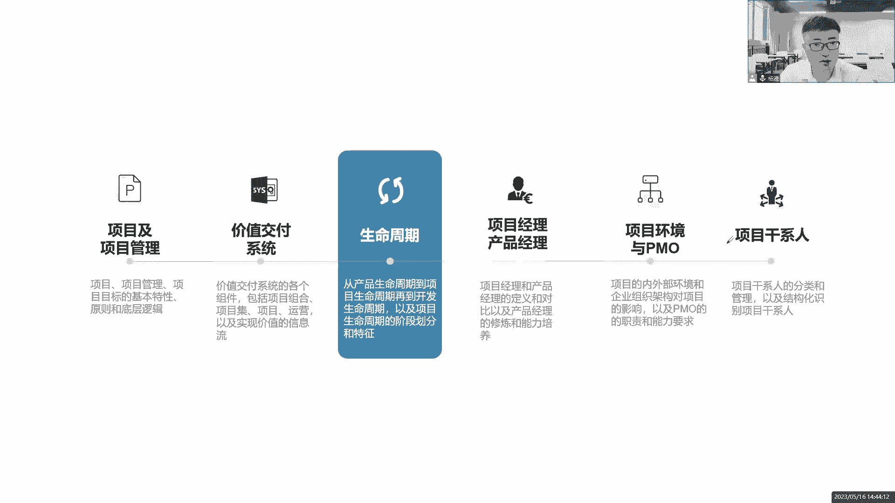

那我们接下来看项目的生命周期，要说项目的生命周期啊，那我们首先得先说说产品生命周期，从一个大的范围来讲，让大家看这个图，下面这个图它就是一个产品的证明中心，做项目，这个项目做完之后。

是不是产品就完了没有啊，因为我们产品是不是还要运营啊，运营怎么运营，投入市场，引入市场，在这个市场里面会慢慢的成长起来，我们的用户会越来越多，然后呢达到一个饱和，达到一个成熟。

最后呢为什么又下降又衰退了，为什么要退出市场呢，因为有新的产品，因为有什么市场的竞品出现了，那你被淘汰了吗，你不就退出市场了吗，哎这就是我们说什么，在运行过程中，他会也会有一些生命周期在这里面。

那不管怎么说，从项目的概念到项目的开发，到项目的产出，以及到整个产品的运营，它都是我们的产品生命周期，所以产品生命周期是指，当前一个产品从引入法的成长，让他成熟到衰退了，整个什么一个演变的过程。

在这里面，那在这个产品的生命周期里面，大家注意一个点哦，有没有可能我们刚刚投入市场，获得了客户的一些反馈，这些反馈让我们开始了一个新的项目，有没有可能刚刚投入市场诶，我们有了一个新的反馈哦。

客户给我们提了一个非常非常多的有趣的，有价值的一个需求，我们要落入进来，但是你光靠运营，他们是解决不了问题的，你只能通过项目研发团队重新落入，把这个需求落入到项目里面来。

那只能什么以新立项的方式来开展工作，所以我们阐述了一个新的项目，在项目成长的过程，但是这个产品的成长阶段，而我们越来越多的人去使用了，于是乎就有越来越多的人给我们提出需求，让我们去增加特性，增加功能。

增加内容优化性能，又有很多的项目开始去做了，同步的开始做，是不是包括后面成熟阶段，还会给我们提很多很多一些需求，让我们去改去改去改，那你要改也是按照项目的方式来看，你怎么能随便就把它改掉呢。

一定是启动一个小的项目嘛，调整调整优化优化就可以了，是不是在产品生命周期的各个阶段，我们都有可能会产出一些新的项目啊，那么这些新的项目，如果说他们是有依赖关系的诶，纳入项目记，诶。

纳入项目基这么多的工作，哪些优先级比较高呀，全部纳入到项目组合，那你有没有发现我们的项目集，项目组合以及单独的项目，其实也是可以对标到我们的产品生命周期，这里面，所以我们可以用一句话来说什么呢。

产品生命周期里面它包括了若干个项目，这些项目对应的就是他自己的项目生命周期，这些项目如果具有依赖关系，可以纳入项目集来管理，这么多的项目，哪个优先级更高，如何分配资源，可以纳入到项目组合管理来。

一起来开展工作，这就是我们产品生命周期里面的各项工作，以及项目，项目集和项目组合，它在产品生命周期里面的一个地位。

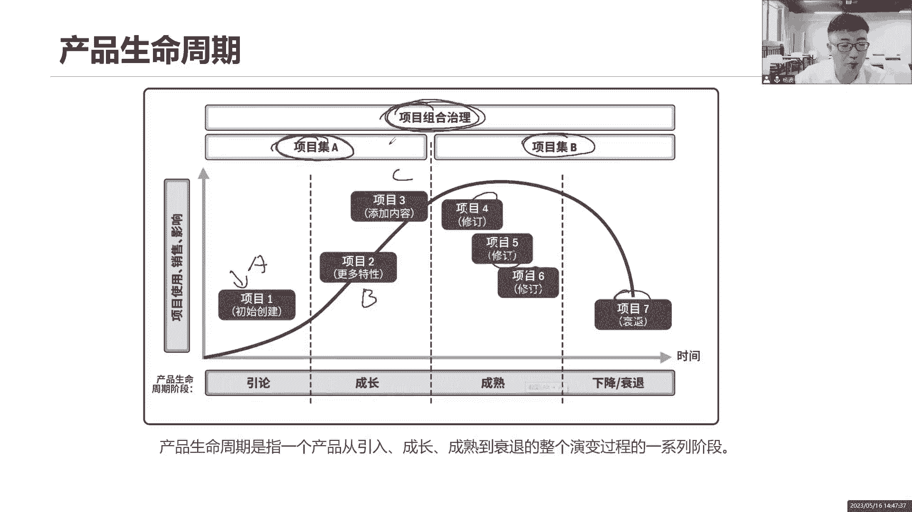

而它的引入哎就这么解读出来了，那对于产品的表现形式，在产品生命周期里面，我们是不是有很多项目集，项目组合以及单独的项目咱都有，然后呢在产品生命周期里面，我们有单独的项目管理，产品生命周期里面有多个项目。

多个项目就意味着有多个项目生命周期，还有呢项目集类的产品管理。

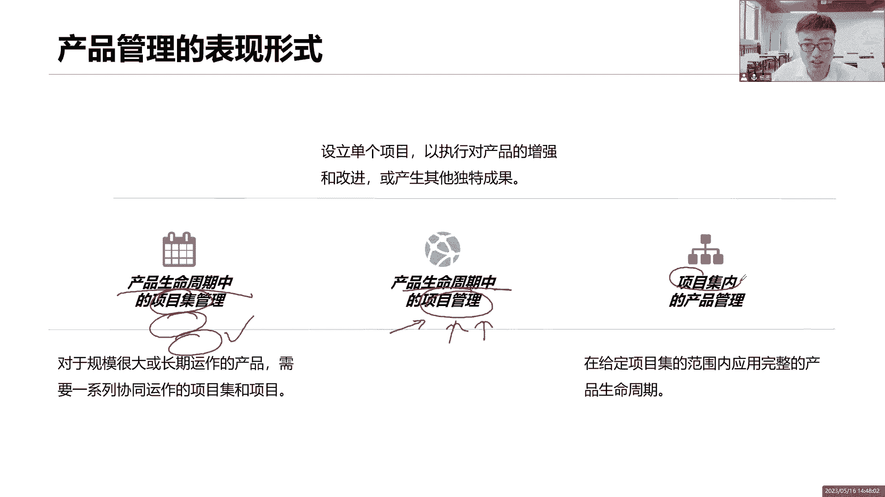

这个怎么理解，你回到这儿来看吧，这是不是一个项目集项目，其他可不可以纳入一个单独的产品管理来做，这也是让这个单独的产品管理啊，产品生命中嘛，这就是个小的产品生命周期，这也是一个小的产品生命周期。

只不过是个子周期而已，它依然是属于我们整个大的产品生命周期，都可以，包括项目组合，也可以拉到什么，我们的产品生命周期都可以没问题啊。

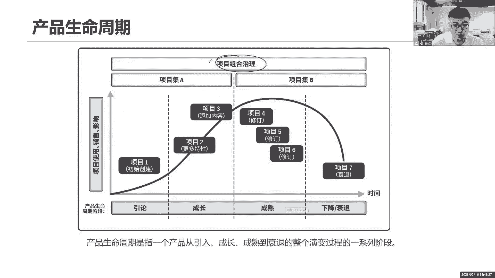

所以项目集体的产品管理和产品管理里面的。

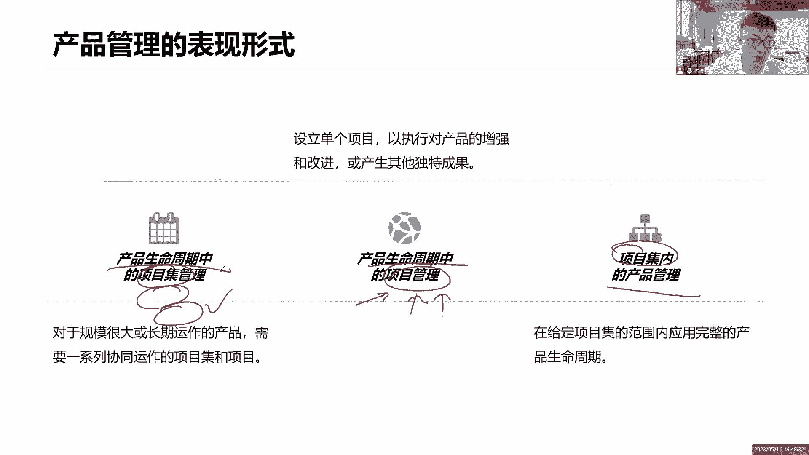

项目集管理它是不一样的，要看你站的角度是什么情况，那就是说既然说到了项目产品生命周期，我们就要看看项目生命周期了，因为产品生命周期里面包括了若干个，项目生命周期，什么是项目生命周期呢。

说项目从启动到完成临时性，是不是项目有启动时间，有完成时间所经历的一系列的阶段，一个项目它把它划分成了多个阶段，那你看这个地方，是不是在一个项目生命周期里面，我呢把它划分成了多个多个多个阶段。

划分阶段嘛，好那这个阶段大家注意这个阶段怎么划分的呢，取决于当前我的行业的不同，我的项目不同，该怎么划分就怎么划分，只不过它有一个什么通用的阶段划分，A有一个准备开始启动项目了。

然后呢开始准备规划项目了，然后呢按照这个规划的项目来去执行，最后的项目收尾做结束，而通用的一个四个生命周期，四个阶段在这里面，所以说要想做项目啊，咱得把它划分成一系列，一系列一个小的阶段阶段。

后面呢我们才会去做什么事情。

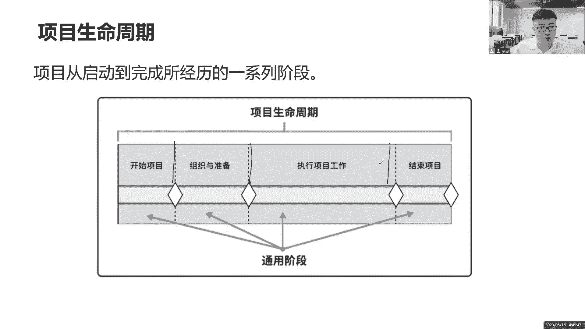

做检查，做验收，以便于我们去管理我们的项目，来项目生命周期的三个曲线，第一个曲线看这随着时间的推移啊，我们的项目的影响程度，刚开始项目早期风险这么高，为什么同学们思考一个问题。

项目早期为什么风险就这么高呢，项目早期诶很好，因为信息不足，对不对啊，信息不足意味着具有不确定性，不确定性很高，那它的风险自然就很高，随着时间的推移，我们的成果，我们的文档，我们的组建。

我们的可交互物都在不断的产出，我们的计划目标范围，这些什么都非常非常的明确了，不确定性降低了，这个风险就跟着降低了，诶，这是第一个含义，第二条曲线变更的成本，项目早期我们变更成本是非常的小，非常小。

意味着什么，因为毕竟我投入的资源很少，我投入的时间很少，我投入的精力很少，项目早期无非就是做一个什么可行性分析，做个市场调研啊，做个商业分析，做个市场规划，就这么几个人，如果随着时间的推移。

我们会投入大量的人力资金进去是吧，我们要去做研发，做测试啊，如果到了后期你跟我说要改调整框架，调整需求，调整工作，调整优先级，那对我的影响可是非常之大的哦，我不愿意接受了项目，后期你对我的影响太大了。

那既然说项目后期，如果客户他要给你提，别给你改不改，有的是很被动，是不是很被动，意味着我们还是要去改呀，那为了避免这个问题，我们应该怎么去做，避免到了项目后期才给我提出这个要求，让我去改。

所以啊我们很多时候，第一个就用我们前面学的知识，把它项目划分成多个阶段，每个阶段我们都要去检查，在早期各个阶段，我们就可以检查出来哪些地方要去调整，要去增加，要去修改，这是第一个方式，第二个方式呢。

尽早让我们各位相关方，各位项目的干系人领导主管客户经理参与进展，你们尽早参与，在早期阶段，你们提出你们的想法，你们的需求我们满足你的需求和想法，不要到了后面才提出来，那对我的项目影响就太大了。

是不是就这两个比较和谐的观点，第一阶段划分，第二引导我们的相关方尽早的参与进来，尽早的提出你的需求期望，让我把你的需求计划，希望纳入到计划里面去做调整，不要等到后面再调，后面我怎么调啊。

后面没有时间调了，没有精力，调了，没有资源去调了，而且调影响很大。

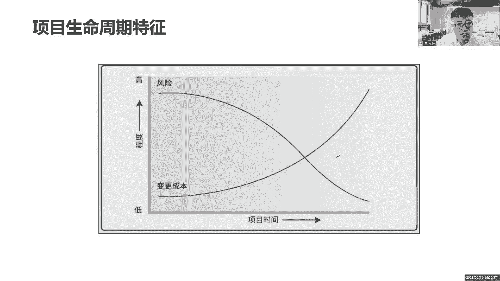

很麻烦，第三个曲线，人力的投入水平，项目早期投入几个人，到了规划阶段又投入一部分，到了项目执行阶段，投入大量的资源，最后快速的释放资源，就这个意思，资源的投入水平在每个阶段，我们投入的资源是不一样的。

你看到没投入的资源都是不一样的，人越来越多，人越来越多，所以啊其实通过这个图也能够发现，我们在整个项目生命周期里面，我们这些人啊他都是有变化的，这种东西，干系人嘛，或者叫做相关方，都可以跟项目相关的。

这些人干性能相关方是不一样的，我们要去管理好他们，让他们能够支持我的项目，不要去反对我的项目，诶这个要大家注意哦，这些内容我们后面再说啊，先不用去看那么多来产品生命周期。

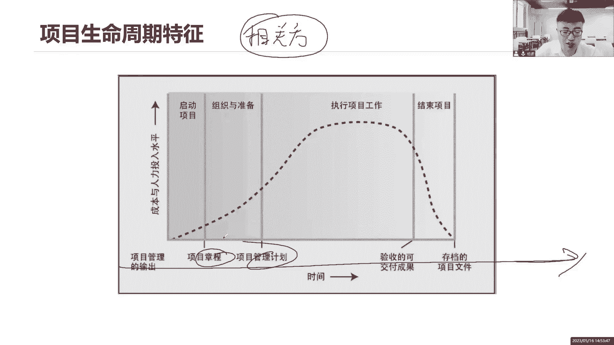

项目生命周期现在做了一个初步了解，在一个项目生命周期里面，我们把它划分成了多个阶段，如果这些阶段里面涉及到了开发，就有了开发生命周期，开发生命周期分为三个类型，这三个类型重点掌握，其实应该叫四个类型。

只不过这两个类型我们把它合在一起，而通常他们也是合在一起的，我们严格的说应该是四个生命周期来，我们第一个一个来看开发生命周期，第一个预测性的开发生命周期，既然叫做预测，重点就在于你是个预测，什么预测呢。

它的场景是什么，产品需求非常明确，范围很明确，需求从一开始就很明确，我很我很清楚知道这个项目有哪些需求，按照这个需求去完成工作就可以了，中间不会有太多的变更变化，在这里面我按照这个需求定这个计划。

按照这个计划来完成工作就可以了，这就是我们说的传统的预测性的方式，也把它叫做瀑布型，大家多写一下，who不行，生命周期就像瀑布一样，从上到下一个阶段，一个阶段一个阶段往下走，往下走，往下走，瀑布型。

但是大家有没有发现一个问题啊，瀑布型的生命周期，它的前提是不是需求必须得先明确下来，我才能够在早期的一个阶段梳理需求，当这个需求做完之后，我才可以做下一步阶段的工作，才可以继续往下去做，往下去做。

每一个阶段做完之后，我才可以进入到下一个阶段，那如果说最后一个阶段你发现问题，你只能往前追溯，往前追溯，往前追溯，有可能追溯到早期你的需求出了问题，那你这个就是个大量的反攻了。

所以预测性它的缺点就在这里面，难以去适应当前的一些变化，而且出了问题会导致什么，会做很大量的反攻，在这里面瀑布型也有预测性，第二种迭代和增量型，那就是说，当前我们是要反复的循环的去开展工作。

基于当前这个产品的可交付成果，我们要去做出来，我们会投入大量的时间去用迭代的方式，以反复的循环的方式来开展工作，我们重复的去开发，重复的去测试，重复的去研究，当这个开发测试吧，发布研究做完之后。

我又开始重新去做开发测试研究和发布，反复循环，反复循环去做这个事情，以迭代的方式来产出，这就是我们说的迭代和增量型，这个迭代周期相对来说会比较长，我们强调了不是要求速度要快速交付，我们要求的是什么。

在这个迭代过程当中啊，要求你们去学习研究试错，尝试优化改进，把这些好的方式融入到项目里面来，我们以增量的方式来交付你迭代，第一个迭代你做完之后，你可能会产出一个成果，第二个迭代呢又产出一个成果。

这个成果一定是在上一个迭代成果之上，我去增加功能优化性能，我在以增量的方式来交付的，这就是迭代和增量型，它并非是一个阶段，一个阶段的逐层往下，而是反复的在持续的循环，当前这一阶段的各个过程。

迭代迭代周期会比较长，适用于大多数复杂一些项目，大型复杂项目，最后一个适应性适应什么，适应变化，适应变更，因为在这个项目里面啊，我们的需求不断的频繁的在变化，随时都在发生变化，我们要快速的去迭代。

快速的产出成果，快速的交付有价值的产品，怎么快，两到四周我就要发布一个版本，两到四周我就要完成一个迭代，它就不仅仅的迭代增量行时间这么长了，我的周期可是很短的，两到四周我就要完成一个交付。

我要频繁的交付各种子集子集，每一个迭代我都会产出一个子集，频繁的产出子集，频繁的以增量的方式来交付，这就是适应，因为它适应什么，适应的是变更适应，其实换句话说，我就是调整调整我的优先级。

调整我们的工作方式，把一些高价值高优先级的需求先拿过来做，以后的我再慢慢来进一步的去增量交付啊，这就是试运行，也叫做敏捷，大家可以写两个字，敏捷敏捷开发就是适应性，交付时间很短，我强调的是快快。

必须快速迭代，快速产出各种子集，就是成果，只不过这个成果是个子成果，它并非是一个最终的成果，那怎么去理解，我们举个例子来说，我们现在要做一个社交app，大家每天刷了社交app是啥，每天在刷。

是不是微信对吧，微信我们现在也要做一个APP，也要做一个社交app，我们的愿景使命是什么，很简单又很粗暴，打败微信占领市场，成为整个社交app的number one，打败微信占领市场，哎哟简单又粗暴诶。

这个愿景非常宏观有意义有价值，我们这个产品呢叫做巨星，你叫微信，我叫巨星好了，我们第一个版本，如果我说我是公司高层，我跟同学们说，我们第一个版本先抄微信的，它有什么功能，我就有什么功能，那么请问同学们。

这个时候你们应该用什么样的开发生命周期，预测迭代还是适应，我让你们超微信，它有什么功能，我就要有用什么开发方法，用什么开发生命周期，是不是预测需求很明确啊，他有什么我也有什么，而且我跟你们说。

中间我不会随便给你改变需求，你就抄就行了，先把它抄过来，这是第一个版本，那你说我们第一个版本好，抄完了预测型，做完了就能打败微信吗，那肯定不行啊，那两个项目两个产品是一样的，你怎么打发微信。

接下来我会告诉同学们，第二个版本同学们会比较辛苦，我要求大家能够快速的交付一些它没有的功能，我要求你们两周就要完成一次交付，快速的适应当前市场的变化，快速的适应当前我们用户的一些，贴了些比较好的需求。

微信你有面对面的建群，我们就来一个，大家站在一起抖手跺脚，就把这个群建起来了，都不需要扫码，我们同时摇一摇，我们同时跺跺脚，微信群就建好了，爽不爽，微信也没有吧，我有啊。

而且我要求你们两周之内就完成交付，快速交付，然后我又给你们提了一些更多更多的新的需求，好多好多新的需求，让你们尽快的交付，尽快的产出，尽快的投入市场，占领市场，让用户下载去使用，这是什么开发方法。

适应性好了，第二个大版本，我们融入了很多新的功能，新鲜的玩意儿终于打败你微信了，我们占领了市场，第三个大版本，既然现在我们都打开微信了，我们是number one了，那你觉得我们有必要还每天加班加点的。

两周一迭代吗，没必要了，我们就可以放缓步骤，我们要去研究学习学习，怎么样能够打造出一个生态系统出来，给大家更多的时间去反复的循环的去尝试研究，学习改进优化调整，给你们更多的时间去做这些事情。

我不强调速度，我希望你们能够不断的去，以真正的方式来交付这些成果，交付这些功能，交付这些优化分多次交付就可以了，不要着急，慢慢来，一步步做，我给你们很长的迭代周期，这就是迭代增量型，就这意思。

以真正的方式来交互功能周期很长，慢慢做，所以大家有没有发现，现在我们说有些产品啊，什么office啊，或者说可能大家很久没用了，这个QQ他们的更新换代是不是比较久啊，好几个月甚至一年才会更新一个版本。

什么叫201620172018版本，20222023版本，一年一个版本，周期很长，他在不断的去什么迭代，尝试优化改进，重复去做一些事情，这就是迭代增量型啊，这些大型的软件，这些软件大不大型，非常大型。

你看这些软件里面的功能有多少，几百个功能在这里面，其实现在微信也是一样的，你微信也是一百一百一两百的功能吧，那我们平时用到了多少，好多都没有用到。

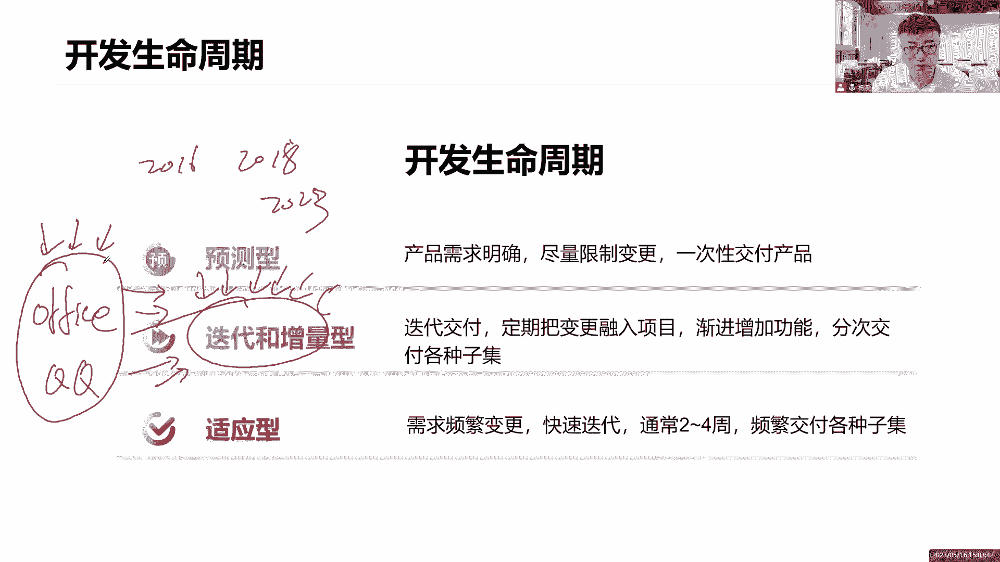

用不到啊，真的用不到好，你看这里开发生命周期，我们预测性的开发生命周期什么，一个阶段一个阶段，从上往下像瀑布一样往下走，前一个阶段做完我才可以开展，后一个阶段才可以开展价下正进一步的阶段。

一步一步的往下走，预测性的生命周期迭代呢适应呢我反复的迭代，反复的重复反复的去研究诶，基于当前我的一些工作，为了重新买去优化，为了重新调整优先级，基于当前这个迭代，我来看看下一个迭代。

基于当前迭代的产品增量，我来做下一个阶段的工作，以增量交付，然后再基于当前的增量，又开始在下一个阶段的工作，反复的持续的不断的去做一些事情，就你在一个迭代里面，我们可能就会做什么需求设计构建测试。

下一个迭代又开始做需求设计构建测试，所以说是反复循环了，在开展这些各项的开发工作。

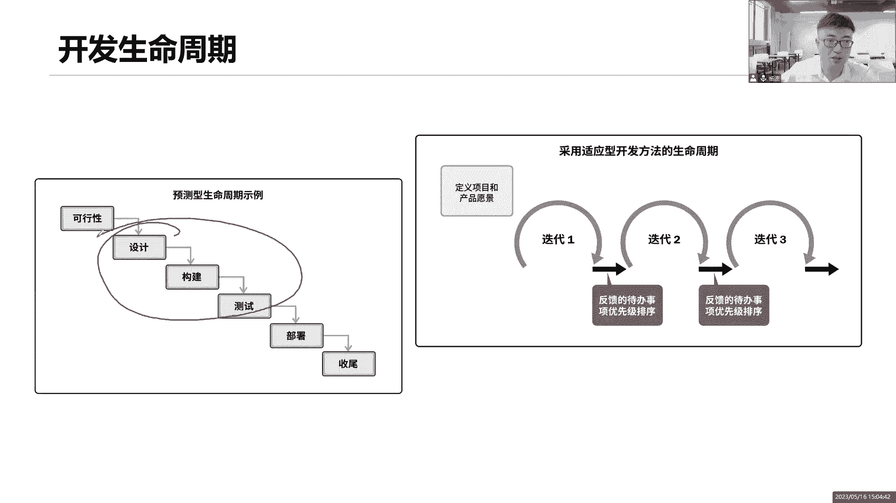

这就是我们说的适应性的开发方法啊，那么阶段的划分，所以这个项目一个项目里面，我们可以划分成多个阶段，这个阶段的划分怎么划分的，基于行业的不同，基于特性的不同，基于项目的特性，基于你的管理的水平。

你的管理的要求，它的画面是完全不一样的，你说我们搞it的早期的市场分析，然后呢需求的分析，详细的设计和产品的编码代码编写，然后测试，如果我们是搞医疗的，市场调研，临床的医学研究，医学的注册，后面是什么。

医学的这个生产，如果你搞建筑呢，市场调研，画设计图，看施工，建造监督监呢，后面是竣工，后来验收，是不是行业的不同，我们阶段的划分点是不一样的，那我们为什么要划分阶段，更好的管理，在每一个阶段的时候。

我们都要去什么，有一个里程碑，这个里程碑其实就是为了验证我们工作，做任务到不到位，他有一个阶段关口，希望能够尽早发现问题，尽早纠正，尽早找到解决方案，不要等到后面才发现。

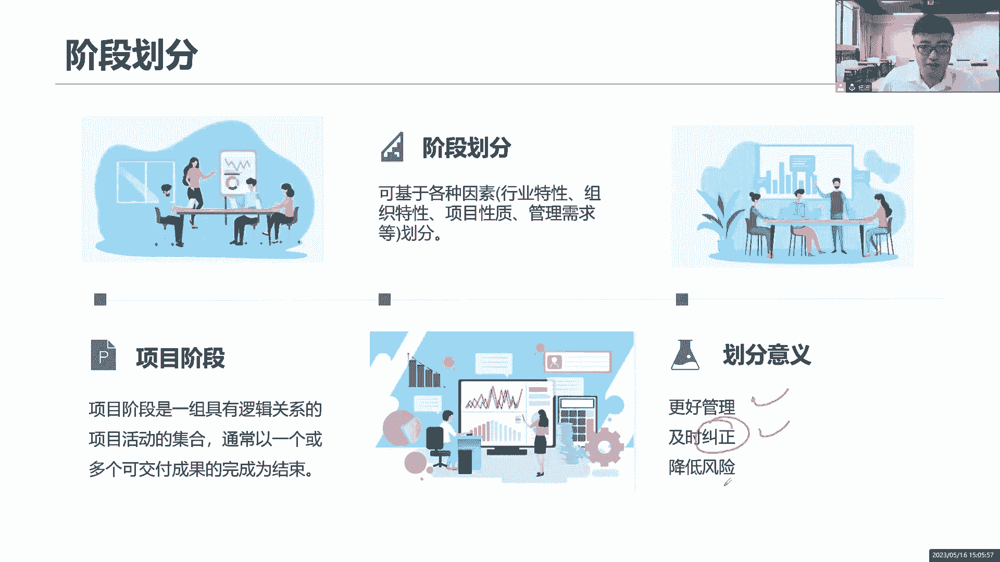

那你这个风险太大了，所以就降低你的风险阶段，关口其实就是每一个阶段它都需要有一个关口，关口的目的是干嘛的，就是审查，就是检查检查当前我的工作，记一下我的目标，我的需求有没有实现，他怎么检查的。

那么就是一个检查点，就是个决策点诶，他说的决策点啥意思啊，我当前走到这个阶段的末尾了，我能不能够进入到下一个阶段，我得做出一个什么决策，到底是进入下一个阶段，还是说当前有问题，我整改之后才进入。

或者说甚至于我直接终止这个项目诶，当前啊我发现这个绩效严重的偏差，严重超支，严重滞后，低效不对劲儿，赶紧立即止损啊，终止这个项目，没问题吧，都可以，这是我的决策结果，那你怎么决策呢。

来我们看看这个很重要，看绩效，拿出我的项目管理计划，看绩效，拿出我的项目章程，看我们的目标要不要做调整，拿出这些相关的商业文件来，看我们的商业需求还在不在，是否符合我们的业务目标，做调整，要不要做调整。

是不是要整改之后才能够进入，还是说我直接进入下个阶段，我继续做下个阶段的工作了，这就是你的接触依据，这些文件我们后面都会去学习，会拿出来进行细讲，当前是什么，我们还不了解。

但是我们知道一个项目它可以划分为多个阶段，每个阶段的后面都有一个关口，来检查我们的绩效目标，或者说是一些业务相关的一些需求，有没有实现商业价值，有没有符合要求来做一系列的检查工作，在这里面的，好了。

既然这里说到了看商业论证。

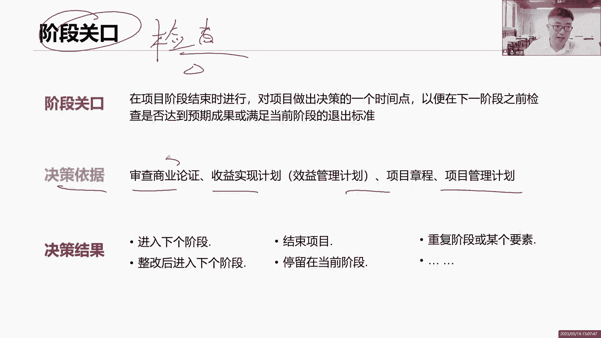

收益实现计划，这些跟商业相关的前期的需求工作，咱是不是也得拿出来分析分析呀，来看一看哎，商业论证是个什么东西，我们一起来看看这个商业论证啊，他是说当前这个商业论证是指，当前我们提议项目的价值主张。

包含各种相关的财务的一些分析，商业论证包含了我们的战略的一致性的内容，经济的可行性的研究，投资的什么一系列分析，所以其实一总结啊，包括这里说了，你看如果说与需求保持一致哦，不再一致。

他说的是不在一致的话，我们就有可能朋友们终止项目，考虑价值不可能产出预期的价值，不可能产出一些既定的收益，在这里面我们就及时止损终止项目，所以他其实就是给我们做了什么决策依据，大家写这四个字，投资依据。

多写两个字，投资的决策依据，这个项目值不值得投资，投资多少，能不能产出预期的收益和价值，这个价值是否和我们商业目标是保持一致的，我们目标收益和组织战略又是否保持一致，你得还和战略保持一致。

这就是我们商业论证，这个商业论证啊，它是什么，是项目启动的理由，那他怎么说的，他解释了为什么说我们的商业需要值得投资，投资决策为什么值得投资，我怎么评估的，把这个工具圈出来特别重要。

这是我们项目早期用到了，一个非常核心且重要的项目分析工具，成本效益分析怎么样来理解它呢，你要这么去理解，首先第一个我们的商业论证啊，前期是不是得有一个需求评估，还记得吗。

需求评估告诉我们当前我们的需求从哪里来，我们产出什么样的价值的产品，这个价值是有限的还是无形的价值，需求评估，需求评估得到我的业务目标，然后呢我会把这个业务目标抄过来，写在我的商业认证里面。

我要知道我的总体的业务需求，业务目标是什么，然后呢我要去提出一系列的备选方案，来应对这个目标，备选方案，提出提出一系列的备选方案，哎有方案A方案B方案C方案D，这些方案他们都能够应对这个业务。

都能够满足这个商业需求，你比如说这个项目我们自己做这个项目，我们分包出去，这个项目我们整包出去，这都是一系列备选方案，那我到底选择哪一个方案呢，你得推荐一个方案出来，对不对，你得推荐一个方案。

那你怎么推荐，用它就是用它，你既然现在想要去启动这个项目，你要投资这个项目好，那你得告诉我你的方案是什么，你的投资方案是什么，你得选出一个方案，我就会用成本效益分析，这个时候大家注意成本效益分析。

在这里面就用到了这么多个方案，我到底选择哪一个方案出来呢，性价比最高，花最少的时间投入最少的资源和精力，产出最大的价值，并且快速的回收成本，以产生利益，这就是一个性价比最高的方案。

我会用的成本和最终的收益来进行分析，以到底这个方案选择哪一个好，B方案选出来，通过成本效益分析选出B方案，第四个评估目标，评估我们的目标收益，基于这个B方案，你能够为我们企业创造多大的价值。

我要做一个评估，能不能产出这个价值，你要确定啊，这就是我说的商业论证啊，他前期里面要做的一个成本效益分析，它是用来帮助我们选备选方案的，商业为项目所提供理由，并解释为什么开展这个项目。

提供了有关哪些商业的目的目标项目的目标，项目的目的都是在我们的商业论证里面的诶，那这些目的和目标是不是都得去抄到我的上，后面的这个项目的文件里面去啊，我们的项目立项文件里面去好商业战略。

那必须得保持核武的组织战略目标保持一致啊，这个是一定的，我们开展商业分析，商业的评估，商业的一些需求，最终一定要符合当前我们企业的商业战略的，符合我的业务战略，符合我的业务目标。

哎这就是我说商业论证要开展的一些工作，那你说这个商业论证，最终你评估出来能够为我们企业产生一个亿，请问你怎么评估的，你如何评估的，你凭什么评估出来，当前这个项目能够给我们产出一个亿，你是怎么测量的。

是不是我们得写一个补充性的文件来说明一下，论证论证，只是说当前这个项目启动的理由是什么，项目的背景，目的和目标是什么，怎么样选出一个最佳的性价比更高的方案，这个方案能不能够为我们阐述一个亿。

这一个亿是否符合我们组织战略目标。

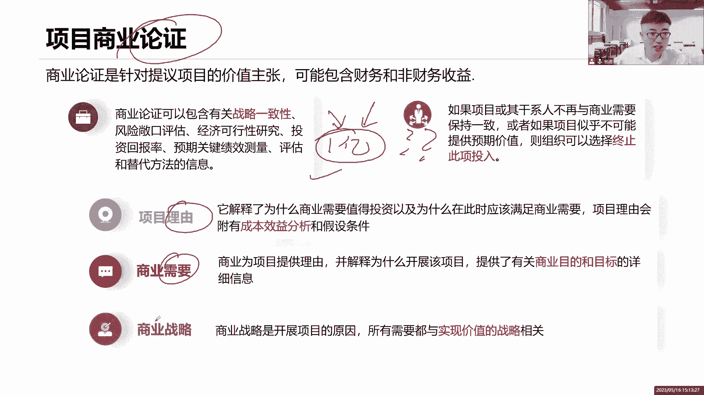

好了，这么一个亿怎么去测量呢，下一个计划拿出来，收益实现计划也叫做效益管理计划，都可以，收益实现计划是一个补充性的文件，它会告诉我们当前先把目标收益超过来，来自于我们的商业论证，目标收益超过来。

然后这个目标收益是否和组织战略保持一致，又来了，又和我们的商业战略是否保持一致，你看我们一直都在强调，项目的目标一定要和组织的战略目标保持一致，所以我们在定计划，在做论证的时候。

就把这些目标和这个战略一致，目标拿出来做一个论证，说明以符合要求，我们确实是一致的，我们这个目标是符合smart原则的，和我们战略保持一致，接下来谁来测量啊，项目经理还是我们项目的发起者。

还是什么经理主管还是高层，我也不知道，但是这个人它叫做效益责任人，既然这个责任落到你的身上了，未来由你来验证我们的目标收益，有没有去实现好，你来验证具体是谁，我们根本不要去关心我们，只要关心这个人。

他叫做效益责任人，那么请问你在什么时间去衡量smart原则的T，是不是运营一年两年还是10年，到了这个时间节点，你去测量时间，实现目标效益的实现，它有一个时间限制，请问你怎么测量，用什么测量指标。

NPS净现值是吧，投资回收期，投资回收率，效益成本比，把我们的这个各种相关的财务指标，这些测量指标咱得说清楚啊，用什么指标来验证这个一个亿，有没有达成战略统一指标，最后有没有风险。

有没有哪些风险会影响我这个目标的收益，你看风险从一早期我就开始考虑了，而不是等到项目一开始，我才开始做这个风险的管理和控制和规划，项目的立项之前，我就已经在考虑啊，有哪些风险会影响我当前最终的目标。

收益的实现，所以最终收益实现计划用一句话来总结，先把目标效益超过来，这个目标效益能不能够与我们的组织战略，保持一致，要想实现这个目标效益，谁在什么时间，用什么方法来测量这个目标收益有没有实现。

这个收益是否和我组织上的目标保持一致的，以此来衡量当前为了收益实现计划释放线，完整的。

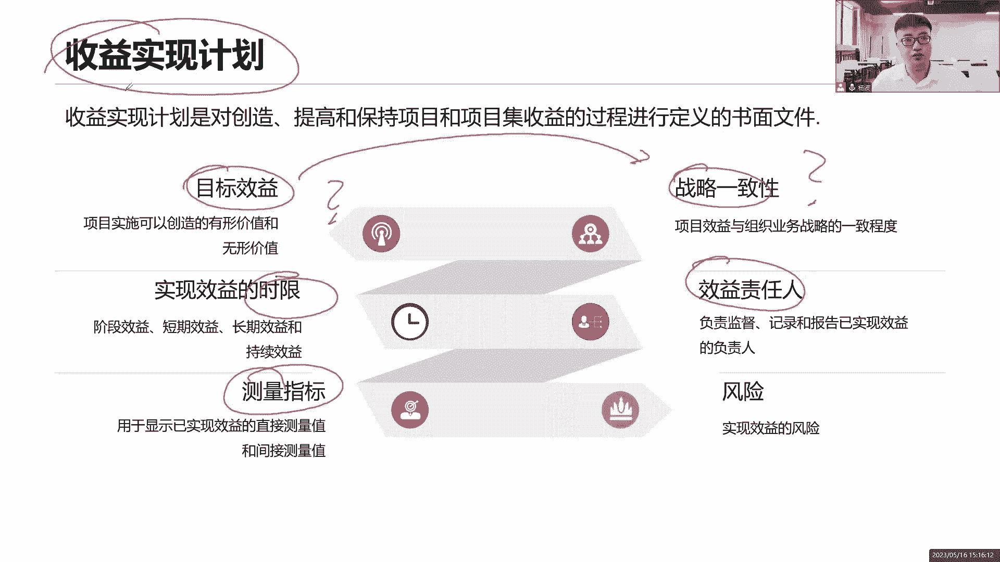

这就是我的社会实践计划，以他来补充我们前面的商业论证，你说这个一个亿到底有没有达成，怎么样来测量，你确定一下哎。

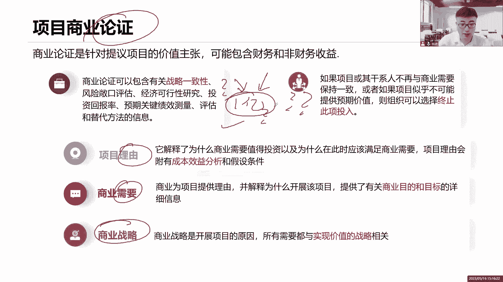

这就是我们商业分析，所以通过这个图来我们一起来解读，解读这个图很重要，大家注意你要理解它，同时未来也还能够把它画出来，那就更好了，项目早期的准备工作是不是先有一个需求评估，先开始做我们的需求评估。

搞清楚需求从哪里来，业务目标是什么，做这个项目的价值是有形价值还是无形价值，你先把这个业务目标先确定下来，基于这个业务目标，我来把它抄过来，我现在要做一个事情，怎么做商业的分析，做商业的经济可行性分析。

看这个项目在商业层面是否赚钱，是否有收益是否可行，如果可行，我才会立项，所以我先做商业分析，做商业分析，把两个内容拿过来，第一个商业论证，第二个收益实现计划，也叫做效益管理计划。

商业论认识者先把目标抄过来，然后呢，我们用备选方案提炼出，有哪些方案可以实现这个业务目标，接下来用成本效益分析，来选择一个性价比最高的方案，这个方案一旦确定之后，我来评估一下目标能不能实现，一个亿。

两个亿还是十个亿，五个亿，评估目标，这个目标是收益拿出来之后，把这个目标收益超到我的效益管理计划，我要论证，我要验证谁，最后来验证怎么验证，所以我们会说谁在什么时间，用什么方法来验证这个目标有没有实现。

它和我的组织战略是否保持一致的，有哪些风险会影响我当前的目标收益实现，通过这个文件来对它做一个补充和说明，所以你看这个箭头是双向的，你对我做一个指导，我对你做一个补充和说明，基于我们前期的商业分析。

我们分析出来了，确实能够给公司创造一个亿的收入，那一个亿还是很可观的哟，是不是，那就说这个项目他值得做啊，能够给我们产生这一个意义，并且我们能够接受它的投资回收期，投资回报率啊。

根据我们的成本和收益来分析，这个项目可行可行可行好了，立项我们要准备开始项目了，我们要做一个事情，立项立项就得做立项相关的事情，写你的立项文件，给你的项目授权，给你的项目经理授权。

然后项目经理拿着授权之后开始规划你的工作，定义了项目管理计划，按照计划去执行，最后项目做完做完之后，设备这不就是项目生命周期，我们做项目早期的工作吗，先看项目早期的工作，这四个工作都是项目早期的工作。

那至少我们现在讲到的需求评估，商业分析，商业项目章程呢，这是我们后面要讲的，它就是一个立项文件，也是属于我们项目早期的工作，你要先立项，立项就要写个立项文件，找领导签字确认，已授权批准，好好了。

先把我们这个逻辑先梳理到这。

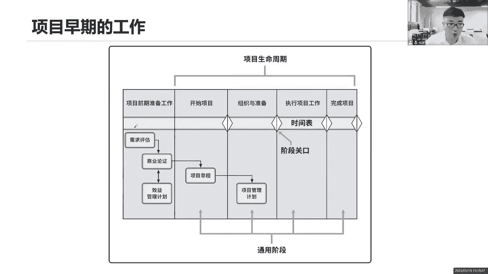

至少先把它搞懂就可以了，接下来继续往下看，项目管理的过程组分为五个过程组，哎项目可以启有启动组，规划组，执行组，监控组，设备组，先启动项目，启动项目开展工作，准备开展工作，然后要开展工作。

你得规划对定义和计划按照计划去执行，在执行过程中去监控你的绩效，这个做完之后收尾工作就完事了嘛。

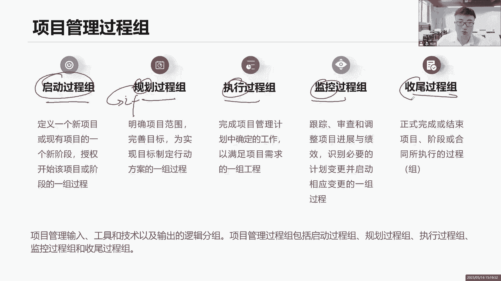

那五个过程组，所以用这个图，我们用一句话来总结前面的知识，在一个项目生命周期里面，我们可以对项目划分成若干个阶段，每一个阶段下面都有一个阶段关口，以及帮助我们验证我们的绩效目标，需求是否有做调整。

是否有实现，看看是否能够进入下一个阶段，还是说要调整之后再进入下一个阶段，或者说直接止损终止项目，这是我们阶段关口要做的事情，阶段关口取决于它的划分，取决于当前项目的不同行业的不同阶段，关口的目的。

是为了帮助我们能够更好的去管理项目，尽早的去识别问题，识别风险，来一进展的调整，以降低我的风险，在每一个阶段里面，我们理论上来说都可以开展这五个过程组，你说每一个阶段，我们是不是应该先开始这个阶段。

然后准备好这些计划，按照这个计划去执行，你去监督，然后这个这个阶段做完之后，我要收尾才可以进入到下一个阶段，下一个阶段我又继续开始做启动准备工作，然后呢规划定计划，按照计划去执行。

执行过程中有没有问题要去验证，最后这个阶段做一个收尾，又进入下一个阶段，如果你是最后一个阶段，我就直接结束项目就完事了啊，技术项目，所以说每个阶段理论上来说，都可以开展这五个过程组，这五个过程组啊。

按照知识领域的话，未来又可以把他们划分为十个领域，那么这十个领域是我们未来要去去调整的。

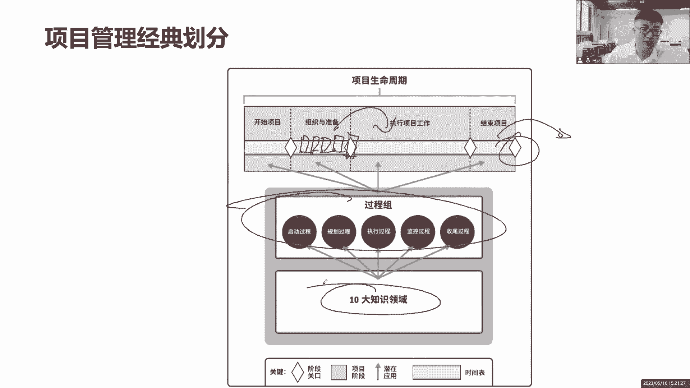

要去对接的，要去对比学习的，那这就是十个领域啊，你看范围啊，这个整合范围进度成本质量资源沟通风险，采购相关方刚好是吧，刚好我们说了十个领域，在这里面好，这十个领域啊，大家注意啊，这是我们传统的方式。

一个非常经典的管理活动，后面我们会基于在工作绩效域里面，和这些活动来做一个对接，和一的匹配，现在我们并不需要了解这些活动，具体在干嘛干嘛，先看一个初步的理解就可以了，你看是不是我们当前有这么一共。

49个管理过程啊，这49个管理工程，按照他的逻辑呢，我们把它分成了启动组，规划组，执行组，监控组，还有设备组，然后按照知识领域，又把它划分成了十个知识领域，那这十个领域都是我们未来去专门去学习的啊。

他们说传统的经典的15至尊图啊，五组十域图。

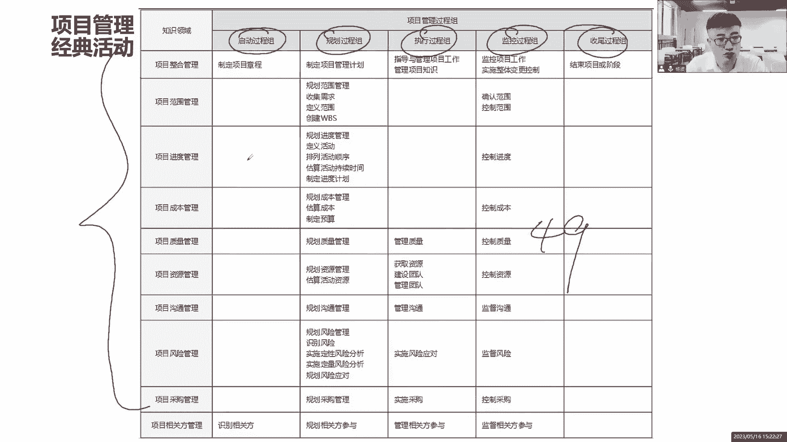

我们经典的49个管理过程的分布图。

