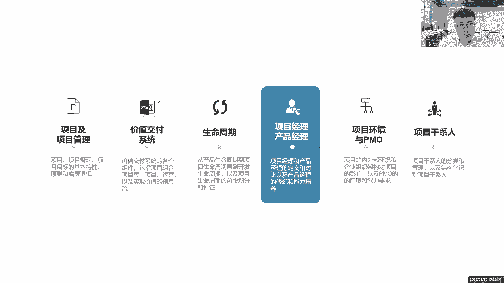
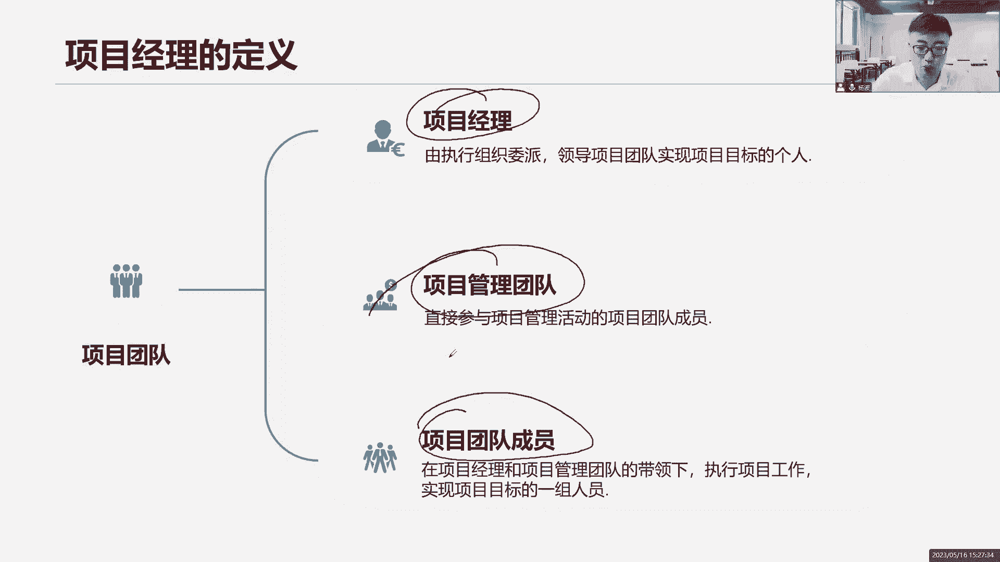
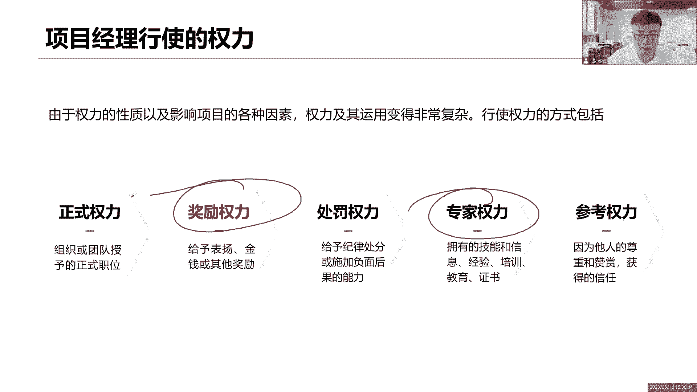
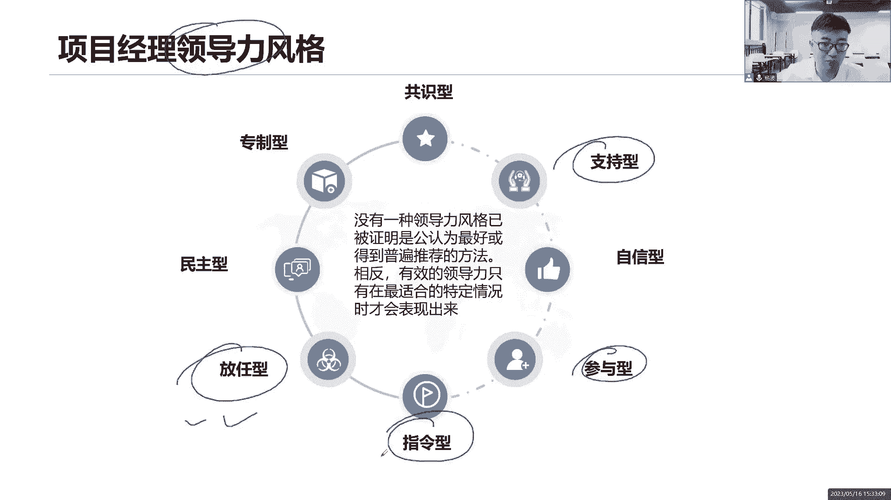
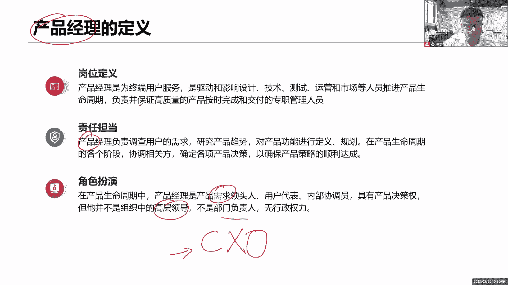
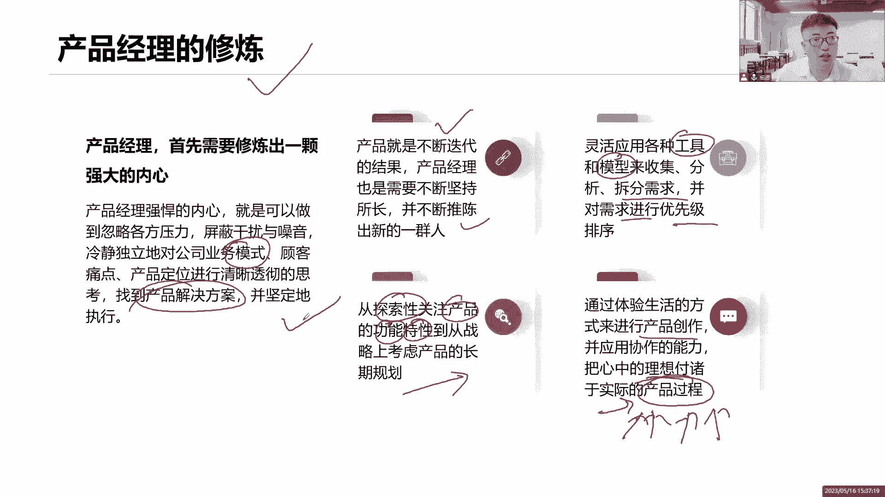
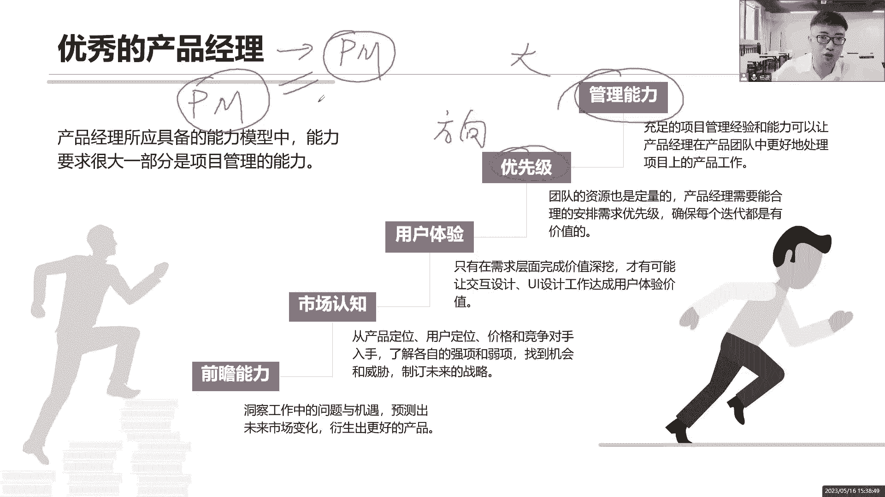
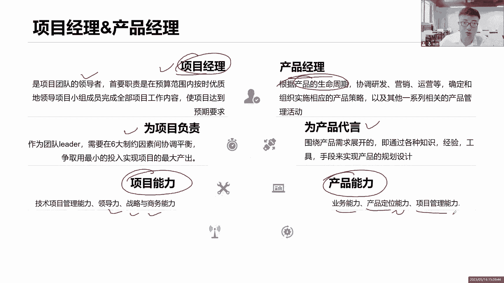
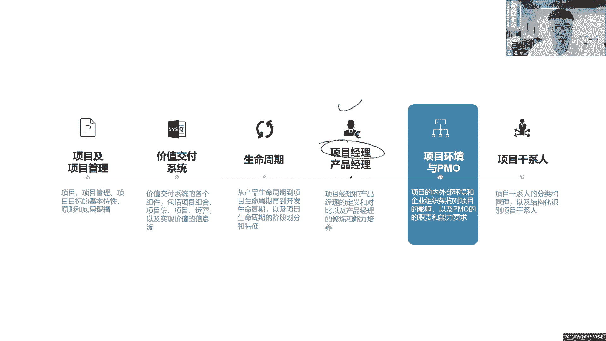

# 全新录制PMP项目管理零基础一次顺利拿到PMP证书 - P5：PMP精讲课项目经理和产品经理 - 北京东方瑞通 - BV1qN4y1h7Ja

接下来来看看另外一个概念，项目经理的一个定义，怎么去理解，我们说项目经理呢，对于项目经理的定义，我们看书上怎么描述的哈，项目经理是由执行组织委派的领导，我们的团队人员实现团队目标的一个人，他是一个人。

废话，这句话好理解，没有什么很难理解的点，但是关键是在这里大家注意一下，这是啥团队项目经理啊，你要有效的利用好我们团队的力量啊，不要什么事情都亲力亲为去做一个事情，大家注意哦。

项目经理你应该是领导团队去实现目标，而不是你个人英雄主义，什么事情都是你自己做，你看不惯你的团队人员，他们做事的风格方式，你觉得他们会出错，你要把控到细节，你要提高质量，你亲力亲为错了。

你要是凡事都亲力亲为好了，意味着你是整个团队的瓶颈，团队成长不起来呀，什么事情都你自己做了，你累不累啊，你会发现每天工作八小时，十小时之后很累，而且你自己的事情还没有看到吗，你自己的什么工作的绩效报告。

你的自己的整合工作都还没有做完，全部都在做你团队的事情了，团队都依赖于你，反正知道你项目经理，你能力强，你自己来做，你来你来，你就是平民团队，得不到任何的成长和发展，那么大家再深入思考一个问题。

如果说我没有把我的团队成员培养起来，那么请问我怎么晋升，有没有想过这个问题，就这个位置，你现在是项目经理，你在做没错，你想要往上走，朝着更高级别的一些管理岗位去走，总监级别的岗位去走。

可以你这一走这个位置就空出来了，那么请问这个空出来的位置谁来做他们，可是他们没有成长，你都没有培养他们，他们怎么做这个位置，做不了其他项目经理呢，公司其他项目经理忙得要死，做不了，不可以招聘吗。

可以招聘，但招聘这个项目经理，有你熟悉我们公司的业务吗，公司不愿意承担这个风险，所以这个位置还是得由你来做，你看你是不是被这个位置卡住了，3年五年七年，我怎么还是一个小小的项目经理啊，我怎么看不到。

我只能看到他们，但是始终成为不了他们，就是因为什么你没有培养团队，你没有利用团队的力量，所以说我们说现代项目管理里面，如何衡量一个项目经理管理能力的高低，看的不是你每天加班了多少。

看的不是你产出了多少成果，看的不是你的工作质量有多高，看的是你为我们整个项目团队，为我们整个企业培养了多少人，这是衡量项目经理，管理能力的高低的一个重要标准，你要向往上走，利用团队的力量，记住哦。

在这强调这句话其实很难很容易理解，但是它背后的意义和价值，是需要我们老师给你梳理出来，同学们，你们的眼光格局，思维方式要做调整的，不要觉得把他培养起来，把你顶替了，你被淘汰了错了。

你在不断的去提高你的影响力，提高你的外部可见性，提高你的权利，提高你的能力啊，你能够培养出人才，说明你应该在更大的岗位上面，去培养更多的人才，组织缺的是人才，不是缺了一个项目经理。

项目经理现在市面上一抓一大把，是不是我要的是一个懂业务，懂IT，懂技术，懂战略的复合型的人才，一个不可替代的人才，所以你要培养人才，当你能够培养这些人，你的能力有所提升，有所长进，啊眼观格局放高点。

他们也很重要，因为在一个项目团队里面，不是只有我一个人，项目经理可以管人管事，他们也可以，你可以把你的项目管理团队分成几个小组，几个单元，几个部门都可以啊，开发小组，测试小组，需求小组，什么设计。

还有什么什么什么运维小组都可以，每个小组是不是应该有个管理人员，来管这个小团队啊，这不就是你的管理团队吗，所以除了你自己有管理权利之外，这一帮人也可以帮助你来管理团队，协助着你一起来管理团队啊。

那么这一帮人就是下面干活的人啊，实际干活的人。

项目经理啊，你要注意哦，你的职位会给你带来正式的权利，奖励的权利，惩罚的权利，真实权利是你的职位授予你的，你可以给他们什么，带领团队去开展工作，分配任务，给他们打KPI，你也可以，他们做得好。

表扬激励鼓励，做的不好，你也可以惩罚处罚啊批评，但是你觉得，同学们要想营造一个良好的团队氛围，要想去激励你的团队，到底是奖励还是处罚好，很明显是奖励，是不是每个人都是每个人。

其实每个人他都不希望被别人的观点所处罚，所惩罚，不需要被别人所评价，是希望有人可以认可我，激励我，表扬我，尊重我，相信我，那我才能够发挥我的自我驱动力啊，后面会专门讲一些什么激励因素和激励模型。

那这些都是充分的体现出了我们项目经理，领导力的唉，这些模型后面会去学习，还有两个权利呢是职职位之外的专家权利，在这个项目团队里面，你可能权力很小，但是你在大家心目中树立了一个专家形象。

你是这个领域的专家，这个领域这个技术领域你什么都懂，而你是工作了5年，7年八年十年以上的一个技术专家，你是一个专家呀，大家愿意听你的，相信你的决策，因为你是在这个领域里面是很有经验的。

能够带领大家推动工作的，能够帮我们解决问题的，虽然说你权力很小，但是大家愿意跟着你干，因为你在我们心中树立了一个非常专业的形象，专家形象，还有呢参考权利，你看他怎么说，因为他人的尊重和欣赏而获得的信任。

什么意思呢，它分为两个层面，要么就是我给你树立了一个偶像形象，唉我这个人不仅专业能力很强，我的人际关系能力也很强，大家视我为偶像，愿意听我的指示，愿意听我的下发指令和号令，还有一种呢，我跟你说。

公司CEO是我邻居，公司的部门经理，是我亲戚，你听不听我的，这些人跟我有关，我的后台很硬，你们听不听我的，你们想不想成长起来，想不想被提拔，想不想和我搞好关系，那你们必须想啊，你们不想也得想。

每个人都想成长，每个人都想快速的提拔起来，我利用的是什么关系，是别人的光环，我在狐假虎威这种做法行不行，那肯定不行，是不是啊，你怎么能利用狐假虎威的方式呢，来来强迫别人听你的，那这个也不行啊。

所以最好的方式用专家的权利，用我们奖励的权利来营造团队的氛围。

那除此之外，其实还有很多领导力的风格在这里面，你看有很多，你看公司起码给团队提供服务，提供支持，相信你们是能够成长起来，让你们积极的参与，提出自己的意见和见解，对你们下发指令，我充分的给你们授权。

让你们自己玩去，专治我一言堂，好多好多的领导力的风格，都可以在项目里面去施展，没有一种领导力的风格已被公认为是最好的，或者普遍任何推荐的，没有一种相反有效的领导力是什么，在适合的情况下，适当的表现出来。

这些你都可以用，还有你也可以混合的去使用，没问题，不是说只有一种才好，不是说只有一种才是最好的，没有在特定的时间，特定的场合，特定的时间，那个呃环境下，我们可能会选择多种领导力的风格来混合使用。

我既是放任，又是支持，又是相信，可不可以呀，我把权力下放让你们自己玩，因为你们是一个成熟的团队啊，我相信你们是能够完成的，我给你们提供各种支持，营造环境，营造氛围，让你们在这个环境之下高效的开展工作。

这不一样，说得通吗，可以呀，这不就是我们敏捷项目经理的一个，什么领导力的风格吗，我们是一个仆人式的领导风格，我们是一个管家诶，我们是一个管家服务人吗，做管家的是不是可以的。

所以这些领导力份额大家都可以混合起来去用，在日常的工作当中，你要不断的去改变你的领导力风格，在不同的场合，不同的阶段，项目的团队他会不断去发展起来的，可能刚开始大家啥都不懂，小白下发指令。

你一说我怎么做，他就怎么做，你给他指哪打哪，就像那个挤牙膏一样，你挤一下出来一下，但是后面他们是不是会慢慢的成长起来，成长起来，你该干嘛，让他们积极的参与到这个项目里面，来让他们提出各种想法意见。

你来支持他们的工作，最后呢你要充分的授权放任，因为他们已经成长起来，成熟起来了，他们可以自己做事情了，没有必要。

你还去下发，这里没这个必要是吧，好了说完项目经理，我们来看看这个产品经理，哎呦这个产品经理啊，不知道同学们在你们的企业里面，有没有这个岗位啊，有没有同学们，你们的企业里面的产品经理每天在干嘛。

他们每天是不是在玩需求诶，他们感觉就每天忙的要死是吧，收集需求，分析需求，定义需求，验证需求排列需求，澄清需求，哎哟反正跟你这个需求相关打交道，就这个事情是不是还有什么画圆形啊，定义需求。

总之产品经理确实也很忙啊，那我们看他的岗位定义是怎么说，产品经理为终端用户服务，为客户为终端用户而服务的啊，是负责保证高质量产品交付的一个重要人员，确实要保证产品的高质量。

也就是说你的工作岗位在这个产品层面，你建造产品订单肯定是为产品负责啊，这个产品肯定是为注重用户而负责，任，是不是要交给我们注重用户的，在整个产品生命周期里面，你都得来，你都得去负责一些各种各项工作。

职责是什么，责任担当需求是不是我你你的职责，你的职责，你的阵地就是搞需求，在产品生命周期的各个阶段，把这个需求做到位，协调相关方案，确定各项产品决策，产品决策对产品的达成共识，也就是说啊。

这个需求还是由你来决定的，当前这个需求怎么做，优先级是什么，先做什么后做什么，这个产品的发展方向是什么，整个这个产品各个阶段应该完成哪些工作，产品经理你来定啊，项目经理按照你的指示来开展工作。

所以你的角色是什么，在整个产品生命周期里面，你是一个需求的领头人，牵头人方向给我们定方向的一个人，你代表的是用户，你代表的是客户诶，你具有产品的决策权，这个产品能不能验收，你说了算。

这个产品先做什么后做什么需求你说了算，你是产品经理哈，但你并不是公司高层，什么叫高层，这些鬼都是我们公司的高层，都是高层，所以管你是什么东西，反正你就是C什么O这些都是公司的高层，但你觉得我是吗。

哎呦其实我就是一个产品经理啊，哎呀我就是做产品的，我就是玩需求的，我还达不到这个level是吧，我也不是什么部门负责人，我也不是什么行政行政部门的经理，不是我其实就是一个项目的产品经理。

我和你的项目经理，我们一起协作来开展工作，诶。

我们就是一个小小的经理层面啊，产品经理你看要要修炼自己产品，这个看看就可以了，怎么去修炼，那产品在不断的迭代，作为产品经理呢，我们要成长在每个迭代里面去，都要什么推陈出新来培养人才。

然后呢对我们的产品需求也不断去维护，你对接的是公司的业务，把你对接的是业务，你搞的是需求，在这里面你要不断的去探索，我们当前的产品有哪些功能，哪些特性，哪些需求在战略层面是能够做到长期发展的。

你要做需求的启发，然后呢灵活地运用了各种工具模型，做圆形法，以梳理与需求，以排列需求顺序，甚至分解需求，带领团队我们一起来做这个事情，没问题啊，让他对产品进行什么启发和创作，把心中理想付诸于实际的行动。

把你的想法融入到产品里面，把客户的想法，把相关方的想法，把大家的希望融入到产品里面去啊，以推进我们的产品，以找到产品的解决方案，坚定的去执行这个方案就可以了。

那这是你的产品经理的一个修炼，一个优秀的产品经理要有前瞻能力，是你不管考虑当前，你还得考虑未来，这个产品能不能够符合市场未来的发展需求，那说到市场，那要对市场业务的了解啊，产品经理啊，你必须懂业务啊。

如果你连业务都不懂的话，你怎么去处理需求市场的行业的业务啊，你都得去熟悉，然后呢做好用户体验，你是为用户负责的，你要让用户去体验，你画出你的原型，做出你的原型出来，让用户去体验，反馈反馈给你的需求。

同时你要排练什么需求的优先级，这个优先级其实就是给我们团队定方向的，先做什么后做什么，产品经理你要不要带你带领团队，不是说项目经理财管理哈，产品经理也得懂管理能力，因为你下面可能还有一帮的小产品经理。

你是一个大产品经理，大产品经理负责整个大产品的规划演进，小额产品经理呢，负责当前整个部分一个小产品的他的一个需求，他在这个子产品生命周期里面的一些需求，那些定位，所以啊你既然说是一个经理。

那你也得等管理啊，你得带团队啊，你得知道我，你怎么和我项目经理，我们一起来协调，你是product manager，Was project manager，我们都是pm，我们两个一起来协助开展工作。

所以我们都得懂管理，否则我们之间有冲突的，来再来看对比，项目经理，你是整个项目的领头者，而产品经理呢，你是站在整个产品生命周期的，整个产品，从产品的概念到研发到测试到发布，到后期的运营。

全都是由你来进行进一步的去监督了，当然在整个项目层面是由我来负责，尤其是项目的一些研发项目，一些绩效项目，一些报告会由我来负责，那么对项目负责，那好是我项目经理，但是对于产品来说，就是你了。

加上你的产品的需求，把一些产品的一些设计，你产品后续的一些发布由产品经理来做决策，我关注的是我项目的管理能力，我的领导能力，我的战略商务能力，我的市场的洞察能力，产品经理你关注的是产品相关的能力。

从业务层面，从产品定位，产品的方向，产品的需求。

以及你自我的团队的一些管理能力啊，这是我们项目经理和产品经理的一些区别，这部分大家大家了解就可以了，主要是了解项目经理，对产品经理。

